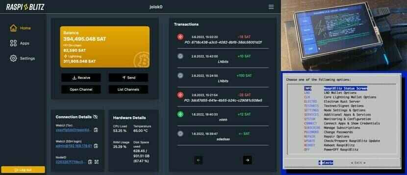

El RaspiBlitz es un nodo Lightning de bricolaje (LND y/o Core Lightning) que se ejecuta junto con un nodo completo de Bitcoin en una RaspberryPi (SSD de 1TB) y una pantalla agradable para una configuración y monitoreo sencillos.

El RaspiBlitz está dirigido principalmente a aprender cómo ejecutar tu propio nodo descentralizado desde casa, porque: No es tu nodo, no son tus reglas. Descubre y desarrolla el creciente ecosistema de la Lightning Network al formar parte de él. Constrúyelo como parte de un taller o como un proyecto de fin de semana.


RASPIBLITZ - Cómo ejecutar un nodo Lightning y Bitcoin Full Node por BTC session

# Guía de configuración de Raspiblitz de Parman

El Raspiblitz es un excelente sistema para ejecutar un nodo de Bitcoin y aplicaciones asociadas. Recomiendo esto y el nodo My Node a la mayoría de los usuarios (idealmente, tener dos nodos para redundancia). Una ventaja importante es que el nodo Raspiblitz es "Software de código abierto gratuito", a diferencia de MyNode o Umbrel. ¿Por qué es importante eso? Vlad Costa lo explica. También puedes ejecutar el RaspbiBlitz con una conexión WiFi en lugar de Ethernet, aquí tienes una guía complementaria para eso (no he encontrado una forma de hacer esto con MyNode).

Puedes comprar un nodo preconfigurado con una pantalla miniatura adjunta, o puedes construirlo tú mismo (no necesitas una pantalla).

La guía en la página de GitHub es excelente, pero posiblemente demasiado detallada para un usuario moderadamente experimentado. Mis instrucciones serán más concisas y espero que sean más fáciles de seguir.

Básicamente, el proceso es muy similar al proceso de configuración de un nodo MyNode con una Raspberry Pi 4. La guía de Raspiblitz sugiere que compres un monitor, pero realmente no lo necesitas y no lo recomendaría. Ni siquiera necesitas un teclado o un ratón adicional. Simplemente accede al menú de terminal del dispositivo a través de una computadora en la misma red doméstica y usa el comando ssh en la terminal. Esto es posible con Linux/Mac (fácil) y un poco más difícil con Windows.

## Paso 1: Compra el equipo.

Necesitas exactamente el mismo equipo que necesitas para ejecutar un nodo MyNode. Puedes probar uno u otro, la única diferencia es los datos en la tarjeta micro SD.

- Raspberry Pi 4, memoria de 4 GB o 8 GB (4 GB es suficiente)
- Fuente de alimentación oficial de Raspberry Pi (¡Muy importante! No compres una genérica, en serio)
- Una carcasa para el Pi (la carcasa FLIRC es increíble. Toda la carcasa es un disipador de calor y no necesitas un ventilador, que puede ser ruidoso)
- Tarjeta microSD de 32 GB (necesitas una, pero tener algunas a mano es útil)
- Un lector de tarjetas de memoria (la mayoría de las computadoras no tienen una ranura para tarjetas microSD)
- Disco duro externo SSD de 1 TB
- Un cable Ethernet (para conectarlo a tu enrutador doméstico)

No necesitas un monitor (ni teclado ni ratón).
Nota: Este es el disco duro equivocado: es un disco duro externo portátil. No es un SSD. SSD es crucial. Por eso es barato (Precio en AUD)


Este es el tipo correcto para obtener:

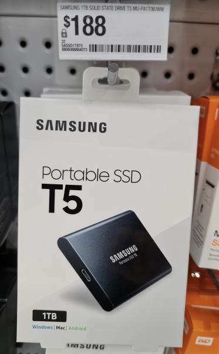

Esto es más rápido, pero innecesariamente caro:


## Paso 2: Descargar la imagen de Raspiblitz

Navega al sitio web de Raspiblitz en GitHub y encuentra el enlace "descargar imagen":

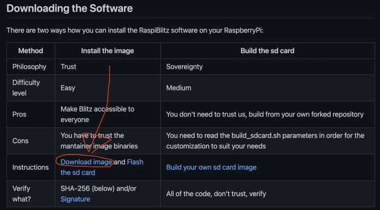

El hash sha-256 del archivo descargado se proporciona en el sitio web. Cambiará con cada actualización. Si no entiendes de qué se trata esto, deberías hacerlo, así que escribí una guía que puedes leer aquí.


## Paso 3: Verificar la imagen

Antes de continuar, si no conoces el sistema de archivos en la línea de comandos, es fácil de aprender y deberías hacerlo.

Aquí tienes un video útil para Linux, pero también se aplica a Mac.

Para Windows, aquí tienes un tutorial sencillo.
Mac/Linux

Espera a que el archivo termine de descargarse (¡importante!), luego abre la terminal, navega hasta donde descargaste el archivo y escribe el siguiente comando...

```
shasum -a 256 xxxxxxxxxxxxxx
```

donde xxxxxxxxxxxxxx es el nombre del archivo que acabas de descargar. Si no estás en el directorio donde se encuentra ese archivo, debes escribir la ruta completa.

La computadora piensa durante unos 20 segundos. Verifica que el hash del archivo de salida coincida con el descargado desde el sitio web en el paso anterior. Si es idéntico, puedes continuar.
Windows

Abre el símbolo del sistema y navega hasta donde se descargó el archivo, luego escribe este comando:

```
certUtil -hashfile xxxxxxxxxxxxxxx SHA256
```

donde xxxxxxxxxxxxxx es el nombre del archivo que acabas de descargar. Si no estás en el directorio donde se encuentra ese archivo, debes escribir la ruta completa.

La computadora piensa durante unos 20 segundos. Verifica que el hash del archivo de salida coincida con el descargado desde el sitio web en el paso anterior. Si es idéntico, puedes continuar.

## Paso 4: Flashear la tarjeta SD

Puedes usar Balena Etcher para hacer esto. Descárgalo aquí.

Etcher es fácil de usar. Inserta tu tarjeta micro SD y flashea el software de Raspiblitz (archivo .img) en la tarjeta SD.


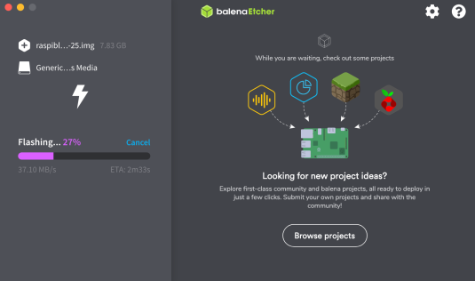

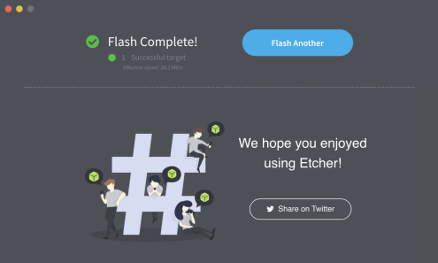

Una vez hecho, la unidad ya no es legible. Es posible que recibas un error del sistema operativo y la unidad desaparezca del escritorio. Retira la tarjeta.

## Paso 5: Configura el Pi e inserta la tarjeta SD

Las partes (la carcasa no se muestra):

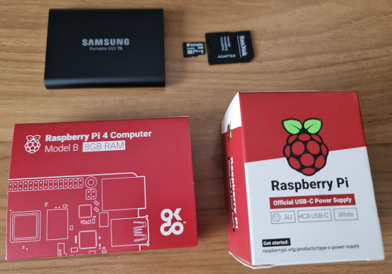

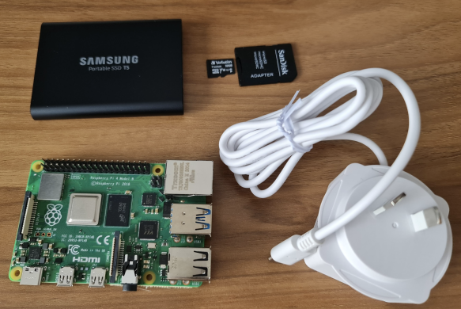

Conecta el cable Ethernet y el conector USB del disco duro (aún no lo conectes a la corriente). Evita conectarlo a los puertos USB de color azul en el centro. Son USB 3. Utiliza el puerto USB 2, aunque el disco duro pueda ser compatible con USB 3 (más confiable).

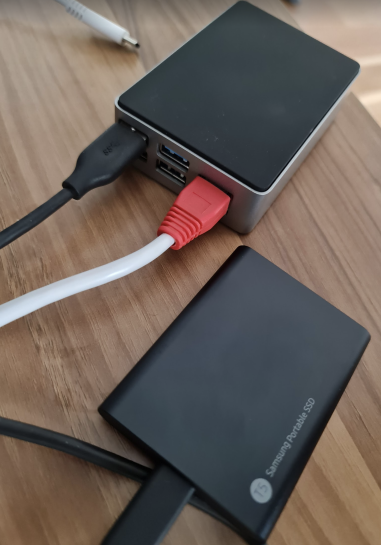

La tarjeta micro SD va aquí:


Finalmente, conecta la corriente:

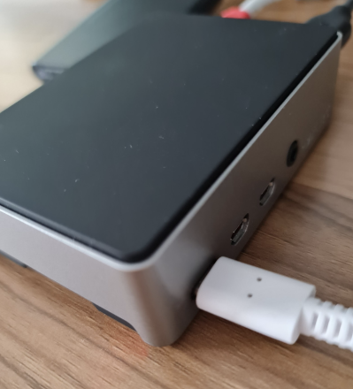

## Paso 6: Encuentra la dirección IP del Pi

Nunca necesitas un monitor con el Raspiblitz. Sin embargo, necesitas otra computadora en la red doméstica. Si tu Pi no está conectado por ethernet y quieres depender del WiFi, encontrar la IP requiere algunas habilidades informáticas. No puedo ayudarte, lo siento. Necesitas una conexión ethernet. (El problema surge de la necesidad de acceder a un monitor y al sistema operativo para conectar el WiFi e ingresar una contraseña).
Verifica tu enrutador para obtener una lista de todas las IPs de todos los dispositivos conectados.

Escribí 192.168.0.1 en el navegador (instrucciones que vinieron con mi enrutador), inicié sesión y pude ver mi dispositivo con la IP 192.168.0.191. Ten en cuenta que estas direcciones IP no son visibles públicamente en Internet (pasan primero por el enrutador), solo son identificadores para los dispositivos en tu red doméstica.

Encontrar la IP es crucial.

> ACTUALIZACIÓN: puedes usar la terminal en una máquina Mac o Linux para encontrar la dirección IP de todos los dispositivos conectados por Ethernet en la red doméstica utilizando el comando "arp -a". La salida no es tan bonita como lo que mostrará el enrutador, pero toda la información que necesitas está allí. Si no es obvio cuál es el Pi, realiza pruebas y errores.

## Paso 7: Accede al Pi a través de SSH

Recuerda insertar la tarjeta SD en el Pi antes de encenderlo. Espera unos minutos y luego, en otra computadora con Linux/Mac, abre la terminal.

Para Mac/Linux, en la terminal escribe:

```
ssh admin@dirección_IP_de_tu_Pi
```

Para Windows, necesitarás instalar putty para acceder por SSH al Pi. Escribe el mismo comando que se mencionó anteriormente.

La primera vez que hagas esto, o cada vez que cambies el sistema operativo del Pi al cambiar la tarjeta SD, es posible que obtengas este error...

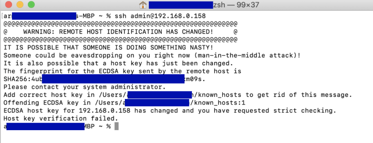

La forma de solucionarlo es navegar hasta donde se encuentra el archivo "known_hosts" (te lo indica en el mensaje de error) y eliminarlo. El comando es "rm known_hosts".

Luego, repite el comando ssh para iniciar sesión. Esto sucederá...

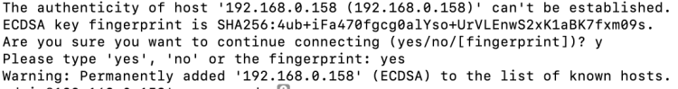

Escribe "yes" (sin comillas) para continuar.

Si tienes éxito, se te pedirá una contraseña. Esta no es para tu computadora, sino para el raspiblitz. La contraseña genérica es "raspiblitz" y la cambiarás más adelante. La ventana de la terminal se volverá azul y tendrás opciones de menú como los antiguos menús de DOS. Navega con las teclas de flecha o el mouse.


Sigue las indicaciones, establece tus contraseñas y luego detectará tu disco duro y te dará la opción de formatearlo si es necesario.

Luego se te preguntará si quieres copiar los datos de la cadena de bloques desde otra fuente o volver a descargarlos. Copiarlos es un proceso de aprendizaje y las instrucciones son bastante buenas, y es bueno tenerlas a mano...

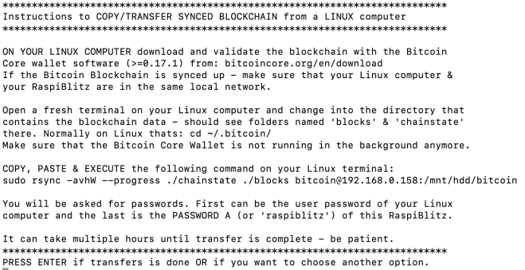

La forma más sencilla pero más lenta es descargar toda la cadena desde cero...


Mucho texto aparecerá rápidamente en la pantalla de la terminal. Puede que lo confundas con el proceso de descarga de la cadena de bloques, pero parece, al menos para mí, que está generando una clave privada para la comunicación.

Luego aparecen las opciones de Lightning.

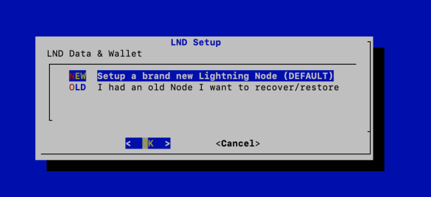

Crea una nueva contraseña para bloquear tu billetera de Lightning, luego se creará una nueva billetera y se te darán 24 palabras para que las anotes...

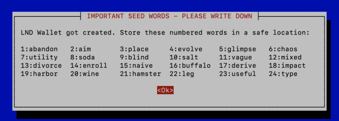

Asegúrate de escribirlo y mantenerlo seguro. Escuché de una persona que no lo hizo porque no planeaba usar lightning, pero luego, un año después, decidió usarlo y abrió canales. Luego, al darse cuenta de que sus palabras no estaban respaldadas y recuerdo que no era posible extraer las palabras nuevamente del dispositivo, tuvo que cerrar todos sus canales y comenzar de nuevo. Se salió con la suya, pero otros podrían no tener tanta suerte.
Después de esto, unos minutos de texto se desplazan hacia abajo en la ventana del terminal. Luego...

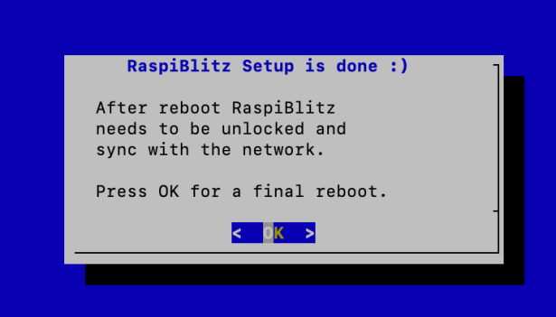

Se cerrará la sesión de ssh. Vuelve a iniciar sesión, esta vez con tu nueva contraseña, contraseña A. Una vez dentro, se te pedirá la contraseña C para desbloquear tu billetera lightning.

Ahora esperamos. Nos vemos en 2 semanas. Puedes cerrar el terminal, no afecta al Pi, es solo una ventana de comunicación.

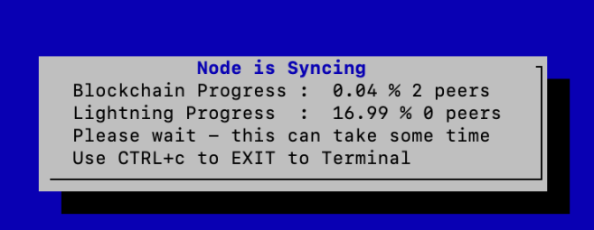

Si por alguna razón quieres apagar el Pi antes de que se haya terminado de descargar la cadena de bloques, está bien siempre y cuando lo hagas correctamente. La cadena de bloques continuará descargándose desde donde se quedó una vez que te vuelvas a conectar.

Presiona CTRL+c para salir de la pantalla azul. Accederás al terminal Linux del Pi. Aquí puedes escribir "menu" para cargar la siguiente pantalla y desde allí puedes apagar el Pi.

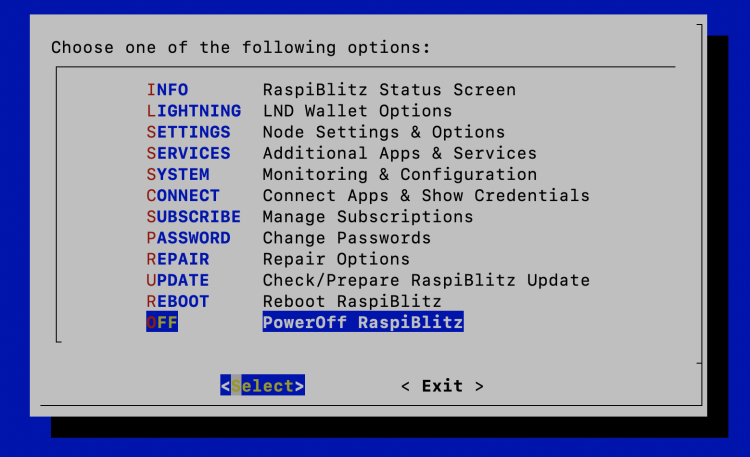

FIN de la guía

Así que a partir de ahora tu nodo está listo para funcionar. Si aún necesitas ayuda para navegar por más opciones, consulta el github para obtener más tutoriales y guías https://github.com/raspiblitz/raspiblitz#feature-documentation
