RaspiBlitzは、RaspberryPi（1TB SSD）上でBitcoin-Fullnodeと一緒に動作する自作のLightning Node（LNDおよび/またはCore Lightning）で、簡単なセットアップとモニタリングのための素敵なディスプレイが付いています。

RaspiBlitzは主に、自宅から分散して自分のノードを運用する方法を学ぶために対象とされています - なぜなら：あなたのノードでなければ、あなたのルールではありません。Lightning Networkの成長するエコシステムを発見し、それの完全な一部となることで開発します。ワークショップの一環として、または週末のプロジェクトとして自分で構築してください。


RASPIBLITZ - BTCセッションによるLightningおよびBitcoinフルノードの運用方法

# ParmanのRaspiblitzセットアップガイド

Raspiblitzは、Bitcoin Nodeと関連アプリを運用するための優れたシステムです。ほとんどのユーザーにこれとMy Nodeノードを推奨します（理想的には冗長性のために2つのノードを持っています）。一つの大きな利点は、Raspiblitzノードが「Free Open Source Software」であることです。MyNodeやUmbrelとは異なります。なぜそれが重要なのか、Vlad Costaが説明しています。また、RaspbiBlitzをイーサネットではなくWiFi接続で実行することもできます - そのための補足ガイドがこちらです。（MyNodeでこれを行う方法は見つかりませんでした）。

既製のノードをミニスクリーン付きで購入することも、自分で構築することもできます（スクリーンは必要ありません）。

githubページのガイドは優れていますが、中級者には詳細すぎる可能性があります。私の指示はより簡潔で、あなたがフォローしやすいことを願っています。

基本的に、プロセスはRaspberry Pi 4を使用してMyNodeノードを設定するプロセスと非常に似ています。Raspiblitzガイドではモニターの購入を提案していますが、本当に必要はありませんし、お勧めしません。追加のキーボードやマウスも必要ありません。同じホームネットワーク上のコンピューターからデバイスのターミナルメニューにアクセスし、ターミナルを使用してsshコマンドを使用します。これはLinux/Mac（簡単）とWindows（少し難しい）で可能です。

## ステップ1: 機材を購入する。

MyNodeノードを実行するのと全く同じ機材が必要です。一方または他方を試すことができますが、唯一の違いはマイクロSDカードのデータです。

- Raspberry Pi 4、4Gbメモリまたは8Gb（4Gbで十分）
- 公式Raspberry Pi電源（非常に重要！汎用品を購入しないでください、本当に）
- Pi用のケース。（FLIRCケースは素晴らしい。ケース全体がヒートシンクで、ファンは不要で騒音がありません）
- 32 GbマイクロSDカード（1枚必要ですが、いくつかあると便利です。）
- メモリーカードリーダー（ほとんどのコンピューターにはマイクロSDカード用のスロットがありません）。
- 外付けSSD 1Tbハードドライブ。
- イーサネットケーブル（自宅のルーターに接続するため）。

モニター（またはキーボードやマウス）は必要ありません

注意：これは間違ったハードドライブです：これはポータブル外付けハードドライブです。SSDではありません。SSDが重要です。これが安い理由です（価格はAUDで）


これが入手すべき正しいタイプです：


これはより速いですが、不必要に高価です：

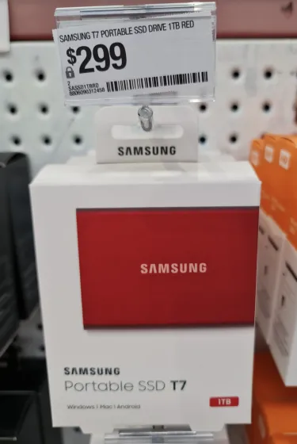

## ステップ2: Raspiblitzイメージをダウンロードする
RaspiblitzのGitHubウェブサイトにアクセスし、「download image」リンクを見つけてください：
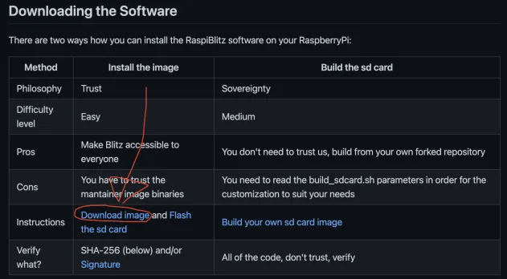

ダウンロードしたファイルのsha-256ハッシュはウェブサイト上で提供されています。これは各アップデートごとに変更されます。これが何についての話か分からない場合は、理解するべきですので、こちらにガイドを書きましたので読んでください。

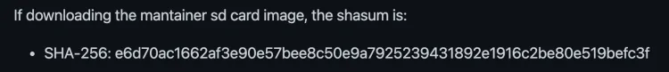

## ステップ 3: イメージの検証

進む前に、コマンドラインでファイルシステムを扱う方法が分からない場合は、学ぶのは簡単ですし、学ぶべきです。

Linux用の役立つビデオがこちらにありますが、Macにも適用されます。

Windowsの場合、こちらが簡単なチュートリアルです。
Mac/Linux

ファイルのダウンロードが完了するのを待ち（重要！）、次にターミナルを開き、ダウンロードしたファイルがある場所に移動し、以下のコマンドを入力してください…

```bash
shasum -a 256 xxxxxxxxxxxxxx
```

ここでのxxxxxxxxxxxxxxはダウンロードしたファイルの名前です。そのファイルがあるディレクトリにいない場合は、フルパスを入力する必要があります。

コンピュータは20秒ほど考えます。出力されたハッシュファイルが前のステップでウェブサイトからダウンロードしたものと一致するか確認してください。もし同一であれば、進むことができます。
Windows

コマンドプロンプトを開き、ファイルがダウンロードされた場所に移動し、このコマンドを入力してください：

```bash
certUtil -hashfile xxxxxxxxxxxxxxx SHA256
```

ここでのxxxxxxxxxxxxxxはダウンロードしたファイルの名前です。そのファイルがあるディレクトリにいない場合は、フルパスを入力する必要があります。

コンピュータは20秒ほど考えます。出力されたハッシュファイルが前のステップでウェブサイトからダウンロードしたものと一致するか確認してください。もし同一であれば、進むことができます。

## ステップ 4: SDカードのフラッシュ

これにはBalena Etcherを使用できます。こちらからダウンロードしてください。

Etcherの使用方法は自明です。マイクロSDカードを挿入し、Raspiblitzソフトウェア（.imgファイル）をSDカードにフラッシュしてください。


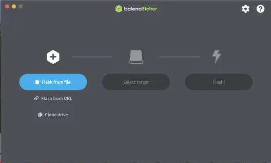

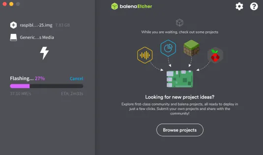

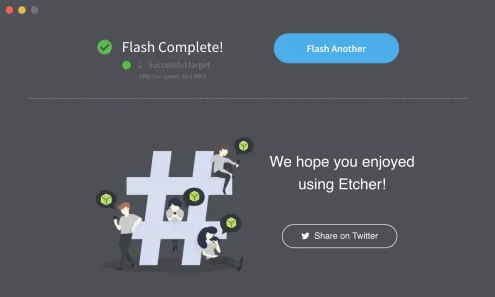

完了すると、ドライブはもはや読み取り可能ではありません。オペレーティングシステムからエラーが出るかもしれませんし、ドライブはデスクトップから消えるはずです。カードを抜いてください。

## ステップ 5: Piをセットアップし、SDカードを挿入する

パーツ（ケースは表示されていません）：

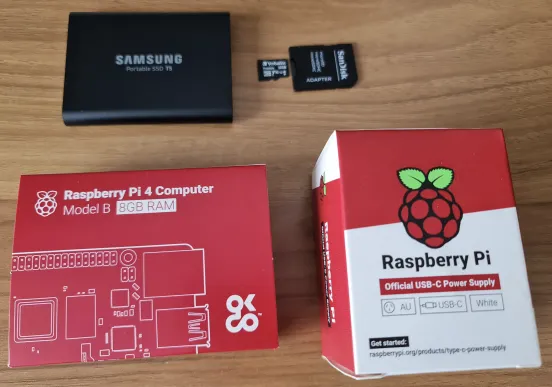

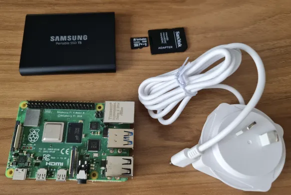

イーサネットケーブルとハードドライブUSBコネクタ（まだ電源は接続しない）を接続します。中央の青色のUSBポートには接続しないでください。それらはUSB 3です。ドライブがUSB 3対応であっても、USB 2ポートを使用してください（より信頼性が高い）。


マイクロSDカードはここに入ります：


最後に、電源を接続します：

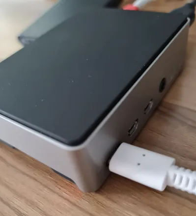

## ステップ 6: PiのIPアドレスを見つける

Raspiblitzでは、モニターは必要ありません。しかし、自宅のネットワーク上の別のコンピュータは必要です。もしPiがイーサネットに接続されておらず、WiFiに頼りたい場合、IPを見つけるにはある程度のコンピュータスキルが必要です。申し訳ありませんが、お手伝いできません。イーサネット接続が必要です。（問題は、WiFiに接続しパスワードを入力するためにモニターとオペレーティングシステムへのアクセスが必要になることから生じます。）

ルーターをチェックし、接続されているすべてのデバイスのIPのリストを確認してください。
私はブラウザに「192.168.0.1」と入力しました（ルーターに付属していた指示に従って）、ログインし、IPが192.168.0.191である私のデバイスを確認することができました。これらのIPアドレスはインターネット上で公開されているわけではなく（まずルーターを通過します）、自宅のネットワーク上のデバイスの識別子に過ぎません。
IPを見つけることは重要です。

> 更新：MacやLinuxマシンのターミナルを使用して、コマンド「arp -a」を使い、自宅のネットワークにEthernet接続されている全デバイスのIPアドレスを見つけることができます。出力はルーターが表示するものほどきれいではありませんが、必要な情報はすべてそこにあります。どれがPiか明らかでない場合は、試行錯誤を行ってください。

## ステップ7: PiにSSHで接続する

Piをオンにする前にSDカードをPiに入れることを忘れないでください。数分待って、別のLinux/Macでターミナルを開きます。

Mac/Linuxの場合、ターミナルで次のように入力します：

```bash
ssh admin@あなたのPiのIPアドレス
```

Windowsの場合は、Piにsshで接続するためにputtyをインストールする必要があります。上記と同じコマンドを入力します。

これを初めて行う場合、またはSDカードを切り替えることでPiのOSを変更するたびに、このエラーが発生するかもしれません…


これを修正する方法は、「known_hosts」ファイルがある場所に移動することです（エラーメッセージで教えてくれます）、そしてそれを削除します。コマンドは「rm known_hosts」です

その後、sshコマンドを繰り返してログインします。これが起こります…


続行するにはyes（フルワード）と入力します。

成功すると、パスワードの入力を求められます。これはあなたのコンピュータのものではなく、raspiblitzのものです。一般的なパスワードは「raspiblitz」で、後で変更します。ターミナルウィンドウが青くなり、古いDOSメニューのようなメニューオプションが表示されます。矢印キーまたはマウスでナビゲートします。


プロンプトに従ってパスワードを設定し、次にハードドライブを検出し、必要に応じてフォーマットするオプションを提供します。

次に、ブロックチェーンデータを別のソースからコピーするか、再ダウンロードするかを尋ねられます。コピーすることは学習プロセスであり、指示はかなり良いもので、手元に置いておくと良いでしょう…


シンプルだが遅い方法は、最初からチェーン全体をダウンロードすることです…

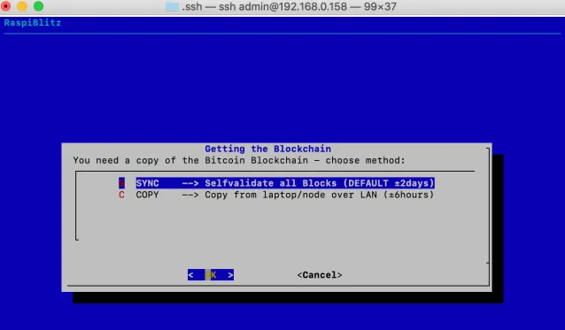

多くのテキストがターミナル画面を横切ってフラッシュします。それがブロックチェーンのダウンロードプロセスのように見えるかもしれませんが、私には、それが通信用のプライベートキーを生成しているように見えます。

その後、ライトニングオプションが表示されます。

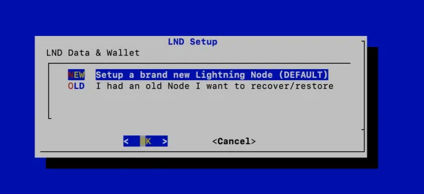

ライトニングウォレットをロックするための新しいパスワードを作成し、新しいウォレットが作成され、24の単語を書き留めるように言われます…


それを書き留めて安全に保管してください。ライトニングを使用する予定がなかったためにそれを書き留めなかった人の話を聞いたことがありますが、後になって使用することに決め、チャネルを開きました。そして、デバイスから再び単語を抽出することが不可能だと気づいた彼は、すべてのチャネルを閉じて再び始める必要がありました。彼はそれを乗り越えましたが、他の人はそう幸運ではないかもしれません。

これに続いて、数分間テキストがターミナルウィンドウを下にスクロールします。そして…


sshセッションからログアウトされます。新しいパスワード、パスワードAを使用して再度ログインしてください。ログインすると、ライトニングウォレットのロックを解除するためにパスワードCの入力を求められます。

ここで待ちます。2週間後にお会いしましょう。ターミナルを閉じても構いません。Piには何の影響もありません。単なる通信ウィンドウです。


何らかの理由で、ブロックチェーンのダウンロードが完了する前にPiをシャットダウンしたい場合は、適切に行えば問題ありません。再接続すると、ブロックチェーンのダウンロードは中断したところから再開されます。

CTRL+cを押して青い画面を終了します。PiのLinuxターミナルにアクセスします。ここで「menu」と入力すると、次の画面がロードされ、そこからPiを電源オフできます。


ガイドの終わり

これで、ノードは使用準備が整いました。さらにオプションをナビゲートする必要がある場合は、より多くのチュートリアルやガイドについては、githubを参照してください https://github.com/raspiblitz/raspiblitz#feature-documentation