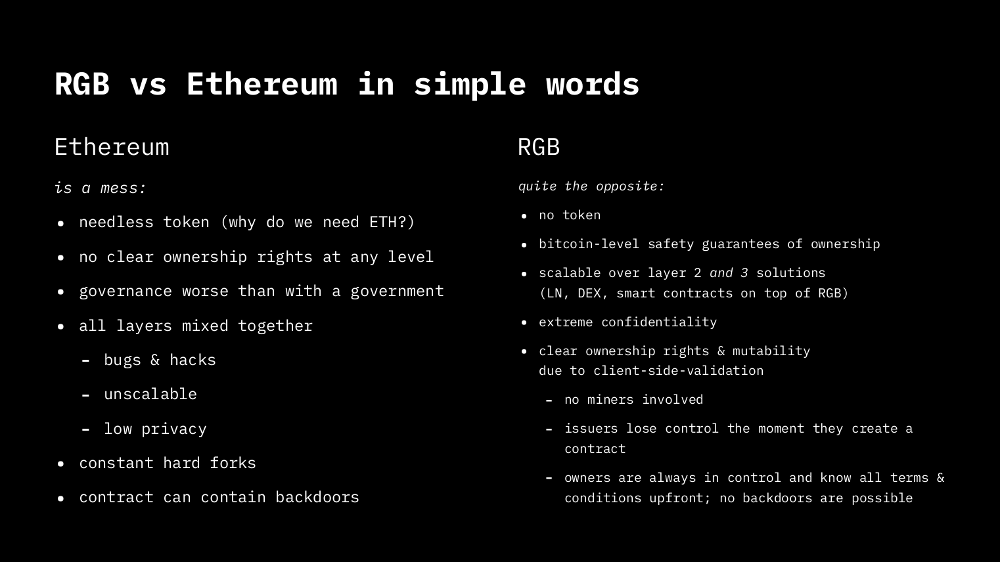

# Eine kurze Einführung in RGB-Protokolle


## Einführung

Am 3. Januar 2009 startete Satoshi Nakamoto den ersten Bitcoin-Knoten, von diesem Moment an schlossen sich neue Knoten an und Bitcoin begann sich zu verhalten, als ob es eine neue Form des Lebens wäre, eine Form des Lebens, die sich ständig weiterentwickelt hat. Nach und nach ist es aufgrund seines einzigartigen Designs zur sichersten Netzwerk der Welt geworden, was auf wirtschaftliche Anreize zurückzuführen ist. Es zieht Benutzer, die gemeinhin als Miner bezeichnet werden, an, um in Energie und Rechenleistung zu investieren, was zur Sicherheit des Netzwerks beiträgt.

Während Bitcoin weiter wächst und sich verbreitet, steht es vor Skalierbarkeitsproblemen. Das Bitcoin-Netzwerk ermöglicht das Mining eines neuen Blocks mit Transaktionen in einer ungefähren Zeit von 10 Minuten. Angenommen, wir haben 144 Blöcke pro Tag mit maximalen Werten von 2700 Transaktionen pro Block, dann hätte Bitcoin nur 4,5 Transaktionen pro Sekunde ermöglicht. Satoshi war sich dieser Begrenzung bewusst, wie wir in einer E-Mail1 sehen können, die er im März 2011 an Mike Hearn geschickt hat, in der er erklärt, wie das, was wir heute als Zahlungskanal kennen, funktioniert. Mikrozahlungen schnell und sicher ohne auf Bestätigungen warten zu müssen. Hier kommen Off-Chain-Protokolle ins Spiel.

Laut Christian Decker2 handelt es sich bei Off-Chain-Protokollen in der Regel um Systeme, bei denen Benutzer Daten aus einer Blockchain verwenden und verwalten, ohne die Blockchain selbst zu berühren, bis zum letzten Moment. Basierend auf diesem Konzept entstand das Lightning Network, ein Netzwerk, das Off-Chain-Protokolle verwendet, um Bitcoin-Zahlungen nahezu sofort zu ermöglichen. Da nicht alle diese Operationen in der Blockchain geschrieben werden, ermöglicht es Tausende von Transaktionen pro Sekunde und skaliert Bitcoin.

Forschung und Entwicklung im Bereich der Off-Chain-Protokolle bei Bitcoin haben eine Büchse der Pandora geöffnet. Heute wissen wir, dass wir viel mehr als nur den dezentralen Werttransfer erreichen können. Die gemeinnützige LNP/BP Standards Association konzentriert sich auf die Entwicklung von Layer-2- und Layer-3-Protokollen bei Bitcoin und dem Lightning Network, unter diesen Projekten sticht RGB hervor.

## Was ist RGB?

RGB ist aus der Forschung von Peter Todd3 zu Einwegverschlüssen und clientseitiger Validierung entstanden, was von Giacomo Zucco und der Community von 2016-2019 geprägt wurde und zu einem besseren Vermögensprotokoll für Bitcoin und das Lightning Network führte. Die weitere Entwicklung dieser Ideen führte zur Entwicklung von RGB zu einem vollwertigen Smart Contract-System durch Maxim Orlovsky, der seit 2019 die Implementierung mit Beteiligung der Community leitet.

Wir können RGB als eine Reihe von Open-Source-Protokollen definieren, die es uns ermöglichen, komplexe Smart Contracts auf skalierbare und vertrauliche Weise auszuführen. Es handelt sich nicht um ein bestimmtes Netzwerk (wie Bitcoin oder Lightning); jeder Smart Contract ist nur eine Gruppe von Vertragspartnern, die über verschiedene Kommunikationskanäle interagieren können (standardmäßig über das Lightning Network). RGB verwendet die Bitcoin-Blockchain als Layer für den Zustandsnachweis und verwaltet den Code des Smart Contracts und die Daten Off-Chain, was es skalierbar macht. Dabei nutzt es Bitcoin-Transaktionen (und Script) als Besitzkontrollsystem für Smart Contracts. Die Weiterentwicklung des Smart Contracts wird durch ein Off-Chain-Schema definiert. Schließlich ist es wichtig zu beachten, dass alles auf der Client-Seite validiert wird.
In einfachen Worten ist RGB ein System, das es dem Benutzer ermöglicht, einen Smart Contract zu überprüfen, auszuführen und individuell zu verifizieren, ohne zusätzliche Kosten zu verursachen, da es im Gegensatz zu "traditionellen" Systemen keine Blockchain verwendet. Komplexe Smart Contract-Systeme wurden von Ethereum entwickelt, erfordern jedoch erhebliche Mengen an Gas für jede Operation, wodurch die Skalierbarkeit, die sie versprochen haben, nie erreicht wurde. Daher war es nie eine Option, Benutzer aus dem aktuellen Finanzsystem auszuschließen.

Derzeit fördert die Blockchain-Branche, dass sowohl der Code der Smart Contracts als auch die Daten in der Blockchain gespeichert und von jedem Knoten im Netzwerk ausgeführt werden müssen, unabhängig von der übermäßigen Größenzunahme oder dem Missbrauch von Rechenressourcen. Das von RGB vorgeschlagene Schema ist jedoch viel intelligenter und effizienter, da es mit dem Blockchain-Paradigma bricht, indem es Smart Contracts und Daten von der Blockchain trennt und so die Netzwerküberlastung vermeidet, die in anderen Plattformen zu sehen ist. Darüber hinaus zwingt es nicht jeden Knoten, jeden Vertrag auszuführen, sondern nur die beteiligten Parteien, was eine bisher nie dagewesene Vertraulichkeit bietet.



## Smart Contracts in RGB

Im RGB definiert der Smart Contract-Entwickler ein Schema, das die Regeln festlegt, wie sich der Vertrag im Laufe der Zeit entwickelt. Das Schema ist der Standard für den Aufbau von Smart Contracts in RGB, und sowohl ein Emittent, der einen Vertrag für die Ausgabe definiert, als auch eine Brieftasche oder eine Börse müssen sich an ein bestimmtes Schema halten, gegen das sie den Vertrag validieren müssen. Nur wenn die Validierung korrekt ist, können die Parteien Anfragen akzeptieren und mit dem Vermögenswert arbeiten.

Ein Smart Contract in RGB ist ein gerichteter azyklischer Graph (DAG) von Zustandsänderungen, bei dem nur ein Teil des Graphen immer bekannt ist und kein Zugriff auf den Rest besteht. Das RGB-Schema ist eine Kernmenge von Regeln für die Entwicklung dieses Graphen, mit dem der Smart Contract beginnt. Jeder Vertragspartner kann zu diesen Regeln hinzufügen (sofern dies vom Schema erlaubt ist), und der resultierende Graph wird durch die iterative Anwendung dieser Regeln aufgebaut.

## Fungible Vermögenswerte

Die fungiblen Vermögenswerte in RGB folgen der LNPBP RGB-20-Spezifikation4. Wenn ein RGB-20 definiert ist, wird die Vermögensdaten, die als "Genesis-Daten" bezeichnet wird, über das Lightning-Netzwerk verteilt, das enthält, was für die Verwendung des Vermögenswerts erforderlich ist. Die einfachste Form von Vermögenswerten erlaubt keine sekundäre Ausgabe, das Verbrennen von Token, die Umbenennung oder den Austausch.

Manchmal muss der Emittent in Zukunft mehr Token ausgeben, z.B. Stablecoins wie USDT, die den Wert jedes Tokens an den Wert einer inflationsbedingten Währung wie dem USD binden. Um dies zu erreichen, gibt es komplexere RGB-20-Schemata, die neben den Genesis-Daten auch verpflichtende Lieferungen erfordern, die ebenfalls im Lightning-Netzwerk zirkulieren. Mit diesen Informationen können wir die Gesamtumlaufmenge des Vermögenswerts kennen. Das Gleiche gilt für das Verbrennen von Vermögenswerten oder die Änderung des Namens.

Die Informationen im Zusammenhang mit dem Vermögenswert können öffentlich oder privat sein: Wenn der Emittent Vertraulichkeit wünscht, kann er sich dafür entscheiden, keine Informationen über das Token zu teilen und Operationen in absoluter Privatsphäre durchzuführen. Es gibt jedoch auch den entgegengesetzten Fall, bei dem der Emittent und die Inhaber den gesamten Prozess transparent gestalten möchten. Dies wird durch das Teilen der Token-Daten erreicht.

## RGB-20 Verfahren

Das Verbrennungsverfahren deaktiviert Token, verbrannte Token können nicht mehr verwendet werden.

Das Austauschverfahren tritt auf, wenn Token verbrannt werden und eine neue Menge desselben Tokens erstellt wird. Dies hilft, die Größe der historischen Daten des Vermögenswerts zu reduzieren, was wichtig ist, um die Geschwindigkeit des Vermögenswerts aufrechtzuerhalten.

Um den Anwendungsfall zu unterstützen, bei dem Vermögenswerte verbrannt werden können, ohne sie ersetzen zu müssen, wird ein Unter-Schema von RGB-20 verwendet, das nur das Verbrennen von Vermögenswerten zulässt.

## Nicht fungible Vermögenswerte

Die nicht fungiblen Vermögenswerte in RGB folgen der LNPBP RGB-21-Spezifikation5. Wenn wir mit NFTs arbeiten, haben wir auch ein Hauptschema und ein Unterrichtsschema. Diese Schemata haben ein Gravurverfahren, das es uns ermöglicht, benutzerdefinierte Daten an den Token-Besitzer anzuhängen. Das häufigste Beispiel, das wir heute bei NFTs sehen, ist digitale Kunst, die mit dem Token verknüpft ist. Der Token-Aussteller kann diese Datengravur durch Verwendung des RGB-21-Unterschemas verbieten. Im Gegensatz zu anderen NFT-Blockchain-Systemen ermöglicht RGB die dezentrale und zensurresistente Verteilung von Token-Daten mit großer Größe unter Verwendung einer Erweiterung des Lightning P2P-Netzwerks namens Bifrost, die auch zum Aufbau vieler anderer Formen von RGB-spezifischen Smart-Vertragsfunktionalitäten verwendet wird.
Zusätzlich zu fungiblen Vermögenswerten und NFTs können RGB und Bifrost auch zur Erzeugung anderer Formen von Smart Contracts verwendet werden, einschließlich DEXes, Liquiditätspools, algorithmischen stabilen Münzen usw., die wir in zukünftigen Artikeln behandeln werden.

## NFT von RGB vs. NFT von anderen Plattformen

- Keine teure Blockchain-Speicherung erforderlich
- Kein Bedarf an IPFS, stattdessen wird eine Lightning-Netzwerk-Erweiterung (Bifrost) verwendet (und sie ist vollständig end-to-end verschlüsselt)
- Keine Notwendigkeit für eine spezielle Datenverwaltungslösung - auch hier übernimmt Bifrost diese Rolle
- Kein Vertrauen in Websites erforderlich, um Daten für NFT-Token oder über Probleme mit Vermögenswerten/Vertrags-ABIs aufrechtzuerhalten
- Integrierte DRM-Verschlüsselung und Eigentumsverwaltung
- Infrastruktur für Backups unter Verwendung des Lightning-Netzwerks (Bifrost)
- Möglichkeiten zur Monetarisierung von Inhalten (nicht nur Verkauf des NFT selbst, sondern auch Zugang zum Inhalt, mehrmals)

## Schlussfolgerungen

Seit dem Start von Bitcoin vor fast 13 Jahren wurde in diesem Bereich viel geforscht und experimentiert. Sowohl die Erfolge als auch die Fehler haben uns geholfen, ein wenig mehr darüber zu verstehen, wie dezentrale Systeme in der Praxis funktionieren, was sie wirklich dezentral macht und welche Maßnahmen dazu tendieren, sie zu zentralisieren. All dies hat uns zu dem Schluss gebracht, dass echte Dezentralisierung ein seltenes und schwieriges Phänomen ist, das nur von Bitcoin erreicht wurde. Aus diesem Grund konzentrieren wir unsere Bemühungen darauf, darauf aufzubauen.

RGB hat seinen eigenen Kaninchenbau innerhalb des Bitcoin-Kaninchenbaus. Während ich durch sie hindurchfalle, werde ich posten, was ich gelernt habe. Im nächsten Artikel werden wir eine Einführung in die LNP- und RGB-Knoten und deren Verwendung haben.

- 1 https://plan99.net/~mike/satoshi-emails/thread4.html
- 2 https://btctranscripts.com/chaincode-labs/chaincode-residency/2018-10-22-christian-decker-history-of-lightning/
- 3 https://lists.linuxfoundation.org/pipermail/bitcoin-dev/2016-June/012773.html
- 4 https://github.com/LNP-BP/LNPBPs/blob/master/lnpbp-0020.md
- 5 https://github.com/LNP-BP/LNPBPs/blob/master/lnpbp-0021.md

# RGB-Node-Tutorial

## Einführung

In diesem Tutorial erklären wir, wie man RGB-Node verwendet, um einen fungiblen Token zu erstellen und wie man ihn überträgt. Dieses Dokument basiert auf der RGB-Node-Demo und unterscheidet sich darin, dass dieses Tutorial echte Testnet-Daten verwendet und dafür müssen wir unsere eigene teilweise signierte Bitcoin-Transaktion, PSBT genannt, erstellen.

## Anforderungen

Die Verwendung einer Linux-Distribution wird empfohlen. Dieses Tutorial wurde mit Pop!/\_OS erstellt, das auf Ubuntu basiert, und Sie benötigen Folgendes:

- cargo
- Bitcoin Core
- git

Hinweis: Dieses Tutorial zeigt die Ausführung von Befehlen in einem Linux-Terminal. Um zu unterscheiden, was der Benutzer schreibt und welche Antwort er im Terminal erhält, verwenden wir das $-Symbol als Bash-Prompt.

Sie müssen einige Abhängigkeiten installieren:

```
$ sudo apt install -y build-essential pkg-config libzmq3-dev libssl-dev libpq-dev libsqlite3-dev cmake
```

Kompilieren und Ausführen

RGB-Node ist eine laufende Arbeit (WIP), deshalb müssen wir uns in einem bestimmten Commit (3f3c520c19d84c66d430e76f0fc68c5a66d79c84) befinden, um es korrekt kompilieren und verwenden zu können. Dazu führen wir die folgenden Befehle aus.

```
$ git clone https://github.com/rgb-org/rgb-node.git
$ cd rgb-node
$ git checkout 3f3c520c19d84c66d430e76f0fc68c5a66d79c84
```

Jetzt kompilieren wir es. Vergessen Sie nicht, die --locked-Flagge zu verwenden, da es eine Änderung gibt, die in einer Version von clap eingeführt wurde.

```
$ cargo install --path . --all-features --locked

....
....
    Finished release [optimized] target(s) in 2m 14s
  Installing /home/user/.cargo/bin/fungibled
  Installing /home/user/.cargo/bin/rgb-cli
  Installing /home/user/.cargo/bin/rgbd
  Installing /home/user/.cargo/bin/stashd
   Installed package `rgb_node v0.4.2 (/home/user/dev/rgb-node)` (executables `fungibled`, `rgb-cli`, `rgbd`, `stashd`)

```

Wie uns der Rust-Compiler mitteilt, wurden die Binärdateien in das Verzeichnis $HOME/.cargo/bin kopiert. Wenn Ihr Compiler sie an einen anderen Ort kopiert hat, stellen Sie sicher, dass dieses Verzeichnis in $PATH enthalten ist.

Unter den installierten Binärdateien können wir drei Daemons oder Dienste (Dateien, die mit d enden) und eine Befehlszeilenschnittstelle (CLI) sehen. Die CLI ermöglicht uns die Interaktion mit dem Haupt-RGBD-Daemon. Da wir in diesem Tutorial zwei Knoten ausführen werden, benötigen wir auch zwei Clients. Jeder muss mit seinem eigenen Knoten verbunden sein. Dazu erstellen wir zwei Aliase.

```
alias rgb0-cli="$HOME/.cargo/bin/rgb-cli -d $HOME/rgbdata/data0 -n testnet"
alias rgb1-cli="$HOME/.cargo/bin/rgb-cli -d $HOME/rgbdata/data1 -n testnet"
```

Wir können die Aliase einfach ausführen oder sie ans Ende der Datei $HOME/.bashrc hinzufügen und source $HOME/.bashrc ausführen.
Voraussetzung

RGB-Node verwaltet keine Wallet-bezogenen Funktionen. Es führt lediglich RGB-spezifische Aufgaben mit den Daten durch, die von einer externen Wallet wie Bitcoin Core bereitgestellt werden. Insbesondere für die Demonstration eines grundlegenden Workflows mit Ausgabe und Übertragung benötigen wir:

- Eine issuance_utxo, an die rgb-node-0 das neu ausgegebene Asset bindet
- Eine receive_utxo, an die rgb-node-1 das Asset empfängt
- Eine change_utxo, an die rgb-node-0 die Asset-Änderung empfängt
- Eine teilweise signierte Bitcoin-Transaktion (tx.psbt), deren Ausgabepublic Key angepasst wird, um ein Commitment zur Übertragung einzuschließen.
  Wir werden die Bitcoin Core CLI verwenden. Dafür muss der Bitcoind-Daemon im Testnetz laufen. Dadurch erhalten wir Interoperabilität und am Ende können wir unsere eigenen Assets an andere RGB-Benutzer senden, die diesem Tutorial gefolgt sind.

Um es einfacher zu machen, fügen wir am Ende unserer ~/.bashrc-Datei folgenden Alias hinzu:

```
alias bcli="bitcoin-cli -testnet"
```

Lassen Sie uns unsere nicht ausgegebenen Transaktionen auflisten und zwei davon auswählen. Eine wird die issuance_utxo und die andere die change_utxo sein. Es spielt keine Rolle, welche welche ist. Wichtig ist nur, dass der Herausgeber die Kontrolle über diese beiden UTXOs hat.

```
$ bcli listunspent
[
  {
    "txid": "4c1785210d8930959f530072cffea7f9606e0599b0de9e89aed60f2e9f133893",
    "vout": 1,
    "address": "tb1qn4w9u5x0hxgm30hx6q2rhdwz58xr4ekqdq0vgm",
    "label": "",
    "scriptPubKey": "00149d5c5e50cfb991b8bee6d0143bb5c2a1cc3ae6c0",
    "amount": 0.01703963,
    "confirmations": 62432,
    "spendable": true,
    "solvable": true,
    "desc": "wpkh([ec924f82/0'/0'/5']031e0fc9a03e69326c3deeabfd749a7f7b094e3151ada90cd13019efac663c5663)#dj7rhpdt",
    "safe": true
  },
  {
    "txid": "cd66d3b77dfc1c2ecf958847c16a8a1311bba84ee7bf9dd55592a7b97b13028f",
    "vout": 1,
    "address": "tb1qyd537gf0xmm9ehmhaf3nv0a230crg56mhp9ap3",
    "scriptPubKey": "001423691f212f36f65cdf77ea63363faa8bf034535b",
    "amount": 0.02877504,
    "confirmations": 189184,
    "spendable": true,
    "solvable": true,
    "desc": "wpkh([ec924f82/0'/1'/0']03ae333417e86840145e95ab2852c8f7ca8b8f82cd910883f7ce0c69649403cef2)#jlcj23vw",
    "safe": true
  }
]
```

Bevor wir weitermachen, müssen wir über Outpoints sprechen. Eine einzelne Transaktion kann mehrere Outputs enthalten. Der Outpoint enthält sowohl eine 32-Byte-TXID als auch eine 4-Byte-Ausgabeindexnummer (vout), um auf einen bestimmten Output zu verweisen. In unserer Ausgabe von listunspent finden wir zwei UTXOs, bei denen wir txid und vout sehen können. Diese sind die Outpoints issuance_utxo und change_utxo.
'receive_utxo' ist ein UTXO, das vom Empfänger kontrolliert wird. In diesem Fall verwenden wir e40d9037e31d3f440552b30af16e764cf25ffda3899b4851cc4e38fd64718b09:0, das ein Outpoint von einer anderen Brieftasche ist.

- issuance_utxo: 4c1785210d8930959f530072cffea7f9606e0599b0de9e89aed60f2e9f133893:1
- change_utxo: cd66d3b77dfc1c2ecf958847c16a8a1311bba84ee7bf9dd55592a7b97b13028f:1
- receive_utxo: e40d9037e31d3f440552b30af16e764cf25ffda3899b4851cc4e38fd64718b09:0

Wir werden jetzt eine teilweise signierte Transaktion (tx.psbt) erstellen, deren Ausgabe angepasst wird, um einen Transfer zu beinhalten. Denken Sie daran, die txid und vout durch Ihre eigenen zu ersetzen. Die Zieladresse spielt keine Rolle, sie kann Ihre eigene oder die einer anderen Person sein. Es spielt keine Rolle, wohin diese Sats gehen, wichtig ist nur, dass wir issuance_utxo verwenden.

```
$ bcli walletcreatefundedpsbt "[{/"txid/":/"4c1785210d8930959f530072cffea7f9606e0599b0de9e89aed60f2e9f133893/",/"vout/":1}]" "[{/"tb1q9crtjp0y6rt00c4fcrmuamrylzkcalcxls80j9/":/"0.00050000/"}]"
{
  "psbt": "cHNidP8BAHECAAAAAZM4E58uD9auiZ7esJkFbmD5p/7PcgBTn5UwiQ0hhRdMAQAAAAD/////ArM7GQAAAAAAFgAU4xQr/g1lgG2P9+gZudpFD8mOGGRQwwAAAAAAABYAFC4GuQXk0Nb34qnA987sZPitjv8GAAAAAAABAHECAAAAAYiK0TdTiaEs4oDovRokqspfLZr5EHYH8Pnj/Tv5GFB5AQAAAAD+////Av8Bh80AAAAAFgAUsLjOd30aRkUna41LAT5c3CnAz5obABoAAAAAABYAFJ1cXlDPuZG4vubQFDu1wqHMOubAyw8gAAEBHxsAGgAAAAAAFgAUnVxeUM+5kbi+5tAUO7XCocw65sAiBgMeD8mgPmkybD3uq/10mn97CU4xUa2pDNEwGe+sZjxWYxDskk+CAAAAgAAAAIAFAACAACICA2J21wOqW6bj7/ePTVI7QGvU6e4Sk8DhN5pmd9hrwSd7EOyST4IAAACAAQAAgAcAAIAAAA==",
  "fee": 0.00000280,
  "changepos": 0'
```

Die Ausgabe hat uns eine psbt im Base64-Encoding gegeben, die wir verwenden werden, um tx.psbt zu erstellen.

```
$ echo "cHNidP8BAHECAAAAAZM4E58uD9auiZ7esJkFbmD5p/7PcgBTn5UwiQ0hhRdMAQAAAAD/////ArM7GQAAAAAAFgAU4xQr/g1lgG2P9+gZudpFD8mOGGRQwwAAAAAAABYAFC4GuQXk0Nb34qnA987sZPitjv8GAAAAAAABAHECAAAAAYiK0TdTiaEs4oDovRokqspfLZr5EHYH8Pnj/Tv5GFB5AQAAAAD+////Av8Bh80AAAAAFgAUsLjOd30aRkUna41LAT5c3CnAz5obABoAAAAAABYAFJ1cXlDPuZG4vubQFDu1wqHMOubAyw8gAAEBHxsAGgAAAAAAFgAUnVxeUM+5kbi+5tAUO7XCocw65sAiBgMeD8mgPmkybD3uq/10mn97CU4xUa2pDNEwGe+sZjxWYxDskk+CAAAAgAAAAIAFAACAACICA2J21wOqW6bj7/ePTVI7QGvU6e4Sk8DhN5pmd9hrwSd7EOyST4IAAACAAQAAgAcAAIAAAA==" | base64 -d > tx.psbt
```

Erstellen Sie ein neues Verzeichnis namens rgbdata, in dem das Datenverzeichnis jedes Knotens gespeichert wird.

```
$ mkdir $HOME/rgbdata
$ cd $HOME/rgbdata
```

Bereits im Verzeichnis $HOME/rgbdata starten wir jeden Knoten in verschiedenen Terminals, wobei ~/.cargo/bin das Verzeichnis ist, in dem cargo alle Binärdateien nach der Installation von rgb-node kopiert hat.

```
$ rgbd -vvvv -b ~/.cargo/bin -d ./data0 -n testnet
$ rgbd -vvvv -b ~/.cargo/bin -d ./data1 -n testnet
```

## Ausgabe

Um ein Asset auszugeben, führen wir rgb0-cli mit den fungible issue-Unterbefehlen aus, dann die Argumente, das Ticker-Symbol USDT, den Namen "USD Tether" und in der Zuweisung verwenden wir den Ausgabebetrag und die issuance_utxo wie unten gezeigt:

```
$ rgb0-cli fungible issue USDT "USD Tether" 1000@4c1785210d8930959f530072cffea7f9606e0599b0de9e89aed60f2e9f133893:1
```

Asset erfolgreich ausgegeben. Verwenden Sie diese Informationen zum Teilen:

Asset-Informationen:

```
genesis: genesis1qyfe883hey6jrgj2xvk5g3dfmfqfzm7a4wez4pd2krf7ltsxffd6u6nrvjvvnc8vt9llmp7663pgututl9heuwaudet72ay9j6thc6cetuvhxvsqqya5xjt2w9y4u6sfkuszwwctnrpug5yjxnthmr3mydg05rdrpspcxysnqvvqpfvag2w8jxzzsz9pf8pjfwf0xvln5z7w93yjln3gcnyxsa04jsf2p8vu4sxgppfv0j9qerppqxhvztpqscnjsxvq5gdfy5v6j3wvpjxxqzcerxuglngnfvpxjkgqusct7cyx8zzezcfpqv3nxjxm2kjj4d0zu0ta6fjmpr8a0calk6h88h4ap5e4nucj0ch07aa73qsh3lj5sd89a32kwy0eq7tsa5zqqjpdqvqq5s46r0id: rgb1tadqzve7vwfh39sl6gvqenp8wegsrzreekhhu0dhthx08ppzj9wq8p0je6
ticker: USDT
name: USD Tether
description: ~
knownCirculating: 1000
isIssuedKnown: ~
issueLimit: 0
chain: testnet
decimalPrecision: 0
date: "2022-02-23T20:53:26"
knownIssues:
  - id: 5c912284f3cc5db73d7eafcd798801517627cc0c18d21f967893633e33015a5f
    amount: 1000
    origin: ~
knownInflation: {}
knownAllocations:
  - nodeId: 5c912284f3cc5db73d7eafcd798801517627cc0c18d21f967893633e33015a5f
    index: 0
    outpoint: "4c1785210d8930959f530072cffea7f9606e0599b0de9e89aed60f2e9f133893:1"
    revealedAmount:
      value: 1000
      blinding: "0000000000000000000000000000000000000000000000000000000000000001"
```

Wir erhalten die assetId, die wir benötigen, um das Asset zu übertragen.

```
$ rgb0-cli fungible list

- name: USD Tether
  id: rgb1tadqzve7vwfh39sl6gvqenp8wegsrzreekhhu0dhthx08ppzj9wq8p0je6
  ticker: USDT
```

## Generiere geblinde UTXO

Um die neuen USDT zu erhalten, muss rgb-node-1 eine geblinde UTXO generieren, die der receive_utxo entspricht, um das Asset zu halten.

```
$ rgb1-cli fungible blind e40d9037e31d3f440552b30af16e764cf25ffda3899b4851cc4e38fd64718b09:0

Geblinde Outpoint: utxob16az597vp5nkr66nfzsykf8ngdnvzep5050rm00l7vv8wm7vew4jqj7jhhf
Outpoint-Blinding-Geheimnis: 1679197189805229975
```

Um Transfers im Zusammenhang mit dieser UTXO akzeptieren zu können, benötigen wir die ursprüngliche receive_utxo und den Blinding-Faktor.

## Übertragung

Um einen bestimmten Betrag des Assets an rgb-node-1 zu übertragen, müssen wir es an die geblinde UTXO senden. Rgb-node-0 muss eine Konsignation und eine Offenlegung erstellen und sie in eine Bitcoin-Transaktion einbinden. Dann benötigen wir eine PSBT, die wir ändern werden, um die Konsignation einzuschließen. Zusätzlich ermöglichen uns die Optionen -i und -a, einen Eingabe-Outpoint anzugeben, der den Ursprung des Assets darstellt, und eine Zuweisung, in der wir das Wechselgeld erhalten werden. Wir müssen es folgendermaßen angeben: @<change_utxo>.

```
'$ rgb0-cli fungible transfer utxob16az597vp5nkr66nfzsykf8ngdnvzep5050rm00l7vv8wm7vew4jqj7jhhf 100 rgb1tadqzve7vwfh39sl6gvqenp8wegsrzreekhhu0dhthx08ppzj9wq8p0je6 tx.psbt consignment.rgb disclosure.rgb witness.psbt -i 4c1785210d8930959f530072cffea7f9606e0599b0de9e89aed60f2e9f133893:1 -a 900@cd66d3b77dfc1c2ecf958847c16a8a1311bba84ee7bf9dd55592a7b97b13028f:1
Transfer erfolgreich, Konsignationen und Offenlegung wurden in "consignment.rgb" und "disclosure.rgb" geschrieben, teilweise signierte Zeugentransaktion in "witness.psbt"'
Consignment data to share: `consignment1qxz4g7ec6da33llaxe97u9hx8p9wcgp2yv46ycudwy7ytjf4gdh88x6upcdmjfy3mp4y0n669j5ar5y6e04zfr7255kynff6eymx9tdfc7jux5jk6tgn4xm6lttlh3lh08070ltuh60l07mamlns2qyy984mg4m5dz0x6s5sy5edls2zjlmnvw708sh7fy2vuph745jcpgp92qrw27s73vm4ghrx57vammyf8wautwu5euujd8w3dupdtgp4px36gz8z0ywnuty45uqdwk672qqzjp3j77yl7urft6gewqksqgppczezn5c7gyux6gzgpye0wgyjp85ufdqlzy5cd8zwfg3q9550xq2hyf24qqz92wqskpgq8qsr8kp5p9dt49evmqlze9ylrx2sqpwpvpqp45lpvgjkgk542pks9850w5jquq3qqsj4xsqn9nu6w30lgpmrhdqs6jj0ez3myhj74kp223f0wg2y7vupczdq5pa23mzhzc6l647nl6ftrru0mjrh739yhgztsdhl2cdmhf0qm7du9n20up4rnnsp0tlp8665xldkq9z9u85tgh6nxmkfg3pc6wzk2t90pekj2d6l0km09vyt4vut24vhzg9qhrdsgr7dws828p6ejk7ddy0zkz3a2fq5648664w3se2egwvh904lzmpnc7a7wy4fayznunt6j4ndmm68y24tjje4qxnxs70w4lr9vz9q9qca903edtjd6c5f37jagafsqnhnlsuwvnqwc7uly4dw2rnlyxp4zcfqrfpkpez54c0lc3tmvppmv06ge97heevgt0acrq0ezgjr6ck9waqpanypl8dzrqdzjd05h735tdgv2wjjjucheur40h4wjw4pcdpc8pqlh7ef95rj2al8v3eexkgty8j2ne7kk2zxpe0wypq8ra0x76rt6cu00cw4w05v0u3ng6zhfrttz2c3m5nx64s8w98wa26dx79jwhne44gp9lmg6vkhxq98meslyr4zqtxjsg27xzj80m0csd77lr047vwycvdw0z8mwudm3uvlry9p9da4su72k9q84pphw4n0fyeet0ujzrdgacm6p777jun0y0v397mp4drafr6q7994kdl96m388xp6ggf5arn4d4ed53rv9tlkerckqvkng92uhdvngwcl3m6yqhxdjjnkca62tckxfnrae4cx4e6wx6ww5649v4hvuwkkajanllc38wavqy83xhn555l708354nt2quscchexsxjgezdxfnmxgue0cn4ktghd6xd2le76k5cw3t0p0nurs4h5rjz0j7twj9ulwkp7cmhhgl23r7g677gk36r5jw8panh2sq5966m08sa5632egd5ms6h0e504dtwskct3x6a93uutaumtc8aam8yyt66lrmrhcssw9ga2yg0496s6sdmaexa49064g3syc888egnwa8racrwwwwemknqamarpqlmqa5mg8zgt0dts8ehuwmgz4j3cjltr8gv78e7p84zm8pylann7dmss5suf4htqc04qx5trnk59m305ah2qp4mvkxwy6ts84sa30d80jzk9s6n40e4j8dcvq79ncg5e3z5g4esxyawmxk7lvm5efc30vtw8qqhe9xx3773djez6hjjx0x962z2radnvdmazkrmlqw7guxz29qvahcx79h33ncqhzhvekwaqqnrz3wxnp2qy3u83zdgdcgq27n5n22h7jjedrh28m8c6mn42xhfjasm5njsxtufqjxefnhc2n5zr0um0xlqk62cu25cjwuwwrcv3e4vhh2tdzn8rnlaefj98fvslg7sun95wpt2a4vcg4ua62v97aeqstvjegmlem5crnsamrhm3a2pcma2s22atr43lgx9vh7kn9lzymfe83a4vhe9rc6xl5pmy5hjw4t88k0fwh6lzmjtjvqtczq47ny7hv8ytdqdy2c7ce3gegnufkzwphkwtz6xqzklyw7e7f76fwfewfuyqal7dl8r9476jerrl40mav38sun2u8jvftw33x3r20dmeka34znmkgaz29ppk5hz3ldttw8zyz4k6q0gts8utqh53tuc7vtajl26rq2fnxr0vxcwlx9rfvn6v8ar8c73qkc3zca4mlgl7qu36sk7e`
```

Dies wird drei neue Dateien schreiben: consignment, disclosure und das psbt einschließlich des Tweaks. Dieses psbt wird als Witness-Transaktion bezeichnet. Die Konsignation wird an rgb-node-1 gesendet.

## Witness

Die Witness-Transaktion sollte signiert und übertragen werden. Dafür müssen wir sie zurück in Base64 kodieren.

```
$ base64 -w0 witness.psbt

cHNidP8BAHECAAAAAe2pydT0BqfK5nBCdBSbm3W/vNKE/QxTr4eJcjwjDLDjAQAAAAD/////AiWbAAAAAAAAFgAUO1Bi4v2VHUJPmq5iyYhDv1tyTCcQJwAAAAAAABYAFPwfm3skdSeMnOfcDqBpgVjwuwESAAAAAAABAHECAAAAAeSwUiZ+p3/NM7yt3BAoDkm/afi//lplsffwwpTqjd+CAQAAAAD/////AlDDAAAAAAAAFgAULga5BeTQ1vfiqcD3zuxk+K2O/wbDwgAAAAAAABYAFLsvLLowx0NR5NyFKj9wl3IFvNcPAAAAAAEBH8PCAAAAAAAAFgAUuy8sujDHQ1Hk3IUqP3CXcgW81w8iBgKIYFEbYKvRj25inaA0/c0PMIZD/BFAgFbjrBJe8cZ+cxDskk+CAAAAgAEAAIADAACAACICAsnwAXsMVlPXi/2ExgqtLoIN4TncWVW0EImSo9YwyhNmEOyST4IAAACAAQAAgAUAAIAG/ANSR0IBIQLJ8AF7DFZT14v9hMYKrS6CDeE53FlVtBCJkqPWMMoTZgb8A1JHQgIgMD8j8bQGB8NgEobv3NUJr7aERA/FkGgQ5w2KwF+daDgAAA==
```

Signiere es mit dem Befehl walletprocesspsbt.

```
`$ bcli walletprocesspsbt "cHNidP8BAHECAAAAAe2pydT0BqfK5nBCdBSbm3W/vNKE/QxTr4eJcjwjDLDjAQAAAAD/////AiWbAAAAAAAAFgAUO1Bi4v2VHUJPmq5iyYhDv1tyTCcQJwAAAAAAABYAFPwfm3skdSeMnOfcDqBpgVjwuwESAAAAAAABAHECAAAAAeSwUiZ+p3/NM7yt3BAoDkm/afi//lplsffwwpTqjd+CAQAAAAD/////AlDDAAAAAAAAFgAULga5BeTQ1vfiqcD3zuxk+K2O/wbDwgAAAAAAABYAFLsvLLowx0NR5NyFKj9wl3IFvNcPAAAAAAEBH8PCAAAAAAAAFgAUuy8sujDHQ1Hk3IUqP3CXcgW81w8iBgKIYFEbYKvRj25inaA0/c0PMIZD/BFAgFbjrBJe8cZ+cxDskk+CAAAAgAEAAIADAACAACICAsnwAXsMVlPXi/2ExgqtLoIN4TncWVW0EImSo9YwyhNmEOyST4IAAACAAQAAgAUAAIAG/ANSR0IBIQLJ8AF7DFZT14v9hMYKrS6CDeE53FlVtBCJkqPWMMoTZgb8A1JHQgIgMD8j8bQGB8NgEobv3NUJr7aERA/FkGgQ5w2KwF+daDgAAA=="{'`

`$ bcli walletprocesspsbt "cHNidP8BAHECAAAAAe2pydT0BqfK5nBCdBSbm3W/vNKE/QxTr4eJcjwjDLDjAQAAAAD/////AiWbAAAAAAAAFgAUO1Bi4v2VHUJPmq5iyYhDv1tyTCcQJwAAAAAAABYAFPwfm3skdSeMnOfcDqBpgVjwuwESAAAAAAABAHECAAAAAeSwUiZ+p3/NM7yt3BAoDkm/afi//lplsffwwpTqjd+CAQAAAAD/////AlDDAAAAAAAAFgAULga5BeTQ1vfiqcD3zuxk+K2O/wbDwgAAAAAAABYAFLsvLLowx0NR5NyFKj9wl3IFvNcPAAAAAAEBH8PCAAAAAAAAFgAUuy8sujDHQ1Hk3IUqP3CXcgW81w8iBgKIYFEbYKvRj25inaA0/c0PMIZD/BFAgFbjrBJe8cZ+cxDskk+CAAAAgAEAAIADAACAACICAsnwAXsMVlPXi/2ExgqtLoIN4TncWVW0EImSo9YwyhNmEOyST4IAAACAAQAAgAUAAIAG/ANSR0IBIQLJ8AF7DFZT14v9hMYKrS6CDeE53FlVtBCJkqPWMMoTZgb8A1JHQgIgMD8j8bQGB8NgEobv3NUJr7aERA/FkGgQ5w2KwF+daDgAAA=="{'`
'"psbt": "cHNidP8BAHECAAAAAe2pydT0BqfK5nBCdBSbm3W/vNKE/QxTr4eJcjwjDLDjAQAAAAD/////AiWbAAAAAAAAFgAUO1Bi4v2VHUJPmq5iyYhDv1tyTCcQJwAAAAAAABYAFPwfm3skdSeMnOfcDqBpgVjwuwESAAAAAAABAHECAAAAAeSwUiZ+p3/NM7yt3BAoDkm/afi//lplsffwwpTqjd+CAQAAAAD/////AlDDAAAAAAAAFgAULga5BeTQ1vfiqcD3zuxk+K2O/wbDwgAAAAAAABYAFLsvLLowx0NR5NyFKj9wl3IFvNcPAAAAAAEBH8PCAAAAAAAAFgAUuy8sujDHQ1Hk3IUqP3CXcgW81w8BCGsCRzBEAiAZud+YVf1FyZq0IDQ+/oAE34TKypedrJGUcYx0QIpaygIgZJO7xvN0dOQXbXTRYE0QxGIWsfo85Dhwne0/whoO06kBIQKIYFEbYKvRj25inaA0/c0PMIZD/BFAgFbjrBJe8cZ+cwAiAgLJ8AF7DFZT14v9hMYKrS6CDeE53FlVtBCJkqPWMMoTZhDskk+CAAAAgAEAAIAFAACABvwDUkdCASECyfABewxWU9eL/YTGCq0ugg3hOdxZVbQQiZKj1jDKE2YG/ANSR0ICIDA/I/G0BgfDYBKG79zVCa+2hEQPxZBoEOcNisBfnWg4AAA=",  "complete": true
}
```

Jetzt abschließen und den Hex-Wert erhalten.

```
'$ bcli finalizepsbt "cHNidP8BAHECAAAAAe2pydT0BqfK5nBCdBSbm3W/vNKE/QxTr4eJcjwjDLDjAQAAAAD/////AiWbAAAAAAAAFgAUO1Bi4v2VHUJPmq5iyYhDv1tyTCcQJwAAAAAAABYAFPwfm3skdSeMnOfcDqBpgVjwuwESAAAAAAABAHECAAAAAeSwUiZ+p3/NM7yt3BAoDkm/afi//lplsffwwpTqjd+CAQAAAAD/////AlDDAAAAAAAAFgAULga5BeTQ1vfiqcD3zuxk+K2O/wbDwgAAAAAAABYAFLsvLLowx0NR5NyFKj9wl3IFvNcPAAAAAAEBH8PCAAAAAAAAFgAUuy8sujDHQ1Hk3IUqP3CXcgW81w8BCGsCRzBEAiAZud+YVf1FyZq0IDQ+/oAE34TKypedrJGUcYx0QIpaygIgZJO7xvN0dOQXbXTRYE0QxGIWsfo85Dhwne0/whoO06kBIQKIYFEbYKvRj25inaA0/c0PMIZD/BFAgFbjrBJe8cZ+cwAiAgLJ8AF7DFZT14v9hMYKrS6CDeE53FlVtBCJkqPWMMoTZhDskk+CAAAAgAEAAIAFAACABvwDUkdCASECyfABewxWU9eL/YTGCq0ugg3hOdxZVbQQiZKj1jDKE2YG/ANSR0ICIDA/I/G0BgfDYBKG79zVCa+2hEQPxZBoEOcNisBfnWg4AAA="{
  "hex": "02000000000101eda9c9d4f406a7cae6704274149b9b75bfbcd284fd0c53af8789723c230cb0e30100000000ffffffff02259b0000000000001600143b5062e2fd951d424f9aae62c98843bf5b724c271027000000000000160014fc1f9b7b2475278c9ce7dc0ea0698158f0bb011202473044022019b9df9855fd45c99ab420343efe8004df84caca979dac9194718c74408a5aca02206493bbc6f37474e4176d74d1604d10c46216b1fa3ce438709ded3fc21a0ed3a90121028860511b60abd18f6e629da034fdcd0f308643fc11408056e3ac125ef1c67e7300000000",
  "complete": true
}
```

## Übertragen

Übertragen Sie es mit dem Befehl "sendrawtransaction", um es in der Blockchain bestätigen zu lassen.

## Akzeptieren

Um einen eingehenden Transfer zu akzeptieren, muss rgb-node-1 die Konsignationsdatei von rgb-node-0 erhalten haben, die receive_utxo und den entsprechenden blinding_factor, die während der Verblindung der UTXO-Generierung generiert wurden.

```
$ rgb1-cli fungible accept consignment.rgb e40d9037e31d3f440552b30af16e764cf25ffda3899b4851cc4e38fd64718b09:0 1679197189805229975

Vermögensübertragung erfolgreich akzeptiert.
```

Wir können nun (im Feld knownAllocations) die neue Zuteilung von 100 Vermögenswerten in <receive_utxo> sehen, indem wir Folgendes ausführen:

```
$ rgb1-cli fungible list -l

- genesis: genesis1qyfe883hey6jrgj2xvk5g3dfmfqfzm7a4wez4pd2krf7ltsxffd6u6nrvjvvnc8vt9llmp7663pgututl9heuwaudet72ay9j6thc6cetuvhxvsqqya5xjt2w9y4u6sfkuszwwctnrpug5yjxnthmr3mydg05rdrpspcxysnqvvqpfvag2w8jxzzsz9pf8pjfwf0xvln5z7w93yjln3gcnyxsa04jsf2p8vu4sxgppfv0j9qerppqxhvztpqscnjsxvq5gdfy5v6j3wvpjxxqzcerxuglngnfvpxjkgqusct7cyx8zzezcfpqv3nxjxm2kjj4d0zu0ta6fjmpr8a0calk6h88h4ap5e4nucj0ch07aa73qsh3lj5sd89a32kwy0eq7tsa5zqqjpdqvqq5s46r0
  id: rgb1tadqzve7vwfh39sl6gvqenp8wegsrzreekhhu0dhthx08ppzj9wq8p0je6
  ticker: USDT'
name: USD Tether
description: ~
knownCirculating: 1000
isIssuedKnown: ~
issueLimit: 0
chain: testnet
decimalPrecision: 0
date: "2022-02-23T20:53:26"
knownIssues:
- id: 5c912284f3cc5db73d7eafcd798801517627cc0c18d21f967893633e33015a5f
  amount: 1000
  origin: ~
knownInflation: {}
knownAllocations:
- nodeId: 5c912284f3cc5db73d7eafcd798801517627cc0c18d21f967893633e33015a5f
  index: 0
  outpoint: "4c1785210d8930959f530072cffea7f9606e0599b0de9e89aed60f2e9f133893:1"
  revealedAmount:
    value: 1000
    blinding: "0000000000000000000000000000000000000000000000000000000000000001"
- nodeId: 28f82e2dcfa91282c28a8805ff0c7fde4bd4e0bdbd40c6ba55e191666e45327b
  index: 1
  outpoint: "e40d9037e31d3f440552b30af16e764cf25ffda3899b4851cc4e38fd64718b09:0"
  revealedAmount:
    value: 100
    blinding: 224561f10229eb9ebbdf05f497132d2b8344d70971c80510eddc607d615ee2a0

Since receive_utxo was blinded when the transfer was made, the payer rgb-node-0 has no information about where the 100 USDT was sent, so the location is not shown in knownAllocations.

$ rgb0-cli fungible list -l

- genesis: genesis1qyfe883hey6jrgj2xvk5g3dfmfqfzm7a4wez4pd2krf7ltsxffd6u6nrvjvvnc8vt9llmp7663pgututl9heuwaudet72ay9j6thc6cetuvhxvsqqya5xjt2w9y4u6sfkuszwwctnrpug5yjxnthmr3mydg05rdrpspcxysnqvvqpfvag2w8jxzzsz9pf8pjfwf0xvln5z7w93yjln3gcnyxsa04jsf2p8vu4sxgppfv0j9qerppqxhvztpqscnjsxvq5gdfy5v6j3wvpjxxqzcerxuglngnfvpxjkgqusct7cyx8zzezcfpqv3nxjxm2kjj4d0zu0ta6fjmpr8a0calk6h88h4ap5e4nucj0ch07aa73qsh3lj5sd89a32kwy0eq7tsa5zqqjpdqvqq5s46r0'
'id: rgb1tadqzve7vwfh39sl6gvqenp8wegsrzreekhhu0dhthx08ppzj9wq8p0je6  ticker: USDT
  name: USD Tether
  description: ~
  knownCirculating: 1000
  isIssuedKnown: ~
  issueLimit: 0
  chain: testnet
  decimalPrecision: 0
  date: "2022-02-23T20:53:26"
  knownIssues:
    - id: 5c912284f3cc5db73d7eafcd798801517627cc0c18d21f967893633e33015a5f
      amount: 1000
      origin: ~
  knownInflation: {}
  knownAllocations:
    - nodeId: 5c912284f3cc5db73d7eafcd798801517627cc0c18d21f967893633e33015a5f
      index: 0
      outpoint: "4c1785210d8930959f530072cffea7f9606e0599b0de9e89aed60f2e9f133893:1"
      revealedAmount:
        value: 1000
        blinding: "0000000000000000000000000000000000000000000000000000000000000001"
```

Aber wie Sie sehen können, kann rgb-node-0 die 900 Asset-Änderung, die wir dem Transfer-Befehl mit dem -a-Argument übergeben haben, nicht sehen. Um die Änderung zu registrieren, muss rgb-node-0 die Offenlegung akzeptieren.

```
$ rgb0-cli fungible enclose disclosure.rgb

Offenlegungsdaten erfolgreich eingeschlossen.
```

Wenn rgb-node-0 erfolgreich war, können Sie die Änderung sehen, indem Sie das Asset auflisten.

```
$ rgb0-cli fungible list -l

- genesis: genesis1qyfe883hey6jrgj2xvk5g3dfmfqfzm7a4wez4pd2krf7ltsxffd6u6nrvjvvnc8vt9llmp7663pgututl9heuwaudet72ay9j6thc6cetuvhxvsqqya5xjt2w9y4u6sfkuszwwctnrpug5yjxnthmr3mydg05rdrpspcxysnqvvqpfvag2w8jxzzsz9pf8pjfwf0xvln5z7w93yjln3gcnyxsa04jsf2p8vu4sxgppfv0j9qerppqxhvztpqscnjsxvq5gdfy5v6j3wvpjxxqzcerxuglngnfvpxjkgqusct7cyx8zzezcfpqv3nxjxm2kjj4d0zu0ta6fjmpr8a0calk6h88h4ap5e4nucj0ch07aa73qsh3lj5sd89a32kwy0eq7tsa5zqqjpdqvqq5s46r0
  id: rgb1tadqzve7vwfh39sl6gvqenp8wegsrzreekhhu0dhthx08ppzj9wq8p0je6
  ticker: USDT
  name: USD Tether'
'Beschreibung: ~  knownCirculating: 1000
  isIssuedKnown: ~
  issueLimit: 0
  chain: testnet
  decimalPrecision: 0
  date: "2022-02-23T20:53:26"
  knownIssues:
    - id: 5c912284f3cc5db73d7eafcd798801517627cc0c18d21f967893633e33015a5f
      amount: 1000
      origin: ~
  knownInflation: {}
  knownAllocations:
    - nodeId: 5c912284f3cc5db73d7eafcd798801517627cc0c18d21f967893633e33015a5f
      index: 0
      outpoint: "4c1785210d8930959f530072cffea7f9606e0599b0de9e89aed60f2e9f133893:1"
      revealedAmount:
        value: 1000
        blinding: "0000000000000000000000000000000000000000000000000000000000000001"
    - nodeId: 28f82e2dcfa91282c28a8805ff0c7fde4bd4e0bdbd40c6ba55e191666e45327b
      index: 0
      outpoint: "cd66d3b77dfc1c2ecf958847c16a8a1311bba84ee7bf9dd55592a7b97b13028f:1"
      revealedAmount:
        value: 900
        blinding: ddba9e0efdd614614420fa0b68ecd2d3376a05dd3d809b2ad1f5fe0f6ed75ea2
```

## Schlussfolgerungen

Wir konnten eine fungible Vermögenswert erstellen und ihn von einer Transaktion in eine andere auf eine private Weise verschieben. Wenn wir die bestätigte Transaktion in einem Block Explorer überprüfen würden, würden wir nichts Unterschiedliches zu einer regulären Transaktion finden. Dies liegt daran, dass RGB Einwegverschlüsse verwendet, um die Transaktionen anzupassen. In diesem Beitrag gebe ich eine Einführung, wie RGB funktioniert.

Dieser Beitrag kann Fehler enthalten. Wenn Sie etwas finden, lassen Sie es mich bitte wissen, um diesen Leitfaden zu verbessern. Vorschläge und Kritik sind ebenfalls willkommen. Viel Spaß beim Hacken! 🖖
