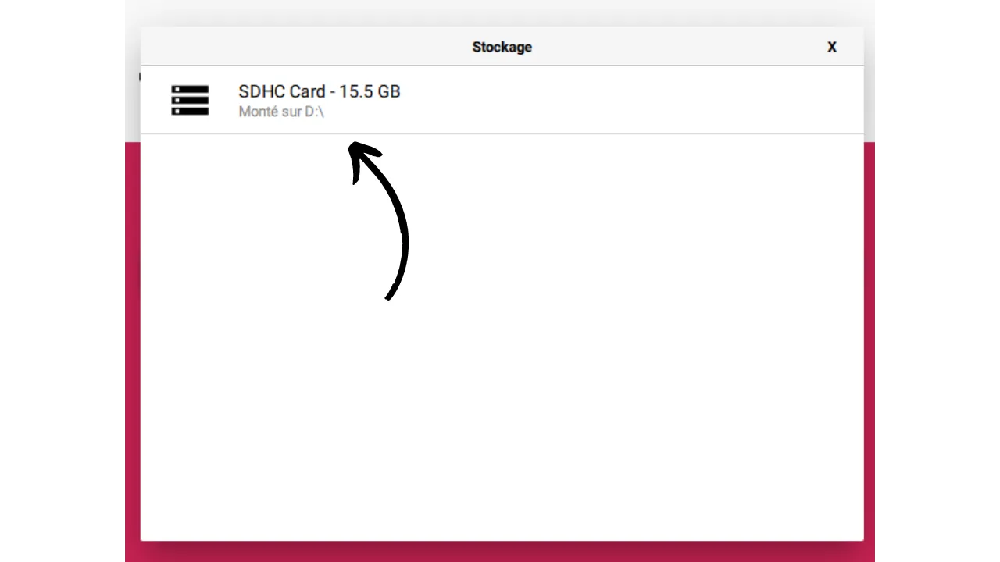
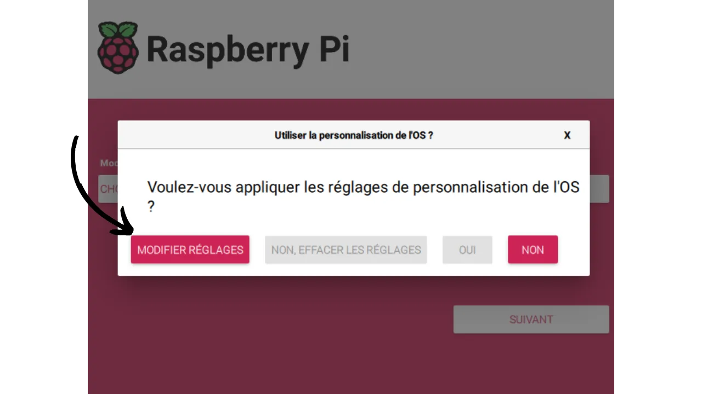
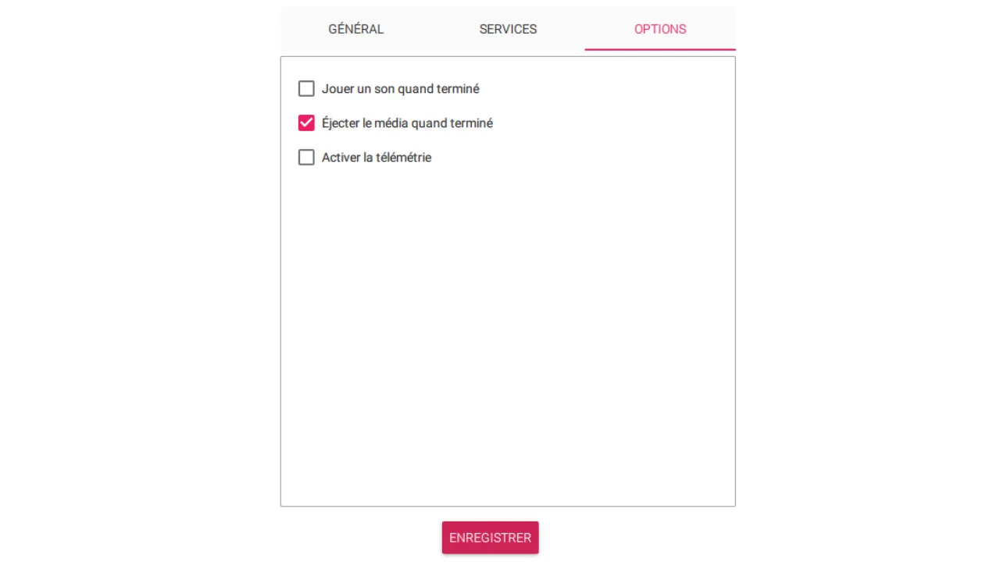
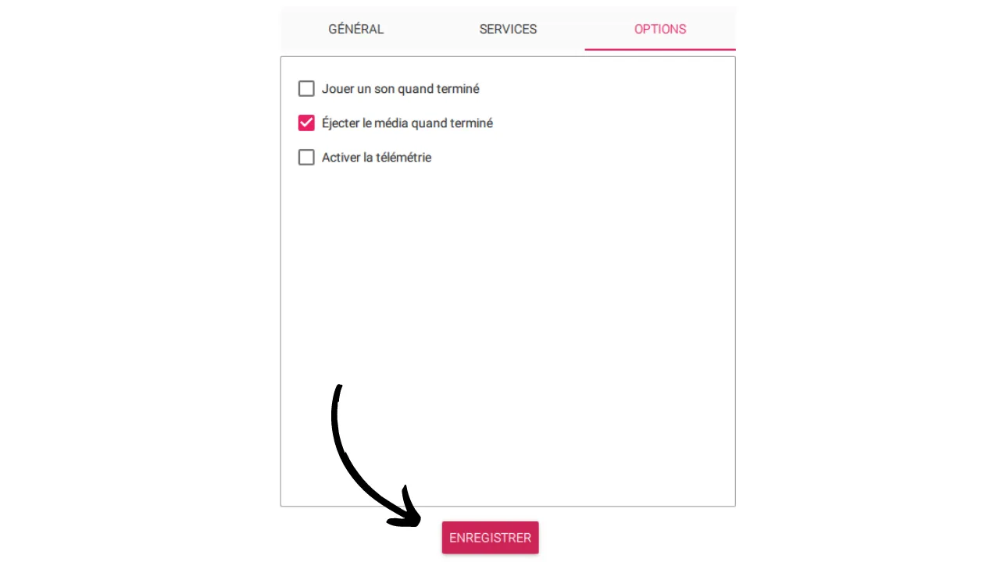

> "*Usa Bitcoin con privacidad.*"

En [un tutorial anterior](https://planb.network/tutorials/node/ronin-dojo), ya habíamos explicado el procedimiento para instalar y usar RoninDojo v1. Sin embargo, durante el último año, los equipos de RoninDojo lanzaron la versión 2 de su implementación, lo que marcó un punto de inflexión significativo en la arquitectura del software. De hecho, se alejaron de la distribución Linux Manjaro en favor de Debian. En consecuencia, ya no ofrecen una imagen preconfigurada para la instalación automática en Raspberry Pi. Pero todavía hay un método para proceder con una instalación manual. Esto es lo que utilicé para mi propio nodo, y desde entonces, RoninDojo v2 ha estado funcionando maravillosamente en mi Raspberry Pi 4. Por lo tanto, estoy ofreciendo un nuevo tutorial sobre cómo instalar manualmente RoninDojo v2 en una Raspberry Pi.

## Tabla de Contenidos:
- ¿Qué es RoninDojo?
- ¿Qué hardware elegir para instalar RoninDojo v2?
- ¿Cómo ensamblar la Raspberry Pi 4?
- ¿Cómo instalar RoninDojo v2 en una Raspberry Pi 4?
- ¿Cómo usar tu nodo RoninDojo v2?

## ¿Qué es RoninDojo?
[Dojo](https://samouraiwallet.com/dojo) es inicialmente una implementación completa de nodo Bitcoin, basada en Bitcoin Core, y desarrollada por los equipos de Samourai Wallet. Esta solución se puede instalar en cualquier equipo. A diferencia de otras implementaciones de Core, Dojo ha sido específicamente optimizado para integrarse con el entorno de aplicación Android de Samourai Wallet. En cuanto a RoninDojo, es una utilidad diseñada para facilitar la instalación y gestión de un Dojo, así como de varias otras herramientas complementarias. En resumen, RoninDojo enriquece la implementación básica de Dojo integrando una multitud de herramientas adicionales, al tiempo que simplifica su instalación y gestión.

Ronin también ofrece [una solución de nodo en caja, llamada "*Tanto*"](https://ronindojo.io/en/products), un dispositivo con RoninDojo ya instalado en un sistema ensamblado por su equipo. El Tanto es una opción de pago, que puede ser interesante para aquellos que prefieren evitar complicaciones técnicas. Pero dado que el código fuente de RoninDojo es abierto, también es posible desplegarlo en tu propio hardware. Esta alternativa, más económica, requiere algunas manipulaciones adicionales, que cubriremos en este tutorial.
RoninDojo es un Dojo, por lo tanto, permite una fácil integración de Whirlpool CLI en tu nodo Bitcoin para proporcionar la mejor experiencia de coinjoin posible. Con Whirlpool CLI, se hace posible remezclar continuamente tus bitcoins, 24 horas al día, 7 días a la semana, sin requerir que tu computadora personal permanezca encendida.

Más allá de Whirlpool CLI, RoninDojo incluye una variedad de herramientas para mejorar las funcionalidades de tu Dojo. Entre estas, la calculadora Boltzmann analiza el nivel de privacidad de tus transacciones, el servidor Electrum permite la conexión de tus billeteras Bitcoin a tu nodo, y el servidor Mempool te permite ver tus transacciones localmente, sin filtrar información.
En comparación con otras soluciones de nodo como Umbrel, RoninDojo se enfoca claramente en soluciones en cadena y herramientas de privacidad. A diferencia de Umbrel, RoninDojo no admite la configuración de un nodo Lightning ni la integración de aplicaciones de servidor más generalistas. Aunque RoninDojo ofrece menos herramientas versátiles que Umbrel, tiene todas las funcionalidades esenciales para gestionar tu actividad en cadena.
Si no necesitas funcionalidades generalistas o aquellas relacionadas con la Red Lightning como las que ofrece Umbrel, y estás buscando un nodo simple, estable con herramientas esenciales como Whirlpool o Mempool, RoninDojo podría ser la solución ideal. Mientras que Umbrel tiende a convertirse en un mini servidor multitarea orientado hacia la Red Lightning y la versatilidad, RoninDojo, en línea con la filosofía de Samourai Wallet, se centra en herramientas fundamentales para la privacidad del usuario.

Ahora que hemos delineado RoninDojo, veamos juntos cómo configurar este nodo.

## ¿Qué hardware elegir para instalar RoninDojo v2?
RoninDojo ofrece una imagen para la instalación automática de su software en un [RockPro64](https://ronindojo.io/en/download). Sin embargo, nuestro tutorial se centra en el procedimiento de instalación manual en un Raspberry Pi 4. Aunque el Raspberry Pi 5 ha sido lanzado recientemente, y este tutorial debería ser teóricamente compatible con este nuevo modelo, aún no he tenido la oportunidad de probarlo personalmente, y no he encontrado comentarios de la comunidad. Tan pronto como adquiera el Pi 5 y los componentes compatibles, actualizaré este tutorial para mantenerlos informados. Mientras tanto, recomiendo priorizar el Pi 4, ya que funciona perfectamente para mi nodo.
Por mi parte, ejecuto RoninDojo en un Raspberry Pi equipado con 8 GB de RAM. Aunque algunos miembros de la comunidad han logrado que funcione en dispositivos con solo 4 GB de RAM, no he probado esta configuración yo mismo. Dada la pequeña diferencia de precio, parece prudente optar por la versión de 8 GB de RAM. Esto también podría resultar útil si planeas reutilizar tu Raspberry Pi para otros usos en el futuro.
Es importante señalar que los equipos de RoninDojo han informado sobre problemas frecuentes relacionados con la carcasa y el adaptador SSD. Yo mismo me he enfrentado a estos problemas. **Por lo tanto, se recomienda encarecidamente evitar carcasas equipadas con un cable USB para el SSD de tu nodo.** En su lugar, prefiere una tarjeta de expansión de almacenamiento diseñada específicamente para tu Raspberry Pi:

Para almacenar la blockchain de Bitcoin, necesitarás un SSD compatible con la tarjeta de expansión de almacenamiento que hayas elegido. Actualmente (febrero de 2024), estamos en una fase de transición. Se espera que, en unos meses, los discos de 1 TB ya no sean suficientes para contener el tamaño creciente de la blockchain, especialmente considerando las diversas aplicaciones que planeas integrar en tu nodo. Algunos, por lo tanto, recomiendan invertir en un SSD de 2 TB para tener tranquilidad a largo plazo. Sin embargo, con la tendencia a la baja en los precios de los SSD año tras año, otros sugieren conformarse con un disco de 1 TB, que debería ser suficiente para uno o dos años, argumentando que para cuando se vuelva obsoleto, el costo de los modelos de 2 TB probablemente habrá disminuido. La elección depende de tus preferencias personales. Si planeas mantener tu RoninDojo durante una duración significativa y deseas evitar cualquier manejo técnico en los próximos años, la opción de un SSD de 2 TB parece ser la más prudente, ya que te ofrece un margen cómodo para el futuro.

Además, necesitarás varios componentes pequeños:
- Un estuche equipado con un ventilador para alojar tu Raspberry Pi y tu tarjeta de expansión de almacenamiento. Los kits que incluyen tanto la tarjeta de expansión SSD como un estuche compatible están disponibles en línea;
- Un cable de alimentación para tu Raspberry Pi;
- Una tarjeta micro SD de al menos 16 GB (aunque técnicamente 8 GB podrían ser suficientes, la diferencia de precio entre tarjetas de 8 y 16 GB a menudo es insignificante);
- Un cable Ethernet RJ45 para conexión de red.

## ¿Cómo ensamblar la Raspberry Pi 4?
El ensamblaje de tu nodo variará dependiendo del hardware elegido, especialmente el tipo de estuche. Sin embargo, el esquema general de los pasos a seguir permanece generalmente similar en el ensamblaje.
Comienza instalando tu SSD en la tarjeta de expansión de almacenamiento, asegurándote de fijar los dos tornillos de bloqueo en la parte trasera.

Luego, acopla tu Raspberry Pi a la tarjeta de expansión.

Además, acopla el ventilador a la Raspberry Pi.

Conecta los diversos componentes, prestando atención a usar los pines correctos, refiriéndote al manual de tu estuche. Los fabricantes de estuches a menudo ofrecen tutoriales en video para asistirte en el ensamblaje. En mi caso, tengo una tarjeta de expansión adicional equipada con un botón de encendido/apagado. Esto no es esencial para hacer un nodo de Bitcoin. Principalmente lo uso para tener un botón de encendido.

Si, como yo, tienes una tarjeta de expansión equipada con un botón de encendido/apagado, no olvides instalar el pequeño puente "Auto Power On". Esto permitirá que tu nodo se inicie automáticamente tan pronto como se encienda. Esta característica es particularmente útil en caso de un corte de energía, ya que permite que tu nodo se reinicie por sí mismo, sin intervención manual de tu parte.

Antes de insertar todo el hardware en el estuche, es importante verificar el correcto funcionamiento de tu Raspberry Pi, la tarjeta de expansión de almacenamiento y el ventilador encendiéndolos.

Finalmente, instala tu Raspberry Pi en su estuche. Ten en cuenta, un paso posterior requerirá agregar la tarjeta micro SD en el puerto apropiado en la Raspberry Pi. Si tu estuche está equipado con una apertura que te permite insertar la tarjeta SD sin tener que abrirlo (como es el caso del mío ilustrado en la foto), puedes proceder a cerrar el estuche ahora. Sin embargo, si tu estuche no tiene acceso directo al puerto micro SD, necesitarás esperar hasta que hayas preparado la tarjeta micro SD para insertarla antes de finalizar el ensamblaje.

## ¿Cómo instalar RoninDojo v2 en una Raspberry Pi 4?

### Paso 1: Preparar la micro SD booteable
Después de ensamblar tu hardware, el siguiente paso es instalar RoninDojo. Para esto, prepararemos una tarjeta micro SD booteable desde tu computadora, quemando la imagen de disco apropiada en ella.
Necesitarás usar el software _**Raspberry Pi Imager**_, diseñado para facilitar la descarga, configuración y escritura de sistemas operativos en una tarjeta micro SD para su uso con una Raspberry Pi. Comienza instalando este software en tu PC personal:
- Para Ubuntu/Debian: https://downloads.raspberrypi.org/imager/imager_latest_amd64.deb
- Para Windows: https://downloads.raspberrypi.org/imager/imager_latest.exe
- Para Mac: https://downloads.raspberrypi.org/imager/imager_latest.dmg
Una vez instalado el software, ábrelo e inserta tu tarjeta micro SD en tu computadora personal. Desde la interfaz de Raspberry Pi Imager, selecciona `CHOOSE OS`:

A continuación, ve al menú `Raspberry Pi OS (other)`:

Elige el sistema operativo llamado `Raspberry Pi OS (Legacy, 64-bit) Lite`, que tiene un tamaño de `0.3 GB`:

Después de seleccionar el sistema operativo, serás redirigido al menú principal de Raspberry Pi Imager. Haz clic en `CHOOSE STORAGE`:

Selecciona tu tarjeta micro SD:

Después de elegir el sistema operativo y la tarjeta micro SD, haz clic en `NEXT`:

Aparecerá una nueva ventana. Selecciona `EDIT CONFIGURATION`:

En esta ventana, ve a la pestaña `GENERAL` y realiza las siguientes configuraciones (que son muy importantes para que funcione):
- Habilita la opción y asigna `RoninDojo` como el nombre de host;
- Habilita `Set username and password`, introduce `pi` como el nombre de usuario, elige una contraseña y anota esta información, ya que será necesaria más tarde. Estas credenciales son temporales y se eliminarán después;
- Deshabilita `Configure Wi-Fi`;
- Habilita `Set locale settings` y selecciona tu zona horaria así como el tipo de teclado correspondiente a tu computadora;

En la pestaña de SERVICIOS, haz clic en la casilla `Enable SSH` y selecciona `Use a password for authentication`:

Además, asegúrate de que en la pestaña `OPTIONS`, la telemetría esté desactivada:

Haz clic en `SAVE`:

Confirma haciendo clic en `YES` para comenzar a crear la tarjeta micro SD booteable:

Un mensaje te informará que todos los datos en la tarjeta micro SD serán borrados. Confirma haciendo clic en `YES` para iniciar el proceso:

Espera hasta que el software termine de preparar tu tarjeta micro SD:

Cuando aparezca el mensaje indicando el fin del proceso, puedes retirar la tarjeta micro SD de tu computadora:

### Paso 2: Completa el Ensamblaje del Nodo
Ahora puedes insertar la tarjeta micro SD en el puerto correspondiente de tu Raspberry Pi.

Luego conecta tu Raspberry Pi a tu router usando el cable Ethernet. Finalmente, enciende tu nodo conectando el cable de alimentación y presionando el botón de encendido (si tu configuración incluye uno).

### Paso 3: Establece una Conexión SSH con el Nodo
Primero, es necesario encontrar la dirección IP de tu nodo. Tienes la opción de usar una herramienta como _[Advanced IP Scanner](https://www.advanced-ip-scanner.com/)_ o _[Angry IP Scanner](https://angryip.org/)_, o revisar la interfaz de administración de tu router. La dirección IP debería tener el formato `192.168.1.??`. **Para todos los comandos siguientes, reemplaza `[IP]` con la dirección IP real de tu nodo**, (eliminando los corchetes).

Lanza un terminal.
Para eliminar una posible clave ya asociada con la dirección IP de tu nodo, ejecuta el comando: `ssh-keygen -R [IP]`.

Un error después de este comando no es grave; simplemente significa que la clave no existe en tu lista de hosts conocidos (lo cual es bastante probable). Por ejemplo, si la IP de tu nodo es `192.168.1.40`, el comando se convierte en: `ssh-keygen -R 192.168.1.40`.

A continuación, establece una conexión SSH con tu nodo ejecutando el comando:
`ssh pi@[IP]`.
Aparecerá un mensaje sobre la autenticidad del host: `The authenticity of host '[IP]' can't be established.` Esto indica que no se puede verificar la autenticidad del dispositivo al que intentas conectarte debido a la falta de una clave pública conocida. Al conectarte vía SSH a un nuevo host por primera vez, este mensaje siempre aparecerá. Debes responder `yes` para agregar su clave pública a tu directorio local, lo que evitará que este mensaje de advertencia aparezca durante futuras conexiones SSH a este nodo. Por lo tanto, escribe `yes` y presiona `enter` para validar.
Luego se te pedirá que ingreses tu contraseña, la que previamente se estableció como temporal en el paso 1. Valida con `enter`. Entonces estarás conectado a tu nodo vía SSH.

En resumen, aquí están los comandos a ejecutar:
- `ssh-keygen -R [IP]`
- `ssh pi@[IP]`
- `yes`
- Ingresa la contraseña temporal y valida.

### Paso 4: Actualización y Preparación
Ahora estás conectado a tu nodo vía una sesión SSH. En tu terminal, el prompt de comando debería ser: `pi@RoninDojo:~ $`. Para comenzar, actualiza la lista de paquetes disponibles e instala actualizaciones para los paquetes existentes con el siguiente comando:
`sudo apt update && sudo apt upgrade -y`

Una vez que las actualizaciones estén completadas, procede a instalar *Git* y *Dialog* usando el comando:
`sudo apt install git dialog -y`

A continuación, clona la rama `master` del repositorio Git de _RoninOS_ ejecutando:
`sudo git clone --branch master https://code.samourai.io/ronindojo/RoninOS.git /opt/RoninOS`

Ejecuta el script `customize-image.sh` con el comando:
`cd /opt/RoninOS/ && sudo ./customize-image.sh`

**Es importante dejar que el script se ejecute sin interrupción y esperar pacientemente al final de su proceso**, lo cual toma alrededor de 10 minutos. Cuando aparezca el mensaje `Setup is complete`, puedes pasar al siguiente paso.

### Paso 5: Lanzamiento de RoninOS
Lanza RoninOS con el comando:
`sudo systemctl start ronin-setup`

Muestra las líneas del archivo de registro con el comando:
`tail -f /home/ronindojo/.logs/setup.logs`

En esta etapa, **es importante dejar que RoninOS se lance y esperar a que** termine de ejecutarse. Esto toma alrededor de 40 minutos. Cuando aparezca `All RoninDojo feature installations complete!`, puedes proceder al paso 6.

### Paso 6: Accediendo a RoninUI y Cambiando Credenciales
Después de completar la instalación, para conectarte a tu nodo a través de un navegador, asegúrate de que tu computadora personal esté conectada a la misma red local que tu nodo. Si estás usando una VPN en tu máquina, desactívala temporalmente. Para acceder a la interfaz del nodo en tu navegador, ingresa en la barra de URL:
- Directamente la dirección IP de tu nodo, por ejemplo, `192.168.1.??`;
- O, escribe `ronindojo.local`.
Una vez en la página de inicio de RoninUI, se te pedirá que comiences la configuración. Para hacerlo, haz clic en el botón `Let's start`.

En esta etapa, RoninUI te presenta tu contraseña `root`. Es esencial mantenerla segura. Puedes optar por una copia de seguridad física, en papel, o guardarla en un [gestor de contraseñas](https://planb.network/courses/secu101/4/2).

Después de guardar la contraseña `root`, marca la casilla `I have backed up Root user credentials` y haz clic en `Continue` para continuar.

El siguiente paso implica crear una contraseña de usuario, que se utilizará tanto para acceder a la interfaz web de RoninUI como para establecer sesiones SSH con tu nodo. Elige una contraseña fuerte y asegúrate de guardarla de manera segura. Necesitarás ingresar esta contraseña dos veces antes de hacer clic en `Finish` para validar. En cuanto al nombre de usuario, se recomienda mantener la opción predeterminada, `ronindojo`. Si decides cambiarlo, recuerda ajustar los comandos en los siguientes pasos en consecuencia.

Una vez completadas estas acciones, espera a que tu nodo se inicialice. Luego accederás a la interfaz web de RoninUI. ¡Estás casi al final del proceso, solo quedan unos pocos pasos pequeños!

### Paso 7: Eliminar Credenciales Temporales
Abre un nuevo terminal en tu computadora personal y establece una conexión SSH con tu nodo utilizando el siguiente comando:
`SSH ronindojo@[IP]`

Si, por ejemplo, la dirección IP de tu nodo es `192.168.1.40`, el comando apropiado será:
`SSH ronindojo@192.168.1.40`

Si cambiaste tu nombre de usuario durante el paso anterior, reemplazando el nombre de usuario predeterminado (`ronindojo`) por otro, asegúrate de usar este nuevo nombre en el comando. Por ejemplo, si elegiste `planb` como el nombre de usuario y la dirección IP es `192.168.1.40`, el comando a ingresar será:
`SSH planb@192.168.1.40`
Se te pedirá que ingreses la contraseña del usuario. Ingrésala y luego presiona `enter` para validar. Luego accederás a la interfaz RoninCLI. Usa las teclas de flecha en tu teclado para navegar a la opción `Exit RoninDojo` y presiona `enter` para seleccionarla.

En este punto, estás en el terminal de tu nodo, con un indicador de comando similar a: `ronindojo@RoninDojo:~ $`. Para eliminar el usuario temporal creado durante la configuración de la tarjeta micro SD arrancable, ingresa el siguiente comando y presiona `enter`:
`sudo deluser --remove-home pi`

Se te pedirá que confirmes tu contraseña de usuario. Ingrésala y valida presionando `enter`. Espera a que la operación se complete, luego usa el comando `exit` para salir del terminal.
¡Felicidades! Tu nodo RoninDojo v2 ya está configurado y listo para usar. Comenzará su IBD (*Initial Block Download*, Descarga Inicial de Bloques), procediendo a descargar y verificar la blockchain de Bitcoin desde el bloque Génesis. Este paso implica recuperar todas las transacciones de Bitcoin realizadas desde el 3 de enero de 2009 y toma algo de tiempo. Una vez que la blockchain esté completamente descargada, el indexador procederá a comprimir la base de datos. La duración del IBD puede variar considerablemente. Tu nodo RoninDojo estará completamente operativo una vez que este proceso se haya completado.
**Si estás migrando de un antiguo nodo RoninDojo v1** a esta nueva versión con este tutorial mientras mantienes el mismo SSD, tu nodo debería detectar automáticamente y reutilizar los datos existentes en el disco, ahorrándote la necesidad de realizar el IBD nuevamente. En este caso, solo necesitarás esperar a que tu nodo se resincronice con los últimos bloques.

## ¿Cómo usar tu nodo RoninDojo v2?

### Conectando tu software de billetera a Electrs
El primer uso de tu nodo recién instalado y sincronizado será transmitir tus transacciones a la red de Bitcoin. Probablemente querrás conectar tus diversas billeteras a tu nodo para transmitir tus transacciones de manera confidencial. Puedes hacer esto a través de Electrum Rust Server (electrs). Esta aplicación generalmente viene preinstalada en tu nodo RoninDojo. Si no, podrías instalarla manualmente a través de la interfaz RoninCLI en `Applications > Manage Applications > Install Electrum Server`.

Para obtener la dirección Tor de tu Electrum Server, desde la interfaz web RoninUI, ve a:
`Pairing > Electrum server > Pair now`

Luego necesitarás ingresar la dirección `Hostname` que termina en `.onion` en tu software de billetera, acompañado por el puerto `50001`. 
Por ejemplo, en Sparrow Wallet, simplemente ve a la pestaña:
`File > Preferences > Server > Private Electrum`

### Conectando tu software de billetera a Samourai Dojo
Como alternativa a usar Electrs, Dojo te permite conectar tu software de billetera compatible directamente a tu nodo RoninDojo. Billeteras como Samourai Wallet y Sentinel ofrecen esta funcionalidad.

Para establecer la conexión, solo necesitarás escanear el código QR de tu Dojo. Para acceder a este código QR a través de RoninUI, navega a:
`Pairing > Samourai Dojo > Pair now`

Para vincular tu Samourai Wallet a tu Dojo, simplemente escanea este código QR durante la instalación de la app:

Si ya tenías una Samourai Wallet antes de configurar tu Ronin Dojo, es necesario hacer una copia de seguridad de tu billetera, desinstalar y luego reinstalar la aplicación Samourai Wallet, antes de restaurar tu billetera. Al iniciar la aplicación reinstalada, tendrás la opción de conectarte a un nuevo Dojo. **¡Ten cuidado, este proceso conlleva el riesgo de perder tus bitcoins si no se ejecuta correctamente!** Asegúrate de tener la copia de seguridad de tu Samourai Wallet en tus archivos y verifica la validez de tu frase de paso a través de `Configuración > Solución de problemas > Frase de paso`. También es importante tener una copia de seguridad legible de tu frase de recuperación y tu frase de paso. Para más precisión en esta operación, se recomienda seguir este tutorial detallado: [https://wiki.ronindojo.io/en/setup/v2_0_0-upgrade/reconnectsamourai](https://wiki.ronindojo.io/en/setup/v2_0_0-upgrade/reconnectsamourai).

### Usando tu propio explorador de bloques Mempool.space
Un explorador de bloques transforma la información cruda de la blockchain de Bitcoin en un formato estructurado y fácilmente legible. Con herramientas como *Mempool.space*, es posible analizar transacciones, buscar direcciones específicas o incluso consultar las tarifas medias de los mempools de la red en tiempo real.

Sin embargo, usar exploradores de bloques en línea plantea riesgos para tu privacidad e implica confiar en los datos proporcionados por terceros. De hecho, al usar estos servicios sin pasar por tu propio nodo, podrías divulgar inadvertidamente información sobre tus transacciones y debes confiar en la precisión de la información presentada por el propietario del sitio.
Para mitigar estos riesgos, se recomienda usar tu propia instancia de *Mempool.space* a través de la red Tor, alojada directamente en tu nodo. Esta solución asegura la preservación de tu privacidad y la autonomía de tus datos.
Para hacer esto, comienza por instalar *Mempool Space Visualizer* desde RoninUI. En la interfaz web, ve a la pestaña `Dashboard` y haz clic en `Gestionar` debajo de `Mempool Space`:
`Dashboard > Mempool Space > Gestionar`

Luego haz clic en el botón `Instalar visualizador de Mempool`:

Confirma tu contraseña de usuario:

Espera a que se complete la instalación, luego haz clic nuevamente en el botón `Gestionar`:

Obtendrás un enlace `.onion` para acceder a tu propia instancia de *Mempool.space* a través de la red Tor.

Te aconsejo guardar este enlace en tus favoritos en el navegador Tor o agregarlo a la aplicación Tor Browser en tu smartphone para un acceso fácil y seguro desde cualquier lugar. Si aún no tienes el navegador Tor, puedes descargarlo aquí: [https://www.torproject.org/download/](https://www.torproject.org/download/)

### Usando Whirlpool para mezclar tus bitcoins
Tu nodo RoninDojo también integra _WhirlpoolCLI_, una interfaz de línea de comandos que permite la automatización de coinjoins de Whirlpool, y _WhirlpoolGUI_, una interfaz gráfica diseñada para interactuar con _WhirlpoolCLI_.
Realizar un coinjoin mediante Whirlpool requiere que la aplicación utilizada esté activa para llevar a cabo remixes. Esta condición puede ser restrictiva para aquellos que desean alcanzar altos niveles de anonimato. De hecho, el dispositivo que aloja la aplicación que integra Whirlpool debe permanecer encendido continuamente. Esto significa que para participar en remixes las 24 horas del día, tu computadora o smartphone debe permanecer encendido con Samourai o Sparrow abierto continuamente. Una solución a esta restricción es usar _WhirlpoolCLI_ en una máquina que esté siempre encendida, como un nodo de Bitcoin, permitiendo que tus monedas se remezclen sin interrupción, y sin la necesidad de mantener otro dispositivo encendido.
Un tutorial detallado está en preparación para guiarte paso a paso a través del proceso de coinjoining con Samourai Wallet y RoninDojo v2, de la A a la Z.

Para un entendimiento más profundo del coinjoin y su uso en Bitcoin, también te invito a consultar este otro artículo: [Entendiendo y usando coinjoin en Bitcoin](https://planb.network/tutorials/privacy/coinjoin), donde detallo todo lo que necesitas saber sobre esta técnica.
### Usando Whirlpool Stat Tool (WST)

Después de realizar coinjoins con Whirlpool, es útil evaluar precisamente el nivel de privacidad alcanzado para tus UTXOs mezclados. Para hacer esto, puedes usar la herramienta Python *Whirlpool Stat Tool*. Esta herramienta te permite medir tanto los puntajes prospectivos como retrospectivos de tus UTXOs, mientras analiza su tasa de difusión en el pool.

Para profundizar tu comprensión de los mecanismos de cálculo de estos anonsets, recomiendo leer el artículo: [REMIX - WHIRLPOOL](https://planb.network/tutorials/privacy/remix-whirlpool), que detalla el funcionamiento de estos índices.

Para acceder a la herramienta WST, ve a RoninCLI. Para hacer esto, abre un terminal en tu computadora personal y establece una conexión SSH con tu nodo usando el siguiente comando:
`SSH ronindojo@[IP]`

Si, por ejemplo, la dirección IP de tu nodo es `192.168.1.40`, el comando apropiado sería:
`SSH ronindojo@192.168.1.40`

Si cambiaste tu nombre de usuario durante el paso 6, reemplazando el nombre de usuario predeterminado (`ronindojo`) por otro, asegúrate de usar este nuevo nombre en el comando. Por ejemplo, si elegiste `planb` como tu nombre de usuario y la dirección IP es `192.168.1.40`, el comando a ingresar sería:
`SSH planb@192.168.1.40`

Se te pedirá que ingreses la contraseña del usuario. Ingrésala y presiona `enter` para validar. Luego accederás a la interfaz de RoninCLI. Usa las teclas de flecha en tu teclado para navegar al menú `Samourai Toolkit` y presiona `enter` para seleccionarlo:

Luego selecciona `Whirlpool Stat Tool`:

Al inicializar WST, la herramienta procederá con su instalación automática. Espera durante este paso. Las instrucciones de uso se desplazarán. Una vez completada la instalación, presiona cualquier tecla para acceder al terminal WST:

Se mostrará el siguiente indicador de comando:
`wst#/tmp>`

Si deseas salir de esta interfaz y volver al menú de RoninCLI, simplemente ingresa:
`quit`

Primero, es necesario configurar el proxy para usar Tor, para asegurar la confidencialidad al extraer datos de [OXT](https://oxt.me/). Ingresa el comando:
`socks5 127.0.0.1:9050`
Posteriormente, procede a descargar la información del pool que contiene tu transacción:
`download 0001`
Reemplaza `0001` con el código de denominación del pool que te interesa. Los códigos de denominación son los siguientes en WST:
- Pool 0.5 bitcoins: `05`
- Pool 0.05 bitcoins: `005`
- Pool 0.01 bitcoins: `001`
- Pool 0.001 bitcoins: `0001`

Después de descargar, carga los datos reemplazando `0001` con el código de tu pool en este comando: `load 0001`

Espera a que la carga se complete, lo que puede tomar unos minutos. Una vez que los datos estén cargados, para conocer los puntajes de anonset de tu moneda, ejecuta el comando `score` seguido de tu TXID (sin los corchetes):
`score [TXID]`

WST mostrará entonces el puntaje retrospectivo (_Métricas retrospectivas_), seguido del puntaje prospectivo (_Métricas prospectivas_). Además de los puntajes de anonset, WST también indicará la tasa de difusión de tu transacción dentro del pool, en relación con su anonset.

**Es importante notar que el puntaje prospectivo de tu moneda debe ser calculado a partir del TXID de tu mezcla inicial, y no de tu mezcla más reciente. Por el contrario, el puntaje retrospectivo de un UTXO se calcula a partir del TXID del último ciclo.**

### Usando el Calculador Boltzmann
El Calculador Boltzmann es una herramienta para analizar una transacción de Bitcoin, ofreciendo la capacidad de medir su nivel de entropía entre otras métricas avanzadas. Estos datos proporcionan una evaluación cuantificada de la privacidad de una transacción y ayudan a identificar posibles fallos. Esta herramienta ya está integrada en tu nodo RoninDojo, facilitando su acceso y uso.

Antes de detallar el procedimiento para usar el Calculador Boltzmann, es importante entender el significado de estos indicadores, su método de cálculo y su utilidad. Aunque aplicables a cualquier transacción de Bitcoin, estos indicadores son particularmente útiles para evaluar la calidad de una transacción coinjoin.

**El primer indicador** que calcula el software es el número total de combinaciones posibles, indicado bajo `nb combinations` en la herramienta. Basado en los valores de los UTXOs involucrados, este indicador cuantifica el número de maneras en que las entradas pueden asociarse con las salidas. En otras palabras, determina el número de interpretaciones plausibles que puede generar una transacción. Por ejemplo, un coinjoin estructurado según el modelo Whirlpool 5x5 presenta `1496` combinaciones posibles:

Crédito: [KYCP.org](https://kycp.org/#/fe5e5abab7ea452f87603f7ebc2fa4e77380eafcc927e1cb51e1a72401ab073d)
**El segundo indicador** calculado es la entropía de una transacción, designada por `Entropy`. Cuando una transacción tiene un alto número de combinaciones posibles, a menudo es más relevante referirse a su entropía. Esto se define como el logaritmo binario del número de combinaciones posibles. Aquí está la fórmula utilizada:
- $E$: la entropía de la transacción;
- $C$: el número de combinaciones posibles para la transacción.
$$E = \log_2(C)$$
En matemáticas, el logaritmo binario (logaritmo base 2) corresponde a la operación inversa de elevar 2 a una potencia. En otras palabras, el logaritmo binario de $x$ es el exponente al cual se debe elevar 2 para obtener $x$. Por lo tanto, este indicador se expresa en bits. Tomemos el ejemplo de calcular la entropía para una transacción coinjoin estructurada según el modelo Whirlpool 5x5, que, como se mencionó anteriormente, ofrece un número de combinaciones posibles de `1496`:$$ C = 1496 $$
$$ E = \log_2(1496) $$
$$ E \approx 10.5469 \text{ bits}$$

Así, esta transacción coinjoin muestra una entropía de 10.5469 bits, lo cual se considera muy satisfactorio. Cuanto mayor sea este valor, más interpretaciones diferentes admite la transacción, mejorando así su nivel de privacidad.

Tomemos un ejemplo adicional con una transacción más convencional, que tiene una entrada y dos salidas: [1b1b0c3f0883a99f1161c64da19471841ed12a1f78e77fab128c69a5f578ccce](https://mempool.space/es/tx/1b1b0c3f0883a99f1161c64da19471841ed12a1f78e77fab128c69a5f578ccce)
En el caso de esta transacción, la única interpretación posible es: `(inp 0) > (Outp 0 ; Outp 1)`. En consecuencia, su entropía se establece en `0`:
$$ C = 1 $$
$$ E = \log_2(1) $$
$$ E \approx 0 \text{ bits}$$
**El tercer indicador** proporcionado por el Calculador Boltzmann se denomina `Eficiencia de la Cartera`. Este indicador evalúa la eficiencia de la transacción comparándola con la transacción óptima concebible en una configuración idéntica. Esto nos lleva a discutir el concepto de entropía máxima, que corresponde a la mayor entropía que una estructura de transacción específica puede teóricamente alcanzar. Así, para una estructura coinjoin Whirlpool 5x5, la entropía máxima se establece en `10.5469`. La eficiencia de la transacción se calcula entonces confrontando esta entropía máxima con la entropía real de la transacción analizada. La fórmula utilizada es la siguiente:
- $ER$: la entropía real de la transacción, expresada en bits;
- $EM$: la entropía máxima posible para una estructura de transacción dada, también en bits;
- $Ef$: la eficiencia de la transacción, en bits.
$$Ef = ER - EM$$ $$Ef = 10.5469 - 10.5469$$
$$Ef = 0 \text{ bits}$$

Este indicador también se expresa como un porcentaje, su fórmula es entonces:
- $CR$: el número de combinaciones posibles reales;
- $CM$: el número máximo de combinaciones posibles con la misma estructura;
- $Ef$: la eficiencia expresada como un porcentaje.
$$Ef = \frac{CR}{CM}$$
$$Ef = \frac{1496}{1496}$$
$$Ef = 100\%$$

Una eficiencia del `100%` indica así que la transacción maximiza su potencial de privacidad basado en su estructura.
**El cuarto indicador**, la densidad de entropía, o `Entropy Density`, ofrece una perspectiva sobre la entropía relativa a cada entrada o salida de la transacción. Este indicador resulta útil para evaluar y comparar la eficiencia de transacciones de diferentes tamaños. Para calcularlo, simplemente divide la entropía total de la transacción por el número total de entradas y salidas involucradas. Tomando el ejemplo de un coinjoin Whirlpool 5x5:
- $ED$: la densidad de entropía expresada en bits;
- $E$: la entropía de la transacción expresada en bits;
- $T$: el número total de entradas y salidas en la transacción.
$$T = 5 + 5 = 10$$
$$ED = \frac{E}{T}$$
$$ED = \frac{10.5469}{10}$$
$$ED = 1.054 \text{ bits}$$
**La quinta información** entregada por el Calculador Boltzmann es la tabla de probabilidades de coincidencia entre entradas y salidas. Esta tabla indica, a través del `puntaje Boltzmann`, la probabilidad de que una entrada específica esté conectada a una salida dada. Tomando el ejemplo de un coinjoin Whirlpool, la tabla de probabilidad resaltaría las chances de enlace entre cada entrada y salida, proporcionando una medida cuantitativa de la ambigüedad o previsibilidad de las asociaciones en la transacción:
| %       | Salida 0 | Salida 1 | Salida 2 | Salida 3 | Salida 4 |
|---------|----------|----------|----------|----------|----------|
| Entrada 0 | 34%      | 34%      | 34%      | 34%      | 34%      |
| Entrada 1 | 34%      | 34%      | 34%      | 34%      | 34%      |
| Entrada 2 | 34%      | 34%      | 34%      | 34%      | 34%      |
| Entrada 3 | 34%      | 34%      | 34%      | 34%      | 34%      |
| Entrada 4 | 34%      | 34%      | 34%      | 34%      | 34%      |

Aquí, es claro que cada entrada tiene la misma probabilidad de estar asociada con cualquier salida, lo que refuerza la ambigüedad y confidencialidad de la transacción. Sin embargo, en el caso de una transacción simple con una entrada y dos salidas, la situación es diferente:

| %       | Salida 0 | Salida 1 |
|---------|----------|----------|
| Entrada 0 | 100%     | 100%     |

Aquí, vemos que la probabilidad de que cada salida provenga de la entrada 0 es del 100%. Una probabilidad más baja se traduce así en una mayor confidencialidad, al diluir los enlaces directos entre entradas y salidas.

**La sexta información** proporcionada es el número de enlaces determinísticos, complementado por la proporción de estos enlaces. Este indicador revela cuántas conexiones entre las entradas y salidas en la transacción analizada son indiscutibles, con una probabilidad del 100%. La proporción, a su vez, ofrece una perspectiva sobre el peso de estos enlaces determinísticos dentro del total de enlaces de la transacción.

Por ejemplo, una transacción de tipo coinjoin Whirlpool presenta cero enlaces determinísticos, y por lo tanto muestra un indicador y proporción del 0%. Por otro lado, en nuestra segunda transacción examinada (con una entrada y dos salidas), el indicador se establece en 2 y la proporción alcanza el 100%. Así, un indicador nulo señala una excelente confidencialidad gracias a la ausencia de enlaces directos e indiscutibles entre entradas y salidas.
**Cómo acceder al Calculador Boltzmann en RoninDojo?** Para acceder a la herramienta *Calculador Boltzmann*, ve a RoninCLI. Para hacer esto, abre un terminal en tu computadora personal y establece una conexión SSH con tu nodo usando el siguiente comando: `SSH ronindojo@[IP]`

Si, por ejemplo, la dirección IP de tu nodo es `192.168.1.40`, el comando apropiado sería:
`SSH ronindojo@192.168.1.40`

Si cambiaste tu nombre de usuario durante el paso 6, reemplazando el nombre de usuario predeterminado (`ronindojo`) por otro, asegúrate de usar este nuevo nombre en el comando. Por ejemplo, si elegiste `planb` como tu nombre de usuario y la dirección IP es `192.168.1.40`, el comando a ingresar sería:
`SSH planb@192.168.1.40`

Se te pedirá que ingreses la contraseña del usuario. Ingrésala y luego presiona `enter` para validar. Entonces accederás a la interfaz de RoninCLI. Usa las flechas en tu teclado para navegar al menú `Samourai Toolkit` y presiona `enter` para seleccionarlo:

Luego selecciona `Calculador Boltzmann`:

Llegarás a la página de inicio del software:

Ingresa el TXID de la transacción que deseas estudiar y presiona la tecla `enter`:

El calculador te proporciona entonces todos los indicadores que hemos discutido previamente:

### Otras características de tu RoninDojo v2
Tu nodo RoninDojo integra varias otras características. En particular, tienes la capacidad de escanear información específica para tomarla en cuenta. Por ejemplo, a veces tu billetera Samourai, conectada a RoninDojo, puede no mostrar los bitcoins que realmente posees. Si el saldo indica 0 mientras estás seguro de tener bitcoins en esta billetera, varias razones pueden explicar esta situación, como un error en las rutas de derivación. Pero una de las causas también puede ser que tu nodo no esté monitoreando adecuadamente tus direcciones. Para resolver este problema, puedes asegurarte de que tu nodo está siguiendo efectivamente tu `xpub` usando la _herramienta xpub_. Para acceder a esta herramienta a través de RoninUI, sigue el camino:
`Mantenimiento > Herramienta XPUB`

Ingresa el `xpub` que está causando el problema y haz clic en el botón `Verificar` para verificar esta información:

Asegúrate de que todas las transacciones estén correctamente listadas. También es importante verificar que el tipo de derivación utilizado coincida con el de tu billetera. Si este no es el caso, haz clic en `Reescribir`, luego elige entre `BIP44`, `BIP49`, o `BIP84` según tus necesidades.
Más allá de esta herramienta, la pestaña `Mantenimiento` de RoninUI está llena de otras características útiles:
- *Herramienta de Transacción*: Permite examinar los detalles de una transacción dada;
- *Herramienta de Dirección*: Permite confirmar el seguimiento de una dirección dada por tu Dojo;
- *Reescanear Bloques*: Obliga a tu nodo a realizar un nuevo escaneo de un rango de bloques especificado.

La pestaña `Push Tx` es otra característica interesante de RoninUI, que permite la transmisión de una transacción firmada en la red Bitcoin. La transacción debe ser ingresada en forma hexadecimal.

En cuanto a las otras pestañas disponibles en tu panel de RoninUI:
- `Apps`: Aloja la aplicación Whirlpool y seguramente se utilizará para integrar nuevas aplicaciones en el futuro.
- `Logs`: Ofrece acceso en tiempo real a los registros de eventos de tu software.
- `System Info`: Proporciona información general sobre tu nodo, como la temperatura del CPU, el uso del espacio de almacenamiento o datos de RAM. También encontrarás las opciones `Reboot` y `Shut down` para reiniciar o apagar tu nodo.
- `Settings`: Te permite cambiar tu contraseña de usuario.

¡Ahí lo tienes! Gracias por seguir este tutorial hasta el final. Si te gustó, te animo a compartirlo en redes sociales. Además, si tienes la oportunidad, considera apoyar a los desarrolladores que hacen disponibles estos software libres y de código abierto para nuestra comunidad con una donación: [https://donate.ronindojo.io/](https://donate.ronindojo.io/). Para profundizar tu conocimiento sobre RoninDojo y descubrir más recursos, te recomiendo encarecidamente consultar los enlaces a los recursos externos mencionados a continuación.

**Recursos externos:**
- [https://samouraiwallet.com/dojo](https://samouraiwallet.com/dojo)
- [https://ronindojo.io/index.html](https://ronindojo.io/index.html)
- [https://wiki.ronindojo.io/en/home](https://wiki.ronindojo.io/en/home)
- [https://code.samourai.io/ronindojo/RoninDojo](https://code.samourai.io/ronindojo/RoninDojo)
- [https://gist.github.com/LaurentMT/e758767ca4038ac40aaf](https://gist.github.com/LaurentMT/e758767ca4038ac40aaf)
