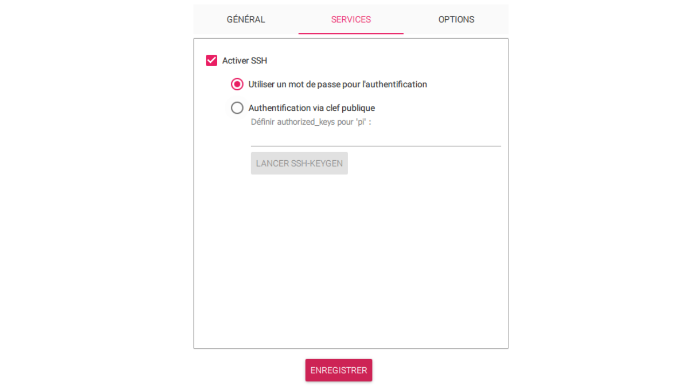
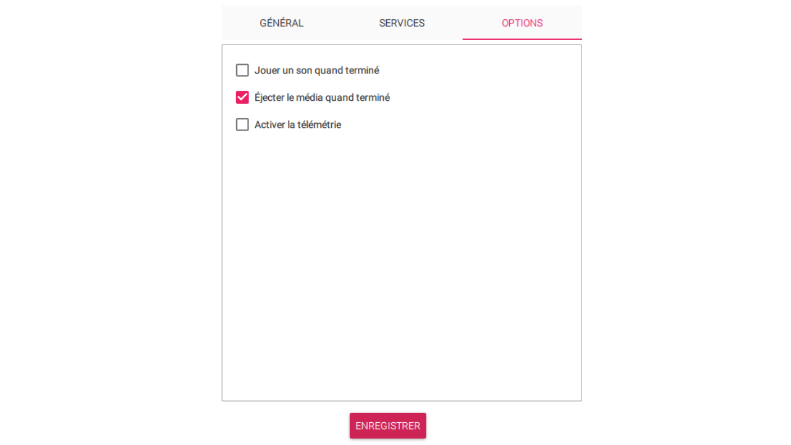
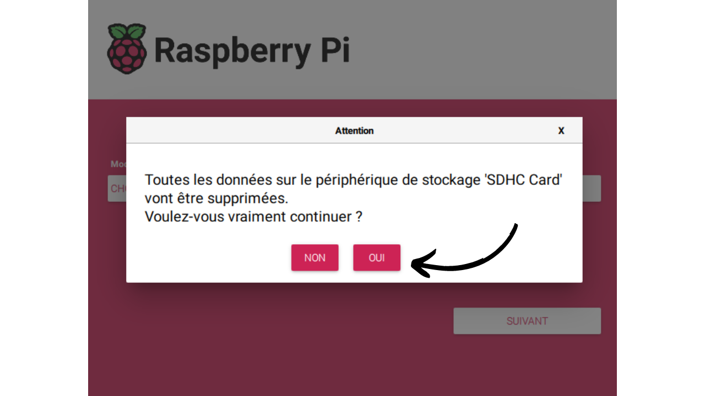
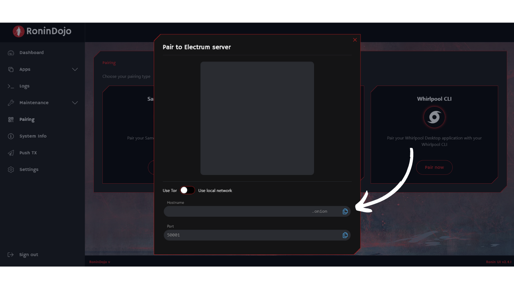
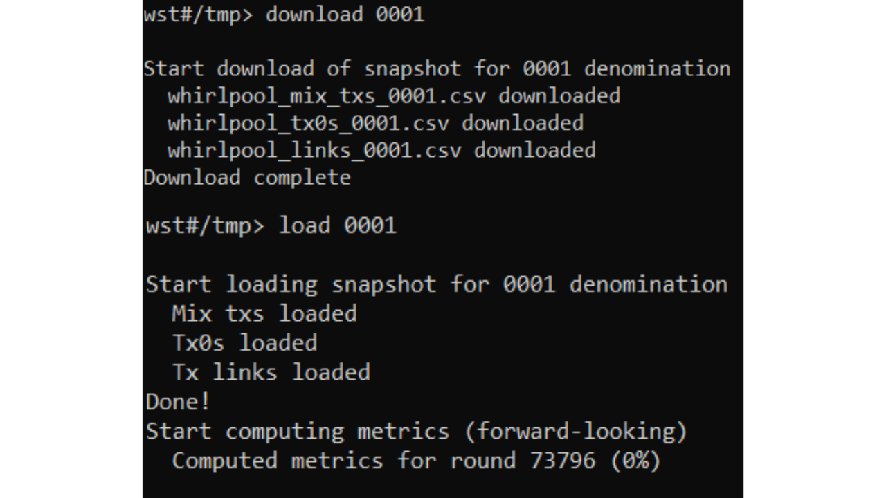
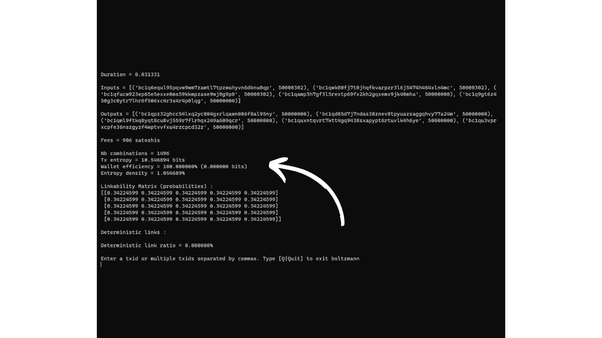

> "*Use Bitcoin with privacy.*"

Dans [un précédent tutoriel](https://planb.network/tutorials/node/ronin-dojo), nous avions déjà expliqué la procédure d'installation et d'utilisation de RoninDojo v1. Cependant, au cours de l'année dernière, les équipes de RoninDojo ont lancé la version 2 de leur implémentation, qui a marqué un tournant significatif dans l'architecture du logiciel. En effet, ils ont délaissé la distribution Linux Manjaro au profit de Debian. Par conséquence, ils ne proposent plus d'image préconfigurée pour une installation automatique sur Raspberry Pi. Mais il existe tout de même une méthode pour procéder à une installation manuelle. C'est ce que j'ai utilisé pour mon propre nœud, et depuis, RoninDojo v2 fonctionne à merveille sur mon Raspberry Pi 4. Je vous propose donc un nouveau tutoriel pour savoir comment installer manuellement RoninDojo v2 sur un Raspeberry Pi.

## Sommaire :
- Qu'est-ce que RoninDojo ?
- Quel matériel choisir pour installer RoninDojo v2 ?
- Comment monter le Raspberry Pi 4 ?
- Comment installer RoninDojo v2 sur un Raspberry Pi 4 ?
- Comment utiliser son nœud RoninDojo v2 ?

## Qu'est-ce que RoninDojo ?
[Dojo](https://samouraiwallet.com/dojo) est initialement une implémentation de nœud complet Bitcoin, fondée sur Bitcoin Core, et développée par les équipes de Samourai Wallet. Cette solution peut être installée sur n'importe quel équipement. Contrairement à d'autres implémentations de Core, Dojo a été spécifiquement optimisé pour s'intégrer à l'environnement de l'application Android Samourai Wallet. Quant à RoninDojo, il s'agit d'un utilitaire conçu pour faciliter l'installation et la gestion d'un Dojo, ainsi que de divers autres outils complémentaires. En somme, RoninDojo enrichit l'implémentation de base de Dojo en y intégrant une multitude d'outils supplémentaires, tout en simplifiant son installation et sa gestion.

Ronin proposent [également une solution de node-in-box, dénommé le « *Tanto* »](https://ronindojo.io/en/products), un dispositif avec RoninDojo déjà installé sur un système assemblé par leur équipe. Le Tanto est une option payante, qui peut être intéressante pour ceux qui préfèrent éviter les complications techniques. Mais le code source de RoninDojo étant ouvert, il est aussi possible de le déployer sur son propre matériel. Cette alternative, plus économique, nécessite néanmoins quelques manipulations supplémentaires, que nous allons aborder dans ce tutoriel.

RoninDojo est un Dojo, il permet donc d'intégrer facilement Whirlpool CLI à votre nœud Bitcoin afin de disposer de la meilleure expérience possible de coinjoin. Avec Whirlpool CLI, il devient possible de procéder au remixage de vos bitcoins de manière continue, 24 heures sur 24, 7 jours sur 7, sans nécessiter que votre ordinateur personnel reste allumé.

Au-delà de Whirlpool CLI, RoninDojo embarque une panoplie d'outils venant renforcer les fonctionnalités de votre Dojo. Parmi ceux-ci, le calculateur Boltzmann analyse le niveau de confidentialité de vos transactions, le serveur Electrum permet la connexion de vos portefeuilles Bitcoin à votre nœud, et le serveur Mempool vous permet de voir vos transactions en local, sans faire fuiter des informations.

En comparaison avec d'autres solutions de nœuds comme Umbrel, RoninDojo est clairement axé sur les solutions on-chain et les outils de confidentialité. Contrairement à Umbrel, RoninDojo ne supporte pas la mise en place d'un nœud Lightning ni l'intégration d'applications serveur plus généralistes. Bien que RoninDojo propose un nombre moins important d'outils polyvalents que Umbrel, il dispose de toutes les fonctionnalités essentielles pour gérer son activité on-chain.

Si vous n'avez pas besoin de fonctionnalités généralistes ou liées au Lightning Network comme proposées par Umbrel, et que vous recherchez un nœud simple, stable, avec des outils essentiels tels que Whirlpool ou Mempool, RoninDojo pourrait être la solution idéale. Tandis qu'Umbrel tend à devenir un mini-serveur multitâche orienté vers le Lightning Network et la polyvalence, RoninDojo, en accord avec la philosophie de Samourai Wallet, se concentre sur les outils fondamentaux pour la confidentialité de l'utilisateur.

Maintenant que nous avons pu dresser le portrait de RoninDojo, voyons ensemble comment mettre en place ce nœud.

## Quel matériel choisir pour installer RoninDojo v2 ?
RoninDojo propose une image permettant une installation automatique de son logiciel sur un [RockPro64](https://ronindojo.io/en/download). Cependant, notre tutoriel se concentre sur la procédure manuelle d'installation sur un Raspberry Pi 4. Bien que le Raspberry Pi 5 ait été récemment lancé, et que ce tutoriel devrait théoriquement être compatible avec ce nouveau modèle, je n'ai pas encore eu l'occasion de le tester personnellement, et je n'ai trouvé aucun retour d'expérience au sein de la communauté. Dès que j'aurai acquis le Pi 5 et les composants compatibles, je mettrai ce tutoriel à jour pour vous tenir informés. En attendant, je vous recommande de privilégier le Pi 4, car il fonctionne parfaitement pour mon nœud.

Pour ma part, je fais fonctionner RoninDojo sur un Raspberry Pi doté de 8 Go de RAM. Bien que certains membres de la communauté aient réussi à le faire fonctionner sur des appareils avec seulement 4 Go de RAM, je n'ai pas testé cette configuration moi-même. Étant donné la faible différence de prix, il me semble judicieux de choisir la version 8 Go de RAM. Cela pourrait également s'avérer utile si vous envisagez de réaffecter votre Raspberry Pi à d'autres usages dans le futur.

Il est important de noter que les équipes de RoninDojo ont signalé des problèmes fréquents liés au boîtier et à l'adaptateur SSD. J'ai moi-même été confronté à ces problèmes. **Il est donc fortement recommandé d'éviter les boîtiers équipés d'un câble USB pour le SSD de votre nœud.** Privilégiez à la place une carte d'extension de stockage conçue spécifiquement pour votre Raspberry Pi :

Pour stocker la blockchain Bitcoin, il vous faudra un SSD compatible avec la carte d'extension de stockage que vous avez choisie. Actuellement (février 2024), nous nous trouvons dans une phase de transition. Il est prévu que, dans quelques mois, les disques de 1 To ne suffiront plus pour contenir la taille croissante de la blockchain, surtout en considérant les diverses applications que vous prévoyez d'intégrer à votre nœud. Certains recommandent donc d'investir dans un SSD de 2 To pour être tranquille sur le long terme. Cependant, avec la tendance à la baisse des prix des SSD d'année en année, d'autres suggèrent de se contenter d'un disque de 1 To, qui devrait être suffisant pour un ou deux ans, argumentant qu'au moment où celui-ci deviendra obsolète, le coût des modèles de 2 To aura probablement diminué. Le choix dépend donc de vos préférences personnelles. Si vous envisagez de garder votre RoninDojo pour une durée significative et souhaitez éviter toute manipulation technique dans les années à venir, l'option d'un SSD de 2 To semble être la plus judicieuse, car elle vous offre une marge confortable pour l'avenir.

En complément, vous aurez besoin de divers petits composants :
- Un boîtier équipé d'un ventilateur pour accueillir votre Raspberry Pi et votre carte d'extension de stockage. Des kits incluant à la fois la carte d'extension pour le SSD et un boîtier compatible sont disponibles en ligne ;
- Un câble d'alimentation pour votre Raspberry Pi ;
- Une carte micro SD d'au moins 16 Go (bien que 8 Go puissent techniquement suffire, la différence de prix entre les cartes de 8 et 16 Go est souvent négligeable) ;
- Un câble Ethernet RJ45 pour la connexion réseau.

## Comment monter le Raspberry Pi 4 ?
L'assemblage de votre nœud variera en fonction du matériel choisi, en particulier du type de boîtier. Toutefois, les grandes lignes des étapes à suivre restent généralement similaires dans le montage.

Commencez par installer votre SSD sur la carte d'extension de stockage, en prenant soin de fixer les deux vis de verrouillage à l'arrière.

Puis fixez votre Raspberry Pi sur la carte d'extension.

Fixez également le ventilateur sur le Raspberry Pi.

Connectez les différents éléments en prêtant attention à utiliser les bonnes broches, en vous référant à la notice de votre boîtier. Les fabricants de boîtiers proposent souvent des tutoriels vidéo pour vous aider dans l'assemblage. Dans mon cas, je dispose d'une carte d'extension additionnelle équipée d'un bouton on/off. Cette dernière n'est pas indispensable pour faire un nœud Bitcoin. Je l'utilise principalement pour avoir un bouton de mise sous tension.

Si comme moi, vous avez une carte d'extension équipée d'un bouton marche/arrêt, n'oubliez pas d'installer le petit jumper « *Auto Power On* ». Cela permettra un démarrage automatique de votre nœud dès qu'il sera sous tension. Cette fonctionnalité s'avère particulièrement pratique en cas de coupure de courant, car elle permet à votre nœud de redémarrer de lui-même, sans intervention manuelle de votre part.

Avant d'insérer l'ensemble du matériel dans le boîtier, il est important de vérifier le bon fonctionnement de votre Raspberry Pi, de la carte d'extension de stockage et du ventilateur en les mettant sous tension.

Enfin, installez votre Raspberry Pi dans son boîtier. Attention, une étape ultérieure nécessitera l'ajout de la carte micro SD dans le port adapté sur le Raspberry Pi. Si votre boîtier est équipé d'une ouverture permettant d'insérer la carte SD sans avoir à l'ouvrir (comme c'est le cas pour le mien illustré sur la photo), vous pouvez procéder à la fermeture du boîtier dès à présent. En revanche, si votre boîtier ne dispose pas d'un accès direct au port micro SD, il vous faudra attendre d'avoir préparé la carte micro SD pour l'insérer avant de finaliser l'assemblage.

## Comment installer RoninDojo v2 sur un Raspberry Pi 4 ?

### Étape 1 : Préparer la micro SD bootable
Après avoir assemblé votre matériel, l'étape suivante consiste à installer RoninDojo. Pour cela, nous allons préparer une carte micro SD bootable à partir de votre ordinateur, en y gravant l'image disque adéquat.

Il vous faudra utiliser le logiciel _**Raspberry Pi Imager**_, conçu pour faciliter le téléchargement, la configuration et l'écriture de systèmes d'exploitation sur une carte micro SD pour une utilisation avec un Raspberry Pi. Commencez par installer ce logiciel sur votre PC personnel :
- Pour Ubuntu/Debian : https://downloads.raspberrypi.org/imager/imager_latest_amd64.deb
- Pour Windows : https://downloads.raspberrypi.org/imager/imager_latest.exe 
- Pour Mac : https://downloads.raspberrypi.org/imager/imager_latest.dmg

Une fois le logiciel installé, ouvrez-le, et insérez votre carte micro SD dans votre ordinateur personnel. Depuis l'interface de Raspberry Pi Imager, sélectionnez `CHOISIR L'OS` :

Ensuite, accédez au menu `Raspberry Pi OS (other)` :

Choisissez le système d'exploitation dénommé `Raspberry Pi OS (Legacy, 64-bits) Lite`, dont la taille est de `0.3 GB` :

Après avoir sélectionné le système d'exploitation, vous serez redirigé vers le menu principal de Raspberry Pi Imager. Cliquez sur `CHOISIR LE STOCKAGE` :

Sélectionnez votre carte micro SD :

Après avoir choisi le système d'exploitation et la carte micro SD, cliquez sur `SUIVANT` :

Une nouvelle fenêtre apparaîtra. Sélectionnez `MODIFIER RÉGLAGES` :

Dans cette fenêtre, accédez à l'onglet `GÉNÉRAL` et procédez aux réglages suivants (qui sont très importants pour que cela fonctionne) :
- Activez l'option et attribuez `RoninDojo` comme nom d'hôte ;
- Activez `Définir nom d'utilisateur et mot de passe`, saisissez `pi` comme nom d'utilisateur, choisissez un mot de passe et notez ces informations, car elles seront nécessaires ultérieurement. Ces identifiants sont temporaires et seront supprimés par la suite ;
- Désactivez `Configurer le Wi-Fi` ;
- Activez `Définir les réglages locaux` et sélectionnez votre fuseau horaire ainsi que le type de clavier correspondant à votre ordinateur ;

Dans l'onglet SERVICES, cliquez sur la case `Activer SSH` et sélectionnez `Utiliser un mot de passe pour l'authentification` :

Assurez-vous également que dans l'onglet `OPTIONS`, la télémétrie est désactivée :

Cliquez sur `ENREGISTRER` :

Confirmez en cliquant sur `OUI` pour lancer la création de la carte micro SD bootable :

Un message vous informera que toutes les données présentes sur la carte micro SD seront effacées. Confirmez en cliquant sur `OUI` pour lancer le processus :

Patientez jusqu'à ce que le logiciel termine de préparer votre carte micro SD :

Lorsque le message indiquant la fin du processus s'affiche, vous pouvez retirer la carte micro SD de votre ordinateur :

### Étape 2 : Terminer le montage du nœud
Vous pouvez maintenant insérer la carte micro SD dans le port adapté de votre Raspberry Pi. 

Connectez ensuite votre Raspberry Pi à votre routeur à l'aide du câble Ethernet. Pour finir, mettez votre nœud en marche en connectant le câble d'alimentation et en actionnant le bouton de mise sous tension (si votre configuration en est pourvue).

### Étape 3 : Établir une connexion SSH avec le nœud
Pour commencer, il est nécessaire de trouver l'adresse IP de votre nœud. Vous avez le choix entre utiliser un outil tel que _[Advanced IP Scanner](https://www.advanced-ip-scanner.com/)_ ou _[Angry IP Scanner](https://angryip.org/)_, ou consulter l'interface d'administration de votre routeur. L'adresse IP devrait se présenter sous la forme `192.168.1.??`. **Pour toutes les commandes qui suivent, remplacez `[IP]` par l'adresse IP réelle de votre nœud**, (en supprimant les crochets).

Lancez un terminal.

Pour éliminer une éventuelle clé déjà associée à l'adresse IP de votre nœud, exécutez la commande : 
`ssh-keygen -R [IP]`. 

Une erreur suite à cette commande n'est pas grave ; elle signifie simplement que la clé n'existe pas dans votre liste d'hôtes connus (ce qui est plutôt probable). Par exemple, si l'IP de votre nœud est `192.168.1.40`, la commande devient : `ssh-keygen -R 192.168.1.40`.

Ensuite, établissez une connexion SSH avec votre nœud en exécutant la commande : 
`ssh pi@[IP]`.

Un message s'affichera concernant l'authenticité de l'hôte : `The authenticity of host '[IP]' can't be established.`. Cela indique que l'authenticité de l'appareil auquel vous tentez de vous connecter ne peut être vérifiée faute de clé publique connue. Lors de la première connexion SSH à un nouvel hôte, ce message apparaît systématiquement. Vous devez répondre `yes` pour ajouter sa clé publique à votre répertoire local, ce qui empêchera l'affichage de ce message d'avertissement lors de connexions SSH futures à ce nœud. Saisissez donc `yes` et appuyez sur `entrer` pour valider.

Il vous sera ensuite demandé de saisir votre mot de passe, celui défini précédemment comme temporaire à l'étape 1. Validez avec `entrer`. Vous serez alors connecté à votre nœud via SSH.

En résumé, voici les commandes à exécuter :
- `ssh-keygen -R [IP]`
- `ssh pi@[IP]`
- `yes`
- Saisissez le mot de passe temporaire et validez.

### Étape 4 : Mise à jour et préparation
Vous êtes à présent connecté à votre nœud via une session SSH. Sur votre terminal, l'invite de commande devrait être : `pi@RoninDojo:~ $`. Pour commencer, mettez à jour la liste des paquets disponibles et installez les mises à jour des paquets existants avec la commande suivante :
`sudo apt update && sudo apt upgrade -y`

Une fois les mises à jour terminées, procédez à l'installation de *Git* et *Dialog* en utilisant la commande :
`sudo apt install git dialog -y` 

Ensuite, clonez la branche `master` du dépôt Git _RoninOS_ en exécutant :
`sudo git clone --branch master https://code.samourai.io/ronindojo/RoninOS.git /opt/RoninOS`

Exécutez le script `customize-image.sh` avec la commande :
`cd /opt/RoninOS/ && sudo ./customize-image.sh`

**Il est important de laisser le script s'exécuter sans interruption et d'attendre patiemment la fin de son processus**, qui dure environ 10 minutes. Lorsque le message `Setup is complete` s'affiche, vous pouvez avancer vers l'étape suivante.

### Étape 5 : Lancement de RoninOS
Lancez RoninOS avec la commande :
`sudo systemctl start ronin-setup`

Affichez les lignes du fichier de log avec la commande :
`tail -f /home/ronindojo/.logs/setup.logs`

À cette étape, **il est important de laisser faire le lancement de RoninOS et d'attendre la fin** de son exécution. Cela prend environ 40 minutes. Lorsque `All RoninDojo feature installations complete!` apparaît, vous pouvez passer à l'étape 6.

### Étape 6 : Accéder à RoninUI et changer les identifiants
Après avoir finalisé l'installation, pour vous connecter à votre nœud via un navigateur, assurez-vous que votre ordinateur personnel soit connecté au même réseau local que votre nœud. Si vous utilisez un VPN sur votre machine, désactivez-le temporairement. Pour accéder à l'interface du nœud dans votre navigateur, saisissez dans la barre d'URL :
- Directement l'adresse IP de votre nœud, par exemple `192.168.1.??` ;
- Ou bien, tapez `ronindojo.local`.

Une fois sur la page d'accueil de RoninUI, vous serez invité à lancer la configuration. Pour ce faire, cliquez sur le bouton `Let's start`.

À cette étape, RoninUI vous présente votre mot de passe `root`. Il est essentiel de le conserver soigneusement. Vous pouvez opter pour une sauvegarde physique, sur papier, ou l'enregistrer dans un [gestionnaire de mots de passe](https://planb.network/courses/secu101/4/2).

Après avoir sauvegardé le mot de passe `root`, cochez la case `I have backed up Root user credentials` et cliquez sur `Continue` pour continuer.

L'étape suivante consiste à créer un mot de passe utilisateur, qui servira tant pour l'accès à l'interface web de RoninUI que pour établir des sessions SSH avec votre nœud. Choisissez un mot de passe robuste et assurez-vous de bien le sauvegarder. Vous devrez entrer ce mot de passe à deux reprises avant de cliquer sur `Finish` pour valider. Quant au nom d'utilisateur, il est recommandé de conserver le choix par défaut, `ronindojo`. Si vous décidez de le modifier, n'oubliez pas d'ajuster les commandes des étapes suivantes en conséquence.

Une fois ces actions réalisées, patientez le temps de l'initialisation de votre nœud. Vous accéderez alors à l'interface web de RoninUI. Vous êtes presque au bout du processus, il ne reste que quelques petites étapes !

### Étape 7 : Supprimer les identifiants temporaires
Ouvrez un nouveau terminal sur votre ordinateur personnel et établissez une connexion SSH avec votre nœud en utilisant la commande suivante :
`SSH ronindojo@[IP]`

Si, par exemple, l'adresse IP de votre nœud est `192.168.1.40`, la commande adéquate sera :
`SSH ronindojo@192.168.1.40`

Si vous avez changé votre nom d'utilisateur lors de l'étape précédente, en remplaçant le nom d'utilisateur par défaut (`ronindojo`) par un autre, veillez à utiliser ce nouveau nom dans la commande. Par exemple, si vous avez choisi `planb` comme nom d'utilisateur et que l'adresse IP est `192.168.1.40`, la commande à entrer sera :
`SSH planb@192.168.1.40`

Il vous sera demandé de saisir le mot de passe utilisateur. Entrez-le puis appuyez sur `entrer` pour valider. Vous accéderez alors à l'interface RoninCLI. Utilisez les flèches de votre clavier pour naviguer jusqu'à l'option `Exit RoninDojo` et appuyez sur `entrer` pour la sélectionner.

À ce stade, vous vous trouvez sur le terminal de votre nœud, avec une invite de commande semblable à : `ronindojo@RoninDojo:~ $`. Pour retirer l'utilisateur temporaire créé durant la configuration de la carte micro SD bootable, saisissez la commande suivante et appuyez sur `entrer` :
`sudo deluser --remove-home pi`

Vous serez invité à confirmer votre mot de passe utilisateur. Entrez-le et validez en pressant `entrer`. Patientez le temps que l'opération se termine, puis utilisez la commande `exit` pour quitter le terminal.

Félicitations ! Votre nœud RoninDojo v2 est désormais configuré et prêt à l'emploi. Il va débuter son IBD (*Initial Block Download*), procédant au téléchargement et à la vérification de la blockchain Bitcoin depuis le bloc de Genèse. Cette étape constitue à récupérer toutes les transactions Bitcoin réalisées depuis le 3 janvier 2009, et demande un certain temps. Une fois la blockchain intégralement téléchargée, l'indexeur procédera à la compression de la base de données. La durée de l'IBD peut considérablement varier. Votre nœud RoninDojo sera pleinement opérationnel une fois ce processus achevé.

**Si vous procédez à la migration d'un ancien nœud RoninDojo v1** vers cette nouvelle version avec ce tutoriel tout en conservant le même SSD, votre nœud devrait automatiquement détecter et réutiliser les données existantes sur le disque, vous épargnant ainsi la nécessité de réaliser de nouveau l'IBD. Dans ce cas, il suffira d'attendre que votre nœud se resynchronise avec les derniers blocs.

## Comment utiliser son nœud RoninDojo v2 ?

### Connecter ses logiciels de portefeuilles à Electrs
La première utilité de votre nœud fraichement installé et synchronisé sera de diffuser vos transactions au réseau Bitcoin. Vous souhaiterez probablement connecter vos différents portefeuilles à votre nœud afin de diffuser vos transactions de manière confidentielle. Vous pouvez faire cela grâce à Electrum Rust Server (electrs). Cette application est généralement préinstallée sur votre nœud RoninDojo. Si ce n'était pas le cas, vous pourriez l'installer manuellement via l'interface RoninCLI dans `Applications > Manage Applications > Install Electrum Server`.

Pour obtenir l'adresse Tor de votre Electrum Server, depuis l'interface web RoninUI, allez dans :
`Pairing > Electrum server > Pair now`

Vous devrez alors saisir l'adresse `Hostname` se terminant par `.onion` dans votre logiciel de portefeuille, accompagnée du port `50001`.

Par exemple, sur Sparrow Wallet, il suffit d'aller dans l'onglet :
`File > Preferences > Server > Private Electrum`

### Connecter ses logiciels de portefeuilles à Samourai Dojo
En alternative à l'utilisation d'Electrs, Dojo vous permet de connecter votre portefeuille logiciel compatible directement à votre nœud RoninDojo. Des portefeuilles comme Samourai Wallet et Sentinel offrent cette fonctionnalité.

Pour établir la connexion, il vous suffira de scanner le QR code de votre Dojo. Pour accéder à ce QR code via RoninUI, naviguez vers :
`Pairing > Samourai Dojo > Pair now`

Pour associer votre portefeuille Samourai Wallet à votre Dojo, scannez simplement ce QR code lors de l'installation de l'application :

Si vous aviez déjà un portefeuille Samourai Wallet avant de configurer votre Ronin Dojo, il est nécessaire de sauvegarder votre portefeuille, de désinstaller puis de réinstaller l'application Samourai Wallet, avant de restaurer votre portefeuille. Lors du lancement de l'application réinstallée, vous aurez l'option de vous connecter à un nouveau Dojo. **Attention, cette démarche comporte des risques de perte de vos bitcoins si elle n'est pas correctement exécutée !** Assurez-vous d'avoir le backup de votre portefeuille Samourai dans vos fichiers ainsi que de vérifier la validité de votre passphrase via `Settings > Troubleshoot > Passphrase`. Il est également important de disposer d'une sauvegarde lisible de votre phrase de récupération et de votre passphrase. Pour plus de précision dans cette opération, il est recommandé de suivre ce tutoriel détaillé : [https://wiki.ronindojo.io/en/setup/v2_0_0-upgrade/reconnectsamourai](https://wiki.ronindojo.io/en/setup/v2_0_0-upgrade/reconnectsamourai).

### Utiliser son propre explorateur de blocs Mempool.space
Un explorateur de blocs transforme les informations brutes de la blockchain Bitcoin en un format structuré et facilement lisible. Avec des outils comme *Mempool.space*, il est possible d'analyser des transactions, de rechercher des adresses spécifiques, ou encore de consulter en temps réel les taux de frais moyens des mempools du réseau.

L'utilisation d'explorateurs de blocs en ligne présente cependant des risques pour votre confidentialité et implique une confiance dans les données fournies par des tiers. En effet, en utilisant ces services sans passer par votre propre nœud, vous pourriez involontairement divulguer des informations sur vos transactions et devez vous fier à l'exactitude des informations présentées par le propriétaire du site.

Pour éviter ces risques, il est recommandé d'utiliser votre propre instance de *Mempool.space* via le réseau Tor, directement hébergée sur votre nœud. Cette solution garantit la préservation de votre confidentialité et l'autonomie de vos données.

Pour cela, commencez par installer *Mempool Space Visualizer* depuis RoninUI. Sur l'interface web, allez l'onglet `Dashboard` et cliquez sur `Manage` en dessous de `Mempool Space` :
`Dashboard > Mempool Space > Manage`

Cliquez ensuite sur le bouton `Install Mempool visualizer` :

Confirmez votre mot de passe utilisateur :

Attendez le temps de son installation, puis cliquez de nouveau sur le bouton `Manage` :

Vous obtiendrez un lien `.onion` pour accéder à votre propre instance de *Mempool.space* via le réseau Tor.

Je vous conseille de sauvegarder ce lien dans vos favoris sur le navigateur Tor ou de l'ajouter à l'application Tor Browser sur votre smartphone pour avoir un accès facile et sécurisé depuis n'importe où. Si vous ne disposez pas encore du navigateur Tor, vous pouvez le télécharger ici : [https://www.torproject.org/download/](https://www.torproject.org/download/)

### Utiliser Whirlpool pour mixer ses bitcoins
Votre nœud RoninDojo intègre également _WhirlpoolCLI_, une interface de ligne de commande qui permet l'automatisation des coinjoins Whirlpool, et _WhirlpoolGUI_, une interface graphique conçue pour interagir avec _WhirlpoolCLI_.

Effectuer un coinjoin via Whirlpool requiert que l'application utilisée soit active pour réaliser des remixes. Cette condition peut s'avérer contraignante pour ceux désirant atteindre des niveaux élevés d'anonsets. En effet, l'appareil accueillant l'application qui intègre Whirlpool doit rester en marche en permanence. Cela signifie que pour participer à des remixes 24 heures sur 24, votre ordinateur ou votre smartphone doit rester allumé avec Samourai ou Sparrow ouverts en continu. Une solution à cette contrainte est d'utiliser _WhirlpoolCLI_ sur une machine toujours allumée, telle qu'un nœud Bitcoin, permettant ainsi à vos pièces de se remixer sans interruption, et sans nécessiter de laisser allumé un autre appareil.

Un tutoriel détaillé est en préparation pour vous guider pas à pas dans le processus de coinjoin avec Samourai Wallet et RoninDojo v2, de A à Z.

Pour une compréhension approfondie du coinjoin et de son utilisation sur Bitcoin, je vous invite également à consulter cet autre article : [Comprendre et utiliser le coinjoin sur Bitcoin](https://planb.network/tutorials/privacy/coinjoin), où je détaille tout ce qu'il faut savoir sur cette technique.

### Utiliser Whirlpool Stat Tool (WST)
Après avoir réalisé des coinjoins avec Whirlpool, il est utile d'évaluer précisément le degré de confidentialité obtenu pour vos UTXO mixés. Pour ce faire, vous pouvez utiliser l'outil Python *Whirlpool Stat Tool*. Cet outil vous donne la possibilité de mesurer à la fois le score prospectif et le score rétrospectif de vos UTXO, tout en analysant leur taux diffusion dans la pool. 

Pour approfondir votre compréhension des mécanismes de calcul de ces anonsets, je vous recommande la lecture de l'article : [REMIX - WHIRLPOOL](https://planb.network/tutorials/privacy/remix-whirlpool), qui détaille le fonctionnement de ces indices.

Pour accéder à l'outil WST, rendez-vous sur RoninCLI. Pour ce faire, ouvrez un terminal sur votre ordinateur personnel et établissez une connexion SSH avec votre nœud en utilisant la commande suivante :
`SSH ronindojo@[IP]`

Si, par exemple, l'adresse IP de votre nœud est `192.168.1.40`, la commande adéquate sera :
`SSH ronindojo@192.168.1.40`

Si vous avez changé votre nom d'utilisateur lors de l'étape 6, en remplaçant le nom d'utilisateur par défaut (`ronindojo`) par un autre, veillez à utiliser ce nouveau nom dans la commande. Par exemple, si vous avez choisi `planb` comme nom d'utilisateur et que l'adresse IP est `192.168.1.40`, la commande à entrer sera :
`SSH planb@192.168.1.40`

Il vous sera demandé de saisir le mot de passe utilisateur. Entrez-le puis appuyez sur `entrer` pour valider. Vous accéderez alors à l'interface RoninCLI. Utilisez les flèches de votre clavier pour naviguer jusqu'au menu `Samourai Toolkit` et appuyez sur `entrer` pour le sélectionner :

Sélectionnez ensuite `Whirlpool Stat Tool` :

À l'initialisation de WST, l'outil procédera à son installation automatique. Patientez durant cette étape. Les instructions d'utilisation vont défiler. Une fois l'installation achevée, appuyez sur n'importe quelle touche pour accéder au terminal de WST :

À l'écran s'affichera l'invite de commande suivante : 
`wst#/tmp>`

Si vous souhaitez sortir de cette interface et retourner au menu RoninCLI, entrez simplement : 
`quit`

D'abord, il est nécessaire de configurer le proxy pour utiliser Tor, afin d'assurer la confidentialité lors de l'extraction des données depuis [OXT](https://oxt.me/). Saisissez la commande : 
`socks5 127.0.0.1:9050`

Par la suite, procédez au téléchargement des informations de la pool contenant votre transaction : 
`download 0001`

Remplacez `0001` par le code de dénomination de la pool qui vous intéresse. Les codes de dénominations sont les suivants sur WST :
- Pool 0,5 bitcoins : `05`
- Pool 0,05 bitcoins : `005`
- Pool 0,01 bitcoins : `001`
- Pool 0,001 bitcoins : `0001`

Après le téléchargement, chargez les données en remplaçant `0001` par le code de votre pool dans cette commande : `load 0001`

Patientez le temps du chargement, qui peut durer quelques minutes. Une fois les données chargées, pour connaître les scores d'anonsets de votre pièce, exécutez la commande `score` suivie de votre TXID (sans les crochets) :
`score [TXID]`

WST affichera alors le score rétrospectif (_Backward-looking metrics_), suivi du score prospectif (_Forward-looking metrics_). Outre les scores d'anonsets, WST indiquera également le taux de diffusion de votre transaction au sein de la pool, relatif à son anonset.

**Il est important de noter que le score prospectif de votre pièce doit être calculé à partir du TXID de votre mix initial, et non de votre mix le plus récent. Inversement, le score rétrospectif d'un UTXO est calculé à partir du TXID du dernier cycle.**

### Utiliser le Calculateur Boltzmann
Le calculateur Boltzmann est un outil pour analyser une transaction Bitcoin, en offrant la capacité de mesurer son niveau d'entropie parmi d'autres métriques avancées. Ces données fournissent une évaluation quantifiée de la confidentialité d'une transaction et aident à identifier d'éventuelles erreurs. Cet outil est déjà intégré à votre nœud RoninDojo, ce qui facilite son accès et son utilisation.

Avant de détailler la procédure d'utilisation du Calculateur Boltzmann, il est important de comprendre la signification de ces indicateurs, leur méthode de calcul, et leur utilité. Bien qu'applicables à toute transaction Bitcoin, ces indicateurs sont particulièrement utiles pour évaluer la qualité d'une transaction coinjoin.

**Le premier indicateur** que le logiciel calcule est le nombre total de combinaisons possibles, indiqué sous `nb combinations` dans l'outil. Basé sur les valeurs des UTXO impliqués, cet indicateur chiffre le nombre de manières dont les entrées peuvent être associées aux sorties. Autrement dit, il détermine le nombre d'interprétations plausibles qu'une transaction peut susciter. À titre d'exemple, un coinjoin structuré selon le modèle Whirlpool 5x5 présente `1496` combinaisons possibles :

Crédit : [KYCP.org](https://kycp.org/#/fe5e5abab7ea452f87603f7ebc2fa4e77380eafcc927e1cb51e1a72401ab073d)

**Le deuxième indicateur** calculé est l'entropie d'une transaction, désignée par `Entropy`. Lorsqu'une transaction présente un nombre élevé de combinaisons possibles, il est souvent plus pertinent de se référer à son entropie. Celle-ci est définie comme le logarithme binaire du nombre de combinaisons possibles. Voici la formule utilisée :
- $E$ : l'entropie de la transaction ;
- $C$ : le nombre de combinaisons possibles pour la transaction.
$$E = \log_2(C)$$

En mathématiques, le logarithme binaire (logarithme de base 2) correspond à l'opération inverse de l'exponentiation de 2. En d'autres termes, le logarithme binaire de $x$ est l'exposant auquel 2 doit être élevé pour obtenir $x$. Cet indicateur s'exprime donc en bits. Prenons l'exemple du calcul de l'entropie pour une transaction coinjoin structurée selon le modèle Whirlpool 5x5, qui, comme mentionné précédemment, offre un nombre de combinaisons possibles de `1496` :
$$ C = 1496 $$
$$ E = \log_2(1496) $$
$$ E \approx 10.5469 \text{ bits}$$

Ainsi, cette transaction coinjoin affiche une entropie de 10.5469 bits, ce qui est considéré comme très satisfaisant. Plus cette valeur est élevée, plus la transaction admet d'interprétations différentes, renforçant par conséquent son niveau de confidentialité.

Prenons un exemple supplémentaire avec une transaction plus conventionnelle, comportant un input et deux outputs : [1b1b0c3f0883a99f1161c64da19471841ed12a1f78e77fab128c69a5f578ccce](https://mempool.space/fr/tx/1b1b0c3f0883a99f1161c64da19471841ed12a1f78e77fab128c69a5f578ccce)
Dans le cas de cette transaction, l'unique interprétation possible est : `(inp 0) > (Outp 0 ; Outp 1)`. Par conséquent, son entropie s'établit à `0` :
$$ C = 1 $$
$$ E = \log_2(1) $$
$$ E \approx 0 \text{ bits}$$

**Le troisième indicateur** fourni par le Calculateur Boltzmann est dénommé `Wallet Efficiency`. Cet indicateur évalue l'efficacité de la transaction en la comparant à la transaction optimale envisageable dans une configuration identique. Cela nous amène à aborder le concept d'entropie maximale, qui correspond à l'entropie la plus élevée qu'une structure de transaction spécifique puisse théoriquement atteindre. Ainsi, pour une structure de coinjoin de type Whirlpool 5x5, l'entropie maximale est fixée à `10.5469`. L'efficacité de la transaction est alors calculée en confrontant cette entropie maximale à l'entropie réelle de la transaction analysée. La formule employée est la suivante :
- $ER$ : l'entropie réelle de la transaction, exprimée en bits ;
- $EM$ : l'entropie maximale possible pour une structure de transaction donnée, également en bits ;
- $Ef$ : l'efficacité de la transaction, en bits.
$$Ef = ER - EM$$ $$Ef = 10.5469 - 10.5469$$
$$Ef = 0 \text{ bits}$$

Cet indicateur est également exprimé en pourcentage, sa formule est alors :
- $CR$ : le nombre de combinaisons possibles réelles ;
- $CM$ : le nombre de combinaisons possibles au maximum avec la même structure ;
- $Ef$ : l'efficacité exprimée en pourcentage.
$$Ef = \frac{CR}{CM}$$
$$Ef = \frac{1496}{1496}$$
$$Ef = 100\%$$

Une efficacité de `100 %` indique donc que la transaction exploite au maximum son potentiel de confidentialité en fonction de sa structure.

**Le quatrième indicateur**, la densité de l'entropie, ou `Entropy Density`, offre une perspective sur l'entropie relative à chaque entrée ou sortie de la transaction. Cet indicateur s'avère utile pour évaluer et comparer l'efficacité de transactions de différentes tailles. Pour le calculer, on divise simplement l'entropie totale de la transaction par le nombre total d'entrées et de sorties impliquées. Prenons l'exemple d'un coinjoin de type Whirlpool 5x5 :
- $ED$ : la densité de l'entropie exprimée en bits ;
- $E$ : l'entropie de la transaction exprimée en bits ;
- $T$ : le nombre total d'inputs et d'outputs dans la transaction.
$$T = 5 + 5 = 10$$
$$ED = \frac{E}{T}$$
$$ED = \frac{10.5469}{10}$$
$$ED = 1.054 \text{ bits}$$

**La cinquième information** délivrée par le Calculateur Boltzmann est le tableau des probabilités de correspondance entre les entrées et les sorties. Ce tableau indique, à travers le `score de Boltzmann`, la probabilité qu'une entrée spécifique soit reliée à une sortie donnée. En reprenant l'exemple d'un coinjoin Whirlpool, le tableau des probabilités mettrait en lumière les chances de lien entre chaque entrée et sortie, ce qui offre une mesure quantitative de l'ambiguïté ou de la prévisibilité des associations dans la transaction :

| %       | Output 0 | Output 1 | Output 2 | Output 3 | Output 4 |
|---------|----------|----------|----------|----------|----------|
| Input 0 | 34%      | 34%      | 34%      | 34%      | 34%      |
| Input 1 | 34%      | 34%      | 34%      | 34%      | 34%      |
| Input 2 | 34%      | 34%      | 34%      | 34%      | 34%      |
| Input 3 | 34%      | 34%      | 34%      | 34%      | 34%      |
| Input 4 | 34%      | 34%      | 34%      | 34%      | 34%      |

On voit bien ici que chaque entrée présente une chance égale d'être associée à n'importe quelle sortie, ce qui renforce l'ambiguïté et la confidentialité de la transaction. Cependant, dans le cas d'une transaction simple comportant un unique input et deux outputs, la situation est différente :

| %       | Output 0 | Output 1 |
|---------|----------|----------|
| Input 0 | 100%     | 100%     |

Ici, on constate que la probabilité pour chaque output d'être issu de l'input 0 est de 100%. Une probabilité plus faible traduit ainsi une plus grande confidentialité, en diluant les liens directs entre les entrées et les sorties.

**La sixième information** fournie est le nombre de liens déterministes, complété par le ratio de ces liens. Cet indicateur révèle combien de connexions entre les entrées et les sorties dans la transaction analysée sont incontestables, avec une probabilité de 100%. Le ratio, lui, offre une perspective sur le poids de ces liens déterministes au sein de l'ensemble des liens de la transaction.

Par exemple, une transaction coinjoin de type Whirlpool ne présente aucun lien déterministe, et affiche par conséquent un indicateur et un ratio de 0%. À l'opposé, dans notre seconde transaction examinée (avec un input et deux outputs), l'indicateur s'établit à 2 et le ratio atteint 100%. Ainsi, un indicateur nul signale une excellente confidentialité grâce à l'absence de liaisons directes et incontestables entre entrées et sorties.

**Comment accéder au calculateur Boltzmann sur RoninDojo ?**

Pour accéder à l'outil *Calculateur Boltzmann*, rendez-vous sur RoninCLI. Pour ce faire, ouvrez un terminal sur votre ordinateur personnel et établissez une connexion SSH avec votre nœud en utilisant la commande suivante :
`SSH ronindojo@[IP]`

Si, par exemple, l'adresse IP de votre nœud est `192.168.1.40`, la commande adéquate sera :
`SSH ronindojo@192.168.1.40`

Si vous avez changé votre nom d'utilisateur lors de l'étape 6, en remplaçant le nom d'utilisateur par défaut (`ronindojo`) par un autre, veillez à utiliser ce nouveau nom dans la commande. Par exemple, si vous avez choisi `planb` comme nom d'utilisateur et que l'adresse IP est `192.168.1.40`, la commande à entrer sera :
`SSH planb@192.168.1.40`

Il vous sera demandé de saisir le mot de passe utilisateur. Entrez-le puis appuyez sur `entrer` pour valider. Vous accéderez alors à l'interface RoninCLI. Utilisez les flèches de votre clavier pour naviguer jusqu'au menu `Samourai Toolkit` et appuyez sur `entrer` pour le sélectionner :

Sélectionnez ensuite `Boltzmann Calculator` :

Vous arrivez sur l'accueil du logiciel :

Saisissez la TXID de la transaction que vous souhaitez étudier et tapez sur la touche `entrer` :

Le calculateur vous fournit alors l'ensemble des indicateurs dont nous avons parlé précédemment :

### Les autres fonctionnalités de votre RoninDojo v2
Votre nœud RoninDojo intègre diverses autres fonctionnalités. Vous avez notamment la possibilité de scanner des informations spécifiques afin de faire en sorte de les prendre en compte. Par exemple, il se peut parfois que votre portefeuille Samourai, connecté à RoninDojo, n'affiche pas les bitcoins que vous détenez réellement. Si la balance indique 0 alors que vous êtes certain d'avoir des bitcoins sur ce portefeuille, plusieurs raisons peuvent expliquer cette situation, telles qu'une erreur dans les chemins de dérivation. Mais une des causes peut également être que votre nœud ne surveille pas correctement vos adresses. Pour résoudre ce problème, vous pouvez vous assurer que votre nœud suit bien votre `xpub` grâce à l'outil _xpub tool_. Pour accéder à cet outil via RoninUI, suivez le chemin : 
`Maintenance > XPUB Tool`

Entrez la `xpub` qui pose problème et cliquez sur le bouton `Check` pour vérifier cette information :

Assurez-vous que toutes les transactions soient correctement répertoriées. Il est également important de vérifier que le type de dérivation utilisé correspond bien à celui de votre portefeuille. Si ce n'est pas le cas, cliquez sur `Retype`, puis choisissez parmi `BIP44`, `BIP49`, ou `BIP84` selon vos besoins.

Au-delà de cet outil, l'onglet `Maintenance` de RoninUI regorge d'autres fonctionnalités utiles :
- *Transaction Tool* : Permet d'examiner les détails d'une transaction donnée ;
- *Address Tool* : Permet de confirmer le suivi d'une adresse donnée par votre Dojo ;
- *Rescan Blocks* : Force votre nœud à effectuer un nouveau scan d'une plage de blocs spécifiée.

L'onglet `Push Tx` est une autre fonctionnalité intéressante de RoninUI, qui permet la diffusion d'une transaction signée sur le réseau Bitcoin. La transaction doit être saisie sous forme hexadécimale.

Concernant les autres onglets disponibles sur votre tableau de bord RoninUI :
- `Apps` : Héberge l'application Whirlpool, et sera sûrement utilisé pour intégrer de nouvelles applications à l'avenir ;
- `Logs` : Offre un accès en temps réel aux journaux d'événements de vos logiciels ;
- `System Info` : Fournit des informations générales sur votre nœud, comme la température du processeur, l'usage de l'espace de stockage, ou encore les données concernant la RAM. Vous y trouverez aussi les options `Reboot` et `Shut down` pour redémarrer ou éteindre votre nœud ;
- `Settings` : Vous permet de modifier votre mot de passe utilisateur.

Voilà ! Merci d'avoir suivi ce tutoriel jusqu'à la fin. Si vous l'avez apprécié, je vous encourage à le partager sur les réseaux sociaux. Par ailleurs, si vous en avez la possibilité, envisagez de soutenir par un don les développeurs qui mettent à disposition ces logiciels libres et open source de manière gratuite pour notre communauté : [https://donate.ronindojo.io/](https://donate.ronindojo.io/). Pour approfondir vos connaissances sur RoninDojo et découvrir davantage de ressources, je vous recommande vivement de consulter les liens vers les ressources externes mentionnées ci-dessous.

**Ressources externes :**
- [https://samouraiwallet.com/dojo](https://samouraiwallet.com/dojo)
- [https://ronindojo.io/index.html](https://ronindojo.io/index.html)
- [https://wiki.ronindojo.io/en/home](https://wiki.ronindojo.io/en/home)
- [https://code.samourai.io/ronindojo/RoninDojo](https://code.samourai.io/ronindojo/RoninDojo)
- [https://gist.github.com/LaurentMT/e758767ca4038ac40aaf](https://gist.github.com/LaurentMT/e758767ca4038ac40aaf)
- [https://medium.com/@laurentmt/introducing-boltzmann-85930984a159](https://medium.com/@laurentmt/introducing-boltzmann-85930984a159)
- [https://oxt.me/](https://oxt.me/)
- [https://kycp.org/#/](https://kycp.org/#/)
- [https://wiki.ronindojo.io/en/setup/V2_0_0-upgrade-raspberry](https://wiki.ronindojo.io/en/setup/V2_0_0-upgrade-raspberry)
