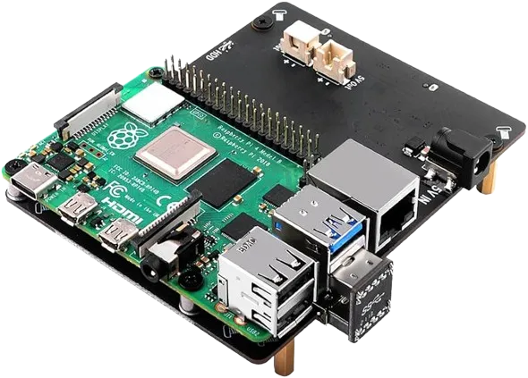
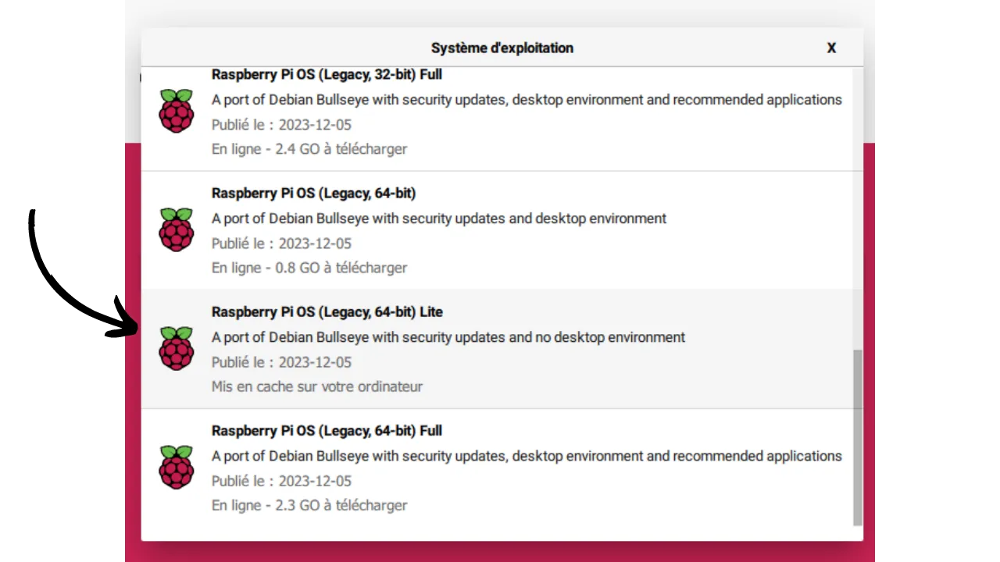
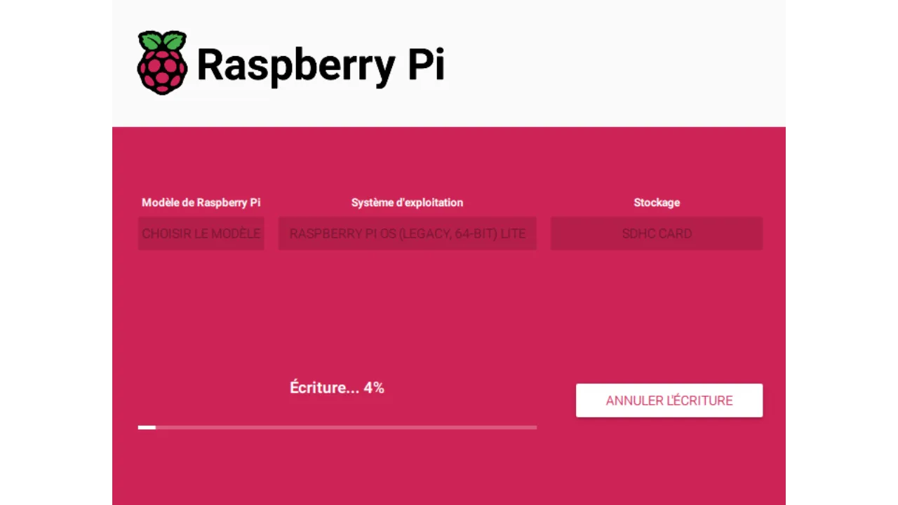

> "*Usa Bitcoin con privacy.*"

In [un tutorial precedente](https://planb.network/tutorials/node/ronin-dojo), avevamo già spiegato la procedura per installare e utilizzare RoninDojo v1. Tuttavia, nell'ultimo anno, i team di RoninDojo hanno lanciato la versione 2 della loro implementazione, che ha segnato un punto di svolta significativo nell'architettura del software. Infatti, si sono allontanati dalla distribuzione Linux Manjaro a favore di Debian. Di conseguenza, non offrono più un'immagine pre-configurata per l'installazione automatica su Raspberry Pi. Ma esiste ancora un metodo per procedere con un'installazione manuale. Questo è quello che ho usato per il mio nodo, e da allora, RoninDojo v2 ha funzionato meravigliosamente sul mio Raspberry Pi 4. Offro quindi un nuovo tutorial su come installare manualmente RoninDojo v2 su Raspberry Pi.

## Indice dei contenuti:
- Cos'è RoninDojo?
- Quale hardware scegliere per installare RoninDojo v2?
- Come assemblare il Raspberry Pi 4?
- Come installare RoninDojo v2 su Raspberry Pi 4?
- Come utilizzare il tuo nodo RoninDojo v2?

## Cos'è RoninDojo?
[Dojo](https://samouraiwallet.com/dojo) è inizialmente un'implementazione completa di nodo Bitcoin, basata su Bitcoin Core, e sviluppata dai team di Samourai Wallet. Questa soluzione può essere installata su qualsiasi apparecchiatura. A differenza di altre implementazioni Core, Dojo è stato specificamente ottimizzato per integrarsi con l'ambiente applicativo Android di Samourai Wallet. Per quanto riguarda RoninDojo, è uno strumento progettato per facilitare l'installazione e la gestione di un Dojo, così come vari altri strumenti complementari. In breve, RoninDojo arricchisce l'implementazione base di Dojo integrando una moltitudine di strumenti aggiuntivi, semplificando al contempo la sua installazione e gestione.

Ronin offre anche [una soluzione nodo-in-box, chiamata "*Tanto*"](https://ronindojo.io/en/products), un dispositivo con RoninDojo già installato su un sistema assemblato dal loro team. Il Tanto è un'opzione a pagamento, che può essere interessante per coloro che preferiscono evitare complicazioni tecniche. Ma poiché il codice sorgente di RoninDojo è aperto, è anche possibile distribuirlo sul proprio hardware. Questa alternativa, più economica, richiede tuttavia alcune manipolazioni aggiuntive, che tratteremo in questo tutorial.
RoninDojo è un Dojo, quindi permette una facile integrazione di Whirlpool CLI nel tuo nodo Bitcoin per fornire la migliore esperienza di coinjoin possibile. Con Whirlpool CLI, diventa possibile remixare continuamente i tuoi bitcoin, 24 ore su 24, 7 giorni su 7, senza richiedere che il tuo computer personale rimanga acceso.

Oltre a Whirlpool CLI, RoninDojo include una varietà di strumenti per migliorare le funzionalità del tuo Dojo. Tra questi, il calcolatore Boltzmann analizza il livello di privacy delle tue transazioni, il server Electrum consente la connessione dei tuoi portafogli Bitcoin al tuo nodo, e il server Mempool ti permette di visualizzare le tue transazioni localmente, senza perdite di informazioni.
Rispetto ad altre soluzioni node come Umbrel, RoninDojo si concentra chiaramente su soluzioni on-chain e strumenti per la privacy. A differenza di Umbrel, RoninDojo non supporta l'installazione di un nodo Lightning né l'integrazione di applicazioni server più generaliste. Sebbene RoninDojo offra meno strumenti versatili rispetto a Umbrel, possiede tutte le funzionalità essenziali per gestire la tua attività on-chain.
Se non hai bisogno di funzionalità generaliste o relative alla Lightning Network come quelle offerte da Umbrel, e stai cercando un nodo semplice, stabile con strumenti essenziali come Whirlpool o Mempool, RoninDojo potrebbe essere la soluzione ideale. Mentre Umbrel tende a diventare un mini server multitasking orientato verso la Lightning Network e la versatilità, RoninDojo, in linea con la filosofia di Samourai Wallet, si concentra su strumenti fondamentali per la privacy degli utenti.

Ora che abbiamo delineato RoninDojo, vediamo insieme come configurare questo nodo.

## Quale hardware scegliere per installare RoninDojo v2?
RoninDojo offre un'immagine per l'installazione automatica del suo software su un [RockPro64](https://ronindojo.io/en/download). Tuttavia, il nostro tutorial si concentra sulla procedura di installazione manuale su un Raspberry Pi 4. Sebbene il Raspberry Pi 5 sia stato lanciato di recente, e questo tutorial dovrebbe teoricamente essere compatibile con questo nuovo modello, non ho ancora avuto l'opportunità di testarlo personalmente e non ho trovato feedback dalla comunità. Non appena acquisirò il Pi 5 e i componenti compatibili, aggiornerò questo tutorial per tenervi informati. Nel frattempo, raccomando di dare priorità al Pi 4, poiché funziona perfettamente per il mio nodo.
Per quanto mi riguarda, gestisco RoninDojo su un Raspberry Pi dotato di 8 GB di RAM. Sebbene alcuni membri della comunità siano riusciti a farlo funzionare su dispositivi con solo 4 GB di RAM, non ho testato personalmente questa configurazione. Data la piccola differenza di prezzo, sembra saggio optare per la versione da 8 GB di RAM. Questo potrebbe rivelarsi utile anche se prevedi di riutilizzare il tuo Raspberry Pi per altri usi in futuro.
È importante notare che i team di RoninDojo hanno segnalato frequenti problemi relativi al case e all'adattatore SSD. Ho affrontato personalmente questi problemi. **Pertanto, si raccomanda vivamente di evitare case dotati di cavo USB per l'SSD del tuo nodo.** Preferisci invece una scheda di espansione di memoria specificamente progettata per il tuo Raspberry Pi:

Per memorizzare la blockchain di Bitcoin, avrai bisogno di un SSD compatibile con la scheda di espansione di memoria che hai scelto. Attualmente (febbraio 2024), ci troviamo in una fase di transizione. Si prevede che, nei prossimi mesi, i dischi da 1 TB non saranno più sufficienti per contenere la dimensione crescente della blockchain, specialmente considerando le varie applicazioni che prevedi di integrare nel tuo nodo. Alcuni raccomandano quindi di investire in un SSD da 2 TB per avere tranquillità a lungo termine. Tuttavia, con la tendenza al ribasso dei prezzi degli SSD anno dopo anno, altri suggeriscono di accontentarsi di un disco da 1 TB, che dovrebbe essere sufficiente per uno o due anni, sostenendo che quando diventerà obsoleto, il costo dei modelli da 2 TB sarà probabilmente diminuito. La scelta dipende quindi dalle tue preferenze personali. Se prevedi di mantenere il tuo RoninDojo per una durata significativa e desideri evitare qualsiasi manipolazione tecnica nei prossimi anni, l'opzione di un SSD da 2 TB sembra essere la più prudente, poiché ti offre un ampio margine per il futuro.

Inoltre, avrai bisogno di vari piccoli componenti:
- Un case dotato di ventola per alloggiare il tuo Raspberry Pi e la tua scheda di espansione dello storage. Sono disponibili online kit che includono sia la scheda di espansione SSD sia un case compatibile;
- Un cavo di alimentazione per il tuo Raspberry Pi;
- Una micro SD card di almeno 16 GB (anche se tecnicamente potrebbero bastare 8 GB, la differenza di prezzo tra le card da 8 e 16 GB è spesso trascurabile);
- Un cavo Ethernet RJ45 per la connessione di rete.

## Come assemblare il Raspberry Pi 4?
L'assemblaggio del tuo nodo varierà a seconda dell'hardware scelto, in particolare del tipo di case. Tuttavia, la struttura generale dei passaggi da seguire rimane generalmente simile nell'assemblaggio.
Inizia installando il tuo SSD sulla scheda di espansione dello storage, facendo attenzione a fissare le due viti di bloccaggio sul retro.

Poi, attacca il tuo Raspberry Pi alla scheda di espansione.

Inoltre, attacca la ventola al Raspberry Pi.

Collega i vari componenti, prestando attenzione a usare i pin corretti, facendo riferimento al manuale del tuo case. I produttori di case offrono spesso tutorial video per assisterti nell'assemblaggio. Nel mio caso, ho una scheda di espansione aggiuntiva dotata di un pulsante di accensione/spegnimento. Questo non è essenziale per realizzare un nodo Bitcoin. Lo uso principalmente per avere un pulsante di alimentazione.

Se, come me, hai una scheda di espansione dotata di un pulsante di accensione/spegnimento, non dimenticare di installare il piccolo jumper "Auto Power On". Questo permetterà al tuo nodo di avviarsi automaticamente non appena viene alimentato. Questa funzionalità è particolarmente utile in caso di interruzione di corrente, poiché consente al tuo nodo di riavviarsi da solo, senza interventi manuali da parte tua.

Prima di inserire tutto l'hardware nel case, è importante verificare il corretto funzionamento del tuo Raspberry Pi, della scheda di espansione dello storage e della ventola accendendoli.

Infine, installa il tuo Raspberry Pi nel suo case. Tieni presente che, in un passaggio successivo, sarà necessario aggiungere la micro SD card nell'apposito slot sul Raspberry Pi. Se il tuo case è dotato di un'apertura che ti permette di inserire la SD card senza doverlo aprire (come nel mio caso illustrato nella foto), puoi procedere a chiudere il case ora. Tuttavia, se il tuo case non ha accesso diretto allo slot della micro SD, dovrai attendere di aver preparato la micro SD card per inserirla prima di finalizzare l'assemblaggio.

## Come installare RoninDojo v2 su un Raspberry Pi 4?

### Passo 1: Preparare la micro SD avviabile
Dopo aver assemblato il tuo hardware, il passo successivo è installare RoninDojo. Per questo, prepareremo una micro SD card avviabile dal tuo computer, masterizzando su di essa l'immagine disco appropriata.
Dovrai utilizzare il software _**Raspberry Pi Imager**_, progettato per facilitare il download, la configurazione e la scrittura di sistemi operativi su una micro SD card per l'uso con un Raspberry Pi. Inizia installando questo software sul tuo PC personale:
- Per Ubuntu/Debian: https://downloads.raspberrypi.org/imager/imager_latest_amd64.deb
- Per Windows: https://downloads.raspberrypi.org/imager/imager_latest.exe
- Per Mac: https://downloads.raspberrypi.org/imager/imager_latest.dmg
Una volta installato il software, aprilo e inserisci la tua micro SD nel computer personale. Dall'interfaccia di Raspberry Pi Imager, seleziona `CHOOSE OS`:

Successivamente, vai al menu `Raspberry Pi OS (other)`:

Scegli il sistema operativo denominato `Raspberry Pi OS (Legacy, 64-bit) Lite`, che ha una dimensione di `0.3 GB`:

Dopo aver selezionato il sistema operativo, verrai reindirizzato al menu principale di Raspberry Pi Imager. Clicca su `CHOOSE STORAGE`:

Seleziona la tua micro SD:

Dopo aver scelto il sistema operativo e la micro SD, clicca su `NEXT`:

Apparirà una nuova finestra. Seleziona `EDIT CONFIGURATION`:

In questa finestra, vai alla scheda `GENERAL` e apporta le seguenti impostazioni (molto importanti affinché funzioni):
- Abilita l'opzione e assegna `RoninDojo` come nome host;
- Abilita `Set username and password`, inserisci `pi` come nome utente, scegli una password e annota queste informazioni, poiché saranno necessarie in seguito. Queste credenziali sono temporanee e verranno eliminate in seguito;
- Disabilita `Configure Wi-Fi`;
- Abilita `Set locale settings` e seleziona il tuo fuso orario così come il tipo di tastiera corrispondente al tuo computer;

Nella scheda SERVIZI, clicca sulla casella `Enable SSH` e seleziona `Use a password for authentication`:

Inoltre, assicurati che nella scheda `OPTIONS`, la telemetria sia disabilitata:

Clicca su `SAVE`:

Conferma cliccando su `YES` per iniziare la creazione della micro SD avviabile:

Un messaggio ti informerà che tutti i dati sulla micro SD verranno cancellati. Conferma cliccando su `YES` per avviare il processo:

Attendi fino a che il software non abbia finito di preparare la tua micro SD:

Quando appare il messaggio che indica la fine del processo, puoi rimuovere la micro SD dal computer:

### Passo 2: Completa l'Assemblaggio del Nodo
Ora puoi inserire la micro SD nella porta appropriata del tuo Raspberry Pi.

Poi collega il tuo Raspberry Pi al router usando il cavo Ethernet. Infine, accendi il tuo nodo collegando il cavo di alimentazione e premendo il pulsante di accensione (se il tuo setup lo include).

### Passo 3: Stabilisci una Connessione SSH con il Nodo
Prima di tutto, è necessario trovare l'indirizzo IP del tuo nodo. Hai l'opzione di utilizzare uno strumento come _[Advanced IP Scanner](https://www.advanced-ip-scanner.com/)_ o _[Angry IP Scanner](https://angryip.org/)_, o controllare l'interfaccia di amministrazione del tuo router. L'indirizzo IP dovrebbe essere nella forma `192.168.1.??`. **Per tutti i comandi seguenti, sostituisci `[IP]` con l'effettivo indirizzo IP del tuo nodo**, (rimuovendo le parentesi).

Avvia un terminale.
Per rimuovere una possibile chiave già associata all'indirizzo IP del tuo nodo, esegui il comando: `ssh-keygen -R [IP]`.

Un errore seguente a questo comando non è grave; significa semplicemente che la chiave non esiste nella tua lista di host conosciuti (il che è piuttosto probabile). Ad esempio, se l'IP del tuo nodo è `192.168.1.40`, il comando diventa: `ssh-keygen -R 192.168.1.40`.

Successivamente, stabilisci una connessione SSH con il tuo nodo eseguendo il comando:
`ssh pi@[IP]`.
Apparirà un messaggio riguardante l'autenticità dell'host: `The authenticity of host '[IP]' can't be established.` Questo indica che l'autenticità del dispositivo a cui stai cercando di connetterti non può essere verificata a causa della mancanza di una chiave pubblica conosciuta. Quando ti connetti via SSH a un nuovo host per la prima volta, questo messaggio apparirà sempre. Devi rispondere `yes` per aggiungere la sua chiave pubblica alla tua directory locale, il che impedirà che questo messaggio di avviso appaia durante future connessioni SSH a questo nodo. Quindi, digita `yes` e premi `enter` per convalidare.
Ti verrà poi chiesto di inserire la tua password, quella precedentemente impostata come temporanea al passo 1. Convalida con `enter`. Sarai quindi connesso al tuo nodo via SSH.

In sintesi, ecco i comandi da eseguire:
- `ssh-keygen -R [IP]`
- `ssh pi@[IP]`
- `yes`
- Inserisci la password temporanea e convalida.

### Passo 4: Aggiornamento e Preparazione
Ora sei connesso al tuo nodo tramite una sessione SSH. Sul tuo terminale, il prompt dei comandi dovrebbe essere: `pi@RoninDojo:~ $`. Per iniziare, aggiorna l'elenco dei pacchetti disponibili e installa gli aggiornamenti per i pacchetti esistenti con il seguente comando:
`sudo apt update && sudo apt upgrade -y`

Una volta completati gli aggiornamenti, procedi con l'installazione di *Git* e *Dialog* usando il comando:
`sudo apt install git dialog -y`

Successivamente, clona il ramo `master` del repository Git _RoninOS_ eseguendo:
`sudo git clone --branch master https://code.samourai.io/ronindojo/RoninOS.git /opt/RoninOS`

Esegui lo script `customize-image.sh` con il comando:
`cd /opt/RoninOS/ && sudo ./customize-image.sh`

**È importante lasciare che lo script funzioni senza interruzioni e attendere pazientemente la fine del suo processo**, che richiede circa 10 minuti. Quando appare il messaggio `Setup is complete`, puoi passare al passo successivo.

### Passo 5: Avvio di RoninOS
Avvia RoninOS con il comando:
`sudo systemctl start ronin-setup`

Visualizza le righe del file di log con il comando:
`tail -f /home/ronindojo/.logs/setup.logs`

A questo punto, **è importante lasciare che RoninOS si avvii e attendere** che finisca di eseguire. Ciò richiede circa 40 minuti. Quando appare `All RoninDojo feature installations complete!`, puoi procedere al passo 6.

### Passo 6: Accesso a RoninUI e Cambio delle Credenziali
Dopo aver completato l'installazione, per connetterti al tuo nodo tramite un browser, assicurati che il tuo computer personale sia connesso alla stessa rete locale del tuo nodo. Se stai utilizzando una VPN sulla tua macchina, disabilitala temporaneamente. Per accedere all'interfaccia del nodo nel tuo browser, inserisci nella barra degli URL:
- Direttamente l'indirizzo IP del tuo nodo, ad esempio, `192.168.1.??`;
- Oppure, digita `ronindojo.local`.
Una volta sulla homepage di RoninUI, ti verrà chiesto di iniziare la configurazione. Per farlo, clicca sul pulsante `Iniziamo`.

A questo punto, RoninUI ti presenta la tua password `root`. È essenziale tenerla al sicuro. Puoi optare per un backup fisico, su carta, o salvarla in un [gestore di password](https://planb.network/courses/secu101/4/2).

Dopo aver salvato la password `root`, spunta la casella `Ho fatto il backup delle credenziali dell'utente Root` e clicca su `Continua` per procedere.

Il passo successivo prevede la creazione di una password utente, che verrà utilizzata sia per accedere all'interfaccia web di RoninUI sia per stabilire sessioni SSH con il tuo nodo. Scegli una password forte e assicurati di salvarla in modo sicuro. Dovrai inserire questa password due volte prima di cliccare su `Fine` per convalidare. Per quanto riguarda il nome utente, si raccomanda di mantenere la scelta predefinita, `ronindojo`. Se decidi di cambiarlo, ricorda di adeguare i comandi nei passaggi successivi di conseguenza.

Una volta completate queste azioni, attendi l'inizializzazione del tuo nodo. Potrai quindi accedere all'interfaccia web di RoninUI. Sei quasi alla fine del processo, mancano solo pochi piccoli passaggi!

### Passo 7: Rimuovi le Credenziali Temporanee
Apri un nuovo terminale sul tuo computer personale e stabilisci una connessione SSH con il tuo nodo utilizzando il seguente comando:
`SSH ronindojo@[IP]`

Se, ad esempio, l'indirizzo IP del tuo nodo è `192.168.1.40`, il comando appropriato sarà:
`SSH ronindojo@192.168.1.40`

Se hai cambiato il tuo nome utente durante il passaggio precedente, sostituendo il nome utente predefinito (`ronindojo`) con un altro, assicurati di usare questo nuovo nome nel comando. Ad esempio, se hai scelto `planb` come nome utente e l'indirizzo IP è `192.168.1.40`, il comando da inserire sarà:
`SSH planb@192.168.1.40`
Ti verrà chiesto di inserire la password dell'utente. Inseriscila e poi premi `invio` per convalidare. Accederai quindi all'interfaccia RoninCLI. Usa i tasti freccia sulla tastiera per navigare fino all'opzione `Esci da RoninDojo` e premi `invio` per selezionarla.

A questo punto, sei sul terminale del tuo nodo, con un prompt dei comandi simile a: `ronindojo@RoninDojo:~ $`. Per rimuovere l'utente temporaneo creato durante la configurazione della scheda micro SD avviabile, inserisci il seguente comando e premi `invio`:
`sudo deluser --remove-home pi`

Ti verrà chiesto di confermare la password dell'utente. Inseriscila e convalida premendo `invio`. Attendi il completamento dell'operazione, poi usa il comando `exit` per lasciare il terminale.
Congratulazioni! Il tuo nodo RoninDojo v2 è ora configurato e pronto all'uso. Inizierà il suo IBD (*Initial Block Download*), procedendo con il download e la verifica della blockchain di Bitcoin a partire dal blocco Genesis. Questo passaggio comporta il recupero di tutte le transazioni Bitcoin effettuate dal 3 gennaio 2009 e richiede del tempo. Una volta che la blockchain è completamente scaricata, l'indicizzatore procederà a comprimere il database. La durata dell'IBD può variare notevolmente. Il tuo nodo RoninDojo sarà completamente operativo una volta completato questo processo.
**Se stai migrando da un vecchio nodo RoninDojo v1** a questa nuova versione seguendo questa guida e mantenendo lo stesso SSD, il tuo nodo dovrebbe automaticamente rilevare e riutilizzare i dati esistenti sul disco, risparmiandoti la necessità di eseguire nuovamente l'IBD. In questo caso, dovrai solo attendere che il tuo nodo si risincronizzi con gli ultimi blocchi.

### Passo 8: "veth* fix"
Se incontri un bug con il tuo RoninDojo v2 su Raspberry Pi, dove dopo un'installazione senza problemi, il tuo nodo diventa improvvisamente irraggiungibile via SSH ma si riprende dopo un semplice riavvio, allora devi seguire questo passo 8. Questo bug comune può essere facilmente risolto con una soluzione sviluppata dalla comunità: il "_veth fix_". Questa piccola correzione rimedia definitivamente alle disconnessioni improvvise. Ecco come applicarla.

Apri un nuovo terminale sul tuo computer personale e stabilisci una connessione SSH con il tuo nodo utilizzando il seguente comando:
`SSH ronindojo@[IP]`

Se, ad esempio, l'indirizzo IP del tuo nodo è `192.168.1.40`, il comando appropriato sarebbe: 
`SSH ronindojo@192.168.1.40`

Ti verrà chiesto di inserire la password utente. Inseriscila e premi `invio` per convalidare. Accederai quindi all'interfaccia RoninCLI. Usa le frecce della tua tastiera per navigare fino all'opzione `Exit RoninDojo` e premi `invio` per selezionarla.

A questo punto, ti trovi sul terminale del tuo nodo, con un prompt dei comandi simile a: `ronindojo@RoninDojo:~ $`. Per applicare il veth* fix, digita il seguente comando e premi `invio`: 
`sudo nano /etc/dhcpcd.conf`

Conferma nuovamente la tua password e premi `invio`.

Arriverai al file `dhcpcd.conf`. Devi copiare il seguente testo, assicurandoti di includere l'asterisco, e aggiungerlo in fondo al file: 
`denyinterfaces veth*`

Per farlo, spostati in fondo al file usando la freccia verso il basso sulla tua tastiera, poi usa il clic destro del tuo mouse per incollare il testo su una linea indipendente.

Dopo aver aggiunto il testo, premi `ctrl X` per iniziare ad uscire, seguito da `ctrl Y` per confermare il salvataggio delle modifiche, e premi `invio` per finalizzare e ritornare al prompt dei comandi. Per assicurarti che la modifica sia stata applicata correttamente, riapri il file `dhcpcd.conf` utilizzando il comando appropriato.

Per completare l'applicazione della correzione, riavvia il tuo nodo eseguendo: 
`sudo reboot now`

A questo punto, puoi chiudere il tuo terminale. Lascia il tempo necessario per il riavvio del tuo RoninDojo, dopo di che dovresti essere in grado di riconnetterti tramite l'interfaccia grafica del tuo browser. Questo processo dovrebbe risolvere il bug incontrato.

## Come usare il tuo nodo RoninDojo v2?

### Collegare il tuo software wallet a Electrs
Il primo utilizzo del tuo nodo appena installato e sincronizzato sarà trasmettere le tue transazioni alla rete Bitcoin. Probabilmente vorrai collegare i tuoi vari wallet al tuo nodo per trasmettere le tue transazioni in modo confidenziale. Puoi farlo tramite Electrum Rust Server (electrs). Questa applicazione è solitamente preinstallata sul tuo nodo RoninDojo. In caso contrario, potresti installarla manualmente tramite l'interfaccia RoninCLI in `Applicazioni > Gestisci Applicazioni > Installa Electrum Server`.

Per ottenere l'indirizzo Tor del tuo Electrum Server, dall'interfaccia web RoninUI, vai su:
`Associazione > Server Electrum > Associa ora`

Dovrai quindi inserire l'indirizzo `Hostname` che termina in `.onion` nel tuo software wallet, accompagnato dalla porta `50001`. 
Ad esempio, su Sparrow Wallet, vai semplicemente nella scheda:
`File > Preferenze > Server > Electrum Privato`

### Collegare il tuo software wallet a Samourai Dojo
Come alternativa all'uso di Electrs, Dojo ti consente di collegare direttamente il tuo software wallet compatibile al tuo nodo RoninDojo. Wallet come Samourai Wallet e Sentinel offrono questa funzionalità.

Per stabilire la connessione, dovrai semplicemente scansionare il codice QR del tuo Dojo. Per accedere a questo codice QR tramite RoninUI, naviga in:
`Associazione > Samourai Dojo > Associa ora`

Per collegare il tuo Samourai Wallet al tuo Dojo, scansiona semplicemente questo codice QR durante l'installazione dell'app:

Se avevi già un Samourai Wallet prima di configurare il tuo Ronin Dojo, è necessario fare il backup del tuo portafoglio, disinstallare e poi reinstallare l'app Samourai Wallet, prima di ripristinare il tuo portafoglio. Al lancio dell'app reinstallata, avrai l'opzione di connetterti a un nuovo Dojo. **Attenzione, questo processo comporta il rischio di perdere i tuoi bitcoin se non eseguito correttamente!** Assicurati di avere il backup del tuo Samourai wallet nei tuoi file e verifica la validità della tua passphrase tramite `Impostazioni > Risoluzione dei problemi > Passphrase`. È inoltre importante avere un backup leggibile della tua frase di recupero e della tua passphrase. Per maggiore precisione in questa operazione, si raccomanda di seguire questo tutorial dettagliato: [https://wiki.ronindojo.io/en/setup/v2_0_0-upgrade/reconnectsamourai](https://wiki.ronindojo.io/en/setup/v2_0_0-upgrade/reconnectsamourai).

### Usare il proprio block explorer Mempool.space
Un block explorer trasforma le informazioni grezze dalla blockchain di Bitcoin in un formato strutturato e facilmente leggibile. Con strumenti come *Mempool.space*, è possibile analizzare le transazioni, cercare indirizzi specifici o anche consultare le tariffe medie delle fee dei mempool della rete in tempo reale.

Tuttavia, l'uso di block explorer online comporta rischi per la tua privacy e implica fiducia nei dati forniti da terze parti. Infatti, utilizzando questi servizi senza passare attraverso il proprio nodo, si potrebbe divulgare involontariamente informazioni sulle proprie transazioni e bisogna affidarsi all'accuratezza delle informazioni presentate dal proprietario del sito.
Per mitigare questi rischi, si raccomanda di usare la propria istanza di *Mempool.space* tramite la rete Tor, ospitata direttamente sul proprio nodo. Questa soluzione garantisce la conservazione della tua privacy e l'autonomia dei tuoi dati.
Per fare ciò, inizia installando *Mempool Space Visualizer* da RoninUI. Nell'interfaccia web, vai alla scheda `Dashboard` e clicca su `Gestisci` sotto `Mempool Space`:
`Dashboard > Mempool Space > Gestisci`

Poi clicca sul pulsante `Installa visualizzatore Mempool`:

Conferma la tua password utente:

Attendi il completamento dell'installazione, poi clicca nuovamente sul pulsante `Gestisci`:

Otterrai un link `.onion` per accedere alla tua istanza di *Mempool.space* tramite la rete Tor.

Ti consiglio di salvare questo link nei tuoi preferiti sul browser Tor o di aggiungerlo all'app Tor Browser sul tuo smartphone per un accesso facile e sicuro da qualsiasi luogo. Se non hai ancora il browser Tor, puoi scaricarlo qui: [https://www.torproject.org/download/](https://www.torproject.org/download/)

### Usare Whirlpool per mixare i tuoi bitcoin
Il tuo nodo RoninDojo integra anche _WhirlpoolCLI_, un'interfaccia a riga di comando che consente l'automazione dei coinjoin di Whirlpool, e _WhirlpoolGUI_, un'interfaccia grafica progettata per interagire con _WhirlpoolCLI_.
Eseguire un coinjoin tramite Whirlpool richiede che l'applicazione utilizzata sia attiva per effettuare i remix. Questa condizione può essere restrittiva per coloro che desiderano raggiungere alti livelli di anonimato. Infatti, il dispositivo che ospita l'applicazione integrante Whirlpool deve rimanere acceso continuamente. Questo significa che per partecipare ai remix 24 ore su 24, il tuo computer o smartphone deve rimanere acceso con Samourai o Sparrow aperti in continuazione. Una soluzione a questa limitazione è utilizzare _WhirlpoolCLI_ su una macchina che è sempre accesa, come un nodo Bitcoin, permettendo ai tuoi coin di remixare senza interruzioni, e senza la necessità di tenere acceso un altro dispositivo.
Un tutorial dettagliato è in preparazione per guidarti passo dopo passo attraverso il processo di coinjoin con Samourai Wallet e RoninDojo v2, dalla A alla Z.

Per una comprensione più approfondita del coinjoin e del suo utilizzo su Bitcoin, ti invito anche a consultare questo altro articolo: [Understanding and using coinjoin on Bitcoin](https://planb.network/tutorials/privacy/coinjoin-dojo), dove dettaglio tutto ciò che devi sapere su questa tecnica.
### Utilizzo di Whirlpool Stat Tool (WST)

Dopo aver eseguito coinjoins con Whirlpool, è utile valutare con precisione il livello di privacy raggiunto per i tuoi UTXO mixati. Per fare ciò, puoi utilizzare lo strumento Python *Whirlpool Stat Tool*. Questo strumento ti permette di misurare sia i punteggi prospettici che retrospettivi dei tuoi UTXO, analizzando al contempo il loro tasso di diffusione nella pool.

Per approfondire la tua comprensione dei meccanismi di calcolo di questi anonset, ti consiglio di leggere l'articolo: [REMIX - WHIRLPOOL](https://planb.network/tutorials/privacy/remix-whirlpool), che dettaglia il funzionamento di questi indici.

Per accedere allo strumento WST, vai su RoninCLI. Per fare ciò, apri un terminale sul tuo computer personale e stabilisci una connessione SSH con il tuo nodo utilizzando il seguente comando:
`SSH ronindojo@[IP]`

Se, ad esempio, l'indirizzo IP del tuo nodo è `192.168.1.40`, il comando appropriato sarebbe:
`SSH ronindojo@192.168.1.40`

Se hai cambiato il tuo nome utente durante il passaggio 6, sostituendo il nome utente predefinito (`ronindojo`) con un altro, assicurati di utilizzare questo nuovo nome nel comando. Ad esempio, se hai scelto `planb` come tuo nome utente e l'indirizzo IP è `192.168.1.40`, il comando da inserire sarebbe:
`SSH planb@192.168.1.40`

Ti verrà chiesto di inserire la password dell'utente. Inseriscila e premi `enter` per convalidare. Avrai quindi accesso all'interfaccia RoninCLI. Usa i tasti freccia sulla tua tastiera per navigare nel menu `Samourai Toolkit` e premi `enter` per selezionarlo:

Quindi seleziona `Whirlpool Stat Tool`:

All'avvio di WST, lo strumento procederà con la sua installazione automatica. Attendi durante questa fase. Le istruzioni per l'uso scorrono. Una volta completata l'installazione, premi un tasto qualsiasi per accedere al terminale WST:

Verrà visualizzato il seguente prompt dei comandi:
`wst#/tmp>`

Se desideri uscire da questa interfaccia e tornare al menu RoninCLI, inserisci semplicemente:
`quit`

Prima di tutto, è necessario configurare il proxy per utilizzare Tor, per garantire la riservatezza durante l'estrazione dei dati da [OXT](https://oxt.me/). Inserisci il comando:
`socks5 127.0.0.1:9050`
Successivamente, procedi con il download delle informazioni del pool contenenti la tua transazione:
`download 0001`
Sostituisci `0001` con il codice di denominazione del pool di tuo interesse. I codici di denominazione sono i seguenti su WST:
- Pool 0.5 bitcoin: `05`
- Pool 0.05 bitcoin: `005`
- Pool 0.01 bitcoin: `001`
- Pool 0.001 bitcoin: `0001`

Dopo aver scaricato, carica i dati sostituendo `0001` con il codice del tuo pool in questo comando: `load 0001`

Attendi il completamento del caricamento, che potrebbe richiedere alcuni minuti. Una volta che i dati sono caricati, per conoscere i punteggi anonset della tua moneta, esegui il comando `score` seguito dal tuo TXID (senza le parentesi):
`score [TXID]`

WST mostrerà quindi il punteggio retrospettivo (_Metriche retrospettive_), seguito dal punteggio prospettico (_Metriche prospettiche_). Oltre ai punteggi anonset, WST indicherà anche il tasso di diffusione della tua transazione all'interno del pool, relativamente al suo anonset.

**È importante notare che il punteggio prospettico della tua moneta dovrebbe essere calcolato a partire dal TXID del tuo mix iniziale, e non dal tuo mix più recente. Al contrario, il punteggio retrospettivo di un UTXO è calcolato a partire dal TXID dell'ultimo ciclo.**

### Utilizzo del Calcolatore Boltzmann
Il Calcolatore Boltzmann è uno strumento per analizzare una transazione Bitcoin, che offre la possibilità di misurare il suo livello di entropia tra altre metriche avanzate. Questi dati forniscono una valutazione quantificata della privacy di una transazione e aiutano a identificare potenziali difetti. Questo strumento è già integrato nel tuo nodo RoninDojo, rendendolo facile da accedere e utilizzare.

Prima di dettagliare la procedura per utilizzare il Calcolatore Boltzmann, è importante comprendere il significato di questi indicatori, il loro metodo di calcolo e la loro utilità. Sebbene applicabili a qualsiasi transazione Bitcoin, questi indicatori sono particolarmente utili per valutare la qualità di una transazione coinjoin.

**Il primo indicatore** che il software calcola è il numero totale di combinazioni possibili, indicato sotto `nb combinations` nello strumento. Basato sui valori degli UTXO coinvolti, questo indicatore quantifica il numero di modi in cui gli input possono essere associati agli output. In altre parole, determina il numero di interpretazioni plausibili che una transazione può generare. Ad esempio, un coinjoin strutturato secondo il modello Whirlpool 5x5 presenta `1496` combinazioni possibili:

Credit: [KYCP.org](https://kycp.org/#/fe5e5abab7ea452f87603f7ebc2fa4e77380eafcc927e1cb51e1a72401ab073d)
**Il secondo indicatore** calcolato è l'entropia di una transazione, designata da `Entropy`. Quando una transazione ha un alto numero di combinazioni possibili, è spesso più rilevante fare riferimento alla sua entropia. Questa è definita come il logaritmo binario del numero di combinazioni possibili. Ecco la formula utilizzata:
- $E$: l'entropia della transazione;
- $C$: il numero di combinazioni possibili per la transazione.
$$E = \log_2(C)$$
In matematica, il logaritmo binario (logaritmo in base 2) corrisponde all'operazione inversa dell'elevare 2 a una potenza. In altre parole, il logaritmo binario di $x$ è l'esponente al quale 2 deve essere elevato per ottenere $x$. Pertanto, questo indicatore è espresso in bit. Prendiamo l'esempio del calcolo dell'entropia per una transazione coinjoin strutturata secondo il modello Whirlpool 5x5, che, come accennato in precedenza, offre un numero di combinazioni possibili di `1496`:$$ C = 1496 $$
$$ E = \log_2(1496) $$
$$ E \approx 10.5469 \text{ bit}$$

Quindi, questa transazione coinjoin mostra un'entropia di 10.5469 bit, che è considerata molto soddisfacente. Più alto è questo valore, più diverse interpretazioni ammette la transazione, migliorando così il suo livello di privacy.

Prendiamo un ulteriore esempio con una transazione più convenzionale, con un input e due output: [1b1b0c3f0883a99f1161c64da19471841ed12a1f78e77fab128c69a5f578ccce](https://mempool.space/it/tx/1b1b0c3f0883a99f1161c64da19471841ed12a1f78e77fab128c69a5f578ccce)
Nel caso di questa transazione, l'unica interpretazione possibile è: `(inp 0) > (Outp 0 ; Outp 1)`. Di conseguenza, la sua entropia è stabilita a `0`:
$$ C = 1 $$
$$ E = \log_2(1) $$
$$ E \approx 0 \text{ bit}$$
**Il terzo indicatore** fornito dal Calcolatore di Boltzmann si chiama `Efficienza del Portafoglio`. Questo indicatore valuta l'efficienza della transazione confrontandola con la transazione ottimale concepibile in un contesto identico. Ciò ci porta a discutere il concetto di entropia massima, che corrisponde all'entropia più alta che una specifica struttura di transazione può teoricamente raggiungere. Così, per una struttura coinjoin Whirlpool 5x5, l'entropia massima è fissata a `10.5469`. L'efficienza della transazione viene quindi calcolata confrontando questa entropia massima con l'entropia effettiva della transazione analizzata. La formula utilizzata è la seguente:
- $ER$: l'entropia effettiva della transazione, espressa in bit;
- $EM$: l'entropia massima possibile per una data struttura di transazione, anch'essa in bit;
- $Ef$: l'efficienza della transazione, in bit.
$$Ef = ER - EM$$ $$Ef = 10.5469 - 10.5469$$
$$Ef = 0 \text{ bit}$$

Questo indicatore è espresso anche come percentuale, la sua formula è quindi:
- $CR$: il numero di combinazioni possibili effettive;
- $CM$: il numero massimo di combinazioni possibili con la stessa struttura;
- $Ef$: l'efficienza espressa come percentuale.
$$Ef = \frac{CR}{CM}$$
$$Ef = \frac{1496}{1496}$$
$$Ef = 100\%$$

Un'efficienza del `100%` indica quindi che la transazione massimizza il suo potenziale per la privacy in base alla sua struttura.
**Il quarto indicatore**, la densità di entropia, o `Entropy Density`, offre una prospettiva sull'entropia relativa a ciascun input o output della transazione. Questo indicatore si rivela utile per valutare e confrontare l'efficienza delle transazioni di diverse dimensioni. Per calcolarlo, basta dividere l'entropia totale della transazione per il numero totale di input e output coinvolti. Prendendo l'esempio di un coinjoin Whirlpool 5x5:
- $ED$: la densità di entropia espressa in bit;
- $E$: l'entropia della transazione espressa in bit;
- $T$: il numero totale di input e output nella transazione.
$$T = 5 + 5 = 10$$
$$ED = \frac{E}{T}$$
$$ED = \frac{10.5469}{10}$$
$$ED = 1.054 \text{ bit}$$
**Il quinto elemento informativo** fornito dal Calcolatore di Boltzmann è la tabella delle probabilità di corrispondenza tra input e output. Questa tabella indica, tramite il `punteggio di Boltzmann`, la probabilità che un input specifico sia connesso a un dato output. Prendendo l'esempio di un coinjoin Whirlpool, la tabella delle probabilità evidenzierebbe le possibilità di collegamento tra ciascun input e output, fornendo una misura quantitativa dell'ambiguità o prevedibilità delle associazioni nella transazione:
| %       | Output 0 | Output 1 | Output 2 | Output 3 | Output 4 |
|---------|----------|----------|----------|----------|----------|
| Input 0 | 34%      | 34%      | 34%      | 34%      | 34%      |
| Input 1 | 34%      | 34%      | 34%      | 34%      | 34%      |
| Input 2 | 34%      | 34%      | 34%      | 34%      | 34%      |
| Input 3 | 34%      | 34%      | 34%      | 34%      | 34%      |
| Input 4 | 34%      | 34%      | 34%      | 34%      | 34%      |

Qui, è evidente che ciascun input ha la stessa probabilità di essere associato a qualsiasi output, il che rafforza l'ambiguità e la riservatezza della transazione. Tuttavia, nel caso di una transazione semplice con un singolo input e due output, la situazione è diversa:

| %       | Output 0 | Output 1 |
|---------|----------|----------|
| Input 0 | 100%     | 100%     |

Qui, vediamo che la probabilità che ciascun output provenga dall'input 0 è del 100%. Una probabilità inferiore si traduce quindi in una maggiore riservatezza, diluendo i collegamenti diretti tra input e output.

**Il sesto elemento informativo** fornito è il numero di collegamenti deterministici, completato dal rapporto di questi collegamenti. Questo indicatore rivela quanti collegamenti tra gli input e gli output nella transazione analizzata sono indiscutibili, con una probabilità del 100%. Il rapporto, a sua volta, offre una prospettiva sul peso di questi collegamenti deterministici all'interno del totale dei collegamenti della transazione.

Ad esempio, una transazione di tipo coinjoin Whirlpool presenta zero collegamenti deterministici e, quindi, mostra un indicatore e un rapporto del 0%. D'altra parte, nella nostra seconda transazione esaminata (con un input e due output), l'indicatore è impostato a 2 e il rapporto raggiunge il 100%. Quindi, un indicatore nullo segnala un'eccellente riservatezza grazie all'assenza di collegamenti diretti e indiscutibili tra input e output.
**Come accedere al Calcolatore di Boltzmann su RoninDojo?** Per accedere allo strumento *Calcolatore di Boltzmann*, vai su RoninCLI. Per fare ciò, apri un terminale sul tuo computer personale e stabilisci una connessione SSH con il tuo nodo utilizzando il seguente comando: `SSH ronindojo@[IP]`

Se, ad esempio, l'indirizzo IP del tuo nodo è `192.168.1.40`, il comando appropriato sarebbe:
`SSH ronindojo@192.168.1.40`

Se hai cambiato il tuo nome utente durante il passaggio 6, sostituendo il nome utente predefinito (`ronindojo`) con un altro, assicurati di utilizzare questo nuovo nome nel comando. Ad esempio, se hai scelto `planb` come tuo nome utente e l'indirizzo IP è `192.168.1.40`, il comando da inserire sarebbe:
`SSH planb@192.168.1.40`

Ti verrà chiesto di inserire la password dell'utente. Inseriscila e poi premi `enter` per convalidare. Accederai quindi all'interfaccia RoninCLI. Usa le frecce sulla tua tastiera per navigare al menu `Samourai Toolkit` e premi `enter` per selezionarlo:

Quindi seleziona `Calcolatore di Boltzmann`:

Arriverai alla pagina iniziale del software:

Inserisci il TXID della transazione che desideri studiare e premi il tasto `enter`:

Il calcolatore ti fornirà quindi tutti gli indicatori di cui abbiamo precedentemente discusso:

### Altre funzionalità del tuo RoninDojo v2
Il tuo nodo RoninDojo integra varie altre funzionalità. In particolare, hai la possibilità di scansionare informazioni specifiche per prenderle in considerazione. Ad esempio, a volte il tuo portafoglio Samourai, connesso a RoninDojo, potrebbe non visualizzare i bitcoin che effettivamente possiedi. Se il saldo indica 0 mentre sei certo di avere bitcoin in questo portafoglio, diverse ragioni possono spiegare questa situazione, come un errore nei percorsi di derivazione. Ma una delle cause può anche essere che il tuo nodo non sta monitorando correttamente i tuoi indirizzi. Per risolvere questo problema, puoi assicurarti che il tuo nodo stia effettivamente seguendo il tuo `xpub` utilizzando lo _strumento xpub_. Per accedere a questo strumento tramite RoninUI, segui il percorso:
`Manutenzione > Strumento XPUB`

Inserisci l'`xpub` che sta causando il problema e clicca sul pulsante `Verifica` per verificare queste informazioni:

Assicurati che tutte le transazioni siano elencate correttamente. È anche importante verificare che il tipo di derivazione utilizzato corrisponda a quello del tuo portafoglio. Se non è così, clicca su `Ridigita`, poi scegli tra `BIP44`, `BIP49`, o `BIP84` secondo le tue necessità.
Oltre a questo strumento, la scheda `Manutenzione` di RoninUI è piena di altre funzionalità utili:
- *Strumento Transazione*: Permette di esaminare i dettagli di una data transazione;
- *Strumento Indirizzo*: Permette di confermare il tracciamento di un dato indirizzo dal tuo Dojo;
- *Riscansiona Blocchi*: Costringe il tuo nodo a eseguire una nuova scansione di un determinato intervallo di blocchi.

La scheda `Push Tx` è un'altra caratteristica interessante di RoninUI, che consente la trasmissione di una transazione firmata sulla rete Bitcoin. La transazione deve essere inserita in forma esadecimale.

Riguardo alle altre schede disponibili sulla tua dashboard RoninUI:
- `Apps`: Ospita l'applicazione Whirlpool e sarà sicuramente utilizzata per integrare nuove applicazioni in futuro;
- `Logs`: Offre accesso in tempo reale ai log degli eventi del tuo software;
- `System Info`: Fornisce informazioni generali sul tuo nodo, come la temperatura della CPU, l'utilizzo dello spazio di archiviazione o i dati della RAM. Troverai anche le opzioni `Reboot` e `Shut down` per riavviare o spegnere il tuo nodo;
- `Settings`: Ti permette di cambiare la tua password utente.

Ecco fatto! Grazie per aver seguito questo tutorial fino alla fine. Se ti è piaciuto, ti incoraggio a condividerlo sui social media. Inoltre, se hai l'opportunità, considera di supportare gli sviluppatori che rendono disponibili questi software liberi e open-source alla nostra comunità con una donazione: [https://donate.ronindojo.io/](https://donate.ronindojo.io/). Per approfondire la tua conoscenza di RoninDojo e scoprire altre risorse, ti consiglio vivamente di consultare i link alle risorse esterne menzionate di seguito.

**Risorse esterne:**
- [https://samouraiwallet.com/dojo](https://samouraiwallet.com/dojo)
- [https://ronindojo.io/index.html](https://ronindojo.io/index.html)
- [https://wiki.ronindojo.io/en/home](https://wiki.ronindojo.io/en/home)
- [https://code.samourai.io/ronindojo/RoninDojo](https://code.samourai.io/ronindojo/RoninDojo)
- [https://gist.github.com/LaurentMT/e758767ca4038ac40aaf](https://gist.github.com/LaurentMT/e758767ca4038ac40aaf)
