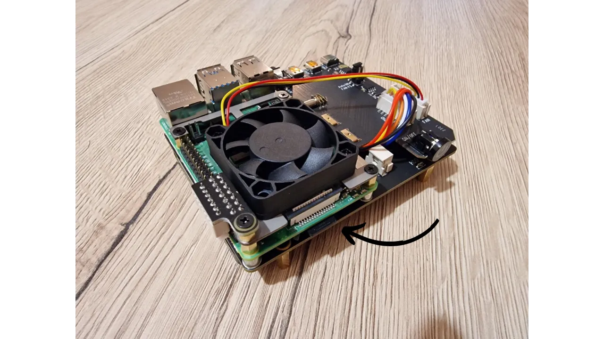
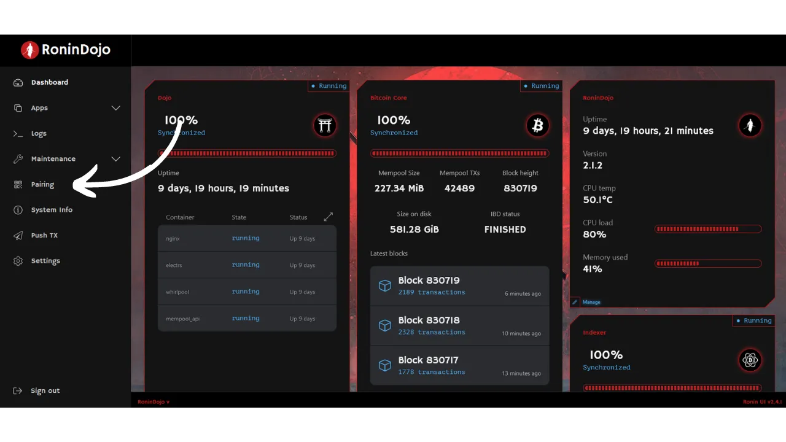
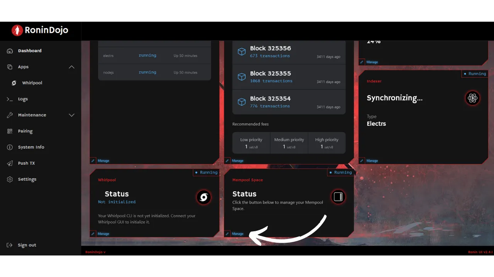

> "*プライバシーを重視してBitcoinを使用する。*"

[以前のチュートリアル](https://planb.network/tutorials/node/ronin-dojo)では、RoninDojo v1のインストールと使用方法について既に説明しました。しかし、昨年、RoninDojoチームは彼らの実装のバージョン2を発表し、ソフトウェアのアーキテクチャにおいて重要な転換点を迎えました。実際、彼らはLinux ManjaroディストリビューションからDebianへと移行しました。その結果、Raspberry Pi上での自動インストール用に事前設定されたイメージの提供をやめました。しかし、手動インストールを進める方法はまだ存在します。これは私が自分のノードに使用した方法であり、それ以来、RoninDojo v2は私のRaspberry Pi 4上で素晴らしく動作しています。したがって、Raspberry Pi上にRoninDojo v2を手動でインストールする方法についての新しいチュートリアルを提供します。

## 目次:
- RoninDojoとは何か？
- RoninDojo v2のインストールに適したハードウェアは？
- Raspberry Pi 4の組み立て方は？
- Raspberry Pi 4にRoninDojo v2をインストールする方法は？
- RoninDojo v2ノードをどのように使用するか？

## RoninDojoとは何か？
[Dojo](https://samouraiwallet.com/dojo)はもともとBitcoin Coreに基づいた完全なBitcoinノード実装であり、Samourai Walletチームによって開発されました。このソリューションは任意の機器にインストール可能です。他のCore実装とは異なり、DojoはSamourai WalletのAndroidアプリケーション環境との統合を特に最適化されています。RoninDojoについては、Dojoのインストールと管理、およびさまざまな補足ツールを容易にするために設計されたユーティリティです。簡単に言うと、RoninDojoはDojoの基本実装を豊かにし、追加ツールの多数を統合しながら、そのインストールと管理を簡素化します。

Roninはまた、彼らのチームによって組み立てられたシステムに既にインストールされているRoninDojoを搭載した[*Tanto*](https://ronindojo.io/en/products)と呼ばれるノード・イン・ボックスソリューションを提供します。Tantoは有料オプションであり、技術的な複雑さを避けたい人にとって興味深いかもしれません。しかし、RoninDojoのソースコードがオープンであるため、自分のハードウェアにそれを展開することも可能です。この代替案は、より経済的ですが、このチュートリアルで取り上げるいくつかの追加操作を必要とします。
RoninDojoはDojoであるため、Whirlpool CLIをBitcoinノードに簡単に統合し、可能な限り最高のcoinjoin体験を提供します。Whirlpool CLIを使用すると、24時間365日、個人のコンピューターをオンに保つことなく、ビットコインを継続的にリミックスすることが可能になります。

Whirlpool CLIを超えて、RoninDojoにはDojoの機能を強化するためのさまざまなツールが含まれています。これらの中には、トランザクションのプライバシーレベルを分析するBoltzmann計算機、Bitcoinウォレットをノードに接続するためのElectrumサーバー、情報を漏らすことなくローカルでトランザクションを表示するためのMempoolサーバーがあります。
Umbrelなどの他のノードソリューションと比較して、RoninDojoはオンチェーンソリューションとプライバシーツールに明確に焦点を当てています。Umbrelとは異なり、RoninDojoはLightningノードの設定やより一般的なサーバーアプリケーションの統合をサポートしていません。RoninDojoはUmbrelよりも多様なツールを提供していませんが、オンチェーン活動を管理するためのすべての基本機能を備えています。
Umbrelが提供する一般的な機能やLightning Networkに関連する機能が必要ない場合、そしてWhirlpoolやMempoolなどの基本ツールを備えたシンプルで安定したノードを探している場合、RoninDojoは理想的なソリューションかもしれません。UmbrelがLightning Networkと多様性に向けたミニマルチタスクサーバーになりがちなのに対し、RoninDojoはSamourai Walletの哲学に沿って、ユーザープライバシーのための基本ツールに焦点を当てています。

RoninDojoの概要を説明したところで、このノードの設定方法を一緒に見ていきましょう。

## RoninDojo v2をインストールするために選ぶべきハードウェアは？
RoninDojoは、そのソフトウェアの自動インストール用に[RockPro64](https://ronindojo.io/en/download)向けのイメージを提供しています。しかし、私たちのチュートリアルはRaspberry Pi 4上での手動インストール手順に焦点を当てています。Raspberry Pi 5が最近発売され、このチュートリアルは理論的にはこの新モデルと互換性があるはずですが、私はまだ個人的にテストする機会がなく、コミュニティからのフィードバックも見つかっていません。Pi 5と互換性のあるコンポーネントを入手次第、このチュートリアルを更新して皆さんに情報を提供します。その間、私のノードに完璧に機能するPi 4を優先することをお勧めします。
私自身は、8 GBのRAMを搭載したRaspberry Pi上でRoninDojoを実行しています。コミュニティの一部のメンバーは4 GBのRAMを搭載したデバイスで動作させることに成功していますが、私はこの構成を自分でテストしていません。小さな価格差を考えると、8 GB RAMバージョンを選択するのが賢明だと思われます。これは、将来的にRaspberry Piを他の用途に再利用する計画がある場合にも役立つかもしれません。
重要なのは、RoninDojoチームがケースとSSDアダプターに関連する頻繁な問題を報告していることです。私自身もこれらの問題に直面しました。**そのため、ノードのSSD用にUSBケーブルを装備したケースは避けることを強くお勧めします。**代わりに、Raspberry Pi用に特別に設計されたストレージ拡張カードを選ぶことを好みます：

Bitcoinブロックチェーンを保存するためには、選択したストレージ拡張カードと互換性のあるSSDが必要になります。現在（2024年2月）、私たちは移行期にあります。数ヶ月以内に、1 TBのディスクはブロックチェーンの成長するサイズ、特にノードに統合する予定のさまざまなアプリケーションを考慮すると、もはや十分ではなくなると予想されています。そのため、長期的な安心のために2 TB SSDへの投資を推奨する声もあります。しかし、年々SSD価格の下降傾向を考えると、1 TBディスクで十分であり、それが時代遅れになる頃には2 TBモデルのコストがおそらく下がっているだろうと主張する人もいます。選択は個人の好みによります。RoninDojoを長期間保持し、今後数年間での技術的な取り扱いを避けたい場合、将来に向けて余裕を持たせる2 TB SSDのオプションが最も慎重な選択となるでしょう。

さらに、さまざまな小さなコンポーネントが必要になります：
以下は、技術コンテンツの翻訳例です：

- Raspberry Piとストレージ拡張カードを収納するためのファン付きケース。SSD拡張カードと互換性のあるケースを含むキットはオンラインで入手可能です。
- Raspberry Pi用の電源ケーブル；
- 最低16GB（技術的には8GBでも十分ですが、8GBと16GBのカードの価格差は通常わずかです）のmicro SDカード；
- ネットワーク接続用のRJ45イーサネットケーブル。

## Raspberry Pi 4の組み立て方は？
ノードの組み立ては選択したハードウェア、特にケースのタイプによって異なります。しかし、組み立てにおける一般的な手順の概要は概ね同じです。
まず、ストレージ拡張カードにSSDを取り付け、背面の2つのロックネジで固定することから始めます。

次に、Raspberry Piを拡張カードに取り付けます。

また、Raspberry Piにファンを取り付けます。

ケースのマニュアルを参照して、正しいピンを使用して各コンポーネントを接続します。ケースメーカーは組み立てを支援するためにビデオチュートリアルを提供することがよくあります。私の場合、オン/オフボタンを備えた追加の拡張カードがあります。これはBitcoinノードを作成するために必須ではありません。主に電源ボタンを持つために使用しています。

私のようにオン/オフボタンを備えた拡張カードを持っている場合は、「Auto Power On」ジャンパーの取り付けを忘れないでください。これにより、電源が入るとノードが自動的に起動するようになります。この機能は、特に停電が発生した場合に便利で、手動で介入することなくノードが自動的に再起動することを可能にします。

ケースにすべてのハードウェアを挿入する前に、Raspberry Pi、ストレージ拡張カード、およびファンが正常に動作するかを電源を入れて確認することが重要です。

最後に、Raspberry Piをケースに取り付けます。後のステップでRaspberry Piの適切なポートにmicro SDカードを追加する必要があることに注意してください。ケースにSDカードを挿入するための開口部があり、開けずに挿入できる場合（写真の私のケースのように）、今ケースを閉じることができます。しかし、ケースにmicro SDポートへの直接アクセスがない場合は、micro SDカードを準備してから挿入するまで組み立てを最終化するのを待つ必要があります。

## Raspberry Pi 4にRoninDojo v2をインストールする方法は？

### ステップ1：ブータブルmicro SDの準備
ハードウェアを組み立てた後、次のステップはRoninDojoのインストールです。これには、適切なディスクイメージを焼いて、Raspberry Piで使用するためのmicro SDカードをブータブルに準備します。
_**Raspberry Pi Imager**_ ソフトウェアを使用する必要があります。これは、オペレーティングシステムをダウンロード、設定、およびRaspberry Pi用のmicro SDカードに書き込むことを容易にするために設計されています。個人のPCにこのソフトウェアをインストールしてください：
- Ubuntu/Debian用：https://downloads.raspberrypi.org/imager/imager_latest_amd64.deb
- Windows用：https://downloads.raspberrypi.org/imager/imager_latest.exe
- Mac用：https://downloads.raspberrypi.org/imager/imager_latest.dmg
ソフトウェアをインストールしたら、開いて、マイクロSDカードを個人のコンピュータに挿入してください。Raspberry Pi Imagerインターフェースから、`CHOOSE OS`を選択してください：

次に、`Raspberry Pi OS (other)`メニューに進んでください：

サイズが`0.3 GB`の`Raspberry Pi OS (Legacy, 64-bit) Lite`という名前のオペレーティングシステムを選択してください：

オペレーティングシステムを選択した後、Raspberry Pi Imagerのメインメニューにリダイレクトされます。`CHOOSE STORAGE`をクリックしてください：

マイクロSDカードを選択してください：

オペレーティングシステムとマイクロSDカードを選択した後、`NEXT`をクリックしてください：

新しいウィンドウが表示されます。`EDIT CONFIGURATION`を選択してください：

このウィンドウで、`GENERAL`タブに移動し、次の設定を行ってください（これが機能するためには非常に重要です）：
- オプションを有効にし、ホスト名として`RoninDojo`を割り当ててください；
- `Set username and password`を有効にし、ユーザー名として`pi`を入力し、パスワードを選択し、この情報をメモしてください。後で必要になります。これらの認証情報は一時的なもので、後で削除されます；
- `Configure Wi-Fi`を無効にします；
- `Set locale settings`を有効にし、コンピュータに対応するタイムゾーンとキーボードタイプを選択してください；

SERVICESタブで、`Enable SSH`ボックスをクリックし、`Use a password for authentication`を選択してください：

また、`OPTIONS`タブでテレメトリが無効になっていることを確認してください：

`SAVE`をクリックしてください：

ブータブルマイクロSDカードの作成を開始するために`YES`をクリックして確認してください：

マイクロSDカード上のすべてのデータが消去されることをメッセージで知らされます。プロセスを開始するために`YES`をクリックして確認してください：

ソフトウェアがマイクロSDカードの準備を終えるまで待ってください：

プロセスの終了を示すメッセージが表示されたら、マイクロSDカードをコンピュータから取り外すことができます：

### ステップ2：ノードの組み立てを完了する
これで、マイクロSDカードをRaspberry Piの適切なポートに挿入することができます。

次に、イーサネットケーブルを使用してRaspberry Piをルーターに接続します。最後に、電源ケーブルを接続し、電源ボタンを押して（セットアップに含まれている場合）、ノードをオンにします。

### ステップ3：ノードとのSSH接続を確立する
まず、ノードのIPアドレスを見つける必要があります。_[Advanced IP Scanner](https://www.advanced-ip-scanner.com/)_ や _[Angry IP Scanner](https://angryip.org/)_ などのツールを使用するか、ルーターの管理インターフェースを確認するオプションがあります。IPアドレスは `192.168.1.??` の形式であるべきです。**以下のすべてのコマンドで、`[IP]` を実際のノードのIPアドレスに置き換えてください**（括弧は削除します）。
ターミナルを起動します。

ノードのIPアドレスに既に関連付けられている可能性のあるキーを削除するには、次のコマンドを実行します：
`ssh-keygen -R [IP]`。

このコマンドの後にエラーが発生しても重大ではありません。これは単に、キーが既知のホストのリストに存在しないことを意味します（これはかなりありそうなことです）。例えば、ノードのIPが `192.168.1.40` であれば、コマンドは次のようになります：`ssh-keygen -R 192.168.1.40`。

次に、次のコマンドを実行してノードとのSSH接続を確立します：
`ssh pi@[IP]`。
ホストの真正性に関するメッセージが表示されます：`The authenticity of host '[IP]' can't be established.` これは、接続しようとしているデバイスの真正性が既知の公開キーがないために検証できないことを示しています。新しいホストにSSHで初めて接続する際には、このメッセージが常に表示されます。その公開キーをローカルディレクトリに追加して、この警告メッセージがこのノードへの将来のSSH接続時に表示されないようにするためには、`yes` と応答してください。したがって、`yes` と入力して `enter` を押して確認します。
その後、ステップ1で以前に一時的に設定されたパスワードを入力するよう求められます。`enter` で確認します。これで、SSH経由でノードに接続されます。

要約すると、実行するコマンドは以下の通りです：
- `ssh-keygen -R [IP]`
- `ssh pi@[IP]`
- `yes`
- 一時的なパスワードを入力して確認。

### ステップ4：更新と準備
SSHセッションを介してノードに接続しています。ターミナルでのコマンドプロンプトは `pi@RoninDojo:~ $` であるべきです。始めるには、利用可能なパッケージのリストを更新し、既存のパッケージの更新を次のコマンドでインストールします：
`sudo apt update && sudo apt upgrade -y`

更新が完了したら、次のコマンドを使用して *Git* と *Dialog* をインストールします：
`sudo apt install git dialog -y`

次に、_RoninOS_ Gitリポジトリの `master` ブランチを次のコマンドでクローンします：
`sudo git clone --branch master https://code.samourai.io/ronindojo/RoninOS.git /opt/RoninOS`

`customize-image.sh` スクリプトを次のコマンドで実行します：
`cd /opt/RoninOS/ && sudo ./customize-image.sh`

**スクリプトが中断されずに実行されるのを待ち、そのプロセスの終了を辛抱強く待つことが重要です**。これには約10分かかります。`Setup is complete` というメッセージが表示されたら、次のステップに進むことができます。

### ステップ5：RoninOSの起動
次のコマンドでRoninOSを起動します：
`sudo systemctl start ronin-setup`

ログファイルの行を次のコマンドで表示します：
`tail -f /home/ronindojo/.logs/setup.logs`
この段階では、**RoninOSの起動を待ち、完了するまで待つことが重要です**。これには約40分かかります。`All RoninDojo feature installations complete!`と表示されたら、ステップ6に進むことができます。
### ステップ6: RoninUIへのアクセスと認証情報の変更
インストールを完了した後、ブラウザを通じてノードに接続するには、個人のコンピュータがノードと同じローカルネットワークに接続されていることを確認してください。マシンでVPNを使用している場合は、一時的に無効にしてください。ブラウザのURLバーにノードインターフェースにアクセスするために入力してください：
- ノードのIPアドレスを直接入力します。例：`192.168.1.??`；
- または、`ronindojo.local`と入力します。

RoninUIのホームページにアクセスすると、セットアップを開始するように促されます。これを行うには、`Let's start`ボタンをクリックしてください。

この段階で、RoninUIはあなたの`root`パスワードを提示します。これを安全に保管することが重要です。物理的なバックアップを紙に取るか、[パスワードマネージャー](https://planb.network/courses/secu101/4/2)に保存することができます。

`root`パスワードを保存した後、`I have backed up Root user credentials`のボックスをチェックし、`Continue`をクリックして進みます。

次のステップでは、RoninUIのWebインターフェースへのアクセスおよびノードとのSSHセッションの確立に使用されるユーザーパスワードを作成します。強力なパスワードを選択し、安全に保存してください。このパスワードを2回入力してから、`Finish`をクリックして確認します。ユーザー名については、デフォルトの選択肢`ronindojo`を保持することをお勧めします。変更する場合は、次のステップのコマンドを適宜調整してください。

これらのアクションを完了したら、ノードの初期化を待ちます。その後、RoninUIのWebインターフェースにアクセスします。プロセスの終わりに近づいています、あと少しのステップが残っています！

### ステップ7: 一時的な認証情報の削除
個人のコンピュータで新しいターミナルを開き、次のコマンドを使用してノードとのSSH接続を確立します：
`SSH ronindojo@[IP]`

例えば、ノードのIPアドレスが`192.168.1.40`の場合、適切なコマンドは以下になります：
`SSH ronindojo@192.168.1.40`

前のステップでユーザー名を変更し、デフォルトのユーザー名（`ronindojo`）を別のものに置き換えた場合は、この新しい名前をコマンドで使用してください。例えば、ユーザー名に`planb`を選択し、IPアドレスが`192.168.1.40`の場合、入力するコマンドは以下になります：
`SSH planb@192.168.1.40`
ユーザーパスワードを入力するように求められます。入力してから`enter`を押して確認します。その後、RoninCLIインターフェースにアクセスします。キーボードの矢印キーを使用して`Exit RoninDojo`オプションに移動し、`enter`を押して選択します。

この時点で、あなたはノードのターミナル上におり、コマンドプロンプトは次のようになっています：`ronindojo@RoninDojo:~ $`。ブータブルなmicro SDカードの設定中に作成された一時的なユーザーを削除するには、次のコマンドを入力して`enter`を押します：`sudo deluser --remove-home pi`

ユーザーパスワードの確認が求められます。それを入力し、`enter`を押して確認します。操作が完了するまで待ち、`exit`コマンドを使用してターミナルを退出します。

おめでとうございます！あなたのRoninDojo v2ノードは現在設定され、使用する準備ができています。これからIBD（*Initial Block Download*）を開始し、ジェネシスブロックからビットコインブロックチェーンのダウンロードと検証を進めます。このステップには、2009年1月3日以降に行われたすべてのビットコイン取引を取得する作業が含まれ、時間がかかります。ブロックチェーンが完全にダウンロードされると、インデクサーはデータベースを圧縮する作業に進みます。IBDの所要時間は大きく異なることがあります。このプロセスが完了すると、あなたのRoninDojoノードは完全に稼働します。

**古いRoninDojo v1ノードからこの新しいバージョンにこのチュートリアルを使って移行する場合**、同じSSDを保持している場合、ノードはディスク上の既存のデータを自動的に検出して再利用し、IBDを再度実行する必要がなくなります。この場合、ノードが最新のブロックと再同期するのを待つだけです。

### ステップ 8: "veth* fix"
Raspberry Pi上のRoninDojo v2で、手間なくインストールした後にノードがSSH経由で突然アクセスできなくなるが、単純な再起動で回復するというバグに遭遇した場合、ステップ8を実行する必要があります。この一般的なバグは、コミュニティによって開発された解決策である"_veth fix_"で簡単に修正できます。この小さな修正は、突然の切断を永久に解決します。以下の方法で適用します。

個人用コンピューターで新しいターミナルを開き、次のコマンドを使用してノードにSSH接続を確立します：
`SSH ronindojo@[IP]`

例えば、ノードのIPアドレスが`192.168.1.40`である場合、適切なコマンドは次のとおりです：
`SSH ronindojo@192.168.1.40`

ユーザーパスワードの入力を求められます。それを入力し、`enter`を押して確認します。そうするとRoninCLIインターフェースにアクセスします。キーボードの矢印を使用して`Exit RoninDojo`オプションに移動し、`enter`を押して選択します。

この時点で、あなたはノードのターミナル上におり、コマンドプロンプトは次のようになっています：`ronindojo@RoninDojo:~ $`。veth* fixを適用するには、次のコマンドを入力して`enter`を押します：
`sudo nano /etc/dhcpcd.conf`

再度パスワードを確認し、`enter`を押します。

`dhcpcd.conf`ファイルに到着します。次のテキストをコピーし、アスタリスクを含めてファイルの最下部に追加する必要があります：
`denyinterfaces veth*`

これを行うには、キーボードの下矢印を使用してファイルの最下部に移動し、マウスの右クリックを使用してテキストを独立した行に貼り付けます。

テキストを追加した後、`ctrl X`を押して終了を開始し、変更を保存するために`ctrl Y`を押し、`enter`を押してコマンドプロンプトに戻り、終了を完了します。修正が正しく適用されたことを確認するために、適切なコマンドを使用して`dhcpcd.conf`ファイルを再度開きます。

修正の適用を完了するために、次のコマンドを実行してノードを再起動します：
`sudo reboot now`
この時点で、ターミナルを閉じることができます。RoninDojoの再起動に必要な時間を待ち、その後、ブラウザのグラフィカルインターフェースを通じて再接続できるはずです。このプロセスは遭遇したバグを修正するはずです。

## RoninDojo v2ノードの使用方法は？

### ウォレットソフトウェアをElectrsに接続する
新しくインストールされ、同期されたノードの最初の使用は、トランザクションをBitcoinネットワークにブロードキャストすることになります。おそらく、トランザクションを秘密裏にブロードキャストするために、さまざまなウォレットをノードに接続したいと思うでしょう。これはElectrum Rust Server（electrs）を通じて行うことができます。このアプリケーションは通常、RoninDojoノードにプリインストールされています。そうでない場合は、`Applications > Manage Applications > Install Electrum Server`のRoninCLIインターフェースを介して手動でインストールできます。

Electrum ServerのTorアドレスを取得するには、RoninUIウェブインターフェースから次の場所に移動します：
`Pairing > Electrum server > Pair now`

その後、ウォレットソフトウェアに`.onion`で終わる`Hostname`アドレスとポート`50001`を入力する必要があります。
例えば、Sparrow Walletでは、タブに移動するだけです：
`File > Preferences > Server > Private Electrum`

### ウォレットソフトウェアをSamourai Dojoに接続する
Electrsの使用に代わる方法として、Dojoを使用すると、互換性のあるソフトウェアウォレットを直接RoninDojoノードに接続できます。Samourai WalletやSentinelなどのウォレットがこの機能を提供しています。

接続を確立するには、DojoのQRコードをスキャンするだけです。このQRコードにアクセスするには、RoninUIを通じて次の場所に移動します：
`Pairing > Samourai Dojo > Pair now`

アプリのインストール中にこのQRコードをスキャンするだけで、Samourai WalletをDojoにリンクできます：

Ronin Dojoを設定する前にすでにSamourai Walletを持っていた場合は、ウォレットをバックアップし、Samourai Walletアプリをアンインストールしてから再インストールし、その後ウォレットを復元する必要があります。再インストールしたアプリを起動すると、新しいDojoに接続するオプションが表示されます。**注意：このプロセスは、正しく実行されない場合、ビットコインを失うリスクを伴います！** Samouraiウォレットのバックアップがファイルにあること、およびパスフレーズの有効性を`Settings > Troubleshoot > Passphrase`で確認することが重要です。また、リカバリーフレーズとパスフレーズの読みやすいバックアップを持っていることも重要です。この操作の詳細については、この詳細なチュートリアルに従うことをお勧めします：[https://wiki.ronindojo.io/en/setup/v2_0_0-upgrade/reconnectsamourai](https://wiki.ronindojo.io/en/setup/v2_0_0-upgrade/reconnectsamourai).

### 自分のMempool.spaceブロックエクスプローラーの使用
ブロックエクスプローラーは、Bitcoinブロックチェーンからの生の情報を構造化され、容易に読み取れる形式に変換します。*Mempool.space*のようなツールを使用すると、トランザクションを分析したり、特定のアドレスを検索したり、またはネットワークのメンプールの平均手数料率をリアルタイムで確認することが可能です。
しかし、オンラインのブロックエクスプローラーを使用することは、プライバシーにリスクをもたらし、第三者が提供するデータへの信頼を必要とします。実際、これらのサービスを自分のノードを介さずに使用することで、取引に関する情報を不注意に開示する可能性があり、サイトの所有者が提示する情報の正確さに依存しなければなりません。これらのリスクを軽減するために、Torネットワークを介して自分のノード上で直接ホストされる*Mempool.space*の自分のインスタンスを使用することをお勧めします。この解決策は、あなたのプライバシーの保護とデータの自律性を確保します。

これを行うには、まずRoninUIから*Mempool Space Visualizer*をインストールします。ウェブインターフェースで、`Dashboard`タブに移動し、`Mempool Space`の下にある`Manage`をクリックします：
`Dashboard > Mempool Space > Manage`

次に、`Install Mempool visualizer`ボタンをクリックします：

ユーザーパスワードを確認します：

インストールが完了するのを待ち、再び`Manage`ボタンをクリックします：

Torネットワークを介して自分の*Mempool.space*インスタンスにアクセスするための`.onion`リンクを取得します。

このリンクをTorブラウザのお気に入りに保存するか、スマートフォンのTorブラウザアプリに追加して、どこからでも簡単かつ安全にアクセスできるようにすることをお勧めします。まだTorブラウザをお持ちでない場合は、こちらからダウンロードできます：[https://www.torproject.org/download/](https://www.torproject.org/download/)

### Whirlpoolを使用してビットコインをミックスする
あなたのRoninDojoノードは、Whirlpoolコインジョインの自動化を可能にするコマンドラインインターフェースである_WhirlpoolCLI_と、_WhirlpoolCLI_と対話するために設計されたグラフィカルインターフェースである_WhirlpoolGUI_も統合しています。

Whirlpoolを介してコインジョインを実行するには、リミックスを実行するために使用されるアプリケーションがアクティブである必要があります。この条件は、高いレベルの匿名性を達成したい人にとって制約となる可能性があります。つまり、Whirlpoolを統合するアプリケーションをホストするデバイスは連続してオンの状態を維持しなければなりません。これは、24時間365日リミックスに参加するためには、あなたのコンピューターやスマートフォンがSamouraiやSparrowを開いた状態で連続してオンになっている必要があることを意味します。この制約に対する解決策は、ビットコインノードのように常にオンの状態にあるマシンで_WhirlpoolCLI_を使用することで、他のデバイスをオンにしておく必要なく、あなたのコインが中断なくリミックスされることを可能にします。

Samourai WalletとRoninDojo v2を使用してコインジョインを行うプロセスをステップバイステップでガイドする詳細なチュートリアルが準備中です。

ビットコインでのコインジョインとその使用についてのより深い理解のために、この他の記事も参照してください：[ビットコインでのコインジョインの理解と使用](https://planb.network/tutorials/privacy/coinjoin-dojo)、ここではこの技術について知っておくべきすべてのことを詳しく説明しています。
### Whirlpool Stat Tool (WST)の使用

Whirlpoolでコインジョインを実行した後、ミックスされたUTXOの達成したプライバシーレベルを正確に評価することが役立ちます。これを行うには、Pythonツールである*Whirlpool Stat Tool*を使用できます。このツールを使用すると、UTXOの見込みスコアと遡及スコアの両方を測定し、プール内での拡散率を分析することができます。
これらの匿名セットの計算メカニズムを深く理解するために、次の記事を読むことをお勧めします：[REMIX - WHIRLPOOL](https://planb.network/tutorials/privacy/remix-whirlpool)。この記事では、これらの指標の機能について詳しく説明しています。
WSTツールにアクセスするには、RoninCLIに移動してください。これを行うには、個人用コンピューターでターミナルを開き、次のコマンドを使用してノードとSSH接続を確立します：
`SSH ronindojo@[IP]`

例えば、ノードのIPアドレスが`192.168.1.40`の場合、適切なコマンドは以下の通りです：
`SSH ronindojo@192.168.1.40`

ステップ6でユーザー名を変更し、デフォルトのユーザー名（`ronindojo`）を別のものに置き換えた場合は、この新しい名前をコマンドで使用してください。例えば、ユーザー名に`planb`を選択し、IPアドレスが`192.168.1.40`の場合、入力するコマンドは以下の通りです：
`SSH planb@192.168.1.40`

ユーザーパスワードの入力を求められます。それを入力し、`enter`を押して確認します。そうすると、RoninCLIインターフェースにアクセスします。キーボードの矢印キーを使用して`Samourai Toolkit`メニューに移動し、`enter`を押して選択します：

次に、`Whirlpool Stat Tool`を選択します：

WSTの初期化時に、ツールは自動的にインストールを進めます。このステップ中は待機してください。使用説明が表示されます。インストールが完了したら、任意のキーを押してWSTターミナルにアクセスします：

次のコマンドプロンプトが表示されます：
`wst#/tmp>`

このインターフェースを終了し、RoninCLIメニューに戻りたい場合は、単に入力してください：
`quit`

まず、[OXT](https://oxt.me/)からデータを抽出する際の機密性を保証するために、Torを使用するプロキシを設定する必要があります。コマンドを入力してください：
`socks5 127.0.0.1:9050`

その後、トランザクションを含むプール情報をダウンロードします：
`download 0001`
`0001`を興味のあるプールの面額コードに置き換えてください。WST上の面額コードは以下の通りです：
- 0.5ビットコインのプール：`05`
- 0.05ビットコインのプール：`005`
- 0.01ビットコインのプール：`001`
- 0.001ビットコインのプール：`0001`

ダウンロード後、このコマンドで`0001`をあなたのプールのコードに置き換えてデータをロードします：`load 0001`

ローディングが完了するまで数分かかる場合があります。データがロードされたら、あなたのコインの匿名セットスコアを知るために、TXIDを括弧なしで続けて`score`コマンドを実行します：
`score [TXID]`

WSTは、その後、遡及的スコア（_Backward-looking metrics_）、続いて展望的スコア（_Forward-looking metrics_）を表示します。匿名セットスコアに加えて、WSTはあなたのトランザクションのプール内での拡散率も、その匿名セットに関連して示します。
**あなたのコインの見込みスコアは、最初のミックスのTXIDから計算されるべきであり、最近のミックスのTXIDからではないことに注意することが重要です。逆に、UTXOの振り返りスコアは、最後のサイクルのTXIDから計算されます。**
### Boltzmann Calculatorの使用方法
Boltzmann Calculatorは、Bitcoinトランザクションを分析するためのツールであり、エントロピーのレベルを含む他の高度な指標を測定する能力を提供します。これらのデータは、トランザクションのプライバシーの定量的評価を提供し、潜在的な欠陥を特定するのに役立ちます。このツールはすでにあなたのRoninDojoノードに統合されており、アクセスして使用するのが簡単です。

Boltzmann Calculatorの使用手順を詳しく説明する前に、これらの指標の意味、計算方法、およびその有用性を理解することが重要です。これらの指標は任意のBitcoinトランザクションに適用可能ですが、特にcoinjoinトランザクションの品質を評価するために有用です。

**最初の指標**は、ソフトウェアが計算するのは、ツール内の`nb combinations`の下に示される可能な組み合わせの総数です。関与するUTXOsの値に基づいて、この指標は入力が出力と関連付けられる方法の数を定量化します。言い換えれば、トランザクションが生成する可能性のある解釈の数を決定します。例えば、Whirlpool 5x5モデルに従って構成されたcoinjoinは`1496`の可能な組み合わせを提示します：

クレジット: [KYCP.org](https://kycp.org/#/fe5e5abab7ea452f87603f7ebc2fa4e77380eafcc927e1cb51e1a72401ab073d)
**計算される2番目の指標**は、トランザクションのエントロピーであり、`Entropy`によって指定されます。トランザクションが可能な組み合わせの高い数を持つ場合、そのエントロピーを参照することがより関連性があります。これは、可能な組み合わせの数の2進対数として定義されます。こちらが使用される式です：
- $E$: トランザクションのエントロピー；
- $C$: トランザクションの可能な組み合わせの数。
$$E = \log_2(C)$$

数学において、2進対数（基数2の対数）は、2をあるべき乗に上げる操作の逆操作に相当します。言い換えれば、$x$の2進対数は、$x$を得るために2を上げるべき指数です。したがって、この指標はビットで表現されます。Whirlpool 5x5モデルに従って構成されたcoinjoinトランザクションのエントロピーを計算する例を取り上げましょう。前述のように、これは`1496`の可能な組み合わせを提供します：
$$ C = 1496 $$
$$ E = \log_2(1496) $$
$$ E \approx 10.5469 \text{ bits}$$

したがって、このcoinjoinトランザクションは10.5469ビットのエントロピーを表示し、これは非常に満足できると考えられます。この値が高いほど、トランザクションはより多くの異なる解釈を許容し、そのプライバシーレベルを高めます。

さらに、1つの入力と2つの出力を特徴とするより従来のトランザクションの追加例を取り上げましょう：[1b1b0c3f0883a99f1161c64da19471841ed12a1f78e77fab128c69a5f578ccce](https://mempool.space/en/tx/1b1b0c3f0883a99f1161c64da19471841ed12a1f78e77fab128c69a5f578ccce)
この取引の場合、唯一可能な解釈は次のとおりです：`(inp 0) > (Outp 0 ; Outp 1)`。その結果、そのエントロピーは `0` に設定されます：$$ C = 1 $$
$$ E = \log_2(1) $$
$$ E \approx 0 \text{ ビット}$$
**第三の指標** は `Wallet Efficiency` と名付けられています。この指標は、取引の効率を同じ設定で考えられる最適な取引と比較することによって評価します。これにより、最大エントロピーの概念について議論することになります。これは、特定の取引構造が理論的に達成可能な最高のエントロピーに対応します。したがって、Whirlpool 5x5 コインジョイン構造の場合、最大エントロピーは `10.5469` に設定されます。次に、この最大エントロピーと分析された取引の実際のエントロピーを対比することによって、取引の効率が計算されます。使用される式は以下の通りです：
- $ER$: 取引の実際のエントロピー、ビット単位で表されます；
- $EM$: 与えられた取引構造で可能な最大エントロピー、ビット単位でも表されます；
- $Ef$: 取引の効率、ビット単位で表されます。
$$Ef = ER - EM$$ $$Ef = 10.5469 - 10.5469$$
$$Ef = 0 \text{ ビット}$$

この指標はパーセンテージとしても表され、その式は次のとおりです：
- $CR$: 実際に可能な組み合わせの数；
- $CM$: 同じ構造で可能な最大の組み合わせ数；
- $Ef$: パーセンテージとして表される効率。
$$Ef = \frac{CR}{CM}$$
$$Ef = \frac{1496}{1496}$$
$$Ef = 100\%$$

したがって、`100%` の効率は、その構造に基づいて取引がプライバシーの可能性を最大限に活用していることを示しています。

**第四の指標**、エントロピー密度、または `Entropy Density` は、取引の各入力または出力に対するエントロピーを相対的に提供する視点を提供します。この指標は、異なるサイズの取引の効率を評価および比較するのに役立ちます。これを計算するには、単純に取引の総エントロピーを関与する入力および出力の総数で割ります。Whirlpool 5x5 コインジョインの例を取ると：
- $ED$: ビット単位で表されるエントロピー密度；
- $E$: ビット単位で表される取引のエントロピー；
- $T$: 取引に関与する入力および出力の総数。
$$T = 5 + 5 = 10$$
$$ED = \frac{E}{T}$$
$$ED = \frac{10.5469}{10}$$
$$ED = 1.054 \text{ ビット}$$
**第五の情報** は、入力と出力の間の一致確率の表を提供します。この表は、`Boltzmann スコア` を通じて、特定の入力が与えられた出力に接続される確率を示します。Whirlpool コインジョインの例を取ると、確率表は各入力と出力の間のリンクの可能性を強調し、取引の曖昧さまたは予測可能性の定量的な尺度を提供します：
| %       | 出力 0 | 出力 1 | 出力 2 | 出力 3 | 出力 4 |
|---------|--------|--------|--------|--------|--------|
| 入力 0 | 34%    | 34%    | 34%    | 34%    | 34%    |
| 入力 1 | 34%    | 34%    | 34%    | 34%    | 34%    |
| 入力 2 | 34%      | 34%      | 34%      | 34%      | 34%      |
| 入力 3 | 34%      | 34%      | 34%      | 34%      | 34%      |
| 入力 4 | 34%      | 34%      | 34%      | 34%      | 34%      |

ここでは、各入力が任意の出力と等しい確率で関連付けられていることが明らかであり、これは取引の曖昧さと機密性を強化します。しかし、単一の入力と2つの出力を持つ単純な取引の場合、状況は異なります：

| %       | 出力 0 | 出力 1 |
|---------|----------|----------|
| 入力 0 | 100%     | 100%     |

ここでは、入力0から各出力が来る確率が100%であることがわかります。したがって、確率が低いほど、入力と出力の間の直接的なリンクを希釈することにより、機密性が高まります。

**提供される6番目の情報**は、決定論的リンクの数とこれらのリンクの比率によって補完されます。この指標は、分析された取引の入力と出力の間に100%の確率で議論の余地のない接続がいくつあるかを明らかにします。比率は、これらの決定論的リンクが取引の総リンク内で占める重さについての視点を提供します。

例えば、Whirlpoolタイプのcoinjoin取引は決定論的リンクを持たず、したがって指標と比率は0%を表示します。一方、私たちが検討した2番目の取引（1つの入力と2つの出力を持つ）では、指標は2に設定され、比率は100%に達します。したがって、指標がゼロであることは、入力と出力の間に直接的で議論の余地のないリンクがないため、優れた機密性を示します。

**RoninDojoでBoltzmann Calculatorにアクセスする方法は？**
*Boltzmann Calculator*ツールにアクセスするには、RoninCLIに移動します。これを行うには、個人のコンピューターでターミナルを開き、次のコマンドを使用してノードとのSSH接続を確立します：`SSH ronindojo@[IP]`

例えば、ノードのIPアドレスが`192.168.1.40`である場合、適切なコマンドは次のとおりです：
`SSH ronindojo@192.168.1.40`

ステップ6でデフォルトのユーザー名（`ronindojo`）を別のものに変更した場合は、この新しい名前をコマンドで使用してください。例えば、ユーザー名として`planb`を選択し、IPアドレスが`192.168.1.40`である場合、入力するコマンドは次のとおりです：
`SSH planb@192.168.1.40`

ユーザーパスワードの入力を求められます。それを入力してから`enter`を押して確認します。そうすると、RoninCLIインターフェースにアクセスします。キーボードの矢印を使用して`Samourai Toolkit`メニューに移動し、それを選択するために`enter`を押します：

次に`Boltzmann Calculator`を選択します：

ソフトウェアのホームページに到着します：

研究したい取引のTXIDを入力し、`enter`キーを押します：

その後、計算機は先に議論したすべての指標を提供します：

### RoninDojo v2のその他の機能
あなたのRoninDojoノードは、さまざまな他の機能を統合しています。特に、特定の情報をスキャンして考慮に入れる能力があります。例えば、時々あなたのSamouraiウォレット（RoninDojoに接続されている）が、実際に保持しているビットコインを表示しないことがあります。もしウォレットの残高が0を示しているのに、このウォレットにビットコインがあることが確かな場合、派生パスのエラーなど、この状況を説明するいくつかの理由があります。しかし、原因の一つとして、あなたのノードがあなたのアドレスを適切に監視していない可能性もあります。この問題を解決するために、あなたのノードが実際にあなたの`xpub`を追跡していることを確認できます。_xpub tool_を使用してこのツールにアクセスするには、RoninUIで以下のパスに従ってください：`Maintenance > XPUB Tool`

問題を引き起こしている`xpub`を入力し、`Check`ボタンをクリックしてこの情報を確認してください：

すべてのトランザクションが適切にリストされていることを確認することも重要です。また、使用されている派生タイプがあなたのウォレットのものと一致しているかを確認することも重要です。そうでない場合は、`Retype`をクリックし、必要に応じて`BIP44`、`BIP49`、または`BIP84`から選択してください。
このツールを超えて、RoninUIの`Maintenance`タブには他にも多くの便利な機能があります：
- *Transaction Tool*：特定のトランザクションの詳細を調べることができます；
- *Address Tool*：あなたのDojoによる特定のアドレスの追跡を確認できます；
- *Rescan Blocks*：指定されたブロック範囲の新しいスキャンをあなたのノードに強制させます。

`Push Tx`タブは、RoninUIのもう一つの興味深い機能であり、署名されたトランザクションをBitcoinネットワーク上でブロードキャストすることを可能にします。トランザクションは16進数形式で入力する必要があります。

RoninUIダッシュボードで利用可能な他のタブに関しては：
- `Apps`：Whirlpoolアプリケーションをホストし、将来的に新しいアプリケーションを統合するために確実に使用されるでしょう；
- `Logs`：ソフトウェアのイベントログにリアルタイムでアクセスできます；
- `System Info`：CPU温度、ストレージスペースの使用状況、またはRAMデータなど、ノードに関する一般的な情報を提供します。また、ノードを再起動またはオフにするための`Reboot`および`Shut down`オプションも見つかります；
- `Settings`：ユーザーパスワードを変更できます。

以上です！このチュートリアルを最後までフォローしていただきありがとうございます。楽しんでいただけたら、ソーシャルメディアで共有してください。また、機会があれば、これらの無料でオープンソースのソフトウェアを私たちのコミュニティに提供してくれる開発者を寄付で支援することを検討してください：[https://donate.ronindojo.io/](https://donate.ronindojo.io/)。RoninDojoについての知識を深め、以下に記載されている外部リソースへのリンクを参照することを強くお勧めします。

**外部リソース：**
- [https://samouraiwallet.com/dojo](https://samouraiwallet.com/dojo)
- [https://ronindojo.io/index.html](https://ronindojo.io/index.html)
- [https://wiki.ronindojo.io/en/home](https://wiki.ronindojo.io/en/home)
- [https://code.samourai.io/ronindojo/RoninDojo](https://code.samourai.io/ronindojo/RoninDojo)
- [https://gist.github.com/LaurentMT/e758767ca4038ac40aaf](https://gist.github.com/LaurentMT/e758767ca4038ac40aaf)