***CẢNH BÁO:** Sau vụ bắt giữ các nhà sáng lập của Samourai Wallet và việc tịch thu máy chủ của họ vào ngày 24 tháng 4, một số tính năng của RoninDojo, như Whirlpool, không còn hoạt động. Tuy nhiên, có khả năng những công cụ này sẽ được khôi phục hoặc ra mắt lại theo cách khác trong những tuần tới. Ngoài ra, do mã nguồn của RoninDojo được lưu trữ trên GitLab của Samourai, cũng đã bị tịch thu, hiện tại không thể tải xuống mã nguồn từ xa. Các đội ngũ RoninDojo có khả năng đang làm việc để tái xuất bản mã nguồn.*

_Chúng tôi đang theo dõi sát sao các diễn biến của vụ việc này cũng như các công cụ liên quan. Hãy yên tâm rằng chúng tôi sẽ cập nhật hướng dẫn này khi có thông tin mới._

_Hướng dẫn này được cung cấp chỉ dành cho mục đích giáo dục và thông tin. Chúng tôi không ủng hộ hoặc khuyến khích sử dụng các công cụ này cho mục đích phạm tội. Mỗi người dùng có trách nhiệm tuân thủ luật pháp tại quốc gia của họ._

---

> "*Sử dụng Bitcoin một cách riêng tư.*"

Trong một hướng dẫn trước đây, chúng tôi đã giải thích quy trình cài đặt và sử dụng RoninDojo v1. Tuy nhiên, trong năm qua, các đội ngũ RoninDojo đã ra mắt phiên bản 2 của họ, đánh dấu một bước ngoặt quan trọng trong kiến trúc phần mềm. Thực tế, họ đã chuyển từ phân phối Linux Manjaro sang Debian. Do đó, họ không còn cung cấp hình ảnh được cấu hình sẵn cho việc cài đặt tự động trên Raspberry Pi. Nhưng vẫn còn một phương pháp để tiến hành cài đặt thủ công. Đây là phương pháp tôi đã sử dụng cho node của mình, và từ đó, RoninDojo v2 đã hoạt động tuyệt vời trên Raspberry Pi 4 của tôi. Vì vậy, tôi đang cung cấp một hướng dẫn mới về cách cài đặt thủ công RoninDojo v2 trên Raspberry Pi.

https://planb.network/tutorials/node/ronin-dojo

## Mục Lục:
- RoninDojo là gì?
- Chọn phần cứng nào để cài đặt RoninDojo v2?
- Làm thế nào để lắp ráp Raspberry Pi 4?
- Làm thế nào để cài đặt RoninDojo v2 trên Raspberry Pi 4?
- Làm thế nào để sử dụng node RoninDojo v2 của bạn?

## RoninDojo là gì?
Ban đầu, Dojo là một triển khai node Bitcoin đầy đủ, dựa trên Bitcoin Core, và được phát triển bởi các đội ngũ của Samourai Wallet. Giải pháp này có thể được cài đặt trên bất kỳ thiết bị nào. Khác với các triển khai Core khác, Dojo đã được tối ưu hóa để tích hợp chuyên dụng với môi trường ứng dụng Android của Samourai Wallet. Về phần RoninDojo, đó là một tiện ích được thiết kế để tạo điều kiện thuận lợi cho việc cài đặt và quản lý Dojo, cũng như các công cụ bổ sung khác. Nói ngắn gọn, RoninDojo làm phong phú triển khai cơ bản của Dojo bằng cách tích hợp nhiều công cụ bổ sung, đồng thời đơn giản hóa việc cài đặt và quản lý của nó.

Ronin cũng cung cấp [một giải pháp node-in-box, được gọi là "*Tanto*"](https://ronindojo.io/en/products), một thiết bị có RoninDojo đã được cài đặt sẵn trên một hệ thống được lắp ráp bởi đội ngũ của họ. Tanto là một lựa chọn trả phí, có thể phù hợp cho những ai muốn tránh những các rắc rối kỹ thuật. Nhưng vì mã nguồn của RoninDojo là mở, cũng có thể triển khai nó trên phần cứng của riêng bạn. Lựa chọn này, tiết kiệm hơn, tuy nhiên đòi hỏi một số thao tác bổ sung, mà chúng tôi sẽ trình bày trong hướng dẫn này.
RoninDojo là một Dojo, bạn có thể dễ dàng tích hợp Whirlpool CLI vào node Bitcoin của mình nhằm mang lại trải nghiệm trộn coin tốt nhất có thể. Với Whirlpool CLI, việc tái trộn liên tục các đồng (mẩu) bitcoin của bạn trở nên khả thi, 24 giờ một ngày, 7 ngày một tuần, mà không yêu cầu máy tính cá nhân của bạn phải luôn mở.

Ngoài Whirlpool CLI, RoninDojo còn có nhiều công cụ khác nhau để nâng cao chức năng của Dojo của bạn. Trong số này, máy tính Boltzmann phân tích mức độ riêng tư đối với các giao dịch của bạn, máy chủ Electrum để kết nối ví Bitcoin với node của bạn, và máy chủ Mempool cho phép bạn xem xét cục bộ các giao dịch của mình mà không lộ thông tin.

So với các giải pháp node khác như Umbrel, RoninDojo rõ ràng tập trung vào các giải pháp on-chain và công cụ riêng tư. Khác với Umbrel, RoninDojo không hỗ trợ thiết lập một node Lightning cũng như tích hợp các ứng dụng máy chủ tổng quát hơn. Mặc dù RoninDojo cung cấp ít công cụ đa năng hơn so với Umbrel, nó có tất cả các chức năng cơ bản cần thiết để quản lý hoạt động on-chain của bạn.

Nếu bạn không cần các chức năng tổng quát hoặc liên quan đến Lightning Network như được cung cấp bởi Umbrel, và bạn đang tìm kiếm một node đơn giản, ổn định với các công cụ cơ bản như Whirlpool hoặc Mempool, RoninDojo có thể là giải pháp lý tưởng. Trong khi Umbrel có xu hướng trở thành một máy chủ mini đa nhiệm hướng tới Lightning Network và tính linh hoạt, RoninDojo, phù hợp với triết lý của Samourai Wallet, tập trung vào các công cụ cơ bản cho quyền riêng tư của người dùng.

Bây giờ chúng ta đã giới thiệu xong về RoninDojo, hãy cùng xem cách thiết lập loại node này.

## Nên chọn phần cứng nào để cài đặt RoninDojo v2?
RoninDojo cung cấp một hình ảnh cho việc cài đặt tự động phần mềm của mình trên [RockPro64](https://ronindojo.io/en/download). Tuy nhiên, hướng dẫn của chúng tôi tập trung vào quy trình cài đặt thủ công trên Raspberry Pi 4. Mặc dù Raspberry Pi 5 đã được ra mắt gần đây, về lý thuyết, hướng dẫn này tương thích với mẫu mới, tôi chưa có cơ hội trải nghiệm cá nhân, và tôi không tìm thấy phản hồi từ cộng đồng. Ngay khi tôi có được Pi 5 và các thành phần tương thích, tôi sẽ cập nhật hướng dẫn này để thông báo cho bạn. Trong thời gian chờ đợi, tôi khuyên bạn nên ưu tiên Pi 4, vì nó hoạt động hoàn hảo cho node của tôi.
Về phần mình, tôi chạy RoninDojo trên Raspberry Pi được trang bị RAM 8 GB. Mặc dù một số thành viên trong cộng đồng đã chạy nó trên các thiết bị chỉ có RAM 4 GB, tôi chưa thử nghiệm cấu hình này. Xét về sự chênh lệch giá nhỏ, có vẻ khôn ngoan khi chọn phiên bản RAM 8 GB. Điều này cũng có thể hữu ích nếu bạn dự định sử dụng lại Raspberry Pi của mình cho các mục đích khác trong tương lai.
Quan trọng là phải lưu ý rằng các đội ngũ RoninDojo đã báo cáo các vấn đề thường gặp liên quan đến vỏ chứa và bộ chuyển đổi SSD. Tôi cũng đã gặp phải những vấn đề này. **Do đó, rất được khuyến khích tránh sử dụng vỏ máy có cáp USB cho SSD dành cho node của bạn.** Thay vào đó, hãy ưu tiên một thẻ mở rộng lưu trữ được thiết kế đặc biệt cho Raspberry Pi của bạn:

Để lưu trữ blockchain Bitcoin, bạn sẽ cần một ổ SSD tương thích với thẻ mở rộng lưu trữ mà bạn đã chọn. Hiện tại (tháng 2 năm 2024), chúng ta đang trong giai đoạn chuyển tiếp. Dự kiến trong vài tháng tới, ổ đĩa 1 TB sẽ không còn đủ để chứa kích thước ngày càng tăng của blockchain, đặc biệt là khi cân nhắc đến các ứng dụng khác nhau bạn dự định tích hợp vào node của mình. Do đó, một số người khuyên nên đầu tư vào ổ SSD 2 TB để yên tâm về lâu dài. Tuy nhiên, với xu hướng giảm giá của ổ SSD từng năm, người khác đề xuất chọn ổ đĩa 1 TB, có thể đủ dùng trong một hoặc hai năm, và lập luận rằng khi nó trở nên lỗi thời, giá của các mẫu 2 TB có lẽ đã giảm. Do đó, sự lựa chọn phụ thuộc vào sở thích cá nhân của bạn. Nếu bạn dự định giữ RoninDojo của mình trong thời gian dài và muốn tránh bất kỳ thao tác kỹ thuật nào trong những năm tới, lựa chọn ổ SSD 2 TB dường như là phương án khôn ngoan nhất, vì nó mang lại cho bạn sự thoải mái lâu dài trong tương lai.
Ngoài ra, bạn sẽ cần một số linh kiện nhỏ khác:
- Một vỏ có quạt để chứa Raspberry Pi và thẻ mở rộng lưu trữ của bạn. Các bộ kit bao gồm cả thẻ mở rộng SSD và vỏ tương thích có sẵn tren internet;
- Một cáp nguồn cho Raspberry Pi của bạn;
- Một thẻ micro SD ít nhất 16 GB (mặc dù về mặt kỹ thuật thì 8 GB cũng đủ, nhưng sự chênh lệch giá giữa thẻ 8 và 16 GB thường không đáng kể);
- Một cáp Ethernet RJ45 cho kết nối mạng.

## Làm thế nào để lắp ráp Raspberry Pi 4?
Việc lắp ráp node của bạn sẽ thay đổi tùy thuộc vào phần cứng đã chọn, đặc biệt là loại vỏ. Tuy nhiên, bản chất chung của các bước cần thực hiện vẫn tương tự nhau trong quá trình lắp ráp.
Bắt đầu bằng cách lắp ổ SSD của bạn vào thẻ mở rộng lưu trữ, chú ý cố định hai ốc vít khóa ở phía sau.

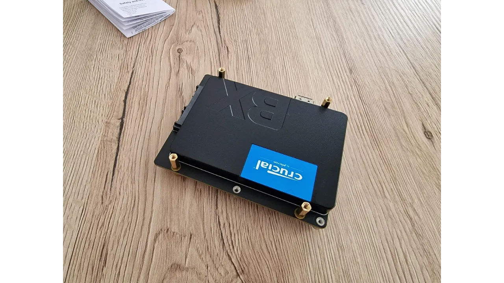

Sau đó, gắn Raspberry Pi của bạn vào thẻ mở rộng.

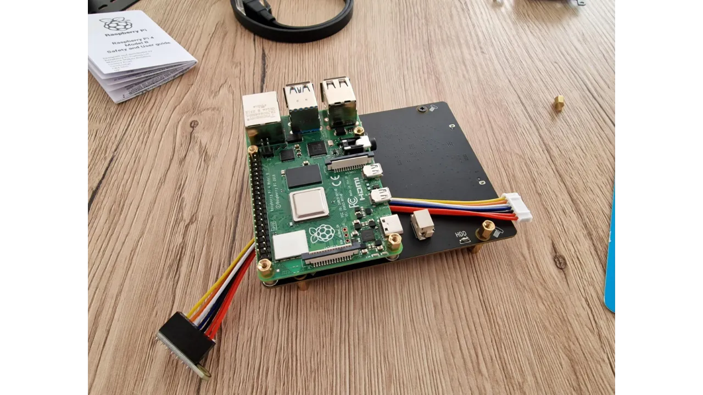

Gắn quạt vào Raspberry Pi.

Kết nối các thành phần khác nhau, chú ý sử dụng đúng chân, tham khảo hướng dẫn sử dụng trên vỏ của bạn. Các nhà sản xuất vỏ thường cung cấp video hướng dẫn để hỗ trợ bạn trong quá trình lắp ráp. Trong trường hợp của tôi, tôi có một thẻ mở rộng bổ sung được trang bị nút bật/tắt. Điều này không thiết yếu cho việc tạo một node Bitcoin. Tôi chủ yếu sử dụng nó để có một nút nguồn.

Nếu, giống như tôi, bạn có một thẻ mở rộng được trang bị nút bật/tắt, đừng quên lắp jumper "Auto Power On" nhỏ. Điều này giúp node của bạn tự động khởi động ngay khi được cấp nguồn. Tính năng này đặc biệt hữu ích trong trường hợp mất điện, vì nó giúp node của bạn tự khởi động lại, mà không cần sự can thiệp thủ công từ phía bạn.

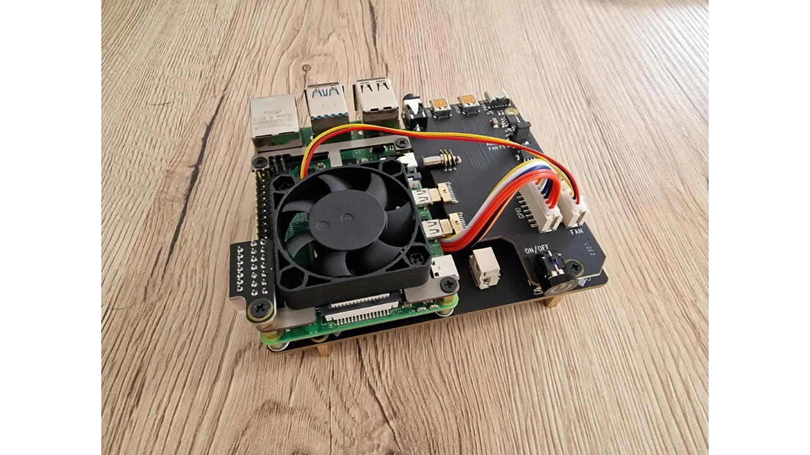

Trước khi lắp tất cả phần cứng vào vỏ, điều quan trọng là kiểm tra sự hoạt động chuẩn chỉnh của Raspberry Pi, thẻ mở rộng lưu trữ, và quạt bằng cách cấp nguồn cho chúng.

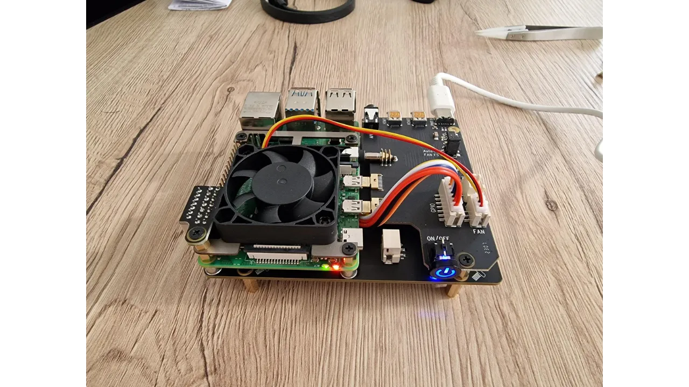
Cuối cùng, hãy lắp Raspberry Pi của bạn vào vỏ. Lưu ý, bước sau đây sẽ yêu cầu bạn thêm thẻ micro SD vào cổng thích hợp trên Raspberry Pi. Nếu vỏ của bạn được trang bị một lỗ mở cho phép bạn chèn thẻ SD mà không cần phải mở nó (như trường hợp của tôi được minh họa trong ảnh), bạn có thể tiến hành đóng vỏ ngay bây giờ. Tuy nhiên, nếu vỏ của bạn không có khe hở để gắn trực tiếp vào cổng micro SD, bạn sẽ cần phải đợi cho đến khi bạn đã chuẩn bị xong thẻ micro SD để chèn nó trước khi hoàn thiện việc lắp ráp.

## Cách cài đặt RoninDojo v2 trên Raspberry Pi 4?

### Bước 1: Chuẩn bị thẻ micro SD khởi động
Sau khi lắp ráp phần cứng của bạn, bước tiếp theo là cài đặt RoninDojo. Để làm điều này, chúng ta sẽ dùng máy tính của bạn để chuẩn bị một thẻ micro SD có thể dùng để khởi động, bằng cách ghi hình ảnh đĩa thích hợp vào nó.
Bạn sẽ cần sử dụng phần mềm _**Raspberry Pi Imager**_, được thiết kế để tải về, cấu hình và ghi hệ điều hành lên thẻ micro SD để sử dụng với Raspberry Pi. Bắt đầu bằng cách cài đặt phần mềm này trên máy tính cá nhân của bạn:
- Cho Ubuntu/Debian: https://downloads.raspberrypi.org/imager/imager_latest_amd64.deb
- Cho Windows: https://downloads.raspberrypi.org/imager/imager_latest.exe
- Cho Mac: https://downloads.raspberrypi.org/imager/imager_latest.dmg

Sau khi phần mềm được cài đặt, mở nó và chèn thẻ micro SD của bạn vào máy tính cá nhân. Từ giao diện Raspberry Pi Imager, chọn `CHOOSE OS`:

Tiếp theo, đi đến menu `Raspberry Pi OS (other)`:

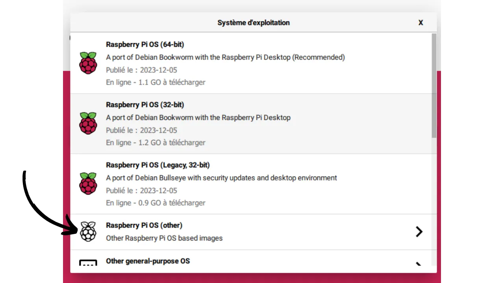

Chọn hệ điều hành có tên `Raspberry Pi OS (Legacy, 64-bit) Lite`, có kích thước là `0.3 GB`:

Sau khi chọn hệ điều hành, bạn sẽ được chuyển hướng đến menu chính của Raspberry Pi Imager. Nhấp vào `CHOOSE STORAGE`:

Chọn thẻ micro SD của bạn:

Sau khi chọn hệ điều hành và thẻ micro SD, nhấp vào `NEXT` để đi tiếp:

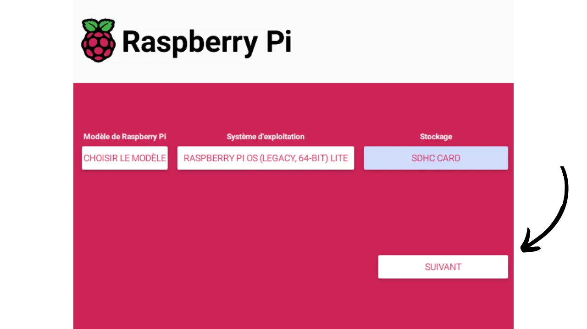

Một cửa sổ mới sẽ xuất hiện. Chọn `EDIT CONFIGURATION` để điều chỉnh cấu hình:

Trong cửa sổ này, đi đến tab `GENERAL` và thực hiện các cài đặt sau (rất quan trọng để nó hoạt động):
- Kích hoạt tùy chọn và gán `RoninDojo` làm tên máy chủ;
- Kích hoạt `Set username and password`, nhập `pi` làm tên người dùng, chọn một mật khẩu và ghi chú lại thông tin này, vì bạn sẽ cần nó sau này. Các thông tin đăng nhập này là tạm thời và sẽ được xóa sau đó;
- Vô hiệu hóa `Configure Wi-Fi`;
- Kích hoạt `Set locale settings` và chọn múi giờ của bạn cũng như loại bàn phím tương ứng với máy tính của bạn;

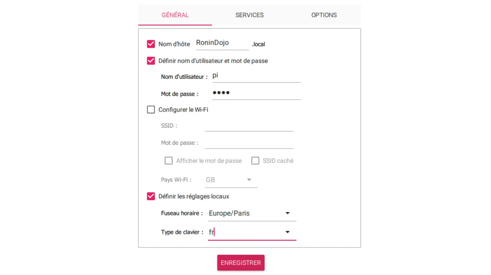

Trong tab SERVICES, nhấp vào ô `Enable SSH` và chọn `Dùng mật khẩu để xác minh - Use a password for authentication`:

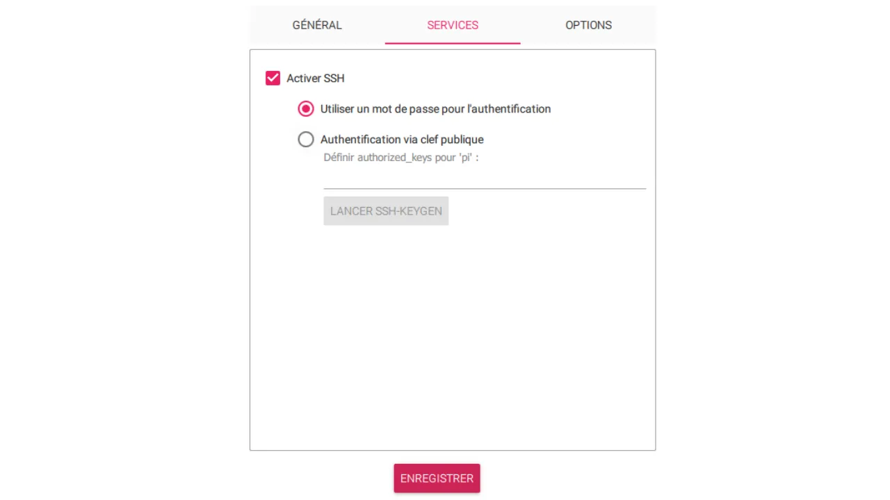

Hãy đảm bảo rằng trong tab `OPTIONS`, việc thu thập dữ liệu được vô hiệu hóa:

Nhấp vào `SAVE`:
Xác nhận bằng cách nhấp vào `YES` để bắt đầu tạo thẻ micro SD dùng để khởi động:
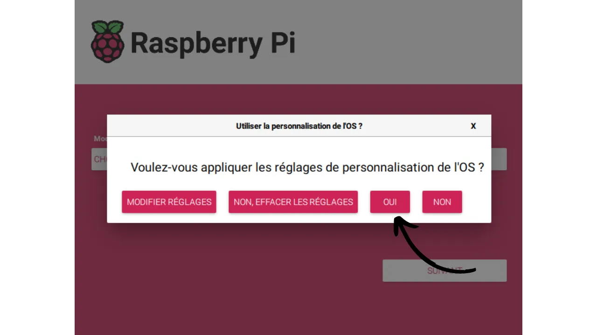

Một thông báo sẽ hiện lên cho bạn biết rằng tất cả dữ liệu trên thẻ micro SD sẽ bị xóa. Xác nhận việc này bằng cách nhấp vào `YES` để bắt đầu quá trình:

Chờ đợi cho đến khi phần mềm hoàn tất việc chuẩn bị thẻ micro SD của bạn:

Khi xuất hiện thông báo chỉ ra quá trình đã kết thúc, bạn có thể gỡ thẻ micro SD ra khỏi máy tính.

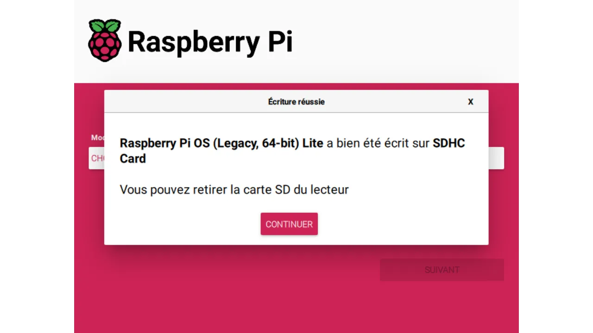

### Bước 2: Hoàn thành việc lắp ráp node Node
Bây giờ, bạn có thể chèn thẻ micro SD vào cổng thích hợp của Raspberry Pi của mình.

Sau đó, kết nối Raspberry Pi của bạn với router sử dụng cáp Ethernet. Cuối cùng, bật node của bạn bằng cách kết nối cáp nguồn và nhấn nút nguồn (nếu thiết lập của bạn có nút nguồn).

### Bước 3: Thiết lập kết nối SSH với Node
Đầu tiên, cần phải tìm địa chỉ IP của node. Bạn có thể sử dụng một công cụ như _[Advanced IP Scanner](https://www.advanced-ip-scanner.com/)_ hoặc _[Angry IP Scanner](https://angryip.org/)_, hoặc kiểm tra giao diện quản trị của router. Địa chỉ IP nên ở dạng `192.168.1.??`. **Đối với tất cả các lệnh sau, thay thế `[IP]` bằng địa chỉ IP thực tế của node**, (loại bỏ dấu ngoặc).

Khởi chạy một Terminal.

Để loại bỏ một khóa có thể đã được liên kết với địa chỉ IP của node, thực hiện lệnh: 
`ssh-keygen -R [IP]`. 

Một lỗi sau lệnh này không phải là điều gì đó nghiêm trọng; nó đơn giản chỉ là khóa không tồn tại trong danh sách các host đã biết của bạn (điều này có khả năng khá cao). Ví dụ, nếu IP của node là `192.168.1.40`, lệnh trở thành: `ssh-keygen -R 192.168.1.40`.

Tiếp theo, thiết lập kết nối SSH với node của bạn bằng cách thực hiện lệnh: 
`ssh pi@[IP]`.
Một thông báo sẽ xuất hiện về tính xác thực của host: `The authenticity of host '[IP]' can't be established.` Điều này chỉ ra rằng tính xác thực của thiết bị bạn đang cố gắng kết nối không thể được xác minh do thiếu một khóa công khai đã biết. Khi kết nối qua SSH với một host mới lần đầu tiên, thông báo này sẽ luôn xuất hiện. Bạn phải trả lời `yes` để thêm khóa công khai của nó vào thư mục cục bộ của bạn, điều này sẽ ngăn thông báo cảnh báo này xuất hiện trong các kết nối SSH tương lai đến node này. Do đó, gõ `yes` và nhấn `enter` để xác nhận.
Sau đó, bạn sẽ được yêu cầu nhập mật khẩu, mật khẩu đã được thiết lập tạm thời ở bước 1. Xác nhận bằng cách nhấn `enter`. Bạn đã kết nối với node của mình qua SSH.

Tóm lại, đây là các lệnh cần thực hiện:
- `ssh-keygen -R [IP]`
- `ssh pi@[IP]`
- `yes`
- Nhập mật khẩu tạm thời và xác nhận.

### Bước 4: Cập nhật và chuẩn bị
Bây giờ bạn đã kết nối với node của mình qua một phiên SSH. Trên Terminal của bạn, dấu nhắc lệnh nên là: `pi@RoninDojo:~ $`. Để bắt đầu, cập nhật danh sách các gói có sẵn và cài đặt các bản cập nhật cho các gói hiện có với lệnh sau:
`sudo apt update && sudo apt upgrade -y`
Sau khi hoàn thành các bản cập nhật, tiến hành cài đặt *Git* và *Dialog* bằng lệnh: `sudo apt install git dialog -y`

Tiếp theo, clone nhánh `master` của kho Git _RoninOS_ bằng cách thực hiện:
`sudo git clone --branch master https://code.samourai.io/ronindojo/RoninOS.git /opt/RoninOS`

Chạy script `customize-image.sh` với lệnh:
`cd /opt/RoninOS/ && sudo ./customize-image.sh`

**Quan trọng là bạn phải để cho script chạy không bị gián đoạn và kiên nhẫn chờ đợi cho đến khi quá trình kết thúc**, mất khoảng 10 phút. Khi thông báo `Setup is complete` xuất hiện, bạn có thể chuyển sang bước tiếp theo.

### Bước 5: Khởi chạy RoninOS
Khởi chạy RoninOS với lệnh:
`sudo systemctl start ronin-setup`

Hiển thị các dòng của tệp nhật ký với lệnh:
`tail -f /home/ronindojo/.logs/setup.logs`

Tại giai đoạn này, **quan trọng là bạn phải để RoninOS khởi chạy và chờ đợi** cho đến khi nó hoàn thành. Quá trình này mất khoảng 40 phút. Khi `All RoninDojo feature installations complete!` xuất hiện, bạn có thể tiếp tục sang bước 6.

### Bước 6: Truy cập RoninUI và thay đổi thông tin đăng nhập
Sau khi hoàn thành việc cài đặt, để kết nối với node của bạn qua trình duyệt, đảm bảo rằng máy tính cá nhân của bạn được kết nối với cùng mạng cục bộ với node của bạn. Nếu bạn đang sử dụng VPN trên máy của mình, tạm thời vô hiệu hóa nó. Để truy cập giao diện node trong trình duyệt của bạn, nhập vào thanh địa chỉ URL:
- Trực tiếp địa chỉ IP của node của bạn, ví dụ, `192.168.1.??`;
- Hoặc, gõ `ronindojo.local`.

Một khi bạn đến trang chủ RoninUI, bạn sẽ được yêu cầu bắt đầu quá trình thiết lập. Để làm điều này, nhấp vào nút `Let's start`.

Tại giai đoạn này, RoninUI sẽ cung cấp cho bạn mật khẩu gốc `root password`. Điều cần thiết là phải giữ nó an toàn. Bạn có thể chọn sao lưu vật lý, trên giấy, hoặc lưu nó trong một [trình quản lý mật khẩu](https://planb.network/courses/secu101/4/2).

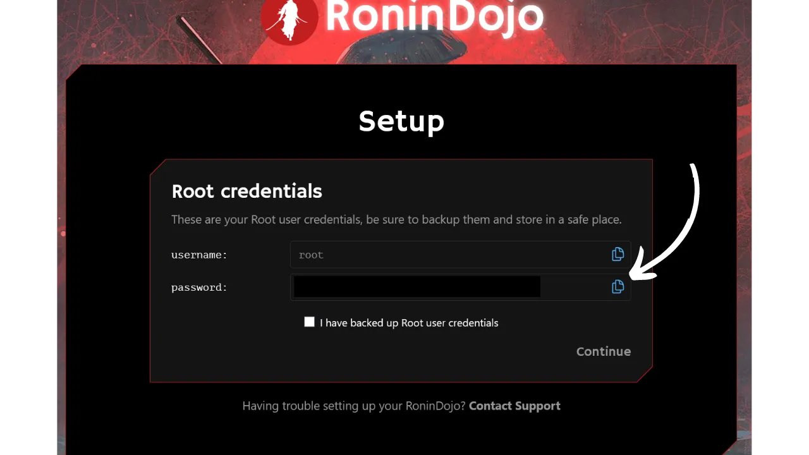

Sau khi lưu mật khẩu gốc `root password`, đánh dấu vào ô `I have backed up Root user credentials` và nhấp vào `Continue` để tiếp tục.

Bước tiếp theo liên quan đến việc tạo một mật khẩu người dùng, sẽ được dùng để cả truy cập giao diện web RoninUI và thiết lập các phiên SSH cho node của bạn. Chọn một mật khẩu mạnh và đảm bảo sao lưu nó một cách an toàn. Bạn sẽ cần nhập mật khẩu này hai lần trước khi nhấp vào `Finish` để xác nhận. Đối với tên người dùng, bạn được khuyến nghị giữ lựa chọn mặc định, `ronindojo`. Nếu bạn quyết định thay đổi nó, nhớ là phải điều chỉnh các lệnh trong các bước tiếp theo cho phù hợp.

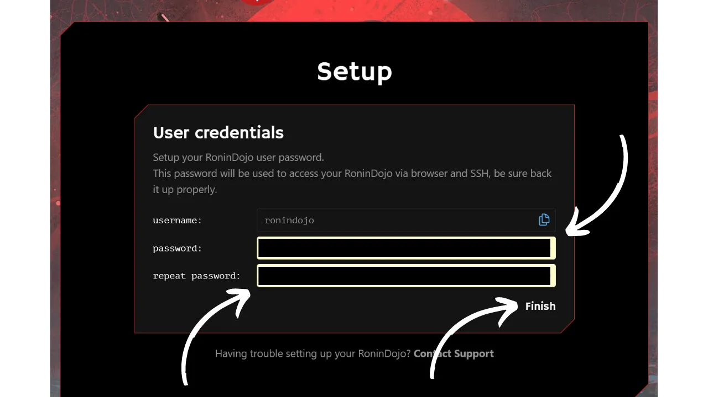

Sau khi hoàn thành các thao tác này này, chờ đợi node của bạn khởi tạo. Sau đó bạn sẽ truy cập vào giao diện web RoninUI. Bạn gần như đã ở những bước cuối của quá trình thiết lập, chỉ còn vài bước nhỏ nữa!

### Bước 7: Xóa thông tin đăng nhập tạm thờihj
Mở một terminal mới trên máy tính cá nhân của bạn và thiết lập một kết nối SSH với node của bạn bằng lệnh sau:
`SSH ronindojo@[IP]`
Nếu, ví dụ, địa chỉ IP của node của bạn là `192.168.1.40`, lệnh đúng sẽ là: `SSH ronindojo@192.168.1.40`

Nếu bạn đã thay đổi tên người dùng trong bước trước, thay thế tên người dùng mặc định (`ronindojo`) bằng tên mới, hãy chắc chắn sử dụng tên mới này trong lệnh. Ví dụ, nếu bạn chọn `planb` làm tên người dùng và địa chỉ IP là `192.168.1.40`, lệnh để nhập sẽ là:
`SSH planb@192.168.1.40`
Bạn sẽ được yêu cầu nhập mật khẩu người dùng. Nhập nó và sau đó nhấn `enter` để xác nhận. Bạn sẽ truy cập vào giao diện RoninCLI. Sử dụng các phím mũi tên trên bàn phím của bạn để di chuyển đến tùy chọn `Exit RoninDojo` và nhấn `enter` để chọn nó.
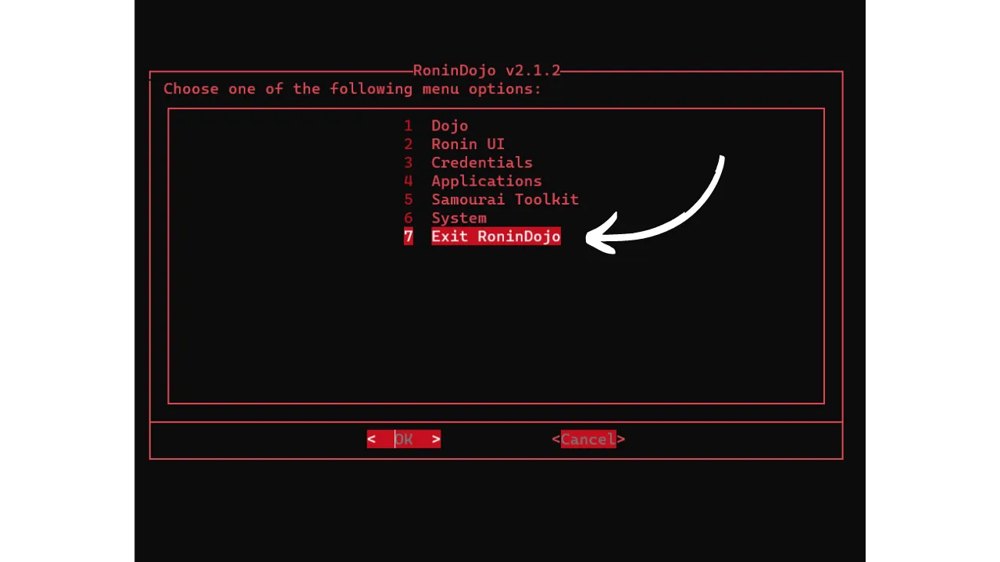

Tại thời điểm này, bạn đang ở trên terminal của node, với dấu nhắc lệnh tương tự như: `ronindojo@RoninDojo:~ $`. Để xóa người dùng tạm thời được tạo ra trong quá trình cấu hình thẻ micro SD khởi động, nhập lệnh sau và nhấn `enter`:
`sudo deluser --remove-home pi`

Bạn sẽ được yêu cầu xác nhận mật khẩu người dùng của mình. Nhập nó và xác nhận bằng cách nhấn `enter`. Đợi cho đến khi quá trình hoàn tất, sau đó sử dụng lệnh `exit` để rời khỏi terminal.

Xin chúc mừng! Node RoninDojo v2 của bạn giờ đây đã được cấu hình và sẵn sàng sử dụng. Nó sẽ bắt đầu quá trình tải xuống dữ liệu blockchain lần đầu - IBD (*Initial Block Download*), tiến hành tải xuống và xác minh blockchain Bitcoin từ khối Genesis. Bước này bao gồm việc truy xuất tất cả các giao dịch Bitcoin đã thực hiện kể từ ngày 3 tháng 1 năm 2009 cho đến hiện tại, do đó sẽ mất một khoản thời gian. Một khi blockchain được tải xuống đầy đủ, indexer sẽ tiến hành nén cơ sở dữ liệu. Thời gian của IBD có thể thay đổi đáng kể. Node RoninDojo của bạn sẽ hoạt động đầy đủ một khi quá trình này hoàn tất.

**Nếu bạn đang chuyển từ một node RoninDojo v1 cũ** sang phiên bản mới với hướng dẫn này trong khi giữ nguyên SSD, node của bạn nên tự động phát hiện và sử dụng lại dữ liệu hiện có trên đĩa, giúp bạn không cần phải thực hiện IBD lại. Trong trường hợp này, bạn chỉ cần đợi node của mình đồng bộ lại với các khối mới nhất.

### Bước 8: "veth* fix"
Nếu bạn gặp phải một lỗi với RoninDojo v2 trên Raspberry Pi, khi mà sau một quá trình cài đặt không gặp trở ngại, node của bạn đột nhiên trở nên không thể truy cập qua SSH nhưng phục hồi sau một lần khởi động lại đơn giản, thì bạn cần thực hiện bước 8 này. Lỗi phổ biến này có thể được khắc phục dễ dàng với một giải pháp được cộng đồng phát triển: "_veth fix_". Sửa đổi nhỏ này khắc phục vĩnh viễn sự ngắt kết nối đột ngột. Dưới đây là cách áp dụng nó.

Mở một terminal mới trên máy tính cá nhân của bạn và thiết lập một kết nối SSH với node của bạn bằng cách sử dụng lệnh sau:
`SSH ronindojo@[IP]`

Nếu, ví dụ, địa chỉ IP của node của bạn là `192.168.1.40`, lệnh phù hợp sẽ là:
`SSH ronindojo@192.168.1.40`

Bạn sẽ được yêu cầu nhập mật khẩu người dùng. Nhập nó vào và nhấn `enter` để xác nhận. Sau đó bạn sẽ truy cập vào giao diện RoninCLI. Sử dụng các phím mũi tên trên bàn phím của bạn để di chuyển đến tùy chọn `Exit RoninDojo` và nhấn `enter` để chọn nó.
Tại thời điểm này, bạn đang ở trên terminal của node, với dấu nhắc lệnh tương tự như: `ronindojo@RoninDojo:~ $`. Để áp dụng sửa lỗi veth*, hãy nhập lệnh sau và nhấn `enter`: `sudo nano /etc/dhcpcd.conf`

Xác nhận lại mật khẩu của bạn và nhấn `enter`.

Bạn sẽ đến với file `dhcpcd.conf`. Bạn cần sao chép văn bản sau, đảm bảo bao gồm dấu sao, và thêm nó vào cuối file:
`denyinterfaces veth*`

Để làm điều này, di chuyển đến cuối file sử dụng mũi tên xuống trên bàn phím của bạn, sau đó click chuột phải để dán văn bản trên một dòng độc lập.

Sau khi thêm văn bản, nhấn `ctrl X` để bắt đầu thoát, tiếp theo là `ctrl Y` để xác nhận lưu các thay đổi, và nhấn `enter` để hoàn tất và quay trở lại dấu nhắc lệnh. Để đảm bảo rằng chỉnh sửa này đã được áp dụng một cách chính xác, sử dụng lệnh thích hợp để mở lại file `dhcpcd.conf`.

Để hoàn thành việc áp dụng sửa lỗi, khởi động lại node của bạn bằng cách thực hiện:
`sudo reboot now`

Tại thời điểm này, bạn có thể đóng terminal của mình. Hãy đợi một khoảng thời gian cần thiết để RoninDojo của bạn khởi động lại, sau đó bạn có thể kết nối lại thông qua giao diện đồ họa trên trình duyệt của bạn. Quá trình này sẽ sửa lỗi đã gặp.

## Cách sử dụng node RoninDojo v2 của bạn?

### Kết nối phần mềm ví của bạn với Electrs
Ứng dụng đầu tiên của node mới cài đặt và đồng bộ hóa của bạn sẽ là để phát sóng các giao dịch của bạn lên mạng Bitcoin. Bạn có thể muốn kết nối các ví khác nhau của mình với node để phát sóng giao dịch một cách riêng tư. Bạn có thể làm điều này thông qua Electrum Rust Server (electrs). Ứng dụng này thường được cài đặt sẵn trên node RoninDojo của bạn. Nếu không, bạn có thể cài đặt nó thủ công qua giao diện RoninCLI tại `Applications > Manage Applications > Install Electrum Server`.

Để lấy địa chỉ Tor của Electrum Server của bạn, từ giao diện web RoninUI, đi đến:
`Pairing > Electrum server > Pair now`

Sau đó, bạn sẽ cần nhập địa chỉ `Hostname` kết thúc bằng `.onion` vào phần mềm ví của bạn, kèm theo cổng `50001`. 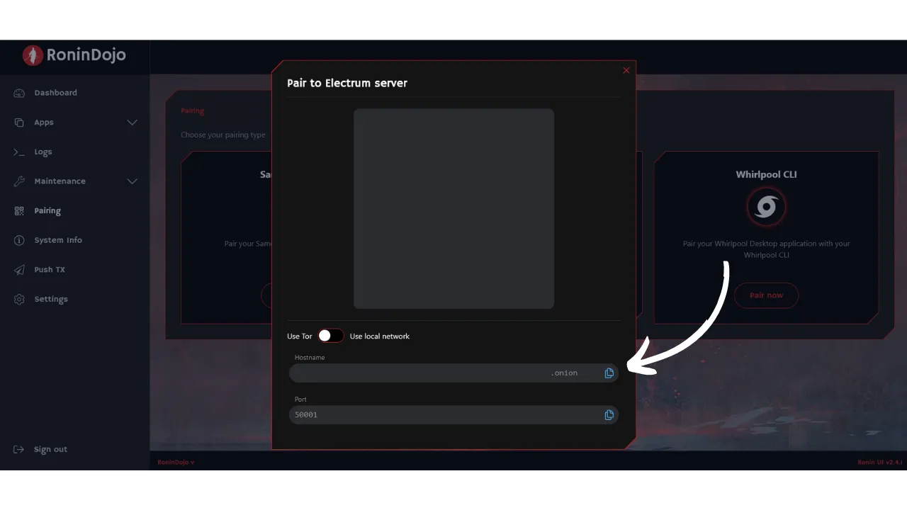
Ví dụ, trên Sparrow Wallet, chỉ cần đi đến tab:
`File > Preferences > Server > Private Electrum`

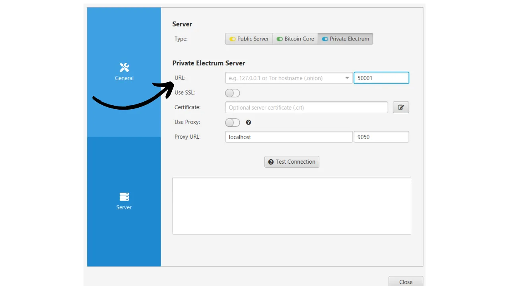

### Kết nối phần mềm ví của bạn với Samourai Dojo
Là một lựa chọn thay thế cho việc sử dụng Electrs, Dojo cho phép bạn kết nối trực tiếp phần mềm ví tương thích của mình với node RoninDojo. Ví dụ, Samourai Wallet và Sentinel cung cấp chức năng này.

Để thiết lập kết nối, bạn chỉ cần quét mã QR của Dojo. Để truy cập mã QR này qua RoninUI, di chuyển đến:
`Pairing > Samourai Dojo > Pair now`
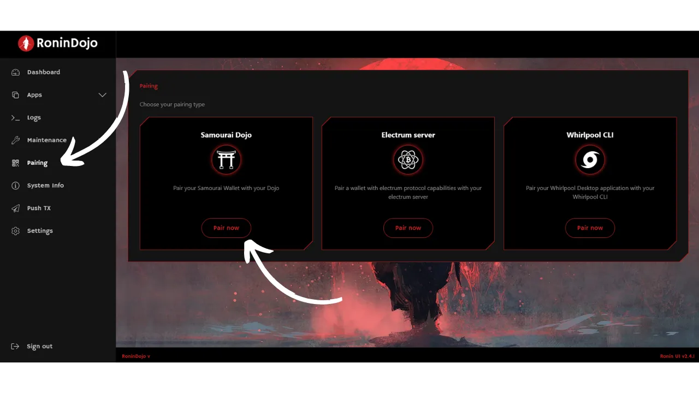
Để liên kết Samourai Wallet của bạn với Dojo, chỉ cần quét mã QR này trong quá trình cài đặt ứng dụng:

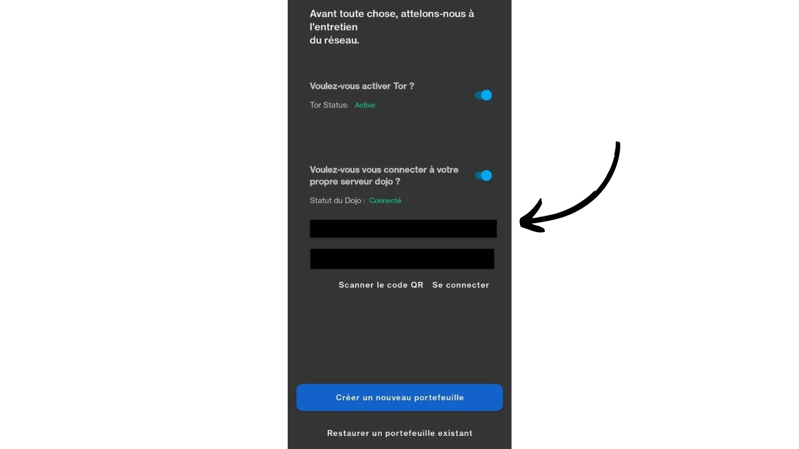
Nếu bạn đã có Samourai Wallet trước khi thiết lập Ronin Dojo của mình, bạn cần phải sao lưu ví của mình, gỡ cài đặt và sau đó cài đặt lại ứng dụng Samourai Wallet, trước khi khôi phục ví của bạn. Khi khởi chạy lại ứng dụng, bạn sẽ có tùy chọn kết nối với một Dojo mới. **Hãy cẩn thận, quá trình này mang theo rủi ro mất bitcoin nếu không thực hiện đúng cách!** Đảm bảo bạn đã có bản sao lưu của Samourai Wallet trong tệp của mình và xác minh tính hợp lệ của passphrase qua `Settings > Troubleshoot > Passphrase`. Một điều cũng quan trọng là phải có bản sao lưu của cụm từ khôi phục (hạt giống) và passphrase của bạn. Để có sự chính xác hơn trong thao tác này, bạn nên theo dõi hướng dẫn chi tiết này: [https://wiki.ronindojo.io/en/setup/v2_0_0-upgrade/reconnectsamourai](https://wiki.ronindojo.io/en/setup/v2_0_0-upgrade/reconnectsamourai).

### Sử dụng trình duyệt blockchain Mempool.space của riêng bạn
Một trình duyệt blockchain phổ biến chuyển đổi thông tin thô từ blockchain Bitcoin thành một định dạng có cấu trúc và dễ đọc. Với các công cụ như *Mempool.space*, bạn có thể phân tích giao dịch, tìm kiếm địa chỉ cụ thể, hoặc thậm chí tham khảo mức phí trung bình của các mempool trên mạng lưới theo thời gian thực.

Tuy nhiên, việc sử dụng trình duyệt blockchain trực tuyến mang lại rủi ro cho quyền riêng tư của bạn và đòi hỏi phải tin tưởng vào dữ liệu do bên thứ ba cung cấp. Thực tế, bằng cách sử dụng các dịch vụ này mà không thông qua node của riêng bạn, bạn có thể vô tình tiết lộ thông tin về giao dịch của mình và phải dựa vào độ chính xác của thông tin được đưa ra bởi chủ sở hữu trang web.
Để giảm thiểu những rủi ro này, bạn nên sử dụng phiên bản *Mempool.space* của riêng mình qua mạng Tor, được lưu trữ trực tiếp trên node của bạn. Giải pháp này bảo vệ quyền riêng tư và sư tự chủ về dữ liệu của bạn.
Để thực hiện điều này, bắt đầu bằng cách cài đặt *Mempool Space Visualizer* từ RoninUI. Trên giao diện web, đi tới tab `Dashboard` và nhấp vào `Manage` dưới `Mempool Space`:
`Dashboard > Mempool Space > Manage`
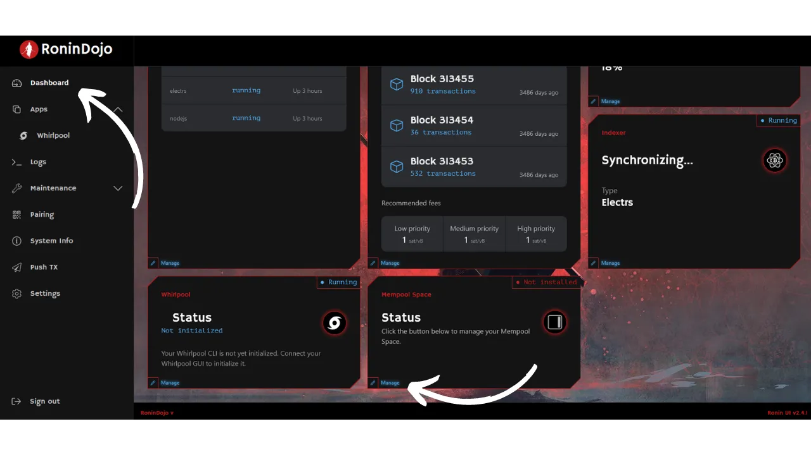
Sau đó nhấp vào nút `Install Mempool visualizer` để cài đặt:
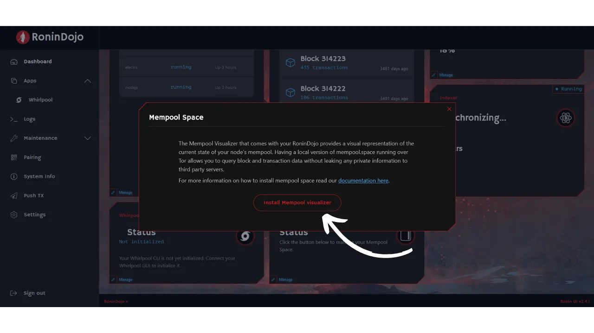
Xác nhận mật khẩu người dùng của bạn:
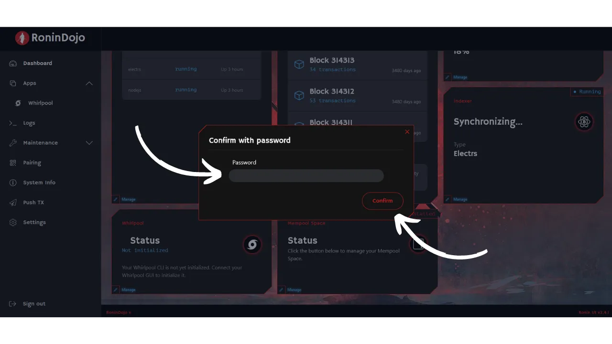
Chờ đợi quá trình cài đặt hoàn tất, sau đó nhấp lại vào nút `Manage`:

Bạn sẽ nhận được một liên kết `.onion` để truy cập vào phiên bản *Mempool.space* của riêng bạn qua mạng Tor.
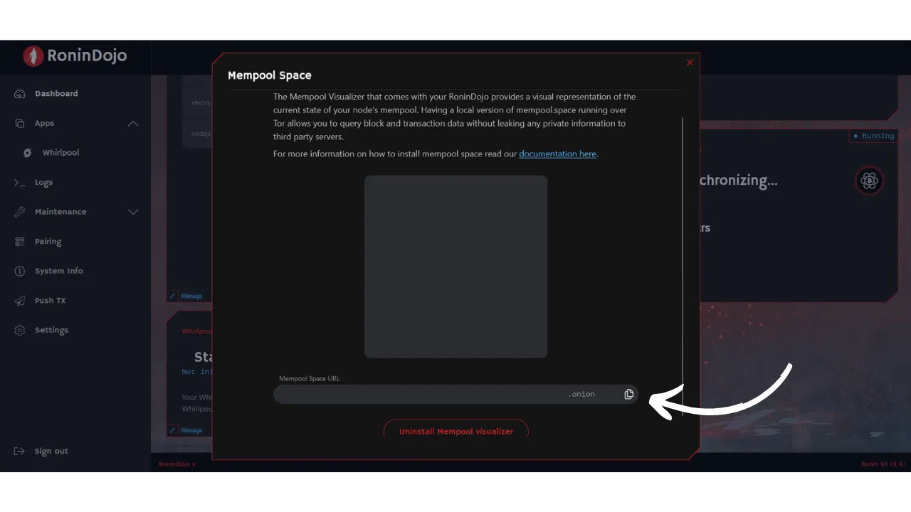
Tôi khuyên bạn nên lưu liên kết này vào mục yêu thích trên trình duyệt Tor hoặc thêm nó vào ứng dụng Trình duyệt Tor trên điện thoại thông minh của bạn để dễ dàng và an toàn truy cập từ mọi nơi. Nếu bạn chưa có trình duyệt Tor, bạn có thể tải về tại đây: [https://www.torproject.org/download/](https://www.torproject.org/download/)
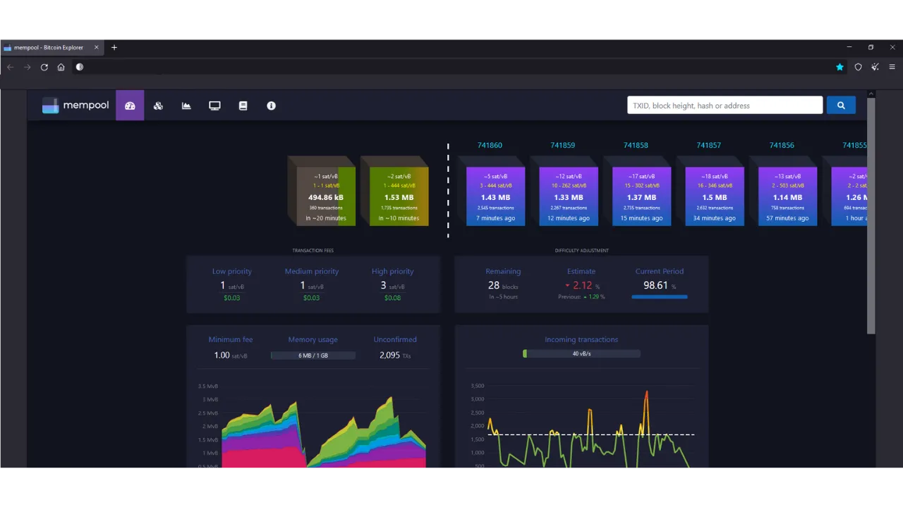

### Sử dụng Whirlpool để trộn bitcoin của bạn
Node RoninDojo của bạn cũng tích hợp _WhirlpoolCLI_, một giao diện dòng lệnh cho phép tự động hóa việc trộn coin qua Whirlpool, và _WhirlpoolGUI_, một giao diện đồ họa được thiết kế để tương tác với _WhirlpoolCLI_.
Thực hiện một giao dịch trộn coin qua Whirlpool yêu cầu ứng dụng được sử dụng phải hoạt động để thực hiện các lần tái trộn. Điều kiện này có thể hạn chế đối với những người muốn đạt được mức độ ẩn danh cao. Thực tế, thiết bị chứa ứng dụng tích hợp Whirlpool phải luôn bật. Điều này có nghĩa là để tham gia vào các lần tái trộn 24 giờ một ngày, máy tính hoặc điện thoại thông minh của bạn phải luôn bật với Samourai hoặc Sparrow mở liên tục. Một giải pháp cho ràng buộc này là sử dụng _WhirlpoolCLI_ trên một máy luôn bật, như một node Bitcoin, cho phép tiền của bạn được tái trộn mà không bị gián đoạn, và không cần phải giữ một thiết bị khác luôn mở.

Một hướng dẫn chi tiết đang được chuẩn bị để hướng dẫn bạn từng bước qua quá trình trộn coin với Samourai Wallet và RoninDojo v2, từ A đến Z.

Để hiểu sâu hơn về trộn coin và cách sử dụng nó trên Bitcoin, tôi cũng mời bạn tham khảo bài viết khác: Hiểu và sử dụng trộn coin trên Bitcoin - Understanding and using coinjoin on Bitcoin, nơi tôi chi tiết hoá mọi thứ bạn cần biết về kỹ thuật này.

https://planb.network/tutorials/privacy/coinjoin-dojo
### Sử dụng công cụ Whirlpool Stat Tool (WST)

Sau khi thực hiện trộn coin với Whirlpool, việc đánh giá chính xác mức độ riêng tư đạt được cho các UTXO đã trộn của bạn là điều rất hữu ích. Để làm điều này, bạn có thể sử dụng công cụ Python *Whirlpool Stat Tool*. Công cụ này cho phép bạn đo cả điểm số tương lai (prospective) và hồi tưởng (retrospective) của các UTXO của bạn, trong khi phân tích tốc độ khuếch tán của chúng trong pool.

Để hiểu sâu hơn về cơ chế tính toán của các tập hợp ẩn danh này, tôi khuyên bạn đọc bài viết: REMIX - WHIRLPOOL, chi tiết về cách hoạt động của các chỉ số này.

https://planb.network/tutorials/privacy/remix-whirlpool

Để truy cập công cụ WST, hãy đến RoninCLI. Để làm điều này, mở một Terminal trên máy tính cá nhân của bạn và thiết lập một kết nối SSH với node của bạn bằng lệnh sau:
`SSH ronindojo@[IP]`

Nếu, ví dụ, địa chỉ IP của nút của bạn là `192.168.1.40`, lệnh đúng sẽ là:
`SSH ronindojo@192.168.1.40`

Nếu bạn đã thay đổi tên người dùng trong bước 6, thay thế tên người dùng mặc định (`ronindojo`) bằng tên khác, hãy chắc chắn sử dụng tên mới này trong lệnh. Ví dụ, nếu bạn chọn `planb` làm tên người dùng và địa chỉ IP là `192.168.1.40`, lệnh đúng để nhập sẽ là:
`SSH planb@192.168.1.40`

Bạn sẽ được yêu cầu nhập mật khẩu người dùng. Nhập nó vào và nhấn `enter` để xác nhận. Sau đó, bạn sẽ truy cập vào giao diện RoninCLI. Sử dụng các phím mũi tên trên bàn phím của bạn để di chuyển đến menu `Samourai Toolkit` và nhấn `enter` để chọn nó:

Sau đó chọn `Whirlpool Stat Tool`:

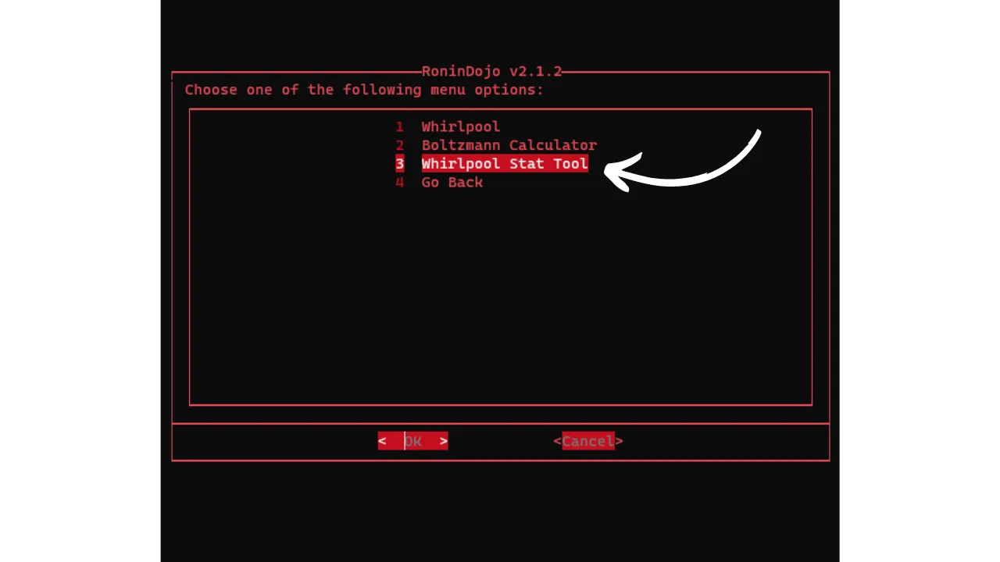

Khi khởi tạo WST, công cụ sẽ tiến hành cài đặt tự động. Đợi bước này hoàn thành. Hướng dẫn sử dụng sẽ cuộn qua. Một khi việc cài đặt hoàn tất, nhấn bất kỳ phím nào để truy cập terminal WST:

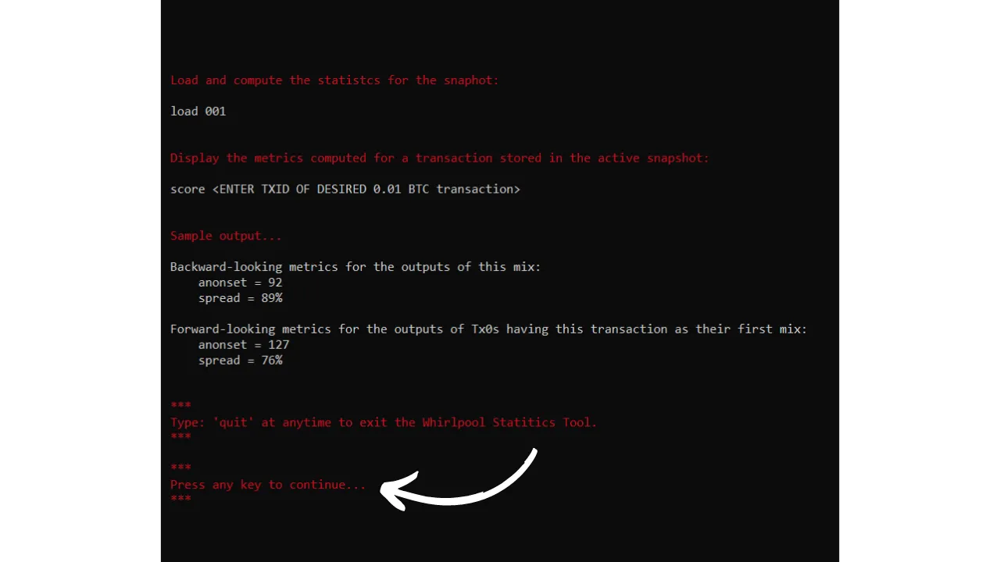

Lệnh sau sẽ được hiển thị:
`wst#/tmp>`

Nếu bạn muốn thoát khỏi giao diện này và quay lại menu RoninCLI, chỉ cần nhập:
`quit`

Đầu tiên, cần thiết lập proxy để sử dụng Tor, để đảm bảo bảo mật khi trích xuất dữ liệu từ OXT. Nhập lệnh:
`socks5 127.0.0.1:9050`
Tiếp theo, hãy tiến hành tải thông tin về pool chứa giao dịch của bạn:
`download 0001`
Thay thế `0001` bằng mã số của pool bạn quan tâm. Các mã số của pool trên WST như sau:
- Pool 0.5 bitcoin: `05`
- Pool 0.05 bitcoin: `005`
- Pool 0.01 bitcoin: `001`
- Pool 0.001 bitcoin: `0001`

Sau khi tải xuống xong, tải dữ liệu bằng cách thay thế `0001` bằng mã số của pool của bạn trong lệnh này: `load 0001`

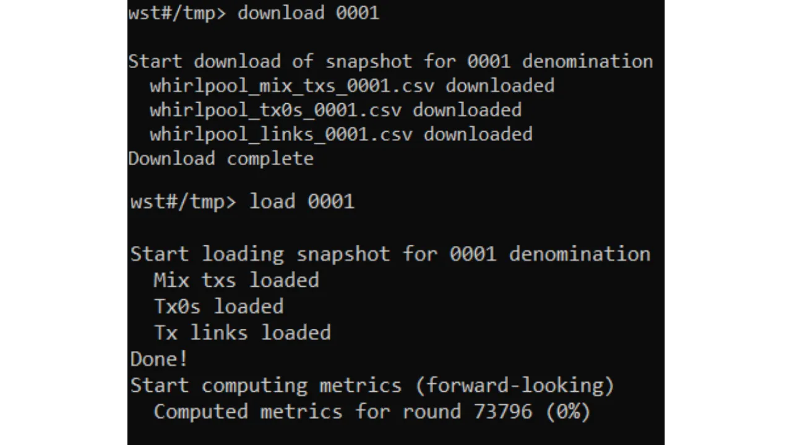

Chờ cho đến khi việc tải hoàn tất, có thể mất vài phút. Khi dữ liệu đã được tải, để biết điểm tập hợp ẩn danh của đồng tiền của bạn, thực hiện lệnh `score` theo sau là TXID của bạn (không bao gồm dấu ngoặc):
`score [TXID]`

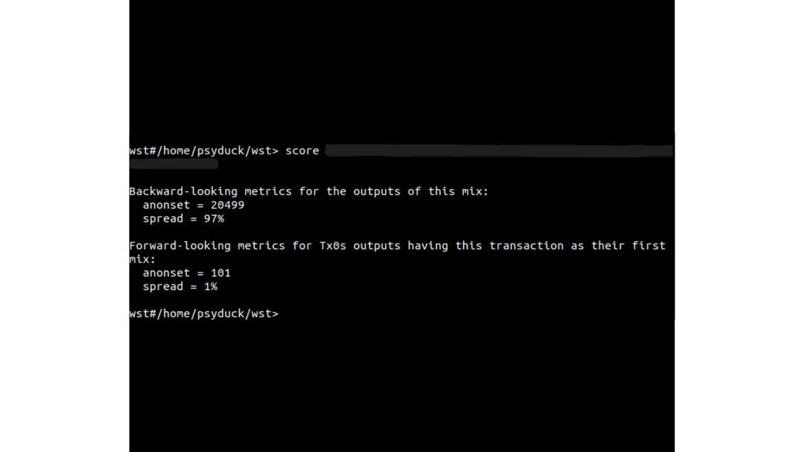

WST sau đó sẽ hiển thị điểm số hồi tưởng (_Backward-looking metrics_), tiếp theo là điểm số tương lai (_Forward-looking metrics_). Ngoài điểm tập hợp ẩn danh, WST cũng sẽ chỉ ra tỷ lệ khuếch tán của giao dịch của bạn trong pool, tương đối với tập hợp ẩn danh của nó.

**Điều quan trọng cần lưu ý là điểm số ẩn danh tương lai của đồng tiền của bạn nên được tính từ TXID của lần trộn ban đầu, chứ không phải từ lần trộn gần nhất của bạn. Ngược lại, điểm số hồi tưởng của một UTXO được tính từ TXID ở chu kỳ cuối cùng.**

### Sử dụng máy tính Boltzmann
Máy tính Boltzmann là một công cụ để phân tích một giao dịch Bitcoin, cung cấp khả năng đo lường mức độ entropy cùng với các chỉ số tiên tiến khác. Những dữ liệu này cung cấp một đánh giá định lượng về sự riêng tư của một giao dịch và giúp xác định các lỗi tiềm ẩn. Công cụ này đã được tích hợp sẵn vào nút RoninDojo của bạn, giúp dễ dàng truy cập và sử dụng.

Trước khi chi tiết hoá quy trình sử dụng máy tính Boltzmann, điều quan trọng là chúng ta phải hiểu ý nghĩa của các chỉ số này, phương pháp tính toán và ích lợi của chúng. Mặc dù áp dụng cho bất kỳ giao dịch Bitcoin nào, nhưng các chỉ số này đặc biệt hữu ích để đánh giá chất lượng của một giao dịch trộn coin.

**Chỉ số đầu tiên** mà phần mềm tính toán là tổng số các kết hợp có thể, được chỉ báo dưới `nb combinations` trong công cụ. Dựa trên giá trị của các UTXO liên quan, chỉ số này định lượng số cách mà các đầu vào có thể được kết hợp với các đầu ra. Nói cách khác, nó xác định số lượng cách diễn giải khả dĩ mà một giao dịch có thể tạo ra. Ví dụ, một giao dịch trộn coin được cấu trúc theo mô hình Whirlpool 5x5 sẽ có `1496` kết hợp khả dĩ:

Ghi nhận: KYCP

**Chỉ số thứ hai** được tính toán là entropy của một giao dịch, được chỉ định bởi `Entropy`. Khi một giao dịch có số lượng kết hợp khả dĩ cao, thường thì việc tham khảo đến entropy của nó là phù hợp hơn. Đây được định nghĩa là logarit cơ số 2 của số lượng kết hợp khả dĩ. Dưới đây là công thức được sử dụng:
- $E$: entropy của giao dịch;
- $C$: số lượng kết hợp khả dĩ của giao dịch.
$$E = \log_2(C)$$
Trong toán học, logarit cơ số 2 tương ứng với phép toán ngược của việc luỹ thừa của 2. Nói cách khác, logarit cơ số 2 của x là số mũ mà 2 phải được luỹ thừa lên để thu được x. Do đó, chỉ số này được biểu thị bằng bit. Hãy lấy ví dụ về việc tính entropy cho một giao dịch trộn coin được cấu trúc theo mô hình Whirlpool 5x5, mà, như đã đề cập trước đó, cung cấp một số lượng kết hợp có thể là `1496`:$$ C = 1496 $$
$$ E = \log_2(1496) $$
$$ E \approx 10.5469 \text{ bit}$$

Như vậy, giao dịch trộn coin này thể hiện một entropy là 10.5469 bit, được coi là rất thỏa đáng. Giá trị này càng cao, giao dịch càng có nhiều cách diễn giải khác nhau, do đó tăng cường mức độ riêng tư của nó.

Hãy lấy một ví dụ bổ sung với một giao dịch thông thường hơn, có một đầu vào và hai đầu ra: [1b1b0c3f0883a99f1161c64da19471841ed12a1f78e77fab128c69a5f578ccce](https://mempool.space/en/tx/1b1b0c3f0883a99f1161c64da19471841ed12a1f78e77fab128c69a5f578ccce)
Trong trường hợp của giao dịch này, chỉ có một cách diễn giải khả dĩ là: `(inp 0) > (Outp 0 ; Outp 1)`. Do đó, entropy của nó được thiết lập ở `0`:
$$ C = 1 $$
$$ E = \log_2(1) $$
$$ E \approx 0 \text{ bit}$$
**Chỉ số thứ ba** được cung cấp bởi máy tính Boltzmann được gọi là `Hiệu quả Ví - WalletEfficiency`. Chỉ số này đánh giá hiệu quả của giao dịch bằng cách so sánh nó với giao dịch lý tưởng nhất có thể trong một cấu hình giống nhau. Điều này dẫn chúng ta đến khái niệm entropy tối đa, tương ứng với entropy cao nhất mà một cấu trúc giao dịch cụ thể có thể đạt được theo lý thuyết. Như vậy, đối với cấu trúc trộn coin Whirlpool 5x5, entropy tối đa được thiết lập ở `10.5469`. Hiệu quả của giao dịch sau đó được tính toán bằng cách đối chiếu entropy tối đa này với entropy thực tế của giao dịch được phân tích. Công thức sử dụng như sau:
- $ER$: entropy thực tế của giao dịch, được biểu thị bằng bit;
- $EM$: entropy tối đa có thể đạt được theo lý thuyết cho một cấu trúc giao dịch cụ thể, cũng bằng bit;
- $Ef$: hiệu quả của giao dịch, bằng bit.
$$Ef = ER - EM$$ $$Ef = 10.5469 - 10.5469$$
$$Ef = 0 \text{ bit}$$

Chỉ số này cũng được biểu thị dưới dạng phần trăm, công thức của nó sau đó là:
- $CR$: số lượng kết hợp khả dĩ thực tế;
- $CM$: số lượng kết hợp tối đa có thể đạt được theo lý thuyết với cùng một cấu trúc;
- $Ef$: hiệu quả được biểu thị dưới dạng phần trăm.
$$Ef = \frac{CR}{CM}$$
$$Ef = \frac{1496}{1496}$$
$$Ef = 100\%$$

Mức hiệu quả `100%` do đó chỉ ra rằng giao dịch đã được tối đa hóa tiềm năng riêng tư dựa trên cấu trúc của nó.
**Chỉ số thứ tư**, mật độ entropy, hay `Entropy Density`, cung cấp một góc nhìn về entropy tương đối với mỗi đầu vào hoặc đầu ra của giao dịch. Chỉ số này hữu ích để đánh giá và so sánh hiệu quả của các giao dịch có kích thước khác nhau. Để tính toán, chỉ cần chia tổng entropy của giao dịch cho tổng số đầu vào và đầu ra liên quan. Lấy ví dụ về một giao dịch trộn coin Whirlpool cấu trúc 5x5:
- $ED$: mật độ entropy được biểu thị bằng bit;
- $E$: entropy của giao dịch được biểu thị bằng bit;
- $T$: tổng số đầu vào và đầu ra trong giao dịch.
$$T = 5 + 5 = 10$$
$$ED = \frac{E}{T}$$
$$ED = \frac{10.5469}{10}$$
$$ED = 1.054 \text{ bit}$$
**Thông tin thứ năm** được cung cấp bởi máy tính Boltzmann là bảng xác suất tương ứng giữa đầu vào và đầu ra. Bảng này chỉ ra, thông qua `điểm Boltzmann - Boltzmann score`, xác suất một đầu vào cụ thể được kết nối với một đầu ra nhất định. Lấy ví dụ về một giao dịch trộn coin Whirlpool, bảng xác suất sẽ làm nổi bật cơ hội liên kết giữa mỗi đầu vào và đầu ra, cung cấp một phép đo định lượng về sự mơ hồ hoặc dự đoán được của các mối liên kết trong giao dịch:

| %       | Đầu ra 0 | Đầu ra 1 | Đầu ra 2 | Đầu ra 3 | Đầu ra 4 |
|---------|----------|----------|----------|----------|----------|
| Đầu vào 0 | 34%      | 34%      | 34%      | 34%      | 34%      |
| Đầu vào 1 | 34%      | 34%      | 34%      | 34%      | 34%      |
| Đầu vào 2 | 34%      | 34%      | 34%      | 34%      | 34%      |
| Đầu vào 3 | 34%      | 34%      | 34%      | 34%      | 34%      |
| Đầu vào 4 | 34%      | 34%      | 34%      | 34%      | 34%      |

Ở đây, rõ ràng mỗi đầu vào có cơ hội ngang nhau được kết nối với bất kỳ đầu ra nào, điều này tăng cường sự mơ hồ và bảo mật của giao dịch. Tuy nhiên, trong trường hợp của một giao dịch đơn giản với một đầu vào và hai đầu ra, tình hình là khác:

| %       | Đầu ra 0 | Đầu ra 1 |
|---------|----------|----------|
| Đầu vào 0 | 100%     | 100%     |

Ở đây, chúng ta thấy rằng xác suất cho mỗi đầu ra đến từ đầu vào 0 là 100%. Do đó, một mức xác suất thấp hơn thể hiện mức độ bảo mật lớn hơn, bằng cách pha loãng các liên kết trực tiếp giữa đầu vào và đầu ra.

**Thông tin thứ sáu** được cung cấp là số lượng liên kết tất định, bổ sung bởi tỷ lệ của các liên kết này. Chỉ số này tiết lộ bao nhiêu kết nối giữa các đầu vào và đầu ra trong giao dịch được phân tích là không thể chối cãi, với xác suất 100%. Tỷ lệ, ngược lại, cung cấp một góc nhìn về trọng lượng của các liên kết tất định này trong tổng số liên kết của giao dịch.

Ví dụ, một giao dịch kiểu trộn coin Whirlpool không có liên kết tất định nào, và do đó hiển thị chỉ số và tỷ lệ là 0%. Mặt khác, trong giao dịch thứ hai được xem xét của chúng tôi (với một đầu vào và hai đầu ra), chỉ số được đặt ở 2 và tỷ lệ đạt 100%. Do đó, một chỉ số bằng không báo hiệu bảo mật xuất sắc nhờ vào sự vắng mặt của các liên kết trực tiếp và không thể chối cãi giữa đầu vào và đầu ra.

**Cách truy cập vào máy tính Boltzmann trên RoninDojo?** Để truy cập công cụ *Máy tính Boltzmann*, hãy vào RoninCLI. Để làm điều này, mở một Terminal trên máy tính cá nhân của bạn và thiết lập một kết nối SSH với node của bạn bằng lệnh sau: `SSH ronindojo@[IP]`

Nếu, ví dụ, địa chỉ IP của node của bạn là `192.168.1.40`, lệnh đúng sẽ là:
`SSH ronindojo@192.168.1.40`

Nếu bạn đã thay đổi tên người dùng trong bước 6, thay thế tên người dùng mặc định (`ronindojo`) bằng tên khác, hãy chắc chắn sử dụng tên mới này trong lệnh. Ví dụ, nếu bạn chọn `planb` làm tên người dùng và địa chỉ IP là `192.168.1.40`, lệnh đúng để nhập sẽ là:
`SSH planb@192.168.1.40`

Bạn sẽ được yêu cầu nhập mật khẩu người dùng. Nhập nó vào và sau đó nhấn `enter` để xác nhận. Bạn sẽ truy cập vào giao diện RoninCLI. Sử dụng các phím mũi tên trên bàn phím của bạn để di chuyển đến menu `Samourai Toolkit` và nhấn `enter` để chọn nó:

Sau đó chọn `Máy tính Boltzmann - Boltzmann Calculator`:

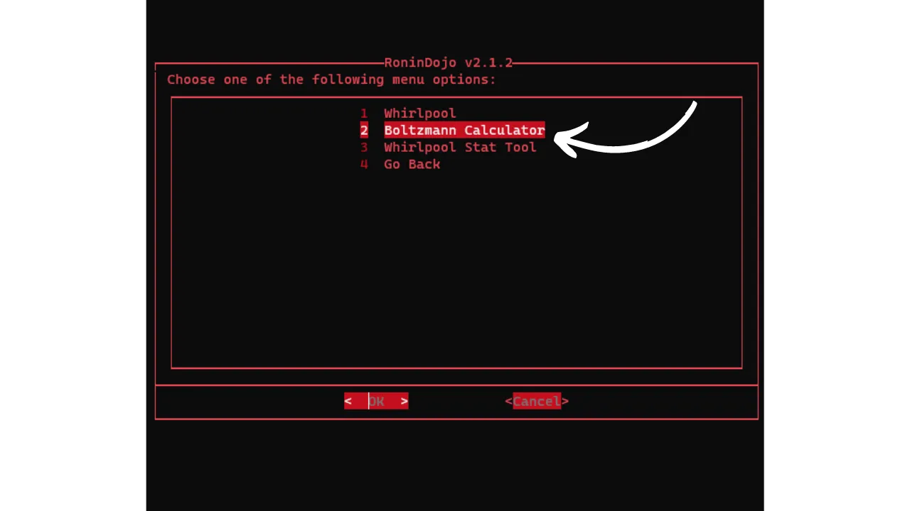

Bạn sẽ đến trang chủ của phần mềm:

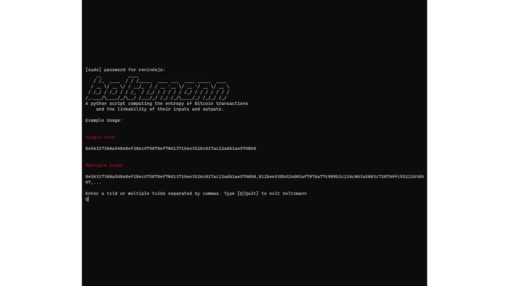

Nhập TXID của giao dịch bạn muốn nghiên cứu và nhấn phím `enter`:

Máy tính sau đó cung cấp cho bạn tất cả các chỉ số mà chúng ta đã thảo luận ở phía trên:

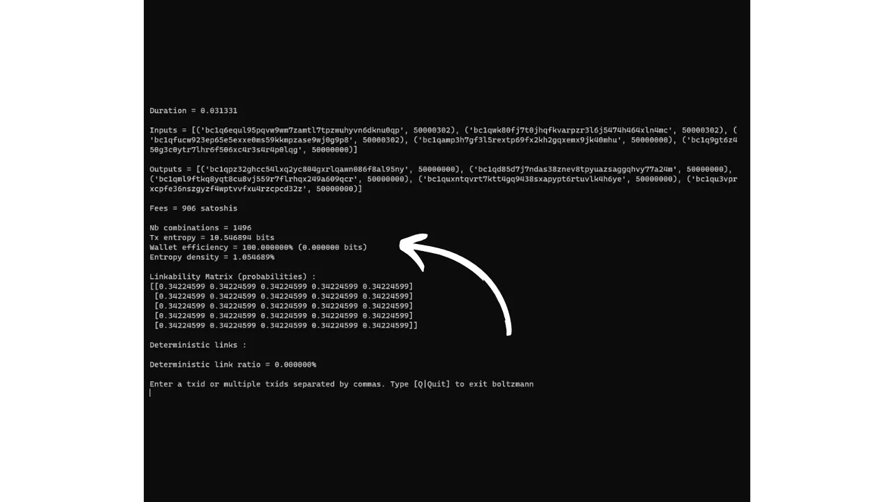

### Các tính năng khác của RoninDojo v2 của bạn
Node RoninDojo của bạn còn tích hợp nhiều tính năng khác. Cụ thể, bạn có khả năng quét thông tin cụ thể để xem xét. Ví dụ, đôi khi ví Samourai của bạn, kết nối với RoninDojo, có thể không hiển thị số bitcoin bạn thực sự sở hữu. Nếu số dư chỉ ra 0 trong khi bạn chắc chắn rằng mình có bitcoin trong ví này, có nhiều lý do có thể giải thích tình huống này, như lỗi trong các đường dẫn phái sinh. Nhưng một trong những nguyên nhân cũng có thể là node của bạn không theo dõi đúng địa chỉ của bạn. Để giải quyết vấn đề này, bạn có thể đảm bảo rằng node của bạn thực sự đang theo dõi `xpub` của bạn bằng công cụ _xpub_. Để truy cập công cụ này qua RoninUI, theo dõi đường dẫn:
`Maintenance > XPUB Tool`

Nhập `xpub` đang gặp vấn đề và nhấp vào nút `Check` để xác minh thông tin này:
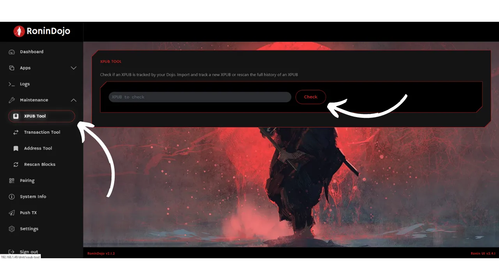
Đảm bảo rằng tất cả các giao dịch đều được liệt kê đúng cách. Một điểm cũng quan trọng là phải xác minh rằng loại phái sinh được sử dụng phù hợp với ví của bạn. Nếu không phải như vậy, nhấp vào `Retype`, sau đó chọn từ `BIP44`, `BIP49`, hoặc `BIP84` theo nhu cầu của bạn.
Ngoài công cụ này, tab `Maintenance` của RoninUI chứa đầy các tính năng hữu ích khác:
- *Công cụ giao dịch*: Cho phép kiểm tra chi tiết của một giao dịch cụ thể;
- *Công cụ địa chỉ*: Cho phép xác nhận việc theo dõi một địa chỉ cụ thể bởi Dojo của bạn;
- *Quét lại khối*: Buộc node của bạn thực hiện một đợt quét mới theo phạm vi khối được chỉ định.

Tab `Push Tx` là một tính năng thú vị khác của RoninUI, cho phép phát sóng một giao dịch đã ký trên mạng Bitcoin. Giao dịch phải được nhập dưới dạng hệ thập lục phân.
Về các tab khác có sẵn trên bảng điều khiển RoninUI của bạn:
- `Apps`: Chứa ứng dụng Whirlpool, và chắc chắn sẽ được sử dụng để tích hợp các ứng dụng mới trong tương lai;
- `Logs`: Cung cấp quyền truy cập thời gian thực vào nhật ký sự kiện của phần mềm của bạn;
- `System Info`: Cung cấp thông tin tổng quan về node của bạn, như nhiệt độ CPU, sử dụng không gian lưu trữ, hoặc dữ liệu RAM. Bạn cũng sẽ tìm thấy các tùy chọn `Reboot` và `Shut down` để khởi động lại hoặc tắt node của mình;
- `Settings`: Cho phép bạn thay đổi mật khẩu người dùng của mình.

Đó là tất cả! Cảm ơn bạn đã theo dõi hướng dẫn này đến cuối. Nếu bạn thích nó, tôi khuyến khích bạn chia sẻ nó trên mạng xã hội. Hơn nữa, nếu bạn có cơ hội, hãy xem xét việc hỗ trợ các nhà phát triển đã tạo ra phần mềm miễn phí và mã nguồn mở này có sẵn cho cộng đồng của chúng ta bằng cách quyên góp: [https://donate.ronindojo.io/](https://donate.ronindojo.io/). Để mở rộng kiến thức của bạn về RoninDojo và khám phá thêm các tài nguyên, tôi rất khuyến khích bạn tham khảo các liên kết đến các tài nguyên bên ngoài được đề cập dưới đây.

**Các tài nguyên bên ngoài:**
- [https://ronindojo.io/index.html](https://ronindojo.io/index.html)
- [https://wiki.ronindojo.io/en/home](https://wiki.ronindojo.io/en/home)
- [https://gist.github.com/LaurentMT/e758767ca4038ac40aaf](https://gist.github.com/LaurentMT/e758767ca4038ac40aaf)
- [https://medium.com/@laurentmt/giới thiệu-boltzmann-85930984a159](https://medium.com/@laurentmt/giới thiệu-boltzmann-85930984a159)
- [https://wiki.ronindojo.io/en/setup/V2_0_0-upgrade-raspberry](https://wiki.ronindojo.io/en/setup/V2_0_0-upgrade-raspberry)
