**警告: このチュートリアルはRoninDojo v1のインストールには引き続き使用できますが、ノードをRoninDojo v2にアップグレードすることはできません。したがって、このバージョンは機能していますが、もはや更新されていません。最新の改善と機能を利用するためには、Raspberry Pi上でのRoninDojo v2の直接インストールのための専用チュートリアルを参照することを強くお勧めします:** [https://planb.network/tutorials/node/ronin-dojo-v2](https://planb.network/tutorials/node/ronin-dojo-v2)

---

自分自身のノードを運用し使用することは、Bitcoinネットワークに真に参加するために不可欠です。Bitcoinノードを運用することはユーザーに金銭的な利益をもたらしませんが、プライバシーを保護し、独立して行動し、ネットワークへの信頼を自分でコントロールすることを可能にします。

この記事では、自分自身のBitcoinノードを運用するための素晴らしいソリューションであるRoninDojoについて詳しく見ていきます。

### 目次:

- RoninDojoとは何か？
- どのハードウェアを選ぶべきか？
- RoninDojoのインストール方法は？
- RoninDojoの使用方法は？
- 結論

Bitcoinノードの仕組みや役割についてまだよくわからない場合は、この記事から始めることをお勧めします：Bitcoinノード - 第1部/2：技術的概念。

## RoninDojoとは何か？

DojoはSamourai Walletチームによって開発された完全なBitcoinノードサーバーです。任意のマシンに自由にインストールできます。

RoninDojoはDojoと様々な他のツールのためのインストールアシスタントおよび管理ツールです。RoninDojoはDojoのオリジナルの実装を取り、多くの他のツールを追加するとともに、インストールと管理を容易にします。

彼らはまた、RoninDojoがプリインストールされたマシン、RoninDojo Tantoを「プラグアンドプレイ」ハードウェアとして提供しています。Tantoは有料ソリューションで、自分で手を汚したくない人に適しています。

RoninDojoのコードはオープンソースなので、自分のハードウェアにこのソリューションをインストールすることも可能です。このオプションはコスト効果が高いですが、少し手間がかかります。これがこの記事で行うことです。

RoninDojoはDojoなので、BitcoinノードにWhirlpool CLIを簡単に統合し、可能な限り最高のCoinJoin体験を提供します。Whirlpool CLIを使用すると、個人のコンピュータをオンにしておく必要なく、ビットコインを24/7リミックスさせることができるだけでなく、プライバシーを大幅に向上させることができます。

RoninDojoは、Dojoに依存する多くの他のツールを統合しています。例えば、トランザクションのプライバシーレベルを決定するBoltzmann計算機、ノードに異なるBitcoinウォレットを接続するためのElectrumサーバー、またはトランザクションをプライベートに観察するためのMempoolサーバーなどです。
Umbrelという別のノードソリューションと比較して、この記事で紹介したRoninDojoは、「On Chain」ソリューションとユーザープライバシーを最適化するツールに深く焦点を当てています。したがって、RoninDojoはLightning Networkとのやり取りを許可しません。
RoninDojoはUmbrelに比べてツールが少ないですが、Roninに存在するビットコイナーにとって不可欠ないくつかの機能は非常に安定しています。

したがって、Umbrelサーバーのすべての機能が必要なく、WhirlpoolやMempoolのようないくつかの基本的なツールを備えたシンプルで安定したノードだけを望む場合、RoninDojoはあなたにとって良いソリューションかもしれません。
私の意見では、Umbrelの開発焦点は、ライトニングネットワークと多機能ツールに大きく注がれています。それはまだビットコインノードですが、目標はそれをマルチタスクミニサーバーにすることです。対照的に、RoninDojoの開発焦点はSamourai Walletのチームとより一致しており、ビットコイナーにとって不可欠なツールに焦点を当て、ビットコイン上でのプライバシーの完全な独立性と最適化された管理を可能にします。
RoninDojoノードの設定は、Umbrelノードよりも少し複雑です。

RoninDojoについての絵を描くことができたので、このノードの設定方法を見てみましょう。

## どのハードウェアを選ぶべきか？

RoninDojoをホストして実行するマシンを選択するには、いくつかのオプションがあります。

先に説明したように、最も簡単な選択肢は、この目的のために特別に設計されたプラグアンドプレイマシンであるTantoを注文することです。ご注文はこちらから：[リンク](https://shop.ronindojo.io/product-category/nodes/)。

RoninDojoチームがオープンソースコードを生産しているため、他のマシンにRoninDojoを実装することも可能です。インストールウィザードの最新バージョンはこのページで見つけることができます：[リンク](https://ronindojo.io/en/downloads.html)、コードの最新バージョンはこのページで見つけることができます：[リンク](https://code.samourai.io/ronindojo/RoninDojo)。

個人的には、Raspberry Pi 4 8GBにインストールし、すべてが完璧に動作しています。

ただし、RoninDojoチームは、ケースとSSDアダプターに問題がよくあると指摘しています。そのため、マシンのSSDにケーブル付きのケースを使用することはお勧めできません。代わりに、このようなもの：Raspberry Pi 4 ストレージ拡張カード専用に設計されたストレージ拡張カードを使用することが好ましいです。

自分のRoninDojoノードを設定する例はこちらです：

- Raspberry Pi 4。
- ファン付きのケース。
- 互換性のあるストレージ拡張カード。
- 電源ケーブル。
- 16GB以上の産業用マイクロSDカード。
- 1TB以上のSSD。
- RJ45イーサネットケーブル、カテゴリ8推奨。

## RoninDojoのインストール方法は？

### ステップ1: ブータブルマイクロSDカードを準備する。

マシンを組み立てたら、RoninDojoのインストールを開始できます。これを行うには、適切なディスクイメージをそれに焼き付けることによってブータブルマイクロSDカードを作成することから始めます。

個人用コンピュータにマイクロSDカードを挿入し、公式のRoninDojoウェブサイトにアクセスしてRoninOSディスクイメージをダウンロードしてください：https://ronindojo.io/en/downloads.html。

ハードウェアに対応するディスクイメージをダウンロードします。私の場合、「MANJARO-ARM-RONINOS-RPI4-22.03.IMG.XZ」イメージをダウンロードしました：

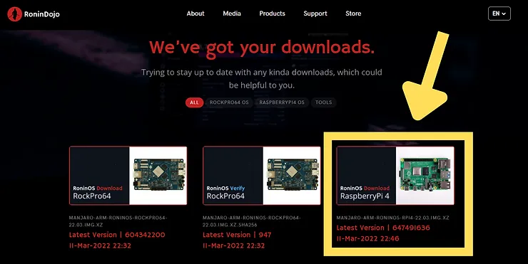

イメージをダウンロードしたら、対応する.SHA256ファイルを使用してその整合性を検証します。この記事で詳しく説明します：Windows上でビットコインソフトウェアの整合性をどのように検証するか？

RoninOSの整合性を検証するための具体的な指示もこのページで利用可能です：https://wiki.ronindojo.io/en/extras/verify。

このイメージをマイクロSDカードに焼き付けるには、Balena Etcherなどのソフトウェアを使用できます。こちらからダウンロードできます：https://www.balena.io/etcher/。

これを行うには、Etcherでイメージを選択し、マイクロSDカードにフラッシュします：

操作が完了したら、ブータブルなマイクロSDカードをRaspberry Piに挿入し、マシンの電源を入れることができます。

### ステップ2: RoninOSの設定。

RoninOSは、RoninDojoノードのオペレーティングシステムです。これは、LinuxディストリビューションであるManjaroの改良版です。マシンを起動して数分待った後、その設定を開始できます。

リモートで接続するには、RoninDojoマシンのIPアドレスを見つける必要があります。これを行うには、例えば、インターネットボックスの管理パネルに接続するか、またはhttps://angryip.org/ のようなソフトウェアをダウンロードしてローカルネットワークをスキャンし、マシンのIPを見つけることができます。

IPを見つけたら、同じローカルネットワークに接続された別のコンピューターからSSHを使用してマシンを制御できます。

macOSまたはLinuxを実行しているコンピューターからは、単にターミナルを開きます。Windowsを実行しているコンピューターからは、Puttyのような専門ツールを使用するか、直接Windows PowerShellを使用できます。

ターミナルを開いたら、次のコマンドを入力します：

> ssh root@192.168.?.?

単に疑問符を以前に見つけたRoninDojoのIPで置き換えてください。
ヒント：シェルで、アイテムを貼り付けるには右クリックします。

次に、Manjaroのコントロールパネルに到着します。矢印を使用してドロップダウンリストのターゲットを変更し、正しいキーボードレイアウトを選択します。

セッションのユーザー名とパスワードを選択します。強力なパスワードを使用し、安全なバックアップを取ってください。インストール中に弱いパスワードを使用し、後でRoninUIに「コピー＆ペースト」して簡単に変更することもできます。これにより、Manjaroのセットアップ中に手動で入力する時間をかけずに非常に強力なパスワードを使用できます。

次に、rootパスワードを選択するように求められます。rootパスワードには、直接強力なパスワードを入力します。RoninUIからは変更できません。また、このrootパスワードを安全にバックアップしておくことを忘れないでください。

次に、あなたの場所とタイムゾーンを入力します。

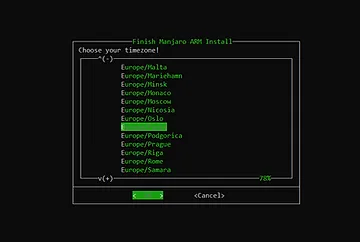

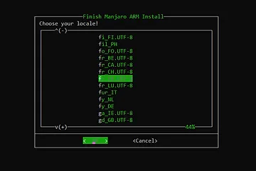

次に、ホスト名を選択します。

最後に、Manjaroの設定情報を確認し、確認します。

### ステップ3: RoninDojoのダウンロード。

RoninOSの初期設定が完了します。上記のスクリーンショットに示されているように、マシンが再起動されるのを待ちます。数分待った後、次のコマンドを入力してRoninDojoマシンに再接続します：

> ssh username@192.168.?.?

単に"username"を以前に選択したユーザー名に置き換え、疑問符をRoninDojoのIPで置き換えてください。

次に、ユーザーパスワードを入力します。

ターミナルでは、このように見えます：

これで、現在RoninOSのみがインストールされているマシンに接続されました。これからRoninDojoをインストールする必要があります。

次のコマンドを入力して、RoninDojoの最新バージョンをダウンロードします：

> git clone https://code.samourai.io/ronindojo/RoninDojo

ダウンロードは迅速に行われます。ターミナルでは、これが表示されます：

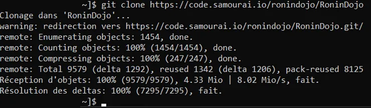
ダウンロードが完了したら、以下のコマンドを使用してRoninDojoのユーザーインターフェースをインストールし、アクセスしてください：
> ~/RoninDojo/ronin

ユーザーパスワードの入力を求められます：

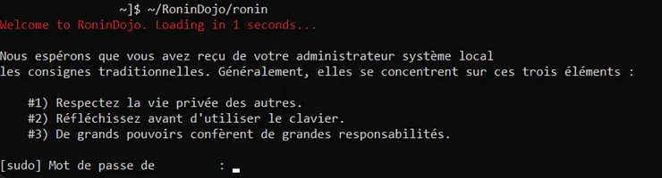

このコマンドは、RoninDojoに初めてアクセスする際にのみ必要です。その後、SSH経由でRoninCLIにアクセスするには、コマンド[SSH username@192.168.?.?]を入力し、「username」をあなたのユーザー名に置き換え、ノードのIPアドレスを入力するだけです。ユーザーパスワードの入力が求められます。

次に、この素晴らしいアニメーションが表示されます：

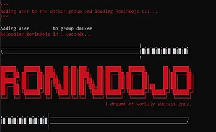

そして、ついにRoninDojo CLIユーザーインターフェースに到着します。

### ステップ4: RoninDojoをインストールする。

メインメニューから、キーボードの矢印キーを使用して「System」メニューに移動します。エンターキーを押して選択を確認します。

次に、「System Setup & Install」メニューに移動します。

最後に、「System Setup」と「Install RoninDojo」をスペースバーでチェックし、「Accept」を選択してインストールを開始します。

インストールが静かに進行するのを待ちます。私の場合、約2時間かかりました。プロセス中はターミナルを開いたままにしてください。

時々ターミナルをチェックしてください。インストールの特定の段階でキーを押すように求められる場合があります。例えばここのように：

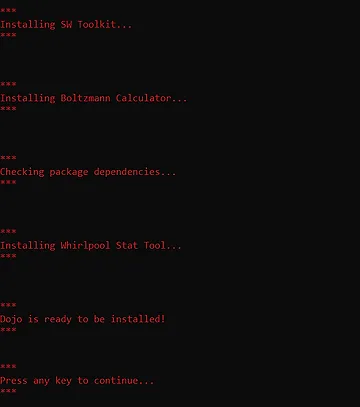

インストールの終了時には、異なるコンテナが起動するのを見ることができます：

その後、ノードが再起動します。次のステップのために再びRoninCLIに接続してください。

### ステップ5: プルーフ・オブ・ワークチェーンをダウンロードし、RoninUIにアクセスする。

インストールが完了すると、ノードはBitcoinのプルーフ・オブ・ワークチェーンのダウンロードを開始します。これはInitial Block Download (IBD)と呼ばれます。通常、インターネット接続とデバイスに応じて2日から14日かかります。

RoninUIウェブインターフェースにアクセスして、チェーンのダウンロードの進行状況を追跡できます。

ローカルネットワークからアクセスするには、ブラウザのアドレスバーに以下を入力してください：

- マシンのIPアドレス（192.168.?.?）を直接入力する

- または、ronindojo.localを入力する

VPNを使用している場合は無効にしてください。

### 可能な問題

ブラウザからRoninUIに接続できない場合は、SSH経由でノードに接続されたターミナルからアプリケーションの正常な動作を確認してください。前のステップに従ってメインメニューに接続します：

- タイプ：SSH username@192.168.?.? あなたの認証情報で置き換える。

- ユーザーパスワードを入力します。

メインメニューにいるときに、次に進みます：

> RoninUI > Restart

アプリケーションが正しく再起動した場合、ブラウザからの接続に問題があります。VPNを使用していないことを確認し、ノードと同じネットワークに接続していることを確認してください。

再起動がエラーを生じた場合は、オペレーティングシステムを更新してからRoninUIを再インストールしてみてください。OSを更新するには：

> System > Software Updates > Update Operating System

更新と再起動が完了したら、SSH経由でノードに再接続し、RoninUIを再インストールしてください：

> RoninUI > Re-install
RoninUIを再度ダウンロードした後、ブラウザを通じてRoninUIに接続してみてください。
> ヒント：RoninCLIを誤って終了し、Manjaroターミナルに戻ってしまった場合は、コマンド「ronin」を入力するだけで、直接RoninCLIのメインメニューに戻ることができます。

### Webログイン

Torを使用して、任意のネットワークからRoninUIのWebインターフェースにログインすることもできます。これを行うには、RoninCLIからRoninUIのTorアドレスを取得します：

> 認証情報 > Ronin UI

.onionで終わるTorアドレスを取得し、そのアドレスをTorブラウザに入力してRonin UIにログインします。様々な認証情報を漏洩しないよう注意してください。これらは機密情報です。

ログインすると、ユーザーパスワードの入力を求められます。これはSSH経由でログインする際に使用するのと同じパスワードです。

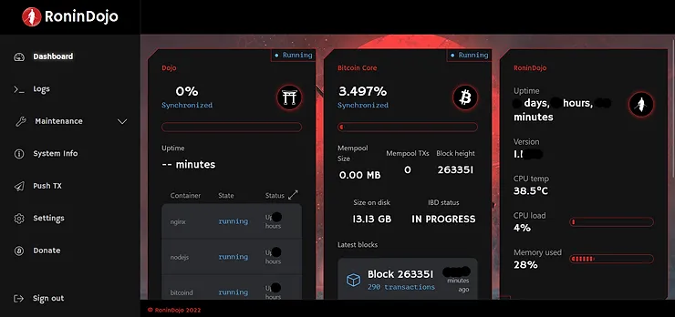

ここではIBD（Initial Block Download）の進行状況を確認できます。忍耐強く待ってください。2009年1月3日以降にBitcoinで行われたすべてのトランザクションを取得しています。

ブロックチェーン全体をダウンロードした後、インデクサーはデータベースを圧縮します。この操作には約12時間かかります。RoninUIの「Indexer」の下でその進行状況も追跡できます。

これにより、RoninDojoノードは完全に機能するようになります：

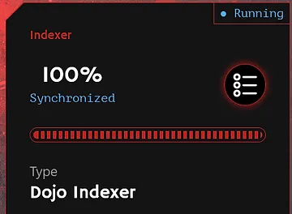

ユーザーパスワードをより強力なものに変更したい場合は、「設定」タブから今すぐ行うことができます。RoninDojoでは追加のセキュリティ層はありませんので、本当に強力なパスワードを選択し、そのバックアップを取ることをお勧めします。

## RoninDojoの使用方法は？

チェーンがダウンロードされ圧縮されたら、新しいRoninDojoノードが提供するサービスを楽しむことができます。それらをどのように使用するか見てみましょう。

### ウォレットソフトウェアをelectrsに接続する。

新しくインストールされ同期されたノードの最初の利用は、トランザクションをBitcoinネットワークにブロードキャストすることになります。そのため、異なるウォレット管理ソフトウェアをそれに接続したいと思うでしょう。

これはElectrum Rust Server（electrs）を使用して行うことができます。このアプリケーションは通常、RoninDojoノードにプリインストールされています。そうでない場合は、RoninCLIインターフェースから手動でインストールできます。

単に以下に進んでください：

> アプリケーション > アプリケーション管理 > Electrum Serverのインストール

Electrum ServerのTorアドレスを取得するには、RoninCLIメニューから以下に進んでください：

> 認証情報 > Electrs

あとは、ウォレットソフトウェアに.onionリンクを入力するだけです。例えば、Sparrow Walletでは、タブに進んでください：

> ファイル > 設定 > サーバー

サーバータイプで「Private Electrum」を選択し、対応するフィールドにElectrum ServerのTorアドレスを入力します。最後に、「接続テスト」をクリックして接続をテストし保存します。

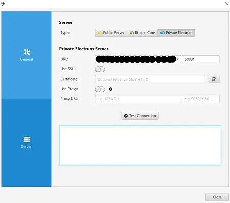

### ウォレットソフトウェアをSamourai Dojoに接続する。

Electrsの代わりに、Samourai Dojoを使用して、互換性のあるソフトウェアウォレットをRoninDojoノードに接続することもできます。例えば、Samourai Walletはこのオプションを提供しています。
これを行うには、Dojoの接続QRコードを単にスキャンします。RoninUIからアクセスするには、「Dashboard」タブをクリックし、Dojoのボックス内の「Manage」ボタンをクリックします。そうすると、DojoとBTC-RPC Explorerの接続QRコードを確認できます。「Display values」をクリックして表示します。
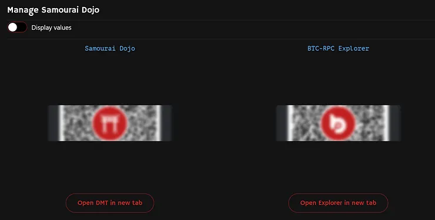

Samourai WalletをDojoに接続するには、アプリケーションのインストール中にこのQRコードをスキャンする必要があります：

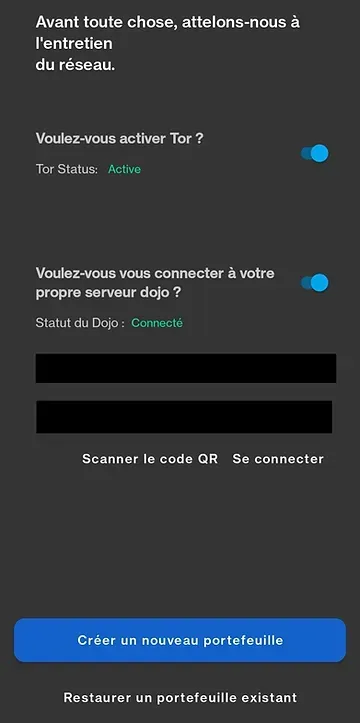

### 自分自身のMempool Explorerを使用する。

Bitcoinユーザーにとって不可欠なツールであるエクスプローラーは、Bitcoinチェーンに関する様々な情報を確認することを可能にします。例えばMempoolを使用すると、リアルタイムで他のユーザーが適用している手数料を確認し、それに応じて自分の手数料を調整することができます。また、自分のトランザクションの確認状況を確認したり、アドレスの残高を表示することもできます。

これらのエクスプローラーツールはプライバシーリスクにさらされる可能性があり、第三者のデータベースを信頼する必要があります。自分のノードを経由せずにこのオンラインツールを使用する場合：

- ウォレットに関する情報が漏洩するリスクがあります。

- ホストしている証明作業チェーンのウェブサイト管理者を信頼します。

これらのリスクを避けるために、Torネットワーク経由でノード上の自分自身のMempoolインスタンスを使用できます。このソリューションを使用することで、サービスを使用する際にプライバシーを保護するだけでなく、自分自身のデータベースをクエリするため、プロバイダーを信頼する必要がなくなります。

これを行うには、まずRoninCLIからMempool Space Visualizerをインストールします：

> Applications > Manage Applications > Install Mempool Space Visualizer

インストールしたら、Mempoolへのリンクを取得します。Torアドレスを使用すると、任意のネットワークからアクセスできます。同様に、このリンクはRoninCLI経由で取得します：

> Credentials > Mempool

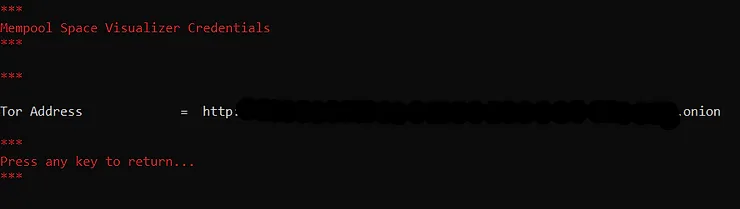

TorブラウザでMempool Torアドレスを入力するだけで、自分自身のデータに基づいた自分自身のMempoolインスタンスを楽しむことができます。より迅速なアクセスのために、このTorアドレスをお気に入りに追加することをお勧めします。また、デスクトップ上にショートカットを作成することもできます。

まだTorブラウザを持っていない場合は、こちらからダウンロードできます：https://www.torproject.org/download/

スマートフォンからも、Torブラウザをインストールして同じアドレスを入力することでアクセスできます。どこからでも、自分自身のノードを使用してBitcoinチェーンの状態を確認できます。

### Whirlpool CLIの使用。

RoninDojoノードには、Whirlpoolミックスを自動化するためのリモートコマンドラインインターフェースであるWhirlpoolCLIも含まれています。

Whirlpool実装でCoinJoinを実行する場合、使用しているアプリケーションはミックスとリミックスを実行するために開いたままでなければなりません。このプロセスは、高い匿名セットを望むユーザーにとって面倒なものになる可能性があります。なぜなら、Whirlpoolを搭載したアプリケーションをホストするデバイスは常にオンの状態を維持しなければならないからです。実際には、UTXOを24/7でリミックスに参加させたい場合、パーソナルコンピューターや電話をアプリケーションを開いた状態で常にオンにしておく必要があります。

この制約を解決する一つの方法は、Bitcoinノードのように常にオンにすることを意図したマシンでWhirlpoolCLIを使用することです。これにより、Bitcoinノード以外のマシンを稼働させる必要なく、UTXOを24/7でリミックスできます。
WhirlpoolCLIは、個人のコンピューターにインストールされるグラフィカルインターフェースであるWhirlpoolGUIと共に使用され、Coinjoinの簡単な管理を可能にします。この記事では、自分のdojoでWhirlpool CLIを設定する方法について詳しく説明します：[リンク](https://www.pandul.fr/post/comprendre-et-utiliser-le-coinjoin-sur-bitcoin#:~:text=dans%20cette%20partie.-,Tutoriel%20%3A%20Whirpool%20CLI%20sur%20Dojo%20et%20Whirlpool%20GUI.,-Si%20vous%20souhaitez)。
Coinjoinについて一般的に学びたい場合は、この記事で全てを説明しています：[リンク](https://www.pandul.fr/post/comprendre-et-utiliser-le-coinjoin-sur-bitcoin)。

### Whirlpool Stat Toolの使用

WhirlpoolでCoinJoinsを実行した後、混合されたUTXOsの実際のプライバシーレベルを知りたくなるかもしれません。Whirlpool Stat Toolを使用すると、これを簡単に行うことができます。このツールを使用すると、混合されたUTXOsの見込みスコアと振り返りスコアを計算できます。これらのAnon Setsを計算する方法とその仕組みについてもっと知りたい場合は、このセクションを読むことをお勧めします：[リンク](https://www.pandul.fr/post/comprendre-et-utiliser-le-coinjoin-sur-bitcoin#:~:text=perdre%20en%20confidentialit%C3%A9.-,Anon%20Sets.,-Comme%20expliqu%C3%A9%20pr%C3%A9c%C3%A9demment)。

このツールはRoninDojoにプリインストールされています。現在、RoninCLIからのみ利用可能です。メインメニューから起動するには、次のように進みます：

> Samourai Toolkit > Whirlpool Stat Tool

使用方法の指示が表示されます。終了したら、任意のキーを押してコマンドラインにアクセスします：

ターミナルが表示されます：

> wst#/tmp>

このインターフェースを終了してRoninCLIメニューに戻るには、単にコマンドを入力します：

> quit

始めるにあたり、完全なプライバシーでOXTデータを抽出するためにTor上でプロキシを設定します。コマンドを入力します：

> socks5 127.0.0.1:9050

次に、トランザクションが含まれるプールからデータをダウンロードします：

> download 0001
>
> 興味のあるプールの面名コードで0001を置き換えてください。

WST上の面名コードは以下の通りです：

- 0.5ビットコインのプール：05

- 0.05ビットコインのプール：005

- 0.01ビットコインのプール：001

- 0.001ビットコインのプール：0001

データがダウンロードされたら、コマンドでロードします：

> load 0001
>
> 興味のあるプールの面名コードで0001を置き換えてください。

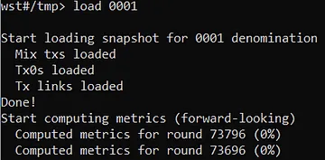
ローディングプロセスが行われるのを待ちます。数分かかる場合があります。データをロードした後、スコアコマンドに続けてTXID（トランザクション識別子）を入力し、そのAnon Setsを取得します：

> score TXID
>
> トランザクションの識別子でTXIDを置き換えてください。

WSTは、まず過去を振り返る指標（後方指標）のスコアを表示し、その後に将来を見据えた指標（前方指標）のスコアを表示します。Anon Setsのスコアに加えて、WSTはあなたの出力の匿名セット内での拡散率も提供します。

あなたのUTXOの将来を見据えたスコアは、最後のミックスではなく、最初のミックスのTXIDに基づいて計算されることに注意してください。逆に、UTXOの過去を振り返るスコアは、最後のサイクルのTXIDに基づいて計算されます。

もしAnon Setsのこれらの概念が理解できない場合は、Coinjoinについて私が詳細に図解を交えて説明している私の記事のこの部分を読むことをお勧めします：[https://www.pandul.fr/post/comprendre-et-utiliser-le-coinjoin-sur-bitcoin#:~:text=perdre%20en%20confidentialit%C3%A9.-,Anon%20Sets.,-Comme%20expliqu%C3%A9%20pr%C3%A9c%C3%A9demment](https://www.pandul.fr/post/comprendre-et-utiliser-le-coinjoin-sur-bitcoin#:~:text=perdre%20en%20confidentialit%C3%A9.-,Anon%20Sets.,-Comme%20expliqu%C3%A9%20pr%C3%A9c%C3%A9demment)

### Boltzmann計算機の使用

Boltzmann計算機は、ビットコイン取引のさまざまな高度な指標を簡単に計算できるツールであり、その中にはエントロピーのレベルも含まれます。これらのデータはすべて、取引のプライバシーレベルを定量化し、潜在的なエラーを検出するのに役立ちます。このツールは、あなたのRoninDojoノードにプリインストールされています。

RoninCLIからアクセスするには、SSH経由で接続し、次のメニューに進みます：

> Samourai Toolkit > Boltzmann Calculator

RoninDojoでの使用方法を説明する前に、これらの指標が何を表し、どのように計算され、何に使用されるのかを説明します。

これらの指標は任意のビットコイン取引に使用できますが、特にCoinjoin取引の品質を研究するのに興味深いものです。

1. このソフトウェアによって計算される最初の指標は、可能な組み合わせの数です。計算機上では「nb combinations」と記されています。UTXOsの値を考慮すると、この指標は入力から出力への可能なマッピングの数を表します。

> 「UTXO」という用語に馴染みがない場合は、この短い記事を読むことをお勧めします：ビットコイン取引のメカニズム：UTXO、入力、および出力。

言い換えれば、この指標は特定の取引に対する可能な解釈の数を表します。例えば、Whirlpool 5x5 Coinjoin構造は、可能な組み合わせの数が1496に等しいです：

クレジット：https://kycp.org/#/fe5e5abab7ea452f87603f7ebc2fa4e77380eafcc927e1cb51e1a72401ab073d

2. 計算される2番目の指標は、取引のエントロピーです。取引の可能な組み合わせの数が非常に高い場合、代わりにエントロピーを使用することができます。エントロピーは、可能な組み合わせの数の二進対数を表します。その公式は以下の通りです：

- E: 取引のエントロピー。
- C: 取引の可能な組み合わせの数。

> E = log2(C)
数学において、二進対数（底が2）は2のべき乗の逆関数です。言い換えると、xの二進対数は、値xを得るために数2を何乗しなければならないかを示します。
したがって：

> E = log2(C)
> C = 2^E

この指標はビットで表されます。例えば、ここにWhirlpool 5x5 Coinjoinトランザクションのエントロピーの計算があります。可能な組み合わせの数は以前に1496と言及されました：

> C = 1496
>
> E = log2(1496)
>
> E = 10.5469 ビット

したがって、このCoinjoinトランザクションのエントロピーは10.5469ビットであり、これは非常に良いです。

この指標が高いほど、トランザクションの異なる解釈が多くなり、その結果、トランザクションの機密性が高まります。

別の例を見てみましょう。ここに1つの入力と2つの出力を持つ「クラシック」トランザクションがあります：

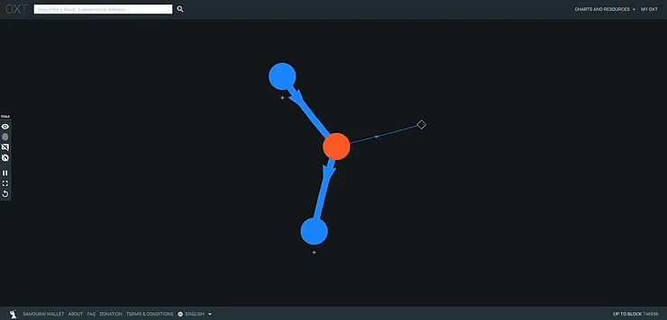

クレジット：https://oxt.me/graph/transaction/tiid/9815286

このトランザクションには1つの可能な解釈しかありません：

> [(inp 0) > (Outp 0 ; Outp 1)]

したがって、そのエントロピーは0に等しくなります：

> C = 1
>
> E = log2(C)
>
> E = 0

3. Boltzmann計算機によって返される3つ目の指標は、「Wallet Efficiency」と呼ばれるTxの効率です。この指標は単純に、入力トランザクションを同じ構成の最適なトランザクションと比較することを可能にします。

これから、与えられたトランザクション構造に対して達成可能な最高のエントロピーを表す最大エントロピーの概念を紹介します。例えば、Whirlpool 5x5 Coinjoin構造は最大エントロピーが10.5469になります。効率指標はこの最大エントロピーと入力トランザクションの実際のエントロピーを比較します。その式は以下の通りです：

- ER: 実際のエントロピー（ビット単位）。
- EM: 同じ構造での最大エントロピー（ビット単位）。
- Ef: 効率（ビット単位）。

> Ef = ER - EM
>
> Ef = 10.5469 - 10.5469
>
> Ef = 0 ビット

この指標はパーセンテージでも表されるため、式は以下のようになります：

- CR: 実際の可能な組み合わせの数。
- CM: 同じ構造での最大の可能な組み合わせの数。
- Ef: 効率（パーセンテージとして）。

> Ef = CR/CM
>
> Ef = 1496/1496
>
> Ef = 100%

効率が100%であるということは、このトランザクションがその構造に関して可能な最高のプライバシーを持っていることを意味します。

4. 計算される4つ目の指標はエントロピー密度です。これにより、各入力または出力に対するエントロピーを関連付けることができます。この指標は、異なるサイズのトランザクション間の効率を比較するために使用できます。

その計算は非常にシンプルです：トランザクションのエントロピーを存在する入力と出力の総数で割ります。例えば、Whirlpool 5x5 Coinjoinの場合は以下のようになります：

    ED: エントロピー密度（ビット単位）。
    E: トランザクションのエントロピー（ビット単位）。
    T: トランザクションの入力と出力の総数。

T = 5 + 5 = 10
ED = E / T
ED = 10.5469 / 10
ED = 1.054 ビット
Boltzmann計算機によって提供される5番目の情報は、入力と出力の間のリンクの確率表です。この表は単に、特定の入力が特定の出力に対応する確率（Boltzmannスコア）を示しています。

例えば、Whirlpool Coinjoinの例を取ると、確率表は以下のようになります：

| 入力 | 出力0 | 出力1 | 出力2 | 出力3 | 出力4 |
| ---- | ----- | ----- | ----- | ----- | ----- |
| 0    | 34%   | 34%   | 34%   | 34%   | 34%   |
| 1    | 34%   | 34%   | 34%   | 34%   | 34%   |
| 2    | 34%   | 34%   | 34%   | 34%   | 34%   |
| 3    | 34%   | 34%   | 34%   | 34%   | 34%   |
| 4    | 34%   | 34%   | 34%   | 34%   | 34%   |

ここで、各入力が各出力にリンクされる確率が等しいことがわかります。

しかし、1つの入力と2つの出力を持つトランザクションの例を取ると、以下のようになります：

| 入力 | 出力0 | 出力1 |
| ---- | ----- | ----- |
| 0    | 100%  | 100%  |

この例では、出力が入力0から来る確率が100%であることがわかります。

この確率が低いほど、機密性のレベルが高くなります。

6. 計算される6番目の情報は、決定論的リンクの数です。決定論的リンクの比率も提供されます。この指標は、特定のトランザクションの入力と出力の間に100%の確率で存在するリンクの数、つまり否定できないリンクの数を強調します。

比率は、トランザクション内の決定論的リンクの数をリンクの総数と比較して示します。

例えば、Coinjoin Whirlpoolトランザクションには、入力と出力の間に決定論的リンクはありません。指標はゼロであり、比率も0%になります。

しかし、2番目に研究したトランザクション（1入力と2出力）では、指標は2であり、比率は100%です。

したがって、この指標がゼロであれば、良好な機密性を示します。

これらの指標を研究したので、このソフトウェアを使用してそれらを計算する方法を見てみましょう。RoninCLIから、メニューに進みます：

> Samourai Toolkit > Boltzmann Calculator

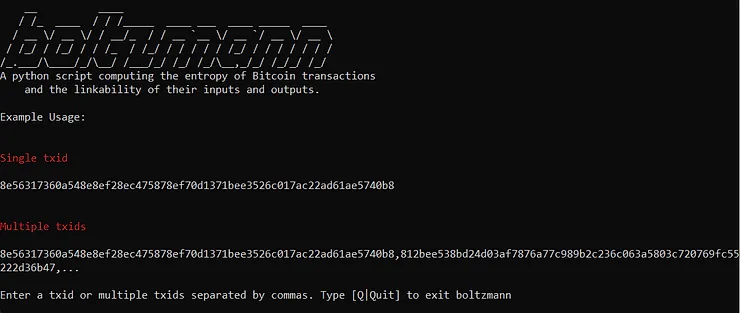

ソフトウェアを起動したら、研究したいトランザクションIDを入力します。カンマで区切って一度に複数のトランザクションを入力することができます。その後、エンターキーを押します：

計算機は、これまでに見てきたすべての指標を返します：

ソフトウェアを終了してRoninCLIメニューに戻るには、「Quit」というコマンドを入力します。

Boltzmann計算機についてもっと学ぶには、これらの記事を読むことをお勧めします：

- https://medium.com/@laurentmt/introducing-boltzmann-85930984a159

- https://gist.github.com/LaurentMT/e758767ca4038ac40aaf

### Bisqの接続。
Bisqは、ビットコインの売買ができるピアツーピアの交換プラットフォームです。Tor上で動作するデスクトップソフトウェアを使用し、身元を明かさずにビットコインの交換が可能です。Bisqは2/2のマルチシグネチャシステムを通じてピアツーピアの交換を保護します。自分のRoninDojoノードをこのソフトウェアと共に使用することで、交換のプライバシーを最適化し、自分のノードのブロックチェーンからのデータを信頼することができます。

Bisqソフトウェアをダウンロードするには、公式ウェブサイトにアクセスしてください：https://bisq.network/

ソフトウェアの使い始めには、このページを読むことをお勧めします：https://bisq.network/getting-started/

RoninDojoから接続リンクを取得するには、SSH経由でRoninCLIに接続する必要があります。次にメニューに進みます：

> Applications > Manage Applications

パスワードを入力し、スペースキーでボックスをチェックします：

> [ ] Enable Bisq Connection

選択を確認します。ノードのインストールを待ち、次からTor V3アドレスを取得します：

> Credentials > Bitcoind

"Bitcoin Daemon"の下にあるアドレスをコピーします。

RoninUIインターフェースからも、"Dashboard"の"Bitcoin Core"ボックス内の"Manage"をクリックするだけで、Bitcoind Tor V3アドレスを取得できます：

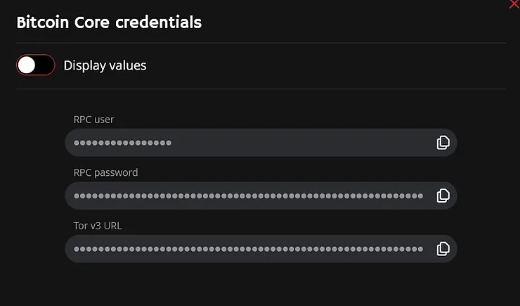

Bisqからノードに接続するには、メニューに進みます：

> Settings > Network Info

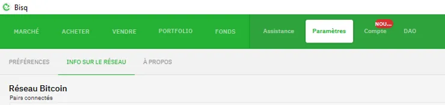

"Use custom Bitcoin Core nodes"のバブルをクリックします。その後、指定されたボックスに".onion"はあるが"http://"はない形で、Bitcoin TorV3アドレスを入力します。

Bisqソフトウェアを再起動します。これで、あなたのノードはBisqに接続されました。

### その他の機能

あなたのRoninDojoノードには、他にも基本的な機能が含まれています。特定の情報をスキャンして、それが考慮されていることを確認する能力があります。

例えば、RoninDojoに接続されたあなたのウォレットが、あなたに属するビットコインを見つけられないことがあります。残高が0であるにもかかわらず、このウォレットにビットコインがあることは確かです。考慮すべき多くの可能性があり、導出パスのエラーを含む中で、ノードがあなたのアドレスを監視していない可能性もあります。

これを修正するには、ノードがあなたのxpubを追跡しているかどうかを"xpub tool"で確認できます。RoninUIからアクセスするには、メニューに進みます：

> Maintenance > XPUB Tool

問題のあるxpubを入力し、「Check」をクリックしてこの情報を確認します。

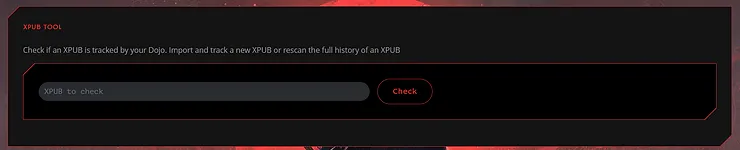

あなたのxpubがノードによって追跡されている場合、これが表示されます：

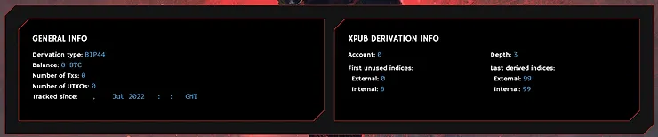

すべてのトランザクションが正しく表示されているか確認します。また、導出タイプがあなたのウォレットのものと一致しているかも確認してください。ここでは、このxpubがBIP44導出としてノードに解釈されていることがわかります。この導出タイプがあなたのウォレットのものと一致しない場合は、「Retype」ボタンをクリックし、BIP44/BIP49/BIP84から選択してください：

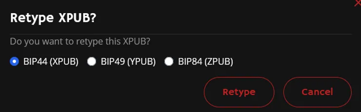

あなたのxpubがノードによって追跡されていない場合、それをインポートするように招待するこの画面が表示されます：

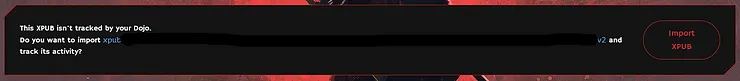
他のメンテナンスツールも使用できます：
- トランザクションツール：特定のトランザクションの詳細を観察することができます。
- アドレスツール：特定のアドレスがあなたのDojoによって追跡されていることを確認できます。
- ブロックの再スキャン：選択した範囲のブロックをノードに再スキャンさせます。

RoninUIには「Push Tx」ツールも見つかります。これにより、署名されたトランザクションをBitcoinネットワークにブロードキャストできます。これは16進数形式で入力する必要があります：

## 結論

RoninDojoをインストールして使い始める方法を見てきました。これは自分自身のBitcoinノードを運用するための素晴らしい選択肢です。Bitcoinerにとって不可欠なツールを統合し、最新の状態に保つ安定したソリューションです。

ターミナルの使用に抵抗がなく、Lightning Networkに関連するツールが必要ない場合、RoninDojoはあなたに魅力的に映るかもしれません。

可能であれば、これらのオープンソースソフトウェアを無料で提供している開発者に寄付を検討してください：https://donate.ronindojo.io/

RoninDojoについてもっと知りたい場合は、以下の外部リソースのリンクをチェックすることをお勧めします。

### さらなる読み物：

- Bitcoin上でCoinJoinを理解し、使用する。
- ハッシュ関数 - 電子書籍Bitcoin Démocratisé 1からの抜粋。
- Bitcoinパスフレーズについて知るべきすべてのこと。

### 外部リソース：

- https://samouraiwallet.com/dojo
- https://ronindojo.io/index.html
- https://wiki.ronindojo.io/en/home
- https://code.samourai.io/ronindojo/RoninDojo
- https://gist.github.com/LaurentMT/e758767ca4038ac40aaf
- https://medium.com/@laurentmt/boltzmannを紹介します-85930984a159
- https://oxt.me/
- https://kycp.org/#/
- https://en.wikipedia.org/wiki/Boltzmann_formula
- https://wiki.ronindojo.io/en/setup/bisq
- https://bisq.network/