Executar e usar seu próprio nó é essencial para realmente participar da rede Bitcoin. Embora executar um nó Bitcoin não traga nenhum benefício financeiro ao usuário, ele permite preservar sua privacidade, agir de forma independente e controlar sua confiança na rede.

Neste artigo, vamos analisar em detalhes o RoninDojo, uma ótima solução para executar seu próprio nó Bitcoin.

### Sumário:

- O que é o RoninDojo?
- Qual hardware escolher?
- Como instalar o RoninDojo?
- Como usar o RoninDojo?
- Conclusão

Se você não está familiarizado com o funcionamento e o papel de um nó Bitcoin, recomendo começar lendo este artigo: O nó Bitcoin - Parte 1/2: Conceitos técnicos.

## O que é o RoninDojo?

Dojo é um servidor de nó Bitcoin completo desenvolvido pela equipe da Samouraï Wallet. Você pode instalá-lo livremente em qualquer máquina.

RoninDojo é um assistente de instalação e uma ferramenta de administração para o Dojo e várias outras ferramentas. O RoninDojo utiliza a implementação original do Dojo e adiciona muitas outras ferramentas, facilitando sua instalação e gerenciamento.

Eles também oferecem um hardware "plug-and-play", o RoninDojo Tanto, com o RoninDojo pré-instalado em uma máquina montada por sua equipe. O Tanto é uma solução paga, interessante para aqueles que não querem se envolver com a configuração.

O código do RoninDojo é de código aberto, então também é possível instalar essa solução em seu próprio hardware. Essa opção é econômica, mas requer um pouco mais de manipulação, é o que faremos neste artigo.

RoninDojo é um Dojo, portanto, permite integrar facilmente o Whirlpool CLI ao seu nó Bitcoin para ter a melhor experiência possível de CoinJoin. Com o Whirlpool CLI, você não só pode deixar seus bitcoins se misturarem 24 horas por dia, 7 dias por semana, sem precisar deixar seu computador ligado, mas também pode melhorar significativamente sua privacidade.

RoninDojo possui muitas outras ferramentas que se baseiam em seu Dojo, como o calculador Boltzmann, que permite determinar o grau de privacidade de uma transação, o servidor Electrum para conectar suas diferentes carteiras Bitcoin ao seu nó ou o servidor Mempool para observar suas transações de forma privada.
Comparação com outra solução de nó como o Umbrel, que apresentei a você neste artigo, o RoninDojo se enquadra em uma linha de desenvolvimento profundamente voltada para soluções "On Chain" e ferramentas que otimizam a privacidade dos usuários. Portanto, o RoninDojo não permite interagir com a Lightning Network.
O RoninDojo oferece menos ferramentas em comparação com o Umbrel, mas as poucas funcionalidades essenciais para um Bitcoiner presentes no Ronin são incrivelmente estáveis.

Portanto, se você não precisa de todas as funcionalidades de um servidor Umbrel e deseja apenas ter um nó simples e estável com algumas ferramentas essenciais como Whirlpool ou Mempool, então o RoninDojo é provavelmente uma boa solução para você.

Na minha opinião, a linha de desenvolvimento do Umbrel está muito voltada para a Lightning Network e ferramentas versáteis. Ainda é um nó Bitcoin, mas estamos tentando transformá-lo em um mini-servidor multitarefa. Por outro lado, a linha de desenvolvimento do RoninDojo se aproxima mais da linha das equipes do Samourai Wallet e se concentra nas ferramentas essenciais de um Bitcoiner, permitindo total independência e gerenciamento otimizado da privacidade no Bitcoin.

Observe que configurar um nó RoninDojo é um pouco mais complexo do que um nó Umbrel.

Agora que conseguimos traçar o perfil do RoninDojo, vamos ver juntos como configurar esse nó.

## Qual hardware escolher?

Para escolher a máquina que hospeda e executa o RoninDojo, você tem várias opções.

Como explicado anteriormente, a opção mais simples será encomendar o Tanto, uma máquina plug-and-play projetada especificamente para esse fim. Para encomendar o seu, vá para: https://shop.ronindojo.io/product-category/nodes/.

Como as equipes do RoninDojo produzem código aberto, também é possível implementar o RoninDojo em outras máquinas. Você pode encontrar as versões mais recentes do assistente de instalação nesta página: https://ronindojo.io/en/downloads.html e as versões mais recentes do código nesta página: https://code.samourai.io/ronindojo/RoninDojo.

Pessoalmente, instalei no Raspberry Pi 4 8GB e tudo funciona perfeitamente.

No entanto, as equipes do RoninDojo nos informam que geralmente há problemas devido ao gabinete e ao adaptador SSD. Portanto, é desaconselhável usar um gabinete com um cabo para o SSD de sua máquina. É melhor usar um cartão de expansão de armazenamento especialmente projetado para sua placa-mãe, como este: Cartão de expansão de armazenamento Raspberry Pi 4.

Aqui está um exemplo de configuração para criar seu próprio nó RoninDojo:

- Um Raspberry Pi 4.
- Um gabinete com um ventilador.
- Um cartão de expansão de armazenamento compatível.
- Um cabo de alimentação.
- Um micro SD industrial de 16GB ou mais.
- Um SSD de 1TB ou mais.
- Um cabo ethernet RJ45, categoria 8 recomendada.

## Como instalar o RoninDojo?

### Passo 1: Preparar o micro SD bootável.

Depois de montar sua máquina, você pode começar a instalar o RoninDojo. Para fazer isso, comece criando um micro SD bootável gravando a imagem de disco adequada nele.

Insira seu cartão micro SD no seu computador pessoal e vá para o site oficial do RoninDojo para baixar a imagem de disco do RoninOS: https://ronindojo.io/en/downloads.html.

Baixe a imagem de disco que corresponda ao seu hardware. No meu caso, baixei a imagem "MANJARO-ARM-RONINOS-RPI4-22.03.IMG.XZ":

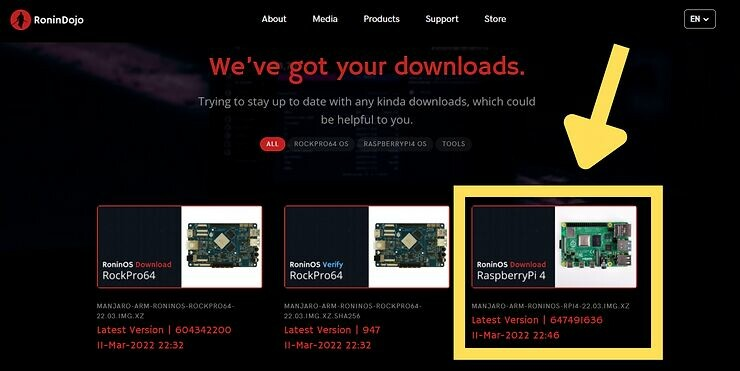

Depois de baixar a imagem, verifique sua integridade usando o arquivo .SHA256 correspondente. Descrevo em detalhes como fazer isso neste artigo: Como verificar a integridade de um software Bitcoin no Windows?

As instruções específicas para verificar a integridade do RoninOS também estão disponíveis nesta página em inglês: https://wiki.ronindojo.io/en/extras/verify.

Para gravar essa imagem no seu micro SD, você pode usar um software como o Balena Etcher, que pode ser baixado aqui: https://www.balena.io/etcher/.

Para fazer isso, selecione a imagem no Etcher e grave-a no micro SD:

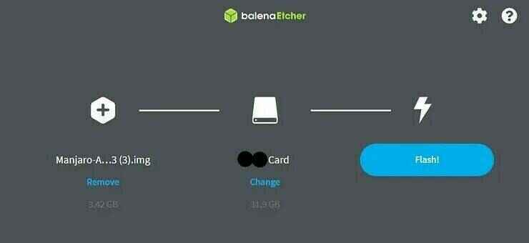

Depois que a operação estiver concluída, você pode inserir o micro SD bootável no Raspberry Pi e ligar a máquina.

### Passo 2: Configurar o RoninOS.

RoninOS é o sistema operacional do seu nó RoninDojo, é uma versão modificada do Manjaro, uma distribuição Linux. Depois de iniciar sua máquina e esperar alguns minutos, você poderá começar a configurá-la.

Para se conectar remotamente, você precisará encontrar o endereço IP da sua máquina RoninDojo. Para fazer isso, você pode, por exemplo, acessar o painel de administração do seu roteador, ou também pode baixar um software como o https://angryip.org/ para escanear sua rede local e encontrar o IP da máquina.

Depois de encontrar o IP, você poderá acessar sua máquina de outro computador conectado à mesma rede local usando SSH.

Em um computador com MacOS ou Linux, basta abrir o terminal. Em um computador com Windows, você pode usar uma ferramenta especializada como o Putty ou o próprio Windows PowerShell.

Depois de abrir o terminal, digite o seguinte comando:

> ssh root@192.168.?.?

Substitua os dois pontos de interrogação pelo IP do seu RoninDojo encontrado anteriormente.
Dica: Em um Shell, clique com o botão direito para colar um elemento.

Em seguida, você será direcionado para o painel de configuração do Manjaro. Escolha a configuração correta do seu teclado usando as setas para mudar o alvo na lista suspensa.

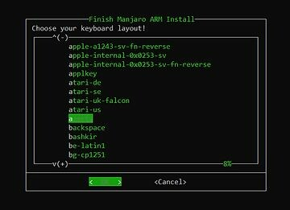

Escolha um nome de usuário e uma senha para a sua sessão. Use uma senha forte e faça um backup seguro dela. Você pode usar uma senha mais fraca durante a instalação e, em seguida, facilmente alterar essa senha usando a opção de "copiar e colar" no RoninUI. Isso permitirá que você use uma senha muito forte sem ter que gastar muito tempo digitando manualmente durante a configuração do Manjaro.

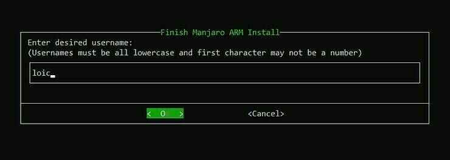

Em seguida, você também será solicitado a escolher uma senha root. Para a senha root, insira diretamente uma senha forte. Você não terá a opção de alterá-la posteriormente no RoninUI. Certifique-se também de fazer um backup seguro dessa senha root.

Em seguida, insira sua localização e fuso horário.

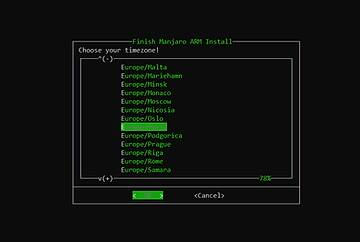

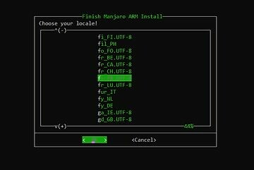

Em seguida, escolha um nome de host.

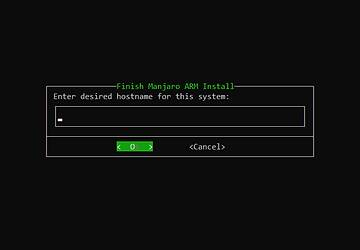

Por fim, verifique as informações de configuração do Manjaro e confirme.

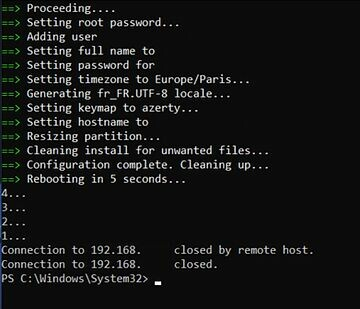

### Etapa 3: Baixar o RoninDojo.

A configuração inicial do RoninOS será feita. Assim que estiver concluída, como mostrado na captura de tela acima, a máquina será reiniciada. Aguarde alguns instantes e, em seguida, digite o seguinte comando para se conectar novamente à sua máquina RoninDojo:

> ssh pseudo@192.168.?.?

Substitua "pseudo" pelo nome de usuário que você escolheu anteriormente e substitua os pontos de interrogação pelo IP do seu RoninDojo.

Em seguida, insira sua senha de usuário.

No terminal, será assim:

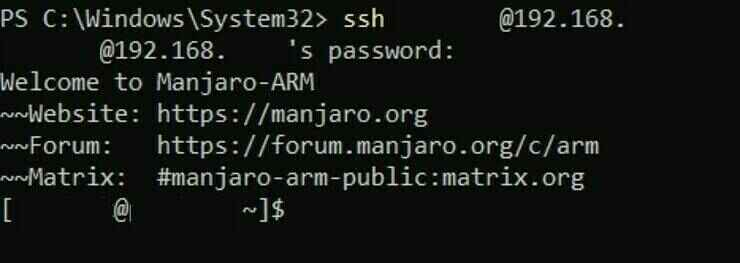

Agora você está conectado à sua máquina que possui apenas o RoninOS no momento. Agora você precisa instalar o RoninDojo.

Baixe a versão mais recente do RoninDojo digitando o seguinte comando:

> git clone https://code.samourai.io/ronindojo/RoninDojo

O download será rápido. No terminal, você verá o seguinte:

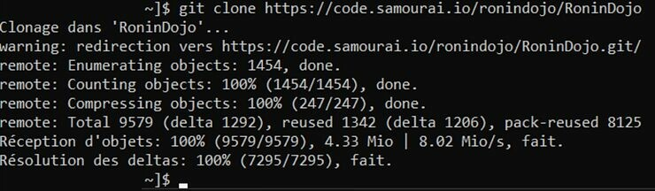

Aguarde o término do download e, em seguida, instale e acesse a interface do usuário do RoninDojo usando o seguinte comando:

> ~/RoninDojo/ronin

Você será solicitado a inserir sua senha de usuário:

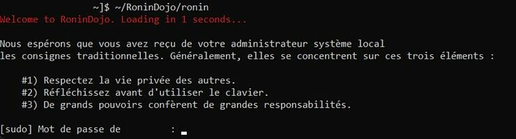
Esta instrução é necessária apenas na primeira vez que você acessa o seu RoninDojo. Depois, para acessar o RoninCLI via SSH, você só precisa digitar o comando [SSH pseudo@192.168.?.?], substituindo "pseudo" pelo seu nome de usuário e colocando o IP do seu nó. Será solicitada a sua senha de usuário.

Em seguida, você verá esta bela animação:

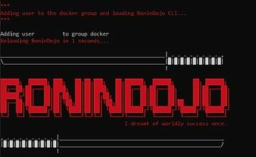

Então você finalmente chegará à interface de usuário CLI do RoninDojo.

### Passo 4: Instalar o RoninDojo.

No menu principal, vá para o menu "System" usando as setas do seu teclado. Use a tecla Enter para confirmar sua escolha.

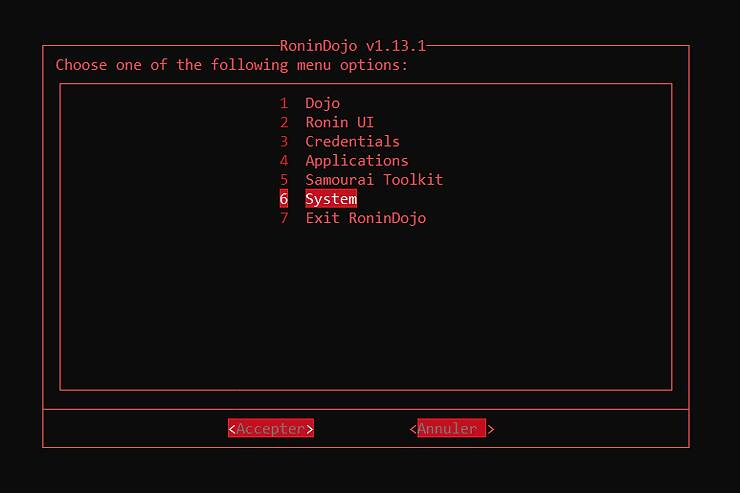

Em seguida, vá para o menu "System Setup & Install".

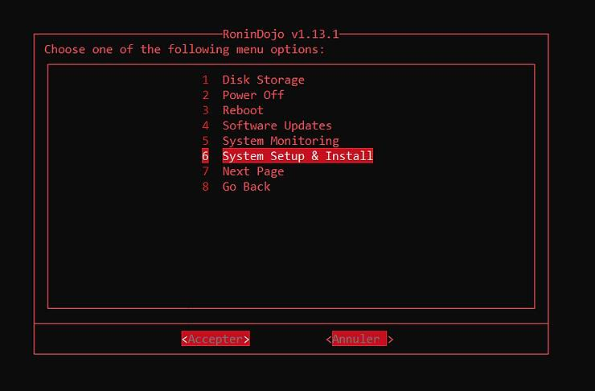

Por fim, marque "System Setup" e "Install RoninDojo" usando a barra de espaço e selecione "Aceitar" para iniciar a instalação.

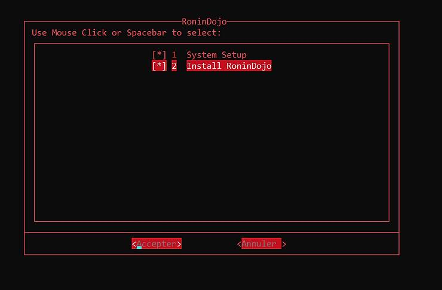

Deixe a instalação prosseguir tranquilamente. No meu caso, levou cerca de 2 horas. Mantenha o seu terminal aberto durante a operação.

Verifique ocasionalmente o seu terminal, pois será solicitado que você pressione uma tecla em determinadas etapas da instalação, como aqui, por exemplo:

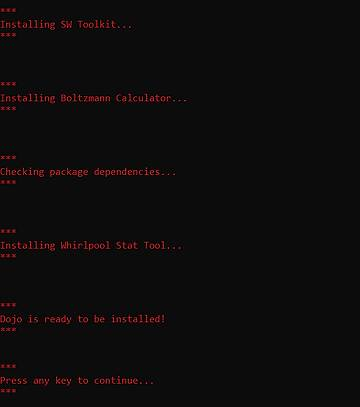

No final da instalação, você verá os diferentes contêineres iniciando:

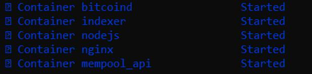

Em seguida, o seu nó será reiniciado. Conecte-se novamente ao RoninCLI para a próxima etapa.

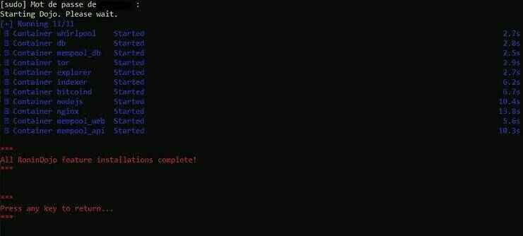

### Passo 5: Baixar a cadeia de prova de trabalho e acessar o RoninUI.

Após a conclusão da instalação, o seu nó começará a baixar a cadeia de prova de trabalho do Bitcoin. Isso é chamado de IBD (Initial Block Download). Isso geralmente leva de 2 a 14 dias, dependendo da sua conexão com a internet e do seu dispositivo.

Você pode acompanhar o progresso do download da cadeia acessando a interface web do RoninUI.

Para acessá-lo a partir de uma rede local, digite o seguinte em seu navegador na barra de endereços:

- Ou diretamente o endereço IP da sua máquina (192.168.?.?)

- Ou: ronindojo.local

Lembre-se de desativar sua VPN, se estiver usando uma.

### Possível complicação

Se você não conseguir se conectar ao RoninUI pelo seu navegador, verifique se o aplicativo está funcionando corretamente a partir do seu Terminal conectado ao seu nó via SSH. Conecte-se ao menu principal seguindo as etapas anteriores:

- Digite: SSH pseudo@192.168.?.?, substituindo com suas credenciais.

- Insira sua senha de usuário.

Depois de acessar o menu principal, vá para:

> RoninUI > Reiniciar

Se o aplicativo reiniciar corretamente, o problema está na conexão do seu navegador. Verifique se você não está usando uma VPN e verifique se está conectado à mesma rede que o seu nó.

Se a reinicialização retornar um erro, tente atualizar o sistema operacional e reinstalar o RoninUI. Para atualizar o sistema operacional:

> Sistema > Atualizações de Software > Atualizar Sistema Operacional

Após a atualização e reinicialização concluídas, reconecte-se ao seu nó via SSH e reinstale o RoninUI:

> RoninUI > Reinstalar

Após o novo download do RoninUI, tente se conectar ao RoninUI pelo seu navegador.

> Dica: Se você sair do RoninCLI acidentalmente e acabar no terminal Manjaro, basta digitar o comando "ronin" para voltar diretamente ao menu principal do RoninCLI.

### Login na web

Você também pode se conectar à interface web do RoninUI de qualquer rede usando o Tor. Para fazer isso, obtenha o endereço Tor do seu RoninUI no RoninCLI:

> Credenciais > Ronin UI

Obtenha o endereço Tor terminando em .onion e faça login no Ronin UI inserindo esse endereço no seu navegador Tor. Tenha cuidado para não vazar suas credenciais, pois são informações sensíveis.

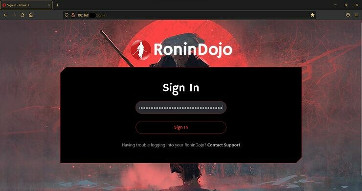

Depois de fazer login, será solicitada a sua senha de usuário. É a mesma que você usa para fazer login via SSH.

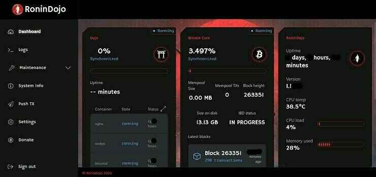

Podemos ver o progresso do IBD. Tenha paciência, você está recuperando todas as transações feitas no Bitcoin desde 3 de janeiro de 2009.

Após baixar toda a cadeia de blocos, o indexador compactará o banco de dados. Essa operação leva cerca de 12 horas. Você também pode acompanhar o progresso em "Indexer" no RoninUI.

Seu nó RoninDojo estará completamente funcional após isso:

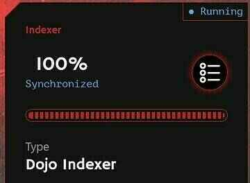

Se você deseja alterar a senha do usuário para uma mais forte, pode fazer isso agora na guia "Configurações". No RoninDojo, não há camada de segurança adicional, então recomendo que você escolha uma senha realmente forte e cuide bem de sua cópia de segurança.

## Como usar o RoninDojo?

Depois de baixar e compactar a cadeia, você poderá começar a aproveitar os serviços oferecidos pelo seu novo nó RoninDojo. Vamos ver juntos como usá-los.

### Conectar seus softwares de carteira ao electrs.

A primeira utilidade do seu nó recém-instalado e sincronizado será transmitir suas transações para a rede Bitcoin. Portanto, você provavelmente vai querer conectar seus diferentes softwares de gerenciamento de carteiras a ele.

Você pode fazer isso usando o Electrum Rust Server (electrs). O aplicativo normalmente já está pré-instalado no seu nó RoninDojo. Se não estiver, você pode instalá-lo manualmente pela interface RoninCLI.

Basta ir em:

> Aplicativos > Gerenciar Aplicativos > Instalar Servidor Electrum

Para obter o endereço Tor do seu Servidor Electrum, a partir do menu RoninCLI, vá em:

> Credenciais > Electrs

Então, basta inserir o link .onion no seu software de carteira. Por exemplo, no Sparrow Wallet, basta ir na aba:

> Arquivo > Preferências > Servidor

No tipo de servidor, selecione "Private Electrum" e insira o endereço Tor do seu Servidor Electrum no campo correspondente. Por fim, clique em "Testar Conexão" para testar e salvar sua conexão.

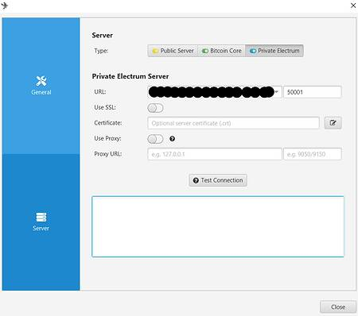

### Conectando seus softwares de carteiras ao Samourai Dojo.

Em vez de usar o Electrs, você também pode usar o Samourai Dojo para conectar sua carteira de software compatível ao seu nó RoninDojo. Por exemplo, o Samourai Wallet oferece essa opção.

Para fazer isso, basta escanear o código QR de conexão do seu Dojo. Para acessá-lo a partir do RoninUI, clique na aba "Dashboard" e depois no botão "Gerenciar" no bloco do seu Dojo. Em seguida, você poderá ver os códigos QR de conexão do seu Dojo e do BTC-RPC Explorer. Para exibi-los, clique em "Exibir valores".

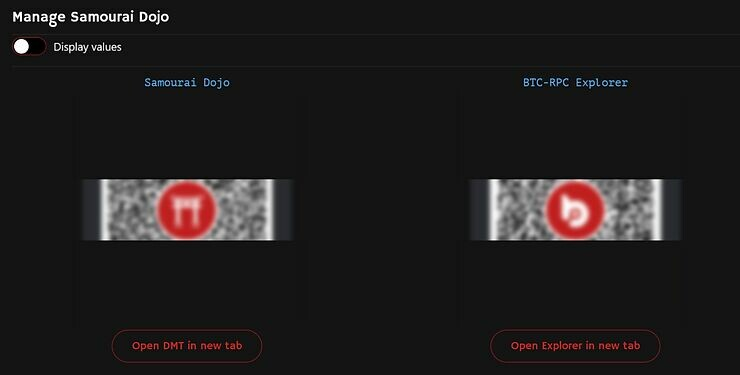

Para conectar sua carteira Samourai Wallet ao seu Dojo, você precisará escanear esse código QR durante a instalação do aplicativo:

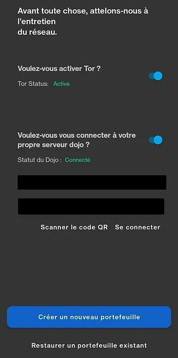

### Usando seu próprio Explorer Mempool.

Ferramenta essencial para os usuários de Bitcoin, o explorer permite verificar várias informações sobre a cadeia do Bitcoin. Com o Mempool, por exemplo, você pode verificar em tempo real as taxas aplicadas por outros usuários para ajustar as suas da melhor forma possível. Você também pode verificar o status de confirmação de uma de suas transações ou verificar o saldo de um endereço.

Essas ferramentas de explorer podem expor você a riscos de perda de privacidade e exigem que você confie no banco de dados de terceiros. Quando você usa essa ferramenta online sem passar pelo seu próprio nó:

- Você corre o risco de vazar informações sobre sua carteira.

- Você confia no gerenciador do site para a cadeia de prova de trabalho que ele hospeda.

Para evitar esses riscos, você pode usar sua própria instância do Mempool em seu nó através da rede Tor. Com essa solução, você não apenas preserva sua privacidade ao usar o serviço, mas também não precisa mais confiar em um provedor, pois consulta seu próprio banco de dados.

Para fazer isso, comece instalando o Mempool Space Visualizer a partir do RoninCLI:

> Aplicativos > Gerenciar aplicativos > Instalar Mempool Space Visualizer

Depois de instalado, obtenha o link para o seu Mempool. O endereço Tor permitirá que você acesse de qualquer rede. Da mesma forma, obtemos esse link através do RoninCLI:

> Credenciais > Mempool

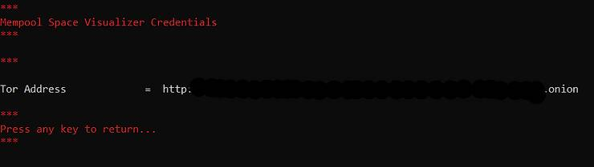

Basta inserir seu endereço Mempool Tor no navegador Tor para aproveitar sua própria instância do Mempool, com base em seus próprios dados. Sugiro adicionar esse endereço Tor aos seus favoritos para acessá-lo mais rapidamente. Você também pode criar um atalho na sua área de trabalho.

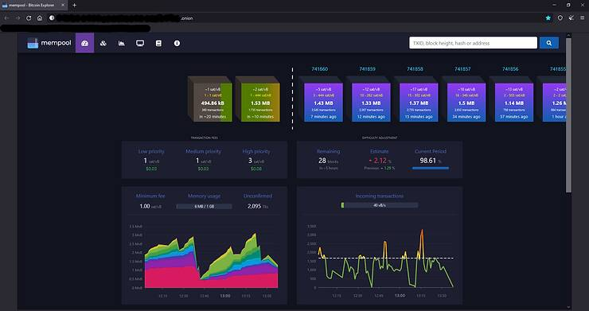

Se você ainda não tem o navegador Tor, pode baixá-lo aqui: https://www.torproject.org/download/

Você também pode acessá-lo pelo seu smartphone instalando o Tor Browser e inserindo o mesmo endereço. De qualquer lugar, você poderá verificar o estado da cadeia Bitcoin usando seu próprio nó.

### Usando o Whirlpool CLI.

Seu nó RoninDojo também inclui o WhirlpoolCLI, uma interface de linha de comando remota para automatizar as misturas do Whirlpool.

Quando você realiza um CoinJoin com a implementação do Whirlpool, o aplicativo que você está usando deve permanecer aberto para poder executar misturas e remixes. Esse processo pode ser tedioso para o usuário que deseja ter conjuntos anônimos elevados, pois o dispositivo que hospeda o aplicativo com o Whirlpool deve permanecer ligado o tempo todo. Em termos concretos, isso significa que se você deseja envolver suas UTXO em remixes 24 horas por dia, 7 dias por semana, precisará deixar seu computador pessoal ou telefone ligado o tempo todo com o aplicativo aberto.

Uma solução para essa restrição é usar o WhirlpoolCLI em uma máquina destinada a ficar ligada o tempo todo, como um nó Bitcoin. Com isso, nossas UTXOs podem ser remixadas 24 horas por dia, 7 dias por semana, sem a necessidade de deixar outra máquina além do nosso nó Bitcoin ligada.
WhirlpoolCLI é usado com o WhirlpoolGUI, uma interface gráfica que deve ser instalada em um computador pessoal para facilitar a gestão de Coinjoins. Explico em detalhes como configurar o Whirlpool CLI com o seu próprio dojo neste artigo: https://www.pandul.fr/post/comprendre-et-utiliser-le-coinjoin-sur-bitcoin#:~:text=dans%20cette%20partie.-,Tutoriel%20%3A%20Whirpool%20CLI%20sur%20Dojo%20et%20Whirlpool%20GUI.,-Si%20vous%20souhaitez
Para saber mais sobre Coinjoin de forma geral, explico tudo neste artigo: https://www.pandul.fr/post/comprendre-et-utiliser-le-coinjoin-sur-bitcoin

### Usando a Ferramenta Whirlpool Stat.

Depois de realizar CoinJoins com o Whirlpool, você pode querer saber concretamente qual é o nível de privacidade das suas UTXOs misturadas. A ferramenta Whirlpool Stat permite que você faça isso facilmente. Com essa ferramenta, você pode calcular a pontuação prospectiva e a pontuação retrospectiva das suas UTXOs misturadas. Para saber mais sobre o cálculo desses Anon Sets e como eles funcionam, recomendo que você leia esta parte: https://www.pandul.fr/post/comprendre-et-utiliser-le-coinjoin-sur-bitcoin#:~:text=perdre%20en%20confidentialit%C3%A9.-,Anon%20Sets.,-Comme%20expliqu%C3%A9%20pr%C3%A9c%C3%A9demment

A ferramenta está pré-instalada no seu RoninDojo. Por enquanto, ela só está disponível no RoninCLI. Para iniciá-la a partir do menu principal, vá para:

> Samourai Toolkit > Whirlpool Stat Tool

As instruções de uso serão exibidas. Depois disso, pressione qualquer tecla para acessar as linhas de comando:

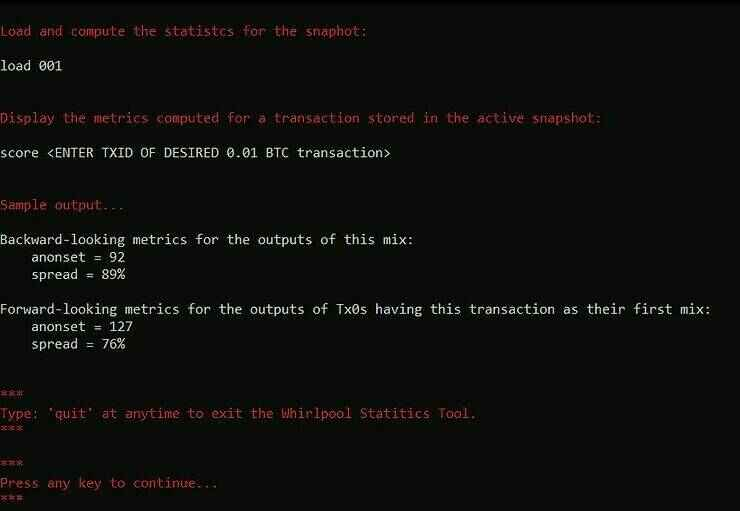

Você verá o terminal sendo exibido:

> wst#/tmp>

Para sair dessa interface e voltar ao menu RoninCLI, basta digitar o comando:

> quit

Para começar, vamos definir o proxy no Tor para poder extrair os dados do OXT com total privacidade. Digite o comando:

> socks5 127.0.0.1:9050

Em seguida, faça o download dos dados do pool que contém a sua transação:

> download 0001
>
> Substitua 0001 pelo código de denominação do pool que você está interessado.

Os códigos de denominação são os seguintes no WST:

- Pool de 0,5 bitcoins: 05

- Pool de 0,05 bitcoins: 005

- Pool de 0,01 bitcoins: 001

- Pool de 0,001 bitcoins: 0001

Depois de baixar os dados, carregue-os com o comando:

> load 0001
>
> Substitua 0001 pelo código de denominação do pool que você está interessado.

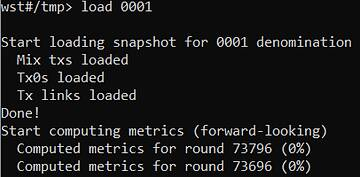

Deixe o carregamento acontecer, isso pode levar alguns minutos. Após carregar os dados, digite o comando score seguido do seu TXID (identificador de transação) para obter seus Anon Sets:

> score TXID
>
> Substitua TXID pelo identificador da sua transação.

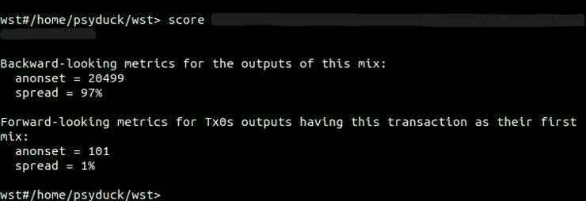

O WST então exibe o score retrospectivo (métricas retrospectivas) e o score prospectivo (métricas prospectivas). Além dos scores dos Anon Sets, o WST também fornece a taxa de difusão da sua saída no pool com base no anon set.

Observe que o score prospectivo da sua UTXO é calculado a partir do TXID da sua mistura inicial, e não do seu último mix. Por outro lado, o score retrospectivo de uma UTXO é calculado a partir do TXID do último ciclo.

Mais uma vez, se você não entender esses conceitos de Anon Sets, recomendo que leia esta parte do meu artigo sobre Coinjoin, onde explico tudo em detalhes com diagramas: https://www.pandul.fr/post/comprendre-et-utiliser-le-coinjoin-sur-bitcoin#:~:text=perdre%20en%20confidentialit%C3%A9.-,Anon%20Sets.,-Comme%20expliqu%C3%A9%20pr%C3%A9c%C3%A9demment

### Usando a calculadora Boltzmann.

A calculadora Boltzmann é uma ferramenta que permite calcular facilmente várias métricas avançadas em uma transação Bitcoin, incluindo seu nível de entropia. Todos esses dados permitirão que você coloque números no nível de confidencialidade de uma transação e detecte possíveis erros. Essa ferramenta está pré-instalada no seu nó RoninDojo.

Para acessá-la a partir do RoninCLI, conecte-se via SSH e vá para o menu:

> Samourai Toolkit > Boltzmann Calculator

Antes de explicar como usá-la no RoninDojo, vou explicar o que essas métricas representam, como são calculadas e para que servem.

Esses indicadores podem ser usados em qualquer transação Bitcoin, mas são particularmente interessantes para estudar a qualidade de uma transação Coinjoin.

1. O primeiro indicador calculado por esse software é o número de combinações possíveis. Ele é mostrado na calculadora como "nb combinations". Com base nos valores das UTXOs, esse indicador representa o número de mapeamentos possíveis das entradas para as saídas.

> Se você não está familiarizado com o termo "UTXO", recomendo que leia este breve artigo: Mecanismo de uma transação Bitcoin: UTXO, inputs e outputs.

Em outras palavras, esse indicador representa o número de interpretações possíveis para uma transação específica. Por exemplo: uma Coinjoin com estrutura Whirlpool 5x5 terá um número de combinações possíveis igual a 1496:

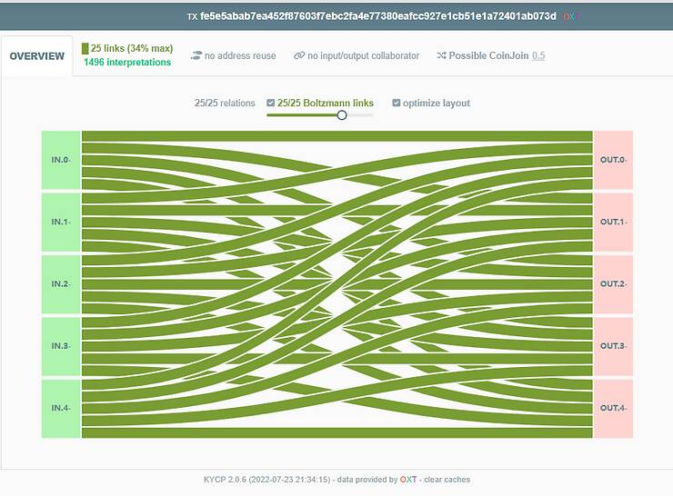

Crédito: https://kycp.org/#/fe5e5abab7ea452f87603f7ebc2fa4e77380eafcc927e1cb51e1a72401ab073d

2. O segundo indicador calculado é a entropia de uma transação ("Entropia"). Dado que o número de combinações possíveis pode ser muito alto para uma transação, pode-se optar por usar a entropia. A entropia representa o logaritmo binário do número de combinações possíveis. Sua fórmula é a seguinte:

- E: entropia da transação.

- C: número de combinações possíveis para a transação.

> E = log2(C)

Em matemática, o logaritmo binário (base 2) é a função inversa da função potência de 2. Em outras palavras, o logaritmo binário de x é a potência à qual o número 2 deve ser elevado para obter o valor x.

Assim:

> E = log2(C)
> C = 2^E

Esse indicador é expresso em bits. Por exemplo, aqui está o cálculo da entropia de uma transação Coinjoin com estrutura Whirlpool 5x5, com o número de combinações possíveis igual a 1496:

> C = 1496
>
> E = log2(1496)
>
> E = 10.5469 bits

Portanto, essa transação Coinjoin tem uma entropia de 10.5469 bits, o que é muito bom.

Quanto maior esse indicador, mais interpretações diferentes da transação existem e, portanto, mais confidencial é a transação.

Vamos dar outro exemplo. Aqui está uma transação "clássica" que tem uma entrada e duas saídas:

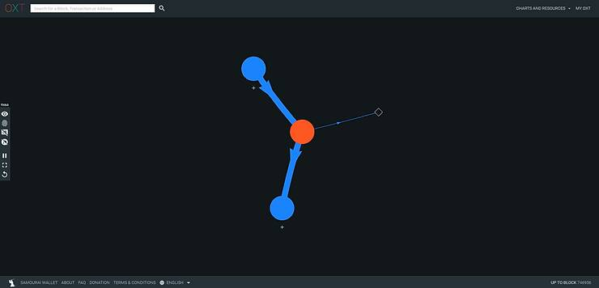

Crédito: https://oxt.me/graph/transaction/tiid/9815286

Essa transação tem apenas uma única interpretação possível:

> [(inp 0) > (Outp 0 ; Outp 1)]

Portanto, sua entropia será igual a 0:

> C = 1
>
> E = log2(C)
>
> E = 0

3. O terceiro indicador fornecido pelo calculador Boltzmann é a eficiência da Tx chamada "Eficiência da Carteira". Esse indicador simplesmente permite comparar a transação de entrada com a melhor transação possível na mesma configuração.

Portanto, vamos introduzir o conceito de entropia máxima, que representa a entropia mais alta alcançável para uma estrutura de transação específica. Por exemplo, a estrutura Coinjoin do tipo Whirlpool 5x5 terá uma entropia máxima igual a 10.5469. O indicador de eficiência compara essa entropia máxima com a entropia real da transação de entrada. Sua fórmula é a seguinte para:

- ER: Entropia real expressa em bits.
- EM: Entropia máxima com a mesma estrutura expressa em bits.
- Ef: Eficiência expressa em bits.

> Ef = ER - EM
>
> Ef = 10.5469 - 10.5469
>
> Ef = 0 bits

Esse indicador também é expresso em porcentagem, então a fórmula é a seguinte para:

- CR: Número de combinações possíveis reais.
- CM: Número de combinações possíveis no máximo com a mesma estrutura.
- Ef: Eficiência expressa em porcentagem.

> Ef = CR/CM
>
> Ef = 1496/1496
>
> Ef = 100%

Portanto, uma eficiência de 100% significa que essa transação tem o máximo de privacidade possível em relação à sua estrutura.

4. O quarto indicador calculado é a densidade de entropia ("Entropy Density"). Isso permite relacionar a entropia a cada entrada ou saída. Assim, podemos usar esse indicador para comparar a eficiência entre várias transações de tamanhos diferentes.

Seu cálculo é muito simples, vamos dividir a entropia da transação pelo número de inputs e outputs presentes nela. Por exemplo, para um Coinjoin do tipo Whirlpool 5x5, teremos:

    ED: Densidade de entropia expressa em bits.
    E: Entropia da transação expressa em bits.
    T: número total de inputs e outputs na transação.

T = 5 + 5 = 10
ED = E / T
ED = 10.5469 / 10
ED = 1.054 bits

A quinta informação fornecida pelo calculador Boltzmann é a tabela de probabilidades de links entre as entradas e saídas. Essa tabela simplesmente fornecerá a probabilidade (pontuação de Boltzmann) de uma entrada específica corresponder a uma saída específica.

Se pegarmos nosso exemplo com um Coinjoin Whirlpool, a tabela de probabilidades será:

| Input | Output 0 | Output 1 | Output 2 | Output 3 | Output 4 |
| ----- | -------- | -------- | -------- | -------- | -------- | --- | --- | --- | --- | --- | --- | --- |
| 0     | 34%      | 34%      | 34%      | 34%      | 34%      |
| 1     | 34%      | 34%      | 34%      | 34%      | 34%      |
| 2     | 34%      | 34%      | 34%      | 34%      | 34%      |
| 3     | 34%      | 34%      | 34%      | 34%      | 34%      |     | 4   | 34% | 34% | 34% | 34% | 34% |

Aqui podemos ver que cada input tem a mesma probabilidade de estar relacionado a cada output.

No entanto, se tomarmos o exemplo de uma transação com um input e dois outputs, então teremos:

| Input | Output 0 | Output 1 |
| ----- | -------- | -------- |
| 0     | 100%     | 100%     |

Neste exemplo, podemos ver que a probabilidade de cada output vir do input 0 é de 100%.

Quanto menor essa probabilidade, maior será a confidencialidade.

6. A sexta informação calculada é o número de links determinísticos. Também será fornecida a proporção de links determinísticos. Esse indicador destaca o número de links entre inputs e outputs da transação em questão que têm uma probabilidade de 100%, ou seja, são indiscutíveis.

A proporção indica então o número de links determinísticos na transação em relação ao número total de links.

Por exemplo, uma transação Coinjoin Whirlpool não tem nenhum link determinístico entre as entradas e saídas. O indicador será, portanto, igual a zero e a proporção também será de 0%.

No entanto, para a segunda transação estudada (1 input e 2 outputs), o indicador é igual a 2 e a proporção é igual a 100%.

Portanto, se esse indicador for igual a zero, isso indica uma boa confidencialidade.

Agora que estudamos os indicadores, vamos ver como calculá-los usando este software. No RoninCLI, vá para o menu:

> Samourai Toolkit > Boltzmann Calculator

Depois de iniciar o software, digite o ID da transação que você deseja estudar. Você pode inserir várias transações de uma vez, separando-as por vírgula e pressionando Enter:

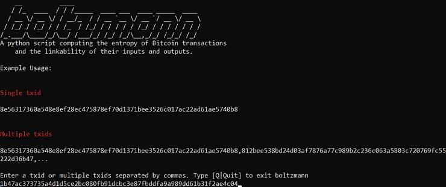

O calculador então retorna todos os indicadores que vimos anteriormente:

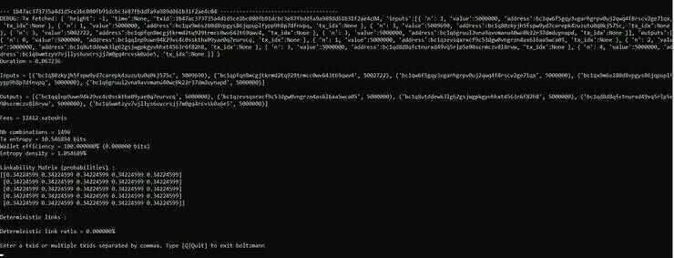

Digite o comando "Quit" para sair do software e voltar ao menu do RoninCLI.

Para saber mais sobre o calculador Boltzmann, recomendo a leitura destes artigos:

- https://medium.com/@laurentmt/introducing-boltzmann-85930984a159

- https://gist.github.com/LaurentMT/e758767ca4038ac40aaf

### Conectar ao Bisq.

Bisq é uma plataforma de troca que permite comprar e vender bitcoins peer-to-peer. Ele é usado com um software de desktop que é executado no Tor e permite trocar bitcoins sem precisar fornecer sua identidade.
Bisq protege as trocas peer-to-peer com um sistema de multi-assinatura 2/2. Você pode usar este software com seu próprio nó RoninDojo para otimizar a privacidade de suas trocas e confiar nos dados do blockchain do seu próprio nó.

Para baixar o software Bisq, visite o site oficial deles: https://bisq.network/

Para começar a usar o software, recomendo que você leia esta página: https://bisq.network/getting-started/

Para obter o link de conexão do seu RoninDojo, você precisará se conectar ao RoninCLI via SSH. Em seguida, vá para o menu:

> Aplicativos > Gerenciar Aplicativos

Digite sua senha e marque a caixa com a tecla de espaço:

> [ ] Habilitar Conexão Bisq

Confirme sua escolha. Deixe seu nó instalar e, em seguida, vá buscar o endereço Tor V3 em:

> Credenciais > Bitcoind

Copie o endereço em "Bitcoin Daemon".

Você também pode obter seu endereço Bitcoind Tor V3 na interface RoninUI clicando em "Gerenciar" na caixa "Bitcoin Core" no "Painel":

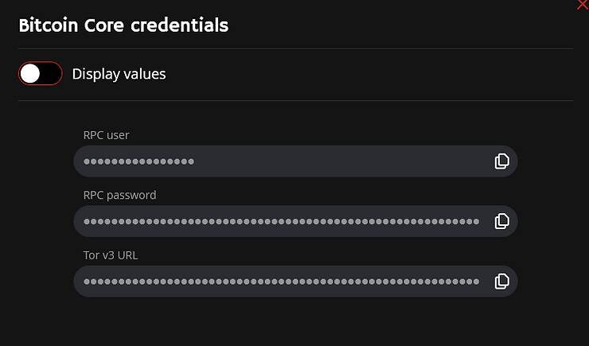

Para conectar seu nó ao Bisq, vá para o menu:

> Configurações > Informações da Rede

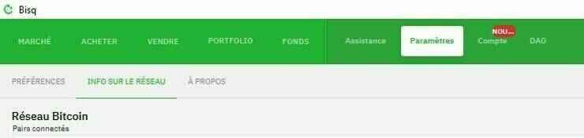

Clique na bolha "Usar nós Bitcoin Core personalizados". Em seguida, insira seu endereço Bitcoin TorV3 na caixa fornecida, com o ".onion" mas sem o "http://".

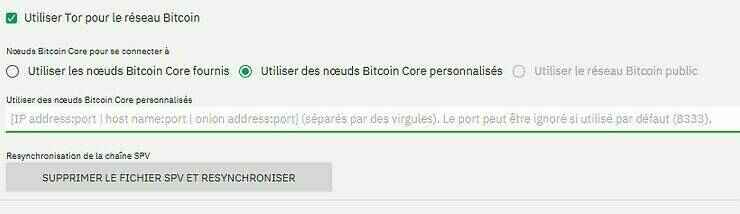

Reinicie o software Bisq. Seu nó agora está conectado ao seu Bisq.

### Outras funcionalidades.

Seu nó RoninDojo também possui outras funcionalidades básicas. Você tem a opção de escanear informações específicas para garantir que elas sejam consideradas.

Por exemplo, às vezes é possível que sua carteira conectada ao seu RoninDojo não encontre os bitcoins que você possui. O saldo está em 0, mesmo que você tenha certeza de que possui bitcoins nessa carteira. Existem várias possíveis causas a serem consideradas, incluindo um erro nos caminhos de derivação, e uma delas é que seu nó não está observando seus endereços.

Para corrigir isso, você pode verificar se seu nó está rastreando corretamente seu xpub com a ferramenta "xpub tool". Para acessá-la no RoninUI, vá para o menu:

> Manutenção > Ferramenta XPUB

Digite o xpub com o qual está tendo problemas e clique em "Verificar" para verificar essa informação.

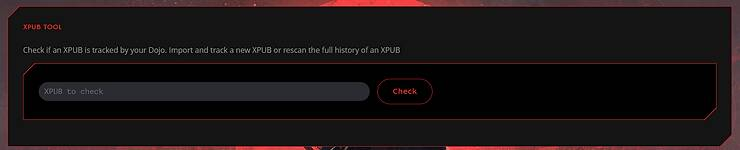

Se seu xpub estiver sendo rastreado corretamente pelo nó, você verá isso:

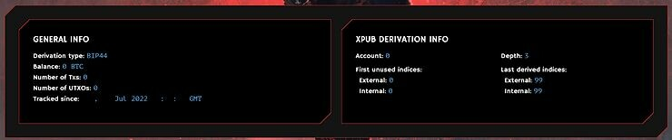

Verifique se todas as transações estão aparecendo corretamente. Verifique também se o tipo de derivação corresponde ao do seu portfólio. Aqui podemos ver que o nó está interpretando este xpub como uma derivação BIP44. Se esse tipo de derivação não corresponder ao do seu portfólio, clique no botão "Retype" e selecione BIP44/BIP49/BIP84 de acordo com sua escolha:

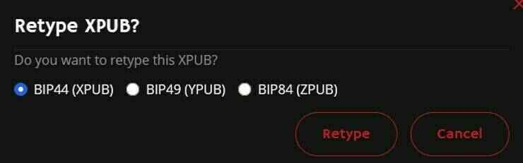

Se o seu xpub não estiver sendo rastreado pelo seu nó, você verá esta tela que o convida a importá-lo:

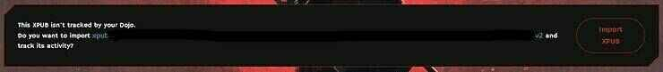

Você também pode usar outras ferramentas de manutenção:

- Transaction Tool: Permite observar os detalhes de uma transação específica.

- Address Tool: Permite verificar se um endereço específico está sendo rastreado pelo seu Dojo.

- Rescan Blocks: Força o seu nó a escanear novamente um intervalo de blocos escolhido.

Você também encontrará no RoninUI a ferramenta "Push Tx". Ela permite que você transmita uma transação assinada para a rede Bitcoin. Ela deve ser inserida no formato hexadecimal:

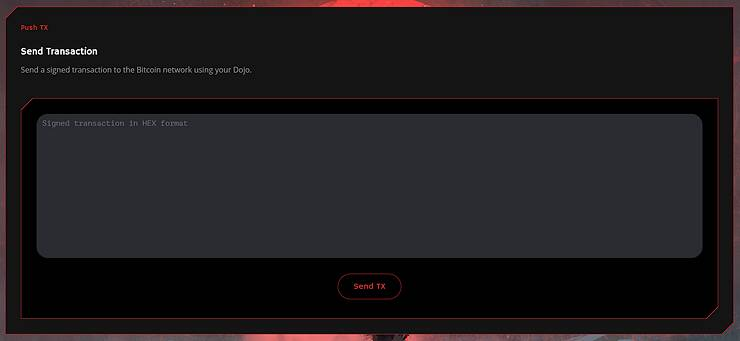

## Conclusão.

Vimos como instalar e usar essa maravilhosa ferramenta chamada RoninDojo. É uma excelente escolha para executar seu próprio nó Bitcoin. É uma solução estável que integra e mantém atualizadas todas as ferramentas essenciais para um Bitcoiner.

Se você não tem medo de usar o terminal e não precisa de ferramentas relacionadas à Lightning Network, então RoninDojo pode ser adequado para você.

Se puder, considere fazer uma doação aos desenvolvedores que produzem esses softwares gratuitos e de código aberto para você: https://donate.ronindojo.io/

Para saber mais sobre RoninDojo, recomendo que você verifique os links em minhas referências externas abaixo.

### Para saber mais:

- Compreender e usar o CoinJoin no Bitcoin.

- Funções de hash - trecho do ebook Bitcoin Démocratisé 1.

- Tudo sobre a Passphrase Bitcoin.

### Referências externas:

- https://samouraiwallet.com/dojo
- https://ronindojo.io/index.html
- https://wiki.ronindojo.io/en/home
- https://code.samourai.io/ronindojo/RoninDojo
- https://gist.github.com/LaurentMT/e758767ca4038ac40aaf
- https://medium.com/@laurentmt/introducing-boltzmann-85930984a159
- https://oxt.me/
- https://kycp.org/#/
- https://fr.wikipedia.org/wiki/Formule_de_Boltzmann
- https://wiki.ronindojo.io/en/setup/bisq
- https://bisq.network/
