名前：RoninDojo

説明：BitcoinノードRoninDojoのインストールと使用方法。

---

# BitcoinノードRoninDojoのインストールと使用方法

独自のノードを実行して使用することは、Bitcoinネットワークに実際に参加するために不可欠です。Bitcoinノードを実行することは、ユーザーに金銭的な利益をもたらすわけではありませんが、ユーザーのプライバシーを保護し、独立して行動し、ネットワークへの信頼を制御することができます。

この記事では、Bitcoinノードを実行するための素晴らしいソリューションであるRoninDojoについて詳しく説明します。

### 目次：

* RoninDojoとは何ですか？
* どのハードウェアを選ぶべきですか？
* RoninDojoのインストール方法は？
* RoninDojoの使用方法は？
* 結論

Bitcoinノードの動作と役割について理解がない場合は、まずこの記事を読むことをお勧めします：Bitcoinノード-パート1/2：技術的な概念。

## RoninDojoとは何ですか？

Dojoは、Samouraï Walletのチームによって開発された完全なBitcoinノードサーバーです。任意のマシンに自由にインストールすることができます。

RoninDojoは、Dojoとさまざまな他のツールのインストールおよび管理を容易にするインストールアシスタントおよび管理ツールです。RoninDojoは、Dojoの元の実装を引き継ぎ、多くの他のツールを追加しながら、インストールと管理を容易にします。

彼らはまた、RoninDojo Tantoというプラグアンドプレイのハードウェアを提供しており、Samouraï Walletのチームが組み立てたマシンにRoninDojoが事前にインストールされています。Tantoは有料のソリューションであり、手を汚したくない人にとって興味深いものです。

RoninDojoのコードはオープンソースであり、したがって独自のハードウェアにこのソリューションをインストールすることも可能です。このオプションは経済的ですが、少し手間がかかります。この記事では、この方法を説明します。

RoninDojoはDojoであり、Whirlpool CLIを簡単にBitcoinノードに統合することができます。Whirlpool CLIを使用することで、Bitcoinを24時間365日リミックスすることができ、自分のパーソナルコンピュータをオンにする必要はありません。また、プライバシーを大幅に向上させることもできます。

RoninDojoには、他にもさまざまなツールが組み込まれており、例えばトランザクションのプライバシーの度合いを決定するためのBoltzmann計算機、Bitcoinウォレットをノードに接続するためのElectrumサーバー、およびトランザクションをプライベートに監視するためのMempoolサーバーなどがあります。
この記事では、私が以前紹介したUmbrelというノードソリューションと比較して、RoninDojoは「On Chain」ソリューションとユーザーのプライバシーを最適化するツールに重点を置いた開発ラインに沿っています。そのため、RoninDojoではLightning Networkとの連携はできません。
RoninDojoはUmbrelと比べてツールの数は少ないですが、Roninにはビットコインユーザーにとって重要ないくつかの機能が非常に安定して備わっています。

したがって、Umbrelサーバーのすべての機能が必要ない場合、WhirlpoolやMempoolなどのいくつかの基本的なツールを備えたシンプルで安定したノードのみを使用したい場合は、RoninDojoがおそらく適切なソリューションです。

私の考えでは、Umbrelの開発ラインは非常にLightning Networkと多目的ツールに向けられています。これはビットコインノードですが、マルチタスクのミニサーバーにすることを目指しています。一方、RoninDojoの開発ラインはSamourai Walletのチームに近く、ビットコインユーザーにとって重要なツールに焦点を当て、完全な独立性とビットコインのプライバシーの最適な管理を可能にしています。

RoninDojoノードのセットアップは、Umbrelノードよりもやや複雑ですのでご注意ください。

では、RoninDojoのセットアップ方法を見ていきましょう。

## どのハードウェアを選ぶべきですか？

RoninDojoをホストし実行するマシンを選ぶには、いくつかのオプションがあります。

前述のように、最も簡単な選択肢は、この用途に特化したプラグアンドプレイのマシンであるTantoを注文することです。注文するには、こちらのリンクから：https://shop.ronindojo.io/product-category/nodes/

RoninDojoチームがオープンソースのコードを提供しているため、RoninDojoを他のマシンに実装することも可能です。最新のインストールアシスタントのバージョンは、このページで入手できます：https://ronindojo.io/en/downloads.html、最新のコードのバージョンは、このページで入手できます：https://code.samourai.io/ronindojo/RoninDojo

個人的には、Raspberry Pi 4 8GBにインストールし、すべてが完璧に動作しています。

ただし、RoninDojoチームによれば、ケースとSSDアダプターの問題が頻繁に発生することがあります。したがって、マシンのSSDにケーブルを使用するケースは避けることをお勧めします。代わりに、Raspberry Pi 4用に特別に設計されたストレージ拡張カードを使用することをお勧めします。

以下は、独自のRoninDojoノードを作成するためのセットアップの例です：

* Raspberry Pi 4
* ファン付きケース
* 互換性のあるストレージ拡張カード。
* 電源ケーブル。
* 16GB以上の産業用マイクロSDカード。
* 1TB以上のSSD。
* イーサネットケーブルRJ45、カテゴリ8が推奨されています。

## RoninDojoのインストール方法

### ステップ1：ブート可能なマイクロSDを準備する

マシンを組み立てたら、RoninDojoのインストールを開始することができます。まず、適切なディスクイメージをマイクロSDに書き込んでブート可能な状態にします。

マイクロSDカードをパーソナルコンピュータに挿入し、RoninDojoの公式ウェブサイトにアクセスしてRoninOSのディスクイメージを取得します：https://ronindojo.io/en/downloads.html。

ハードウェアに対応したディスクイメージをダウンロードします。私の場合、"MANJARO-ARM-RONINOS-RPI4-22.03.IMG.XZ"というイメージをダウンロードしました。

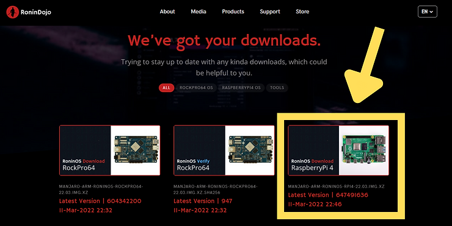

イメージをダウンロードしたら、対応する.SHA256ファイルを使用してその整合性を確認します。Windowsでの確認方法については、この記事で詳しく説明しています：WindowsでBitcoinソフトウェアの整合性を確認する方法。

RoninOSの整合性の確認に関する具体的な手順は、次の英語のページでも利用できます：https://wiki.ronindojo.io/en/extras/verify。

このイメージをマイクロSDに書き込むには、Balena Etcherなどのソフトウェアを使用できます。こちらからダウンロードできます：https://www.balena.io/etcher/。

Etcherでイメージを選択し、マイクロSDに書き込んでください。

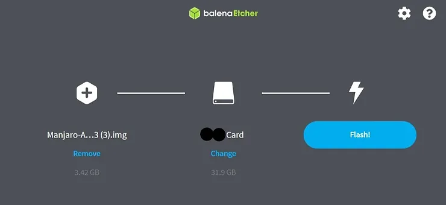

操作が完了したら、ブート可能なマイクロSDをRaspberry Piに挿入し、マシンを起動します。

### ステップ2：RoninOSの設定

RoninOSはRoninDojoノードのオペレーティングシステムであり、Manjaroの改変版です。マシンを起動し、数分待った後、設定を開始することができます。

リモートで接続するために、RoninDojoマシンのIPアドレスを見つける必要があります。たとえば、インターネットボックスの管理画面に接続するか、https://angryip.org/のようなソフトウェアを使用してローカルネットワークをスキャンし、マシンのIPを見つけることができます。

IPを見つけたら、同じローカルネットワークに接続された別のコンピュータからSSHを使用してマシンにアクセスできます。

MacOSやLinuxのコンピュータからは、ターミナルを開いてください。Windowsの場合、Puttyなどの専用ツールを使用するか、直接Windows PowerShellを使用できます。

ターミナルを開いたら、次のコマンドを入力します：

> ssh root@192.168.?.?

疑問符の部分を先ほど見つけたRoninDojoのIPに置き換えてください。
> ヒント：シェルで右クリックして要素を貼り付けることができます。

次に、Manjaroの設定パネルに移動します。ドロップダウンリスト内のターゲットを変更するために矢印キーを使用して、キーボードの適切なレイアウトを選択してください。

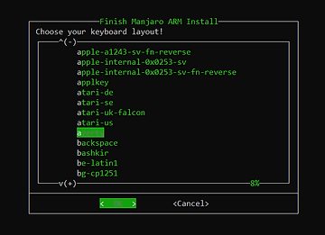

セッションのためのユーザー名とパスワードを選択してください。強力なパスワードを使用し、安全なバックアップを作成してください。インストール中は一時的に簡単なパスワードを使用することもできますが、後でRoninUIで簡単に変更できるため、Manjaroのセットアップ中に手動で入力する時間を節約するために、パスワードを「コピー＆ペースト」することができます。

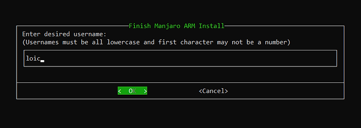

次に、rootパスワードを入力するように求められます。rootパスワードには直接強力なパスワードを入力してください。RoninUIからはrootパスワードを変更することはできませんので、rootパスワードをしっかりとバックアップしてください。

次に、地域とタイムゾーンを入力してください。

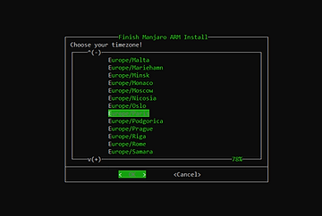

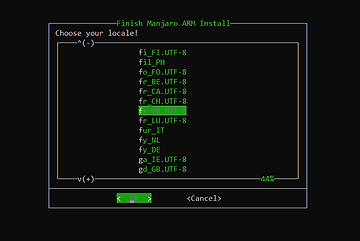

次に、ホスト名を選択してください。

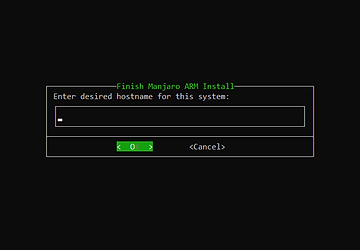

最後に、Manjaroの設定情報を確認し、承認してください。

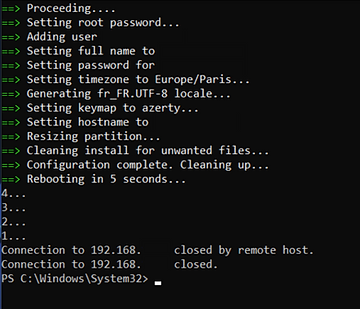

### ステップ3：RoninDojoをダウンロードする。

RoninOSの初期設定が行われます。上記のスクリーンショットのように完了したら、マシンは再起動します。しばらくお待ちいただき、次のコマンドを入力してRoninDojoマシンに再度接続してください：

> ssh pseudo@192.168.?.?

上記のコマンドで、"pseudo"の部分を前に選択したユーザー名に、"?"の部分をRoninDojoのIPアドレスに置き換えてください。

次に、ユーザーパスワードを入力してください。

ターミナルでは、次のようになります：

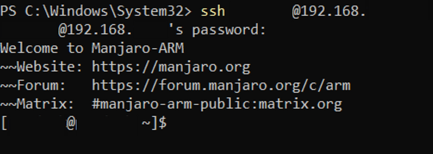

これで、現時点ではRoninOSのみを備えたマシンに接続されました。次に、RoninDojoをインストールする必要があります。

次のコマンドを入力して、RoninDojoの最新バージョンをダウンロードしてください：

> git clone https://code.samourai.io/ronindojo/RoninDojo

ダウンロードはすばやく完了します。ターミナルには次のように表示されます：

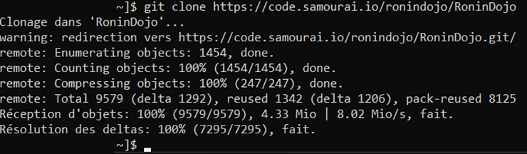

ダウンロードの完了を待ってから、次のコマンドを使用してRoninDojoのユーザーインターフェースをインストールしてアクセスしてください：

> ~/RoninDojo/ronin

次に、ユーザーパスワードを入力するように求められます：

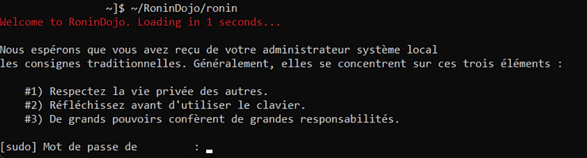
> このコマンドは、RoninDojoに初めてアクセスする場合にのみ必要です。その後、SSH経由でRoninCLIにアクセスするには、単に「[SSH pseudo@192.168.?.?]」というコマンドを入力する必要があります。ここで「pseudo」をユーザー名に置き換え、ノードのIPアドレスを入力します。ユーザーパスワードが求められます。

次に、次の素晴らしいアニメーションが表示されます：

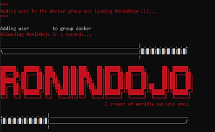

そして、ついにRoninDojoのCLIユーザーインターフェースに到着します。

### ステップ4：RoninDojoをインストールする。

メインメニューから、キーボードの矢印を使用して「System」メニューにアクセスします。選択を確定するためにEnterキーを使用します。

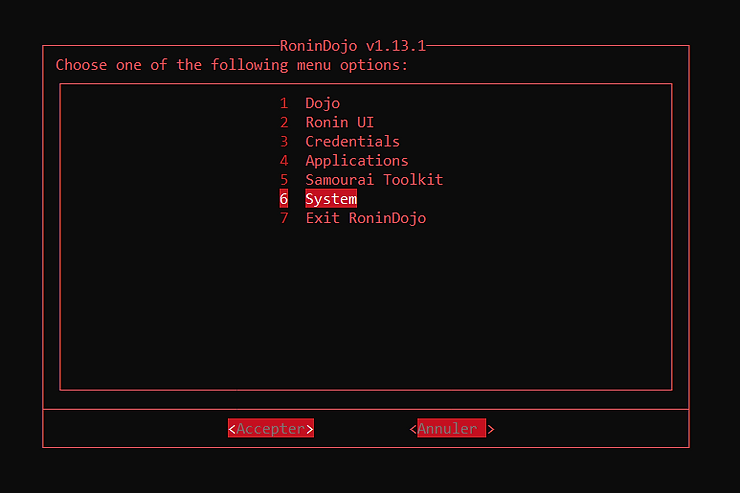

次に、「System Setup & Install」メニューに移動します。

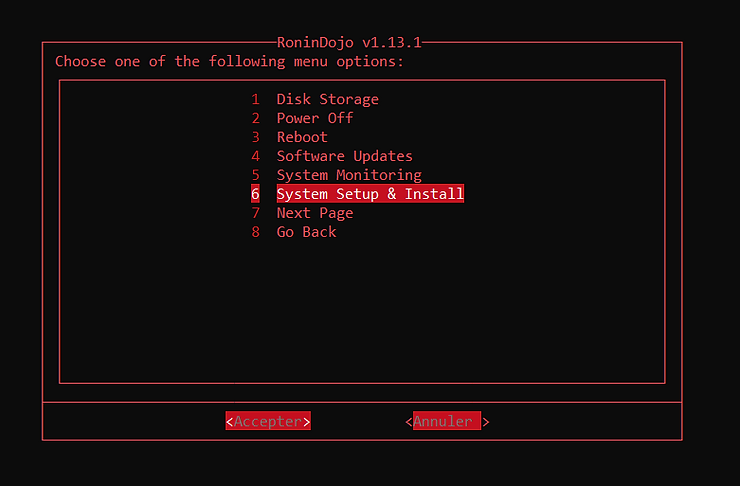

最後に、スペースバーを使用して「System Setup」と「Install RoninDojo」をチェックし、インストールを開始するために「Accept」を選択します。

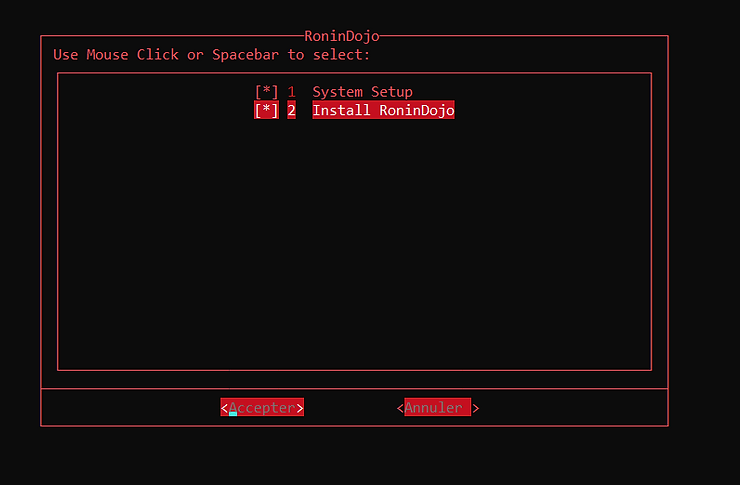

インストールが進行するのを静かに待ちます。私の場合、約2時間かかりました。操作中はターミナルを開いたままにしておいてください。

インストールの途中で、以下のように特定のステージでキーを押すように求められることがあります。

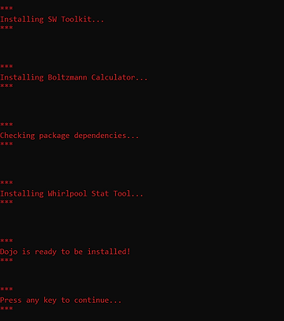

インストールが完了すると、さまざまなコンテナが起動します。

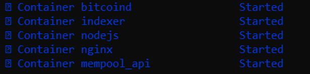

その後、ノードが再起動します。次のステップのために再びRoninCLIに接続してください。

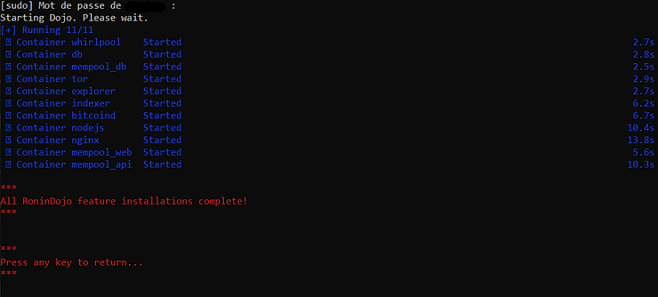

### ステップ5：Proof of Workチェーンをダウンロードし、RoninUIにアクセスする。

インストールが完了すると、ノードはBitcoinのProof of Workチェーンをダウンロードし始めます。これはIBD（Initial Block Download）と呼ばれます。これには通常、インターネット接続とデバイスの性能に応じて2日から14日かかります。

Proofチェーンのダウンロードの進捗状況は、RoninUIのWebインターフェースに接続して確認できます。

ローカルネットワークからアクセスするには、次のいずれかの方法を使用してブラウザに入力します。

* マシンのIPアドレス（192.168.?.?）を直接入力します。

* ronindojo.local

VPNを使用している場合は、VPNを無効にすることを忘れないでください。

### 可能なトラブルシューティング

ブラウザからRoninUIに接続できない場合は、SSHを介してノードに接続されたターミナルからアプリケーションの正常な動作を確認してください。前述の手順と同様に、次のように入力します。

* SSH pseudo@192.168.?.?（自分の認証情報に置き換えてください）

* ユーザーパスワードを入力してください。
メインメニューに移動してください：
> RoninUI > 再起動

アプリケーションが正常に再起動した場合、問題はブラウザからの接続にあります。VPNを使用していないことを確認し、ノードと同じネットワークに接続されていることを確認してください。

再起動でエラーが発生した場合、OSを更新してからRoninUIを再インストールしてください。OSを更新するには、次の手順を実行してください：

> システム > ソフトウェアの更新 > OSの更新

更新と再起動が完了したら、SSHを使用してノードに再接続し、RoninUIを再インストールしてください：

> RoninUI > 再インストール

RoninUIを再ダウンロードした後、ブラウザを使用してRoninUIにログインしてみてください。

> ヒント：RoninCLIを誤って終了し、Manjaroのターミナルに戻ってしまった場合は、単に「ronin」と入力してRoninCLIのメインメニューに直接戻ることができます。

### ウェブログイン

Torを使用して、どのネットワークからでもRoninUIのウェブインターフェースにログインすることもできます。これを行うには、RoninCLIからRoninUIのTorアドレスを取得してください：

> 資格情報 > Ronin UI

.onionで終わるTorアドレスを取得し、Torブラウザでこのアドレスを入力してRonin UIにログインしてください。異なる資格情報を漏洩させないように注意してください。これらは機密情報です。

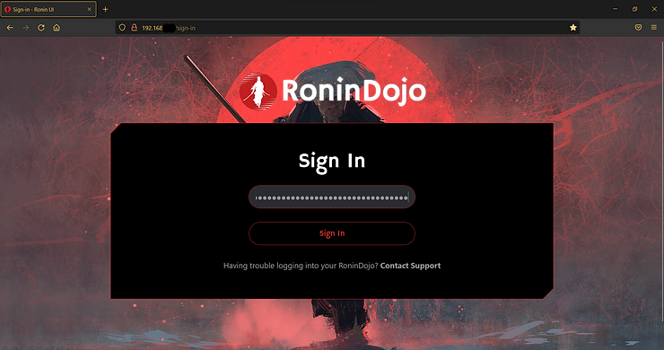

ログインすると、ユーザーパスワードが要求されます。これはSSHでログインするために使用するパスワードと同じです。

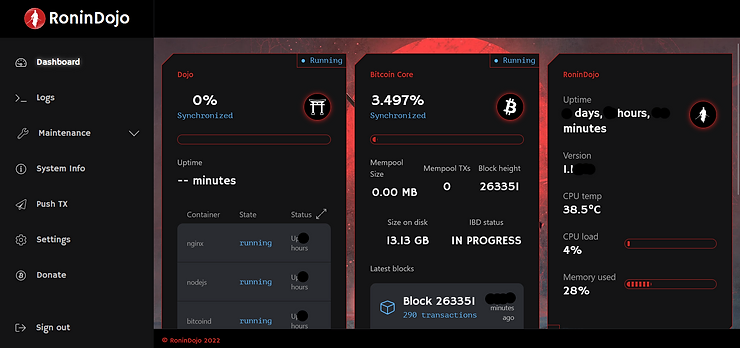

IBDの進捗状況を確認できます。お待ちください。2009年1月3日以降のBitcoinで行われたすべてのトランザクションを完全に取得しています。

ブロックチェーン全体をダウンロードした後、インデクサーはデータベースを圧縮します。この操作には約12時間かかります。RoninUIの「インデクサー」で進捗状況を確認することもできます。

これでRoninDojoノードは完全に機能します：

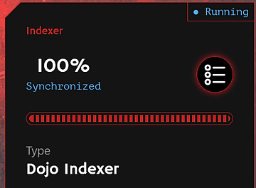

より強力なパスワードにユーザーパスワードを変更したい場合は、現在のタブの「設定」から変更できます。RoninDojoでは追加のセキュリティレイヤーはありませんので、本当に強力なパスワードを設定し、そのバックアップに注意してください。

## RoninDojoの使用方法

ブロックチェーンがダウンロードされ、圧縮されたら、新しいRoninDojoノードが提供するサービスを利用できるようになります。どのように使用するかを見ていきましょう。

### ポートフォリオソフトウェアをelectrsに接続する
新しくインストールされ、同期されたノードの最初の利点は、ビットコインネットワークにトランザクションをブロードキャストすることです。したがって、さまざまなウォレット管理ソフトウェアを接続したいと思うでしょう。

これはElectrum Rust Server（electrs）を使用して行うことができます。このアプリケーションは通常、RoninDojoノードにプリインストールされています。もしプリインストールされていない場合は、RoninCLIのインターフェースから手動でインストールすることができます。

次の手順で行います：

> アプリケーション > アプリケーションの管理 > Electrum Serverのインストール

Electrum ServerのTorアドレスを取得するには、RoninCLIのメニューから次の手順で進みます：

> 資格情報 > Electrs

その後、ウォレットソフトウェアで.onionリンクを入力するだけです。たとえば、Sparrow Walletでは、次のタブに移動します：

> ファイル > 設定 > サーバー

サーバータイプで「Private Electrum」を選択し、対応する欄にElectrum ServerのTorアドレスを入力します。最後に、「接続のテスト」をクリックして接続をテストし、保存します。

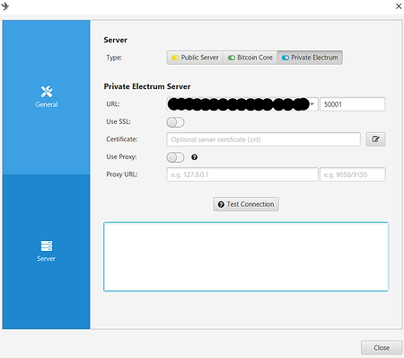

### ソフトウェアウォレットをSamourai Dojoに接続する

Electrsの代わりに、Samourai Dojoを使用して、互換性のあるソフトウェアウォレットをRoninDojoノードに接続することもできます。たとえば、Samourai Walletはこのオプションを提供しています。

これを行うには、Dojoの接続QRコードをスキャンするだけです。RoninUIからアクセスするには、「ダッシュボード」タブをクリックし、Dojoのボックス内の「管理」ボタンをクリックします。その後、DojoとBTC-RPC Explorerへの接続用のQRコードを表示することができます。表示するには、「値の表示」をクリックします。

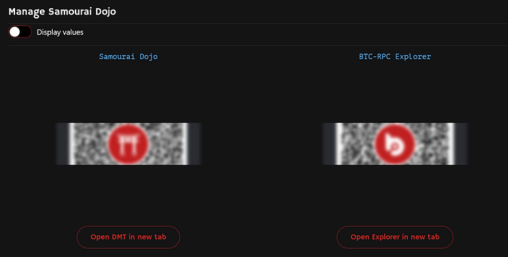

Samourai WalletをDojoに接続するには、アプリケーションのインストール時にこのQRコードをスキャンする必要があります：

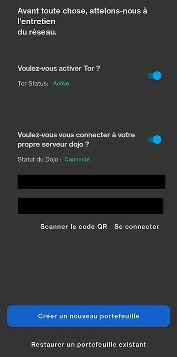

### 独自のMempool Explorerの使用

ビットコインユーザーにとって重要なツールであるエクスプローラーは、ビットコインチェーンに関するさまざまな情報を確認することができます。Mempoolを使用すると、他のユーザーが適用する手数料をリアルタイムで確認して、自分の手数料を最適化することができます。また、トランザクションの確認状況を確認したり、アドレスの残高を確認したりすることもできます。

これらのエクスプローラーツールを使用すると、プライバシーの損失リスクがあり、サードパーティのデータベースに信頼を置かなければなりません。独自のノードを経由せずにオンラインツールを使用する場合は、次のリスクがあります：

* ウォレットに関する情報が漏洩する可能性があります。

* ウェブサイトの管理者に、ホストされているプルーフオブワークチェーンを信頼する必要があります。
これらのリスクを回避するために、Torネットワークを介して自分自身のMempoolインスタンスを使用することができます。このソリューションを使用すると、サービスを利用する際にプライバシーが保護されるだけでなく、プロバイダに信頼を置く必要もなくなります。なぜなら、自分自身のデータベースをクエリするからです。

そのためには、まずRoninCLIからMempool Space Visualizerをインストールします。

> アプリケーション > アプリケーションの管理 > Mempool Space Visualizerのインストール

インストールが完了したら、Mempoolへのリンクを取得します。Torアドレスを使用すると、どのネットワークからでもアクセスできます。同様に、RoninCLIを使用してこのリンクを取得します。

> 資格情報 > Mempool

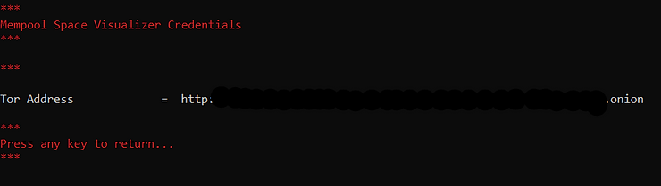

TorブラウザでMempool Torアドレスを入力するだけで、自分自身のMempoolインスタンスにアクセスできます。お気に入りにこのTorアドレスを追加して、より迅速にアクセスできるようにすることをお勧めします。また、デスクトップにショートカットを作成することもできます。

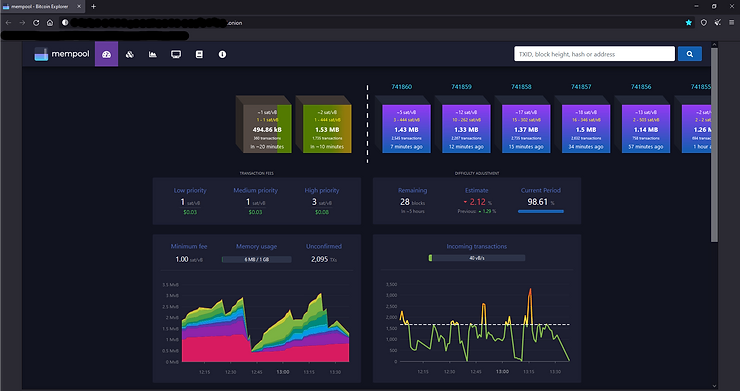

Torブラウザをまだお持ちでない場合は、こちらからダウンロードできます：https://www.torproject.org/download/

また、Torブラウザをスマートフォンにインストールし、同じアドレスを入力することでアクセスすることもできます。どこからでも、自分自身のノードを使用してBitcoinチェーンの状態を確認することができます。

### Whirlpool CLIの使用

RoninDojoノードには、WhirlpoolCLIも含まれており、Whirlpoolのミックスを自動化するためのリモートコマンドラインインターフェースです。

Whirlpoolの実装でCoinJoinを行う場合、使用しているアプリケーションはミックスやリミックスを実行するために常に開いている必要があります。これは、高い匿名性を持つanonセットを持ちたいユーザーにとって手間のかかるプロセスです。なぜなら、Whirlpoolを統合したアプリケーションをホストするデバイスは常にオンにする必要があるからです。具体的には、UTXOを24時間365日リミックスに参加させたい場合、自分のパソコンやスマートフォンを常にオンにしてアプリケーションを開いておかなければなりません。

この制約に対する解決策として、Bitcoinノードなど常にオンになっているマシンでWhirlpoolCLIを使用することがあります。これにより、UTXOは自動的に24時間365日リミックスされ、Bitcoinノード以外のマシンを常に稼働させる必要はありません。
WhirlpoolCLIは、Coinjoinを簡単に管理するために個人用コンピュータにインストールする必要があるWhirlpoolGUIと一緒に使用されます。この記事では、Whirlpool CLIを独自のdojoと組み合わせて使用する方法について詳しく説明します：https://www.pandul.fr/post/comprendre-et-utiliser-le-coinjoin-sur-bitcoin#:~:text=dans%20cette%20partie.-,Tutoriel%20%3A%20Whirpool%20CLI%20sur%20Dojo%20et%20Whirlpool%20GUI.,-Si%20vous%20souhaitez
Coinjoinについて一般的に詳しく知りたい場合は、この記事で説明しています：https://www.pandul.fr/post/comprendre-et-utiliser-le-coinjoin-sur-bitcoin

### Whirlpool Stat Toolの使用方法

WhirlpoolでCoinJoinを行った後、ミックスされたUTXOのプライバシーレベルを具体的に知りたい場合があります。Whirlpool Stat Toolを使用すると、簡単にそれを行うことができます。このツールを使用すると、ミックスされたUTXOの将来のスコアと過去のスコアを計算することができます。これらのAnon Setsの計算方法と動作について詳しく知りたい場合は、この部分を読むことをお勧めします：https://www.pandul.fr/post/comprendre-et-utiliser-le-coinjoin-sur-bitcoin#:~:text=perdre%20en%20confidentialit%C3%A9.-,Anon%20Sets.,-Comme%20expliqu%C3%A9%20pr%C3%A9c%C3%A9demment

このツールはRoninDojoに事前インストールされています。現時点では、RoninCLIからのみ利用可能です。メインメニューから起動するには、次の手順を実行します：

> Samourai Toolkit > Whirlpool Stat Tool

使用方法の指示が表示されます。完了したら、任意のキーを押してコマンドラインにアクセスします：

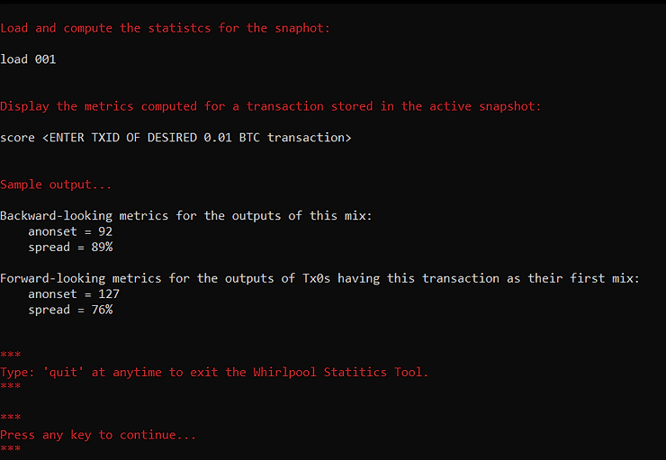

ターミナルが表示されます：

> wst#/tmp>

このインターフェースを終了してRoninCLIのメニューに戻るには、次のコマンドを入力します：

> quit

まず、データを機密性を保護してOXTから抽出するためにTor上のプロキシを設定します。次のコマンドを入力します：

> socks5 127.0.0.1:9050

次に、トランザクションを含むプールのデータをダウンロードします：

> download 0001
>
> 興味のあるプールの識別コードで0001を置き換えてください。

WSTの識別コードは次のとおりです：

* 0.5ビットコインのプール：05

* 0.05ビットコインのプール：005

* 0.01ビットコインのプール：001

* 0.001ビットコインのプール：0001

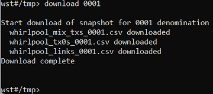

データをダウンロードしたら、次のコマンドでデータをロードします：

> load 0001
>
> 興味のあるプールの識別コードで0001を置き換えてください。
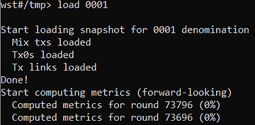
データの読み込みを待ってください。数分かかる場合があります。データの読み込みが完了したら、次のコマンドを入力して、Anon Setsを取得してください。

> score TXID
>
> TXIDには、トランザクションの識別子を入力してください。

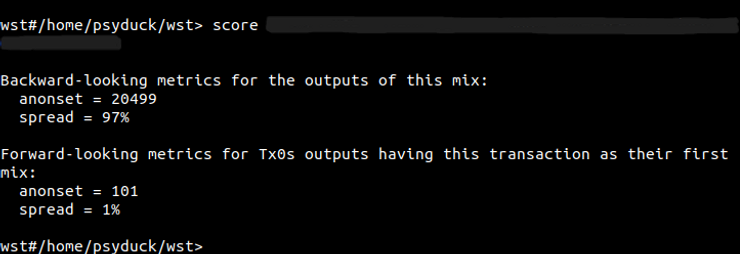

WSTは、まず過去のスコア（Backward-looking metrics）を表示し、次に予測スコア（Forward-looking metrics）を表示します。Anon Setsのスコアに加えて、WSTはAnon Setにおけるoutputの拡散率も表示します。

UTXOの予測スコアは、初期のミックスのTXIDから計算されますが、最後のミックスからではありません。一方、UTXOの過去スコアは、最後のサイクルのTXIDから計算されます。

もしAnon Setsの概念が理解できない場合は、この記事のCoinjoinの部分を読んで、図を使って詳しく説明しています：https://www.pandul.fr/post/comprendre-et-utiliser-le-coinjoin-sur-bitcoin#:~:text=perdre%20en%20confidentialit%C3%A9.-,Anon%20Sets.,-Comme%20expliqu%C3%A9%20pr%C3%A9c%C3%A9demment 

### Boltzmann Calculatorの使用方法

Boltzmann Calculatorは、Bitcoinトランザクションのさまざまな高度なメトリクス、特にエントロピーのレベルを簡単に計算するためのツールです。これらのデータを使用して、トランザクションの機密性のレベルを数値化し、エラーを検出することができます。このツールは、RoninDojoノードにプリインストールされています。

RoninCLIからアクセスするには、SSHで接続し、次のメニューに移動します：

> Samourai Toolkit > Boltzmann Calculator

RoninDojoでの使用方法を説明する前に、これらのメトリクスが何を表し、どのように計算され、どのように使用されるかを説明します。

これらの指標は、Bitcoinのどのトランザクションにも使用できますが、特にCoinjoinトランザクションの品質を調べるのに興味があります。

1. このソフトウェアによって計算される最初の指標は、可能な組み合わせの数です。計算機上に表示されるものです："nb combinations"と表示されます。UTXOの値に基づいて、この指標は入力から出力への可能なマッピングの数を表します。

> もし"UTXO"という用語に馴染みがない場合は、この短い記事を読んでください：Mécanisme d'une transaction Bitcoin : UTXO, inputs et outputs.
言い換え:
言い換えることなく、元のテキストをそのまま翻訳します。

翻訳:
言い換えることなく、元のテキストをそのまま翻訳します。

他の言葉で言えば、この指標は、与えられたトランザクションに対して可能な解釈の数を表します。例えば、Whirlpool 5x5の構造を持つCoinjoinの場合、可能な組み合わせの数は1496です：
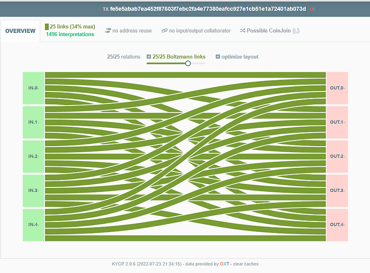

クレジット：https://kycp.org/#/fe5e5abab7ea452f87603f7ebc2fa4e77380eafcc927e1cb51e1a72401ab073d

2. 計算される2番目の指標は、トランザクションのエントロピー（"Entropy"）です。トランザクションの可能な組み合わせの数が非常に多い場合、エントロピーを使用することを選択することができます。エントロピーは、可能な組み合わせの数の2進対数を表します。以下はその式です：

* E：トランザクションのエントロピー。

* C：トランザクションの可能な組み合わせの数。

> E = log2(C)

数学では、2を底とする対数（二進対数）は、2のべき乗の逆関数です。つまり、xの二進対数は、値xを得るために2を何乗する必要があるかを表します。

したがって：

> E = log2(C)
> C = 2^E

この指標はビットで表されます。例えば、Whirlpool 5x5の構造を持つCoinjoinのトランザクションのエントロピーを計算すると、可能な組み合わせの数が1496であることがわかります：

> C = 1496
>
> E = log2(1496)
>
> E = 10.5469 bits

したがって、このCoinjoinトランザクションのエントロピーは10.5469ビットであり、非常に良いです。

この指標が高いほど、トランザクションの異なる解釈が多くなり、トランザクションの機密性が高くなります。

別の例を見てみましょう。以下は、1つの入力と2つの出力を持つ「通常の」トランザクションの例です：

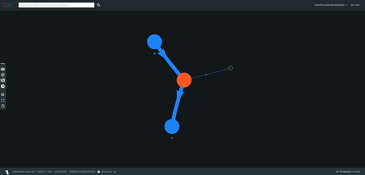

クレジット：https://oxt.me/graph/transaction/tiid/9815286

このトランザクションには、可能な解釈が1つしかありません：

>[(inp 0) > (Outp 0 ; Outp 1)]

したがって、そのエントロピーは0になります：

> C = 1
>
> E = log2(C)
>
> E = 0

3. ボルツマン計算機によって返される3番目の指標は、「ウォレットの効率性」と呼ばれるTxの効率です。この指標は、入力トランザクションを同じ構成で可能な最良のトランザクションと比較するだけのものです。
したがって、与えられたトランザクションの構造に対して達成可能な最大エントロピーを表す最大エントロピーの概念を導入します。例えば、Whirlpool 5x5タイプのCoinjoinの構造は、最大エントロピーが10.5469である最大エントロピーを持ちます。したがって、効率指標は、この最大エントロピーと入力トランザクションの実際のエントロピーを比較します。その式は次の通りです：
* ER：ビットで表される実際のエントロピー。

* EM：同じ構造で表される最大エントロピー。

* Ef：ビットで表される効率。

> Ef = ER - EM
>
> Ef = 10.5469 - 10.5469
>
> Ef = 0ビット

この指標はまた、パーセンテージでも表され、その式は次の通りです：

* CR：実際の可能な組み合わせの数。

* CM：同じ構造で可能な最大の組み合わせの数。

* Ef：パーセンテージで表される効率。

> Ef = CR/CM
>
> Ef = 1496/1496
>
> Ef = 100%

したがって、100%の効率は、このトランザクションがその構造に対して可能な限りのプライバシーを持っていることを意味します。

4. 計算される4番目の指標はエントロピー密度（"Entropy Density"）です。これにより、エントロピーを各入力または出力に関連付けることができます。したがって、この指標を使用して、異なるサイズの複数のトランザクション間の効率を比較することができます。

その計算は非常に簡単で、トランザクションのエントロピーをその中に存在する入力と出力の数で割ります。例えば、Whirlpool 5x5タイプのCoinjoinの場合は次のようになります：

    ED：ビットで表されるエントロピー密度。

    E：ビットで表されるトランザクションのエントロピー。

    T：トランザクション内の総入力および出力の数。

T = 5 + 5 = 10
ED = E / T
ED = 10.5469 / 10
ED = 1.054ビット

計算機ボルツマンによって提供される5番目の情報は、入力と出力の間のリンクの確率表です。この表は、特定の入力が特定の出力に対応する確率（ボルツマンスコア）を単純に示します。

Whirlpoolを使用した前の例を再度考えると、確率の表は次のようになります：

| 入力 | 出力0 | 出力1 | 出力2 | 出力3 | 出力4 |
|-------|----------|----------|----------|----------|----------|
| 0     | 34%      | 34%      | 34%      | 34%      | 34%      |
| 1     | 34%      | 34%      | 34%      | 34%      | 34%      |
| 2     | 34%      | 34%      | 34%      | 34%      | 34%      |
| 3     | 34%      | 34%      | 34%      | 34%      | 34%      || 4     | 34%      | 34%      | 34%      | 34%      | 34%      |

ここでは、各入力が各出力に関連付けられる可能性が同じであることがわかります。

一方、1つの入力と2つの出力を持つトランザクションの例を見てみると、次のようになります：

| 入力 | 出力 0 | 出力 1 |
|-------|----------|----------|
| 0     | 100%     | 100%     |

この例では、出力ごとの入力0からの確率が100%であることがわかります。

この確率が低いほど、プライバシーが高くなります。

6. 計算される6番目の情報は、決定的なリンクの数です。また、決定的なリンクの比率も提供されます。この指標は、与えられたトランザクションの入力と出力間のリンクのうち、確実性が100%であると言えるリンクの数を示します。

比率は、トランザクション内の決定的なリンクの数を総リンク数で割ったものです。

例えば、Coinjoin Whirlpoolトランザクションには、入力と出力の間に決定的なリンクはありません。したがって、指標はゼロであり、比率も0%です。

一方、2番目のトランザクション（1つの入力と2つの出力）では、指標は2であり、比率は100%です。

したがって、この指標がゼロである場合、プライバシーが高いことを示します。

これらの指標を学んだので、このソフトウェアを使用して計算する方法を見てみましょう。RoninCLIから次のメニューに移動します：

> Samourai Toolkit > Boltzmann Calculator

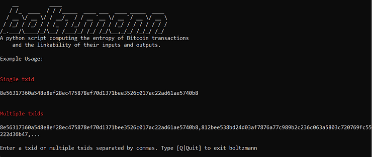

ソフトウェアが起動したら、調べたいトランザクションの識別子を入力します。複数のトランザクションを入力する場合は、コンマで区切って入力し、Enterキーを押します：

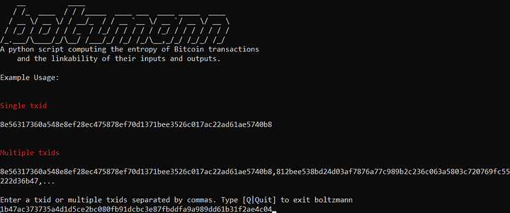

計算機は、先ほど見たすべての指標を返します：

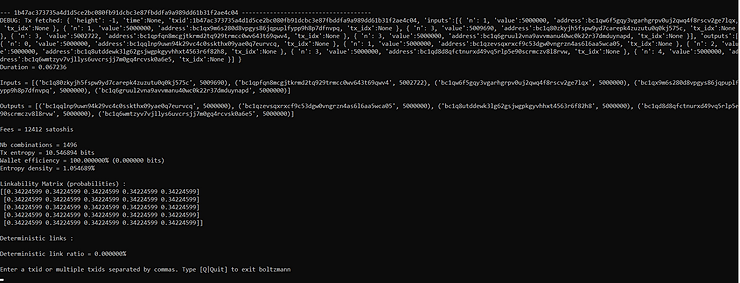

ログアウトするには、"Quit"と入力してEnterキーを押します。そして、RoninCLIのメニューに戻ります。

Boltzmann計算機についてもっと詳しく知りたい場合は、次の記事を読んでみてください：

* https://medium.com/@laurentmt/introducing-boltzmann-85930984a159

* https://gist.github.com/LaurentMT/e758767ca4038ac40aaf

### Bisqに接続する

Bisqはピアツーピアでのビットコインの購入や販売を行うことができる取引プラットフォームです。Tor上で実行されるデスクトップソフトウェアと組み合わせて使用し、身元情報を提供する必要なくビットコインを交換することができます。
Bisqは、2/2のマルチシグネチャシステムによってピアツーピアの取引を安全に行います。RoninDojoノードとこのソフトウェアを使用することで、取引のプライバシーを最適化し、自分自身のノードのブロックチェーンデータを信頼することができます。
Bisqソフトウェアをダウンロードするには、公式サイトにアクセスしてください：https://bisq.network/

ソフトウェアの使い方については、このページを参照してください：https://bisq.network/getting-started/

RoninDojoから接続リンクを取得するには、SSH経由でRoninCLIに接続する必要があります。次に、次のメニューに移動します：

> アプリケーション > アプリケーションの管理

パスワードを入力し、スペースキーで次の項目をチェックします：

> [ ] Bisq接続を有効にする

選択を確認してください。ノードのインストールが完了するのを待ち、次にTor V3アドレスを次の場所から取得します：

> 資格情報 > Bitcoind

"Bitcoin Daemon"の下にあるアドレスをコピーします。

また、RoninUIのインターフェースからもBitcoind Tor V3アドレスを取得できます。"ダッシュボード"から"Bitcoin Core"の"Manage"をクリックするだけです。

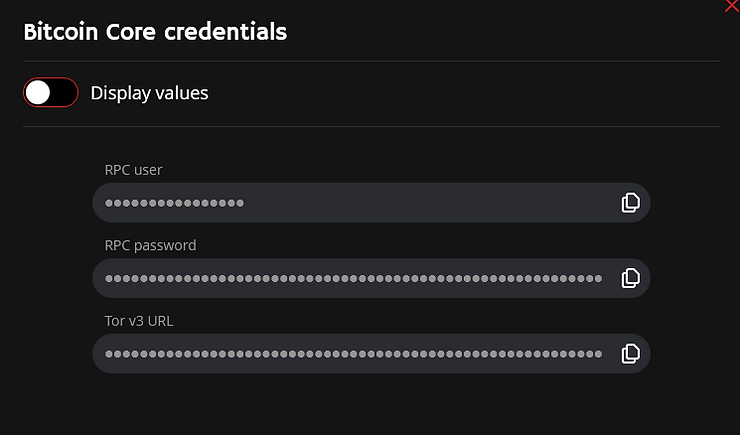

Bisqからノードに接続するには、次のメニューに移動します：

> 設定 > ネットワーク情報

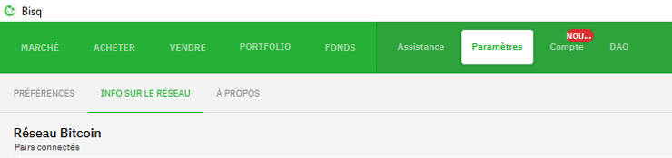

"Bitcoin Coreカスタムノードを使用する"というバブルをクリックします。次に、Bitcoin TorV3アドレスを入力します。".onion"を含めずに入力してください。

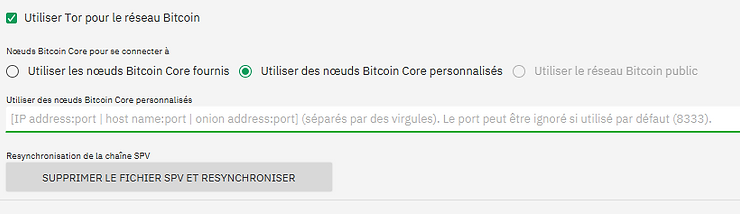

Bisqソフトウェアを再起動します。ノードはBisqに接続されます。

### その他の機能

RoninDojoノードには、他の基本的な機能も搭載されています。特定の情報をスキャンして考慮に入れることができます。

たとえば、RoninDojoに接続されたウォレットが所持しているビットコインを見つけられない場合があります。残高が0でありながら、そのウォレットにビットコインがあると確信している場合です。考慮すべき多くの可能な原因がありますが、派生パスのエラーや、ノードがアドレスを監視していない可能性もあります。

これを解決するために、ノードがxpubを追跡していることを確認するために「xpubツール」を使用できます。RoninUIからアクセスするには、次のメニューに移動します：

> メンテナンス > XPUBツール

問題のあるxpubを入力し、「チェック」をクリックして情報を確認します。

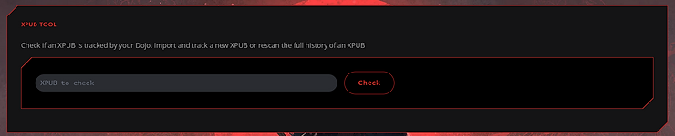

ノードがxpubを追跡している場合、次のように表示されます：

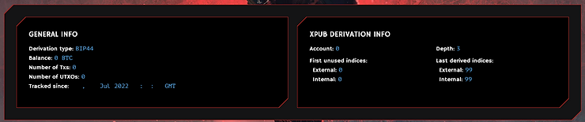
すべてのトランザクションが正しく表示されていることを確認してください。また、派生のタイプがウォレットと一致していることも確認してください。ここでは、このxpubがBIP44の派生として解釈されていることがわかります。ウォレットの派生タイプが一致しない場合は、「Retype」ボタンをクリックし、選択したいBIP44/BIP49/BIP84を選択してください：
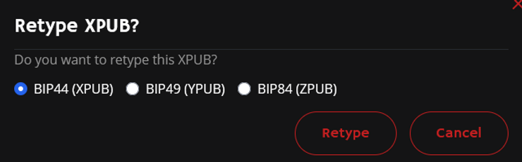

もしもあなたのxpubがノードに追跡されていない場合、次の画面が表示され、インポートするように求められます：

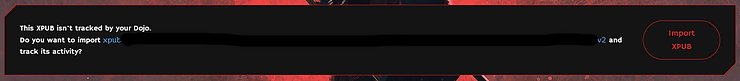

また、他のメンテナンスツールも使用できます：

* トランザクションツール：特定のトランザクションの詳細を確認できます。

* アドレスツール：特定のアドレスがDojoによって正しく追跡されているかを確認できます。

* ブロックの再スキャン：ノードに選択したブロック範囲を再スキャンさせます。

RoninUIには「Push Tx」というツールもあります。これを使用すると、署名済みのトランザクションをBitcoinネットワークにブロードキャストすることができます。トランザクションは16進数形式で入力する必要があります：

## 結論.

私たちはRoninDojoという素晴らしいツールのインストールと使用方法を見ることができました。これは自分自身のBitcoinノードを運用するための優れた選択肢です。これは安定したソリューションであり、Bitcoinerにとって必要なすべての重要なツールを統合し、最新の状態に保ちます。

もしターミナルの使用に抵抗がなく、またはLightning Networkに関連するツールが必要ない場合は、RoninDojoはあなたにとって適しているかもしれません。

可能であれば、これらのオープンソースソフトウェアを無料で提供している開発者に寄付することを考えてください：https://donate.ronindojo.io/

RoninDojoについてさらに詳しく知りたい場合は、以下の外部リソースのリンクをご覧ください。

### さらに詳しく学ぶために：

* BitcoinでのCoinJoinの理解と使用方法。

* ハッシュ関数について - Bitcoin Démocratisé 1からの抜粋。

* Bitcoinのパスフレーズについてすべて知る。

### 外部リソース：

    https://samouraiwallet.com/dojo

    https://ronindojo.io/index.html

    https://wiki.ronindojo.io/en/home

    https://code.samourai.io/ronindojo/RoninDojo

    https://gist.github.com/LaurentMT/e758767ca4038ac40aaf 

    https://medium.com/@laurentmt/introducing-boltzmann-85930984a159 

    https://oxt.me/  

    https://kycp.org/#/

    https://fr.wikipedia.org/wiki/Formule_de_Boltzmann 

    https://wiki.ronindojo.io/en/setup/bisq 

    https://bisq.network/ 
     

https://www.pandul.fr/post/installer-et-utiliser-son-n%C5%93ud-bitcoin-ronindojo