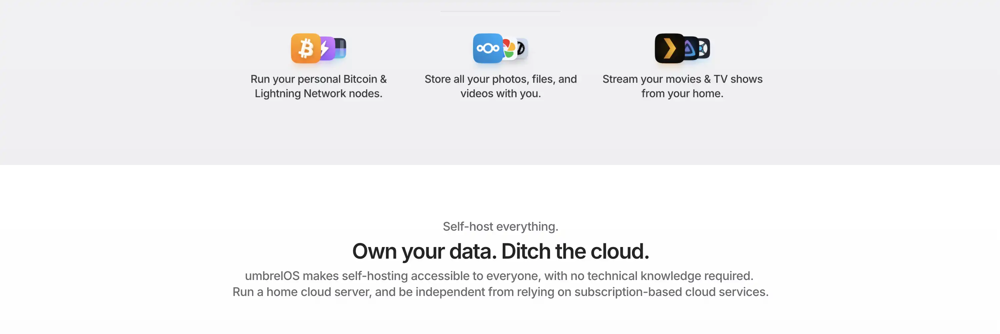

## Introduction

Umbrel est un système d'exploitation open source qui transforme votre ordinateur en un serveur domestique personnel et privé. Il vous permet d'héberger facilement vos propres services et applications, tout en gardant le contrôle total de vos données.

### Une plateforme complète

Avec son interface utilisateur élégante et intuitive, Umbrel rend accessible à tous l'auto-hébergement de services comme :

- Stockage de fichiers dans le cloud
- Streaming multimédia
- VPN personnel
- Gestionnaire de mots de passe
- Un nœud Bitcoin complet
- Et bien d'autres applications

### Pourquoi exécuter un nœud Bitcoin ?

L'une des applications les plus populaires d'Umbrel est son nœud Bitcoin. Exécuter votre propre nœud Bitcoin est une étape cruciale vers la souveraineté financière, offrant plusieurs avantages essentiels :

- **Confidentialité** : Diffusez vos transactions sans révéler vos informations à des tiers
- **Résistance à la censure** : Personne ne peut vous empêcher d'utiliser Bitcoin
- **Vérification indépendante** : Plus besoin de faire confiance aux nœuds des autres pour vérifier vos transactions
- **Participation au consensus** : Contribuez à l'application des règles du réseau Bitcoin
- **Soutien au réseau** : Devenez un participant actif dans la distribution et la décentralisation du réseau

## Options d'installation d'Umbrel

### Solution clé en main : Umbrel Home

UmbrelOS est conçu initialement pour l'Umbrel Home, qui offre :
- Support complet de toutes les fonctionnalités
- Support du stockage externe
- Assistant de Migration
- Support premium
- Installation plug-and-play

Pour plus d'informations sur Umbrel Home, visitez [le site officiel](https://umbrel.com/umbrel-home).

### Installation DIY (Do It Yourself)

Si vous préférez installer Umbrel sur votre propre matériel, plusieurs options s'offrent à vous :

- **Raspberry Pi 5** : Solution populaire et abordable, idéale pour débuter
- **Système x86** : Pour une installation sur PC ou serveur standard
- **Machine virtuelle** : Pour tester ou utiliser sur une infrastructure existante

Liens d'installation pour chaque option :
- [Guide d'installation Raspberry Pi 5](https://github.com/getumbrel/umbrel/wiki/Install-umbrelOS-on-a-Raspberry-Pi-5)
- [Guide d'installation système x86](https://github.com/getumbrel/umbrel/wiki/Install-umbrelOS-on-x86-Systems) 
- [Guide d'installation machine virtuelle](https://github.com/getumbrel/umbrel/wiki/Install-umbrelOS-on-a-Linux-VM)

## Installation d'Umbrel OS sur Raspberry Pi 5

### Composants nécessaires

Pour cette installation, vous aurez besoin de :

- Un Raspberry Pi 5 (4 Go ou 8 Go de RAM)
- Une alimentation officielle Raspberry Pi (crucial pour la stabilité !)
- Une carte microSD (32 Go minimum)
- Un lecteur de carte microSD
- Un SSD externe pour le stockage des données
- Un câble Ethernet
- Un câble USB pour connecter le SSD

### Étapes d'installation

**Téléchargement d'UmbrelOS**

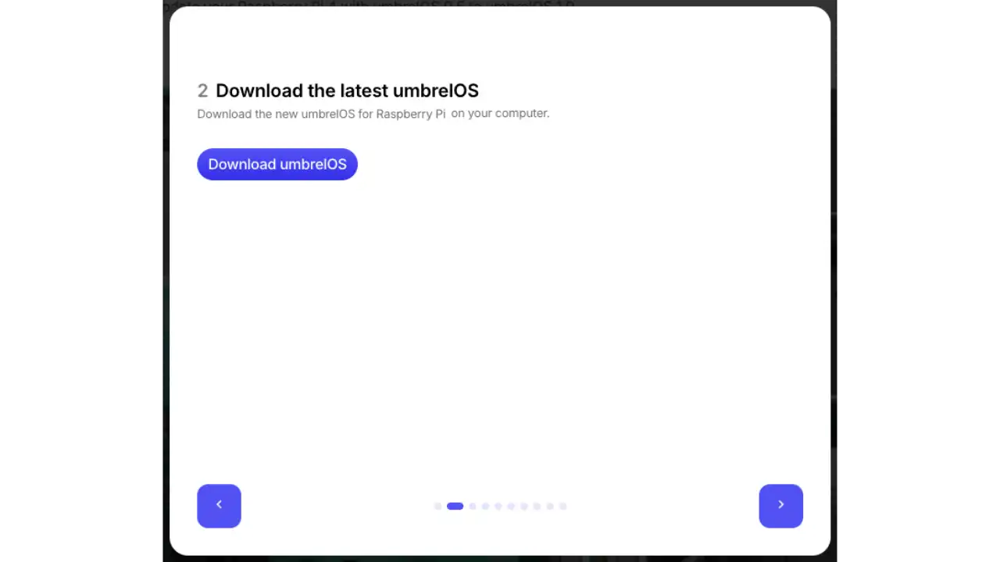
- Rendez-vous sur le [site officiel](https://github.com/getumbrel/umbrel/wiki/Install-umbrelOS-on-a-Raspberry-Pi-5)
- Téléchargez la dernière version d'UmbrelOS pour Raspberry Pi 5

**Installation de Balena Etcher**

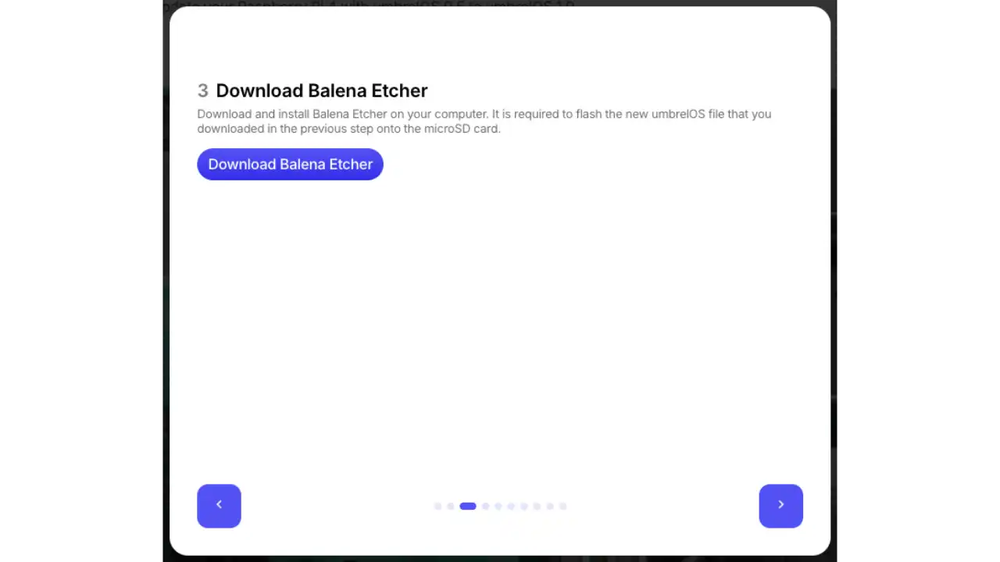
- Téléchargez et installez [Balena Etcher](https://www.balena.io/etcher/) sur votre ordinateur

**Préparation de la carte microSD**

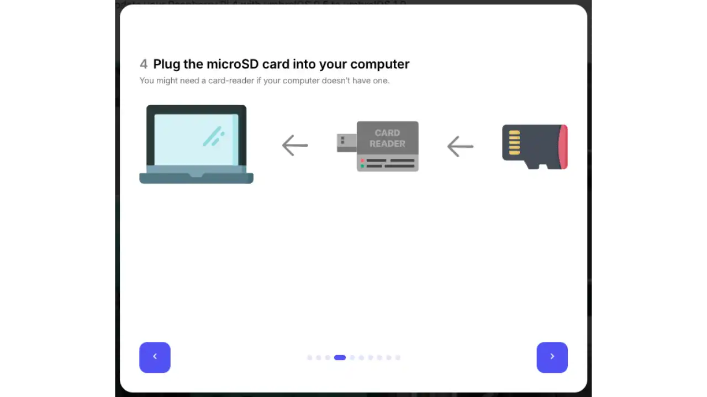
- Insérez votre carte microSD dans le lecteur de votre ordinateur

**Flashage de l'image**

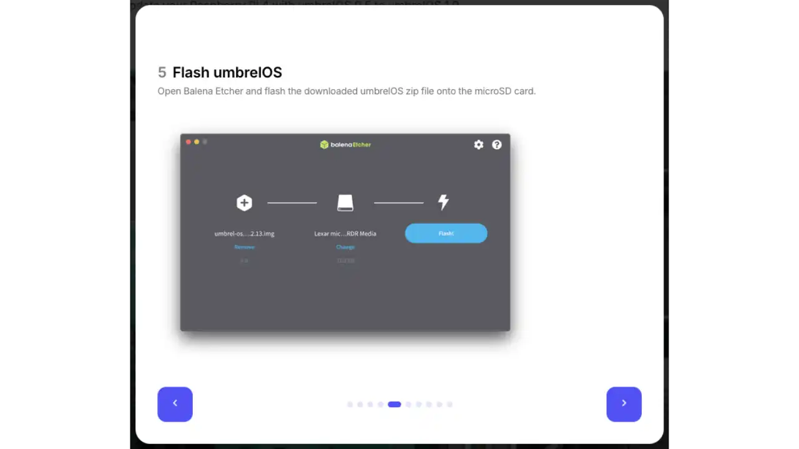
- Lancez Balena Etcher
- Sélectionnez l'image UmbrelOS téléchargée
- Choisissez votre carte microSD comme destination
- Cliquez sur "Flash!" et attendez la fin du processus
- Éjectez la carte en toute sécurité

**Installation de la carte microSD**

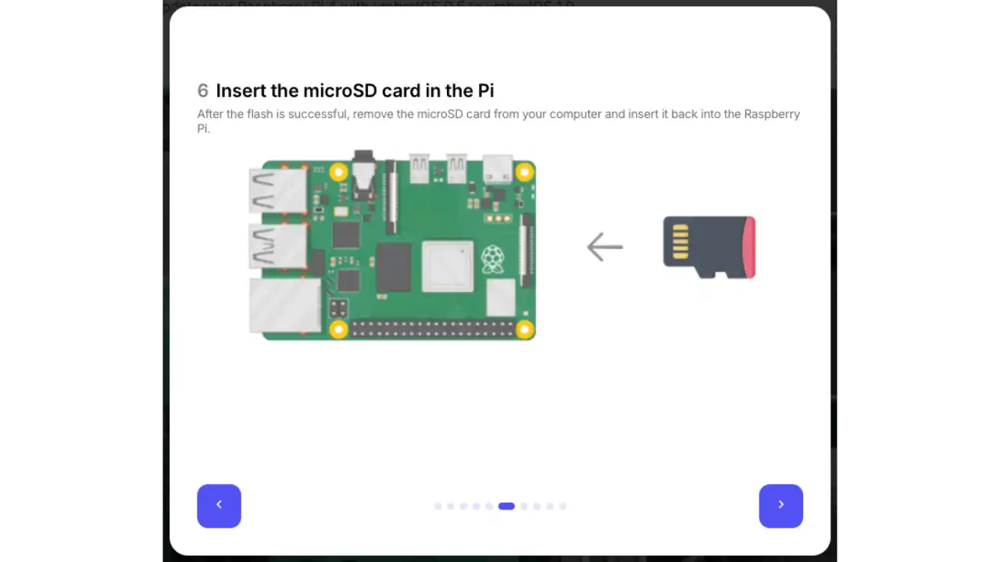
- Insérez la carte microSD dans votre Raspberry Pi 5

**Connexion des périphériques**

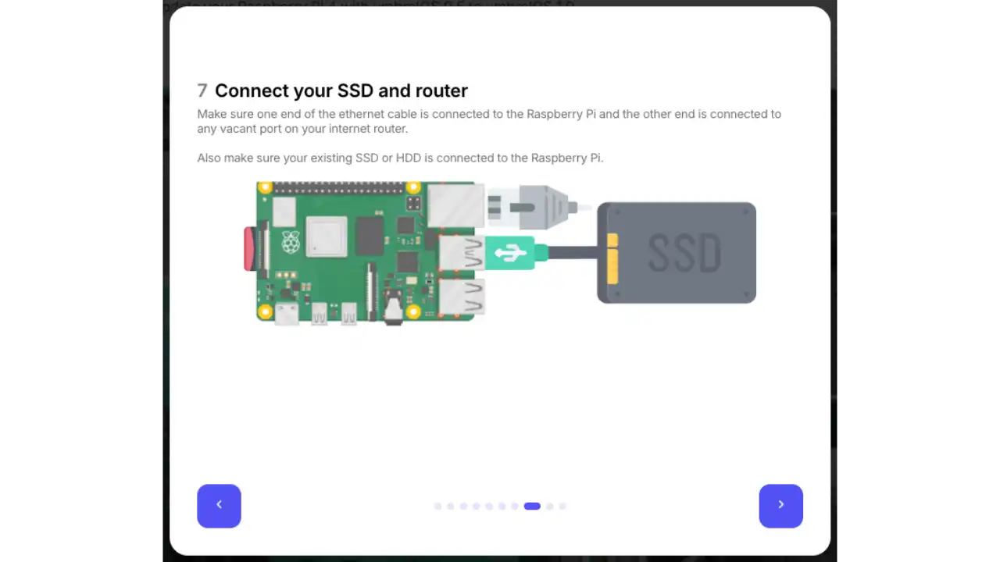
- Connectez le SSD externe à un port USB disponible
- Branchez le câble Ethernet entre le Pi et votre routeur

**Mise sous tension**

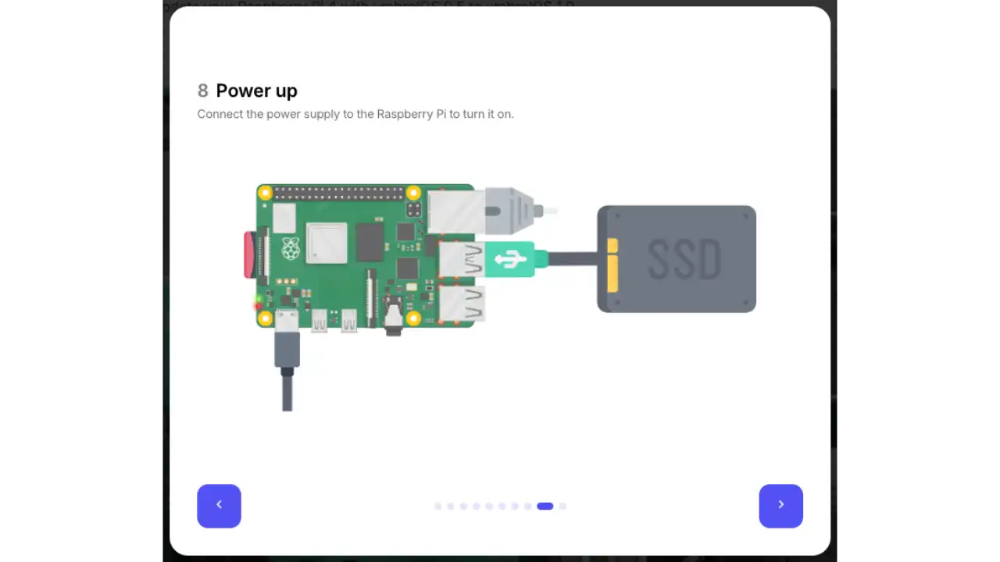
- Branchez l'alimentation officielle Raspberry Pi
- Attendez quelques minutes que le système démarre

**Premier accès**

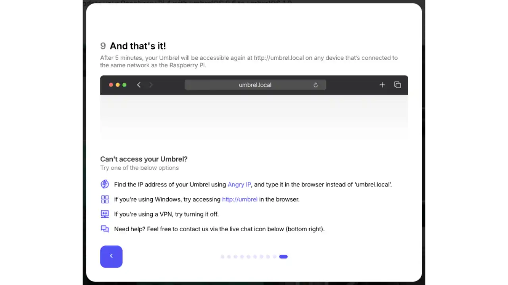
- Sur un appareil connecté au même réseau, ouvrez votre navigateur
- Accédez à l'interface web d'Umbrel via : `http://umbrel.local`
  
   

Si `umbrel.local` ne fonctionne pas, vous devrez trouver l'adresse IP de votre Raspberry Pi sur votre réseau local. Vous pouvez :
- Consulter l'interface de votre routeur
- Utiliser un scanner de réseau comme nmap
- Utiliser la commande `arp -a` dans le terminal de votre ordinateur

## Premier pas sur Umbrel

Une fois votre Umbrel démarré et accessible via votre navigateur, suivez ces étapes pour commencer :

### Configuration initiale

**Création de votre compte**

- Choisissez un nom d'utilisateur
- Définissez un mot de passe sécurisé
- Ces identifiants seront nécessaires pour accéder à votre Umbrel

**Confirmation du compte**

- Cliquez sur "Next" pour accéder à votre tableau de bord

**Découverte de l'interface**

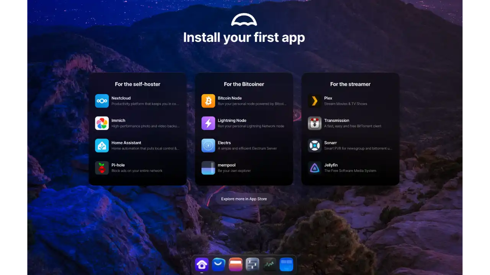
- Vous accédez à l'App Store d'Umbrel
- Découvrez les nombreuses applications disponibles
- Commençons par installer les applications essentielles pour Bitcoin

### Installation des applications Bitcoin

**Bitcoin Node**

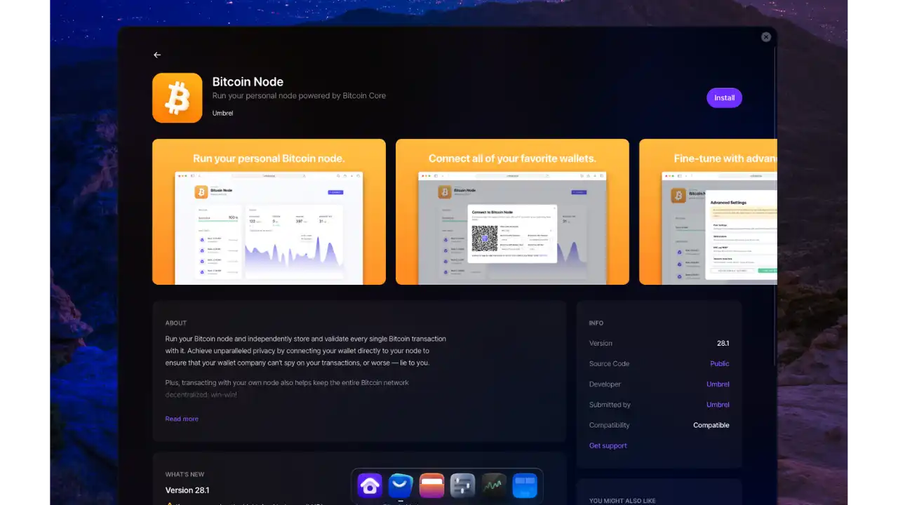
- Première application à installer
- Télécharge et vérifie l'intégralité de la blockchain Bitcoin

**Electrs**

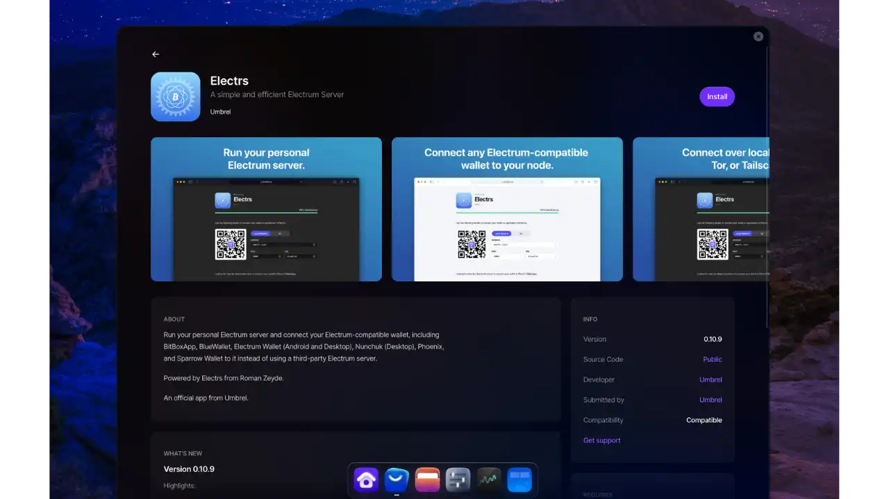
- Serveur Electrum permettant la connexion de wallets Bitcoin
- Se synchronise avec votre nœud Bitcoin

**Mempool**

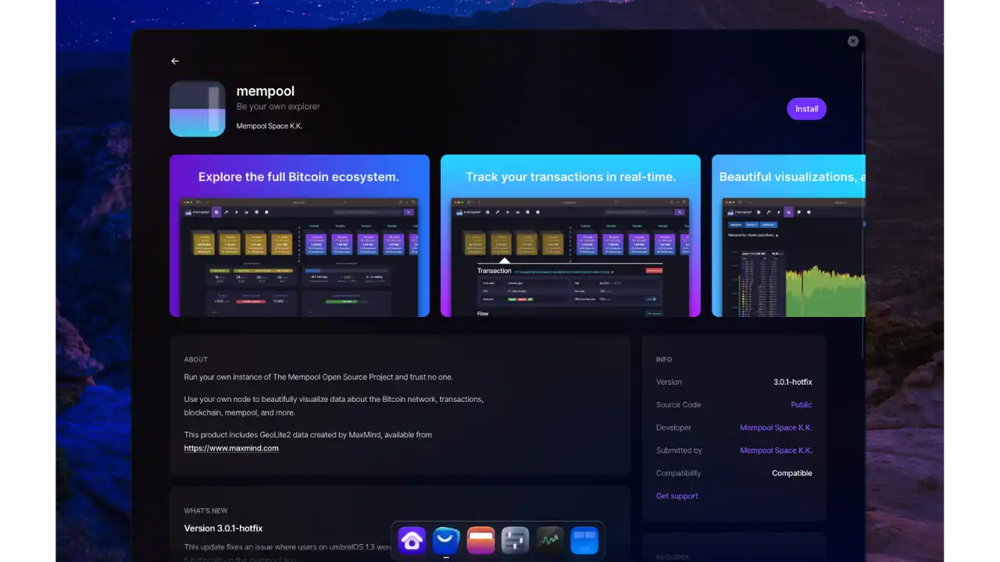
- Interface de visualisation de la blockchain
- Permet de suivre les transactions et les blocs en temps réel

## Connexion d'un wallet Bitcoin à votre nœud

### Configuration d'Electrs

**Connexion locale**

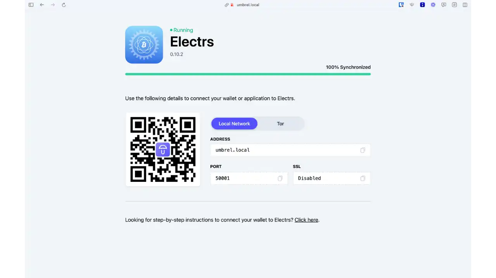
- Pour une utilisation sur votre réseau local
- Plus rapide et plus simple à configurer

**Connexion distante via Tor**

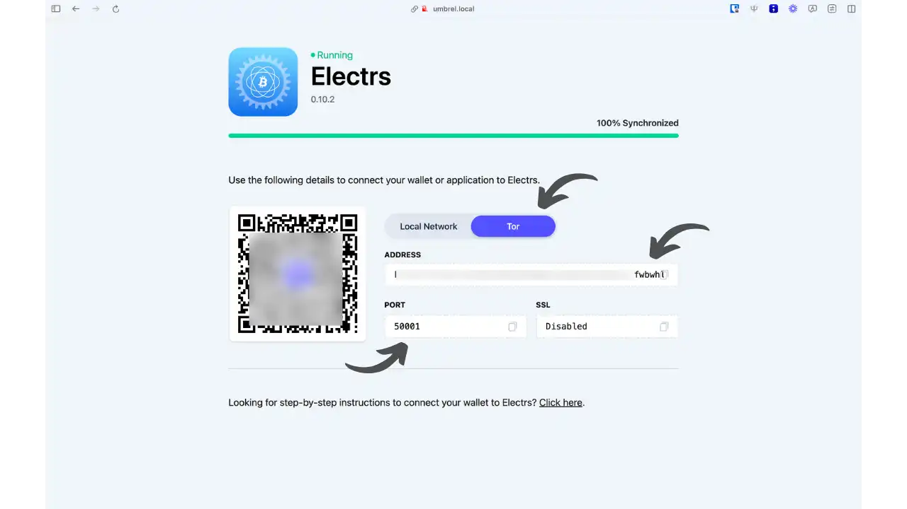
- Pour accéder à votre nœud depuis n'importe où
- Plus sécurisé et privé

### Connexion avec Sparrow Wallet

**Accès aux paramètres**

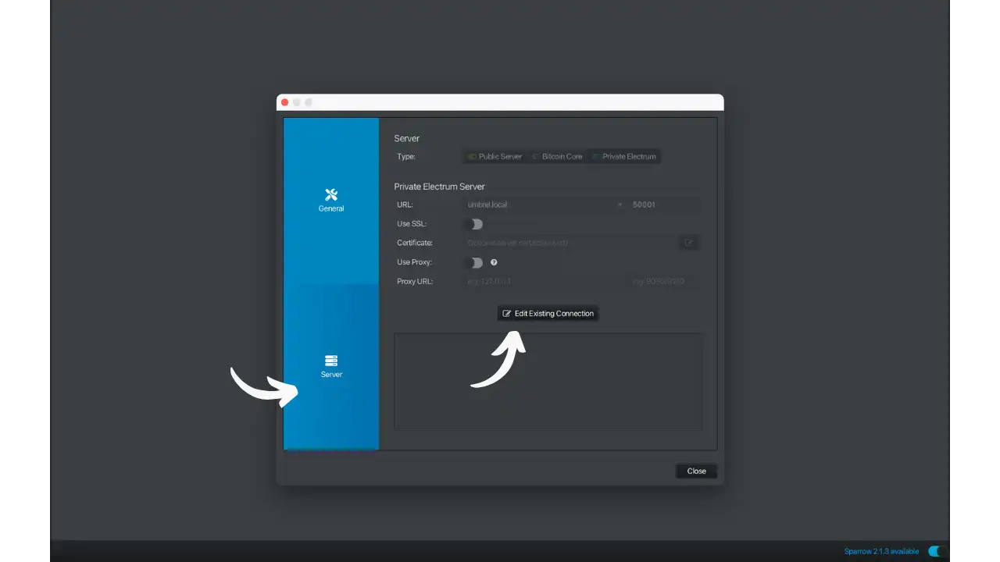
- Ouvrez Sparrow Wallet
- Allez dans Préférences > Serveur
- Cliquez sur "Modifier la connexion existante"

**Choix du type de connexion**

Sparrow propose trois modes de connexion :

***Public Server***
- Connexion à des serveurs publics (ex: blockstream.info, mempool.space)
- Simple mais moins privé

***Bitcoin Core***
- Connexion directe à un nœud Bitcoin
- Privé mais plus lent

***Private Electrum***
- Connexion à votre serveur Electrs
- Combine confidentialité et performance

**Configuration d'Electrs**

Choisissez votre type de connexion en utilisant les informations affichées dans l'application Electrs que nous avons vue précédemment :

Dans les deux cas, laissez les options "Use SSL" et "Use proxy" décochées.

**Connexion locale**
   Hôte : umbrel.local
   Port : 50001

**Connexion distante (Tor)**
   Hôte : [votre-adresse-onion]
   Port : 50001
   
La connexion via Tor est nécessaire si vous souhaitez accéder à votre nœud en dehors de votre réseau local.

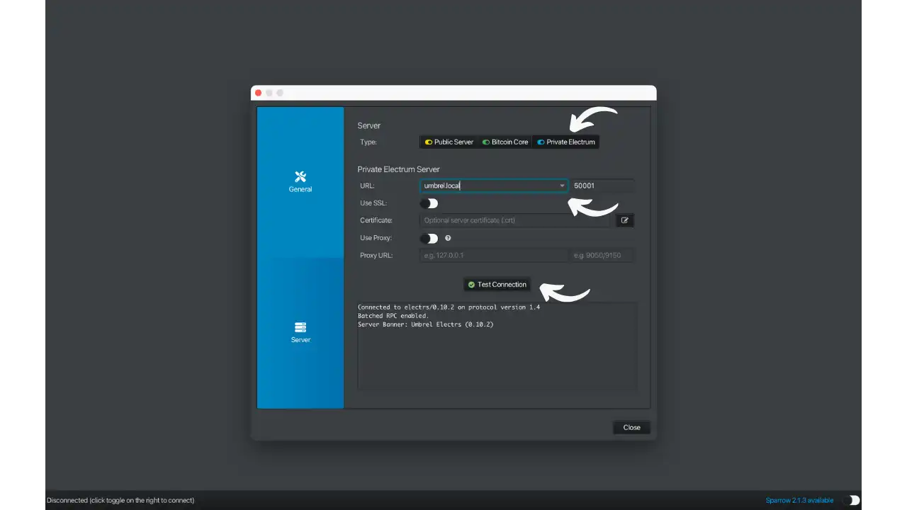

## Conclusion

Votre Umbrel est maintenant prêt à être utilisé. Vous participez activement au réseau Bitcoin tout en gardant le contrôle total de vos données. N'hésitez pas à explorer les nombreuses autres applications disponibles dans l'App Store d'Umbrel pour étendre les capacités de votre serveur domestique.

## Ressources utiles

### Documentation officielle
- [Site officiel Umbrel](https://umbrel.com)
- [Documentation Umbrel](https://github.com/getumbrel/umbrel/wiki)
- [App Store Umbrel](https://apps.umbrel.com)

### Applications Bitcoin
- [Bitcoin Core](https://bitcoin.org/fr/)
- [Electrs](https://github.com/romanz/electrs)
- [Mempool](https://mempool.space)
- [Sparrow Wallet](https://sparrowwallet.com)

### Communauté
- [Forum Umbrel](https://community.getumbrel.com)
- [GitHub Umbrel](https://github.com/getumbrel)
- [Twitter Umbrel](https://twitter.com/umbrel)

