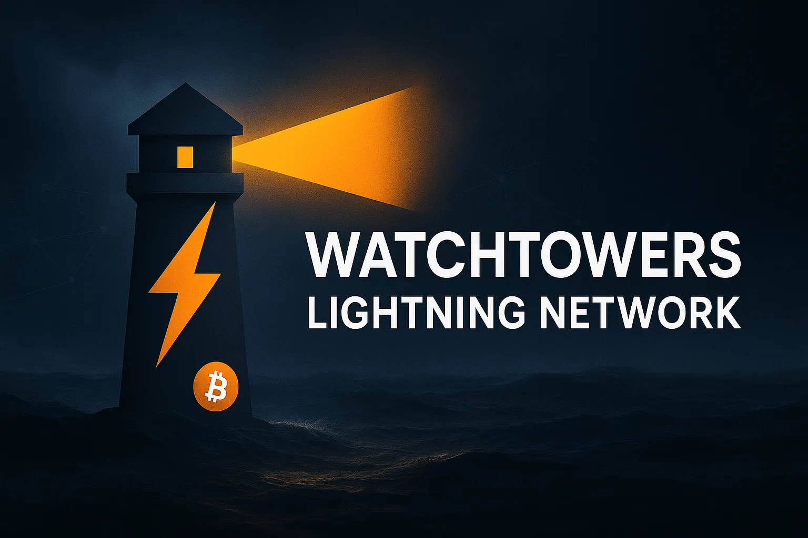
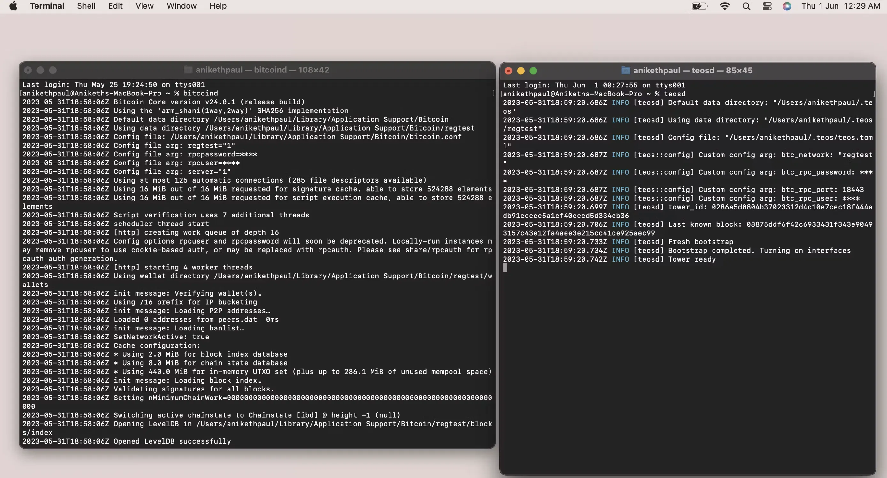
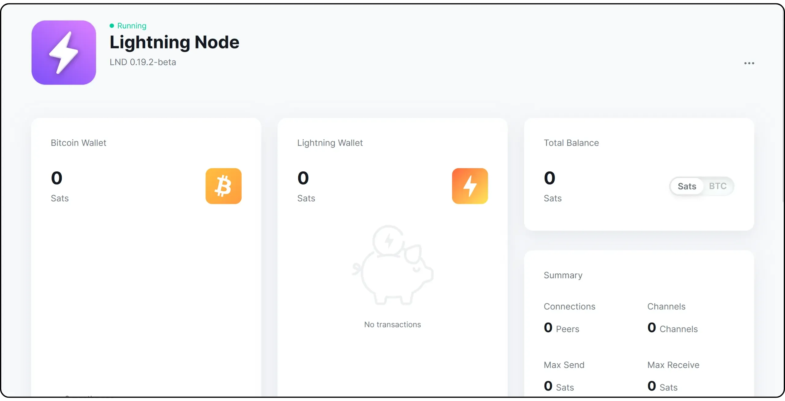
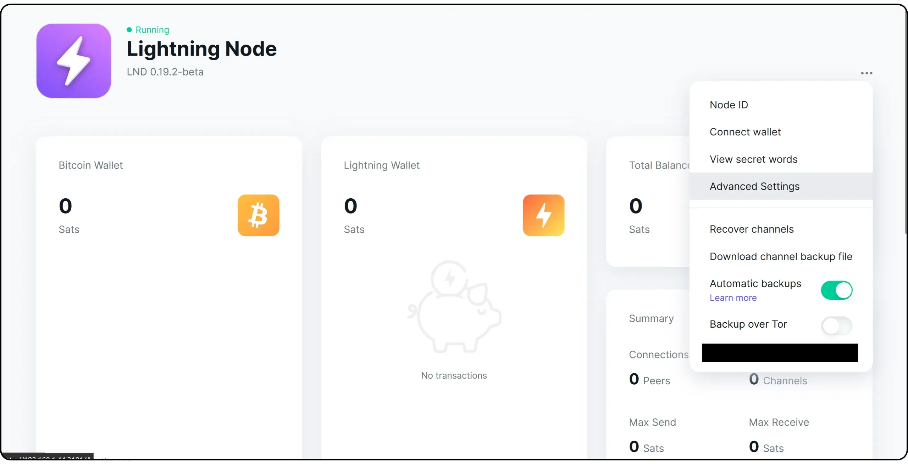
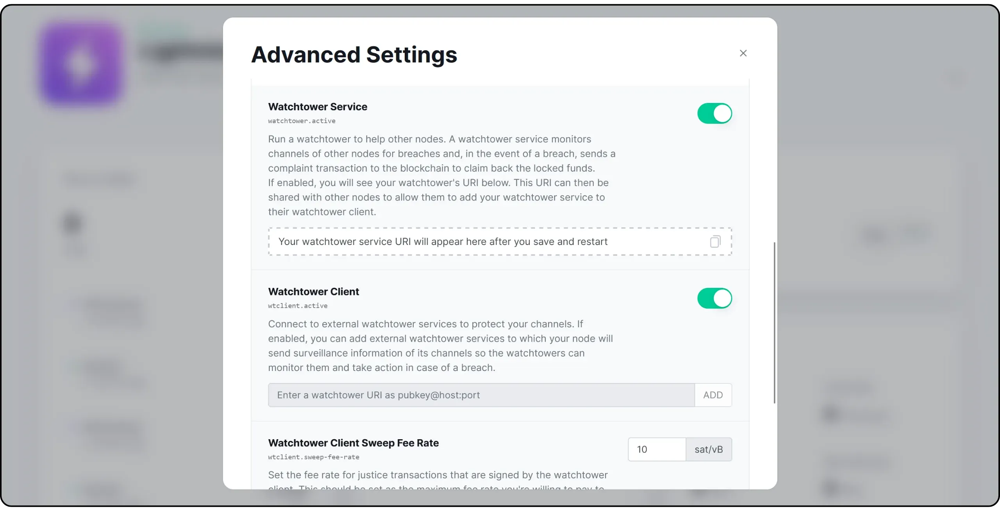
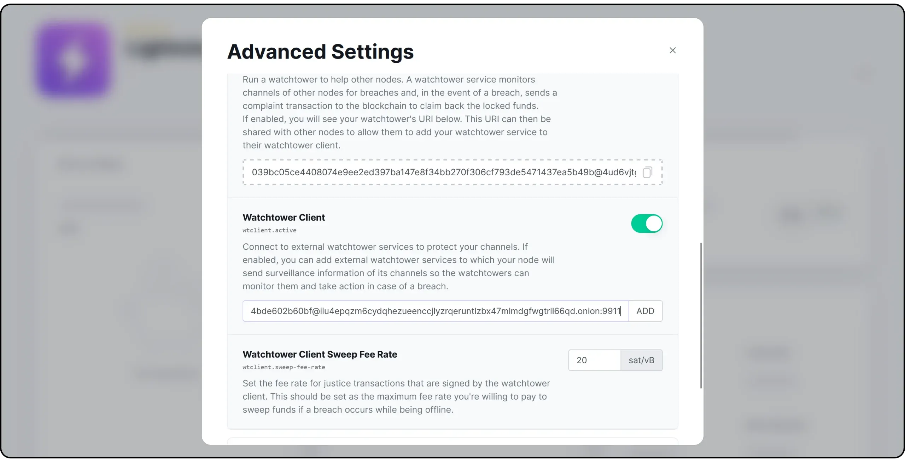
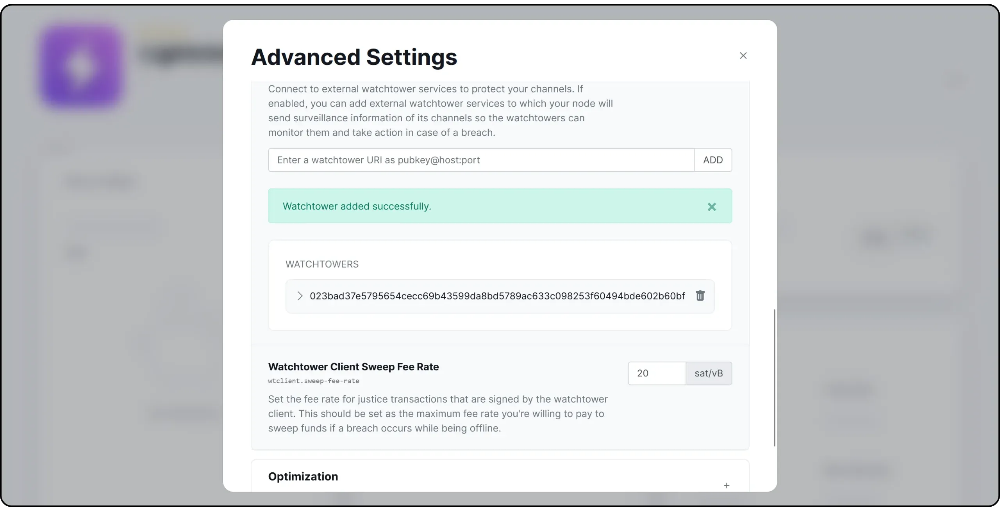

## Comment fonctionnent les Watchtowers ?

Élément essentiel de l’écosystème du Lightning Network, les _Watchtowers_ offrent un degré de protection supplémentaire aux canaux Lightning des utilisateurs. Leur responsabilité principale est de surveiller l’état des canaux et d’intervenir si l’une des parties du canal tente de frauder l’autre.

Comment une watchtower peut-elle déterminer si un canal a été compromis ? Elle reçoit du client (l’une des parties du canal) les informations nécessaires pour identifier correctement et traiter toute violation. Ces informations incluent fréquemment les détails de la transaction la plus récente, l’état actuel du canal, ainsi que les éléments requis pour créer des transactions de pénalité. Avant de transmettre ces données à la watchtower, le client peut les chiffrer afin de préserver la confidentialité et le secret. Ainsi, même si la watchtower reçoit les données, elle ne pourra pas les déchiffrer tant qu’une violation n’aura pas réellement eu lieu. Ce mécanisme de chiffrement protège la vie privée du client et empêche la watchtower d’accéder à des informations sensibles sans autorisation.

Dans ce tutoriel, vous trouverez 3 manière d'utiliser une watchtower : la manière classique et brute via LND, puis une autre manière avec Eye of Satoshi, et enfin, en dernière partie, comment setup facilemment une watchtower sur votre noeud Lightning hébergé sur Umbrel.


## 1 - Configurer une Watchtower ou un client via LND


## 2 - Installer votre propre Eye of Satoshi

L’Eye of Satoshi ([RUST-TEOS](https://github.com/talaia-labs/rust-teos)) est une watchtower Lightning non-dépositaire, conforme à [BOLT 13](https://github.com/sr-gi/bolt13/blob/master/13-watchtowers.md?ref=blog.summerofbitcoin.org). Elle se compose de deux éléments principaux :

- **teos** : inclut une interface en ligne de commande (CLI) et les fonctionnalités serveur essentielles de la tour. Deux binaires — **teosd** et **teos-cli** — sont produits lors de la compilation de ce _crate_.

- **teos-common** : inclut des fonctionnalités partagées côté serveur et côté client (utile pour créer un client).

Pour exécuter la tour correctement, vous devez faire tourner **bitcoind** avant de lancer la tour avec la commande **teosd**. Avant d’exécuter ces deux commandes, vous devez configurer votre fichier **bitcoin.conf**. Voici les étapes à suivre :

- Installez Bitcoin Core depuis les sources ou téléchargez-le. Après le téléchargement, placez le fichier **bitcoin.conf** dans le répertoire utilisateur de Bitcoin Core. Consultez ce lien pour plus d’informations sur l’emplacement où placer le fichier, car cela dépend du système d’exploitation utilisé.

- Une fois l’emplacement identifié, ajoutez les options suivantes :

```
# RPC
server=1
rpcuser=<your-user>
rpcpassword=<your-password>

# chaîne
regtest=1
```

- **server** : pour les requêtes RPC

- **rpcuser** et **rpcpassword** : authentification des clients RPC auprès du serveur

- **regtest** : non requis, mais utile si vous prévoyez du développement.

Les valeurs de **rpcuser** et **rpcpassword** sont à choisir par vous-même. Elles doivent être écrites sans guillemets. Par exemple :

```
rpcuser=aniketh
rpcpassword=strongpassword
```

À présent, si vous lancez **bitcoind**, le nœud devrait démarrer.

- Pour la partie tour, vous devez d’abord installer **teos** depuis les sources. Suivez les instructions données dans ce lien.

- Après avoir installé **teos** avec succès sur votre système et exécuté les tests, vous pouvez passer à la dernière étape : configurer le fichier **teos.toml** dans le répertoire utilisateur de teos. Le fichier doit être placé dans un dossier nommé **.teos** (notez le point) sous votre répertoire personnel. Par exemple, **/home//.teos** sous Linux. Une fois l’emplacement trouvé, créez un fichier **teos.toml** et définissez ces options en cohérence avec les changements effectués sur **bitcoind** :

```
# bitcoind
btc_network = "regtest"
btc_rpc_user = <your-user>
btc_rpc_password = <your-password>
```

Notez qu’ici, le nom d’utilisateur et le mot de passe doivent être écrits **entre guillemets**. En reprenant l’exemple précédent :

```
btc_rpc_user = "aniketh"
btc_rpc_password = "strongpassword"
```

Une fois cela fait, vous devriez être prêt à lancer la tour. Étant donné que nous tournons sur **regtest**, il est probable qu’aucun bloc n’ait été miné sur notre réseau de test Bitcoin lors de la première connexion de la tour (s’il y en a, quelque chose cloche). La tour construit un cache interne des 100 derniers blocs de **bitcoind** ; ainsi, lors du premier lancement, vous pourriez obtenir l’erreur suivante :

```
ERROR [teosd] Not enough blocks to start the tower (required: 100). Mine at least 100 more
```

Comme nous utilisons **regtest**, nous pouvons miner des blocs en émettant une commande RPC, sans avoir à attendre le délai médian de 10 minutes que l’on observe sur d’autres réseaux (comme mainnet ou testnet). Consultez l’aide de **bitcoin-cli** pour savoir comment miner des blocs.



C’est tout : vous avez exécuté la watchtower avec succès. Félicitations. 🎉


## 3 - Configurer une Watchtower sur Umbrel

Sur Umbrel, se connecter à une Watchtower pour protéger votre nœud Lightning est extrêmement simple, car tout se fait via l’interface graphique. Après vous être connecté à distance à votre nœud, ouvrez l’application "**Lightning Node**".



Cliquez sur les trois petits points situés en haut à droite de l’interface, puis sélectionnez "**Advanced Settings**".  



Dans le menu "**Watchtower**", deux options sont disponibles :

- **Watchtower Service** : cette option permet d’exploiter une watchtower, c’est-à-dire un service surveillant les canaux d’autres nœuds afin de détecter toute tentative de fraude. En cas de violation, votre watchtower publie une transaction sur la blockchain pour permettre aux utilisateurs qui l’emploient de récupérer leurs fonds verrouillés. Une fois activée, l’URI de votre watchtower apparaît et peut être communiqué à d’autres nœuds pour qu’ils l’ajoutent à leur client watchtower ;

- **Watchtower Client** : cette option permet de se connecter à des watchtowers externes afin de protéger vos propres canaux. Une fois activée, vous pouvez ajouter des services de watchtower auxquels votre nœud transmettra les informations nécessaires sur ses canaux. Ces watchtowers surveilleront alors leur état et interviendront en cas de tentative de fraude.

La priorité pour vous est bien sûr d’activer le *Watchtower Client* afin de protéger votre nœud, mais je vous recommande également d’activer le *Watchtower Service* pour contribuer à la sécurité d’autres utilisateurs en retour.



Cliquez ensuite sur le bouton vert "**Save and Restart Node**". Votre LND redémarrera.  

Dans le même menu, vous trouverez ensuite l’URI de votre service Watchtower si vous l’avez activé. Vous pourrez surtout ajouter l’URI d’une Watchtower externe pour protéger vos canaux. Cliquez sur "**ADD**" pour confirmer.  



Il existe plusieurs Watchtowers disponibles en ligne. Par exemple, [LN+ et Voltage proposent une Watchtower altruiste](https://lightningnetwork.plus/watchtower) à laquelle vous pouvez vous connecter :

```
023bad37e5795654cecc69b43599da8bd5789ac633c098253f60494bde602b60bf@iiu4epqzm6cydqhezueenccjlyzrqeruntlzbx47mlmdgfwgtrll66qd.onion:9911
```



Une autre option consiste à échanger votre URI de Watchtower avec vos amis bitcoiners, afin que chacun protège le nœud de l’autre.

Je vous recommande également de configurer plusieurs Watchtowers pour réduire les risques en cas d’indisponibilité de l’une d’entre elles.

Enfin, vous pouvez ajuster le paramètre "**Watchtower Client Sweep Fee Rate**". Il définit le taux de frais maximum que vous êtes prêt à payer pour qu’une transaction de punition diffusée par la Watchtower soit incluse dans un bloc. Veillez à définir une valeur suffisamment élevée et adaptée aux montants verrouillés dans vos canaux.
