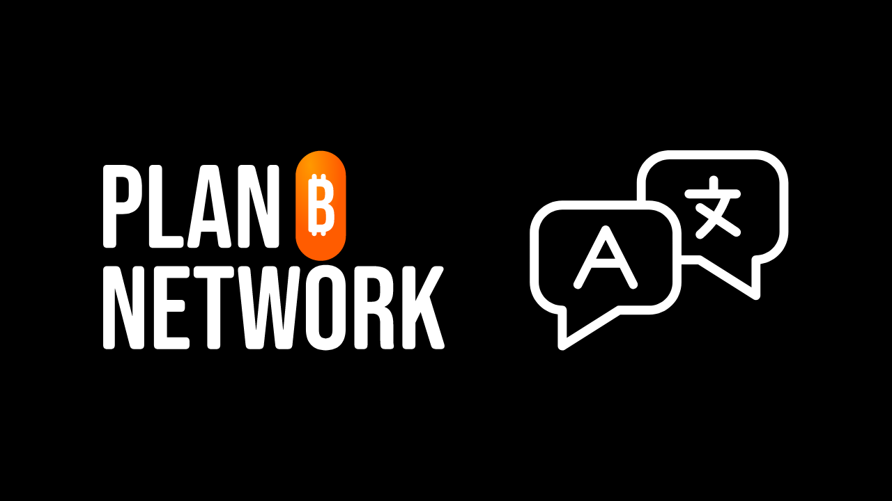
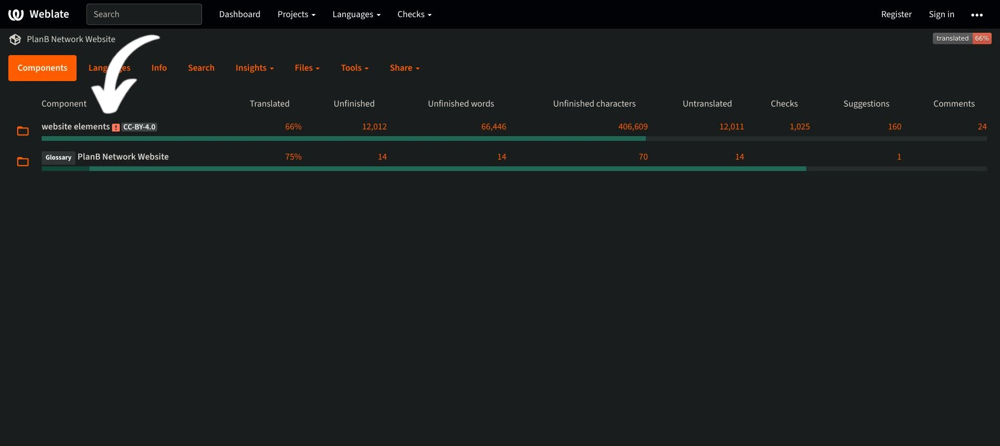
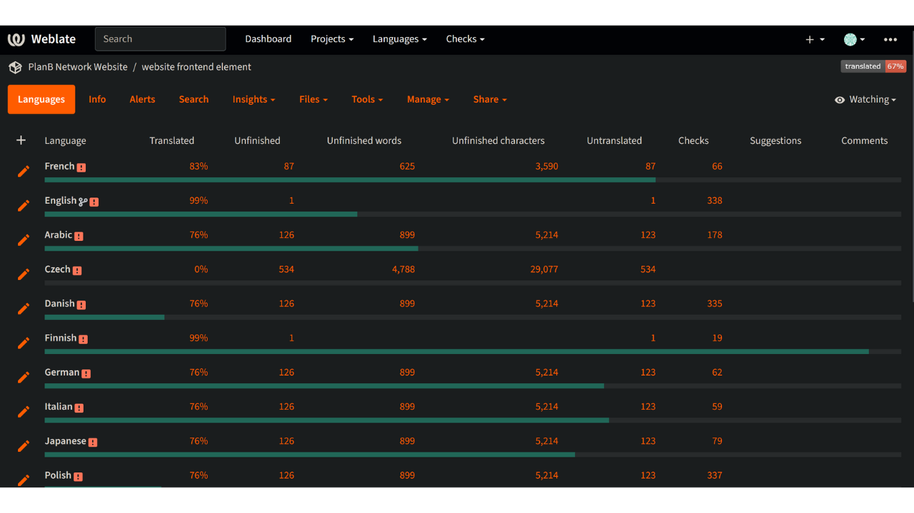
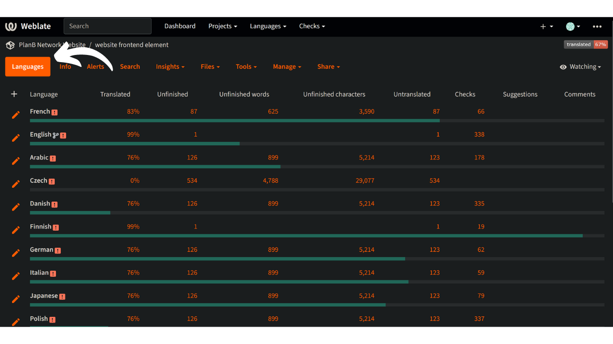
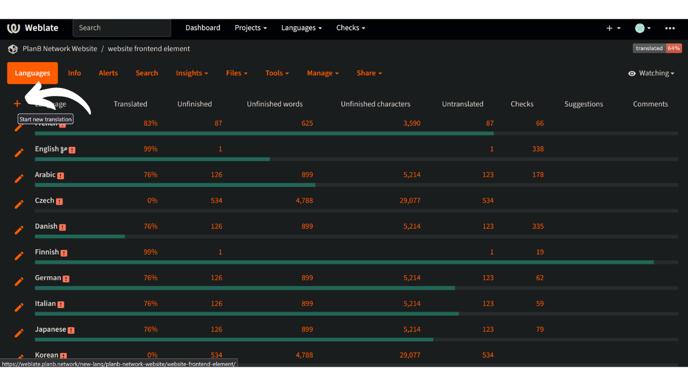
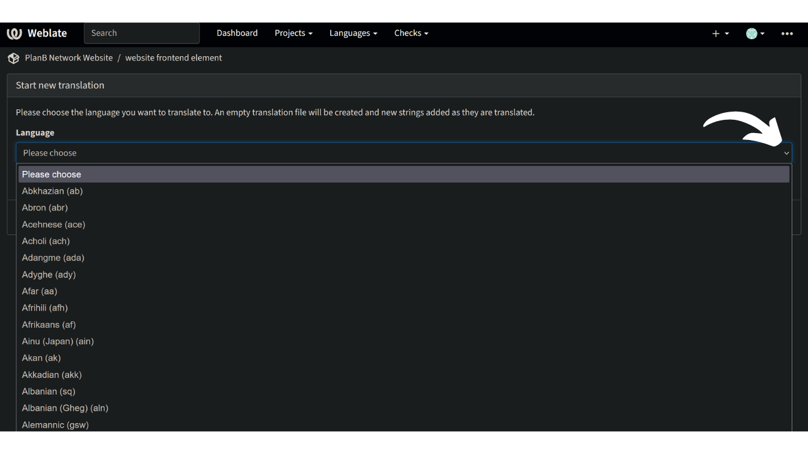
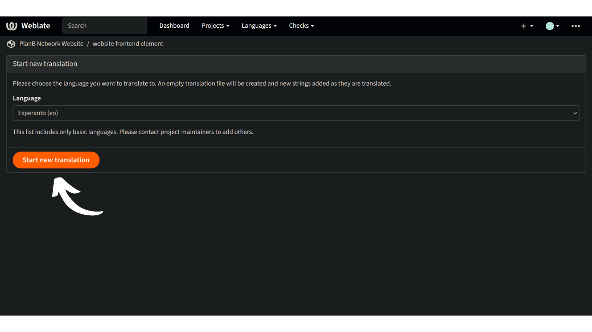
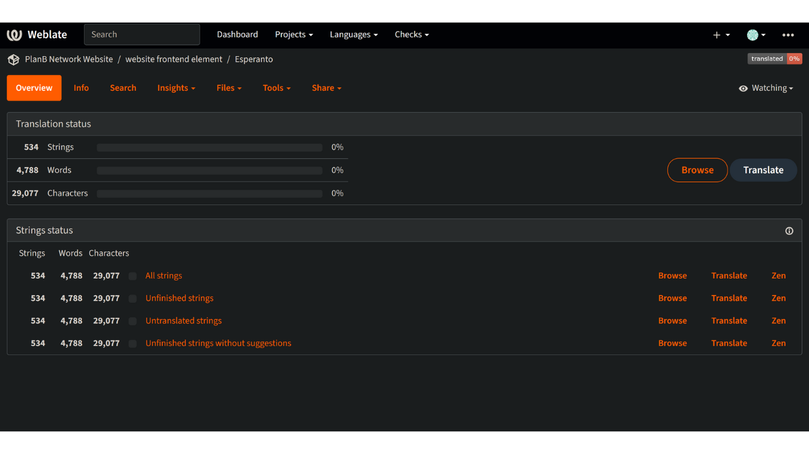
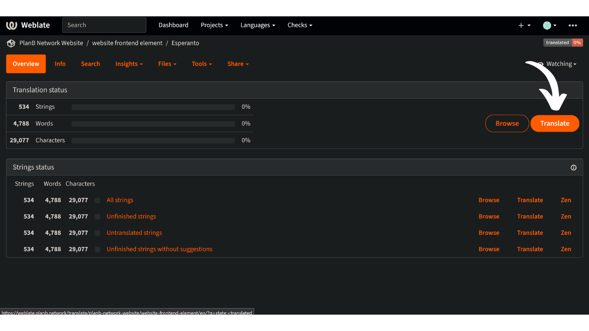

Plan ₿ Network's mission is to provide first-class educational resources on Bitcoin and translate them into as many languages as possible. Much of the content published on the site is open-source and hosted on GitHub, allowing anyone to participate in enriching the platform. Contributions can take various forms: correcting and proofreading existing content, updating information, or creating new tutorials to add on the platform.

Our website already offers a variety of languages, and we are constantly working to expand this selection. To streamline the translation of our frontend, we utilize the Weblate tool, which facilitates collaboration and organizes translations. It's a very simple tool.

If your native language is not yet available on our site and you would like to add it, this tutorial is for you!

First, make sure to contact the Plan ₿ Network team via our [Telegram group](https://t.me/PlanBNetwork_ContentBuilder). If you don't have telegram, you can send an e-mail to mari@planb.network. Make sure to write a small presentation about who you are and the languages you speak.

## Checking for the Presence of a Language on Plan ₿ Network

To check if your language is not already among those we are working on.

- Go to [our Weblate platform](https://weblate.planb.network/projects/planb-network-website/):

- In the `Website elements` menu, you will find a list of all the languages in progress:

If your language is in this list, you do not need to add it again. To contribute by proofreading the weblate, discover the following tutorial:

https://planb.network/tutorials/others/contribution/translate-front-weblate-8213b931-650f-4efd-8f4e-9a8ae5ce6295

If your language is not there, follow the tutorial below to add it.

## Adding a New Language to Plan ₿ Network

- The first step is to create an account on Weblate. You can follow our detailed guide below:

https://planb.network/tutorials/others/contribution/translate-front-weblate-8213b931-650f-4efd-8f4e-9a8ae5ce6295

- Once your account is created, go to the `Website elements` menu and select the `Languages` tab:

- Click on the `+` on the upper left of the window:

- Open the dropdown list and select the language you wish to add. If the language you are looking for is not available in the dropdown list, you can reach out on the [Telegram group](https://t.me/PlanBNetwork_ContentBuilder) so our team can create it manually:

- Click on `Start new translation`:

- You will then arrive on the translation management page for your language:

- To start translating the frontend, click on the `Translate` button: 
To be guided through the translation process, check out our dedicated tutorial on this topic!

Congratulations, you have started the process of translating stating elements of Plan ₿ Network's website!

https://planb.network/tutorials/others/contribution/translate-front-weblate-8213b931-650f-4efd-8f4e-9a8ae5ce6295

The static elements include all the strings on the website, except the educational content (courses, tutorials...) for which we use another semi-automated method (AI translation + contributors proofreading).

A big thank you for your valuable contribution! :)