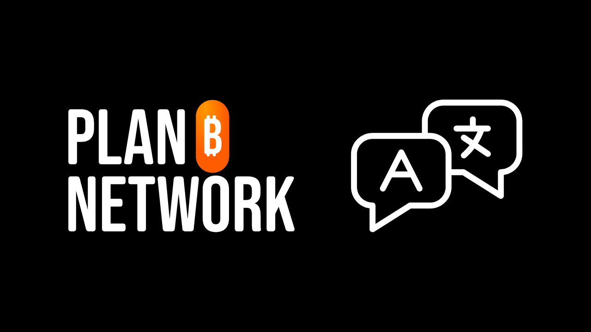
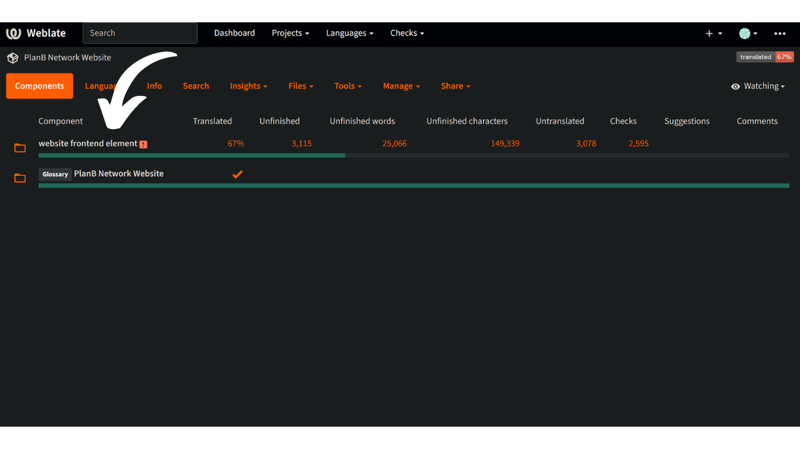
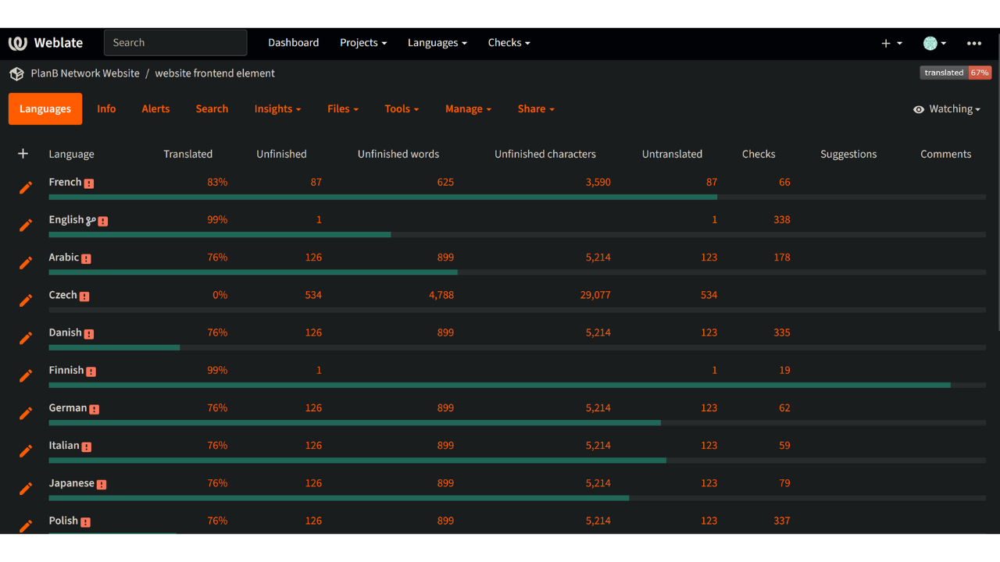
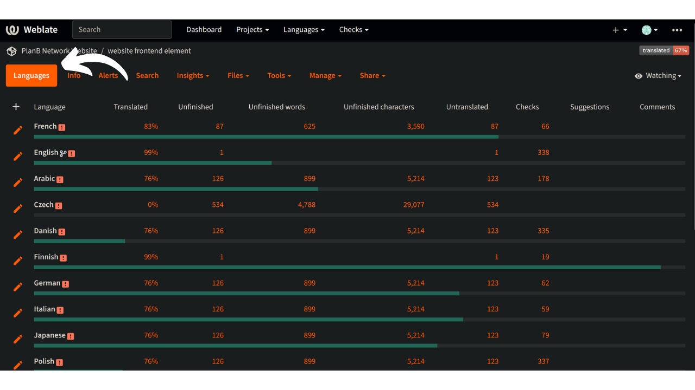
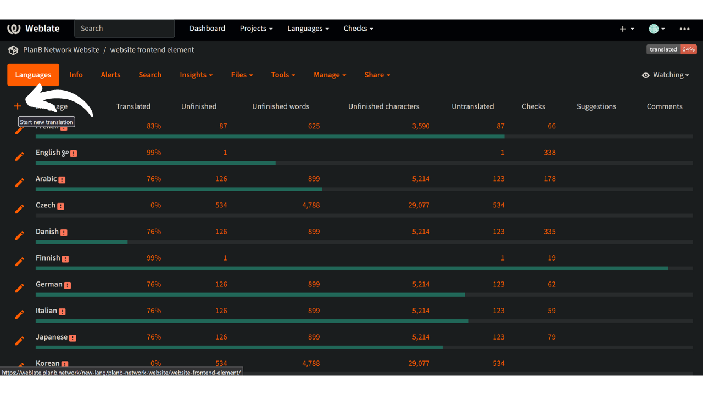
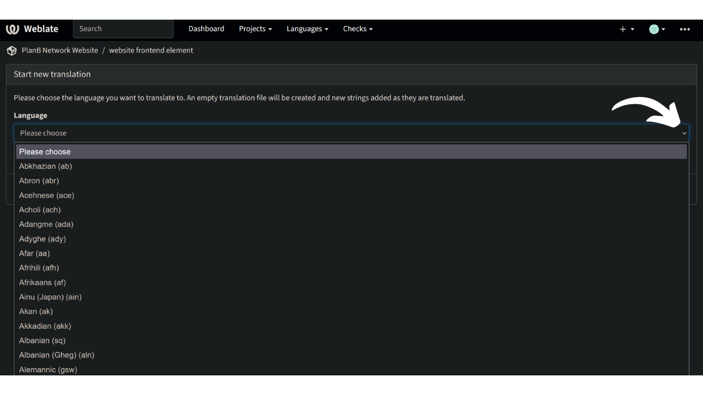
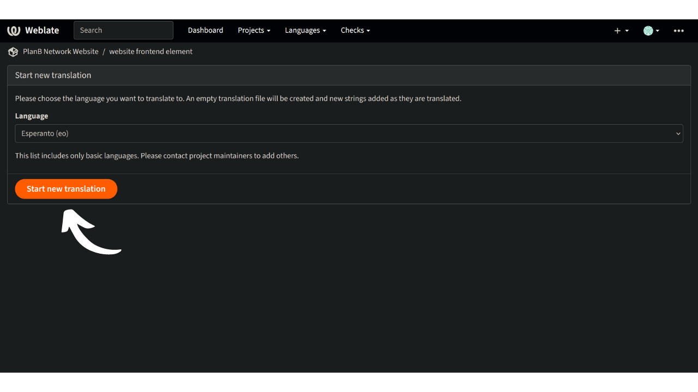
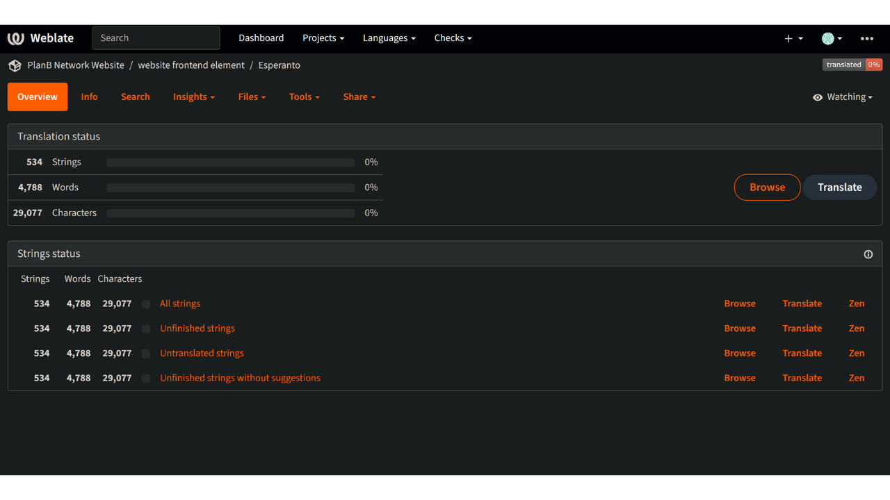
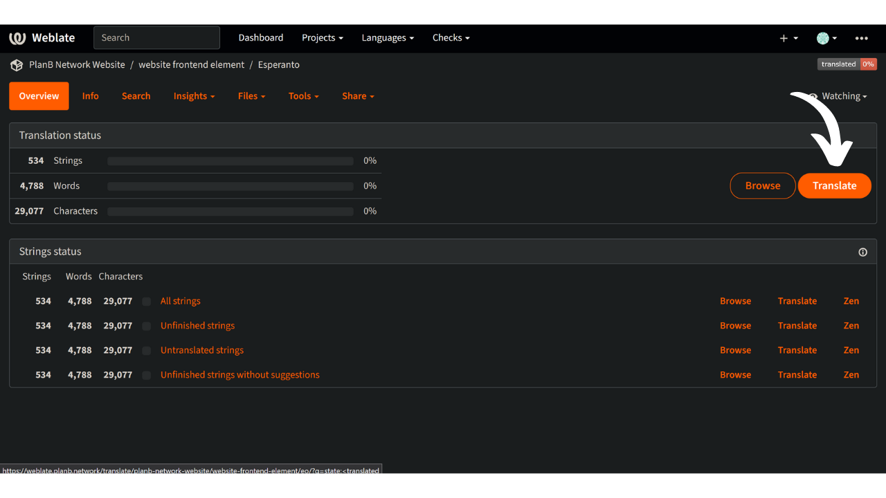

PlanBのミッションは、できるだけ多くの言語でBitcoinに関する最高級の教育リソースを提供することです。サイトに公開されているすべてのコンテンツはオープンソースであり、GitHub上でホストされているため、誰でもプラットフォームを豊かにするために参加することができます。貢献は、既存のテキストの修正や校正、他の言語への翻訳、情報の更新、またはまだ当サイトにない新しいチュートリアルの作成など、さまざまな形を取ることができます。

PlanBでは、すでに多くの言語がウェブサイトで利用可能であり、新しい言語を追加するために継続的に作業しています。フロントエンドを効率的に翻訳するために、Weblateツールを使用しています。これは、協力を促進し、翻訳を整理する非常にシンプルなツールです。

もし、あなたの母国語がまだ当サイトで利用可能でなく、それを追加することで貢献したい場合、このチュートリアルはあなたのためのものです！

## PlanB Networkで言語の存在を確認する

最初のステップは、あなたの言語がすでに取り組んでいるものの中にないかを確認することです。

- [私たちのWeblateプラットフォーム](https://weblate.planb.network/projects/planb-network-website/)にアクセスしてください：

- `Website frontend element`メニューで、私たちが取り組んでいるすべての言語のリストを見つけることができます：

もし、あなたの言語がこのリストにある場合、再度追加する必要はありません。既存の言語に貢献するために、[こちらのチュートリアルをご覧ください](https://planb.network/tutorials/others/translate-front-weblate)。

あなたの言語がそこにない場合は、以下のチュートリアルに従って追加してください。

## PlanB Networkに新しい言語を追加する

- 最初のステップは、Weblateにアカウントを作成することです。これがどのように行うかわからない場合は、[私たちの詳細なガイドに従ってください](https://planb.network/tutorials/others/translate-front-weblate)。
- アカウントが作成されたら、`Website frontend element`メニューに移動し、`Languages`タブを選択します：

- ウィンドウの左側にある`+`をクリックします：

- ドロップダウンリストを開き、PlanB Networkに作成したい言語を選択します。探している言語がドロップダウンリストにない場合は、Telegramで@asi0_flammeusに直接連絡して、手動で作成してもらうことができます：

- `Start new translation`ボタンをクリックします：

- そうすると、あなたの言語の翻訳管理ページに到着します：

- すぐにフロントエンドの翻訳を開始するには、`Translate`ボタンをクリックします： 
翻訳プロセスを通じてガイドされるには、[このトピックに関する専用のチュートリアルをチェックしてください](https://planb.network/tutorials/others/translate-front-weblate)！

おめでとうございます、新しい言語でPlanB Networkサイトの翻訳プロセスを開始しました！Weblateを通じて、ウェブサイト上のすべてのテキスト（コース、チュートリアルなどの教育コンテンツを除く）を含む、フロントエンド全体の翻訳から始めることができます。これには、私たちが別の半自動Humans x AI方法を使用している教育コンテンツは含まれません。
次に、Telegram上で@asi0_flammeusに連絡することができます。彼らは、モデルで自動翻訳されたいくつかのコースをレビューするお手伝いをします。これらのコンテンツが満足できると判断された場合、サイト上の他のすべてのコンテンツ（コース、チュートリアルなど）のレビューに進むことができます。これらのステップが完了すると、新しい言語をPlanB Networkウェブサイトに正式に統合することを検討できます。これにより、あなたの言語の話者全員が、障壁なくBitcoinに関する質の高いコンテンツにアクセスできるようになります。
貴重な貢献に心から感謝します！:)