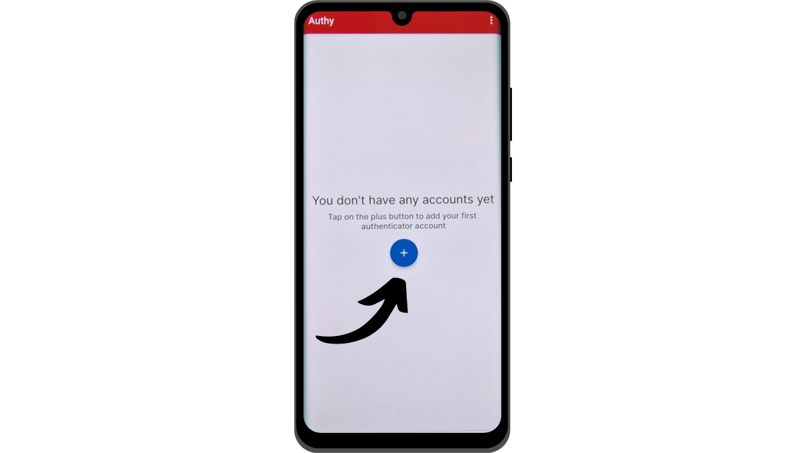

V dnešní době se dvoufaktorová autentizace (2FA) stala nezbytnou pro zvýšení bezpečnosti online účtů proti neautorizovanému přístupu. S nárůstem kybernetických útoků je někdy nedostatečné spoléhat pouze na heslo pro zabezpečení vašich účtů. 2FA přidává další vrstvu zabezpečení vyžadováním druhé formy autentizace kromě hesla. Tato ověření mohou nabývat různých forem, jako je kód zaslaný prostřednictvím SMS, dynamický kód generovaný dedikovanou aplikací nebo použití fyzického bezpečnostního klíče. Použití 2FA výrazně snižuje riziko kompromitace vašich účtů, i v případě, že by vaše heslo bylo ukradeno.

## 2FA prostřednictvím autentizačních aplikací

V dalších tutoriálech prozkoumáme jiná řešení, jako jsou fyzické bezpečnostní klíče, ale v tomto se konkrétně zaměříme na aplikace pro 2FA. Fungování těchto aplikací je poměrně jednoduché: když je na účtu aktivována 2FA, při každém přihlášení budete požádáni nejen o vaše obvyklé heslo, ale také o 6místný kód. Tento kód generuje vaše aplikace pro 2FA. Důležitou vlastností tohoto 6místného kódu je, že není statický; aplikace generuje nový kód každých 30 sekund.

Obnova kódu každých 30 sekund velmi ztěžuje útočníkovi přístup k vašemu účtu. Tento systém brání útočníkům v opětovném použití ukradeného nebo zachyceného kódu, protože rychle vyprší. Tedy, i kdyby útočník získal kód, mohl by ho použít pouze v krátkém časovém okně, než bude vyžadován nový kód. Navíc fakt, že se kód tak často mění, výrazně snižuje čas dostupný hackerovi, který se pokouší uhodnout kód metodou hrubé síly.

2FA prostřednictvím autentizačních aplikací tak představuje snadno použitelnou a bezplatnou metodu, jak výrazně zlepšit bezpečnost vašich online účtů.

Existuje mnoho aplikací pro nastavení 2FA, mezi kterými jsou nejznámější Google Authenticator a Microsoft Authenticator. V tomto tutoriálu bych vám však chtěl představit méně známé řešení s názvem Authy. Všechny tyto aplikace fungují na stejném protokolu TOTP (*Time based One Time Password*), což znamená, že jejich používání je velmi podobné.
Authy nabízí několik výhod oproti jiným řešením od velkých technologických společností. Především umožňuje synchronizovat vaše 2FA tokeny napříč více zařízeními, což se může hodit v případě ztráty nebo výměny telefonu. Authy také umožňuje vytvořit šifrovanou zálohu a uložit ji online, což zajišťuje, že nikdy neztratíte přístup k vašim tokenům, i když ztratíte své primární zařízení. Z pohledu uživatelského rozhraní osobně považuji, že Authy nabízí příjemnější a intuitivnější zážitek než jeho alternativy.

## Jak nainstalovat Authy?

Na vašem smartphonu přejděte do obchodu s aplikacemi (Google Play Store nebo Apple Store) a vyhledejte "*Twilio Authy Authenticator*".

- [Apple](https://apps.apple.com/us/app/twilio-authy/id494168017)
- [Android](https://play.google.com/store/apps/details?id=com.authy.authy)

Při prvním spuštění aplikace budete muset vytvořit účet. Vyberte kód vaší země a váš telefonní číslo, poté klikněte na "*Odeslat*".

Zadejte svou e-mailovou adresu pro obnovu kódu.
Na váš email bude odeslán email pro ověření vaší adresy. Zadejte 6 číslic, které obdržíte, pro potvrzení.

Vyberte jednu ze dvou dostupných metod pro ověření vašeho telefonního čísla. Pokud si vyberete příjem SMS, zadejte 6místný kód, který obdržíte zprávou, pro potvrzení vašeho čísla.

Gratulujeme, váš účet Authy byl vytvořen!

## Jak nastavit Authy?

Začněte tím, že přejdete do nastavení aplikace kliknutím na tři malé tečky umístěné v pravém horním rohu obrazovky.

Poté klikněte na "*Nastavení*".

V záložce "*Můj účet*" máte možnost upravit váš účet. Doporučuji přidat do aplikace PIN kód výběrem "*Ochrana aplikace*". To přidává další vrstvu zabezpečení pro přístup k vaší aplikaci.

V záložce "*Účty*" můžete nastavit zálohu pro vaše tokeny. Tato záloha umožňuje obnovu vašich kódů v případě problému. Je šifrována pomocí hesla, které musíte definovat. Je důležité, aby toto heslo bylo silné a uložené na bezpečném místě. Nastavení této zálohy není nutně povinné, pokud máte jiné metody obnovy, jako je například druhé zařízení se stejným účtem Authy.
V záložce "*Zařízení*" můžete vidět všechna zařízení synchronizovaná s vaším účtem Authy. Máte možnost zakázat používání více zařízení, což omezuje přístup k vašemu účtu pouze na toto zařízení. Pokud používáte pouze jedno zařízení, může to zvýšit zabezpečení vašeho účtu, ale ujistěte se, že máte jinou metodu zálohy v případě, že toto zařízení ztratíte.

Pokud dáváte přednost povolení přidání dalších zařízení, doporučuji aktivovat možnost, která vyžaduje potvrzení od aktuálně autorizovaných zařízení na vašem účtu Authy před přidáním nového zařízení.

Pro přidání nového zařízení jednoduše zopakujte instalační proces prezentovaný v předchozí části s použitím stejných přihlašovacích údajů. Poté vás bude požádáno o potvrzení tohoto nového přístupu z vašeho hlavního zařízení.

## Jak nastavit 2FA na účtu?

Pro nastavení 2FA autentizačního kódu přes aplikaci jako Authy na účtu, musí účet tuto funkci podporovat. V dnešní době většina online služeb nabízí tuto možnost 2FA, ale to ne vždy platí. Vezměme si jako příklad účet Proton mail, který jsem prezentoval v jiném tutoriálu:

https://planb.network/tutorials/others/proton-mail

Tuto možnost 2FA obvykle najdete v nastavení vašeho účtu, často pod záložkou "*Heslo*" nebo "*Zabezpečení*".

Když aktivujete tuto možnost na vašem účtu Proton mail, je vám prezentován QR kód. Tento QR kód poté musíte naskenovat vaší aplikací Authy.

V Authy klikněte na tlačítko "*+*".

Klikněte na "*Scan QR Code*". Poté naskenujte QR kód na webové stránce. 
Máte také možnost přizpůsobit své uživatelské jméno, pokud je to nutné. Po provedení změn klikněte na tlačítko "*SAVE*".

Authy poté zobrazí váš dynamický 6-místný kód specifický pro tento účet, který se obnovuje každých 30 sekund.

Zadejte tento kód na webové stránce, abyste dokončili nastavení 2FA.

Některé stránky vám po aktivaci 2FA také poskytnou obnovovací kódy. Tyto kódy vám umožní přístup k vašemu účtu, pokud ztratíte přístup k aplikaci Authy. Doporučuji je uložit na bezpečné místo.
Váš účet je nyní zabezpečen dvoufaktorovou autentizací prostřednictvím aplikace Authy.

Pokaždé, když se přihlásíte k účtu, budete muset zadat dynamický kód generovaný aplikací Authy. Nyní můžete zabezpečit všechny své účty kompatibilní s touto metodou 2FA. Pro přidání nového účtu v Authy klikněte na tři malé tečky v pravém horním rohu aplikace.

Poté klikněte na "*Add Account*".

Postupujte stejně jako při prvním účtu. Vaše různé dynamické kódy budou viditelné na domovské stránce Authy.