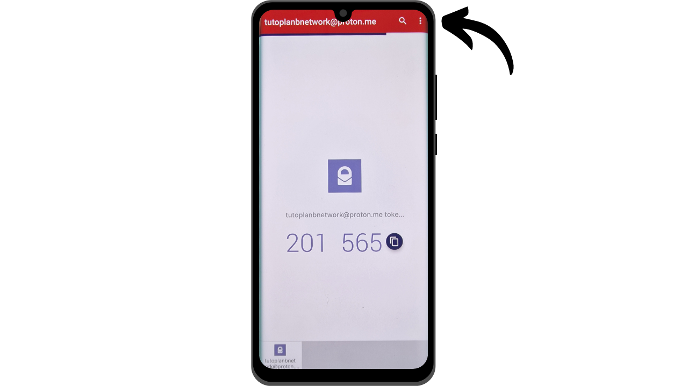

Heutzutage ist die Zwei-Faktor-Authentifizierung (2FA) unerlässlich geworden, um die Sicherheit von Online-Konten gegen unbefugten Zugriff zu erhöhen. Mit dem Anstieg von Cyberangriffen reicht es manchmal nicht aus, sich allein auf ein Passwort zum Schutz Ihrer Konten zu verlassen. 2FA führt eine zusätzliche Sicherheitsebene ein, indem neben dem Passwort eine zweite Form der Authentifizierung erforderlich ist. Diese Verifizierung kann verschiedene Formen annehmen, wie z.B. einen Code, der per SMS gesendet wird, einen dynamischen Code, der von einer speziellen App generiert wird, oder die Verwendung eines physischen Sicherheitsschlüssels. Der Einsatz von 2FA reduziert das Risiko, dass Ihre Konten kompromittiert werden, erheblich, selbst im Falle eines gestohlenen Passworts.

## 2FA über Authentifizierungs-Apps

Wir werden andere Lösungen wie physische Sicherheitsschlüssel in anderen Tutorials erkunden, aber in diesem möchte ich speziell 2FA-Anwendungen diskutieren. Die Funktionsweise dieser Anwendungen ist ziemlich einfach: Wenn 2FA auf einem Konto aktiviert ist, werden Sie bei jedem Login nicht nur nach Ihrem üblichen Passwort, sondern auch nach einem 6-stelligen Code gefragt. Dieser Code wird von Ihrer 2FA-Anwendung generiert. Eine wichtige Eigenschaft dieses 6-stelligen Codes ist, dass er nicht statisch ist; ein neuer Code wird von der Anwendung alle 30 Sekunden generiert.

Die Erneuerung des Codes alle 30 Sekunden macht es einem Angreifer sehr schwer, auf Ihr Konto zuzugreifen. Dieses System verhindert, dass Angreifer einen gestohlenen oder abgefangenen Code wiederverwenden können, da er schnell abläuft. Somit kann ein Angreifer, selbst wenn er den Code erhält, ihn nur in einem sehr kurzen Zeitfenster verwenden, bevor ein neuer Code erforderlich ist. Darüber hinaus reduziert die Tatsache, dass der Code so häufig wechselt, die Zeit, die einem Hacker zur Verfügung steht, um den Code durch Brute-Force zu erraten, erheblich.

2FA über Authentifizierungs-Apps stellt somit eine einfach zu bedienende und kostenlose Methode dar, um die Sicherheit Ihrer Online-Konten erheblich zu verbessern.

Es gibt zahlreiche Anwendungen für die Einrichtung von 2FA, unter denen Google Authenticator und Microsoft Authenticator am bekanntesten sind. In diesem Tutorial möchte ich Ihnen jedoch eine andere, weniger bekannte Lösung namens Authy vorstellen. Alle diese Anwendungen verwenden das gleiche TOTP-Protokoll (*Time based One Time Password*), was ihre Nutzung recht ähnlich macht.
Authy bietet mehrere Vorteile gegenüber anderen Lösungen der großen Technologieunternehmen. Vor allem ermöglicht es Ihnen, Ihre 2FA-Token über mehrere Geräte hinweg zu synchronisieren, was im Falle eines Verlusts oder Wechsels des Telefons nützlich sein kann. Authy ermöglicht es Ihnen auch, ein verschlüsseltes Backup zu erstellen und online zu speichern, sodass Sie nie den Zugang zu Ihren Token verlieren, selbst wenn Sie Ihr primäres Gerät verlieren. Aus der Perspektive der Benutzeroberfläche finde ich persönlich, dass Authy auch eine angenehmere und intuitivere Erfahrung bietet als seine Alternativen.

## Wie installiert man Authy?

Gehen Sie auf Ihrem Smartphone in den App Store (Google Play Store oder Apple Store) und suchen Sie nach "*Twilio Authy Authenticator*".

- [Apple](https://apps.apple.com/us/app/twilio-authy/id494168017)
- [Android](https://play.google.com/store/apps/details?id=com.authy.authy)

Beim ersten Start der App müssen Sie ein Konto erstellen. Wählen Sie Ihren Ländervorwahlcode sowie Ihre Telefonnummer und klicken Sie auf "*Submit*".

Geben Sie Ihre E-Mail-Adresse für die Code-Wiederherstellung ein.
Eine E-Mail wird an Sie gesendet, um Ihre Adresse zu verifizieren. Geben Sie die 6 empfangenen Ziffern ein, um zu bestätigen.

Wählen Sie eine der beiden verfügbaren Methoden aus, um Ihre Telefonnummer zu verifizieren. Wenn Sie sich für den Empfang einer SMS entscheiden, geben Sie den 6-stelligen Code ein, den Sie per Nachricht erhalten, um Ihre Nummer zu bestätigen.

Herzlichen Glückwunsch, Ihr Authy-Konto wurde erstellt!

## Wie konfiguriert man Authy?

Um zu beginnen, gehen Sie zu den Einstellungen der App, indem Sie auf die drei kleinen Punkte oben rechts auf dem Bildschirm klicken.

Klicken Sie dann auf "*Einstellungen*".

Im Tab "*Mein Konto*" haben Sie die Möglichkeit, Ihr Konto zu ändern. Ich empfehle, einen PIN-Code zur App hinzuzufügen, indem Sie "*App-Schutz*" auswählen. Dies fügt eine zusätzliche Sicherheitsebene hinzu, um auf Ihre Anwendung zuzugreifen.

Im Tab "*Konten*" können Sie ein Backup für Ihre Token einrichten. Dieses Backup ermöglicht die Wiederherstellung Ihrer Codes im Falle eines Problems. Es wird mit einem Passwort verschlüsselt, das Sie festlegen müssen. Es ist wichtig, dass dieses Passwort stark ist und an einem sicheren Ort aufbewahrt wird. Das Einrichten dieses Backups ist nicht unbedingt obligatorisch, wenn Sie andere Wiederherstellungsmethoden haben, wie zum Beispiel ein zweites Gerät mit demselben Authy-Konto.
Im Tab "*Geräte*" können Sie alle Geräte sehen, die mit Ihrem Authy-Konto synchronisiert sind. Sie haben die Möglichkeit, die Verwendung mehrerer Geräte zu deaktivieren, was den Zugriff auf Ihr Konto auf dieses Gerät beschränkt. Wenn Sie nur ein Gerät verwenden, kann dies die Sicherheit Ihres Kontos erhöhen, aber stellen Sie sicher, dass Sie eine andere Backup-Methode haben, falls Sie dieses Gerät verlieren.

Wenn Sie es bevorzugen, die Hinzufügung anderer Geräte zu erlauben, rate ich Ihnen, die Option zu aktivieren, die eine Bestätigung von den derzeit autorisierten Geräten auf Ihrem Authy-Konto erfordert, bevor ein neues Gerät hinzugefügt wird.

Um ein neues Gerät hinzuzufügen, wiederholen Sie einfach den Installationsprozess, der im vorherigen Teil vorgestellt wurde, mit denselben Anmeldeinformationen. Sie werden dann aufgefordert, diesen neuen Zugang von Ihrem Hauptgerät aus zu bestätigen.

## Wie richtet man 2FA für ein Konto ein?

Um einen 2FA-Authentifizierungscode über eine App wie Authy für ein Konto einzurichten, muss das Konto diese Funktion unterstützen. Heutzutage bieten die meisten Online-Dienste diese 2FA-Option an, aber das ist nicht immer der Fall. Nehmen wir das Beispiel des Proton-Mail-Kontos, das ich in einem anderen Tutorial vorgestellt habe:

https://planb.network/tutorials/others/proton-mail

Diese 2FA-Option finden Sie in der Regel in den Einstellungen Ihres Kontos, oft unter dem Abschnitt "*Passwort*" oder "*Sicherheit*".

Wenn Sie diese Option auf Ihrem Proton-Mail-Konto aktivieren, wird Ihnen ein QR-Code präsentiert. Sie müssen dann diesen QR-Code mit Ihrer Authy-App scannen.

Klicken Sie in Authy auf den "*+*" Knopf.

Klicken Sie auf "*QR-Code scannen*". Scannen Sie dann den QR-Code auf der Website. 
Sie haben auch die Möglichkeit, Ihren Benutzernamen bei Bedarf anzupassen. Nachdem Sie Änderungen vorgenommen haben, klicken Sie auf den "*SPEICHERN*" Button.

Authy zeigt Ihnen dann Ihren dynamischen 6-stelligen Code an, der spezifisch für dieses Konto ist und sich alle 30 Sekunden erneuert.

Geben Sie diesen Code auf der Website ein, um die Einrichtung der 2FA abzuschließen.

Einige Seiten stellen Ihnen nach Aktivierung der 2FA auch Wiederherstellungscodes zur Verfügung. Diese Codes ermöglichen es Ihnen, auf Ihr Konto zuzugreifen, falls Sie den Zugang zu Ihrer Authy-App verlieren. Ich empfehle, sie an einem sicheren Ort zu speichern.
 Ihr Konto ist jetzt mit der Zwei-Faktor-Authentifizierung über die Authy-App gesichert.

Jedes Mal, wenn Sie sich bei dem Konto anmelden, müssen Sie den von Authy generierten dynamischen Code angeben. Sie können jetzt alle Ihre Konten sichern, die mit dieser 2FA-Methode kompatibel sind. Um ein neues Konto bei Authy hinzuzufügen, klicken Sie auf die drei kleinen Punkte oben rechts in der App.

Klicken Sie dann auf "*Konto hinzufügen*".

Folgen Sie den gleichen Schritten wie bei dem ersten Konto. Ihre verschiedenen dynamischen Codes werden auf der Startseite von Authy angezeigt.