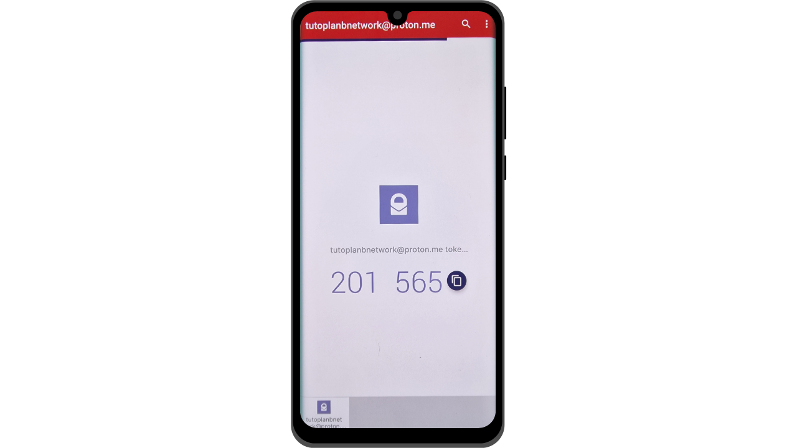
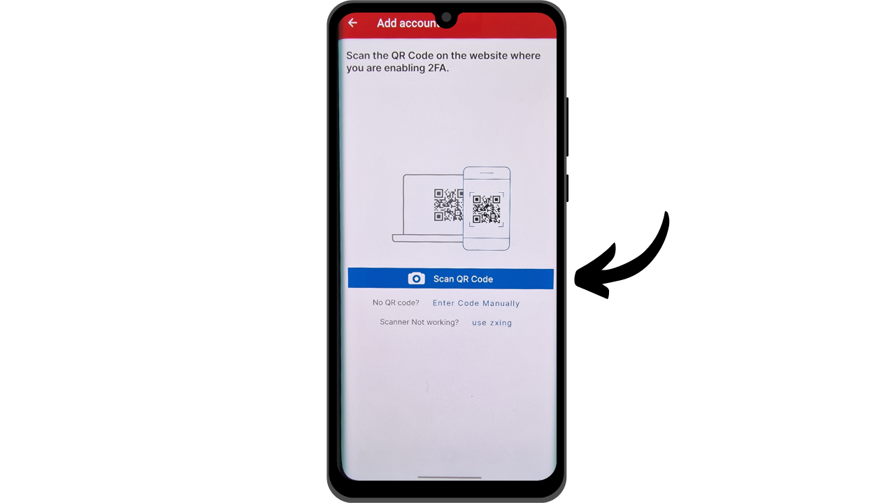
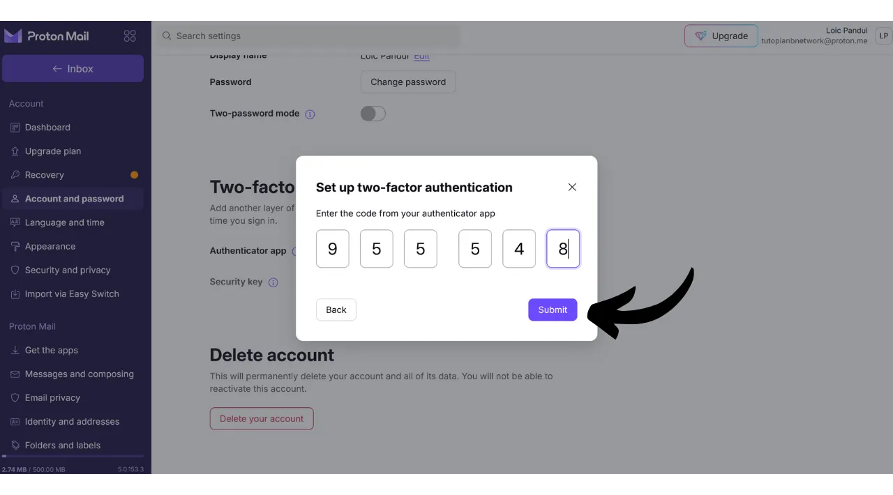

Nowadays, two-factor authentication (2FA) has become essential for enhancing the security of online accounts against unauthorized access. With the increase in cyber attacks, relying solely on a password to secure your accounts is sometimes insufficient. 2FA introduces an additional layer of security by requiring a second form of authentication in addition to the password. This verification can take several forms, such as a code sent via SMS, a dynamic code generated by a dedicated app, or the use of a physical security key. The use of 2FA greatly reduces the risk of your accounts being compromised, even in the event of your password being stolen.

## 2FA via Authentication Apps

We will explore other solutions like physical security keys in other tutorials, but in this one, I propose to specifically discuss 2FA applications. The operation of these applications is quite simple: when 2FA is activated on an account, at each login, you will be asked not only for your usual password but also for a 6-digit code. This code is generated by your 2FA application. An important characteristic of this 6-digit code is that it is not static; a new code is generated by the application every 30 seconds.

The renewal of the code every 30 seconds makes it very difficult for an attacker to access your account. This system prevents attackers from reusing a stolen or intercepted code, as it expires quickly. Thus, even if an attacker manages to obtain the code, they will only be able to use it during a very short window of time before a new code is required. Moreover, the fact that the code changes so frequently significantly reduces the time available for a hacker attempting to guess the code through brute force.

2FA via authentication apps thus represents an easy-to-use and free method to significantly improve the security of your online accounts.

There are numerous applications for setting up 2FA, among which Google Authenticator and Microsoft Authenticator are the most well-known. However, in this tutorial, I wish to introduce you to another, less known solution named Authy. All these applications operate using the same TOTP (*Time based One Time Password*) protocol, making their use quite similar.
Authy offers several advantages over other solutions from the big tech companies. First and foremost, it allows you to synchronize your 2FA tokens across multiple devices, which can be useful in case of loss or change of phone. Authy also enables you to generate an encrypted backup and store it online, ensuring you never lose access to your tokens, even if you lose your primary device. From a user interface perspective, I personally find that Authy also offers a more pleasant and intuitive experience than its alternatives.

## How to install Authy?

On your smartphone, go to the app store (Google Play Store or Apple Store), and search for "*Twilio Authy Authenticator*".

- [Apple](https://apps.apple.com/us/app/twilio-authy/id494168017)
- [Android](https://play.google.com/store/apps/details?id=com.authy.authy)

Upon the first launch of the app, you will need to create an account. Select your country's dialing code, as well as your phone number, then click on "*Submit*".

Enter your email address for code recovery.

An email will be sent to you to verify your address. Enter the 6 digits received to confirm.

Select one of the two available methods to verify your phone number. If you opt for receiving an SMS, enter the 6-digit code received by message to confirm your number.

Congratulations, your Authy account has been created!

## How to configure Authy?

To start, go to the app's settings by clicking on the three small dots located at the top right of the screen.

Then click on "*Settings*".

In the "*My Account*" tab, you have the option to modify your account. I recommend adding a PIN code to the app by selecting "*App Protection*". This adds an extra layer of security to access your application.

In the "*Accounts*" tab, you can set up a backup for your tokens. This backup allows for the recovery of your codes in case of a problem. It is encrypted using a password that you must define. It's important that this password is strong and kept in a safe place. Setting up this backup is not necessarily mandatory if you have other recovery methods, such as a second device with the same Authy account, for example.
In the "*Devices*" tab, you can see all the devices synchronized with your Authy account. You have the option to disable the use of multiple devices, which restricts access to your account to that device only. If you use only one device, this can increase the security of your account, but make sure you have another backup method in case you lose that device.

If you prefer to allow the addition of other devices, I advise you to activate the option that requires confirmation from the currently authorized devices on your Authy account before adding a new device.

To add a new device, simply repeat the installation process presented in the previous part using the same credentials. You will then be asked to confirm this new access from your main device.

## How to set up 2FA on an account?

To set up a 2FA authentication code via an app like Authy on an account, the account must support this feature. Nowadays, the majority of online services offer this 2FA option, but this is not always the case. Let's take the example of the Proton mail account that I presented in another tutorial:

https://planb.network/tutorials/others/proton-mail

You will generally find this 2FA option in the settings of your account, often under the "*Password*" or "*Security*" section.

When you activate this option on your Proton mail account, a QR code is presented to you. You must then scan this QR code with your Authy app.

On Authy, click the "*+*" button.

Click on "*Scan QR Code*". Then scan the QR code on the website.

You also have the option to adjust your username if necessary. After making changes, click the "*SAVE*" button.

Authy will then display your dynamic 6-digit code specific to that account which refreshes every 30 seconds.

Enter this code on the website to finalize the 2FA setup.

Some sites will also provide you with recovery codes after activating the 2FA. These codes allow you to access your account if you lose access to your Authy app. I recommend saving them in a safe place.
Your account is now secured with two-factor authentication via the Authy app.

Each time you log in to the account, you will need to provide the dynamic code generated by Authy. You can now secure all your accounts compatible with this 2FA method. To add a new account on Authy, click on the three small dots at the top right of the app.

Then click on "*Add Account*".

Follow the same steps as those used for the first account. Your various dynamic codes will be visible on the Authy home page.