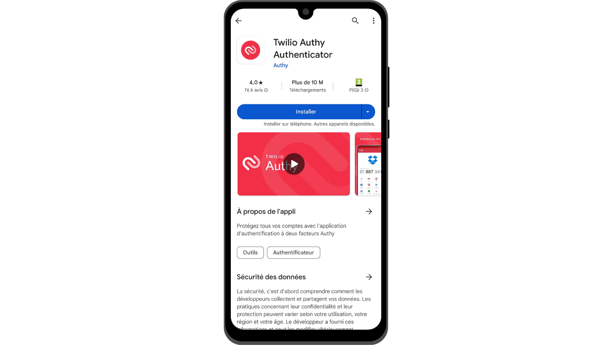
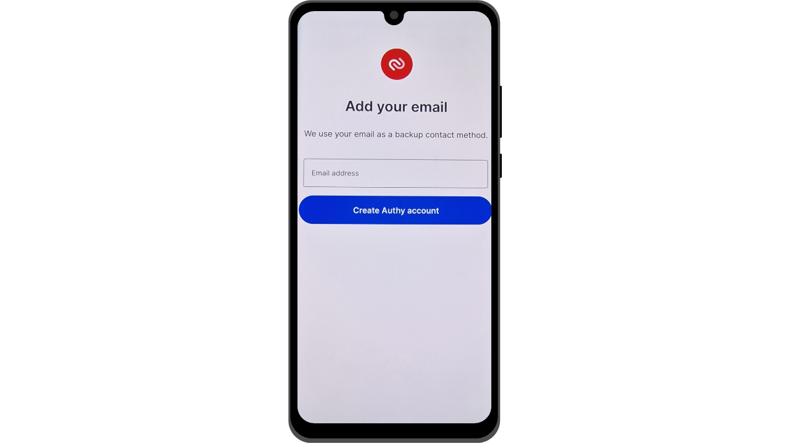
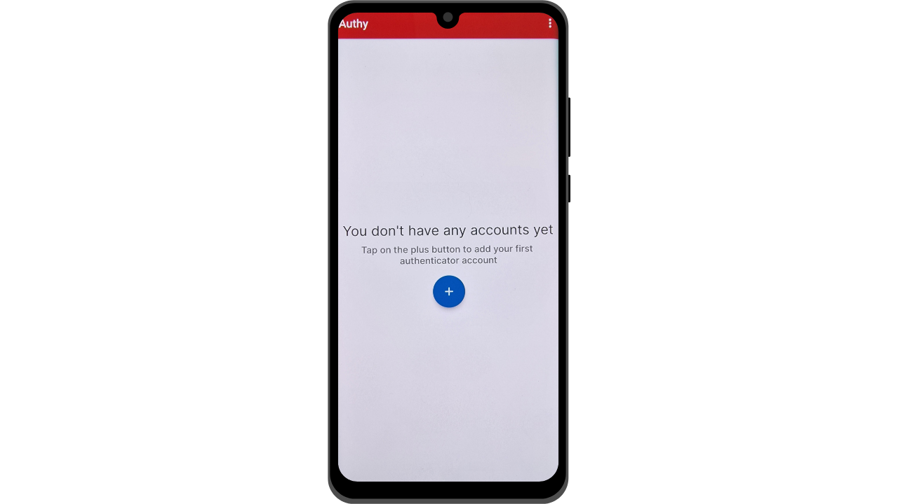
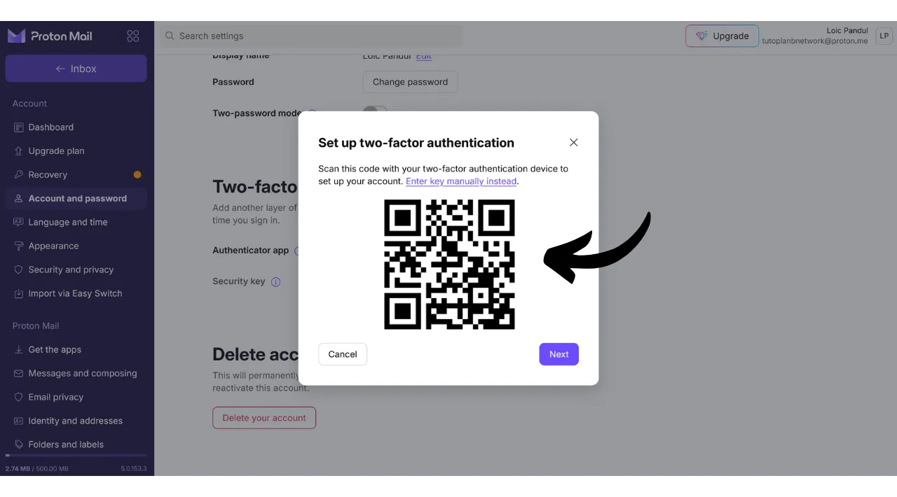

Hoy en día, la autenticación de dos factores (2FA) se ha vuelto esencial para mejorar la seguridad de las cuentas en línea contra el acceso no autorizado. Con el aumento de los ataques cibernéticos, confiar únicamente en una contraseña para proteger tus cuentas a veces es insuficiente. 2FA introduce una capa adicional de seguridad al requerir una segunda forma de autenticación además de la contraseña. Esta verificación puede tomar varias formas, como un código enviado vía SMS, un código dinámico generado por una aplicación dedicada, o el uso de una llave de seguridad física. El uso de 2FA reduce en gran medida el riesgo de que tus cuentas sean comprometidas, incluso en el caso de que tu contraseña sea robada.

## 2FA a través de Aplicaciones de Autenticación

Exploraremos otras soluciones como las llaves de seguridad físicas en otros tutoriales, pero en este, propongo discutir específicamente sobre aplicaciones de 2FA. El funcionamiento de estas aplicaciones es bastante simple: cuando 2FA está activado en una cuenta, en cada inicio de sesión, se te pedirá no solo tu contraseña habitual sino también un código de 6 dígitos. Este código es generado por tu aplicación de 2FA. Una característica importante de este código de 6 dígitos es que no es estático; una nueva clave es generada por la aplicación cada 30 segundos.

La renovación del código cada 30 segundos hace que sea muy difícil para un atacante acceder a tu cuenta. Este sistema impide que los atacantes reutilicen un código robado o interceptado, ya que expira rápidamente. Así, incluso si un atacante logra obtener el código, solo podrá usarlo durante una ventana de tiempo muy corta antes de que se requiera un nuevo código. Además, el hecho de que el código cambie tan frecuentemente reduce significativamente el tiempo disponible para un hacker que intenta adivinar el código mediante fuerza bruta.

2FA a través de aplicaciones de autenticación representa así un método fácil de usar y gratuito para mejorar significativamente la seguridad de tus cuentas en línea.

Hay numerosas aplicaciones para configurar 2FA, entre las cuales Google Authenticator y Microsoft Authenticator son las más conocidas. Sin embargo, en este tutorial, deseo presentarte otra solución menos conocida llamada Authy. Todas estas aplicaciones operan usando el mismo protocolo TOTP (*Time based One Time Password*), haciendo su uso bastante similar.
Authy ofrece varias ventajas sobre otras soluciones de las grandes compañías tecnológicas. En primer lugar, te permite sincronizar tus tokens de 2FA en múltiples dispositivos, lo cual puede ser útil en caso de pérdida o cambio de teléfono. Authy también te permite generar una copia de seguridad cifrada y almacenarla en línea, asegurando que nunca pierdas acceso a tus tokens, incluso si pierdes tu dispositivo principal. Desde una perspectiva de interfaz de usuario, personalmente encuentro que Authy también ofrece una experiencia más agradable e intuitiva que sus alternativas.

## ¿Cómo instalar Authy?

En tu smartphone, ve a la tienda de aplicaciones (Google Play Store o Apple Store), y busca "*Twilio Authy Authenticator*".

- [Apple](https://apps.apple.com/us/app/twilio-authy/id494168017)
- [Android](https://play.google.com/store/apps/details?id=com.authy.authy)

Al iniciar la aplicación por primera vez, necesitarás crear una cuenta. Selecciona el código de marcación de tu país, así como tu número de teléfono, y haz clic en "*Submit*".

Ingresa tu dirección de correo electrónico para la recuperación del código.
Se te enviará un correo electrónico para verificar tu dirección. Ingresa los 6 dígitos recibidos para confirmar.

Selecciona uno de los dos métodos disponibles para verificar tu número de teléfono. Si optas por recibir un SMS, ingresa el código de 6 dígitos recibido por mensaje para confirmar tu número.

¡Felicidades, tu cuenta de Authy ha sido creada!

## ¿Cómo configurar Authy?

Para empezar, ve a la configuración de la aplicación haciendo clic en los tres pequeños puntos ubicados en la parte superior derecha de la pantalla.

Luego haz clic en "*Settings*" (Configuración).

En la pestaña "*My Account*" (Mi Cuenta), tienes la opción de modificar tu cuenta. Recomiendo agregar un código PIN a la aplicación seleccionando "*App Protection*" (Protección de la Aplicación). Esto añade una capa extra de seguridad para acceder a tu aplicación.

En la pestaña "*Accounts*" (Cuentas), puedes configurar una copia de seguridad para tus tokens. Esta copia de seguridad permite la recuperación de tus códigos en caso de un problema. Está cifrada usando una contraseña que debes definir. Es importante que esta contraseña sea fuerte y se guarde en un lugar seguro. Configurar esta copia de seguridad no es necesariamente obligatorio si tienes otros métodos de recuperación, como un segundo dispositivo con la misma cuenta de Authy, por ejemplo.
En la pestaña "*Devices*" (Dispositivos), puedes ver todos los dispositivos sincronizados con tu cuenta de Authy. Tienes la opción de deshabilitar el uso de múltiples dispositivos, lo que restringe el acceso a tu cuenta solo a ese dispositivo. Si usas solo un dispositivo, esto puede aumentar la seguridad de tu cuenta, pero asegúrate de tener otro método de respaldo en caso de que pierdas ese dispositivo.

Si prefieres permitir la adición de otros dispositivos, te aconsejo activar la opción que requiere confirmación de los dispositivos actualmente autorizados en tu cuenta de Authy antes de agregar un nuevo dispositivo.

Para agregar un nuevo dispositivo, simplemente repite el proceso de instalación presentado en la parte anterior usando las mismas credenciales. Luego se te pedirá confirmar este nuevo acceso desde tu dispositivo principal.

## ¿Cómo configurar 2FA en una cuenta?

Para configurar un código de autenticación 2FA a través de una aplicación como Authy en una cuenta, la cuenta debe admitir esta característica. Hoy en día, la mayoría de los servicios en línea ofrecen esta opción de 2FA, pero no siempre es el caso. Tomemos el ejemplo de la cuenta de Proton Mail que presenté en otro tutorial:

https://planb.network/tutorials/others/proton-mail

Generalmente encontrarás esta opción de 2FA en la configuración de tu cuenta, a menudo bajo la sección de "*Password*" (Contraseña) o "*Security*" (Seguridad).

Cuando activas esta opción en tu cuenta de Proton Mail, se te presenta un código QR. Entonces debes escanear este código QR con tu aplicación Authy.

En Authy, haz clic en el botón "*+*".
Haz clic en "*Scan QR Code*". Luego escanea el código QR en el sitio web. 
También tienes la opción de ajustar tu nombre de usuario si es necesario. Después de hacer cambios, haz clic en el botón "*SAVE*".

Authy mostrará entonces tu código dinámico de 6 dígitos específico para esa cuenta, el cual se actualiza cada 30 segundos.

Introduce este código en el sitio web para finalizar la configuración de 2FA.

Algunos sitios también te proporcionarán códigos de recuperación después de activar el 2FA. Estos códigos te permiten acceder a tu cuenta si pierdes el acceso a tu aplicación Authy. Recomiendo guardarlos en un lugar seguro.
Tu cuenta ahora está asegurada con autenticación de dos factores a través de la aplicación Authy.

Cada vez que inicies sesión en la cuenta, necesitarás proporcionar el código dinámico generado por Authy. Ahora puedes asegurar todas tus cuentas compatibles con este método de 2FA. Para agregar una nueva cuenta en Authy, haz clic en los tres pequeños puntos en la parte superior derecha de la aplicación.

Luego haz clic en "*Add Account*".

Sigue los mismos pasos que los utilizados para la primera cuenta. Tus diversos códigos dinámicos serán visibles en la página de inicio de Authy.