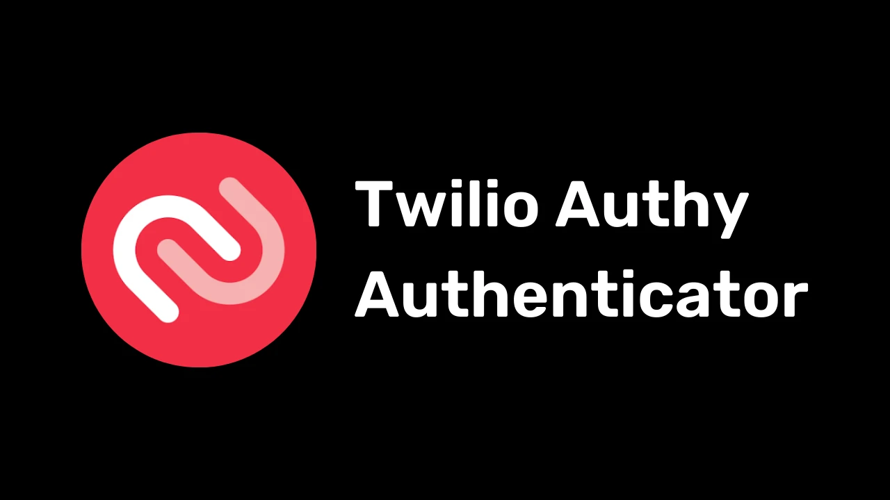

Tänapäeval on kahefaktoriline autentimine (2FA) muutunud hädavajalikuks, et tõsta online-kontode turvalisust volitamata juurdepääsu eest. Küberrünnakute sagenemisega on mõnikord ainult parooli kasutamine kontode kaitsmiseks ebapiisav. 2FA tutvustab lisaturvalisuse kihti, nõudes teist autentimise vormi lisaks paroolile. See kinnitamine võib võtta mitmeid vorme, nagu kood, mis saadetakse SMS-i teel, dünaamiline kood, mida genereerib pühendunud rakendus, või füüsilise turvavõtme kasutamine. 2FA kasutamine vähendab oluliselt riski, et teie kontod kompromiteeritakse, isegi kui teie parool varastatakse.

## 2FA autentimisrakenduste kaudu

Me uurime teistes õpetustes teisi lahendusi nagu füüsilised turvavõtmed, kuid selles tutvustan spetsiifiliselt 2FA rakendusi. Nende rakenduste tööpõhimõte on üsna lihtne: kui 2FA on kontol aktiveeritud, küsitakse iga sisselogimise ajal teilt mitte ainult teie tavalist parooli, vaid ka 6-kohalist koodi. Selle koodi genereerib teie 2FA rakendus. Oluline omadus selle 6-kohalise koodi juures on, et see ei ole staatiline; rakendus genereerib uue koodi iga 30 sekundi järel.
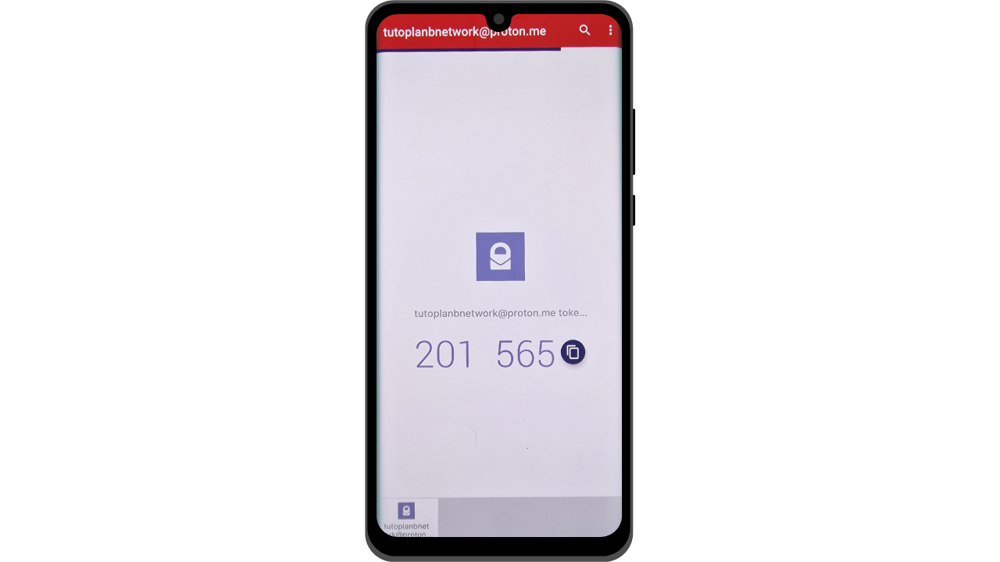
Koodi uuendamine iga 30 sekundi järel muudab ründajale teie kontole juurdepääsu väga keeruliseks. See süsteem takistab ründajatel varastatud või pealtkuulatud koodi uuesti kasutamast, kuna see aegub kiiresti. Seega, isegi kui ründaja suudab koodi saada, saab ta seda kasutada ainult väga lühikese aja jooksul enne, kui on vaja uut koodi. Lisaks vähendab koodi sagedane muutmine oluliselt aega, mis on häkkeril koodi ära arvamiseks jõuga ründamise teel.

2FA autentimisrakenduste kaudu esindab seega lihtsat ja tasuta meetodit, et oluliselt parandada teie online-kontode turvalisust.

On olemas arvukalt rakendusi 2FA seadistamiseks, millest Google Authenticator ja Microsoft Authenticator on kõige tuntumad. Kuid selles õpetuses soovin tutvustada teile teist, vähem tuntud lahendust nimega Authy. Kõik need rakendused töötavad sama TOTP (*Time based One Time Password*) protokolli alusel, muutes nende kasutamise üsna sarnaseks.
Authy pakub mitmeid eeliseid võrreldes teiste suurte tehnoloogiaettevõtete lahendustega. Esiteks ja kõige tähtsamalt võimaldab see sünkroniseerida teie 2FA tokeneid mitmel seadmel, mis võib olla kasulik telefoni kaotamise või vahetamise korral. Authy võimaldab teil ka genereerida krüpteeritud varukoopia ja salvestada selle online, tagades, et te ei kaota kunagi juurdepääsu oma tokenitele, isegi kui kaotate oma peamise seadme. Kasutajaliidese vaatenurgast leian ma isiklikult, et Authy pakub ka meeldivamat ja intuitiivsemat kogemust kui selle alternatiivid.

## Kuidas paigaldada Authy?

Oma nutitelefonis minge rakenduste poodi (Google Play Store või Apple Store) ja otsige "*Twilio Authy Authenticator*".

- [Apple](https://apps.apple.com/us/app/twilio-authy/id494168017)
- [Android](https://play.google.com/store/apps/details?id=com.authy.authy)
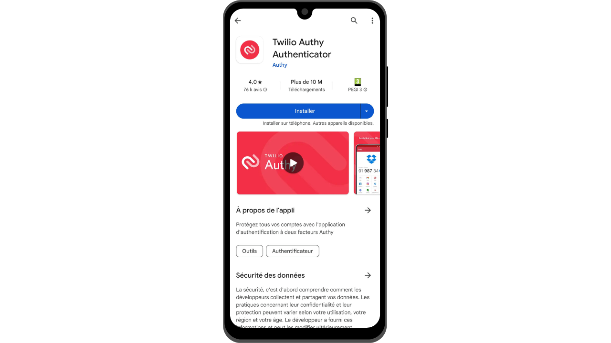
Rakenduse esmakordsel käivitamisel peate looma konto. Valige oma riigi suunakood ja oma telefoninumber, seejärel klõpsake "*Submit*".
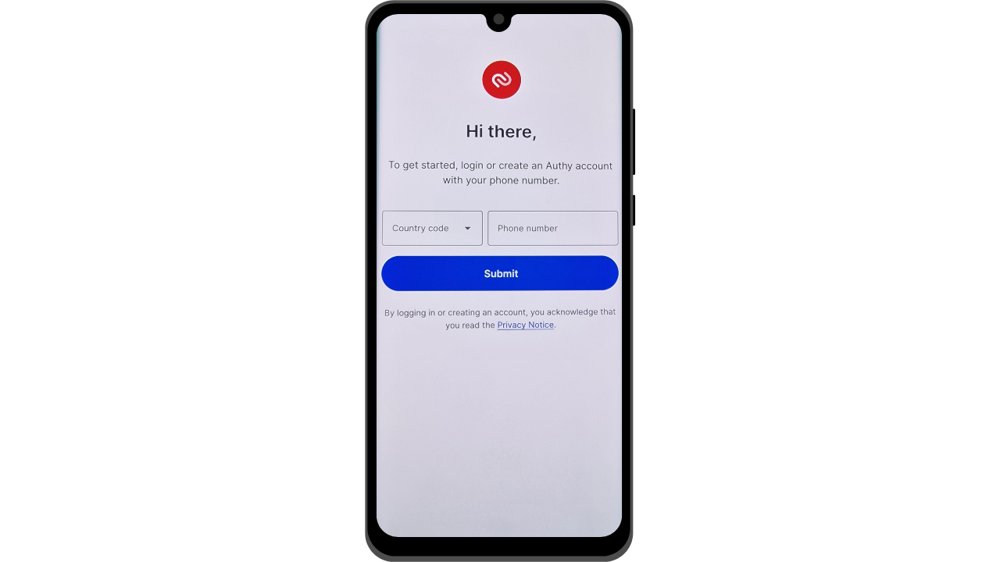
Sisestage oma e-posti aadress koodi taastamiseks.
Teile saadetakse e-kiri, et kinnitada teie aadressi. Sisestage saadud 6 numbrit, et kinnitada.
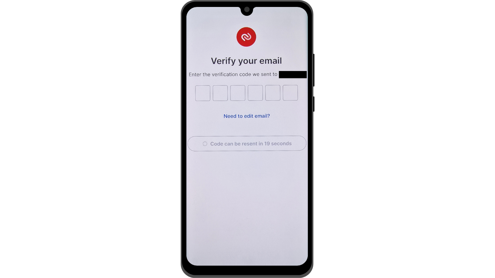
Valige üks kahest saadaolevast meetodist oma telefoninumbri kinnitamiseks. Kui valite SMS-i saamise, sisestage sõnumiga saadud 6-kohaline kood, et kinnitada oma number.
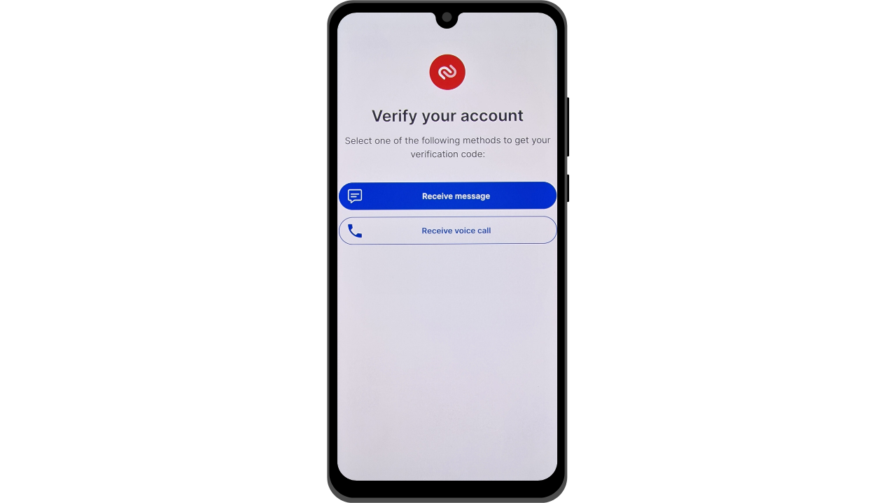
Palju õnne, teie Authy konto on loodud!
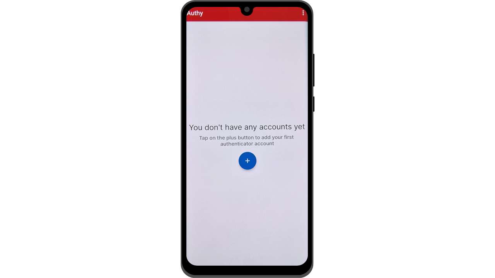
## Kuidas seadistada Authy?

Alustamiseks minge rakenduse seadetesse, klõpsates ekraani paremas ülanurgas asuvatel kolmel väikesel punktil.
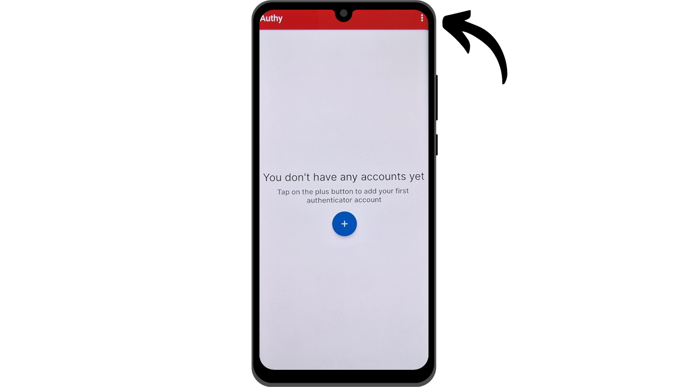
Seejärel klõpsake "*Settings*" (Seaded).
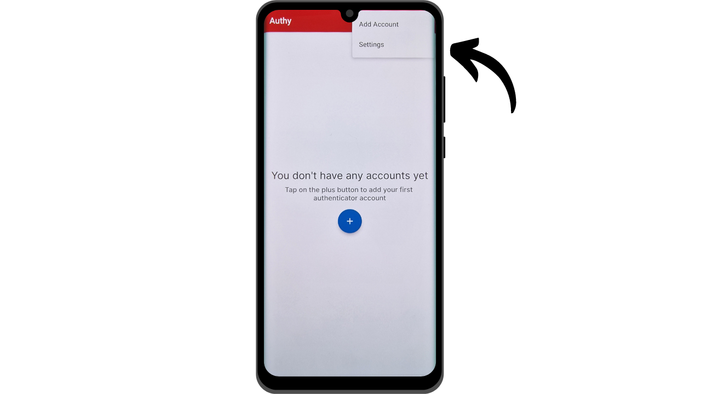
Vahekaardil "*My Account*" (Minu konto) on teil võimalus oma kontot muuta. Soovitan lisada rakendusele PIN-koodi, valides "*App Protection*" (Rakenduse kaitse). See lisab teie rakendusele juurdepääsuks täiendava turvakihi.
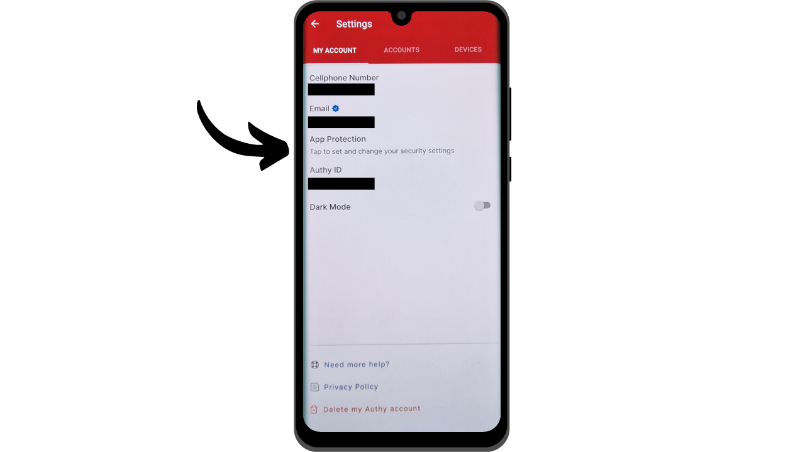
Vahekaardil "*Accounts*" (Kontod) saate seadistada oma tokenite varukoopia. See varukoopia võimaldab teie koode taastada probleemi korral. See on krüpteeritud parooliga, mille peate määrama. On oluline, et see parool oleks tugev ja hoitud turvalises kohas. Selle varukoopia seadistamine ei ole tingimata kohustuslik, kui teil on muid taastamismeetodeid, näiteks teine seade sama Authy kontoga, näiteks.
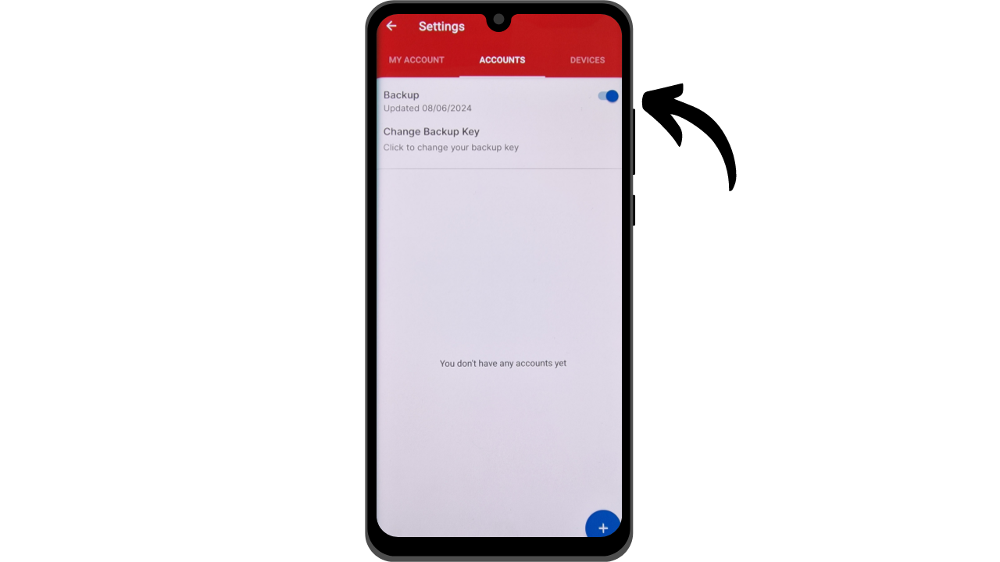Vahekaardil "*Devices*" (Seadmed) näete kõiki teie Authy kontoga sünkroniseeritud seadmeid. Teil on võimalus keelata mitme seadme kasutamine, mis piirab juurdepääsu teie kontole ainult sellele seadmele. Kui kasutate ainult ühte seadet, võib see suurendada teie konto turvalisust, kuid veenduge, et teil on teine taastamismeetod, juhul kui kaotate selle seadme.

Kui eelistate lubada teiste seadmete lisamist, soovitan teil aktiveerida võimaluse, mis nõuab enne uue seadme lisamist kinnitust praegu volitatud seadmetelt teie Authy kontol.
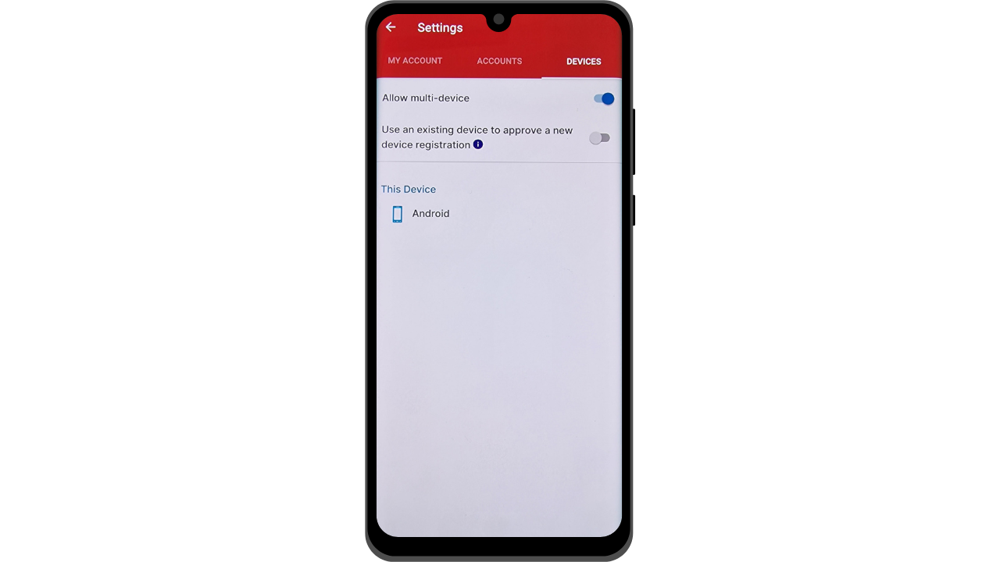
Uue seadme lisamiseks korrake lihtsalt eelmises osas esitatud installiprotsessi, kasutades samu volitusi. Seejärel palutakse teil kinnitada see uus juurdepääs oma peaseadmest.

## Kuidas seadistada 2FA kontol?

2FA autentimiskoodi seadistamiseks rakenduse, nagu Authy kaudu kontol, peab konto toetama seda funktsiooni. Tänapäeval pakuvad enamik veebiteenuseid seda 2FA võimalust, kuid see ei ole alati nii. Võtame näiteks Proton maili konto, millest rääkisin teises õpetuses:

https://planb.network/tutorials/others/proton-mail
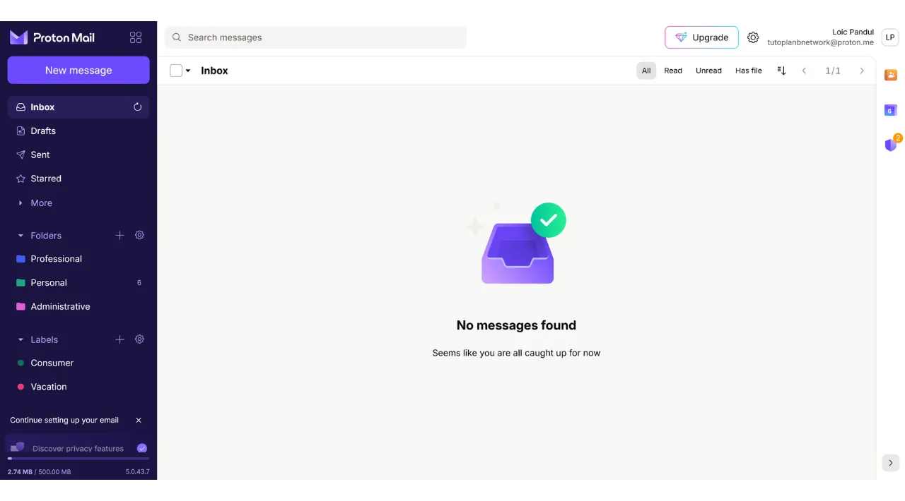
Üldiselt leiate selle 2FA võimaluse oma konto seadetest, sageli "*Password*" (Parool) või "*Security*" (Turvalisus) jaotise all.
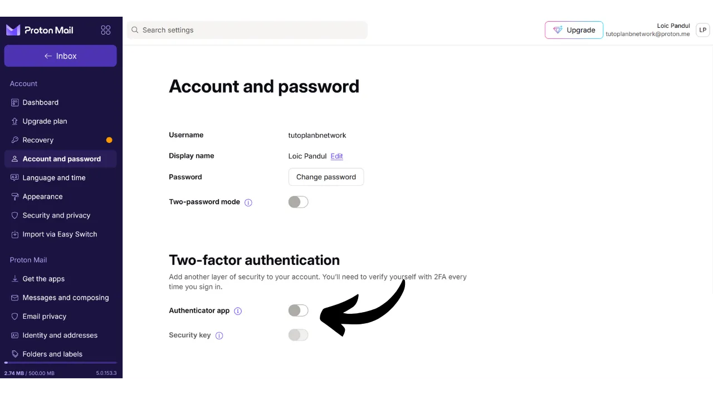
Kui aktiveerite selle võimaluse oma Proton maili kontol, esitatakse teile QR-kood. Peate seejärel skaneerima selle QR-koodi oma Authy rakendusega.
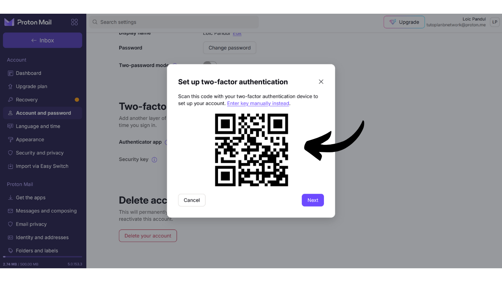
Authys klõpsake nuppu "*+*".
Klõpsake nupul "*Skanni QR-kood*". Seejärel skannige QR-kood veebilehel. 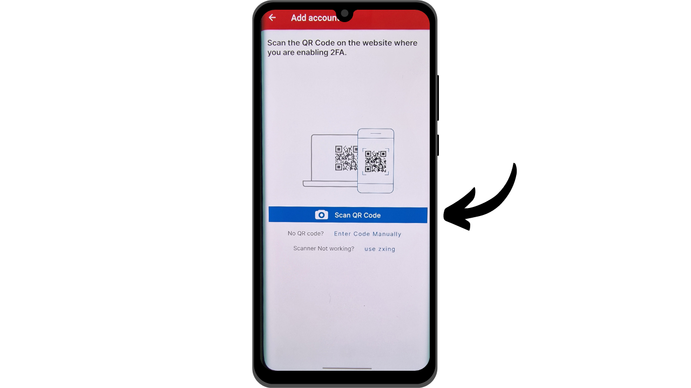
Teil on võimalus vajadusel oma kasutajanime muuta. Pärast muudatuste tegemist klõpsake nupul "*SALVESTA*".
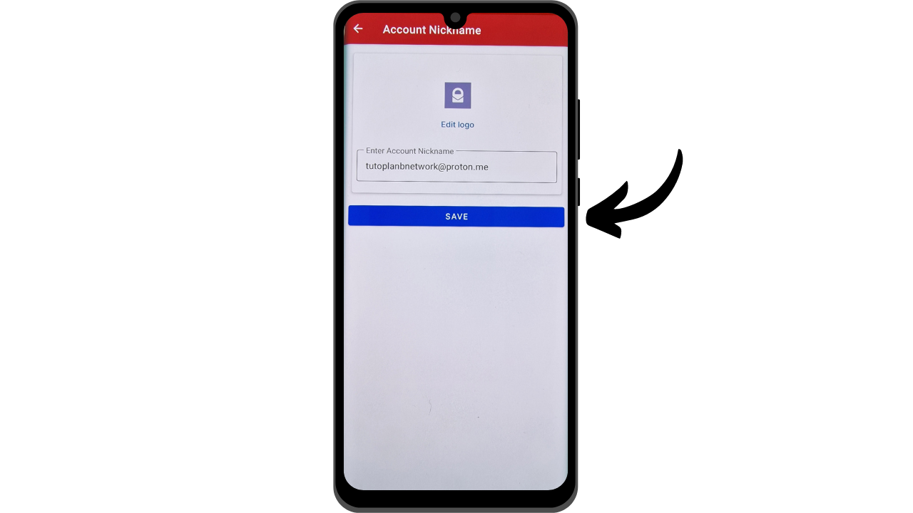
Seejärel kuvab Authy teie dünaamilise 6-kohalise koodi, mis on spetsiifiline sellele kontole ja värskendub iga 30 sekundi järel.

Sisestage see kood veebilehel, et lõpetada 2FA seadistamine.
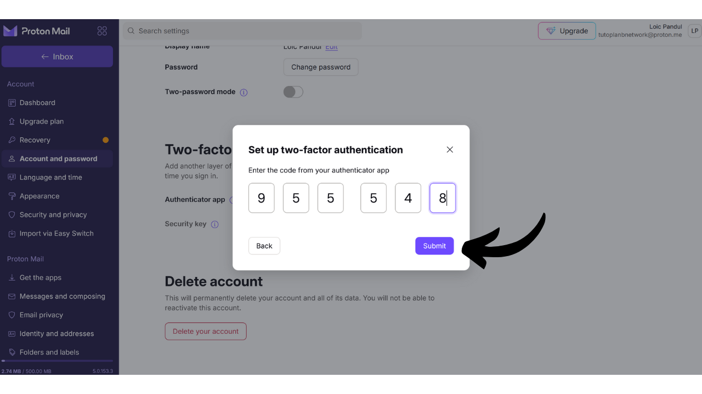
Mõned saidid pakuvad teile pärast 2FA aktiveerimist ka taastekoodid. Need koodid võimaldavad teil juurdepääsu oma kontole, kui kaotate juurdepääsu oma Authy rakendusele. Soovitan need turvalises kohas hoida.
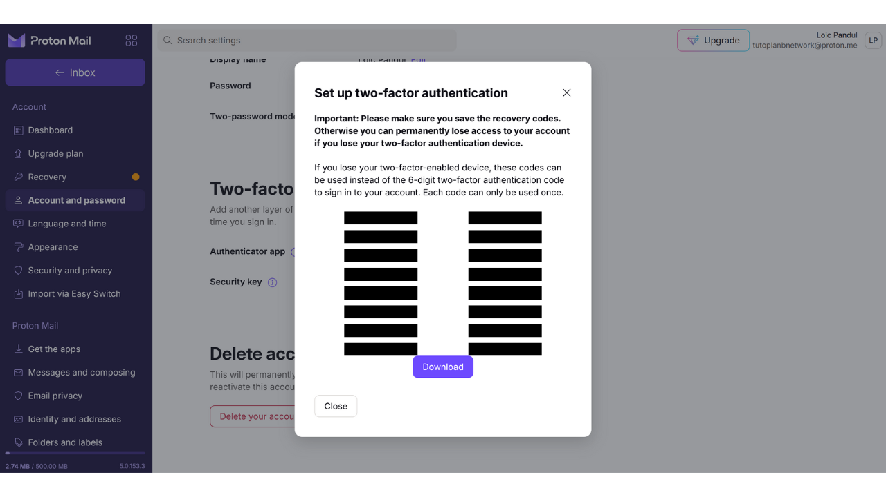Teie konto on nüüd kahefaktorilise autentimisega Authy rakenduse kaudu kaitstud.
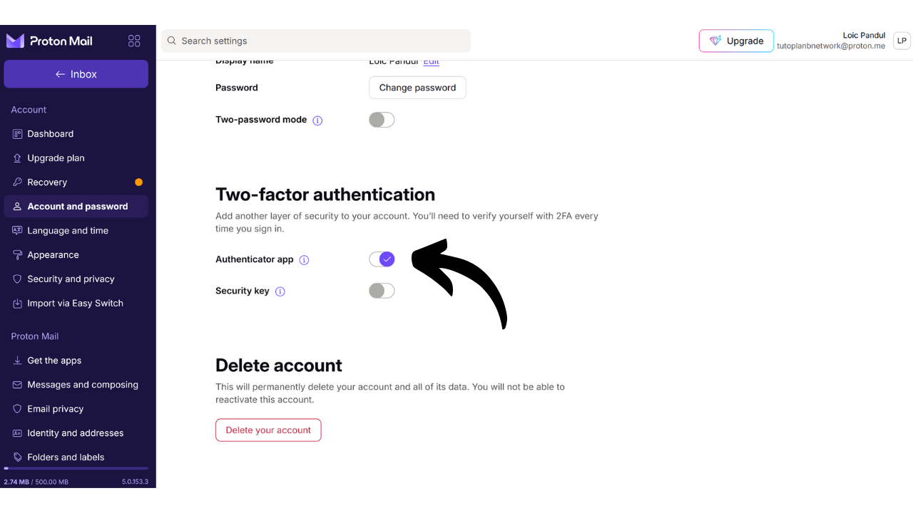
Iga kord, kui logite kontole sisse, peate esitama Authy poolt genereeritud dünaamilise koodi. Nüüd saate kõik oma kontod selle 2FA meetodiga turvata. Uue konto lisamiseks Authys klõpsake rakenduse paremas ülanurgas kolmel väikesel punktil.
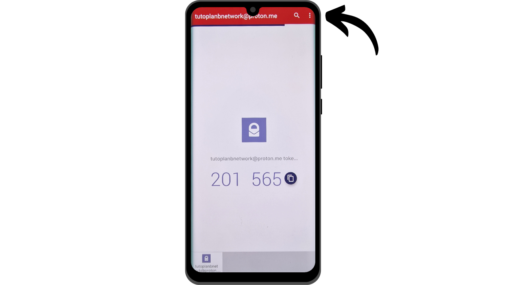
Seejärel klõpsake nupul "*Lisa konto*".
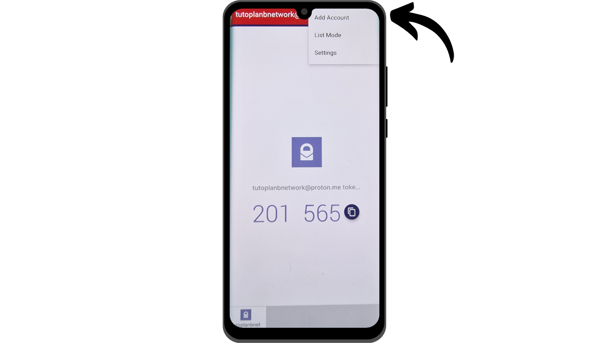
Järgige samu samme nagu esimese konto puhul. Teie erinevad dünaamilised koodid on nähtavad Authy avalehel.