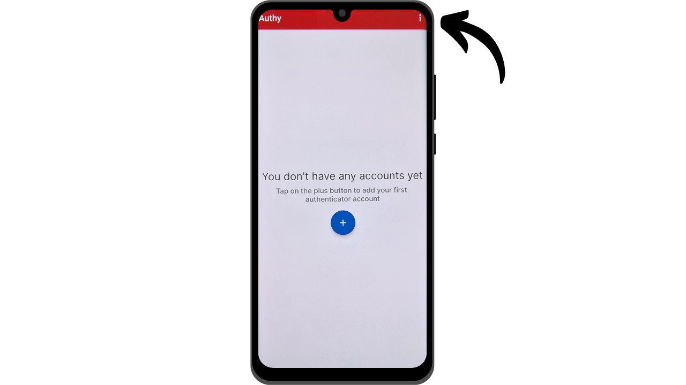
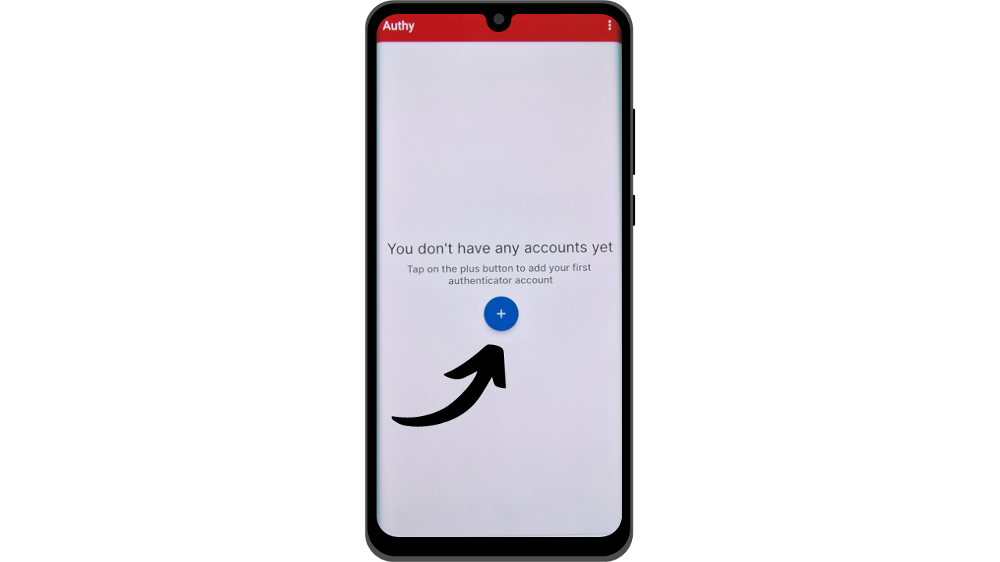

Nykyään kaksivaiheinen tunnistautuminen (2FA) on muodostunut olennaiseksi osaksi online-tilien turvallisuuden parantamista luvattomalta pääsyltä. Kyberhyökkäysten lisääntyessä pelkän salasanan varassa oleva tilien suojaus on joskus riittämätön. 2FA tuo mukanaan lisäkerroksen turvallisuutta vaatimalla toisen tunnistautumismuodon salasanan lisäksi. Tämä varmennus voi ottaa useita muotoja, kuten koodin lähettämisen SMS-viestillä, dynaamisen koodin generoinnin omistetulla sovelluksella tai fyysisen turva-avaimen käytön. 2FA:n käyttö vähentää merkittävästi tilisi joutumisen vaaraa kompromissoiduksi, jopa salasanasi varastamisen tapauksessa.

## 2FA tunnistautumissovellusten kautta

Tutkimme muita ratkaisuja, kuten fyysisiä turva-avaimia muissa oppaissa, mutta tässä yhdessä haluan erityisesti keskustella 2FA-sovelluksista. Näiden sovellusten toiminta on melko yksinkertaista: kun 2FA on aktivoitu tilillä, jokaisen kirjautumisen yhteydessä sinulta pyydetään paitsi tavallista salasanaasi myös 6-numeroinen koodi. Tämän koodin generoi 2FA-sovelluksesi. Tärkeä ominaisuus tässä 6-numeroisessa koodissa on, että se ei ole staattinen; sovellus generoi uuden koodin joka 30. sekunti.

Koodin uusiutuminen joka 30. sekunti tekee hyökkääjän pääsyn tilillesi erittäin vaikeaksi. Tämä järjestelmä estää hyökkääjiä käyttämästä uudelleen varastettua tai kaapattua koodia, koska se vanhenee nopeasti. Näin ollen, vaikka hyökkääjä onnistuisi saamaan koodin, hänellä on käytössään vain hyvin lyhyt aikaikkuna ennen kuin uusi koodi vaaditaan. Lisäksi se, että koodi muuttuu niin usein, vähentää merkittävästi aikaa, joka hakkerilla on arvata koodi brute force -menetelmällä.

2FA tunnistautumissovellusten kautta edustaa siis helppokäyttöistä ja ilmaista menetelmää parantaa merkittävästi online-tiliesi turvallisuutta.

On olemassa lukuisia sovelluksia 2FA:n asettamiseen, joista Google Authenticator ja Microsoft Authenticator ovat tunnetuimpia. Tässä oppaassa haluan kuitenkin esitellä toisen, vähemmän tunnetun ratkaisun nimeltä Authy. Kaikki nämä sovellukset toimivat käyttäen samaa TOTP (*Time based One Time Password*) -protokollaa, mikä tekee niiden käytöstä melko samankaltaista.
Authy tarjoaa useita etuja muihin suurten teknologiayritysten ratkaisuihin verrattuna. Ensinnäkin se mahdollistaa 2FA-tokeneidesi synkronoinnin useiden laitteiden välillä, mikä voi olla hyödyllistä puhelimen katoamisen tai vaihdon yhteydessä. Authy mahdollistaa myös salatun varmuuskopion luomisen ja sen tallentamisen verkossa, varmistaen, että et koskaan menetä pääsyä tokeneihisi, vaikka menettäisit päälaiteesi. Käyttöliittymän näkökulmasta henkilökohtaisesti koen, että Authy tarjoaa myös miellyttävämmän ja intuitiivisemman kokemuksen kuin sen vaihtoehdot.

## Kuinka asentaa Authy?

Älypuhelimellasi, mene sovelluskauppaan (Google Play Store tai Apple Store) ja etsi "*Twilio Authy Authenticator*".

- [Apple](https://apps.apple.com/us/app/twilio-authy/id494168017)
- [Android](https://play.google.com/store/apps/details?id=com.authy.authy)

Sovelluksen ensimmäisellä käynnistyksellä sinun tulee luoda tili. Valitse maasi suuntanumero sekä puhelinnumerosi, sitten klikkaa "*Submit*".

Syötä sähköpostiosoitteesi koodin palautusta varten.
Sähköposti lähetetään sinulle osoitteesi vahvistamiseksi. Syötä saamasi 6 numeroa vahvistaaksesi.

Valitse kaksi saatavilla olevaa menetelmää puhelinnumerosi vahvistamiseksi. Jos valitset SMS-viestin vastaanottamisen, syötä viestillä saamasi 6-numeroinen koodi vahvistaaksesi numerosi.

Onneksi olkoon, Authy-tilisi on luotu!

## Kuinka Authy konfiguroidaan?

Aloittaaksesi, mene sovelluksen asetuksiin klikkaamalla kolmea pientä pistettä näytön oikeassa yläkulmassa.

Klikkaa sitten "*Asetukset*".

"*Oma tili*" -välilehdessä sinulla on mahdollisuus muokata tiliäsi. Suosittelen lisäämään PIN-koodin sovellukseen valitsemalla "*Sovelluksen suojaus*". Tämä lisää ylimääräisen turvakerroksen sovelluksesi käyttöön.

"*Tilit*" -välilehdessä voit asettaa varmuuskopion tokeneillesi. Tämä varmuuskopio mahdollistaa koodiesi palauttamisen ongelmatilanteessa. Se salataan käyttämällä salasanaa, jonka sinun täytyy määritellä. On tärkeää, että tämä salasana on vahva ja säilytetään turvallisessa paikassa. Tämän varmuuskopion asettaminen ei välttämättä ole pakollista, jos sinulla on muita palautusmenetelmiä, kuten toinen laite samalla Authy-tilillä, esimerkiksi.
"*Laitteet*" -välilehdessä voit nähdä kaikki Authy-tiliisi synkronoidut laitteet. Sinulla on mahdollisuus poistaa käytöstä usean laitteen käyttö, mikä rajoittaa pääsyn tilillesi vain kyseiselle laitteelle. Jos käytät vain yhtä laitetta, tämä voi lisätä tilisi turvallisuutta, mutta varmista, että sinulla on toinen varmuuskopio menetelmä, jos menetät kyseisen laitteen.

Jos haluat sallia muiden laitteiden lisäämisen, suosittelen aktivoimaan vaihtoehdon, joka vaatii vahvistuksen tällä hetkellä valtuutetuilta laitteilta Authy-tililläsi ennen uuden laitteen lisäämistä.

Uuden laitteen lisäämiseksi toista vain aiemmin esitetty asennusprosessi käyttäen samoja tunnistetietoja. Sinua pyydetään sitten vahvistamaan tämä uusi pääsy päälaitteeltasi.

## Kuinka ottaa käyttöön 2FA tunnistus tilillä?

Jotta voit ottaa käyttöön 2FA-tunnistuskoodin sovelluksen, kuten Authyn kautta tilillä, tilin on tuettava tätä ominaisuutta. Nykyään suurin osa online-palveluista tarjoaa tämän 2FA-vaihtoehdon, mutta näin ei aina ole. Otetaan esimerkiksi Proton mail -tili, jonka esittelin toisessa oppaassa:

https://planb.network/tutorials/others/proton-mail

Yleensä löydät tämän 2FA-vaihtoehdon tilisi asetuksista, usein "*Salasana*" tai "*Turvallisuus*" -osion alla.

Kun aktivoit tämän vaihtoehdon Proton mail -tililläsi, sinulle esitetään QR-koodi. Sinun täytyy sitten skannata tämä QR-koodi Authy-sovelluksellasi.

Authyssa, klikkaa "*+*" -painiketta.

Napsauta "*Skannaa QR-koodi*". Skannaa sitten QR-koodi verkkosivustolta. 
Sinulla on myös mahdollisuus säätää käyttäjänimeäsi tarvittaessa. Muutosten jälkeen napsauta "*TALLENNA*" -painiketta.

Authy näyttää tämän jälkeen dynaamisen 6-numeroisen koodisi, joka on tietyn tilin erityinen ja uusiutuu joka 30. sekunti.

Syötä tämä koodi verkkosivustolle viimeistelläksesi 2FA-asetuksen.

Jotkut sivustot tarjoavat myös palautuskoodit 2FA:n aktivoimisen jälkeen. Nämä koodit mahdollistavat tilillesi pääsyn, jos menetät pääsyn Authy-sovellukseesi. Suosittelen säilyttämään ne turvallisessa paikassa.
Tilisi on nyt suojattu kaksivaiheisella todennuksella Authy-sovelluksen kautta.

Joka kerta kun kirjaudut tilille, sinun on annettava Authyn generoima dynaaminen koodi. Voit nyt suojata kaikki tämän 2FA-menetelmän kanssa yhteensopivat tilisi. Lisätäksesi uuden tilin Authyyn, napsauta sovelluksen oikeassa yläkulmassa olevia kolmea pientä pistettä.

Napsauta sitten "*Lisää tili*".

Noudata samoja vaiheita kuin ensimmäisen tilin kohdalla. Eri dynaamiset koodisi näkyvät Authyn kotisivulla.