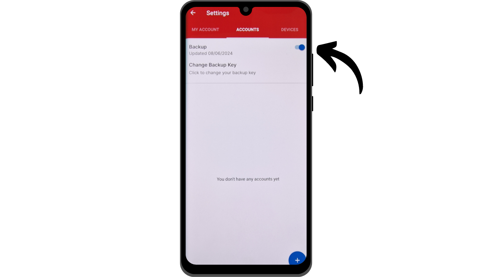
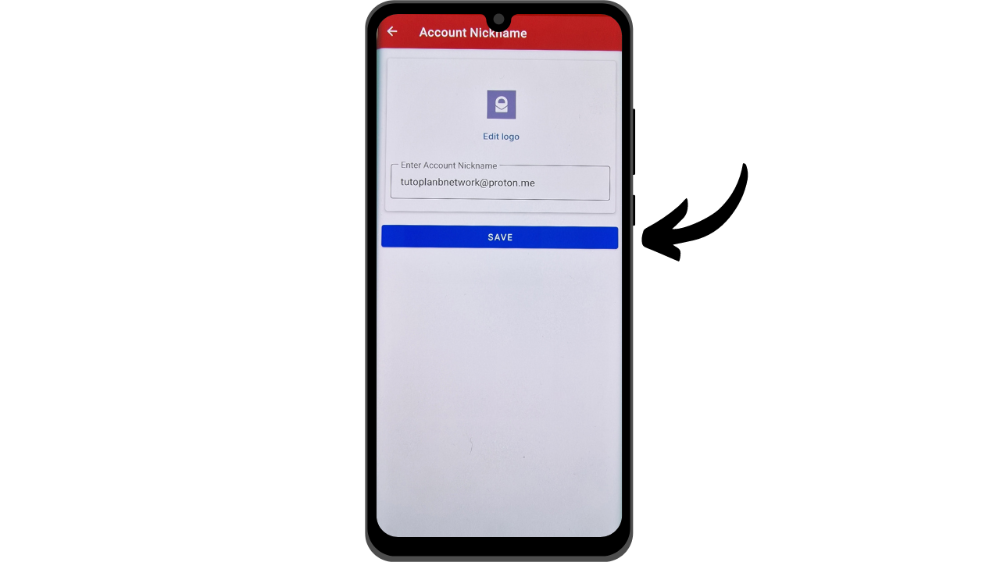

De nos jours, l'authentification à deux facteurs (2FA) est devenue indispensable pour renforcer la sécurité des comptes en ligne face aux accès non autorisés. Avec l'augmentation des attaques informatiques, se reposer uniquement sur un mot de passe pour sécuriser vos comptes est parfois insuffisant. Le 2FA introduit une couche de sécurité supplémentaire en requérant une seconde forme d'authentification en plus du mot de passe. Cette vérification peut prendre plusieurs formes, comme un code envoyé par SMS, un code dynamique généré par une application dédiée, ou encore l'utilisation d'une clé de sécurité physique. L'utilisation du 2FA diminue grandement les risques de compromission de vos comptes, même en cas de vol de votre mot de passe.

## Le 2FA par application d'authentification

Nous découvrirons d'autres solutions comme les clés de sécurité physique dans d'autres tutoriels, mais dans celui-ci, je vous propose de parler spécifiquement des applications de 2FA. Le fonctionnement de ces applications est assez simple : lorsque le 2FA est activé sur un compte, à chaque connexion, il vous sera demandé non seulement votre mot de passe habituel, mais aussi un code à 6 chiffres. Ce code est généré par votre application de 2FA. Une caractéristique importante de ce code à 6 chiffres est qu'il n'est pas statique ; un nouveau code est généré par l'application toutes les 30 secondes.

Le renouvellement du code toutes les 30 secondes rend très difficile pour un attaquant d'accéder à votre compte. Ce système empêche les attaquants de réutiliser un code volé ou intercepté, car celui-ci expire rapidement. Ainsi, même si un attaquant parvient à obtenir le code, il ne pourra l'utiliser que durant une très courte fenêtre de temps avant qu'un nouveau code ne soit requis. De plus, le fait que le code change si fréquemment réduit considérablement le temps disponible pour un pirate qui tenterait de deviner le code par brute force.

Le 2FA via des applications d'authentification représente donc une méthode facile à utiliser et gratuite pour améliorer significativement la sécurité de vos comptes en ligne.

Il existe de nombreuses applications pour configurer le 2FA, parmi lesquelles Google Authenticator et Microsoft Authenticator sont les plus connues. Toutefois, dans ce tutoriel, je souhaite vous présenter une autre solution moins connue nommée Authy. Toutes ces applications fonctionnent grâce au même protocole TOTP (*Time based One Time Password*), ce qui rend leur utilisation assez similaire.

Authy offre toutefois plusieurs avantages par rapport aux autres solutions des géants de l'informatique. Tout d'abord, elle vous permet de synchroniser vos tokens 2FA sur plusieurs appareils, ce qui peut être utile en cas de perte ou de changement de téléphone. Authy vous permet également de générer une sauvegarde chiffrée et de la stocker en ligne, ce qui vous assure de ne jamais perdre l'accès à vos tokens, même en cas de perte de votre appareil principal. Sur le plan de l'interface utilisateur, je trouve personnellement que Authy propose également une expérience plus agréable et intuitive que ses alternatives.

## Comment installer Authy ?

Sur votre smartphone, rendez-vous sur le magasin d'application (Google Play Store ou Apple Store), et recherchez "Twilio Authy Authenticator".

- [Apple](https://apps.apple.com/us/app/twilio-authy/id494168017)
- [Android](https://play.google.com/store/apps/details?id=com.authy.authy)

Lors du premier lancement de l'application, vous devrez créer un compte. Sélectionnez l'indicatif téléphonique de votre pays, ainsi que votre numéro de téléphone, puis cliquez sur "Submit".

Entrez votre adresse email pour la récupération de vos codes.

Un email vous sera envoyé pour vérifier votre adresse. Saisissez les 6 chiffres reçus pour confirmer.

Sélectionnez l'une des deux méthodes disponibles pour vérifier votre numéro de téléphone. Si vous optez pour la réception d'un SMS, saisissez le code à 6 chiffres reçu par message pour confirmer votre numéro.

Félicitations, votre compte Authy a été créé !

## Comment configurer Authy ?

Pour commencer, rendez-vous dans les paramètres de l'application en cliquant sur les trois petits points situés en haut à droite de l'écran.

Puis cliquez sur "Settings".

Dans l'onglet "My Account", vous avez la possibilité de modifier votre compte. Je vous recommande d'ajouter un code PIN à l'application en sélectionnant "App Protection". Cela permet d'ajouter une couche supplémentaire de sécurité pour accéder à votre application.

Dans l'onglet "Accounts", vous pouvez configurer une sauvegarde pour vos tokens. Cette sauvegarde permet la récupération de vos codes en cas de problème. Elle est chiffrée en utilisant un mot de passe que vous devez définir. Il est important que ce mot de passe soit fort et conservé dans un endroit sûr. La mise en place de cette sauvegarde n'est pas forcément obligatoire si vous disposez d'autres méthodes de récupération, comme un second appareil avec le même compte Authy par exemple.

Dans l'onglet "Devices", vous pouvez voir tous les appareils synchronisés avec votre compte Authy. Vous avez la possibilité de désactiver l'usage de plusieurs appareils, ce qui restreint l'accès à votre compte à cet appareil uniquement. Si vous n'utilisez qu'un seul appareil, cela permet d'augmenter la sécurité de votre compte, mais assurez-vous d'avoir une autre méthode de sauvegarde en cas de perte de cet appareil.

Si vous préférez permettre l'ajout d'autres appareils, je vous conseille d'activer l'option qui requiert une confirmation depuis les appareils actuellement autorisés sur votre compte Authy avant d'ajouter un nouvel appareil.

Pour ajouter un nouvel appareil, répétez simplement le processus d'installation présenté dans la partie précédente en utilisant les mêmes identifiants. Il vous sera alors demandé de confirmer ce nouvel accès depuis votre appareil principal.

## Comment mettre en place le 2FA sur un compte ?

Pour mettre en place un code d'authentification 2FA via une application comme Authy sur un compte, celui-ci doit supporter cette fonctionnalité. De nos jours, la majorité des services en ligne proposent cette option de 2FA, mais ce n'est pas toujours le cas. Prenons l'exemple de la boîte mail Proton que j'ai présentée dans [un autre tutoriel](https://planb.network/tutorials/others/proton-mail).

Vous trouverez généralement cette option de 2FA dans les paramètres de votre compte, souvent sous la section "Password" ou "Security".

Lorsque vous activez cette option sur votre boîte mail Proton, un QR code vous est présenté. Vous devez alors scanner ce QR code avec votre application Authy.

Sur Authy, cliquez le bouton "+".

Cliquez sur "Scan QR Code". Puis scannez le QR code sur le site web.

Vous avez également la possibilité d'ajuster votre nom d'utilisateur si nécessaire. Après modification, cliquez sur le bouton "SAVE".

Authy vous affichera alors votre code dynamique à 6 chiffres spécifique à ce compte qui se renouvelle toutes les 30 secondes.

Entrez ce code sur le site web pour finaliser la configuration du 2FA.

Certains sites vous fourniront également des codes de récupération après l'activation du 2FA. Ces codes vous permettent d'accéder à votre compte si vous perdez l'accès à votre application Authy. Je vous recommande de les sauvegarder dans un endroit sûr.

Votre compte est maintenant sécurisé avec une double authentification via l'application Authy.

À chaque nouvelle connexion sur le compte, vous devrez fournir le code dynamique généré par Authy. Vous pouvez maintenant sécuriser tous vos comptes compatibles avec cette méthode de 2FA. Pour ajouter un nouveau compte sur Authy, cliquez sur les trois petits points en haut à droite de l'application.

Puis de cliquer sur "Add Account".

Suivez ensuite les mêmes étapes que celles utilisées pour le premier compte. Vos différents codes dynamiques seront visibles sur la page d'accueil de Authy.
