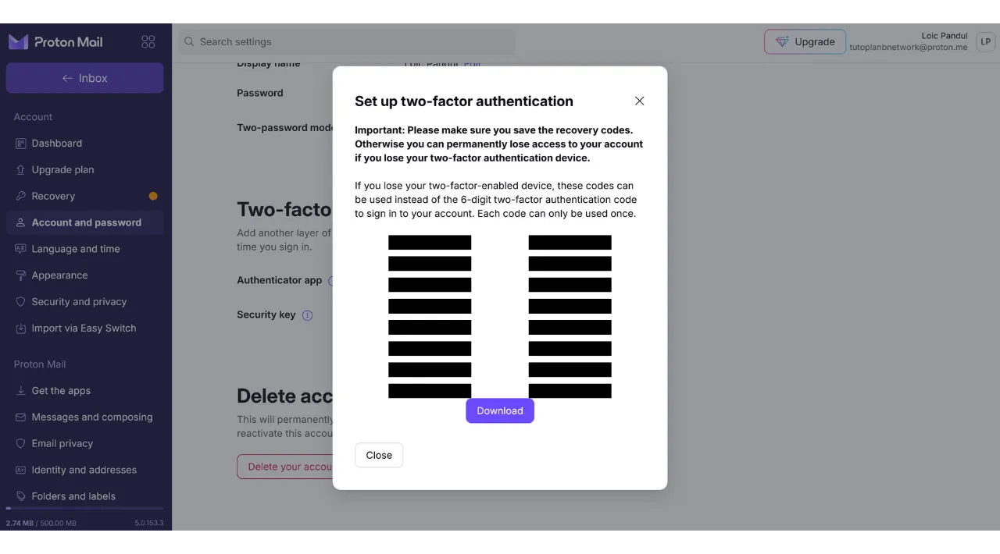

Oggi giorno, l'autenticazione a due fattori (2FA) è diventata essenziale per migliorare la sicurezza degli account online contro l'accesso non autorizzato. Con l'aumento degli attacchi informatici, affidarsi esclusivamente a una password per proteggere i propri account è a volte insufficiente. La 2FA introduce un ulteriore livello di sicurezza richiedendo una seconda forma di autenticazione in aggiunta alla password. Questa verifica può assumere diverse forme, come un codice inviato tramite SMS, un codice dinamico generato da un'app dedicata o l'uso di una chiave di sicurezza fisica. L'uso della 2FA riduce notevolmente il rischio che i tuoi account vengano compromessi, anche nel caso in cui la tua password venga rubata.

## 2FA tramite App di Autenticazione

Esploreremo altre soluzioni come le chiavi di sicurezza fisiche in altri tutorial, ma in questo voglio discutere specificamente delle applicazioni 2FA. Il funzionamento di queste applicazioni è piuttosto semplice: quando la 2FA è attivata su un account, ad ogni accesso, ti verrà chiesto non solo la tua solita password ma anche un codice a 6 cifre. Questo codice è generato dalla tua applicazione 2FA. Una caratteristica importante di questo codice a 6 cifre è che non è statico; un nuovo codice viene generato dall'applicazione ogni 30 secondi.

Il rinnovo del codice ogni 30 secondi rende molto difficile per un attaccante accedere al tuo account. Questo sistema impedisce agli attaccanti di riutilizzare un codice rubato o intercettato, poiché scade rapidamente. Così, anche se un attaccante riesce ad ottenere il codice, potrà utilizzarlo solo in una finestra di tempo molto breve prima che sia richiesto un nuovo codice. Inoltre, il fatto che il codice cambi così frequentemente riduce significativamente il tempo a disposizione di un hacker che tenta di indovinare il codice attraverso attacchi di forza bruta.

La 2FA tramite app di autenticazione rappresenta quindi un metodo facile da usare e gratuito per migliorare notevolmente la sicurezza dei tuoi account online.

Ci sono numerose applicazioni per impostare la 2FA, tra cui Google Authenticator e Microsoft Authenticator sono le più conosciute. Tuttavia, in questo tutorial, desidero presentarvi un'altra soluzione meno nota chiamata Authy. Tutte queste applicazioni operano utilizzando lo stesso protocollo TOTP (*Time based One Time Password*), rendendo il loro uso abbastanza simile.
Authy offre diversi vantaggi rispetto ad altre soluzioni delle grandi aziende tecnologiche. Prima di tutto, permette di sincronizzare i tuoi token 2FA su più dispositivi, il che può essere utile in caso di perdita o cambio di telefono. Authy consente anche di generare un backup crittografato e di memorizzarlo online, assicurandoti di non perdere mai l'accesso ai tuoi token, anche se perdi il dispositivo principale. Da un punto di vista dell'interfaccia utente, personalmente trovo che Authy offra anche un'esperienza più piacevole e intuitiva rispetto alle sue alternative.

## Come installare Authy?

Sul tuo smartphone, vai allo store di app (Google Play Store o Apple Store), e cerca "*Twilio Authy Authenticator*".

- [Apple](https://apps.apple.com/us/app/twilio-authy/id494168017)
- [Android](https://play.google.com/store/apps/details?id=com.authy.authy)

Alla prima apertura dell'app, dovrai creare un account. Seleziona il prefisso telefonico del tuo paese, così come il tuo numero di telefono, poi clicca su "*Invia*".

Inserisci il tuo indirizzo email per il recupero del codice.
Un'email verrà inviata per verificare il tuo indirizzo. Inserisci i 6 numeri ricevuti per confermare.
Seleziona uno dei due metodi disponibili per verificare il tuo numero di telefono. Se opti per ricevere un SMS, inserisci il codice a 6 cifre ricevuto tramite messaggio per confermare il tuo numero.
Congratulazioni, il tuo account Authy è stato creato!

## Come configurare Authy?

Per iniziare, vai nelle impostazioni dell'app cliccando sui tre piccoli punti situati in alto a destra dello schermo.
Poi clicca su "Impostazioni".
Nella scheda "Il Mio Account", hai l'opzione di modificare il tuo account. Ti consiglio di aggiungere un codice PIN all'app selezionando "Protezione App". Questo aggiunge un ulteriore livello di sicurezza per accedere alla tua applicazione.
Nella scheda "Account", puoi impostare un backup per i tuoi token. Questo backup permette il recupero dei tuoi codici in caso di problemi. È criptato utilizzando una password che devi definire. È importante che questa password sia forte e conservata in un luogo sicuro. Impostare questo backup non è necessariamente obbligatorio se hai altri metodi di recupero, come un secondo dispositivo con lo stesso account Authy, ad esempio.
Nella scheda "Dispositivi", puoi vedere tutti i dispositivi sincronizzati con il tuo account Authy. Hai l'opzione di disabilitare l'uso di più dispositivi, che limita l'accesso al tuo account a quel dispositivo solamente. Se usi solo un dispositivo, questo può aumentare la sicurezza del tuo account, ma assicurati di avere un altro metodo di backup in caso perdessi quel dispositivo.

Se preferisci permettere l'aggiunta di altri dispositivi, ti consiglio di attivare l'opzione che richiede la conferma dai dispositivi attualmente autorizzati sul tuo account Authy prima di aggiungere un nuovo dispositivo.
Per aggiungere un nuovo dispositivo, basta ripetere il processo di installazione presentato nella parte precedente utilizzando le stesse credenziali. Ti verrà poi chiesto di confermare questo nuovo accesso dal tuo dispositivo principale.

## Come impostare il 2FA su un account?

Per impostare un codice di autenticazione 2FA tramite un'app come Authy su un account, l'account deve supportare questa funzionalità. Oggi, la maggior parte dei servizi online offre questa opzione 2FA, ma non è sempre il caso. Prendiamo l'esempio dell'account Proton mail che ho presentato in un altro tutorial:

https://planb.network/tutorials/others/proton-mail
Generalmente troverai questa opzione 2FA nelle impostazioni del tuo account, spesso sotto la sezione "Password" o "Sicurezza".
Quando attivi questa opzione sul tuo account Proton mail, ti viene presentato un codice QR. Devi quindi scansionare questo codice QR con la tua app Authy.
Su Authy, clicca sul pulsante "+".
Clicca su "*Scan QR Code*". Quindi, scansiona il codice QR presente sul sito web. 
Hai anche l'opzione di modificare il tuo nome utente se necessario. Dopo aver apportato le modifiche, clicca sul pulsante "*SAVE*".

Authy mostrerà quindi il tuo codice dinamico a 6 cifre specifico per quel conto, che si aggiorna ogni 30 secondi.

Inserisci questo codice sul sito web per completare l'impostazione del 2FA.

Alcuni siti ti forniranno anche dei codici di recupero dopo aver attivato il 2FA. Questi codici ti permettono di accedere al tuo account se perdi l'accesso alla tua app Authy. Ti raccomando di salvarli in un luogo sicuro.
Il tuo account è ora protetto con l'autenticazione a due fattori tramite l'app Authy.

Ogni volta che accedi all'account, dovrai fornire il codice dinamico generato da Authy. Ora puoi proteggere tutti i tuoi account compatibili con questo metodo 2FA. Per aggiungere un nuovo account su Authy, clicca sui tre piccoli punti in alto a destra dell'app.

Poi clicca su "*Add Account*".

Segui gli stessi passaggi usati per il primo account. I tuoi vari codici dinamici saranno visibili sulla pagina principale di Authy.