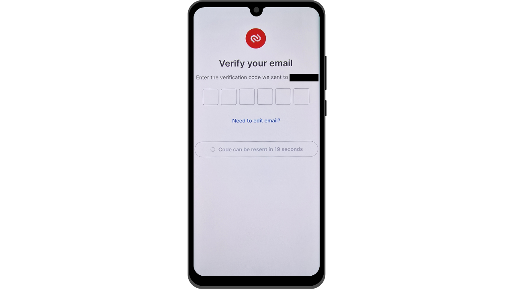
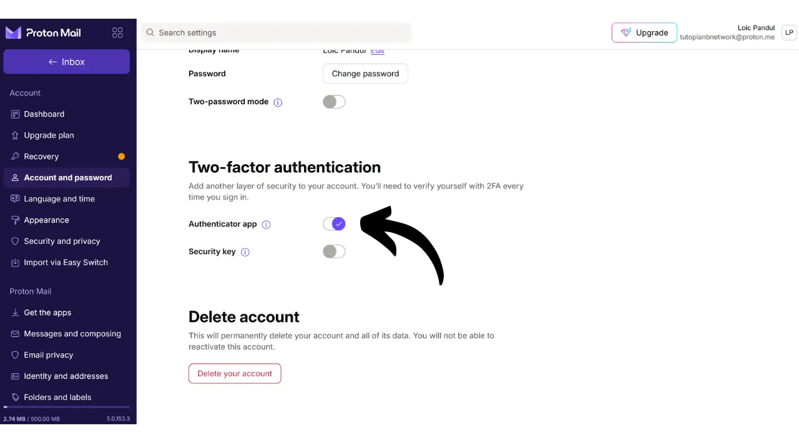

現在、二要素認証（2FA）は、不正アクセスからオンラインアカウントのセキュリティを強化するために不可欠になっています。サイバー攻撃の増加に伴い、パスワードのみに頼ることでアカウントを保護することは時に不十分です。2FAは、パスワードに加えて、第二の認証形式を要求することでセキュリティの追加層を導入します。この検証は、SMS経由で送信されるコード、専用アプリによって生成される動的コード、または物理的なセキュリティキーの使用など、いくつかの形式を取ります。2FAの使用は、パスワードが盗まれた場合でも、アカウントが侵害されるリスクを大幅に減少させます。

## 認証アプリを通じた2FA

他のチュートリアルで物理的なセキュリティキーなどの他の解決策を探求しますが、このチュートリアルでは、2FAアプリケーションに特に焦点を当てます。これらのアプリケーションの操作は非常にシンプルです：アカウントに2FAが有効になっている場合、ログインするたびに、通常のパスワードだけでなく、6桁のコードも求められます。このコードは2FAアプリケーションによって生成されます。この6桁のコードの重要な特徴は、静的ではないことです。新しいコードはアプリケーションによって30秒ごとに生成されます。

コードが30秒ごとに新しくなることで、攻撃者がアカウントにアクセスすることは非常に困難になります。このシステムは、盗まれたり傍受されたりしたコードの再利用を防ぎ、コードがすぐに期限切れになるためです。したがって、攻撃者がコードを入手したとしても、新しいコードが必要になる前の非常に短い時間窓でのみ使用できます。さらに、コードが頻繁に変更されることで、ハッカーがブルートフォース攻撃でコードを推測しようとする際の利用可能な時間が大幅に減少します。

したがって、認証アプリを通じた2FAは、オンラインアカウントのセキュリティを大幅に向上させる、使いやすく無料の方法を表しています。

2FAを設定するための多数のアプリケーションがあり、その中でもGoogle AuthenticatorとMicrosoft Authenticatorが最もよく知られています。しかし、このチュートリアルでは、Authyというあまり知られていない別の解決策を紹介したいと思います。これらのアプリケーションはすべて、同じTOTP（*Time based One Time Password*）プロトコルを使用して動作するため、使用方法は非常に似ています。
Authyは、大手テクノロジー企業の他の解決策に比べていくつかの利点を提供します。何よりもまず、複数のデバイス間で2FAトークンを同期させることができるため、電話の紛失や変更の場合に便利です。Authyはまた、暗号化されたバックアップを生成し、オンラインで保存することを可能にし、主要なデバイスを失ったとしてもトークンへのアクセスを決して失わないようにします。ユーザーインターフェースの観点から、私個人的には、Authyがその代替品よりもより快適で直感的な体験を提供すると感じています。

## Authyのインストール方法

スマートフォンでアプリストア（Google Play StoreまたはApple Store）にアクセスし、"*Twilio Authy Authenticator*"を検索します。

- [Apple](https://apps.apple.com/us/app/twilio-authy/id494168017)
- [Android](https://play.google.com/store/apps/details?id=com.authy.authy)

アプリを初めて起動すると、アカウントを作成する必要があります。国のダイヤルコードと電話番号を選択し、"*Submit*"をクリックします。

コード回復用のメールアドレスを入力してください。
あなたのアドレスを確認するためのメールが送信されます。受け取った6桁の数字を入力して確認してください。

電話番号を確認するための2つの利用可能な方法のうち、1つを選択してください。SMSを受け取ることを選択した場合は、メッセージで受け取った6桁のコードを入力して、あなたの番号を確認してください。

おめでとうございます、あなたのAuthyアカウントが作成されました！

## Authyを設定する方法は？

まず、画面右上にある3つの小さな点をクリックして、アプリの設定に移動します。

次に、"*Settings*"をクリックします。

"*My Account*"タブでは、アカウントを変更するオプションがあります。"*App Protection*"を選択してアプリにPINコードを追加することをお勧めします。これにより、アプリケーションへのアクセスに追加のセキュリティ層が追加されます。

"*Accounts*"タブでは、トークンのバックアップを設定できます。このバックアップにより、問題が発生した場合にコードを回復できます。これは、あなたが定義するパスワードを使用して暗号化されます。このパスワードは強力で、安全な場所に保管することが重要です。他の回復方法、例えば同じAuthyアカウントを持つ別のデバイスがある場合など、このバックアップを設定することは必ずしも必須ではありません。
"*Devices*"タブでは、Authyアカウントと同期しているすべてのデバイスを確認できます。複数のデバイスの使用を無効にするオプションがあり、これによりアカウントへのアクセスがそのデバイスにのみ制限されます。1台のデバイスのみを使用する場合、これによりアカウントのセキュリティが向上しますが、そのデバイスを紛失した場合に備えて、別のバックアップ方法を用意しておくことを確認してください。

他のデバイスの追加を許可する場合は、新しいデバイスを追加する前に現在認証されているデバイスからの確認を要求するオプションを有効にすることをお勧めします。

新しいデバイスを追加するには、前の部分で提示されたインストールプロセスを同じ資格情報を使用して繰り返すだけです。その後、メインデバイスからこの新しいアクセスを確認するよう求められます。

## アカウントに2FAを設定する方法は？

Authyのようなアプリを介して2FA認証コードをアカウントに設定するには、そのアカウントがこの機能をサポートしている必要があります。現在、多くのオンラインサービスがこの2FAオプションを提供していますが、常にそうとは限りません。別のチュートリアルで紹介したProtonメールアカウントの例を取り上げましょう：

https://planb.network/tutorials/others/proton-mail

通常、この2FAオプションはアカウントの設定内、多くの場合"*Password*"や"*Security*"セクションの下にあります。

Protonメールアカウントでこのオプションを有効にすると、QRコードが表示されます。その後、AuthyアプリでこのQRコードをスキャンする必要があります。

Authyでは、"*+*"ボタンをクリックします。

"*Scan QR Code*"をクリックしてください。その後、ウェブサイト上のQRコードをスキャンします。

必要に応じてユーザーネームを調整するオプションもあります。変更後、"*SAVE*"ボタンをクリックしてください。

Authyはそのアカウント専用の動的な6桁のコードを表示します。このコードは30秒ごとに更新されます。

このコードをウェブサイトに入力して、2FAの設定を完了してください。

2FAを有効にした後、一部のサイトでは回復コードも提供されます。これらのコードを使用すると、Authyアプリへのアクセスを失った場合でもアカウントにアクセスできます。安全な場所に保存することをお勧めします。
アカウントは、Authyアプリを介した二要素認証で保護されています。

アカウントにログインするたびに、Authyによって生成された動的コードを提供する必要があります。この2FA方法で互換性のあるすべてのアカウントを保護することができます。Authyで新しいアカウントを追加するには、アプリの右上にある三つの小さな点をクリックしてください。

その後、"*Add Account*"をクリックします。

最初のアカウントに使用したのと同じ手順に従ってください。Authyのホームページでさまざまな動的コードが表示されます。