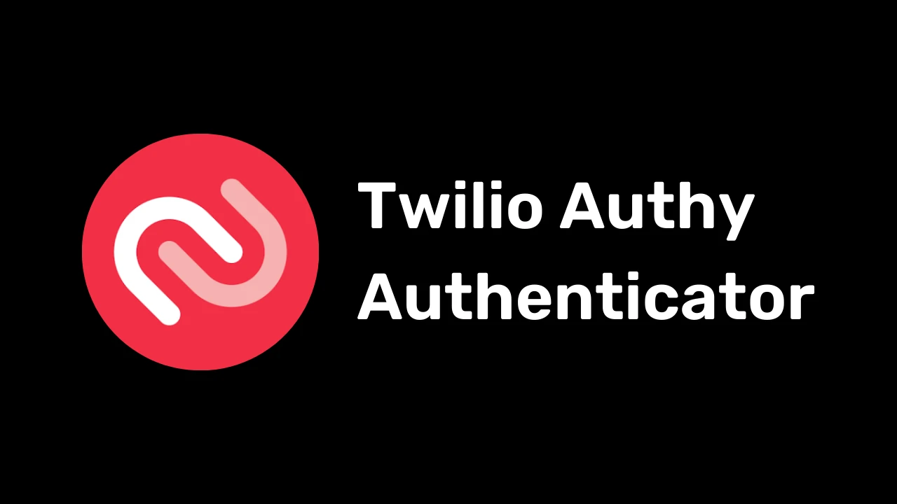
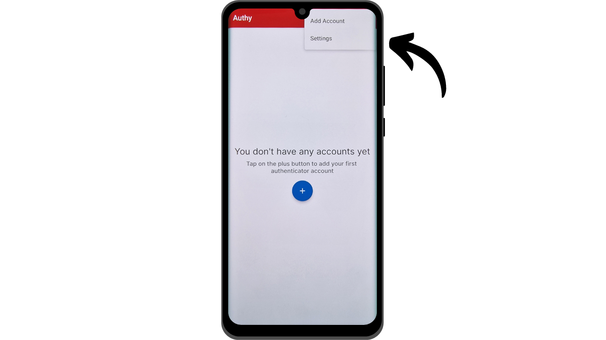

Hoje em dia, a autenticação de dois fatores (2FA) tornou-se essencial para aumentar a segurança de contas online contra acessos não autorizados. Com o aumento dos ataques cibernéticos, confiar apenas em uma senha para proteger suas contas é, às vezes, insuficiente. O 2FA introduz uma camada adicional de segurança ao exigir uma segunda forma de autenticação além da senha. Essa verificação pode assumir várias formas, como um código enviado via SMS, um código dinâmico gerado por um aplicativo dedicado ou o uso de uma chave de segurança física. O uso do 2FA reduz significativamente o risco de suas contas serem comprometidas, mesmo no caso de sua senha ser roubada.

## 2FA via Aplicativos de Autenticação

Exploraremos outras soluções como chaves de segurança físicas em outros tutoriais, mas neste, proponho discutir especificamente os aplicativos de 2FA. O funcionamento desses aplicativos é bastante simples: quando o 2FA é ativado em uma conta, a cada login, será solicitado não apenas sua senha usual, mas também um código de 6 dígitos. Este código é gerado pelo seu aplicativo de 2FA. Uma característica importante deste código de 6 dígitos é que ele não é estático; um novo código é gerado pelo aplicativo a cada 30 segundos.

A renovação do código a cada 30 segundos torna muito difícil para um invasor acessar sua conta. Este sistema impede que os invasores reutilizem um código roubado ou interceptado, pois ele expira rapidamente. Assim, mesmo que um invasor consiga obter o código, ele só poderá usá-lo durante uma janela de tempo muito curta antes que um novo código seja necessário. Além disso, o fato de o código mudar com tanta frequência reduz significativamente o tempo disponível para um hacker tentar adivinhar o código por meio de força bruta.

O 2FA via aplicativos de autenticação representa, assim, um método fácil de usar e gratuito para melhorar significativamente a segurança de suas contas online.

Existem inúmeros aplicativos para configurar o 2FA, entre os quais o Google Authenticator e o Microsoft Authenticator são os mais conhecidos. No entanto, neste tutorial, desejo apresentar a você uma solução menos conhecida chamada Authy. Todos esses aplicativos operam usando o mesmo protocolo TOTP (*Time based One Time Password*), tornando seu uso bastante semelhante.
Authy oferece várias vantagens sobre outras soluções das grandes empresas de tecnologia. Primeiramente, permite sincronizar seus tokens de 2FA em vários dispositivos, o que pode ser útil em caso de perda ou troca de telefone. O Authy também permite gerar um backup criptografado e armazená-lo online, garantindo que você nunca perca o acesso aos seus tokens, mesmo se perder seu dispositivo principal. Do ponto de vista da interface do usuário, pessoalmente, acho que o Authy também oferece uma experiência mais agradável e intuitiva do que suas alternativas.

## Como instalar o Authy?

No seu smartphone, vá até a loja de aplicativos (Google Play Store ou Apple Store) e procure por "*Twilio Authy Authenticator*".

- [Apple](https://apps.apple.com/us/app/twilio-authy/id494168017)
- [Android](https://play.google.com/store/apps/details?id=com.authy.authy)

Na primeira inicialização do aplicativo, você precisará criar uma conta. Selecione o código de discagem do seu país, bem como o seu número de telefone, e clique em "*Submit*".

Digite seu endereço de e-mail para recuperação de código.
Um email será enviado para você para verificar seu endereço. Insira os 6 dígitos recebidos para confirmar.

Selecione um dos dois métodos disponíveis para verificar seu número de telefone. Se optar por receber um SMS, insira o código de 6 dígitos recebido por mensagem para confirmar seu número.

Parabéns, sua conta Authy foi criada!

## Como configurar o Authy?

Para começar, vá até as configurações do aplicativo clicando nos três pequenos pontos localizados no canto superior direito da tela.

Em seguida, clique em "*Configurações*".

Na aba "*Minha Conta*", você tem a opção de modificar sua conta. Eu recomendo adicionar um código PIN ao aplicativo selecionando "*Proteção do Aplicativo*". Isso adiciona uma camada extra de segurança para acessar seu aplicativo.

Na aba "*Contas*", você pode configurar um backup para seus tokens. Esse backup permite a recuperação de seus códigos em caso de problema. Ele é criptografado usando uma senha que você deve definir. É importante que essa senha seja forte e mantida em um local seguro. Configurar esse backup não é necessariamente obrigatório se você tiver outros métodos de recuperação, como um segundo dispositivo com a mesma conta Authy, por exemplo.
Na aba "*Dispositivos*", você pode ver todos os dispositivos sincronizados com sua conta Authy. Você tem a opção de desabilitar o uso de múltiplos dispositivos, o que restringe o acesso à sua conta apenas àquele dispositivo. Se você usa apenas um dispositivo, isso pode aumentar a segurança da sua conta, mas certifique-se de ter outro método de backup em caso de perda desse dispositivo.

Se preferir permitir a adição de outros dispositivos, aconselho a ativar a opção que requer confirmação dos dispositivos atualmente autorizados na sua conta Authy antes de adicionar um novo dispositivo.

Para adicionar um novo dispositivo, basta repetir o processo de instalação apresentado na parte anterior usando as mesmas credenciais. Então, será solicitado que você confirme esse novo acesso a partir do seu dispositivo principal.

## Como configurar o 2FA em uma conta?

Para configurar um código de autenticação 2FA via um aplicativo como o Authy em uma conta, a conta deve suportar esse recurso. Atualmente, a maioria dos serviços online oferece essa opção de 2FA, mas nem sempre é o caso. Vamos tomar o exemplo da conta de Proton Mail que apresentei em outro tutorial:

https://planb.network/tutorials/others/proton-mail

Você geralmente encontrará essa opção de 2FA nas configurações da sua conta, muitas vezes sob a seção "*Senha*" ou "*Segurança*".

Quando você ativa essa opção na sua conta Proton Mail, um código QR é apresentado a você. Você deve então escanear esse código QR com seu aplicativo Authy.

No Authy, clique no botão "*+*".

Clique em "*Scan QR Code*". Em seguida, escaneie o código QR no site. 
Você também tem a opção de ajustar seu nome de usuário, se necessário. Após fazer as alterações, clique no botão "*SAVE*".

O Authy exibirá então o seu código dinâmico de 6 dígitos específico para aquela conta, que se atualiza a cada 30 segundos.

Insira este código no site para finalizar a configuração do 2FA.

Alguns sites também fornecerão códigos de recuperação após a ativação do 2FA. Esses códigos permitem que você acesse sua conta se perder o acesso ao seu aplicativo Authy. Recomendo salvar esses códigos em um local seguro.
 Sua conta agora está segura com a autenticação de dois fatores via aplicativo Authy.

Toda vez que você fizer login na conta, precisará fornecer o código dinâmico gerado pelo Authy. Agora você pode proteger todas as suas contas compatíveis com este método de 2FA. Para adicionar uma nova conta no Authy, clique nos três pequenos pontos no canto superior direito do aplicativo.

Em seguida, clique em "*Add Account*".

Siga os mesmos passos usados para a primeira conta. Seus diversos códigos dinâmicos estarão visíveis na página inicial do Authy.