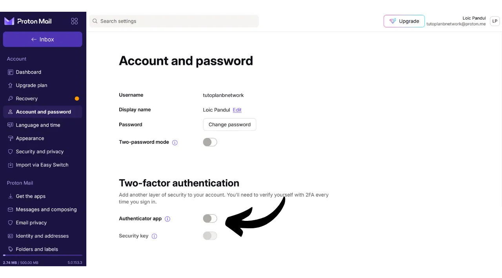

В наше время двухфакторная аутентификация (2FA) стала необходимым условием для повышения безопасности онлайн-аккаунтов от несанкционированного доступа. С увеличением числа кибератак, опираться только на пароль для защиты ваших аккаунтов иногда недостаточно. 2FA вводит дополнительный уровень безопасности, требуя второй формы аутентификации в дополнение к паролю. Эта верификация может принимать различные формы, такие как код, отправленный по SMS, динамический код, сгенерированный специализированным приложением, или использование физического ключа безопасности. Использование 2FA значительно снижает риск компрометации ваших аккаунтов, даже в случае кражи вашего пароля.

## 2FA через приложения аутентификации

Мы рассмотрим другие решения, такие как физические ключи безопасности, в других учебных пособиях, но в этом я предлагаю конкретно обсудить приложения для 2FA. Принцип работы этих приложений довольно прост: когда 2FA активирована на аккаунте, при каждом входе в систему от вас будут требовать не только ваш обычный пароль, но и 6-значный код. Этот код генерируется вашим приложением для 2FA. Важной особенностью этого 6-значного кода является то, что он не статичен; новый код генерируется приложением каждые 30 секунд.

Обновление кода каждые 30 секунд делает очень сложным для атакующего доступ к вашему аккаунту. Эта система предотвращает повторное использование украденного или перехваченного кода, поскольку он быстро истекает. Таким образом, даже если атакующему удается получить код, он сможет использовать его только в течение очень короткого времени до того, как потребуется новый код. Более того, факт того, что код изменяется так часто, значительно сокращает время, доступное хакеру для попыток угадать код методом грубой силы.

Таким образом, 2FA через приложения аутентификации представляет собой простой в использовании и бесплатный метод значительного повышения безопасности ваших онлайн-аккаунтов.

Существует множество приложений для настройки 2FA, среди которых Google Authenticator и Microsoft Authenticator являются наиболее известными. Однако, в этом учебном пособии, я хочу представить вам другое, менее известное решение под названием Authy. Все эти приложения работают с использованием одного и того же протокола TOTP (*Time based One Time Password*), что делает их использование довольно схожим.
Authy предлагает несколько преимуществ по сравнению с другими решениями от крупных технологических компаний. Прежде всего, оно позволяет синхронизировать ваши токены 2FA на нескольких устройствах, что может быть полезно в случае потери или смены телефона. Authy также позволяет создавать зашифрованную резервную копию и хранить ее в сети, гарантируя, что вы никогда не потеряете доступ к вашим токенам, даже если потеряете основное устройство. С точки зрения пользовательского интерфейса, лично я считаю, что Authy также предлагает более приятный и интуитивно понятный опыт, чем его альтернативы.

## Как установить Authy?

На вашем смартфоне перейдите в магазин приложений (Google Play Store или Apple Store) и найдите "*Twilio Authy Authenticator*".

- [Apple](https://apps.apple.com/us/app/twilio-authy/id494168017)
- [Android](https://play.google.com/store/apps/details?id=com.authy.authy)

При первом запуске приложения вам нужно будет создать аккаунт. Выберите код страны, а также ваш номер телефона, затем нажмите на "*Отправить*".

Введите ваш адрес электронной почты для восстановления кода.
На ваш адрес будет отправлено письмо для подтверждения. Введите полученные 6 цифр для подтверждения.

Выберите один из двух доступных методов для подтверждения вашего номера телефона. Если вы выбрали получение SMS, введите 6-значный код, полученный сообщением, чтобы подтвердить ваш номер.

Поздравляем, ваш аккаунт Authy создан!

## Как настроить Authy?

Для начала перейдите в настройки приложения, нажав на три маленькие точки в верхнем правом углу экрана.

Затем нажмите на "*Настройки*".

Во вкладке "*Мой аккаунт*" у вас есть возможность изменить ваш аккаунт. Я рекомендую добавить PIN-код к приложению, выбрав "*Защита приложения*". Это добавляет дополнительный уровень безопасности для доступа к вашему приложению.

Во вкладке "*Аккаунты*" вы можете настроить резервное копирование для ваших токенов. Это резервное копирование позволяет восстановить ваши коды в случае возникновения проблем. Оно зашифровано с использованием пароля, который вы должны задать. Важно, чтобы этот пароль был надежным и хранился в безопасном месте. Настройка этого резервного копирования не обязательна, если у вас есть другие методы восстановления, например, второе устройство с тем же аккаунтом Authy.
Во вкладке "*Устройства*" вы можете видеть все устройства, синхронизированные с вашим аккаунтом Authy. У вас есть возможность отключить использование нескольких устройств, что ограничивает доступ к вашему аккаунту только этим устройством. Если вы используете только одно устройство, это может повысить безопасность вашего аккаунта, но убедитесь, что у вас есть другой метод восстановления на случай потери этого устройства.

Если вы предпочитаете разрешить добавление других устройств, я советую активировать опцию, которая требует подтверждения от уже авторизованных устройств на вашем аккаунте Authy перед добавлением нового устройства.

Чтобы добавить новое устройство, просто повторите процесс установки, представленный в предыдущей части, используя те же учетные данные. Затем вам будет предложено подтвердить этот новый доступ с вашего основного устройства.

## Как настроить 2FA на аккаунте?

Чтобы настроить аутентификацию с помощью 2FA через приложение, например Authy, на аккаунте, аккаунт должен поддерживать эту функцию. В наши дни большинство онлайн-сервисов предлагают эту опцию 2FA, но это не всегда так. Возьмем, к примеру, аккаунт Proton Mail, который я представил в другом уроке:

https://planb.network/tutorials/others/proton-mail

Обычно эту опцию 2FA вы найдете в настройках вашего аккаунта, часто в разделе "*Пароль*" или "*Безопасность*".

Когда вы активируете эту опцию на вашем аккаунте Proton Mail, вам будет представлен QR-код. Затем вам нужно будет отсканировать этот QR-код с помощью вашего приложения Authy.

В Authy нажмите кнопку "*+*".
Нажмите на "*Scan QR Code*". Затем отсканируйте QR-код на сайте. 
У вас также есть возможность при необходимости изменить ваше имя пользователя. После внесения изменений нажмите кнопку "*SAVE*".

После этого Authy отобразит ваш уникальный динамический 6-значный код для этого аккаунта, который обновляется каждые 30 секунд.

Введите этот код на сайте, чтобы завершить настройку 2FA.

Некоторые сайты также предоставят вам коды восстановления после активации 2FA. Эти коды позволяют получить доступ к вашему аккаунту, если вы потеряете доступ к приложению Authy. Рекомендую сохранить их в надежном месте.
 Теперь ваш аккаунт защищен двухфакторной аутентификацией через приложение Authy.

Каждый раз, когда вы будете входить в аккаунт, вам нужно будет предоставить динамический код, сгенерированный Authy. Теперь вы можете защитить все свои аккаунты, совместимые с этим методом 2FA. Чтобы добавить новый аккаунт в Authy, нажмите на три маленькие точки в верхнем правом углу приложения.

Затем нажмите на "*Add Account*".

Следуйте тем же шагам, что и при добавлении первого аккаунта. Ваши различные динамические коды будут видны на главной странице Authy.