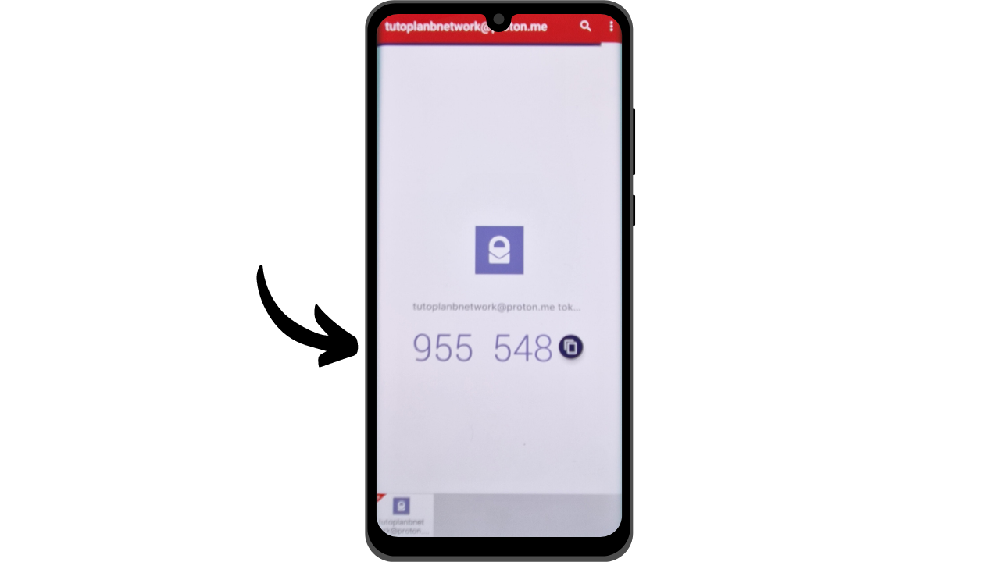

Ngày nay, xác thực hai yếu tố (2FA) đã trở nên thiết yếu để tăng cường bảo mật cho các tài khoản trực tuyến chống lại việc truy cập không được phép. Với sự gia tăng của các cuộc tấn công mạng, việc chỉ dựa vào mật khẩu để bảo vệ tài khoản của bạn đôi khi là không đủ. 2FA giới thiệu một lớp bảo mật bổ sung bằng cách yêu cầu một hình thức xác thực thứ hai ngoài mật khẩu. Việc xác minh này có thể nhận nhiều hình thức, như một mã được gửi qua SMS, một mã động được tạo bởi một ứng dụng chuyên dụng, hoặc việc sử dụng một khóa bảo mật vật lý. Việc sử dụng 2FA giảm đáng kể nguy cơ tài khoản của bạn bị xâm phạm, ngay cả trong trường hợp mật khẩu của bạn bị đánh cắp.

## 2FA qua Ứng dụng Xác thực

Chúng tôi sẽ khám phá các giải pháp khác như khóa bảo mật vật lý trong các hướng dẫn khác, nhưng trong bài này, tôi đề xuất thảo luận cụ thể về các ứng dụng 2FA. Cách hoạt động của các ứng dụng này khá đơn giản: khi 2FA được kích hoạt trên một tài khoản, mỗi lần đăng nhập, bạn sẽ không chỉ được yêu cầu mật khẩu thông thường mà còn một mã 6 chữ số. Mã này được tạo bởi ứng dụng 2FA của bạn. Một đặc điểm quan trọng của mã 6 chữ số này là nó không cố định; một mã mới được ứng dụng tạo ra mỗi 30 giây.

Việc làm mới mã mỗi 30 giây làm cho việc truy cập tài khoản của bạn trở nên rất khó khăn đối với kẻ tấn công. Hệ thống này ngăn chặn kẻ tấn công sử dụng lại mã bị đánh cắp hoặc bị chặn, vì mã sẽ nhanh chóng hết hạn. Do đó, ngay cả khi kẻ tấn công quản lý để lấy được mã, họ chỉ có thể sử dụng nó trong một khoảng thời gian rất ngắn trước khi một mã mới được yêu cầu. Hơn nữa, việc mã thay đổi thường xuyên giảm đáng kể thời gian có sẵn cho hacker cố gắng đoán mã thông qua brute force.

2FA qua ứng dụng xác thực do đó đại diện cho một phương pháp dễ sử dụng và miễn phí để cải thiện đáng kể bảo mật cho các tài khoản trực tuyến của bạn.

Có nhiều ứng dụng để thiết lập 2FA, trong đó Google Authenticator và Microsoft Authenticator là những cái tên nổi tiếng nhất. Tuy nhiên, trong hướng dẫn này, tôi muốn giới thiệu cho bạn một giải pháp ít được biết đến hơn có tên là Authy. Tất cả các ứng dụng này hoạt động dựa trên cùng một giao thức TOTP (*Time based One Time Password*), làm cho việc sử dụng chúng khá tương tự.
Authy mang lại một số lợi ích so với các giải pháp khác từ các công ty công nghệ lớn. Đầu tiên và quan trọng nhất, nó cho phép bạn đồng bộ hóa các mã 2FA trên nhiều thiết bị, có thể hữu ích trong trường hợp mất hoặc thay đổi điện thoại. Authy cũng cho phép bạn tạo một bản sao lưu mã hóa và lưu trữ nó trực tuyến, đảm bảo bạn không bao giờ mất quyền truy cập vào các mã token của mình, ngay cả khi bạn mất thiết bị chính. Từ góc độ giao diện người dùng, cá nhân tôi thấy rằng Authy cũng cung cấp một trải nghiệm dễ chịu và trực quan hơn so với các lựa chọn khác.

## Cách cài đặt Authy?

Trên điện thoại thông minh của bạn, truy cập cửa hàng ứng dụng (Google Play Store hoặc Apple Store), và tìm kiếm "*Twilio Authy Authenticator*".

- [Apple](https://apps.apple.com/us/app/twilio-authy/id494168017)
- [Android](https://play.google.com/store/apps/details?id=com.authy.authy)

Khi bạn khởi chạy ứng dụng lần đầu tiên, bạn sẽ cần tạo một tài khoản. Chọn mã quốc gia của bạn, cũng như số điện thoại của bạn, sau đó nhấp vào "*Submit*".

Nhập địa chỉ email của bạn để khôi phục mã.
Một email sẽ được gửi đến bạn để xác minh địa chỉ của bạn. Nhập 6 chữ số nhận được để xác nhận.
Chọn một trong hai phương pháp có sẵn để xác minh số điện thoại của bạn. Nếu bạn chọn nhận SMS, nhập mã 6 chữ số nhận được qua tin nhắn để xác nhận số của bạn.
Chúc mừng, tài khoản Authy của bạn đã được tạo!
## Làm thế nào để cấu hình Authy?

Để bắt đầu, hãy vào phần cài đặt của ứng dụng bằng cách nhấp vào ba chấm nhỏ nằm ở góc trên bên phải của màn hình.
Sau đó nhấp vào "*Cài đặt*".
Trong tab "*Tài Khoản Của Tôi*", bạn có tùy chọn để chỉnh sửa tài khoản của mình. Tôi khuyên bạn nên thêm mã PIN cho ứng dụng bằng cách chọn "*Bảo Vệ Ứng Dụng*". Điều này thêm một lớp bảo mật để truy cập vào ứng dụng của bạn.
Trong tab "*Tài Khoản*", bạn có thể thiết lập một bản sao lưu cho các mã token của mình. Bản sao lưu này cho phép khôi phục mã của bạn trong trường hợp có vấn đề. Nó được mã hóa bằng một mật khẩu mà bạn phải định rõ. Quan trọng là mật khẩu này phải mạnh và được giữ ở một nơi an toàn. Thiết lập bản sao lưu này không nhất thiết là bắt buộc nếu bạn có các phương pháp khôi phục khác, chẳng hạn như một thiết bị thứ hai với cùng một tài khoản Authy, ví dụ.
Trong tab "*Thiết Bị*", bạn có thể xem tất cả các thiết bị được đồng bộ hóa với tài khoản Authy của mình. Bạn có tùy chọn vô hiệu hóa việc sử dụng nhiều thiết bị, điều này hạn chế quyền truy cập vào tài khoản của bạn chỉ với thiết bị đó. Nếu bạn chỉ sử dụng một thiết bị, điều này có thể tăng cường bảo mật cho tài khoản của bạn, nhưng hãy chắc chắn rằng bạn có một phương pháp sao lưu khác trong trường hợp bạn mất thiết bị đó.

Nếu bạn muốn cho phép thêm các thiết bị khác, tôi khuyên bạn nên kích hoạt tùy chọn yêu cầu xác nhận từ các thiết bị hiện được ủy quyền trên tài khoản Authy của bạn trước khi thêm một thiết bị mới.
Để thêm một thiết bị mới, chỉ cần lặp lại quy trình cài đặt được trình bày trong phần trước sử dụng cùng một thông tin đăng nhập. Sau đó, bạn sẽ được yêu cầu xác nhận quyền truy cập mới này từ thiết bị chính của bạn.

## Làm thế nào để thiết lập 2FA cho một tài khoản?

Để thiết lập mã xác thực 2FA qua một ứng dụng như Authy cho một tài khoản, tài khoản đó phải hỗ trợ tính năng này. Ngày nay, đa số các dịch vụ trực tuyến đều cung cấp tùy chọn 2FA này, nhưng không phải lúc nào cũng vậy. Hãy lấy ví dụ về tài khoản Proton mail mà tôi đã trình bày trong một hướng dẫn khác:

https://planb.network/tutorials/others/proton-mail
Bạn sẽ thường tìm thấy tùy chọn 2FA này trong phần cài đặt của tài khoản, thường dưới mục "*Mật khẩu*" hoặc "*Bảo mật*".
Khi bạn kích hoạt tùy chọn này trên tài khoản Proton mail của mình, một mã QR sẽ được trình bày cho bạn. Bạn phải sau đó quét mã QR này với ứng dụng Authy của mình.
Trên Authy, nhấp vào nút "*+*".
Nhấp vào "*Quét mã QR*". Sau đó, quét mã QR trên trang web. 
Bạn cũng có tùy chọn điều chỉnh tên người dùng của mình nếu cần thiết. Sau khi thực hiện thay đổi, nhấp vào nút "*LƯU*".

Sau đó, Authy sẽ hiển thị mã 6 chữ số động cụ thể cho tài khoản đó, mã này sẽ được làm mới mỗi 30 giây.

Nhập mã này trên trang web để hoàn tất thiết lập 2FA.

Một số trang web cũng sẽ cung cấp cho bạn các mã khôi phục sau khi kích hoạt 2FA. Những mã này cho phép bạn truy cập vào tài khoản của mình nếu bạn mất quyền truy cập vào ứng dụng Authy. Tôi khuyên bạn nên lưu chúng ở một nơi an toàn.
Tài khoản của bạn giờ đây đã được bảo vệ bằng xác thực hai yếu tố thông qua ứng dụng Authy.

Mỗi lần bạn đăng nhập vào tài khoản, bạn sẽ cần cung cấp mã động được Authy tạo ra. Bạn giờ đây có thể bảo vệ tất cả các tài khoản tương thích với phương pháp 2FA này. Để thêm một tài khoản mới trên Authy, nhấp vào ba chấm nhỏ ở góc trên bên phải của ứng dụng.

Sau đó nhấp vào "*Thêm Tài Khoản*".

Làm theo các bước tương tự như đã sử dụng cho tài khoản đầu tiên. Các mã động khác nhau của bạn sẽ được hiển thị trên trang chủ của Authy.