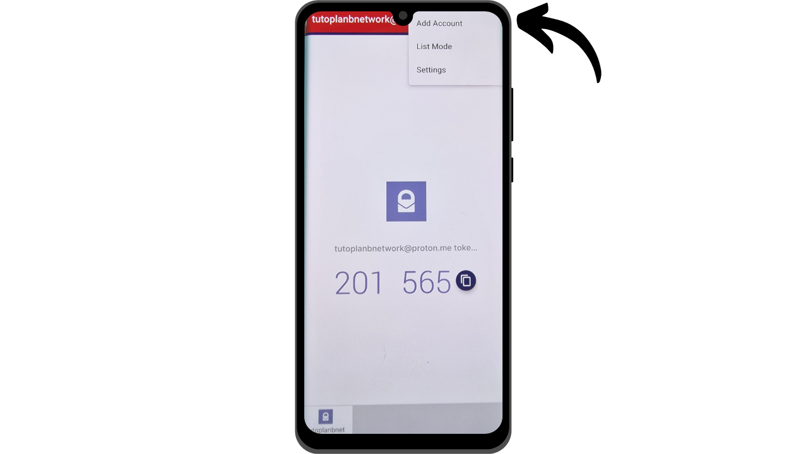

如今，两因素认证（2FA）已成为增强在线账户安全性、防止未经授权访问的必要手段。随着网络攻击的增加，仅依靠密码来保护您的账户有时是不够的。2FA通过要求除密码外的第二种形式的认证，引入了一个额外的安全层。这种验证可以采取多种形式，例如通过短信发送的代码、由专用应用生成的动态代码，或使用物理安全密钥。使用2FA大大降低了您的账户被盗用的风险，即使在您的密码被盗的情况下也是如此。

## 通过认证应用程序的2FA

我们将在其他教程中探讨物理安全密钥等其他解决方案，但在这篇文章中，我提议特别讨论2FA应用程序。这些应用程序的操作非常简单：当在账户上激活2FA时，每次登录时，不仅会要求您输入常用密码，还会要求输入一个6位数的代码。这个代码由您的2FA应用程序生成。这个6位数代码的一个重要特点是它不是静态的；应用程序每30秒就会生成一个新代码。

代码每30秒更新一次，使得攻击者很难访问您的账户。这个系统防止了攻击者重用被盗或截获的代码，因为它很快就会过期。因此，即使攻击者设法获得了代码，他们也只能在很短的时间窗口内使用它，之后就需要一个新的代码。此外，代码变化如此频繁，大大减少了黑客尝试通过暴力破解猜测代码的可用时间。

因此，通过认证应用程序的2FA代表了一种易于使用且免费的方法，可大大提高您的在线账户的安全性。

有许多应用程序可用于设置2FA，其中Google Authenticator和Microsoft Authenticator最为人所知。然而，在这个教程中，我希望向您介绍另一个较不为人知的解决方案，名为Authy。所有这些应用程序都使用相同的TOTP（基于时间的一次性密码）协议，使它们的使用非常相似。
Authy相比大型科技公司的其他解决方案有几个优势。首先，它允许您跨多个设备同步您的2FA令牌，这在手机丢失或更换的情况下非常有用。Authy还允许您生成加密备份并在线存储，确保即使您丢失了主设备，也永远不会失去对令牌的访问。从用户界面的角度来看，我个人认为Authy也提供了比其替代品更愉快、更直观的体验。

## 如何安装Authy？

在您的智能手机上，前往应用商店（Google Play商店或Apple商店），并搜索“*Twilio Authy Authenticator*”。

- [Apple](https://apps.apple.com/us/app/twilio-authy/id494168017)
- [Android](https://play.google.com/store/apps/details?id=com.authy.authy)

首次启动应用时，您需要创建一个账户。选择您所在国家的拨号代码以及您的电话号码，然后点击“*提交*”。

输入您的电子邮件地址以便代码恢复。
将会向您发送一封电子邮件以验证您的地址。输入收到的6位数字以确认。

选择两种验证电话号码的方法之一。如果您选择接收短信，请输入通过消息收到的6位验证码以确认您的号码。

恭喜，您的Authy账户已创建成功！

## 如何配置Authy？

首先，通过点击屏幕右上角的三个小点进入应用程序的设置。

然后点击“*设置*”。

在“*我的账户*”标签页中，您可以修改您的账户。我建议通过选择“*应用保护*”为应用添加PIN码。这为访问您的应用程序增加了一个额外的安全层。

在“*账户*”标签页中，您可以为您的令牌设置备份。这个备份允许在出现问题时恢复您的代码。它使用您必须定义的密码进行加密。重要的是这个密码要足够强大并且存放在安全的地方。如果您有其他恢复方法，比如使用相同Authy账户的第二台设备，那么设置这个备份不是必须的。
在“*设备*”标签页中，您可以看到所有与您的Authy账户同步的设备。您可以选择禁用多设备使用功能，这将限制对您账户的访问仅限于该设备。如果您只使用一台设备，这可以增加您账户的安全性，但请确保您有另一种备份方法以防您丢失该设备。

如果您倾向于允许添加其他设备，我建议您激活一个选项，该选项要求在向您的Authy账户添加新设备之前，从当前授权的设备上确认。

要添加新设备，只需重复前面部分介绍的安装过程，使用相同的凭据。然后，系统将要求您从主设备确认这一新访问。

## 如何在账户上设置2FA？

要通过像Authy这样的应用在账户上设置2FA认证码，该账户必须支持此功能。如今，大多数在线服务都提供这个2FA选项，但并非总是如此。以我在另一个教程中介绍的Proton邮件账户为例：

https://planb.network/tutorials/others/proton-mail

您通常会在账户的设置中找到这个2FA选项，通常位于“*密码*”或“*安全性*”部分下。

当您在您的Proton邮件账户上激活此选项时，会向您展示一个QR码。然后您必须用您的Authy应用扫描此QR码。

在Authy上，点击“*+*”按钮。

点击“*扫描二维码*”。然后扫描网站上的二维码。
如果需要，您还可以调整您的用户名。修改后，点击“*保存*”按钮。

接着，Authy 将显示该账户特有的动态6位数代码，每30秒刷新一次。

在网站上输入此代码，以完成2FA设置。

激活2FA后，一些网站还会提供恢复代码。这些代码允许您在无法访问Authy应用时进入您的账户。我建议将它们保存在一个安全的地方。
您的账户现在通过Authy应用实现了双因素认证的安全保护。

每次登录账户时，您都需要提供Authy生成的动态代码。您现在可以保护所有兼容此2FA方法的账户。要在Authy上添加新账户，请点击应用右上角的三个小点。

然后点击“*添加账户*”。

按照为第一个账户设置时使用的相同步骤操作。您的各种动态代码将显示在Authy首页上。