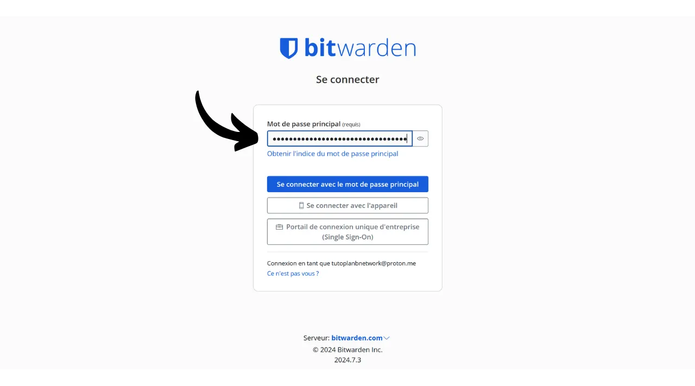
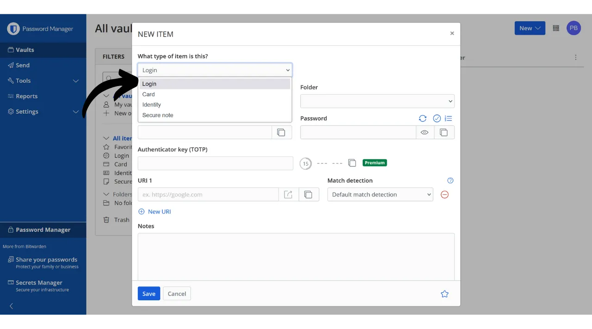
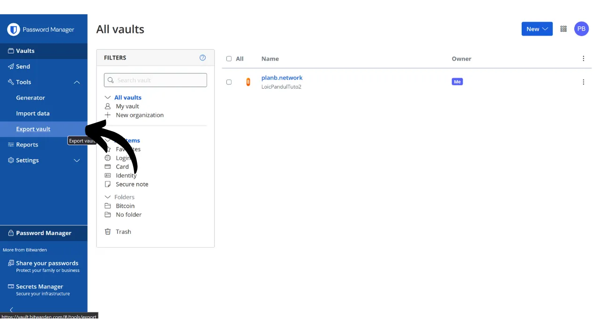

Ve digitálním věku potřebujeme spravovat množství online účtů pokrývajících různé aspekty našeho každodenního života, včetně bankovnictví, finančních platforem, emailů, úložiště souborů, zdraví, administrativy, sociálních sítí, videoher atd.

Pro autentizaci na každém z těchto účtů používáme identifikátor, často emailovou adresu, doprovázenou heslem. Vzhledem k nemožnosti zapamatovat si velké množství unikátních hesel by někdo mohl být lákán k opětovnému používání stejného hesla nebo mírné modifikaci společného základu pro snadnou pamatovatelnost. Tyto praktiky však vážně ohrožují bezpečnost vašich účtů.

Prvním principem, kterého bychom se měli držet u hesel, je jejich neopakovatelnost. Každý online účet by měl být chráněn unikátním heslem, které je zcela odlišné od ostatních. To je důležité, protože pokud útočník dokáže kompromitovat jedno z vašich hesel, nechcete, aby měl přístup ke všem vašim účtům. Mít unikátní heslo pro každý účet izoluje potenciální útoky a omezuje jejich rozsah. Například, pokud používáte stejné heslo pro platformu videoher a pro váš email, a toto heslo je kompromitováno prostřednictvím phishingové stránky související s herní platformou, útočník by pak mohl snadno získat přístup k vašemu emailu a ovládnout všechny vaše další online účty.

Druhým zásadním principem je síla hesla. Heslo je považováno za silné, pokud je obtížné ho prolomit hrubou silou, tj. uhodnout metodou pokus-omyl. To znamená, že vaše hesla musí být co nejvíce náhodná, dlouhá a obsahovat různé znaky (malá písmena, velká písmena, čísla a symboly).

Aplikace těchto dvou principů bezpečnosti hesel (unikátnost a robustnost) se může v každodenním životě ukázat jako obtížná, jelikož je téměř nemožné si zapamatovat unikátní, náhodné a silné heslo pro všechny naše účty. Zde přichází na řadu správce hesel.

Správce hesel generuje a bezpečně ukládá silná hesla, což vám umožňuje přistupovat ke všem vašim online účtům bez nutnosti je individuálně pamatovat. Potřebujete si zapamatovat pouze jedno heslo, hlavní heslo, které vám dává přístup ke všem vašim uloženým heslům ve správci. Používání správce hesel zvyšuje vaši online bezpečnost, protože brání opětovnému používání hesel a systematicky generuje náhodná hesla. Ale také zjednodušuje vaše každodenní používání účtů centralizací přístupu k vašim citlivým informacím.
V tomto tutoriálu prozkoumáme, jak nastavit a používat správce hesel pro zvýšení vaší online bezpečnosti. Představím vám Bitwarden a v dalším tutoriálu se podíváme na další řešení nazvané KeePass.
https://planb.network/tutorials/others/keepass

Varování: Správce hesel je skvělý pro ukládání hesel, ale **nikdy byste v něm neměli ukládat mnemonickou frázi vaší Bitcoinové peněženky!** Pamětní fráze by měla být výhradně uložena ve fyzickém formátu, jako je kus papíru nebo kovu.

## Úvod do Bitwarden

Bitwarden je správce hesel vhodný jak pro začátečníky, tak pro pokročilé uživatele. Nabízí mnoho výhod. Především je Bitwarden multiplatformní řešení, což znamená, že jej můžete používat jako mobilní aplikaci, webovou aplikaci, rozšíření prohlížeče a desktopový software.

Bitwarden vám umožňuje ukládat vaše hesla online a synchronizovat je napříč všemi vašimi zařízeními, přičemž zajišťuje šifrování od konce ke konci s vaším hlavním heslem. To vám například umožňuje přistupovat k vašim heslům jak na počítači, tak na smartphonu, se synchronizací mezi oběma. Jelikož jsou vaše hesla šifrována, zůstávají nedostupná pro kohokoli, včetně Bitwarden, bez dešifrovacího klíče, kterým je vaše hlavní heslo.
Navíc, Bitwarden je open-source, což znamená, že software může být auditován nezávislými odborníky. Pokud jde o ceny, Bitwarden nabízí tři plány:
- Bezplatnou verzi, kterou prozkoumáme v tomto tutoriálu. I když je zdarma, poskytuje úroveň zabezpečení ekvivalentní placeným verzím. Můžete uložit neomezené množství hesel a synchronizovat libovolný počet zařízení;
- Prémiovou verzi za 10 dolarů ročně, která zahrnuje další funkce, jako je úložiště souborů, záloha bankovních karet, možnost nastavení 2FA s fyzickým bezpečnostním klíčem a přístup k autentizaci TOTP 2FA přímo s Bitwardenem;
- A rodinný plán za 40 dolarů ročně, který rozšiřuje výhody prémiové verze na šest různých uživatelů.

Podle mého názoru jsou tyto ceny spravedlivé. Bezplatná verze je vynikající volbou pro začátečníky a prémiová verze nabízí velmi dobrý poměr cena/výkon ve srovnání s ostatními správci hesel na trhu, přičemž nabízí více funkcí. Navíc fakt, že Bitwarden je open-source, je velkou výhodou. Proto je to zajímavý kompromis, zejména pro začátečníky.
Další funkcí Bitwardenu je možnost vlastního hostování vašeho správce hesel, pokud například vlastníte doma NAS. Nastavením této konfigurace nejsou vaše hesla uložena na serverech Bitwardenu, ale na vašich vlastních serverech. To vám dává úplnou kontrolu nad dostupností vašich hesel. Tato možnost však vyžaduje pečlivé řízení záloh, aby se předešlo jakékoli ztrátě přístupu. Proto je vlastní hostování Bitwardenu vhodnější pro pokročilé uživatele a budeme o něm diskutovat v dalším tutoriálu.
## Jak vytvořit účet Bitwarden?

Navštivte [webové stránky Bitwarden](https://bitwarden.com/) a klikněte na "*Začít*".

Začněte zadáním vaší e-mailové adresy a vašeho jména nebo přezdívky.

Dále budete muset nastavit vaše hlavní heslo. Jak jsme viděli v úvodu, toto heslo je velmi důležité, protože vám dává přístup ke všem vašim ostatním uloženým heslům ve správci. Představuje tedy dvě hlavní rizika: ztrátu a kompromitaci. Pokud ztratíte přístup k tomuto heslu, již nebudete moci přistupovat ke všem vašim pověřením. Pokud je vaše heslo ukradeno, útočník bude moci přistupovat ke všem vašim účtům.

Aby se minimalizovalo riziko ztráty, doporučuji udělat fyzickou zálohu vašeho hlavního hesla na papíře a uložit ji na bezpečném místě. Pokud je to možné, zapečetěte tuto zálohu do bezpečné obálky, abyste pravidelně zajišťovali, že k ní nikdo jiný neměl přístup.

Aby se předešlo kompromitaci vašeho hlavního hesla, musí být mimořádně robustní. Mělo by být co nejdelší, používat širokou škálu znaků a být vybráno náhodně. V roce 2024 jsou minimální doporučení pro bezpečné heslo 13 znaků včetně čísel, malých a velkých písmen, stejně jako symbolů, za předpokladu, že heslo je skutečně náhodné. Nicméně, doporučuji zvolit heslo o délce alespoň 20 znaků, včetně všech možných typů znaků, aby bylo zajištěno jeho zabezpečení na delší dobu.

Zadejte své hlavní heslo do příslušného pole a potvrďte ho v následujícím poli.

Pokud chcete, můžete přidat nápovědu k vašemu hlavnímu heslu. Nicméně, doporučuji to nedělat, protože nápověda neposkytuje spolehlivý způsob obnovy v případě, že ztratíte své heslo, a dokonce může být užitečná pro útočníky, kteří se pokoušejí uhodnout nebo prolomit vaše heslo hrubou silou. Jako obecné pravidlo se vyhněte vytváření veřejných nápověd, které by mohly ohrozit bezpečnost vašeho hlavního hesla. 
Poté klikněte na tlačítko "*Vytvořit účet*".

Nyní se můžete přihlásit do svého nového účtu Bitwarden. Zadejte svou e-mailovou adresu.

Poté zadejte své hlavní heslo.

Nyní jste na webovém rozhraní vašeho správce hesel.

## Jak nastavit Bitwarden?

Začneme potvrzením naší e-mailové adresy. Klikněte na "*Odeslat e-mail*".

Poté klikněte na tlačítko, které obdržíte e-mailem.

Nakonec se znovu přihlaste.

Především vám důrazně doporučuji nastavit dvoufaktorové ověření (2FA) pro zabezpečení vašeho správce hesel. Máte na výběr mezi použitím aplikace TOTP nebo fyzického bezpečnostního klíče. Aktivací 2FA budete při každém přihlášení do vašeho účtu Bitwarden požádáni nejen o vaše hlavní heslo, ale také o důkaz vašeho druhého faktoru ověření. To je další vrstva zabezpečení, obzvláště užitečná v případě, že je váš papírový záložní kód hlavního hesla ohrožen.

Pokud si nejste jisti, jak nastavit a používat tyto zařízení 2FA, doporučuji následovat tyto 2 další tutoriály:

https://planb.network/tutorials/others/authy

https://planb.network/tutorials/others/security-key

Pro toto přejděte na záložku "*Bezpečnost*" v menu "*Nastavení*".

Poté klikněte na záložku "*Dvoufázové přihlášení*".

Zde si můžete vybrat metodu 2FA, kterou preferujete. Například si vyberu 2FA s aplikací TOTP kliknutím na tlačítko "*Spravovat*".

Potvrďte své hlavní heslo.

Poté naskenujte QR kód pomocí vaší aplikace 2FA.

Zadejte 6místný kód uvedený ve vaší aplikaci 2FA, poté klikněte na tlačítko "*Zapnout*". 
Dvoufaktorové ověření bylo úspěšně nastaveno na vašem účtu.

Nyní, pokud se pokusíte znovu přihlásit do vašeho správce, budete nejprve muset zadat své hlavní heslo, poté dynamický 6místný kód generovaný vaší aplikací 2FA. Ujistěte se, že máte vždy přístup k tomuto dynamickému kódu; bez něj nebudete moci obnovit svá hesla.

V nastavení máte také možnost přizpůsobit svého správce na záložce "*Předvolby*". Zde můžete změnit dobu, než se váš správce automaticky zamkne, stejně jako jazyk a téma rozhraní.
Důrazně doporučuji upravit délku hesel generovaných pomocí Bitwarden. Ve výchozím nastavení je délka nastavena na 14 znaků, což pro optimální zabezpečení může být nedostatečné. Nyní, když máte manažera na pamatování všech vašich hesel, měli byste toho využít a používat velmi silná hesla.

K tomu přejděte do menu "*Generator*".

Zde můžete zvýšit délku vašich hesel na 40 a zaškrtnout políčko pro zahrnutí symbolů.

## Jak zabezpečit vaše účty s Bitwarden?

Nyní, když je váš správce hesel nakonfigurován, můžete začít ukládat přihlašovací údaje pro vaše online účty. Pro přidání nové položky klikněte přímo na tlačítko "*Nová položka*" nebo na tlačítko "*Nový*" umístěné v pravém horním rohu obrazovky, a poté na "*položku*".

Ve formuláři, který se otevře, začněte určením povahy položky, která má být uložena. Pro uložení přihlašovacích údajů vyberte z rozevíracího menu možnost "*Přihlášení*".

Do pole "*Název*" zadejte popisný název pro vaše přihlašovací údaje. To usnadní vyhledávání a organizaci vašich hesel, zejména pokud jich máte velké množství. Například, pokud chcete uložit vaše přihlašovací údaje pro web PlanB Network, můžete tuto položku pojmenovat způsobem, který ji během vašich budoucích vyhledávání okamžitě identifikuje.

Možnost "*Složka*" umožňuje klasifikovat vaše přihlašovací údaje do složek. Zatím jsme žádné nevytvořili, ale později vám ukážu, jak na to.

Do pole "*Uživatelské jméno*" zadejte své uživatelské jméno, které je obvykle vaše e-mailová adresa. 
Dále, v poli "*Heslo*", můžete zadat své heslo. Nicméně, důrazně doporučuji nechat Bitwarden vygenerovat dlouhé, náhodné a jedinečné heslo za vás. To zajistí, že budete mít silné heslo. Pro použití této funkce klikněte na ikonu se dvěma šipkami nad polem, které má být vyplněno.

Můžete vidět, že vaše heslo bylo vygenerováno.

Do pole "*URI 1*" můžete zadat doménové jméno webové stránky.

A nakonec, v poli "*Poznámky*", můžete přidat další podrobnosti, pokud je to nutné.

Když dokončíte vyplňování všech těchto polí, klikněte na tlačítko "*Uložit*".

Váš identifikátor se nyní objeví ve vašem správci Bitwarden.

Kliknutím na něj můžete přistoupit k jeho detailům a upravit je.

Kliknutím na tři malé tečky vpravo máte rychlý přístup ke kopírování hesla nebo identifikátoru.

Gratulujeme, úspěšně jste uložili své první heslo do vašeho správce! Pokud chcete lépe organizovat vaše identifikátory, můžete vytvořit specifické složky. K tomu klikněte na tlačítko "*Nový*" umístěné v pravém horním rohu obrazovky, poté vyberte "*Složka*".
Zadejte název pro vaši složku.

Poté klikněte na "*Uložit*".

Vaše složka se nyní zobrazuje ve vašem správci.

Složku můžete přiřadit k identifikátoru při jeho vytváření, jak jsme to udělali dříve, nebo upravit existující identifikátor. Například kliknutím na můj identifikátor pro PlanB Network, mohu poté zvolit jeho zařazení do složky "*Bitcoin*".

Tímto způsobem můžete strukturovat váš správce hesel, aby bylo snazší najít vaše identifikátory. Můžete je organizovat do složek jako osobní, profesionální, banky, emaily, sociální sítě, předplatné, nákupy, administrativa, streaming, úložiště, cestování, zdraví atd.
Pokud dáváte přednost používání pouze webové verze Bitwarden, je to zcela možné. Doporučuji poté přidat správce hesel do oblíbených ve vašem prohlížeči pro snadný přístup a aby se předešlo rizikům phishingu. Bitwarden však také nabízí celou řadu klientů, které vám umožní používat váš správce na různých zařízeních a zjednodušit jeho každodenní používání. Nabízejí zejména mobilní aplikaci, rozšíření prohlížeče a desktopový software. Podívejme se, jak je nastavit společně.

## Jak používat rozšíření Bitwarden pro prohlížeč?

Nejprve si můžete nastavit rozšíření pro prohlížeč, pokud chcete. Toto rozšíření funguje jako redukovaná verze vašeho správce a nabízí vám možnost automaticky ukládat nová hesla, generovat návrhy na bezpečná hesla a automaticky vyplňovat vaše přihlašovací údaje na stránkách pro přihlášení.

Každodenní používání tohoto rozšíření je mimořádně pohodlné, ale může také otevřít nové vektory útoku. Někteří odborníci na kybernetickou bezpečnost proto nedoporučují používat rozšíření prohlížeče pro správce hesel. Pokud se však rozhodnete používat rozšíření Bitwarden, postupujte takto:

Začněte tím, že navštívíte [oficiální stránku pro stažení Bitwarden](https://bitwarden.com/download/#downloads-web-browser).

Vyberte svůj prohlížeč ze seznamu. V tomto příkladu používám Firefox, takže jsem přesměrován na oficiální rozšíření Bitwarden v obchodě Firefox Add-ons. Postup je velmi podobný pro ostatní prohlížeče.

Klikněte na tlačítko "*Přidat do Firefoxu*".

Poté můžete Bitwarden připojit k vaší liště rozšíření pro snadný přístup. Klikněte na rozšíření pro přihlášení.

Zadejte svou emailovou adresu.

Poté vaše hlavní heslo.

A nakonec zadejte 6místný kód z vaší autentizační aplikace.

Nyní jste připojeni k vašemu správci Bitwarden prostřednictvím rozšíření prohlížeče.

Například, pokud se vrátím na stránku PlanB Network a pokusím se přihlásit do svého účtu, můžete vidět, že rozšíření Bitwarden integrované do prohlížeče rozpozná pole pro přihlášení a automaticky mi nabídne vybrat identifikátor, který jsem dříve uložil.

Pokud tento identifikátor vyberu, Bitwarden za mě vyplní pole pro přihlášení. Tato funkce rozšíření umožňuje rychlé připojení k webovým stránkám, bez nutnosti kopírovat přihlašovací údaje z webové aplikace nebo softwaru Bitwarden.

Rozšíření je také navrženo tak, aby detekovalo vytváření nových účtů. Například při vytváření nového účtu na PlanB Network, Bitwarden automaticky navrhne uložení nového identifikátoru.

Kliknutím na tuto nabídku, která se objeví, se otevře rozšíření. Umožňuje mi zadat podrobnosti nového identifikátoru a vygenerovat silné, unikátní heslo.

Po dokončení informací a kliknutí na "*Uložit*", rozšíření uloží přihlašovací údaje.

Poté rozšíření automaticky vyplní naše přihlašovací údaje do příslušných polí na webové stránce.

## Jak používat software Bitwarden?

Pro instalaci desktopového softwaru Bitwarden začněte tím, že přejdete na [stránku ke stažení](https://bitwarden.com/download/#downloads-desktop). Vyberte a stáhněte verzi odpovídající vašemu operačnímu systému.

Po dokončení stahování pokračujte instalací softwaru na vašem počítači. Při prvním spuštění softwaru Bitwarden budete muset zadat své přihlašovací údaje, abyste odemkli správce hesel.

Poté se dostanete na domovskou stránku vašeho správce. Rozhraní je téměř stejné jako ve webové aplikaci.

## Jak používat aplikaci Bitwarden?

Pro přístup k vašim heslům z telefonu můžete nainstalovat mobilní aplikaci Bitwarden. Začněte tím, že přejdete na [stránku ke stažení](https://bitwarden.com/download/#downloads-mobile) a použijte svůj smartphone k naskenování QR kódu odpovídajícího vašemu operačnímu systému.

Stáhněte a nainstalujte oficiální mobilní aplikaci Bitwarden. Při prvním otevření aplikace zadejte své přihlašovací údaje, abyste odemkli přístup k vašemu správci hesel.

Po připojení budete moci konzultovat a spravovat všechna vaše hesla přímo z aplikace.

Pro zvýšení bezpečnosti vaší aplikace vám radím, abyste ve nastavení aktivovali ochranu PINem. To přidá další vrstvu zabezpečení v případě ztráty nebo krádeže vašeho telefonu.

## Jak zálohovat Bitwarden?
Abyste nikdy nepřišli o přístup k vašim heslům, i v případě ztráty hlavního hesla nebo katastrofy ovlivňující servery Bitwarden, radím vám pravidelně provádět šifrovanou zálohu vašeho správce na externím médiu.
Cílem je zašifrovat všechny vaše přihlašovací údaje Bitwarden pomocí hesla, které se liší od vašeho hlavního hesla, a uložit tento zašifrovaný zálohovací soubor na USB klíč nebo pevný disk, který budete mít doma, například. Poté můžete fyzickou kopii dešifrovacího hesla uchovat na jiném místě než je uloženo zálohovací médium. Například USB klíč můžete mít doma a fyzickou kopii šifrovacího hesla svěřit důvěryhodnému příteli.

Tato metoda zajišťuje, že i kdyby bylo vaše zálohovací médium ukradeno, vaše data zůstanou bez dešifrovacího hesla nedostupná. Podobně váš přítel nebude moci přistupovat k vašim datům bez fyzického média.

Nicméně, v případě problému můžete použít heslo a externí médium k opětovnému získání přístupu k vašim přihlašovacím údajům, nezávisle na Bitwardenu. Takže i kdyby servery Bitwardenu byly zničeny, stále byste měli možnost získat zpět svá hesla.

Proto vám radím pravidelně provádět tyto zálohy, aby vždy obsahovaly vaše nejnovější přihlašovací údaje. Aby vás přítel, který má kopii šifrovacího hesla, neobtěžoval s každou novou zálohou, můžete toto heslo uložit ve vašem správci hesel. To není zamýšleno jako záloha, protože váš přítel již má fyzickou kopii, ale spíše usnadnit vaše budoucí exportní postupy.

Provedení exportu je velmi jednoduché: přejděte do sekce "*Nástroje*" vašeho správce Bitwarden, poté vyberte "*Exportovat trezor*".

Pro formát vyberte "*.json (Zašifrovaný)*".

Poté vyberte možnost "*Chráněno heslem*".

Zde je důležité vybrat silné, unikátní a náhodně generované heslo pro zašifrování zálohy. To zajišťuje, že i v případě krádeže vaší zašifrované zálohy bude pro útočníka nemožné ji dešifrovat hrubou silou.

Klikněte na "*Potvrdit formát*" a zadejte své hlavní heslo pro pokračování v exportu.

Po dokončení exportu najdete svůj zašifrovaný zálohovací soubor ve vašich stažených souborech. Přeneste jej na bezpečné externí úložiště, jako je USB klíč nebo pevný disk. Tuto operaci opakujte pravidelně v závislosti na vašem používání. Například můžete zálohu obnovit každý týden nebo každý měsíc podle vašich potřeb.