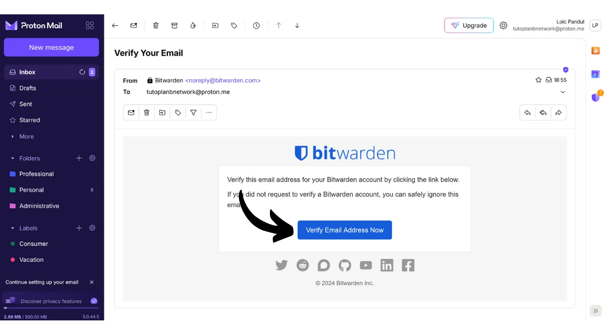
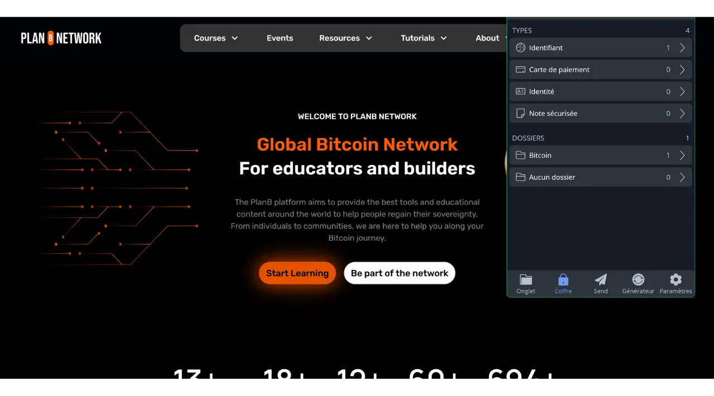
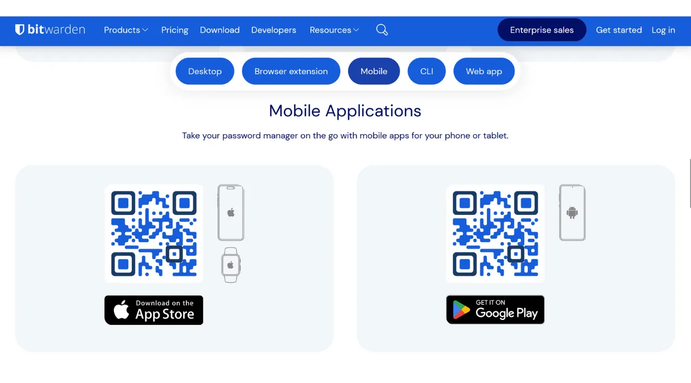
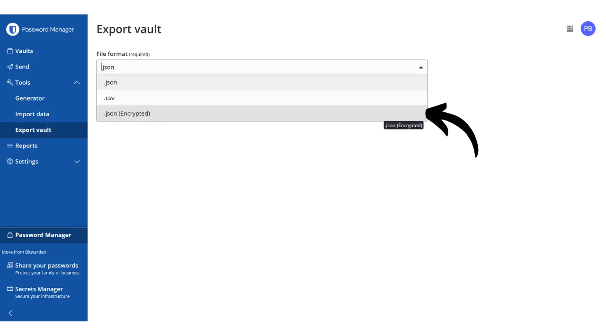
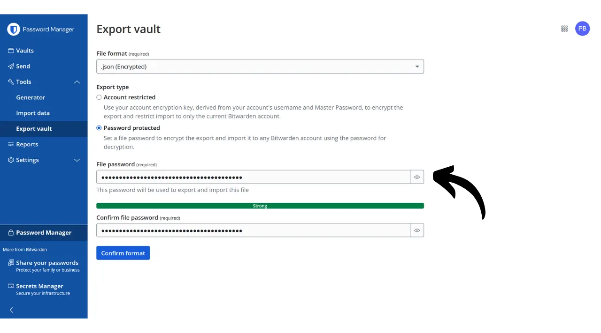

Im digitalen Zeitalter müssen wir eine Vielzahl von Online-Konten verwalten, die verschiedene Aspekte unseres täglichen Lebens abdecken, einschließlich Bankwesen, Finanzplattformen, E-Mails, Dateispeicherung, Gesundheit, Verwaltung, soziale Netzwerke, Videospiele usw.

Um uns bei jedem dieser Konten zu authentifizieren, verwenden wir einen Identifikator, oft eine E-Mail-Adresse, begleitet von einem Passwort. Angesichts der Unmöglichkeit, sich eine große Anzahl einzigartiger Passwörter zu merken, könnte man versucht sein, dasselbe Passwort wiederzuverwenden oder eine gemeinsame Basis leicht zu modifizieren, um es sich leichter merken zu können. Diese Praktiken gefährden jedoch ernsthaft die Sicherheit Ihrer Konten.

Das erste Prinzip, das man bei Passwörtern befolgen sollte, ist, sie nicht wiederzuverwenden. Jedes Online-Konto sollte durch ein einzigartiges Passwort geschützt sein, das sich vollständig von den anderen unterscheidet. Dies ist wichtig, denn wenn ein Angreifer es schafft, eines Ihrer Passwörter zu kompromittieren, möchten Sie nicht, dass sie Zugang zu all Ihren Konten haben. Ein einzigartiges Passwort für jedes Konto zu haben, isoliert potenzielle Angriffe und begrenzt deren Reichweite. Wenn Sie beispielsweise dasselbe Passwort für eine Videospieleplattform und für Ihre E-Mail verwenden und dieses Passwort über eine Phishing-Seite im Zusammenhang mit der Spieleplattform kompromittiert wird, könnte der Angreifer dann leicht auf Ihre E-Mail zugreifen und die Kontrolle über alle Ihre anderen Online-Konten übernehmen.

Das zweite wesentliche Prinzip ist die Stärke des Passworts. Ein Passwort gilt als stark, wenn es schwer durch Brute-Force, also durch Ausprobieren, zu erraten ist. Das bedeutet, dass Ihre Passwörter so zufällig wie möglich, lang und mit einer Vielzahl von Zeichen (Kleinbuchstaben, Großbuchstaben, Zahlen und Symbole) sein müssen.

Diese beiden Sicherheitsprinzipien für Passwörter (Einzigartigkeit und Robustheit) im Alltag anzuwenden, kann schwierig sein, da es fast unmöglich ist, sich für alle unsere Konten ein einzigartiges, zufälliges und starkes Passwort zu merken. Hier kommt der Passwort-Manager ins Spiel.

Ein Passwort-Manager generiert und speichert sicher starke Passwörter und ermöglicht Ihnen den Zugriff auf alle Ihre Online-Konten, ohne dass Sie sich diese einzeln merken müssen. Sie müssen sich nur ein Passwort merken, das Master-Passwort, das Ihnen Zugang zu allen in dem Manager gespeicherten Passwörtern gibt. Die Verwendung eines Passwort-Managers verbessert Ihre Online-Sicherheit, da sie die Wiederverwendung von Passwörtern verhindert und systematisch zufällige Passwörter generiert. Aber es vereinfacht auch die tägliche Nutzung Ihrer Konten, indem es den Zugang zu Ihren sensiblen Informationen zentralisiert.
In diesem Tutorial werden wir erkunden, wie man einen Passwort-Manager einrichtet und verwendet, um Ihre Online-Sicherheit zu verbessern. Ich werde Ihnen Bitwarden vorstellen, und in einem anderen Tutorial werden wir uns eine andere Lösung namens KeePass ansehen.
https://planb.network/tutorials/others/keepass

Warnung: Ein Passwort-Manager ist großartig für die Speicherung von Passwörtern, aber **Sie sollten niemals die mnemonische Phrase Ihres Bitcoin-Wallets darin speichern!** Denken Sie daran, eine mnemonische Phrase sollte ausschließlich in einem physischen Format gespeichert werden, wie einem Stück Papier oder Metall.

## Einführung in Bitwarden

Bitwarden ist ein Passwort-Manager, der sowohl für Anfänger als auch für fortgeschrittene Benutzer geeignet ist. Er bietet zahlreiche Vorteile. Zunächst einmal ist Bitwarden eine Multi-Plattform-Lösung, was bedeutet, dass Sie es als mobile App, Webanwendung, Browsererweiterung und Desktop-Software verwenden können.

Bitwarden ermöglicht es Ihnen, Ihre Passwörter online zu speichern und sie über alle Ihre Geräte hinweg zu synchronisieren, während durch Ihr Master-Passwort eine Ende-zu-Ende-Verschlüsselung gewährleistet wird. Dies ermöglicht es Ihnen beispielsweise, auf Ihre Passwörter sowohl auf Ihrem Computer als auch auf Ihrem Smartphone zuzugreifen, mit Synchronisation zwischen den beiden. Da Ihre Passwörter verschlüsselt sind, bleiben sie für jeden, einschließlich Bitwarden, ohne den Entschlüsselungsschlüssel, der Ihr Master-Passwort ist, unzugänglich.
Außerdem ist Bitwarden Open-Source, was bedeutet, dass die Software von unabhängigen Experten geprüft werden kann. Was die Preise angeht, bietet Bitwarden drei Tarife an:
- Eine kostenlose Version, die wir in diesem Tutorial erkunden werden. Obwohl sie kostenlos ist, bietet sie ein Sicherheitsniveau, das den bezahlten Versionen entspricht. Sie können eine unbegrenzte Anzahl von Passwörtern speichern und so viele Geräte synchronisieren, wie Sie möchten;
- Eine Premium-Version für 10 Dollar pro Jahr, die zusätzliche Funktionen wie Dateispeicherung, Bankkarten-Backup, die Möglichkeit, 2FA mit einem physischen Sicherheitsschlüssel einzurichten, und Zugang zur TOTP 2FA-Authentifizierung direkt mit Bitwarden umfasst;
- Und ein Familienplan für 40 Dollar pro Jahr, der die Vorteile der Premium-Version auf sechs verschiedene Benutzer erweitert.

Meiner Meinung nach sind diese Preise fair. Die kostenlose Version ist eine ausgezeichnete Option für Anfänger, und die Premium-Version bietet im Vergleich zu anderen Passwort-Managern auf dem Markt ein sehr gutes Preis-Leistungs-Verhältnis, während sie mehr Funktionen bietet. Zusätzlich ist der Fakt, dass Bitwarden Open-Source ist, ein großer Vorteil. Daher ist es ein interessanter Kompromiss, besonders für Anfänger.
Eine weitere Funktion von Bitwarden ist die Möglichkeit, Ihren Passwort-Manager selbst zu hosten, wenn Sie beispielsweise ein NAS zu Hause besitzen. Durch das Einrichten dieser Konfiguration werden Ihre Passwörter nicht auf den Servern von Bitwarden gespeichert, sondern auf Ihren eigenen Servern. Dies gibt Ihnen die vollständige Kontrolle über die Verfügbarkeit Ihrer Passwörter. Diese Option erfordert jedoch ein rigoroses Backup-Management, um jeglichen Zugriffsverlust zu vermeiden. Daher ist das Selbsthosting von Bitwarden eher für fortgeschrittene Benutzer geeignet, und wir werden es in einem anderen Tutorial besprechen.
## Wie erstellt man ein Bitwarden-Konto?

Besuchen Sie [die Bitwarden-Website](https://bitwarden.com/) und klicken Sie auf "*Get Started*".

Beginnen Sie, indem Sie Ihre E-Mail-Adresse sowie Ihren Namen oder Spitznamen eingeben.

Als Nächstes müssen Sie Ihr Master-Passwort einrichten. Wie wir in der Einleitung gesehen haben, ist dieses Passwort sehr wichtig, da es Ihnen Zugang zu allen Ihren anderen gespeicherten Passwörtern im Manager gibt. Es birgt dann zwei Hauptgefahren: Verlust und Kompromittierung. Wenn Sie den Zugang zu diesem Passwort verlieren, werden Sie nicht mehr auf all Ihre Anmeldedaten zugreifen können. Wenn Ihr Passwort gestohlen wird, kann der Angreifer auf alle Ihre Konten zugreifen.

Um das Risiko eines Verlusts zu minimieren, empfehle ich, eine physische Sicherung Ihres Master-Passworts auf Papier zu machen und an einem sicheren Ort aufzubewahren. Wenn möglich, versiegeln Sie diese Sicherung in einem sicheren Umschlag, um regelmäßig sicherzustellen, dass niemand anderes darauf zugegriffen hat.

Um die Kompromittierung Ihres Master-Passworts zu verhindern, muss es extrem robust sein. Es sollte so lang wie möglich sein, eine breite Vielfalt von Zeichen verwenden und zufällig gewählt werden. Im Jahr 2024 sind die Mindestempfehlungen für ein sicheres Passwort 13 Zeichen, einschließlich Zahlen, Klein- und Großbuchstaben sowie Symbole, vorausgesetzt, das Passwort ist wirklich zufällig. Ich empfehle jedoch, ein Passwort von mindestens 20 Zeichen zu wählen, das alle möglichen Arten von Zeichen umfasst, um seine Sicherheit länger zu gewährleisten.

Geben Sie Ihr Master-Passwort in das dafür vorgesehene Feld ein und bestätigen Sie es im folgenden Feld.

Wenn Sie möchten, können Sie einen Hinweis für Ihr Master-Passwort hinzufügen. Ich rate jedoch davon ab, da der Hinweis keine zuverlässige Methode zur Wiederherstellung bietet, falls Sie Ihr Passwort verlieren, und sogar Angreifern, die versuchen, Ihr Passwort zu erraten oder per Brute-Force-Angriff zu knacken, nützlich sein könnte. Als allgemeine Regel gilt, öffentliche Hinweise zu vermeiden, die die Sicherheit Ihres Master-Passworts gefährden könnten.

Klicken Sie dann auf den Button "*Konto erstellen*".

Sie können sich jetzt in Ihr neues Bitwarden-Konto einloggen. Geben Sie Ihre E-Mail-Adresse ein.

Geben Sie dann Ihr Master-Passwort ein.

Sie befinden sich jetzt in der Web-Oberfläche Ihres Passwort-Managers.

## Wie richtet man Bitwarden ein?

Zunächst bestätigen wir unsere E-Mail-Adresse. Klicken Sie auf "*E-Mail senden*".

Klicken Sie dann auf den Button, den Sie per E-Mail erhalten haben.

Loggen Sie sich schließlich erneut ein.

Zuallererst rate ich Ihnen dringend, die Zwei-Faktor-Authentifizierung (2FA) einzurichten, um Ihren Passwort-Manager zu sichern. Sie haben die Wahl zwischen der Verwendung einer TOTP-Anwendung oder eines physischen Sicherheitsschlüssels. Durch die Aktivierung von 2FA wird jedes Mal, wenn Sie sich in Ihr Bitwarden-Konto einloggen, nicht nur nach Ihrem Master-Passwort, sondern auch nach einem Nachweis Ihres zweiten Authentifizierungsfaktors gefragt. Dies ist eine zusätzliche Sicherheitsebene, die besonders nützlich ist, falls Ihre Papierkopie des Master-Passworts kompromittiert wird.

Wenn Sie unsicher sind, wie Sie diese 2FA-Geräte einrichten und verwenden, empfehle ich, diesen 2 anderen Tutorials zu folgen:

https://planb.network/tutorials/others/authy

https://planb.network/tutorials/others/security-key

Gehen Sie dazu in den Tab "*Sicherheit*" im Menü "*Einstellungen*".

Klicken Sie dann auf den Tab "*Zwei-Schritt-Login*".

Hier können Sie die 2FA-Methode auswählen, die Sie bevorzugen. Zum Beispiel werde ich 2FA mit einer TOTP-Anwendung wählen, indem ich auf den Button "*Verwalten*" klicke.

Bestätigen Sie Ihr Master-Passwort.

Scannen Sie dann den QR-Code mit Ihrer 2FA-Anwendung.

Geben Sie den 6-stelligen Code ein, den Sie auf Ihrer 2FA-Anwendung notiert haben, und klicken Sie dann auf den Button "*Aktivieren*". 
Die Zwei-Faktor-Authentifizierung wurde erfolgreich auf Ihrem Konto eingerichtet.

Wenn Sie nun versuchen, sich erneut in Ihren Manager einzuloggen, müssen Sie zuerst Ihr Master-Passwort eingeben und dann den dynamischen 6-stelligen Code, der von Ihrer 2FA-Anwendung generiert wurde. Stellen Sie sicher, dass Sie immer Zugang zu diesem dynamischen Code haben; ohne ihn werden Sie Ihre Passwörter nicht wiederherstellen können.

In den Einstellungen haben Sie auch die Möglichkeit, Ihren Manager im Tab "*Präferenzen*" anzupassen. Hier können Sie die Dauer ändern, bevor Ihr Manager automatisch sperrt, sowie die Sprache und das Thema der Oberfläche.
Ich empfehle dringend, die Länge der von Bitwarden generierten Passwörter anzupassen. Standardmäßig ist die Länge auf 14 Zeichen eingestellt, was für optimale Sicherheit unzureichend sein könnte. Jetzt, wo Sie einen Manager haben, der sich all Ihre Passwörter merkt, sollten Sie dies auch nutzen, um sehr starke Passwörter zu verwenden.

Dafür gehen Sie zum Menü "*Generator*".
Hier können Sie die Länge Ihrer Passwörter auf 40 erhöhen und das Kästchen aktivieren, um Symbole einzuschließen.

## Wie sichern Sie Ihre Konten mit Bitwarden?

Jetzt, da Ihr Passwort-Manager konfiguriert ist, können Sie beginnen, die Anmeldeinformationen für Ihre Online-Konten zu speichern. Um einen neuen Eintrag hinzuzufügen, klicken Sie direkt auf den Button "*Neuer Eintrag*" oder oben rechts auf dem Bildschirm auf "*Neu*", dann auf "*Eintrag*".
Im sich öffnenden Formular beginnen Sie damit, die Art des zu speichernden Eintrags zu bestimmen. Um Anmeldeinformationen zu speichern, wählen Sie aus dem Dropdown-Menü die Option "*Anmeldung*".
Im Feld "*Name*" geben Sie einen beschreibenden Namen für Ihre Anmeldeinformationen ein. Dies erleichtert die Suche und Organisation Ihrer Passwörter, besonders wenn Sie eine große Anzahl haben. Wenn Sie beispielsweise Ihre Anmeldeinformationen für die PlanB Network-Seite speichern möchten, können Sie diesen Eintrag so benennen, dass er bei zukünftigen Suchen sofort erkennbar ist.
Die Option "*Ordner*" ermöglicht es Ihnen, Ihre Anmeldeinformationen in Ordner zu klassifizieren. Bisher haben wir noch keine erstellt, aber ich werde Ihnen später zeigen, wie das geht.
Im Feld "*Benutzername*" geben Sie Ihren Benutzernamen ein, der in der Regel Ihre E-Mail-Adresse ist.
Als Nächstes können Sie im Feld "*Passwort*" Ihr Passwort eingeben. Ich empfehle jedoch dringend, Bitwarden ein langes, zufälliges und einzigartiges Passwort für Sie generieren zu lassen. Dies stellt sicher, dass Sie ein starkes Passwort haben. Um diese Funktion zu nutzen, klicken Sie auf das Doppelpfeil-Symbol über dem auszufüllenden Feld.
Sie können sehen, dass Ihr Passwort generiert wurde.
Im Feld "*URI 1*" können Sie den Domainnamen der Website eingeben.
Und schließlich können Sie im Feld "*Notizen*" bei Bedarf zusätzliche Details hinzufügen.
Wenn Sie alle diese Felder ausgefüllt haben, klicken Sie auf den Button "*Speichern*".
Ihr Kennzeichen erscheint nun in Ihrem Bitwarden-Manager.
Durch Klicken darauf können Sie auf seine Details zugreifen und sie ändern.
Durch Klicken auf die drei kleinen Punkte rechts haben Sie schnellen Zugriff, um das Passwort oder den Kennzeichner zu kopieren.
Herzlichen Glückwunsch, Sie haben erfolgreich Ihr erstes Passwort in Ihrem Manager gespeichert! Wenn Sie Ihre Kennungen besser organisieren möchten, können Sie spezifische Ordner erstellen. Klicken Sie dazu auf den Button "*Neu*", der sich oben rechts auf dem Bildschirm befindet, und wählen Sie dann "*Ordner*". 
Geben Sie einen Namen für Ihren Ordner ein.

Klicken Sie dann auf "*Speichern*".

Ihr Ordner erscheint nun in Ihrem Manager.

Sie können einem Kennzeichen beim Erstellen, wie wir es zuvor getan haben, oder durch Ändern eines bestehenden Kennzeichens einen Ordner zuweisen. Zum Beispiel kann ich, indem ich auf mein Kennzeichen für das PlanB Network klicke, dann wählen, es im Ordner "*Bitcoin*" zu klassifizieren.

Auf diese Weise können Sie Ihren Passwortmanager strukturieren, um Ihre Kennungen leichter zu finden. Sie können sie mit Ordnern wie persönlich, beruflich, Banken, E-Mails, soziale Netzwerke, Abonnements, Einkaufen, Verwaltung, Streaming, Speicherung, Reisen, Gesundheit usw. organisieren.
Wenn Sie es vorziehen, nur die Webversion von Bitwarden zu verwenden, ist das vollkommen möglich. Ich empfehle dann, Ihren Passwortmanager zu den Favoriten Ihres Browsers hinzuzufügen, um einen einfachen Zugriff zu ermöglichen und Phishing-Risiken zu vermeiden. Bitwarden bietet jedoch auch eine vollständige Palette von Clients an, die es Ihnen ermöglichen, Ihren Manager auf verschiedenen Geräten zu verwenden und seine tägliche Nutzung zu vereinfachen. Sie bieten insbesondere eine mobile App, eine Browsererweiterung und Desktop-Software an. Lassen Sie uns sehen, wie wir diese einrichten.

## Wie verwendet man die Bitwarden-Browsererweiterung?

Zuerst können Sie die Browsererweiterung einrichten, wenn Sie möchten. Diese Erweiterung funktioniert als reduzierte Version Ihres Managers und bietet Ihnen die Möglichkeit, automatisch neue Passwörter zu speichern, Vorschläge für sichere Passwörter zu generieren und Ihre Anmeldeinformationen automatisch auf Website-Anmeldeseiten auszufüllen.

Die tägliche Verwendung dieser Erweiterung ist äußerst praktisch, kann jedoch auch neue Angriffsvektoren eröffnen. Einige Cybersicherheitsexperten raten daher von der Verwendung von Browsererweiterungen für Passwortmanager ab. Wenn Sie sich jedoch für die Verwendung der Bitwarden-Erweiterung entscheiden, gehen Sie folgendermaßen vor:

Beginnen Sie, indem Sie die [offizielle Bitwarden-Downloadseite](https://bitwarden.com/download/#downloads-web-browser) besuchen.

Wählen Sie Ihren Browser aus der bereitgestellten Liste. Für dieses Beispiel verwende ich Firefox, also werde ich zur offiziellen Bitwarden-Erweiterung im Firefox Add-ons Store weitergeleitet. Das Verfahren ist für andere Browser recht ähnlich.

Klicken Sie auf den Button "*Zu Firefox hinzufügen*".

Sie können dann Bitwarden an Ihre Erweiterungsleiste anheften, um einen einfachen Zugriff zu ermöglichen. Klicken Sie auf die Erweiterung, um sich anzumelden.

Geben Sie Ihre E-Mail-Adresse ein.

Dann Ihr Masterpasswort.

Und schließlich geben Sie den 6-stelligen Code aus Ihrer Authentifizierungs-App ein.

Sie sind jetzt über die Browsererweiterung mit Ihrem Bitwarden-Manager verbunden.

Zum Beispiel, wenn ich zur PlanB Network-Seite zurückkehre und versuche, mich in meinem Konto anzumelden, können Sie sehen, dass die Bitwarden-Erweiterung, die in den Browser integriert ist, die Anmeldefelder erkennt und mir automatisch anbietet, den zuvor gespeicherten Identifikator auszuwählen.

Wenn ich diesen Identifikator auswähle, füllt Bitwarden die Anmeldefelder für mich aus. Diese Funktion der Erweiterung ermöglicht eine schnelle Verbindung zu Websites, ohne die Notwendigkeit, Anmeldeinformationen aus der Bitwarden-Webanwendung oder Software zu kopieren und einzufügen.

Die Erweiterung ist auch darauf ausgelegt, die Erstellung neuer Konten zu erkennen. Zum Beispiel, wenn ich ein neues Konto auf PlanB Network erstelle, schlägt Bitwarden automatisch vor, den neuen Identifikator zu speichern.

Durch Klicken auf diesen Vorschlag, der erscheint, öffnet sich die Erweiterung. Sie ermöglicht es mir, die Details des neuen Identifikators einzugeben und ein starkes, einzigartiges Passwort zu generieren.

Nachdem ich die Informationen vervollständigt und auf "*Speichern*" geklickt habe, speichert die Erweiterung die Anmeldeinformationen.

Dann füllt die Erweiterung automatisch unsere Anmeldeinformationen in den entsprechenden Feldern auf der Website aus.

## Wie verwendet man die Bitwarden-Software?

Um die Bitwarden-Desktop-Software zu installieren, beginnen Sie damit, [die Download-Seite](https://bitwarden.com/download/#downloads-desktop) aufzurufen. Wählen und laden Sie die Version herunter, die Ihrem Betriebssystem entspricht.

Sobald der Download abgeschlossen ist, fahren Sie mit der Softwareinstallation auf Ihrem Computer fort. Beim ersten Start der Bitwarden-Software müssen Sie Ihre Anmeldeinformationen eingeben, um Ihren Passwortmanager freizuschalten.

Dann gelangen Sie zur Startseite Ihres Managers. Die Schnittstelle ist fast die gleiche wie bei der Webanwendung.

## Wie verwendet man die Bitwarden-Anwendung?

Um auf Ihre Passwörter von Ihrem Telefon aus zuzugreifen, können Sie die Bitwarden-Mobilanwendung installieren. Beginnen Sie damit, [die Download-Seite](https://bitwarden.com/download/#downloads-mobile) aufzurufen und verwenden Sie Ihr Smartphone, um den QR-Code zu scannen, der Ihrem Betriebssystem entspricht.

Laden Sie die offizielle Bitwarden-Mobilanwendung herunter und installieren Sie sie. Bei der ersten Öffnung der Anwendung geben Sie Ihre Anmeldeinformationen ein, um den Zugang zu Ihrem Passwortmanager freizuschalten.

Einmal verbunden, können Sie alle Ihre Passwörter direkt aus der Anwendung heraus konsultieren und verwalten.

Um die Sicherheit Ihrer Anwendung zu erhöhen, rate ich Ihnen, in die Einstellungen zu gehen und den PIN-Schutz zu aktivieren. Dies fügt eine zusätzliche Sicherheitsebene im Falle eines Verlusts oder Diebstahls Ihres Telefons hinzu.

## Wie sichert man Bitwarden?
Um sicherzustellen, dass Sie nie den Zugang zu Ihren Passwörtern verlieren, auch im Falle des Verlusts Ihres Hauptpassworts oder eines Desasters, das die Bitwarden-Server betrifft, rate ich Ihnen, regelmäßig ein verschlüsseltes Backup Ihres Managers auf einem externen Medium durchzuführen.
Die Idee besteht darin, alle Ihre Bitwarden-Zugangsdaten mit einem Passwort zu verschlüsseln, das sich von Ihrem Hauptpasswort unterscheidet, und dieses verschlüsselte Backup auf einem USB-Stick oder einer Festplatte zu speichern, die Sie beispielsweise zu Hause aufbewahren. Sie können dann eine physische Kopie des Entschlüsselungspassworts an einem anderen Ort aufbewahren, als dort, wo das Backup-Medium gelagert wird. Zum Beispiel könnten Sie den USB-Stick zu Hause behalten und die physische Kopie des Verschlüsselungspassworts einem vertrauenswürdigen Freund anvertrauen.
Diese Methode stellt sicher, dass Ihre Daten unzugänglich bleiben, selbst wenn Ihr Backup-Medium gestohlen wird, ohne das Entschlüsselungspasswort. Ebenso wird Ihr Freund ohne das physische Medium nicht in der Lage sein, auf Ihre Daten zuzugreifen.

Sollte jedoch ein Problem auftreten, können Sie das Passwort und das externe Medium nutzen, um unabhängig von Bitwarden wieder Zugang zu Ihren Zugangsdaten zu erhalten. Somit hätten Sie selbst im Falle einer Zerstörung der Bitwarden-Server immer noch die Möglichkeit, Ihre Passwörter wiederherzustellen.

Daher rate ich Ihnen, diese Backups regelmäßig durchzuführen, sodass sie stets Ihre neuesten Zugangsdaten enthalten. Um Ihren Freund, der eine Kopie des Verschlüsselungspassworts besitzt, nicht mit jedem neuen Backup zu belästigen, können Sie dieses Passwort in Ihrem Passwortmanager speichern. Dies ist nicht als Backup gedacht, da Ihr Freund bereits eine physische Kopie besitzt, sondern vielmehr, um Ihre zukünftigen Exportverfahren zu vereinfachen.

Um mit dem Export fortzufahren, ist es ganz einfach: Gehen Sie zum Abschnitt "*Tools*" Ihres Bitwarden-Managers und wählen Sie "*Export vault*".

Wählen Sie als Format "*.json (Encrypted)*".

Wählen Sie dann die Option "*Password protected*".

Hier ist es wichtig, ein starkes, einzigartiges und zufällig generiertes Passwort zu wählen, um das Backup zu verschlüsseln. Dies stellt sicher, dass es selbst im Falle eines Diebstahls Ihres verschlüsselten Backups für einen Angreifer unmöglich sein wird, es durch Brute-Force zu entschlüsseln.

Klicken Sie auf "*Confirm format*" und geben Sie Ihr Hauptpasswort ein, um mit dem Export fortzufahren.

Sobald der Export abgeschlossen ist, finden Sie Ihre verschlüsselte Backup-Datei in Ihren Downloads. Übertragen Sie sie auf ein sicheres externes Speichergerät, wie einen USB-Stick oder eine Festplatte. Wiederholen Sie diesen Vorgang periodisch, abhängig von Ihrer Nutzung. Sie können beispielsweise das Backup jede Woche oder jeden Monat erneuern, je nach Ihren Bedürfnissen.