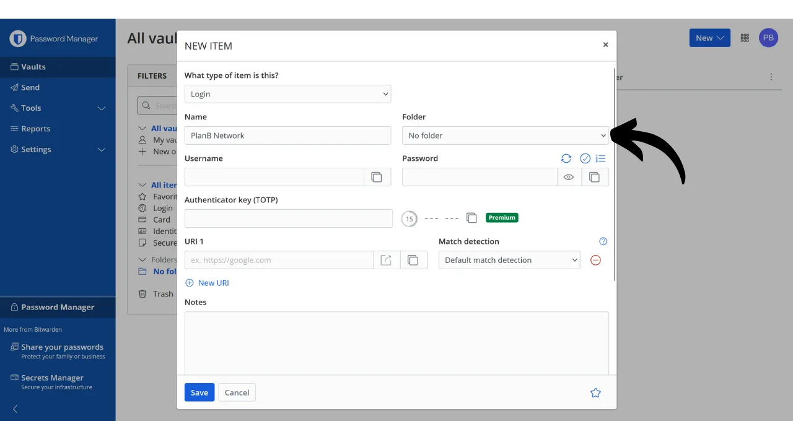
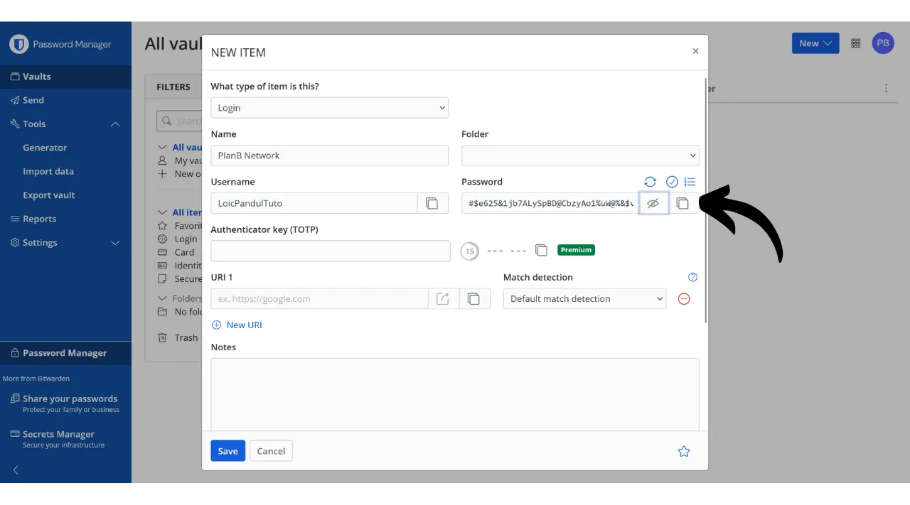
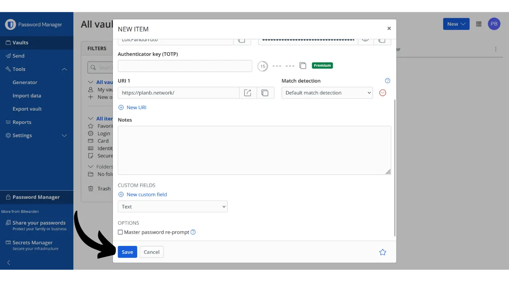
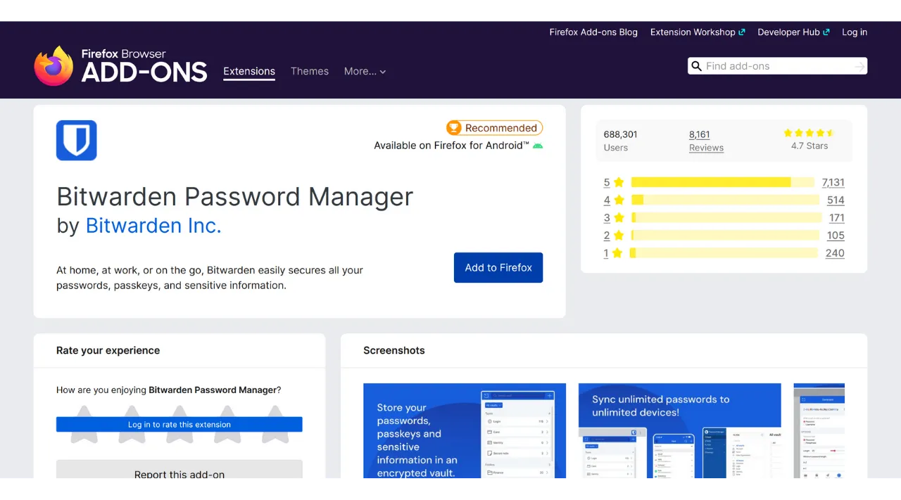
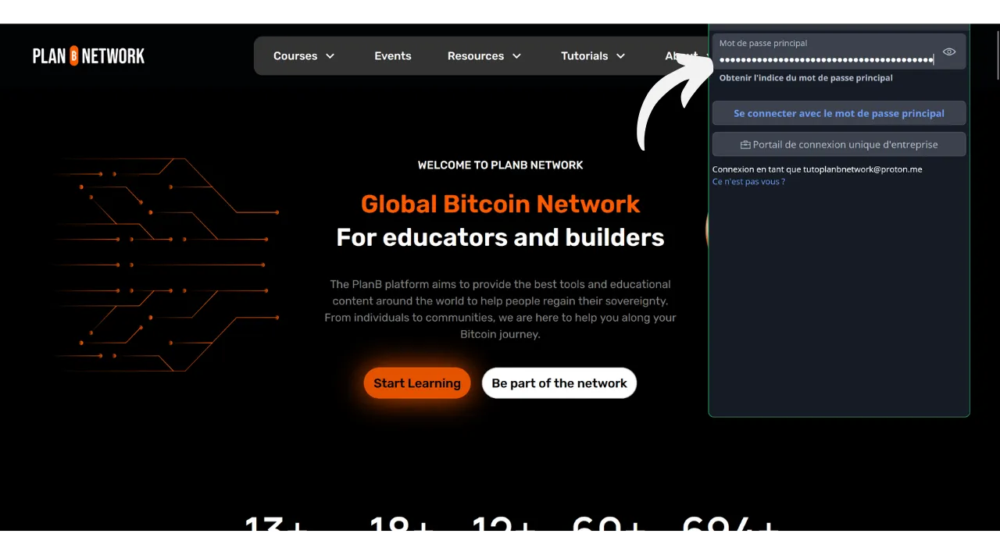

In the digital age, we need to manage a multitude of online accounts covering various aspects of our daily lives, including banking, financial platforms, emails, file storage, health, administration, social networks, video games, etc.

To authenticate ourselves on each of these accounts, we use an identifier, often an email address, accompanied by a password. Faced with the impossibility of memorizing a large number of unique passwords, one might be tempted to reuse the same password or slightly modify a common base to remember it easily. However, these practices seriously compromise the security of your accounts.

The first principle to follow for passwords is not to reuse them. Each online account should be protected by a unique password that is completely distinct from the others. This is important because, if an attacker manages to compromise one of your passwords, you do not want them to have access to all your accounts. Having a unique password for each account isolates potential attacks and limits their scope. For example, if you use the same password for a video game platform and for your email, and that password is compromised via a phishing site related to the gaming platform, the attacker could then easily access your email and take control of all your other online accounts.

The second essential principle is the strength of the password. A password is considered strong if it is difficult to brute force, that is, to guess through trial and error. This means that your passwords must be as random as possible, long, and include a variety of characters (lowercase, uppercase, numbers, and symbols).

Applying these two password security principles (uniqueness and robustness) can prove difficult in everyday life, as it is almost impossible to memorize a unique, random, and strong password for all our accounts. This is where the password manager comes into play.

A password manager generates and securely stores strong passwords, allowing you to access all your online accounts without the need to memorize them individually. You only need to remember one password, the master password, which gives you access to all your saved passwords in the manager. Using a password manager enhances your online security because it prevents the reuse of passwords and systematically generates random passwords. But it also simplifies your daily use of your accounts by centralizing access to your sensitive information.
In this tutorial, we will explore how to set up and use a password manager to enhance your online security. I will introduce you to Bitwarden, and in another tutorial, we will look into another solution called KeePass.
https://planb.network/tutorials/others/keepass

Warning: A password manager is great for storing passwords, but **you should never store your Bitcoin wallet's mnemonic phrase in it!** Remember, a mnemonic phrase should be exclusively saved in a physical format, like a piece of paper or metal.

## Introduction to Bitwarden

Bitwarden is a password manager suitable for both beginners and advanced users. It offers numerous advantages. First and foremost, Bitwarden is a multi-platform solution, meaning you can use it as a mobile app, web application, browser extension, and desktop software.

Bitwarden allows you to save your passwords online and synchronize them across all your devices, while ensuring end-to-end encryption with your master password. This enables you, for example, to access your passwords on both your computer and smartphone, with synchronization between the two. Since your passwords are encrypted, they remain inaccessible to anyone, including Bitwarden, without the decryption key that is your master password.

Moreover, Bitwarden is open-source, which means the software can be audited by independent experts. As for pricing, Bitwarden offers three plans:
- A free version that we will explore in this tutorial. Although it's free, it provides a level of security equivalent to that of the paid versions. You can store an unlimited number of passwords and synchronize as many devices as you wish;
- A premium version for $10 per year that includes additional features such as file storage, bank card backup, the ability to set up 2FA with a physical security key, and access to TOTP 2FA authentication directly with Bitwarden;
- And a family plan for $40 per year that extends the benefits of the premium version to six different users.

In my opinion, these prices are fair. The free version is an excellent option for beginners, and the premium version offers very good value for money compared to other password managers on the market, while offering more features. Additionally, the fact that Bitwarden is open-source is a major advantage. Therefore, it's an interesting compromise, especially for beginners.
Another feature of Bitwarden is the ability to self-host your password manager if you own, for example, a NAS at home. By setting up this configuration, your passwords are not stored on Bitwarden's servers, but on your own servers. This gives you complete control over the availability of your passwords. However, this option requires rigorous backup management to avoid any loss of access. Therefore, Bitwarden's self-hosting is more suited to advanced users, and we will discuss it in another tutorial.
## How to create a Bitwarden account?

Visit [the Bitwarden website](https://bitwarden.com/) and click on "*Get Started*".

Start by entering your email address as well as your name or nickname.

Next, you will need to set up your master password. As we saw in the introduction, this password is very important because it gives you access to all your other saved passwords in the manager. It then presents two main risks: loss and compromise. If you lose access to this password, you will no longer be able to access all of your credentials. If your password is stolen, the attacker will be able to access all of your accounts.

To minimize the risk of loss, I recommend making a physical backup of your master password on paper and storing it in a safe place. If possible, seal this backup in a secure envelope to regularly ensure that no one else has accessed it.

To prevent the compromise of your master password, it must be extremely robust. It should be as long as possible, use a wide variety of characters, and be chosen randomly. In 2024, the minimum recommendations for a secure password are 13 characters including numbers, lowercase and uppercase letters, as well as symbols, provided that the password is truly random. However, I recommend opting for a password of at least 20 characters, including all possible types of characters, to ensure its security for longer.

Enter your master password in the dedicated box and confirm it in the following box.

If you wish, you can add a hint for your master password. However, I advise against doing so, as the hint does not provide a reliable method of recovery in case you lose your password and could even be useful to attackers attempting to guess or brute force your password. As a general rule, avoid creating public hints that could compromise the security of your master password.

Then click on the "*Create an account*" button.

You can now log in to your new Bitwarden account. Enter your email address.

Then type your master password.

You are now on the web interface of your password manager.

## How to set up Bitwarden?

To start, we will confirm our email address. Click on "*Send Email*".

Then click on the button received by email.

Finally, log in again.

First and foremost, I strongly advise you to set up two-factor authentication (2FA) to secure your password manager. You have the choice between using a TOTP application or a physical security key. By activating 2FA, each time you log in to your Bitwarden account, you will be asked not only for your master password but also for proof of your second factor of authentication. This is an additional layer of security, particularly useful in the event that your paper backup of the master password is compromised.

If you are unsure how to set up and use these 2FA devices, I recommend following these 2 other tutorials:

https://planb.network/tutorials/others/authy

https://planb.network/tutorials/others/security-key

To do this, go to the "*Security*" tab in the "*Settings*" menu.

Then click on the "*Two-step login*" tab.

Here, you can choose the 2FA method you prefer. For example, I will choose 2FA with a TOTP application by clicking on the "*Manage*" button.

Confirm your master password.

Then scan the QR code with your 2FA application.

Enter the 6-digit code noted on your 2FA application, then click the "*Turn on*" button. 
Two-factor authentication has been successfully set up on your account.

Now, if you try to log back into your manager, you will first need to enter your master password, then the dynamic 6-digit code generated by your 2FA application. Make sure you always have access to this dynamic code; without it, you will be unable to recover your passwords.

In the settings, you also have the option to customize your manager in the "*Preferences*" tab. Here, you can change the duration before your manager automatically locks, as well as the language and theme of the interface.

I strongly recommend adjusting the length of the passwords generated by Bitwarden. By default, the length is set to 14 characters, which may be insufficient for optimal security. Now that you have a manager to remember all your passwords, you might as well take advantage of it to use very strong passwords.

For this, go to the "*Generator*" menu.

Here, you can increase the length of your passwords to 40, and check the box to include symbols.

## How to secure your accounts with Bitwarden?

Now that your password manager is configured, you can start storing the credentials for your online accounts. To add a new item, click directly on the "*New item*" button or on the "*New*" button located at the top right of the screen, then on "*item*".

In the form that opens, start by determining the nature of the item to be saved. To store login credentials, choose the "*Login*" option from the dropdown menu.

In the "*Name*" field, enter a descriptive name for your credentials. This will make it easier to search for and organize your passwords, especially if you have a large number. For example, if you want to save your credentials for the PlanB Network site, you can name this item in a way that makes it immediately recognizable during your future searches.

The "*Folder*" option allows you to classify your credentials into folders. For now, we haven't created any yet, but I will show you how to do so later.

In the "*Username*" field, enter your username, which is usually your email address. 
Next, in the "*Password*" field, you can enter your password. However, I strongly recommend letting Bitwarden generate a long, random, and unique password for you. This ensures you have a strong password. To use this feature, click on the double arrow icon above the field to be filled.

You can see that your password has been generated.

In the "*URI 1*" field, you can enter the domain name of the website.

And finally, in the "*Notes*" field, you can add additional details if necessary.

When you have finished filling in all these fields, click on the "*Save*" button.

Your identifier now appears in your Bitwarden manager.

By clicking on it, you can access its details and modify them.

By clicking on the three small dots on the right, you have quick access to copy the password or the identifier.

Congratulations, you have successfully saved your first password in your manager! If you want to better organize your identifiers, you can create specific folders. To do this, click on the "*New*" button located at the top right of the screen, then select "*Folder*".

Enter a name for your folder.

Then click on "*Save*".

Your folder now appears in your manager.

You can assign a folder to an identifier when creating it, as we did previously, or by modifying an existing identifier. For example, by clicking on my identifier for PlanB Network, I can then choose to classify it in the "*Bitcoin*" folder.

This way, you can structure your password manager to make it easier to find your identifiers. You can organize them with folders such as personal, professional, banks, emails, social networks, subscriptions, shopping, administration, streaming, storage, travel, health, etc.
If you prefer to use only the web version of Bitwarden, it is entirely possible to stick with that. I then recommend adding your password manager to your browser's favorites for easy access and to avoid phishing risks. However, Bitwarden also offers a full range of clients allowing you to use your manager on various devices and to simplify its daily use. They notably offer a mobile app, a browser extension, and desktop software. Let's see how to set them up together.

## How to use the Bitwarden browser extension?

First, you can set up the browser extension if you wish. This extension works as a reduced version of your manager and offers you the possibility to automatically save new passwords, generate suggestions for secure passwords, and automatically fill in your credentials on website login pages.

The daily use of this extension is extremely convenient, but it can also open new vectors of attack. Some cybersecurity experts, therefore, advise against using browser extensions for password managers. However, if you choose to use the Bitwarden extension, here's how to proceed:

Start by going to [the official Bitwarden download page](https://bitwarden.com/download/#downloads-web-browser).

Choose your browser from the list provided. For this example, I'm using Firefox, so I am redirected to the official Bitwarden extension on the Firefox Add-ons Store. The procedure is quite similar for other browsers.

Click on the "*Add to Firefox*" button.

You can then attach Bitwarden to your extension bar for easy access. Click on the extension to log in.

Enter your email address.

Then your master password.

And finally, enter the 6-digit code from your authentication app.

You are now connected to your Bitwarden manager through the browser extension.

For example, if I go back to the PlanB Network site and try to log into my account, you can see that the Bitwarden extension integrated into the browser recognizes the login fields and automatically offers me to select the identifier I previously saved.

If I select this identifier, Bitwarden fills in the login fields for me. This feature of the extension allows for quick connection to websites, without the need to copy-paste credentials from the Bitwarden web application or software.

The extension is also designed to detect the creation of new accounts. For example, when creating a new account on PlanB Network, Bitwarden automatically suggests saving the new identifier.

By clicking on this suggestion that appears, the extension opens. It allows me to enter the details of the new identifier and generate a strong, unique password.

After completing the information and clicking on "*Save*", the extension saves the credentials.

Then, the extension automatically fills in our credentials in the appropriate fields on the website.

## How to use Bitwarden software?

To install the Bitwarden desktop software, start by going to [the download page](https://bitwarden.com/download/#downloads-desktop). Select and download the version corresponding to your operating system.

Once the download is complete, proceed with the software installation on your computer. At the first launch of the Bitwarden software, you will need to enter your credentials to unlock your password manager.

Then, you will arrive at the homepage of your manager. The interface is almost the same as on the web application.

## How to use the Bitwarden application?

To access your passwords from your phone, you can install the Bitwarden mobile application. Start by going to [the download page](https://bitwarden.com/download/#downloads-mobile) and use your smartphone to scan the QR code corresponding to your operating system.

Download and install the official Bitwarden mobile application. At the first opening of the application, enter your credentials to unlock access to your password manager.

Once connected, you will be able to consult and manage all your passwords directly from the application.

To enhance the security of your application, I advise you to go into the settings and activate PIN protection. This will add an extra layer of security in case of loss or theft of your phone.

## How to back up Bitwarden?
To ensure you never lose access to your passwords, even in the event of losing your master password or a disaster affecting Bitwarden's servers, I advise you to regularly perform an encrypted backup of your manager on an external medium.

The idea is to encrypt all your Bitwarden credentials with a password different from your master password and to save this encrypted backup on a USB stick or a hard drive that you keep at your home, for example. You can then keep a physical copy of the decryption password in a separate location from where the backup medium is stored. For instance, you could keep the USB stick at home and entrust the physical copy of the encryption password to a trusted friend.

This method ensures that even if your backup medium is stolen, your data will remain inaccessible without the decryption password. Similarly, your friend will not be able to access your data without having the physical medium.

However, in case of a problem, you can use the password and the external medium to regain access to your credentials, independently of Bitwarden. Thus, even if Bitwarden's servers were to be destroyed, you would still have the possibility to retrieve your passwords.

Therefore, I advise you to perform these backups regularly so that they always include your most recent credentials. To avoid bothering your friend, who holds a copy of the encryption password, with each new backup, you can save this password in your password manager. This is not intended as a backup, since your friend already has a physical copy, but rather to simplify your future export procedures.

To proceed with the export, it's quite simple: go to the "*Tools*" section of your Bitwarden manager, then select "*Export vault*".

For the format, choose "*.json (Encrypted)*".

Then select the "*Password protected*" option.

Here, it's important to choose a strong, unique, and randomly generated password to encrypt the backup. This ensures that, even in the case of theft of your encrypted backup, it will be impossible for an attacker to decrypt it by brute force.

Click on "*Confirm format*" and enter your master password to proceed with the export.

Once the export is complete, you will find your encrypted backup file in your downloads. Transfer it to a secure external storage device, such as a USB stick or a hard drive. Repeat this operation periodically depending on your usage. For example, you can renew the backup every week or every month, according to your needs.