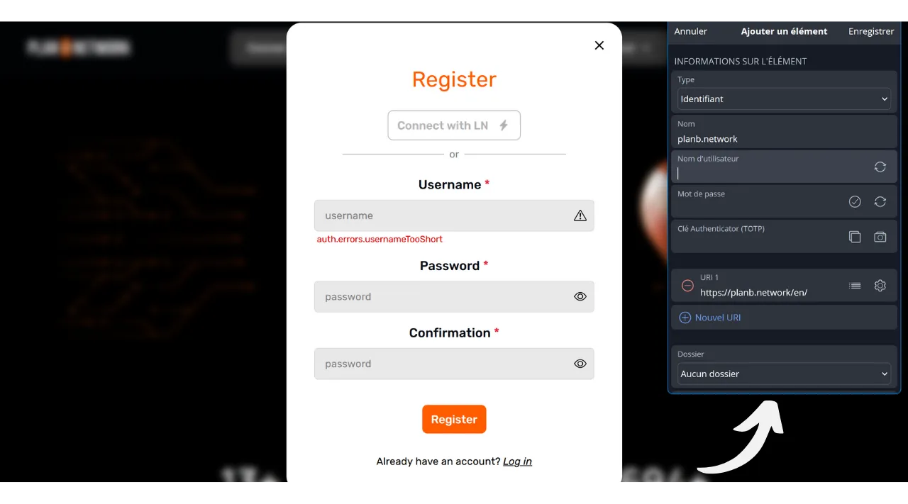
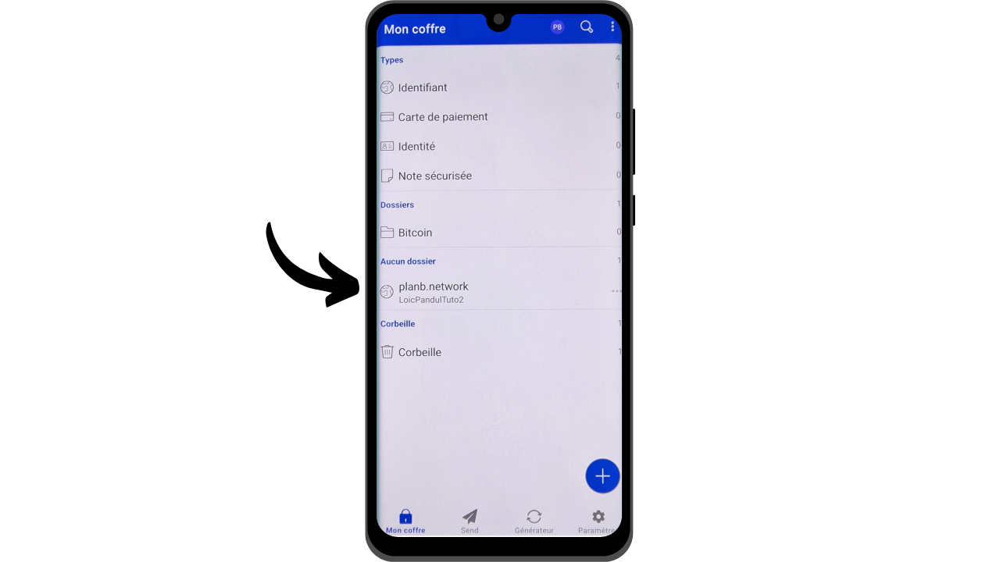

En la era digital, necesitamos gestionar una multitud de cuentas en línea que abarcan varios aspectos de nuestras vidas diarias, incluyendo banca, plataformas financieras, correos electrónicos, almacenamiento de archivos, salud, administración, redes sociales, videojuegos, etc.

Para autenticarnos en cada una de estas cuentas, utilizamos un identificador, a menudo una dirección de correo electrónico, acompañado de una contraseña. Ante la imposibilidad de memorizar un gran número de contraseñas únicas, uno podría sentirse tentado a reutilizar la misma contraseña o modificar ligeramente una base común para recordarla fácilmente. Sin embargo, estas prácticas comprometen seriamente la seguridad de tus cuentas.

El primer principio a seguir para las contraseñas es no reutilizarlas. Cada cuenta en línea debe estar protegida por una contraseña única que sea completamente distinta de las demás. Esto es importante porque, si un atacante logra comprometer una de tus contraseñas, no querrás que tenga acceso a todas tus cuentas. Tener una contraseña única para cada cuenta aísla los ataques potenciales y limita su alcance. Por ejemplo, si usas la misma contraseña para una plataforma de videojuegos y para tu correo electrónico, y esa contraseña se ve comprometida a través de un sitio de phishing relacionado con la plataforma de juegos, el atacante podría entonces acceder fácilmente a tu correo electrónico y tomar control de todas tus otras cuentas en línea.

El segundo principio esencial es la fortaleza de la contraseña. Una contraseña se considera fuerte si es difícil de adivinar mediante el método de fuerza bruta, es decir, a través de intentos y errores. Esto significa que tus contraseñas deben ser lo más aleatorias posible, largas e incluir una variedad de caracteres (minúsculas, mayúsculas, números y símbolos).

Aplicar estos dos principios de seguridad de contraseñas (unicidad y robustez) puede resultar difícil en la vida cotidiana, ya que es casi imposible memorizar una contraseña única, aleatoria y fuerte para todas nuestras cuentas. Aquí es donde entra en juego el gestor de contraseñas.

Un gestor de contraseñas genera y almacena de forma segura contraseñas fuertes, permitiéndote acceder a todas tus cuentas en línea sin la necesidad de memorizarlas individualmente. Solo necesitas recordar una contraseña, la contraseña maestra, que te da acceso a todas tus contraseñas guardadas en el gestor. Usar un gestor de contraseñas mejora tu seguridad en línea porque previene la reutilización de contraseñas y genera sistemáticamente contraseñas aleatorias. Pero también simplifica tu uso diario de tus cuentas centralizando el acceso a tu información sensible.
En este tutorial, exploraremos cómo configurar y usar un gestor de contraseñas para mejorar tu seguridad en línea. Te presentaré a Bitwarden, y en otro tutorial, veremos otra solución llamada KeePass.
https://planb.network/tutorials/others/keepass

Advertencia: Un gestor de contraseñas es excelente para almacenar contraseñas, pero **¡nunca debes almacenar la frase mnemotécnica de tu billetera de Bitcoin en él!** Recuerda, una frase mnemotécnica debe guardarse exclusivamente en un formato físico, como un pedazo de papel o metal.

## Introducción a Bitwarden

Bitwarden es un gestor de contraseñas adecuado tanto para principiantes como para usuarios avanzados. Ofrece numerosas ventajas. En primer lugar, Bitwarden es una solución multiplataforma, lo que significa que puedes usarlo como una aplicación móvil, aplicación web, extensión de navegador y software de escritorio.

Bitwarden te permite guardar tus contraseñas en línea y sincronizarlas en todos tus dispositivos, asegurando el cifrado de extremo a extremo con tu contraseña maestra. Esto te permite, por ejemplo, acceder a tus contraseñas tanto en tu computadora como en tu smartphone, con sincronización entre ambos. Dado que tus contraseñas están cifradas, permanecen inaccesibles para cualquiera, incluido Bitwarden, sin la clave de descifrado que es tu contraseña maestra.
Además, Bitwarden es de código abierto, lo que significa que el software puede ser auditado por expertos independientes. En cuanto a precios, Bitwarden ofrece tres planes:
- Una versión gratuita que exploraremos en este tutorial. Aunque es gratuita, proporciona un nivel de seguridad equivalente al de las versiones de pago. Puedes almacenar un número ilimitado de contraseñas y sincronizar tantos dispositivos como desees;
- Una versión premium por $10 al año que incluye características adicionales como almacenamiento de archivos, respaldo de tarjetas bancarias, la capacidad de configurar 2FA con una llave de seguridad física y acceso a la autenticación 2FA TOTP directamente con Bitwarden;
- Y un plan familiar por $40 al año que extiende los beneficios de la versión premium a seis usuarios diferentes.

En mi opinión, estos precios son justos. La versión gratuita es una excelente opción para principiantes, y la versión premium ofrece una muy buena relación calidad-precio en comparación con otros gestores de contraseñas en el mercado, al ofrecer más características. Además, el hecho de que Bitwarden sea de código abierto es una gran ventaja. Por lo tanto, es un compromiso interesante, especialmente para principiantes.
Otra característica de Bitwarden es la capacidad de autoalojar tu gestor de contraseñas si posees, por ejemplo, un NAS en casa. Al configurar esta configuración, tus contraseñas no se almacenan en los servidores de Bitwarden, sino en tus propios servidores. Esto te da control completo sobre la disponibilidad de tus contraseñas. Sin embargo, esta opción requiere una gestión rigurosa de respaldos para evitar cualquier pérdida de acceso. Por lo tanto, el autoalojamiento de Bitwarden está más adaptado para usuarios avanzados, y lo discutiremos en otro tutorial.
## ¿Cómo crear una cuenta de Bitwarden?

Visita [el sitio web de Bitwarden](https://bitwarden.com/) y haz clic en "*Comenzar*".

Comienza ingresando tu dirección de correo electrónico así como tu nombre o apodo.

A continuación, necesitarás configurar tu contraseña maestra. Como vimos en la introducción, esta contraseña es muy importante porque te da acceso a todas tus otras contraseñas guardadas en el gestor. Esto presenta dos riesgos principales: pérdida y compromiso. Si pierdes acceso a esta contraseña, ya no podrás acceder a todas tus credenciales. Si tu contraseña es robada, el atacante podrá acceder a todas tus cuentas.

Para minimizar el riesgo de pérdida, recomiendo hacer una copia de seguridad física de tu contraseña maestra en papel y almacenarla en un lugar seguro. Si es posible, sella esta copia de seguridad en un sobre seguro para asegurarte regularmente de que nadie más ha accedido a ella.

Para prevenir el compromiso de tu contraseña maestra, debe ser extremadamente robusta. Debería ser lo más larga posible, usar una amplia variedad de caracteres y ser elegida al azar. En 2024, las recomendaciones mínimas para una contraseña segura son 13 caracteres incluyendo números, letras minúsculas y mayúsculas, así como símbolos, siempre que la contraseña sea verdaderamente aleatoria. Sin embargo, recomiendo optar por una contraseña de al menos 20 caracteres, incluyendo todos los tipos posibles de caracteres, para asegurar su seguridad por más tiempo.

Ingresa tu contraseña maestra en el cuadro dedicado y confírmala en el siguiente cuadro.

Si lo deseas, puedes añadir una pista para tu contraseña maestra. Sin embargo, te aconsejo no hacerlo, ya que la pista no proporciona un método fiable de recuperación en caso de que pierdas tu contraseña y podría incluso ser útil para atacantes que intenten adivinarla o forzarla bruscamente. Como regla general, evita crear pistas públicas que podrían comprometer la seguridad de tu contraseña maestra.

Luego haz clic en el botón "*Crear una cuenta*".

Ahora puedes iniciar sesión en tu nueva cuenta de Bitwarden. Ingresa tu dirección de correo electrónico.

Luego escribe tu contraseña maestra.

Ahora estás en la interfaz web de tu gestor de contraseñas.

## ¿Cómo configurar Bitwarden?

Para empezar, confirmaremos nuestra dirección de correo electrónico. Haz clic en "*Enviar correo electrónico*".

Luego haz clic en el botón recibido por correo electrónico.

Finalmente, inicia sesión de nuevo.

Antes que nada, te aconsejo encarecidamente configurar la autenticación de dos factores (2FA) para asegurar tu gestor de contraseñas. Tienes la opción de usar una aplicación TOTP o una llave de seguridad física. Al activar 2FA, cada vez que inicies sesión en tu cuenta de Bitwarden, se te pedirá no solo tu contraseña maestra sino también una prueba de tu segundo factor de autenticación. Esto es una capa adicional de seguridad, particularmente útil en el caso de que tu copia de seguridad en papel de la contraseña maestra se vea comprometida.

Si no estás seguro de cómo configurar y usar estos dispositivos 2FA, te recomiendo seguir estos otros 2 tutoriales:

https://planb.network/tutorials/others/authy

https://planb.network/tutorials/others/security-key

Para hacer esto, ve a la pestaña "*Seguridad*" en el menú "*Configuración*".

Luego haz clic en la pestaña "*Inicio de sesión en dos pasos*".

Aquí, puedes elegir el método 2FA que prefieras. Por ejemplo, elegiré 2FA con una aplicación TOTP haciendo clic en el botón "*Administrar*".

Confirma tu contraseña maestra.

Luego escanea el código QR con tu aplicación 2FA.

Ingresa el código de 6 dígitos anotado en tu aplicación 2FA, luego haz clic en el botón "*Activar*". 
La autenticación de dos factores se ha configurado con éxito en tu cuenta.

Ahora, si intentas volver a iniciar sesión en tu gestor, primero necesitarás ingresar tu contraseña maestra, luego el código dinámico de 6 dígitos generado por tu aplicación 2FA. Asegúrate de tener siempre acceso a este código dinámico; sin él, no podrás recuperar tus contraseñas.

En la configuración, también tienes la opción de personalizar tu gestor en la pestaña "*Preferencias*". Aquí, puedes cambiar la duración antes de que tu gestor se bloquee automáticamente, así como el idioma y el tema de la interfaz.
Recomiendo encarecidamente ajustar la longitud de las contraseñas generadas por Bitwarden. Por defecto, la longitud está configurada en 14 caracteres, lo cual puede ser insuficiente para una seguridad óptima. Ahora que tienes un gestor para recordar todas tus contraseñas, podrías aprovecharlo para usar contraseñas muy fuertes.

Para esto, ve al menú "*Generator*".

Aquí, puedes aumentar la longitud de tus contraseñas a 40 y marcar la casilla para incluir símbolos.

## ¿Cómo asegurar tus cuentas con Bitwarden?

Ahora que tu gestor de contraseñas está configurado, puedes comenzar a almacenar las credenciales para tus cuentas en línea. Para agregar un nuevo elemento, haz clic directamente en el botón "*New item*" o en el botón "*New*" ubicado en la parte superior derecha de la pantalla, luego en "*item*".

En el formulario que se abre, comienza por determinar la naturaleza del elemento a guardar. Para almacenar credenciales de inicio de sesión, elige la opción "*Login*" del menú desplegable.

En el campo "*Name*", ingresa un nombre descriptivo para tus credenciales. Esto facilitará la búsqueda y organización de tus contraseñas, especialmente si tienes un gran número. Por ejemplo, si deseas guardar tus credenciales para el sitio de la Red PlanB, puedes nombrar este elemento de una manera que lo haga inmediatamente reconocible durante tus futuras búsquedas.

La opción "*Folder*" te permite clasificar tus credenciales en carpetas. Por ahora, no hemos creado ninguna, pero te mostraré cómo hacerlo más adelante.

En el campo "*Username*", ingresa tu nombre de usuario, que generalmente es tu dirección de correo electrónico. 
A continuación, en el campo "*Password*", puedes ingresar tu contraseña. Sin embargo, recomiendo encarecidamente dejar que Bitwarden genere una contraseña larga, aleatoria y única para ti. Esto asegura que tengas una contraseña fuerte. Para usar esta función, haz clic en el icono de doble flecha arriba del campo a llenar.

Puedes ver que tu contraseña ha sido generada.

En el campo "*URI 1*", puedes ingresar el nombre de dominio del sitio web.

Y finalmente, en el campo "*Notes*", puedes agregar detalles adicionales si es necesario.

Cuando hayas terminado de llenar todos estos campos, haz clic en el botón "*Save*".

Tu identificador ahora aparece en tu gestor Bitwarden.

Al hacer clic en él, puedes acceder a sus detalles y modificarlos.

Haciendo clic en los tres pequeños puntos a la derecha, tienes acceso rápido para copiar la contraseña o el identificador.

¡Felicidades, has guardado con éxito tu primera contraseña en tu gestor! Si quieres organizar mejor tus identificadores, puedes crear carpetas específicas. Para hacerlo, haz clic en el botón "*Nuevo*" ubicado en la parte superior derecha de la pantalla, luego selecciona "*Carpeta*". 
Ingresa un nombre para tu carpeta.

Luego haz clic en "*Guardar*".

Tu carpeta ahora aparece en tu gestor.

Puedes asignar una carpeta a un identificador al crearlo, como hicimos anteriormente, o modificando un identificador existente. Por ejemplo, al hacer clic en mi identificador para PlanB Network, luego puedo elegir clasificarlo en la carpeta "*Bitcoin*".

De esta manera, puedes estructurar tu gestor de contraseñas para facilitar la búsqueda de tus identificadores. Puedes organizarlos con carpetas tales como personal, profesional, bancos, correos electrónicos, redes sociales, suscripciones, compras, administración, streaming, almacenamiento, viajes, salud, etc.
Si prefieres usar solo la versión web de Bitwarden, es totalmente posible apegarse a eso. Entonces recomiendo agregar tu gestor de contraseñas a los favoritos de tu navegador para un fácil acceso y para evitar riesgos de phishing. Sin embargo, Bitwarden también ofrece una gama completa de clientes que te permiten usar tu gestor en varios dispositivos y simplificar su uso diario. Ofrecen notablemente una aplicación móvil, una extensión de navegador y software de escritorio. Veamos cómo configurarlos juntos.

## ¿Cómo usar la extensión de navegador de Bitwarden?

Primero, puedes configurar la extensión del navegador si lo deseas. Esta extensión funciona como una versión reducida de tu gestor y te ofrece la posibilidad de guardar automáticamente nuevas contraseñas, generar sugerencias para contraseñas seguras y llenar automáticamente tus credenciales en páginas de inicio de sesión de sitios web.

El uso diario de esta extensión es extremadamente conveniente, pero también puede abrir nuevos vectores de ataque. Algunos expertos en ciberseguridad, por lo tanto, aconsejan contra el uso de extensiones de navegador para gestores de contraseñas. Sin embargo, si eliges usar la extensión de Bitwarden, aquí te mostramos cómo proceder:

Comienza yendo a [la página oficial de descarga de Bitwarden](https://bitwarden.com/download/#downloads-web-browser).

Elige tu navegador de la lista proporcionada. Para este ejemplo, estoy usando Firefox, así que soy redirigido a la extensión oficial de Bitwarden en la Tienda de Complementos de Firefox. El procedimiento es bastante similar para otros navegadores.

Haz clic en el botón "*Agregar a Firefox*".

Luego puedes adjuntar Bitwarden a tu barra de extensiones para un fácil acceso. Haz clic en la extensión para iniciar sesión.

Ingresa tu dirección de correo electrónico.

Luego tu contraseña maestra.

Y finalmente, ingresa el código de 6 dígitos de tu aplicación de autenticación.

Ahora estás conectado a tu gestor Bitwarden a través de la extensión del navegador.

Por ejemplo, si regreso al sitio de PlanB Network e intento iniciar sesión en mi cuenta, puedes ver que la extensión de Bitwarden integrada en el navegador reconoce los campos de inicio de sesión y automáticamente me ofrece seleccionar el identificador que guardé previamente.

Si selecciono este identificador, Bitwarden rellena los campos de inicio de sesión por mí. Esta característica de la extensión permite una rápida conexión a sitios web, sin la necesidad de copiar y pegar credenciales desde la aplicación web o el software de Bitwarden.

La extensión también está diseñada para detectar la creación de nuevas cuentas. Por ejemplo, al crear una nueva cuenta en PlanB Network, Bitwarden automáticamente sugiere guardar el nuevo identificador.

Al hacer clic en esta sugerencia que aparece, se abre la extensión. Me permite ingresar los detalles del nuevo identificador y generar una contraseña fuerte y única.

Después de completar la información y hacer clic en "*Guardar*", la extensión guarda las credenciales.

Luego, la extensión rellena automáticamente nuestras credenciales en los campos apropiados en el sitio web.

## ¿Cómo usar el software Bitwarden?

Para instalar el software de escritorio de Bitwarden, comienza yendo a [la página de descarga](https://bitwarden.com/download/#downloads-desktop). Selecciona y descarga la versión correspondiente a tu sistema operativo.

Una vez completada la descarga, procede con la instalación del software en tu computadora. En el primer lanzamiento del software de Bitwarden, necesitarás ingresar tus credenciales para desbloquear tu gestor de contraseñas.

Luego, llegarás a la página de inicio de tu gestor. La interfaz es casi la misma que en la aplicación web.

## ¿Cómo usar la aplicación Bitwarden?

Para acceder a tus contraseñas desde tu teléfono, puedes instalar la aplicación móvil de Bitwarden. Comienza yendo a [la página de descarga](https://bitwarden.com/download/#downloads-mobile) y usa tu smartphone para escanear el código QR correspondiente a tu sistema operativo.

Descarga e instala la aplicación móvil oficial de Bitwarden. En la primera apertura de la aplicación, ingresa tus credenciales para desbloquear el acceso a tu gestor de contraseñas.

Una vez conectado, podrás consultar y gestionar todas tus contraseñas directamente desde la aplicación.

Para mejorar la seguridad de tu aplicación, te aconsejo ir a los ajustes y activar la protección con PIN. Esto añadirá una capa extra de seguridad en caso de pérdida o robo de tu teléfono.

## ¿Cómo hacer una copia de seguridad de Bitwarden?
Para asegurarte de nunca perder acceso a tus contraseñas, incluso en el caso de perder tu contraseña maestra o un desastre que afecte a los servidores de Bitwarden, te aconsejo realizar regularmente una copia de seguridad cifrada de tu gestor en un medio externo.
La idea es cifrar todas tus credenciales de Bitwarden con una contraseña diferente a tu contraseña maestra y guardar esta copia de seguridad cifrada en una memoria USB o un disco duro que mantengas en tu casa, por ejemplo. Luego, puedes mantener una copia física de la contraseña de descifrado en un lugar separado de donde se almacena el medio de respaldo. Por ejemplo, podrías mantener la memoria USB en casa y confiar la copia física de la contraseña de cifrado a un amigo de confianza.
Este método asegura que, incluso si tu medio de respaldo es robado, tus datos permanecerán inaccesibles sin la contraseña de descifrado. De manera similar, tu amigo no podrá acceder a tus datos sin tener el medio físico.

Sin embargo, en caso de un problema, puedes usar la contraseña y el medio externo para recuperar el acceso a tus credenciales, independientemente de Bitwarden. Así, incluso si los servidores de Bitwarden fueran destruidos, todavía tendrías la posibilidad de recuperar tus contraseñas.

Por lo tanto, te aconsejo realizar estas copias de seguridad regularmente para que siempre incluyan tus credenciales más recientes. Para evitar molestar a tu amigo, quien posee una copia de la contraseña de cifrado, con cada nueva copia de seguridad, puedes guardar esta contraseña en tu gestor de contraseñas. Esto no se pretende como una copia de seguridad, ya que tu amigo ya tiene una copia física, sino más bien para simplificar tus futuros procedimientos de exportación.

Para proceder con la exportación, es bastante simple: ve a la sección "*Herramientas*" de tu gestor de Bitwarden, luego selecciona "*Exportar bóveda*".

Para el formato, elige "*.json (Cifrado)*".

Luego selecciona la opción "*Protegido por contraseña*".

Aquí, es importante elegir una contraseña fuerte, única y generada aleatoriamente para cifrar la copia de seguridad. Esto asegura que, incluso en el caso de robo de tu copia de seguridad cifrada, será imposible para un atacante descifrarla por fuerza bruta.

Haz clic en "*Confirmar formato*" e ingresa tu contraseña maestra para proceder con la exportación.

Una vez completada la exportación, encontrarás tu archivo de copia de seguridad cifrado en tus descargas. Transfiérelo a un dispositivo de almacenamiento externo seguro, como una memoria USB o un disco duro. Repite esta operación periódicamente dependiendo de tu uso. Por ejemplo, puedes renovar la copia de seguridad cada semana o cada mes, según tus necesidades.