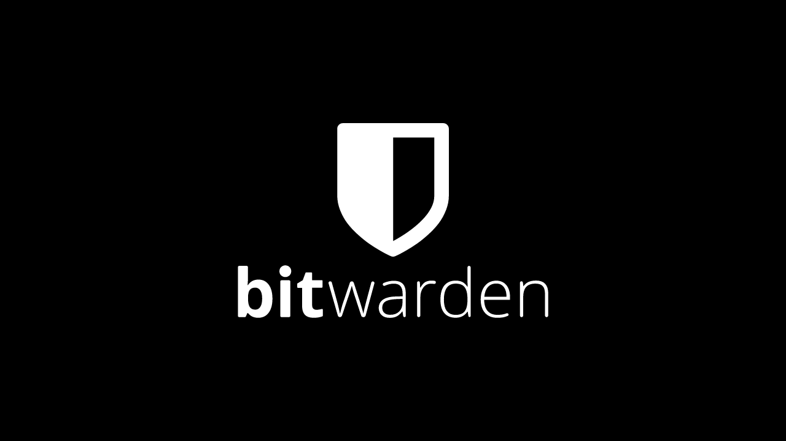
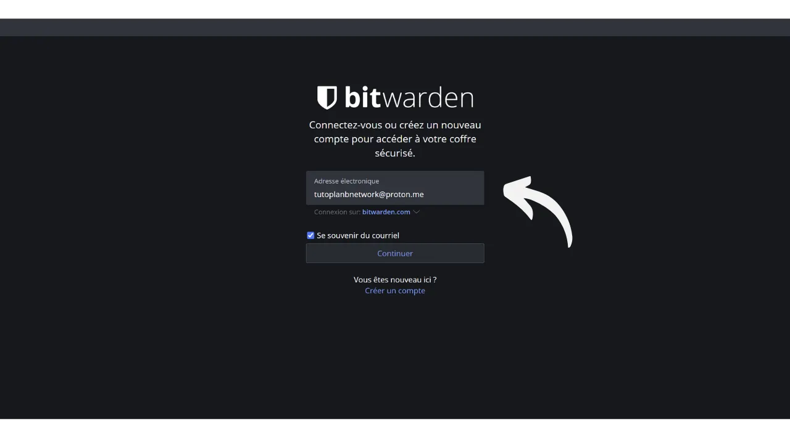

Digiajastul peame haldama paljusid veebikontosid, mis hõlmavad meie igapäevaelu erinevaid aspekte, sealhulgas pangandust, finantsplatvorme, e-kirju, failihoidlat, tervist, administratsiooni, sotsiaalvõrgustikke, videomänge jne.

Iga sellise konto autentimiseks kasutame identifikaatorit, tihti e-posti aadressi, millele lisandub parool. Silmitsi suure hulga unikaalsete paroolide meeldejätmise võimatusega võib tekkida kiusatus kasutada sama parooli või muuta veidi ühist alust, et seda kergemini meelde jätta. Siiski ohustavad need praktikad tõsiselt teie kontode turvalisust.

Esimene põhimõte paroolide puhul on neid mitte taaskasutada. Iga veebikonto peaks olema kaitstud ainulaadse ja täiesti eristuva parooliga. See on oluline, sest kui ründaja suudab kompromiteerida ühe teie paroolidest, ei soovi te, et tal oleks juurdepääs kõigile teie kontodele. Iga konto jaoks ainulaadse parooli omamine isoleerib potentsiaalsed rünnakud ja piirab nende ulatust. Näiteks, kui kasutate sama parooli videomänguplatvormi ja oma e-posti jaoks ning see parool kompromiteeritakse läbi mänguplatvormiga seotud õngitsussaidi, võib ründaja seejärel kergesti pääseda ligi teie e-postile ja võtta kontrolli kõigi teie teiste veebikontode üle.

Teine oluline põhimõte on parooli tugevus. Parooli peetakse tugevaks, kui seda on raske jõuga lahti murda, st arvata katse-eksituse meetodil. See tähendab, et teie paroolid peavad olema võimalikult juhuslikud, pikad ja sisaldama erinevaid tähemärke (väiketähed, suurtähed, numbrid ja sümbolid).

Nende kahe parooliturvalisuse põhimõtte (ainulaadsus ja robustsus) rakendamine igapäevaelus võib olla keeruline, kuna on peaaegu võimatu meelde jätta kõigi meie kontode jaoks ainulaadne, juhuslik ja tugev parool. Siin tuleb mängu paroolihaldur.

Paroolihaldur genereerib ja salvestab turvaliselt tugevad paroolid, võimaldades teil pääseda ligi kõigile oma veebikontodele ilma, et peaksite neid ükshaaval meelde jätma. Teil on vaja meeles pidada ainult ühte parooli, peaparooli, mis annab teile juurdepääsu kõigile halduris salvestatud paroolidele. Paroolihalduri kasutamine suurendab teie veebiturvalisust, kuna see hoiab ära paroolide taaskasutamise ja genereerib süstemaatiliselt juhuslikke paroole. Kuid see lihtsustab ka teie igapäevast kontode kasutamist, keskendades juurdepääsu teie tundlikule teabele.
Selles õpetuses uurime, kuidas seadistada ja kasutada paroolihaldurit, et suurendada oma veebiturvalisust. Tutvustan teile Bitwardeni ja teises õpetuses vaatame teist lahendust nimega KeePass.
https://planb.network/tutorials/others/keepass

Hoiatus: Paroolihaldur on suurepärane paroolide salvestamiseks, kuid **te ei tohiks kunagi selles hoida oma Bitcoini rahakoti mnemoonilist fraasi!** Pea meeles, et mnemooniline fraas tuleks eksklusiivselt salvestada füüsilisel kujul, nagu paberil või metallil.

## Tutvustus Bitwardenile

Bitwarden on paroolihaldur, mis sobib nii algajatele kui ka edasijõudnutele. See pakub mitmeid eeliseid. Esiteks ja kõige tähtsamalt, Bitwarden on mitmeplatvormiline lahendus, mis tähendab, et saate seda kasutada mobiilirakendusena, veebirakendusena, brauserilaiendina ja lauaarvutitarkvarana.

Bitwarden võimaldab teil salvestada oma paroole veebis ja sünkroniseerida neid kõigil oma seadmetel, tagades samal ajal lõpp-lõpuni krüpteerimise oma peaparooliga. See võimaldab teil näiteks pääseda ligi oma paroolidele nii arvutis kui ka nutitelefonis, sünkroniseerides need kahe vahel. Kuna teie paroolid on krüpteeritud, jäävad need kõigile, sealhulgas Bitwardenile, ilma dekrüpteerimisvõtmeta, mis on teie peaparool, kättesaamatuks.
Lisaks sellele on Bitwarden avatud lähtekoodiga, mis tähendab, et tarkvara saavad auditeerida sõltumatud eksperdid. Hinnakujunduse osas pakub Bitwarden kolme plaani:
- Tasuta versioon, mida me selles õpetuses uurime. Kuigi see on tasuta, pakub see turvalisuse taset, mis on võrdväärne tasuliste versioonidega. Saate salvestada piiramatu arvu paroole ja sünkroniseerida nii palju seadmeid kui soovite;
- Premium versioon 10 dollari eest aastas, mis sisaldab lisafunktsioone nagu failihoidla, krediitkaardi varukoopia, võimalus seadistada 2FA füüsilise turvavõtmega ja juurdepääs TOTP 2FA autentimisele otse Bitwardeniga;
- Ja pereplaan 40 dollari eest aastas, mis laiendab premium versiooni eeliseid kuuele erinevale kasutajale.

Minu arvates on need hinnad õiglased. Tasuta versioon on suurepärane valik algajatele ja premium versioon pakub väga head hinna ja kvaliteedi suhet võrreldes teiste turul olevate paroolihalduritega, pakkudes samal ajal rohkem funktsioone. Lisaks on Bitwardeni avatud lähtekoodiga olek suur eelis. Seega on see huvitav kompromiss, eriti algajatele.
Teine Bitwardeni omadus on võimalus ise hostida oma paroolihaldurit, kui omate näiteks kodus NAS-i. Selle seadistuse abil ei salvestata teie paroole Bitwardeni serverites, vaid teie enda serverites. See annab teile täieliku kontrolli oma paroolide kättesaadavuse üle. Siiski nõuab see valik rangeid varundamise haldamise meetmeid, et vältida juurdepääsu kaotust. Seetõttu sobib Bitwardeni isehostimine rohkem edasijõudnud kasutajatele ja me arutame seda teises õpetuses.
## Kuidas luua Bitwardeni konto?

Külastage [Bitwardeni veebisaiti](https://bitwarden.com/) ja klõpsake nupul "*Alusta*".

Alustage oma e-posti aadressi ja oma nime või hüüdnime sisestamisega.

Järgmisena peate seadistama oma peamise parooli. Nagu sissejuhatuses nägime, on see parool väga oluline, kuna see annab teile juurdepääsu kõigile teie teistele salvestatud paroolidele halduris. See esitab kaks peamist riski: kaotus ja kompromiteerimine. Kui kaotate juurdepääsu sellele paroolile, ei saa te enam oma volikirjadele juurde pääseda. Kui teie parool varastatakse, saab ründaja juurde pääseda kõigile teie kontodele.

Kaotuse riski minimeerimiseks soovitan teha oma peamisest paroolist füüsilise varukoopia paberil ja hoida seda turvalises kohas. Kui võimalik, pitseerige see varukoopia turvalises ümbrikus, et regulaarselt veenduda, et keegi teine pole sellele juurde pääsenud.

Oma peamise parooli kompromiteerimise vältimiseks peab see olema äärmiselt tugev. See peaks olema võimalikult pikk, kasutama laia valikut tähemärke ja olema valitud juhuslikult. 2024. aastal on turvalise parooli minimaalsed soovitused 13 tähemärki, sealhulgas numbrid, väiketähed ja suurtähed ning sümbolid, eeldusel, et parool on tõeliselt juhuslik. Siiski soovitan valida vähemalt 20-tähemärgilise parooli, mis sisaldab kõiki võimalikke tähemärkide tüüpe, et tagada selle turvalisus pikemaks ajaks.

Sisestage oma peamine parool ettenähtud kasti ja kinnitage see järgmises kastis.

Kui soovite, võite lisada oma peamisele paroolile vihje. Siiski soovitan seda mitte teha, kuna vihje ei paku usaldusväärset taastamismeetodit juhul, kui kaotate oma parooli, ja võib isegi olla kasulik ründajatele, kes üritavad teie parooli ära arvata või jõuga murda. Üldreeglina vältige avalike vihjete loomist, mis võiksid ohustada teie peamise parooli turvalisust.
Seejärel klõpsake nupul "*Loo konto*".

Nüüd saate sisse logida oma uude Bitwardeni kontosse. Sisestage oma e-posti aadress.

Seejärel sisestage oma peamine parool.

Nüüd olete oma paroolihalduri veebiliideses.

## Kuidas seadistada Bitwardeni?

Alustuseks kinnitame oma e-posti aadressi. Klõpsake nupul "*Saada e-kiri*".

Seejärel klõpsake e-kirjaga saadud nupul.

Lõpuks logige uuesti sisse.

Eelkõige soovitan tungivalt seadistada kahefaktoriline autentimine (2FA), et oma paroolihaldurit turvata. Teil on valik kasutada TOTP rakendust või füüsilist turvavõtit. Aktiveerides 2FA, küsitakse iga kord, kui logite oma Bitwardeni kontole sisse, mitte ainult teie peamist parooli, vaid ka teie teise autentimisfaktori tõendit. See on lisaturvalisuse kiht, eriti kasulik juhul, kui teie peamise parooli paberkoopia on kompromiteeritud.

Kui te pole kindel, kuidas neid 2FA seadmeid seadistada ja kasutada, soovitan järgida neid kahte muud õpetust:

https://planb.network/tutorials/others/authy

https://planb.network/tutorials/others/security-key

Selleks minge menüüs "*Seaded*" vahekaardile "*Turvalisus*".

Seejärel klõpsake vahekaardil "*Kaheastmeline sisselogimine*".

Siin saate valida endale eelistatud 2FA meetodi. Näiteks valin ma 2FA TOTP rakendusega, klõpsates nupul "*Halda*".

Kinnitage oma peamine parool.

Seejärel skannige QR-kood oma 2FA rakendusega.

Sisestage oma 2FA rakendusel märgitud 6-kohaline kood, seejärel klõpsake nupul "*Lülita sisse*". 
Kahefaktoriline autentimine on teie kontol edukalt seadistatud.

Nüüd, kui proovite oma haldurisse uuesti sisse logida, peate esmalt sisestama oma peamise parooli, seejärel 6-kohalise dünaamilise koodi, mille genereerib teie 2FA rakendus. Veenduge, et teil oleks alati juurdepääs sellele dünaamilisele koodile; ilma selleta ei saa te oma paroole taastada.

Seadetes on teil võimalus kohandada oma haldurit vahekaardil "*Eelistused*". Siin saate muuta halduri automaatse lukustumise aega, samuti liidese keelt ja teemat.

Soovitan tungivalt kohandada Bitwardeni poolt genereeritud paroolide pikkust. Vaikimisi on pikkus määratud 14 tähemärgile, mis võib optimaalse turvalisuse tagamiseks olla ebapiisav. Nüüd, kui teil on haldur, mis mäletab kõiki teie paroole, võiksite seda ära kasutada, et kasutada väga tugevaid paroole.
Selleks minge menüüsse "*Generator*". 
Siin saate suurendada oma paroolide pikkust kuni 40 tähemärgini ja märkida ruudu, et lisada sümbolid.

## Kuidas oma kontosid Bitwardeniga kaitsta?

Nüüd, kui teie paroolihaldur on seadistatud, saate hakata salvestama oma veebikontode andmeid. Uue kirje lisamiseks klõpsake otse nupul "*New item*" või ekraani paremas ülanurgas asuval nupul "*New*", seejärel valige "*item*".

Avanevas vormis alustage salvestatava kirje liigi määramisega. Sisselogimisandmete salvestamiseks valige rippmenüüst valik "*Login*".

Väljale "*Name*" sisestage oma andmetele kirjeldav nimi. See teeb paroolide otsimise ja organiseerimise lihtsamaks, eriti kui neid on palju. Näiteks, kui soovite salvestada oma andmed PlanB Network saidi jaoks, võite selle kirje nimetada viisil, mis muudab selle tulevikus kergesti äratuntavaks.

Väli "*Folder*" võimaldab teil klassifitseerida oma andmed kaustadesse. Praegu me pole veel ühtegi loonud, kuid ma näitan teile hiljem, kuidas seda teha.

Väljale "*Username*" sisestage oma kasutajanimi, mis on tavaliselt teie e-posti aadress. 
Järgmisena saate väljale "*Password*" sisestada oma parooli. Siiski soovitan tungivalt lasta Bitwardenil teie jaoks genereerida pikk, juhuslik ja unikaalne parool. See tagab tugeva parooli. Selle funktsiooni kasutamiseks klõpsake välja kohal asuval topelt noole ikoonil.

Näete, et teie parool on genereeritud.

Väljale "*URI 1*" saate sisestada veebisaidi domeeninime.

Ja lõpuks, väljale "*Notes*" saate vajadusel lisada täiendavaid üksikasju.

Kui olete kõik need väljad täitnud, klõpsake nupul "*Save*".

Teie andmed ilmuvad nüüd teie Bitwardeni halduris.

Sellel klõpsates saate juurdepääsu selle üksikasjadele ja neid muuta.

Paremal asuvatel kolmel väikesel punktil klõpsates on teil kiire juurdepääs parooli või kasutajanime kopeerimiseks.

Palju õnne, olete edukalt salvestanud oma esimese parooli oma haldurisse! Kui soovite oma andmeid paremini organiseerida, saate luua spetsiifilisi kaustu. Selleks klõpsake ekraani paremas ülanurgas asuval nupul "*New*", seejärel valige "*Folder*".

Sisestage oma kaustale nimi.

Seejärel klõpsake nupul "*Save*".

Teie kaust ilmub nüüd teie haldurisse.
Saate määrata kausta mandaadile selle loomisel, nagu me varem tegime, või muutes olemasolevat mandaati. Näiteks, klõpsates oma mandaadil PlanB Network, saan seejärel valida selle klassifitseerimise "*Bitcoin*" kausta.

Nii saate oma paroolihaldurit struktureerida, et muuta oma mandaatide leidmine lihtsamaks. Saate neid korraldada kaustadesse nagu isiklikud, professionaalsed, pangad, e-postid, sotsiaalvõrgustikud, tellimused, ostud, haldus, voogedastus, salvestus, reisimine, tervis jne.
Kui eelistate kasutada ainult Bitwardeni veebiversiooni, on see täiesti võimalik. Soovitan sel juhul lisada oma paroolihalduri brauseri lemmikutesse, et tagada lihtne juurdepääs ja vältida õngitsusriski. Siiski pakub Bitwarden ka täielikku klientide valikut, mis võimaldab teil oma haldurit kasutada erinevatel seadmetel ja lihtsustada selle igapäevast kasutamist. Nad pakuvad märkimisväärselt mobiilirakendust, brauserilaiendust ja lauaarvutitarkvara. Vaatame, kuidas neid koos seadistada.

## Kuidas kasutada Bitwardeni brauserilaiendust?

Esmalt, kui soovite, saate seadistada brauserilaienduse. See laiendus toimib kui teie halduri vähendatud versioon ja pakub teile võimalust automaatselt salvestada uusi paroole, genereerida turvalisi paroolisoovitusi ja täita automaatselt teie mandaate veebilehe sisselogimisvormidel.

Selle laienduse igapäevane kasutamine on äärmiselt mugav, kuid see võib avada ka uusi rünnakuvektoreid. Seetõttu soovitavad mõned küberjulgeoleku eksperdid vältida paroolihaldurite brauserilaienduste kasutamist. Kui aga otsustate Bitwardeni laiendust kasutada, siis toimige järgmiselt:

Alustage, minnes [ametlikule Bitwardeni allalaadimise lehele](https://bitwarden.com/download/#downloads-web-browser).

Valige loendist oma brauser. Selle näite puhul kasutan Firefoxi, seega suunatakse mind ametlikule Bitwardeni laiendusele Firefox Add-ons Store'is. Protseduur on üsna sarnane teiste brauserite puhul.

Klõpsake nupul "*Lisa Firefoxi*".

Seejärel saate Bitwardeni kinnitada oma laienduste ribale lihtsaks juurdepääsuks. Klõpsake laiendusel, et sisse logida.

Sisestage oma e-posti aadress.

Seejärel oma peamine parool.

Ja lõpuks sisestage 6-kohaline kood oma autentimisrakendusest.

Nüüd olete ühendatud oma Bitwardeni halduriga läbi brauserilaienduse.

Näiteks, kui pöördun tagasi PlanB Networki saidile ja proovin oma kontole sisse logida, näete, et brauserisse integreeritud Bitwardeni laiendus tunnistab sisselogimisvälju ja pakub automaatselt mulle varem salvestatud identifikaatori valimist.

Kui ma valin selle identifikaatori, täidab Bitwarden minu jaoks sisselogimisväljad. Selle laienduse funktsioon võimaldab kiiret ühendust veebisaitidega, ilma et oleks vaja kopeerida-kleepida volitusi Bitwardeni veebirakendusest või tarkvarast.  Laiend on samuti kavandatud uute kontode loomise tuvastamiseks. Näiteks uue konto loomisel PlanB võrgustikus, pakub Bitwarden automaatselt uue identifikaatori salvestamist.  Selle ettepaneku peale klõpsates, mis ilmub, avaneb laiend. See võimaldab mul sisestada uue identifikaatori üksikasjad ja genereerida tugeva, unikaalse parooli.  Pärast teabe täitmist ja "*Salvesta*" peale klõpsamist, salvestab laiend volitused.  Seejärel lisab laiend automaatselt meie volitused veebisaidil sobivatesse väljadesse.  ## Kuidas kasutada Bitwardeni tarkvara?
Bitwardeni lauaarvuti tarkvara installimiseks alusta [allalaadimise lehele](https://bitwarden.com/download/#downloads-desktop) minemisest. Vali ja laadi alla oma operatsioonisüsteemile vastav versioon.  Allalaadimise lõppedes jätkake tarkvara installimisega oma arvutisse. Bitwardeni tarkvara esmakordsel käivitamisel peate sisestama oma volitused, et avada oma paroolihaldur.  Seejärel jõuate oma halduri avalehele. Liides on peaaegu sama nagu veebirakenduses.  ## Kuidas kasutada Bitwardeni rakendust?

Oma paroolidele telefonist juurdepääsuks saate installida Bitwardeni mobiilirakenduse. Alusta [allalaadimise lehele](https://bitwarden.com/download/#downloads-mobile) minemisest ja kasuta oma nutitelefoni, et skaneerida QR-koodi, mis vastab sinu operatsioonisüsteemile.  Laadi alla ja installi ametlik Bitwardeni mobiilirakendus. Rakenduse esmakordsel avamisel sisesta oma volitused, et avada juurdepääs oma paroolihaldurile.  Ühenduse loomisel saad kõiki oma paroole otse rakendusest konsulteerida ja hallata.  Rakenduse turvalisuse suurendamiseks soovitan minna seadetesse ja aktiveerida PIN-kaitse. See lisab täiendava turvakihi juhuks, kui sinu telefon kaob või varastatakse.  ## Kuidas varundada Bitwardeni?
Selleks, et sa ei kaotaks kunagi juurdepääsu oma paroolidele, isegi kui kaotad oma peaparooli või Bitwardeni servereid mõjutab katastroof, soovitan regulaarselt teha oma haldurist krüpteeritud varukoopia välisele meediumile.

Mõte on krüpteerida kõik sinu Bitwardeni volitused parooliga, mis erineb sinu peaparoolist, ja salvestada see krüpteeritud varukoopia USB mälupulgale või kõvakettale, mida hoiate näiteks oma kodus. Saad seejärel hoida dekrüpteerimisparooli füüsilist koopiat eraldi kohas, kus varukandja asub. Näiteks võiksid hoida USB mälupulka kodus ja usaldada dekrüpteerimisparooli füüsilise koopia usaldusväärsele sõbrale.

See meetod tagab, et isegi kui sinu varukandja varastatakse, jäävad sinu andmed ilma dekrüpteerimisparoolita kättesaamatuks. Samamoodi ei saa sinu sõber ilma füüsilise meediumita sinu andmetele juurde pääseda.
Siiski, probleemi korral saate kasutada parooli ja välist meediumit, et taastada juurdepääs oma volitustele sõltumatult Bitwardenist. Seega, isegi kui Bitwardeni serverid hävitataks, oleks teil siiski võimalus oma paroole taastada.
Seetõttu soovitan teil neid varukoopiaid regulaarselt teha, et need sisaldaksid alati teie kõige uuemaid volitusi. Et vältida oma sõbra tülitamist, kes hoiab krüpteerimisparooli koopiat, iga uue varukoopia puhul, võite selle parooli salvestada oma paroolihaldurisse. See ei ole mõeldud varukoopiana, kuna teie sõbral on juba füüsiline koopia, vaid pigem teie tulevaste ekspordiprotseduuride lihtsustamiseks.

Ekspordi toiminguga jätkamiseks on see üsna lihtne: minge oma Bitwardeni halduri "*Tööriistad*" sektsiooni, seejärel valige "*Ekspordi seif*".

Formaadi jaoks valige "*.json (Krüpteeritud)*".

Seejärel valige "*Parooliga kaitstud*" valik.

Siin on oluline valida tugev, unikaalne ja juhuslikult genereeritud parool varukoopia krüpteerimiseks. See tagab, et isegi teie krüpteeritud varukoopia varguse korral oleks ründajal võimatu seda jõuga lahti murda.

Klõpsake "*Kinnita formaat*" ja sisestage oma peaparool, et jätkata ekspordiga.

Kui eksport on lõpetatud, leiate oma krüpteeritud varukoopia faili oma allalaadimistest. Kandke see turvalisele välisele salvestusseadmele, näiteks USB mälupulgale või kõvakettale. Korrake seda toimingut perioodiliselt vastavalt oma kasutusele. Näiteks võite varukoopia uuendada iga nädal või iga kuu, vastavalt oma vajadustele.