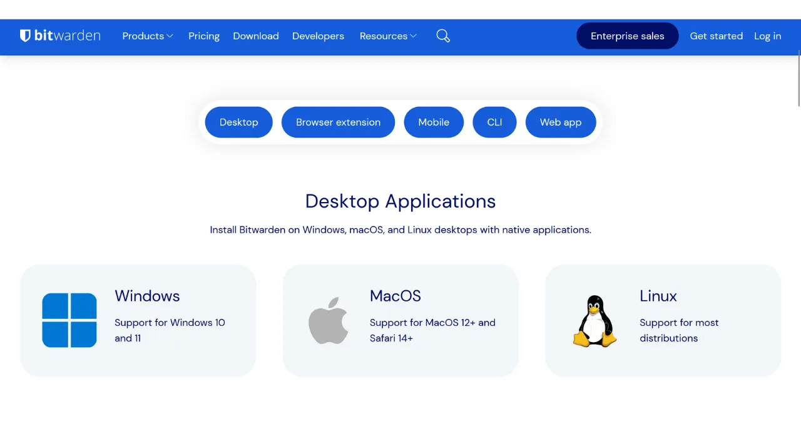
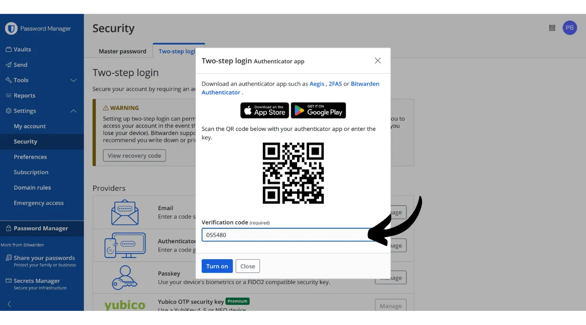
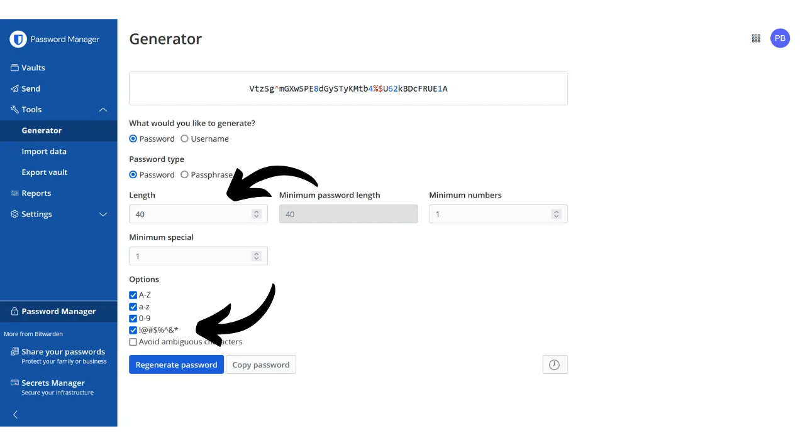
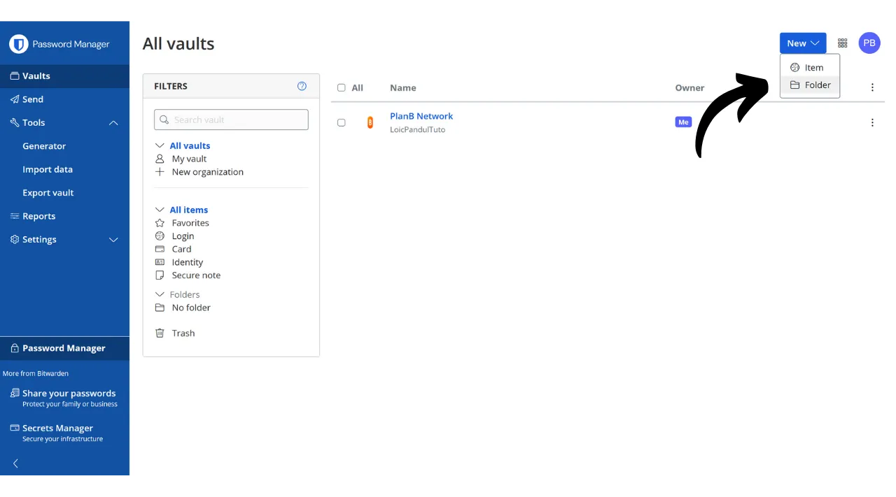
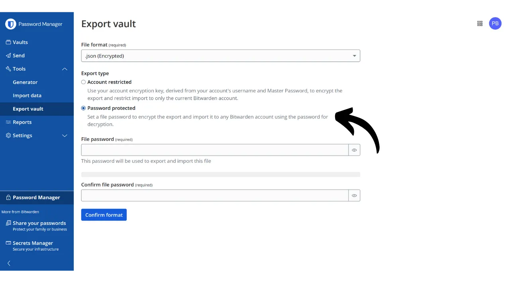

Digitaalisella aikakaudella meidän täytyy hallinnoida lukuisia verkkotilejä, jotka kattavat eri osa-alueita päivittäisessä elämässämme, mukaan lukien pankkiasiat, rahoituspalvelut, sähköpostit, tiedostojen tallennus, terveys, hallinto, sosiaaliset verkostot, videopelit jne.

Tunnistautuaksemme kullakin näistä tileistä käytämme tunnistetta, usein sähköpostiosoitetta, johon liittyy salasana. Ainutlaatuisten salasanojen suuren määrän muistamisen mahdottomuuden edessä saatetaan houkutella käyttämään samaa salasanaa uudelleen tai muokata yhteistä perustaa helposti muistettavaksi. Kuitenkin nämä käytännöt vaarantavat vakavasti tiliesi turvallisuuden.

Ensimmäinen periaate salasanojen osalta on, ettei niitä tulisi käyttää uudelleen. Jokaisen verkkotilin tulisi olla suojattu ainutlaatuisella ja täysin erillisellä salasanalla. Tämä on tärkeää, koska jos hyökkääjä onnistuu murtamaan jonkin salasanasi, et halua heidän pääsevän käsiksi kaikkiin tileihisi. Ainutlaatuisen salasanan käyttäminen kullakin tilillä eristää mahdolliset hyökkäykset ja rajoittaa niiden vaikutusaluetta. Esimerkiksi, jos käytät samaa salasanaa videopelialustalla ja sähköpostissasi, ja kyseinen salasana murretaan phishing-sivuston kautta, joka liittyy pelialustaan, hyökkääjä voisi sitten helposti päästä käsiksi sähköpostiisi ja ottaa hallintaansa kaikki muut verkkotilisi.

Toinen olennainen periaate on salasanan vahvuus. Salasanaa pidetään vahvana, jos sitä on vaikea murtaa brute force -menetelmällä, eli arvaamalla kokeilemalla. Tämä tarkoittaa, että salasanasi tulee olla mahdollisimman satunnaisia, pitkiä ja sisältää erilaisten merkkien monimuotoisuutta (pienet kirjaimet, isot kirjaimet, numerot ja symbolit).

Näiden kahden salasanaturvallisuuden periaatteen (ainutlaatuisuus ja lujuus) noudattaminen voi olla vaikeaa arkielämässä, koska on lähes mahdotonta muistaa ainutlaatuista, satunnaista ja vahvaa salasanaa kaikille tileillemme. Tässä kohtaa tulee mukaan salasananhallintaohjelma.

Salasananhallintaohjelma luo ja tallentaa turvallisesti vahvoja salasanoja, mahdollistaen pääsyn kaikkiin verkkotileihisi ilman, että sinun tarvitsee muistaa niitä yksitellen. Sinun tarvitsee muistaa vain yksi salasana, pääsalasana, joka antaa sinulle pääsyn kaikkiin tallennettuihin salasanoihisi hallintaohjelmassa. Salasananhallintaohjelman käyttö parantaa verkkoturvallisuuttasi, koska se estää salasanojen uudelleenkäytön ja luo järjestelmällisesti satunnaisia salasanoja. Mutta se myös yksinkertaistaa päivittäistä tilien käyttöäsi keskittämällä pääsyn arkaluonteisiin tietoihisi.
Tässä oppaassa tutustumme siihen, kuinka salasananhallintaohjelma otetaan käyttöön ja käytetään verkkoturvallisuuden parantamiseksi. Esittelen sinulle Bitwardenin, ja toisessa oppaassa tutustumme toiseen ratkaisuun nimeltä KeePass.
https://planb.network/tutorials/others/keepass

Varoitus: Salasananhallintaohjelma on loistava salasanojen tallentamiseen, mutta **sinun ei koskaan tulisi tallentaa Bitcoin-lompakkosi mnemonic-lausetta siihen!** Muista, että mnemonic-lause tulee tallentaa yksinomaan fyysiseen muotoon, kuten paperille tai metallille.

## Bitwardenin esittely

Bitwarden on salasananhallintaohjelma, joka soveltuu sekä aloittelijoille että edistyneille käyttäjille. Se tarjoaa lukuisia etuja. Ensinnäkin, Bitwarden on monialustainen ratkaisu, mikä tarkoittaa, että voit käyttää sitä mobiilisovelluksena, verkkosovelluksena, selainlaajennuksena ja työpöytäohjelmistona.

Bitwarden mahdollistaa salasanojesi tallentamisen verkossa ja synkronoinnin kaikilla laitteillasi, samalla varmistaen päästä päähän -salauksen pääsalasanasi avulla. Tämä mahdollistaa esimerkiksi salasanojesi käytön sekä tietokoneellasi että älypuhelimellasi, synkronoinnin näiden kahden välillä. Koska salasanasi ovat salattuja, ne pysyvät saavuttamattomissa keneltäkään, myös Bitwardenilta, ilman salauksen purkuavainta, joka on pääsalasanasi.
Lisäksi Bitwarden on avoimen lähdekoodin ohjelmisto, mikä tarkoittaa, että riippumattomat asiantuntijat voivat tarkastaa sen. Hinnaston osalta Bitwarden tarjoaa kolme suunnitelmaa:
- Ilmainen versio, jota tutkimme tässä oppaassa. Vaikka se on ilmainen, se tarjoaa turvallisuustason, joka on verrattavissa maksullisiin versioihin. Voit tallentaa rajattoman määrän salasanoja ja synkronoida niin monta laitetta kuin haluat;
- Premium-versio 10 dollarilla vuodessa, joka sisältää lisäominaisuuksia, kuten tiedostotallennuksen, luottokorttivarauksen, mahdollisuuden määrittää 2FA fyysisellä turva-avaimella ja pääsyn TOTP 2FA -autentikointiin suoraan Bitwardenin kautta;
- Ja perhesuunnitelma 40 dollarilla vuodessa, joka laajentaa premium-version etuja kuuteen eri käyttäjään.

Mielestäni nämä hinnat ovat kohtuullisia. Ilmainen versio on erinomainen vaihtoehto aloittelijoille, ja premium-versio tarjoaa erittäin hyvän vastineen rahalle verrattuna muihin markkinoilla oleviin salasananhallintaohjelmiin, tarjoten lisäksi enemmän ominaisuuksia. Lisäksi se, että Bitwarden on avoimen lähdekoodin, on merkittävä etu. Siksi se on mielenkiintoinen kompromissi, erityisesti aloittelijoille.
Toinen Bitwardenin ominaisuus on mahdollisuus isännöidä omaa salasananhallintaohjelmaasi, jos omistat esimerkiksi NAS:n kotona. Tämän konfiguraation asettamisen myötä salasanasi eivät ole tallennettuina Bitwardenin palvelimille, vaan omillesi. Tämä antaa sinulle täyden kontrollin salasanojesi saatavuuden yli. Tämä vaihtoehto vaatii kuitenkin tiukkaa varmuuskopioiden hallintaa välttääkseen pääsyn menettämisen. Siksi Bitwardenin itseisännöinti sopii paremmin edistyneille käyttäjille, ja käsittelemme sitä toisessa oppaassa.
## Kuinka luoda Bitwarden-tili?

Vieraile [Bitwardenin verkkosivustolla](https://bitwarden.com/) ja klikkaa "*Aloita*".

Aloita syöttämällä sähköpostiosoitteesi ja nimesi tai nimimerkkisi.

Seuraavaksi sinun tulee asettaa pääsalasanasi. Kuten johdannossa näimme, tämä salasana on erittäin tärkeä, koska se antaa sinulle pääsyn kaikkiin muihin tallennettuihin salasanoihisi hallinnassa. Siinä on kaksi pääriskiä: katoaminen ja kompromisoituminen. Jos menetät pääsyn tähän salasanaan, et enää pääse käsiksi kaikkiin tunnuksiisi. Jos salasanasi varastetaan, hyökkääjä pääsee käsiksi kaikkiin tileihisi.

Menetyksen riskin minimoimiseksi suosittelen tekemään fyysisen varmuuskopion pääsalasanastasi paperille ja säilyttämään sen turvallisessa paikassa. Jos mahdollista, sinetöi tämä varmuuskopio turvallisessa kirjekuoressa säännöllisesti varmistaaksesi, ettei kukaan muu ole päässyt siihen käsiksi.

Pääsalasanasi kompromisoitumisen estämiseksi sen on oltava erittäin vahva. Sen tulisi olla mahdollisimman pitkä, käyttää laajaa valikoimaa merkkejä ja valita satunnaisesti. Vuonna 2024 turvallisen salasanan vähimmäissuositukset ovat 13 merkkiä, mukaan lukien numerot, pienet ja suuret kirjaimet sekä symbolit, edellyttäen, että salasana on todella satunnainen. Suosittelen kuitenkin valitsemaan vähintään 20 merkin pituisen salasanan, joka sisältää kaikki mahdolliset merkkityypit, varmistaaksesi sen turvallisuuden pidemmäksi aikaa.

Syötä pääsalasanasi omistettuun kenttään ja vahvista se seuraavassa kentässä.

Jos haluat, voit lisätä vihjeen pääsalasanallesi. Suosittelen kuitenkin välttämään tätä, koska vihje ei tarjoa luotettavaa palautusmenetelmää, jos menetät salasanasi, ja se voi jopa olla hyödyllinen hyökkääjille, jotka yrittävät arvata tai murtaa salasanasi. Yleisenä sääntönä vältä julkisten vihjeiden luomista, jotka voisivat vaarantaa pääsalasanasi turvallisuuden.
 Klikkaa sitten "*Luo tili*" -painiketta.

Voit nyt kirjautua uuteen Bitwarden-tiliisi. Syötä sähköpostiosoitteesi.

Kirjoita sitten pääsalasanasi.

Olet nyt salasananhallintasi verkkokäyttöliittymässä.

## Kuinka Bitwarden asetetaan?

Aloitamme vahvistamalla sähköpostiosoitteemme. Klikkaa "*Lähetä sähköposti*" -painiketta.

Klikkaa sitten sähköpostilla saamaasi painiketta.

Lopuksi, kirjaudu sisään uudelleen.

Ennen kaikkea, suosittelen vahvasti kaksivaiheisen tunnistautumisen (2FA) asettamista salasananhallintaasi varten. Voit valita käyttöösi joko TOTP-sovelluksen tai fyysisen turva-avaimen. Aktivoimalla 2FA:n, joka kerta kun kirjaudut Bitwarden-tilillesi, sinulta pyydetään paitsi pääsalasanaasi myös todiste toisen tekijän tunnistautumisesta. Tämä on lisäkerroin turvallisuudessa, erityisen hyödyllinen, jos paperinen varmuuskopio pääsalasanastasi on vaarantunut.

Jos et ole varma, kuinka asettaa ja käyttää näitä 2FA-laitteita, suosittelen seuraamaan näitä kahta muuta opasta:

https://planb.network/tutorials/others/authy

https://planb.network/tutorials/others/security-key

Tehdäksesi tämän, mene "*Turvallisuus*" -välilehteen "*Asetukset*" -valikossa.

Klikkaa sitten "*Kaksivaiheinen kirjautuminen*" -välilehteä.

Täällä voit valita haluamasi 2FA-menetelmän. Esimerkiksi minä valitsen 2FA:n TOTP-sovelluksella klikkaamalla "*Hallitse*" -painiketta.

Vahvista pääsalasanasi.

Skannaa sitten QR-koodi 2FA-sovelluksellasi.

Syötä 2FA-sovelluksessasi näkyvä 6-numeroinen koodi ja klikkaa "*Ota käyttöön*" -painiketta. 
Kaksivaiheinen tunnistautuminen on onnistuneesti asetettu tilillesi.

Nyt, jos yrität kirjautua uudelleen hallintaasi, sinun on ensin syötettävä pääsalasanasi ja sitten 2FA-sovelluksesi generoima 6-numeroinen dynaaminen koodi. Varmista, että sinulla on aina pääsy tähän dynaamiseen koodiin; ilman sitä et pysty palauttamaan salasanojasi.

Asetuksissa voit myös mukauttaa hallintaasi "*Asetukset*" -välilehdessä. Täällä voit muuttaa aikaa ennen kuin hallintasi lukittuu automaattisesti, sekä käyttöliittymän kieltä ja teemaa.

Suosittelen vahvasti Bitwardenin generoimien salasanojen pituuden säätämistä. Oletusarvoisesti pituus on asetettu 14 merkkiin, mikä voi olla optimaaliseen turvallisuuteen nähden riittämätön. Nyt kun sinulla on hallinta muistamaan kaikki salasanasi, kannattaa hyödyntää sitä käyttämällä erittäin vahvoja salasanoja.
Tehdäksesi tämän, siirry "*Generator*" -valikkoon. 
Täällä voit lisätä salasanojesi pituuden arvoa 40:een ja valita ruudun, joka sisältää symbolit.

## Kuinka turvata tilisi Bitwardenin avulla?

Nyt kun salasananhallintasi on asetettu, voit aloittaa tunnustesi tallentamisen verkkotileillesi. Lisätäksesi uuden kohteen, klikkaa suoraan "*New item*" -painiketta tai "*New*" -painiketta, joka sijaitsee näytön oikeassa yläkulmassa, ja sitten "*item*".

Avautuvassa lomakkeessa aloita määrittämällä tallennettavan kohteen luonne. Tallentaaksesi kirjautumistunnukset, valitse pudotusvalikosta "*Login*" -vaihtoehto.

"*Name*" -kentässä, anna kuvaava nimi tunnuksillesi. Tämä helpottaa salasanojesi etsimistä ja järjestämistä, erityisesti jos sinulla on niitä suuri määrä. Esimerkiksi, jos haluat tallentaa tunnuksesi PlanB Network -sivustolle, voit nimetä tämän kohteen tavalla, joka tekee siitä heti tunnistettavan tulevissa hauissasi.

"*Folder*" -kentän avulla voit luokitella tunnuksesi kansioihin. Tällä hetkellä emme ole vielä luoneet yhtään, mutta näytän myöhemmin, miten se tehdään.

"*Username*" -kentässä, anna käyttäjänimesi, joka on yleensä sähköpostiosoitteesi. 
Seuraavaksi "*Password*" -kentässä, voit syöttää salasanasi. Suosittelen kuitenkin vahvasti, että annat Bitwardenin luoda sinulle pitkän, satunnaisen ja uniikin salasanan. Tämä varmistaa, että sinulla on vahva salasana. Käyttääksesi tätä ominaisuutta, klikkaa kaksinuolikuvaketta yllä olevan kentän yläpuolella.

Voit nähdä, että salasanasi on luotu.

"*URI 1*" -kentässä, voit syöttää verkkosivuston verkkotunnuksen.

Ja lopuksi, "*Notes*" -kentässä, voit lisätä tarvittaessa lisätietoja.

Kun olet täyttänyt kaikki nämä kentät, klikkaa "*Save*" -painiketta.

Tunnuksesi näkyy nyt Bitwarden-hallinnassasi.

Klikkaamalla sitä, voit päästä käsiksi sen tietoihin ja muokata niitä.

Klikkaamalla oikealla olevia kolmea pientä pistettä, sinulla on nopea pääsy kopioimaan salasanan tai käyttäjänimen.

Onnittelut, olet onnistuneesti tallentanut ensimmäisen salasanasi hallintaasi! Jos haluat järjestää tunnuksesi paremmin, voit luoda erityisiä kansioita. Tehdäksesi tämän, klikkaa "*New*" -painiketta, joka sijaitsee näytön oikeassa yläkulmassa, ja valitse sitten "*Folder*".

Anna kansion nimi.

Klikkaa sitten "*Save*".

Kansiosi näkyy nyt hallinnassasi.
 Voit määrittää kansion tunnukselle luodessasi sitä, kuten aiemmin teimme, tai muokkaamalla olemassa olevaa tunnusta. Esimerkiksi klikkaamalla PlanB Network -tunnustani, voin sen jälkeen valita luokitella sen "*Bitcoin*" -kansioon.

Näin voit rakentaa salasanojen hallintajärjestelmäsi niin, että tunnusten löytäminen on helpompaa. Voit järjestää ne kansioihin, kuten henkilökohtaiset, ammatilliset, pankit, sähköpostit, sosiaaliset verkostot, tilaukset, ostokset, hallinto, suoratoisto, tallennus, matkustaminen, terveys jne.
Jos haluat käyttää vain Bitwardenin verkkoversiota, se on täysin mahdollista. Suosittelen tällöin lisäämään salasanojen hallintajärjestelmäsi selaimen suosikkeihin helpottaaksesi pääsyä ja välttääksesi phishing-riskit. Bitwarden tarjoaa kuitenkin myös kattavan valikoiman asiakasohjelmia, joiden avulla voit käyttää hallintajärjestelmääsi eri laitteilla ja yksinkertaistaa sen päivittäistä käyttöä. He tarjoavat erityisesti mobiilisovelluksen, selainlaajennuksen ja työpöytäohjelmiston. Katsotaan, miten ne asennetaan yhdessä.

## Kuinka käyttää Bitwarden-selainlaajennusta?

Ensiksi, voit asentaa selainlaajennuksen, jos haluat. Tämä laajennus toimii hallintajärjestelmäsi supistettuna versiona ja tarjoaa sinulle mahdollisuuden automaattisesti tallentaa uusia salasanoja, generoida turvallisia salasanavaihtoehtoja ja täyttää automaattisesti tunnuksesi verkkosivujen kirjautumislomakkeisiin.

Tämän laajennuksen käyttäminen päivittäin on erittäin kätevää, mutta se voi myös avata uusia hyökkäysvektoreita. Siksi jotkut kyberturvallisuusasiantuntijat neuvovat välttämään salasanojen hallintajärjestelmien selainlaajennusten käyttöä. Jos kuitenkin päätät käyttää Bitwarden-laajennusta, tässä on ohjeet:

Aloita menemällä [viralliselle Bitwardenin lataussivulle](https://bitwarden.com/download/#downloads-web-browser).

Valitse selain luettelosta. Esimerkiksi käytän Firefoxia, joten minut ohjataan viralliselle Bitwarden-laajennukselle Firefoxin lisäosakaupassa. Menettely on melko samanlainen muille selaimille.

Klikkaa "*Lisää Firefoxille*" -painiketta.

Voit sen jälkeen kiinnittää Bitwardenin laajennuspalkkiisi helpottaaksesi pääsyä. Klikkaa laajennusta kirjautuaksesi sisään.

Syötä sähköpostiosoitteesi.

Sitten pääsalasanasi.

Ja lopuksi, syötä 6-numeroinen koodi todennussovelluksestasi.

Olet nyt yhdistänyt Bitwarden-hallintajärjestelmääsi selainlaajennuksen kautta.

Esimerkiksi, jos palaan PlanB Network -sivustolle ja yritän kirjautua tililleni, näet, että selaimen Bitwarden-laajennus tunnistaa kirjautumiskentät ja tarjoaa automaattisesti valitsemaan aiemmin tallentamani tunnuksen.

Jos valitsen tämän tunnisteen, Bitwarden täyttää kirjautumiskentät puolestani. Tämän laajennuksen ominaisuus mahdollistaa nopean yhteyden muodostamisen verkkosivustoille ilman, että tunnistetietoja tarvitsee kopioida ja liittää Bitwardenin verkkosovelluksesta tai ohjelmistosta.  Laajennus on myös suunniteltu havaitsemaan uusien tilien luomisen. Esimerkiksi luodessasi uutta tiliä PlanB Networkissa, Bitwarden ehdottaa automaattisesti uuden tunnisteen tallentamista.  Napsauttamalla tätä ehdotusta, joka ilmestyy, laajennus avautuu. Sen avulla voin syöttää uuden tunnisteen tiedot ja luoda vahvan, uniikin salasanan.  Tiedot täytettyäni ja napsautettuani "*Tallenna*", laajennus tallentaa tunnistetiedot.  Tämän jälkeen laajennus lisää automaattisesti tunnistetietomme asianmukaisiin kenttiin verkkosivustolla.  ## Kuinka käyttää Bitwarden-ohjelmistoa?
Bitwardenin työpöytäohjelmiston asentamiseksi aloita menemällä [lataussivulle](https://bitwarden.com/download/#downloads-desktop). Valitse ja lataa käyttöjärjestelmääsi vastaava versio.  Latauksen valmistuttua jatka ohjelmiston asentamista tietokoneellesi. Bitwarden-ohjelmiston ensimmäisellä käynnistyskerralla sinun tulee syöttää tunnistetietosi avataksesi salasananhallintasi.  Tämän jälkeen saavut hallintasi kotisivulle. Käyttöliittymä on lähes sama kuin verkkosovelluksessa.  ## Kuinka käyttää Bitwarden-sovellusta?

Salasanoihisi pääsyä varten puhelimellasi voit asentaa Bitwarden-mobiilisovelluksen. Aloita menemällä [lataussivulle](https://bitwarden.com/download/#downloads-mobile) ja käytä älypuhelintasi skannaamaan QR-koodi, joka vastaa käyttöjärjestelmääsi.  Lataa ja asenna virallinen Bitwarden-mobiilisovellus. Sovelluksen ensimmäisellä avauskerralla, syötä tunnistetietosi avataksesi pääsyn salasananhallintaasi.  Yhdistettyäsi voit tarkastella ja hallita kaikkia salasanojasi suoraan sovelluksesta.  Sovelluksesi turvallisuuden lisäämiseksi suosittelen menemään asetuksiin ja aktivoimaan PIN-suojauksen. Tämä lisää ylimääräisen turvakerroksen puhelimen katoamisen tai varkauden varalta.  ## Kuinka varmuuskopioida Bitwarden?
Jotta et koskaan menettäisi pääsyä salasanoihisi, vaikka unohtaisit pääsalasanasi tai Bitwardenin palvelimiin kohdistuisi katastrofi, suosittelen suorittamaan säännöllisesti salatun varmuuskopion hallinnastasi ulkoiselle medialle.

Ajatuksena on salata kaikki Bitwarden-tunnistetietosi salasanalla, joka on eri kuin pääsalasanasi, ja tallentaa tämä salattu varmuuskopio USB-tikulle tai kovalevylle, jonka säilytät esimerkiksi kotona. Voit sitten pitää fyysisen kopion salauksen purkusalasanasta eri paikassa kuin missä varmuuskopiointimedia säilytetään. Esimerkiksi, voisit säilyttää USB-tikun kotona ja uskoa fyysisen kopion salauksen purkusalasanasta luotettavan ystävän haltuun.

Tämä menetelmä varmistaa, että vaikka varmuuskopiointimedia varastettaisiin, tietosi pysyvät saavuttamattomissa ilman salauksen purkusalasanaa. Samoin ystäväsi ei pystyisi pääsemään tietoihisi ilman fyysistä mediaa.
Kuitenkin, jos ongelma ilmenee, voit käyttää salasanaa ja ulkoista mediaa saadaksesi jälleen pääsyn tunnuksiisi riippumatta Bitwardenista. Näin ollen, vaikka Bitwardenin palvelimet tuhoutuisivat, sinulla olisi silti mahdollisuus palauttaa salasanasi.
Siksi neuvon sinua tekemään nämä varmuuskopiot säännöllisesti, jotta ne aina sisältävät uusimmat tunnuksesi. Jotta et häiritsisi ystävääsi, joka pitää kopiota salausavaimesta, jokaisen uuden varmuuskopion yhteydessä, voit tallentaa tämän salasanan salasananhallintaohjelmaasi. Tämä ei ole tarkoitettu varmuuskopioksi, koska ystävälläsi on jo fyysinen kopio, vaan pikemminkin yksinkertaistamaan tulevia vientimenettelyjäsi.

Viedäksesi tiedot, se on melko yksinkertaista: siirry Bitwarden-hallintasi "*Työkalut*" -osioon, sitten valitse "*Vie tietokanta*".

Muodoksi valitse "*.json (Salattu)*".

Valitse sitten "*Salasanasuojattu*" vaihtoehto.

Tässä on tärkeää valita vahva, ainutlaatuinen ja satunnaisesti generoitu salasana varmuuskopion salaamiseen. Tämä varmistaa, että jopa varastetun salatun varmuuskopion tapauksessa, hyökkääjän olisi mahdotonta murtaa salausta voimakeinolla.

Klikkaa "*Vahvista muoto*" ja syötä pääsalasanasi jatkaaksesi viennin kanssa.

Kun vienti on valmis, löydät salatun varmuuskopiotiedostosi latauksistasi. Siirrä se turvalliseen ulkoiseen tallennuslaitteeseen, kuten USB-tikulle tai kovalevylle. Toista tämä toimenpide säännöllisesti käyttösi mukaan. Esimerkiksi voit uusia varmuuskopion joka viikko tai joka kuukausi tarpeidesi mukaan.