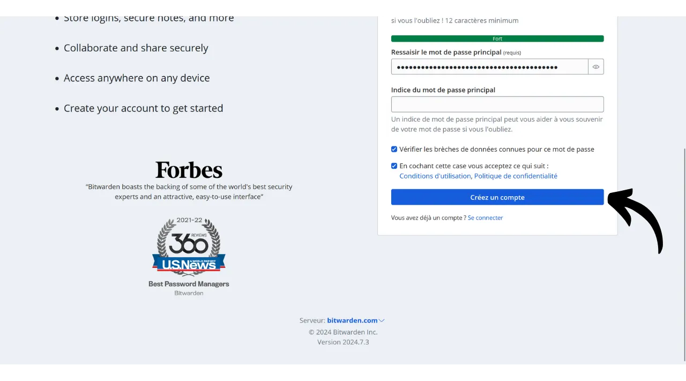
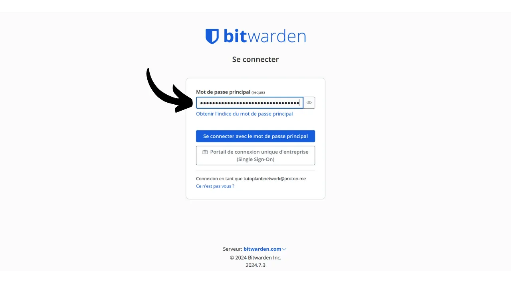
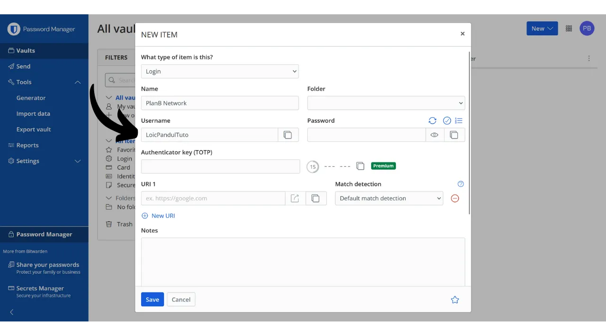
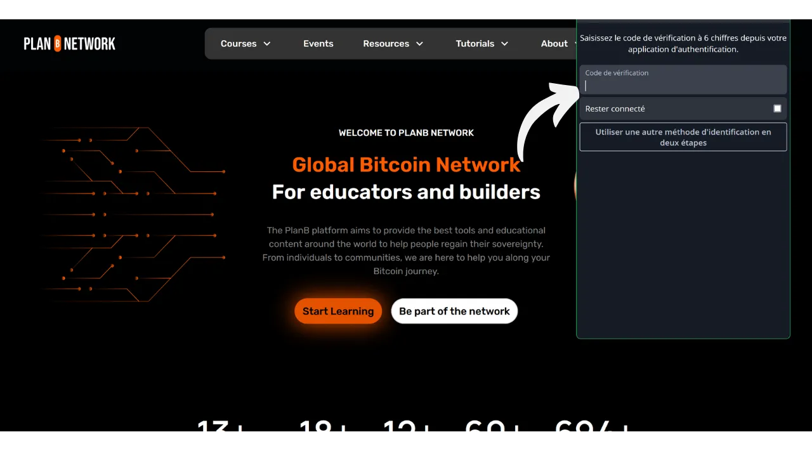

Digitaalisella aikakaudella meidän täytyy hallinnoida lukuisia verkkotilejä, jotka kattavat eri osa-alueita päivittäisessä elämässämme, mukaan lukien pankkiasiat, talousalustat, sähköpostit, tiedostojen tallennus, terveys, hallinto, sosiaaliset verkostot, videopelit jne.

Tunnistautuaksemme kullakin näistä tileistä käytämme tunnistetta, usein sähköpostiosoitetta, johon liittyy salasana. Ainutlaatuisten salasanojen suuren määrän muistamisen mahdottomuuden edessä saatetaan houkutella käyttämään samaa salasanaa uudelleen tai hieman muokata yhteistä perustaa, jotta se olisi helpompi muistaa. Kuitenkin nämä käytännöt vakavasti vaarantavat tiliesi turvallisuuden.

Ensimmäinen periaate salasanojen osalta on, ettei niitä tulisi käyttää uudelleen. Jokaisen verkkotilin tulisi olla suojattu ainutlaatuisella salasanalla, joka on täysin erillinen muista. Tämä on tärkeää, koska jos hyökkääjä onnistuu murtamaan yhden salasanasi, et halua heidän pääsevän käsiksi kaikkiin tileihisi. Ainutlaatuisen salasanan käyttäminen kullakin tilillä eristää mahdolliset hyökkäykset ja rajoittaa niiden vaikutusaluetta. Esimerkiksi, jos käytät samaa salasanaa videopelialustalla ja sähköpostissasi, ja kyseinen salasana murretaan phishing-sivuston kautta liittyen pelialustaan, hyökkääjä voisi sitten helposti päästä käsiksi sähköpostiisi ja ottaa hallintaansa kaikki muut verkkotilisi.

Toinen olennainen periaate on salasanan vahvuus. Salasanaa pidetään vahvana, jos sitä on vaikea murtaa brute force -menetelmällä, eli arvaamalla kokeilun ja erehdyksen kautta. Tämä tarkoittaa, että salasanasi tulee olla mahdollisimman satunnaisia, pitkiä ja sisältää erilaisia merkkejä (pienet kirjaimet, isot kirjaimet, numerot ja symbolit).

Näiden kahden salasanaturvallisuuden periaatteen (ainutlaatuisuus ja vahvuus) soveltaminen arkielämässä voi osoittautua vaikeaksi, sillä on lähes mahdotonta muistaa ainutlaatuista, satunnaista ja vahvaa salasanaa kaikille tileillemme. Tässä kohtaa salasananhallintaohjelma astuu kuvaan.

Salasananhallintaohjelma luo ja tallentaa turvallisesti vahvoja salasanoja, mahdollistaen pääsyn kaikkiin verkkotileihisi ilman, että sinun tarvitsee muistaa niitä yksitellen. Sinun tarvitsee muistaa vain yksi salasana, pääsalasana, joka antaa sinulle pääsyn kaikkiin tallennettuihin salasanoihisi hallintaohjelmassa. Salasananhallintaohjelman käyttö parantaa verkkoturvallisuuttasi, koska se estää salasanojen uudelleenkäytön ja luo järjestelmällisesti satunnaisia salasanoja. Mutta se myös yksinkertaistaa päivittäistä tilien käyttöäsi keskittämällä pääsyn arkaluonteisiin tietoihisi.
Tässä oppaassa tutkimme, kuinka ottaa käyttöön ja käyttää salasananhallintaohjelmaa parantaaksemme verkkoturvallisuuttasi. Esittelen sinulle Bitwardenin, ja toisessa oppaassa tutustumme toiseen ratkaisuun nimeltä KeePass.
https://planb.network/tutorials/others/keepass

Varoitus: Salasananhallintaohjelma on loistava salasanojen tallentamiseen, mutta **sinun ei koskaan tulisi tallentaa Bitcoin-lompakkosi mnemonic-lausetta siihen!** Muista, että mnemonic-lause tulee tallentaa yksinomaan fyysiseen muotoon, kuten paperille tai metallille.

## Bitwardenin esittely

Bitwarden on salasananhallintaohjelma, joka soveltuu sekä aloittelijoille että edistyneille käyttäjille. Se tarjoaa lukuisia etuja. Ensinnäkin, Bitwarden on monialustainen ratkaisu, mikä tarkoittaa, että voit käyttää sitä mobiilisovelluksena, verkkosovelluksena, selainlaajennuksena ja työpöytäohjelmistona.

Bitwarden mahdollistaa salasanojesi tallentamisen verkossa ja synkronoinnin kaikkien laitteidesi välillä, samalla varmistaen päästä päähän -salauksen pääsalasanasi avulla. Tämä mahdollistaa esimerkiksi salasanojesi käytön sekä tietokoneellasi että älypuhelimellasi, synkronoinnin näiden kahden välillä. Koska salasanasi ovat salattuja, ne pysyvät saavuttamattomissa keneltäkään, myös Bitwardenilta, ilman salauksen purkuavainta, joka on pääsalasanasi.
Lisäksi Bitwarden on avoimen lähdekoodin ohjelmisto, mikä tarkoittaa, että riippumattomat asiantuntijat voivat tarkastaa ohjelmiston. Hinnaston osalta Bitwarden tarjoaa kolme suunnitelmaa:
- Ilmainen versio, jota tutkimme tässä oppaassa. Vaikka se on ilmainen, se tarjoaa turvallisuustason, joka vastaa maksullisia versioita. Voit tallentaa rajattoman määrän salasanoja ja synkronoida niin monta laitetta kuin haluat;
- Premium-versio 10 dollarilla vuodessa, joka sisältää lisäominaisuuksia, kuten tiedostotallennuksen, pankkikortin varmuuskopioinnin, mahdollisuuden asettaa 2FA fyysisellä turva-avaimella ja pääsyn TOTP 2FA -autentikointiin suoraan Bitwardenin kautta;
- Ja perhesuunnitelma 40 dollarilla vuodessa, joka laajentaa premium-version etuja kuuteen eri käyttäjään.

Mielestäni nämä hinnat ovat kohtuullisia. Ilmainen versio on erinomainen vaihtoehto aloittelijoille, ja premium-versio tarjoaa erittäin hyvän vastineen rahalle verrattuna muihin markkinoilla oleviin salasananhallintaohjelmiin, tarjoten lisäksi enemmän ominaisuuksia. Lisäksi se, että Bitwarden on avoimen lähdekoodin, on merkittävä etu. Siksi se on mielenkiintoinen kompromissi, erityisesti aloittelijoille.
Toinen Bitwardenin ominaisuus on mahdollisuus itse isännöidä salasananhallintaohjelmaasi, jos omistat esimerkiksi NAS:n kotona. Tämän konfiguraation asettamisen myötä salasanasi eivät ole tallennettuina Bitwardenin palvelimille, vaan omille palvelimillesi. Tämä antaa sinulle täyden kontrollin salasanojesi saatavuudesta. Tämä vaihtoehto vaatii kuitenkin huolellista varmuuskopiointien hallintaa välttääkseen pääsyn menettämisen. Siksi Bitwardenin itseisännöinti sopii paremmin edistyneille käyttäjille, ja käsittelemme sitä toisessa oppaassa.
## Kuinka luoda Bitwarden-tili?

Vieraile [Bitwardenin verkkosivustolla](https://bitwarden.com/) ja klikkaa "*Aloita*".

Aloita syöttämällä sähköpostiosoitteesi sekä nimesi tai nimimerkkisi.

Seuraavaksi sinun tulee asettaa pääsalasanasi. Kuten johdannossa näimme, tämä salasana on erittäin tärkeä, koska se antaa sinulle pääsyn kaikkiin muihin tallennettuihin salasanoihisi hallinnassa. Siinä on kaksi pääasiallista riskiä: katoaminen ja kompromisoituminen. Jos menetät pääsyn tähän salasanaan, et enää pääse käsiksi kaikkiin tunnuksiisi. Jos salasanasi varastetaan, hyökkääjä pääsee käsiksi kaikkiin tileihisi.

Menetyksen riskin minimoimiseksi suosittelen tekemään fyysisen varmuuskopion pääsalasanastasi paperille ja säilyttämään sen turvallisessa paikassa. Jos mahdollista, sinetöi tämä varmuuskopio turvallisessa kirjekuoressa säännöllisesti varmistaaksesi, ettei kukaan muu ole päässyt siihen käsiksi.

Pääsalasanasi kompromisoitumisen estämiseksi sen on oltava erittäin vahva. Sen tulisi olla mahdollisimman pitkä, käyttää laajaa valikoimaa merkkejä ja valita satunnaisesti. Vuonna 2024 turvallisen salasanan vähimmäissuositukset ovat 13 merkkiä, mukaan lukien numerot, pienet ja suuret kirjaimet sekä symbolit, edellyttäen, että salasana on todella satunnainen. Suosittelen kuitenkin valitsemaan vähintään 20 merkin pituisen salasanan, joka sisältää kaikki mahdolliset merkkityypit, varmistaaksesi sen turvallisuuden pidemmän aikaa.

Syötä pääsalasanasi omistettuun kenttään ja vahvista se seuraavassa kentässä.

Jos haluat, voit lisätä vihjeen pääsalasanallesi. Kuitenkin neuvon olemaan tekemättä niin, koska vihje ei tarjoa luotettavaa menetelmää palauttaa salasanaa, jos menetät sen, ja se voi jopa olla hyödyllinen hyökkääjille, jotka yrittävät arvata tai murtaa salasanasi voimakeinolla. Yleisenä sääntönä vältä julkisten vihjeiden luomista, jotka voivat vaarantaa pääsalasanasi turvallisuuden.

Sen jälkeen klikkaa "*Luo tili*" -painiketta.

Voit nyt kirjautua uuteen Bitwarden-tiliisi. Syötä sähköpostiosoitteesi.

Kirjoita sitten pääsalasanasi.

Olet nyt salasananhallintasi verkkokäyttöliittymässä.

## Kuinka Bitwarden asetetaan?

Aloitamme vahvistamalla sähköpostiosoitteemme. Klikkaa "*Lähetä sähköposti*" -painiketta.

Klikkaa sitten sähköpostilla saamaasi painiketta.

Lopuksi, kirjaudu sisään uudelleen.

Ennen kaikkea, suosittelen vahvasti kaksivaiheisen tunnistautumisen (2FA) asettamista salasananhallintaasi varten. Voit valita käyttöösi joko TOTP-sovelluksen tai fyysisen turva-avaimen. Aktivoimalla 2FA:n, joka kerta kun kirjaudut Bitwarden-tilillesi, sinulta kysytään paitsi pääsalasanaasi myös toisen tekijän todentamista. Tämä on lisäkerroksen turvallisuutta, erityisen hyödyllinen, jos pääsalasanasi paperivarmuuskopio on vaarantunut.

Jos et ole varma, kuinka asettaa ja käyttää näitä 2FA-laitteita, suosittelen seuraamaan näitä kahta muuta opasta:

https://planb.network/tutorials/others/authy

https://planb.network/tutorials/others/security-key

Tehdäksesi tämän, mene "*Turvallisuus*" -välilehteen "*Asetukset*" -valikossa.

Klikkaa sitten "*Kaksivaiheinen kirjautuminen*" -välilehteä.

Täällä voit valita haluamasi 2FA-menetelmän. Esimerkiksi valitsen 2FA:n TOTP-sovelluksella klikkaamalla "*Hallitse*" -painiketta.

Vahvista pääsalasanasi.

Skannaa sitten QR-koodi 2FA-sovelluksellasi.

Syötä 2FA-sovelluksessasi näkyvä 6-numeroinen koodi, ja klikkaa sitten "*Ota käyttöön*" -painiketta. 
Kaksivaiheinen tunnistautuminen on nyt onnistuneesti asetettu tilillesi.

Nyt, jos yrität kirjautua uudelleen hallintaasi, sinun on ensin syötettävä pääsalasanasi ja sitten dynaaminen 6-numeroinen koodi, jonka 2FA-sovelluksesi luo. Varmista, että sinulla on aina pääsy tähän dynaamiseen koodiin; ilman sitä et pysty palauttamaan salasanojasi.

Asetuksissa sinulla on myös mahdollisuus mukauttaa hallintaasi "*Asetukset*" -välilehdessä. Täällä voit muuttaa aikaa ennen kuin hallintasi lukittuu automaattisesti, sekä käyttöliittymän kieltä ja teemaa.
Suosittelen vahvasti, että muutat Bitwardenilla luotujen salasanojen pituutta. Oletusarvoisesti pituus on asetettu 14 merkkiin, mikä voi olla riittämätön optimaalisen turvallisuuden kannalta. Nyt kun sinulla on hallintaohjelma muistamaan kaikki salasanasi, kannattaa hyödyntää sitä käyttämällä erittäin vahvoja salasanoja.

Tätä varten siirry "*Generator*" -valikkoon.

Täällä voit lisätä salasanojesi pituuden 40 merkkiin ja valita ruudun, joka sisältää symbolit.

## Kuinka turvata tilisi Bitwardenin avulla?

Nyt kun salasananhallintaohjelmasi on määritetty, voit alkaa tallentamaan tunnisteita verkkotileillesi. Lisätäksesi uuden kohteen, klikkaa suoraan "*New item*" -nappia tai "*New*" -nappia, joka sijaitsee näytön oikeassa yläkulmassa, ja sitten "*item*".

Avautuvassa lomakkeessa aloita määrittelemällä tallennettavan kohteen luonne. Kirjautumistunnisteiden tallentamiseksi valitse pudotusvalikosta "*Login*" -vaihtoehto.

"*Name*" -kenttään syötä kuvaava nimi tunnisteillesi. Tämä helpottaa salasanojen etsimistä ja järjestämistä, erityisesti jos sinulla on niitä suuri määrä. Esimerkiksi, jos haluat tallentaa tunnisteesi PlanB Network -sivustolle, voit nimetä tämän kohteen tavalla, joka tekee siitä heti tunnistettavan tulevissa hauissasi.

"*Folder*" -vaihtoehto mahdollistaa tunnisteidesi luokittelun kansioihin. Toistaiseksi emme ole vielä luoneet yhtään, mutta näytän myöhemmin, miten se tehdään.

"*Username*" -kenttään syötä käyttäjänimesi, joka on yleensä sähköpostiosoitteesi. 
Seuraavaksi "*Password*" -kenttään voit syöttää salasanasi. Suosittelen kuitenkin vahvasti, että annat Bitwardenin luoda sinulle pitkän, satunnaisen ja uniikin salasanan. Tämä varmistaa, että sinulla on vahva salasana. Käyttääksesi tätä ominaisuutta, klikkaa kentän yläpuolella olevaa kaksinuolikuvaketta.

Näet, että salasanasi on luotu.

"*URI 1*" -kenttään voit syöttää verkkosivuston verkkotunnuksen.

Ja lopuksi "*Notes*" -kenttään voit lisätä tarvittaessa lisätietoja.

Kun olet täyttänyt kaikki nämä kentät, klikkaa "*Save*" -nappia.

Tunnisteesi näkyy nyt Bitwarden-hallintasovelluksessasi.

Klikkaamalla sitä, voit päästä käsiksi sen tietoihin ja muokata niitä.

Klikkaamalla oikealla olevia kolmea pientä pistettä, pääset nopeasti kopioimaan salasanan tai tunnisteen.

Onnittelut, olet onnistuneesti tallentanut ensimmäisen salasanasi hallintaohjelmaasi! Jos haluat järjestää tunnisteitasi paremmin, voit luoda erityisiä kansioita. Tehdäksesi tämän, klikkaa "*Uusi*" -painiketta, joka sijaitsee näytön oikeassa yläkulmassa, ja valitse sitten "*Kansio*". 
Anna kansion nimelle nimi.

Klikkaa sitten "*Tallenna*".

Kansiosi näkyy nyt hallintaohjelmassasi.

Voit määrittää kansion tunnisteelle luodessasi sitä, kuten aiemmin teimme, tai muokkaamalla olemassa olevaa tunnistetta. Esimerkiksi klikkaamalla PlanB Network -tunnistettani, voin sitten päättää luokitella sen "*Bitcoin*" -kansioon.

Näin voit rakentaa salasanojen hallintaohjelmasi rakenteen, jotta tunnisteiden löytäminen helpottuu. Voit järjestää ne kansioihin, kuten henkilökohtaiset, ammatilliset, pankit, sähköpostit, sosiaaliset verkostot, tilaukset, ostokset, hallinto, suoratoisto, tallennus, matkailu, terveys jne.
Jos haluat käyttää vain Bitwardenin verkkoversiota, se on täysin mahdollista. Suosittelen tällöin lisäämään salasanojen hallintaohjelmasi selaimen suosikkeihin helpon pääsyn varmistamiseksi ja phishing-riskien välttämiseksi. Bitwarden tarjoaa kuitenkin myös kattavan valikoiman asiakasohjelmia, joiden avulla voit käyttää hallintaohjelmaasi eri laitteilla ja yksinkertaistaa sen päivittäistä käyttöä. He tarjoavat erityisesti mobiilisovelluksen, selainlaajennuksen ja työpöytäohjelmiston. Katsotaan, miten ne asennetaan yhdessä.

## Kuinka käyttää Bitwarden-selainlaajennusta?

Voit ensin asentaa selainlaajennuksen, jos haluat. Tämä laajennus toimii hallintaohjelmasi supistettuna versiona ja tarjoaa sinulle mahdollisuuden automaattisesti tallentaa uusia salasanoja, generoida ehdotuksia turvallisille salasanoille ja automaattisesti täyttää tunnistetietosi verkkosivujen kirjautumissivuilla.

Tämän laajennuksen päivittäinen käyttö on erittäin kätevää, mutta se voi myös avata uusia hyökkäysvektoreita. Jotkut kyberturvallisuusasiantuntijat neuvovatkin siksi välttämään salasanojen hallintaohjelmien selainlaajennusten käyttöä. Jos kuitenkin päätät käyttää Bitwarden-laajennusta, tässä on ohjeet:

Aloita menemällä [viralliselle Bitwarden-lataussivulle](https://bitwarden.com/download/#downloads-web-browser).

Valitse selain luettelosta. Esimerkissäni käytän Firefoxia, joten minut ohjataan viralliseen Bitwarden-laajennukseen Firefoxin lisäosakaupassa. Menettely on melko samanlainen muille selaimille.

Klikkaa "*Lisää Firefoxille*" -painiketta.

Voit sitten kiinnittää Bitwardenin laajennuspalkkiisi helposti saataville. Kirjaudu klikkaamalla laajennusta.

Syötä sähköpostiosoitteesi.

Syötä sitten pääsalasanasi.

Ja lopuksi, syötä 6-numeroinen koodi todennussovelluksestasi.

Olet nyt yhdistänyt Bitwarden-hallintaohjelmaasi selainlaajennuksen kautta.

Esimerkiksi, jos palaan PlanB Network -sivustolle ja yritän kirjautua tililleni, voit nähdä, että selaimeseen integroitu Bitwarden-laajennus tunnistaa kirjautumiskentät ja tarjoaa automaattisesti valittavakseni aiemmin tallentamani tunnisteen.

Jos valitsen tämän tunnisteen, Bitwarden täyttää kirjautumiskentät puolestani. Tämän laajennuksen ominaisuus mahdollistaa nopean yhteyden muodostamisen verkkosivustoille ilman, että tunnistetietoja tarvitsee kopioida ja liittää Bitwardenin verkkosovelluksesta tai ohjelmistosta.

Laajennus on myös suunniteltu havaitsemaan uusien tilien luomisen. Esimerkiksi luodessani uutta tiliä PlanB Networkissa, Bitwarden ehdottaa automaattisesti uuden tunnisteen tallentamista.

Napsauttamalla tätä ilmestyvää ehdotusta, laajennus avautuu. Se mahdollistaa minun syöttää uuden tunnisteen tiedot ja luoda vahvan, uniikin salasanan.

Tiedot täytettyäni ja napsautettuani "*Tallenna*", laajennus tallentaa tunnistetiedot.

Tämän jälkeen laajennus täyttää automaattisesti tunnistetietomme asianmukaisiin kenttiin verkkosivustolla.

## Kuinka käyttää Bitwarden-ohjelmistoa?

Bitwarden-työpöytäohjelmiston asentamiseksi aloita siirtymällä [lataussivulle](https://bitwarden.com/download/#downloads-desktop). Valitse ja lataa käyttöjärjestelmääsi vastaava versio.

Latauksen valmistuttua jatka ohjelmiston asentamista tietokoneellesi. Bitwarden-ohjelmiston ensimmäisellä käynnistyskerralla sinun tulee syöttää tunnistetietosi avataksesi salasananhallintasi.

Tämän jälkeen saavut hallintasi kotisivulle. Käyttöliittymä on lähes sama kuin verkkosovelluksessa.

## Kuinka käyttää Bitwarden-sovellusta?

Päästäksesi käsiksi salasanoihisi puhelimellasi, voit asentaa Bitwarden-mobiilisovelluksen. Aloita siirtymällä [lataussivulle](https://bitwarden.com/download/#downloads-mobile) ja käytä älypuhelintasi skannaamaan käyttöjärjestelmääsi vastaava QR-koodi.

Lataa ja asenna virallinen Bitwarden-mobiilisovellus. Sovelluksen ensimmäisellä avaamiskerralla syötä tunnistetietosi avataksesi pääsyn salasananhallintaasi.

Yhdistettyäsi voit tarkastella ja hallinnoida kaikkia salasanojasi suoraan sovelluksesta.

Sovelluksesi turvallisuuden lisäämiseksi neuvon sinua menemään asetuksiin ja aktivoimaan PIN-suojauksen. Tämä lisää ylimääräisen turvakerroksen puhelimen katoamisen tai varkauden varalta.

## Kuinka varmuuskopioida Bitwarden?
Jotta et koskaan menettäisi pääsyä salasanoihisi, vaikka unohtaisit pääsalasanasi tai Bitwardenin palvelimiin kohdistuisi katastrofi, neuvon sinua säännöllisesti suorittamaan salatun varmuuskopion hallinnastasi ulkoiselle medialle.
Ajatuksena on salata kaikki Bitwarden-tunnuksesi salasanalla, joka on eri kuin pääsalasanasi, ja tallentaa tämä salattu varmuuskopio USB-tikulle tai kovalevylle, jonka pidät esimerkiksi kotona. Voit sitten säilyttää fyysisen kopion salauksen purkusalasanasta eri paikassa kuin missä varmuuskopiointiväline on säilytetty. Esimerkiksi, voit pitää USB-tikkua kotona ja uskoa fyysisen kopion salauksen purkusalasanasta luotettavan ystävän haltuun.

Tämä menetelmä varmistaa, että vaikka varmuuskopiointiväline varastettaisiin, tietosi pysyisivät saavuttamattomissa ilman salauksen purkusalasanaa. Samoin ystäväsi ei pystyisi pääsemään tietoihisi ilman fyysistä välinettä.

Kuitenkin, ongelmatilanteessa, voit käyttää salasanaa ja ulkoista välinettä päästäksesi uudelleen käsiksi tunnuksiisi, riippumatta Bitwardenista. Näin ollen, vaikka Bitwardenin palvelimet tuhoutuisivat, sinulla olisi silti mahdollisuus palauttaa salasanasi.

Siksi neuvon sinua suorittamaan nämä varmuuskopiot säännöllisesti, jotta ne aina sisältävät uusimmat tunnuksesi. Jotta et vaivaisi ystävääsi, joka pitää salauksen purkusalasanan kopiota, jokaisen uuden varmuuskopion yhteydessä, voit tallentaa tämän salasanan salasananhallintaohjelmaasi. Tämä ei ole tarkoitettu varmuuskopioksi, koska ystävälläsi on jo fyysinen kopio, vaan pikemminkin yksinkertaistamaan tulevia vientimenettelyjäsi.

Viedäksesi tiedot, se on melko yksinkertaista: siirry Bitwarden-hallintasi "*Työkalut*" -osioon, ja valitse sitten "*Vie tallelokero*".

Muodoksi valitse "*.json (Salattu)*".

Valitse sitten "*Salasanasuojattu*" -vaihtoehto.

Tässä on tärkeää valita vahva, ainutlaatuinen ja satunnaisesti generoitu salasana varmuuskopion salaamiseen. Tämä varmistaa, että vaikka salattu varmuuskopiosi varastettaisiin, hyökkääjän olisi mahdotonta murtaa sitä voimakeinolla.

Napsauta "*Vahvista muoto*" ja syötä pääsalasanasi jatkaaksesi viennin kanssa.

Kun vienti on valmis, löydät salatun varmuuskopiotiedostosi latauksistasi. Siirrä se turvalliseen ulkoiseen tallennuslaitteeseen, kuten USB-tikulle tai kovalevylle. Toista tämä toimenpide säännöllisesti käyttösi mukaan. Esimerkiksi, voit uusia varmuuskopion joka viikko tai joka kuukausi tarpeidesi mukaan.