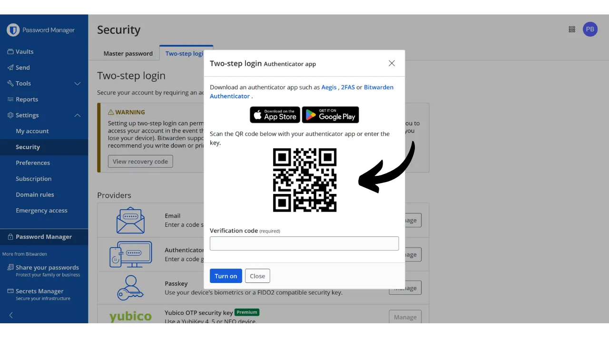
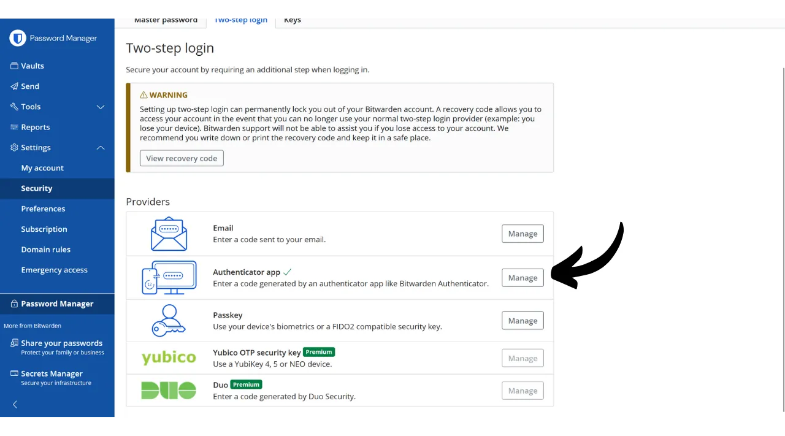
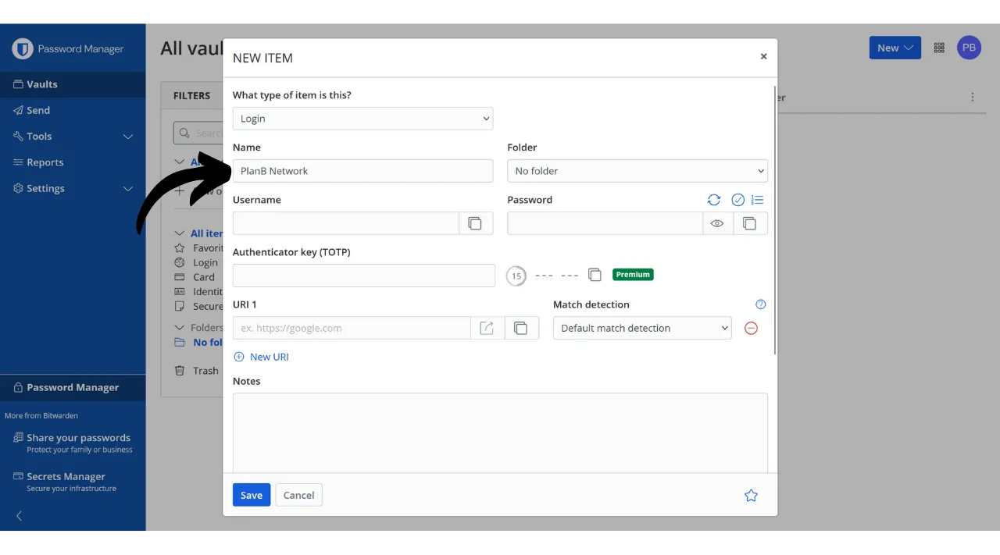
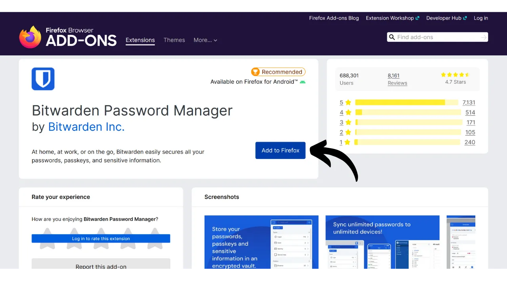
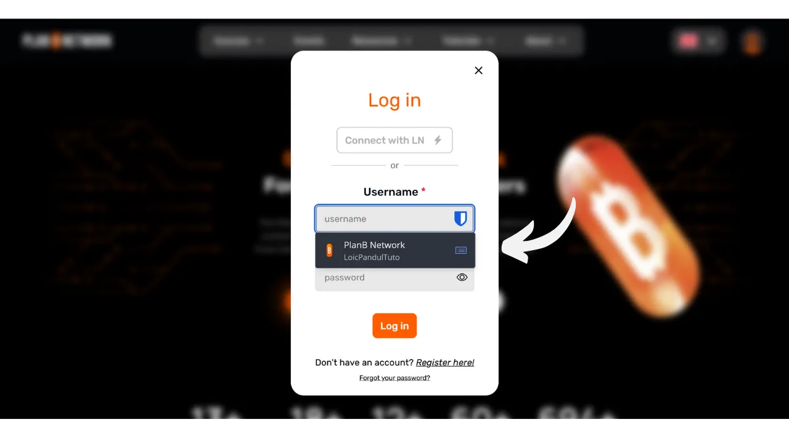
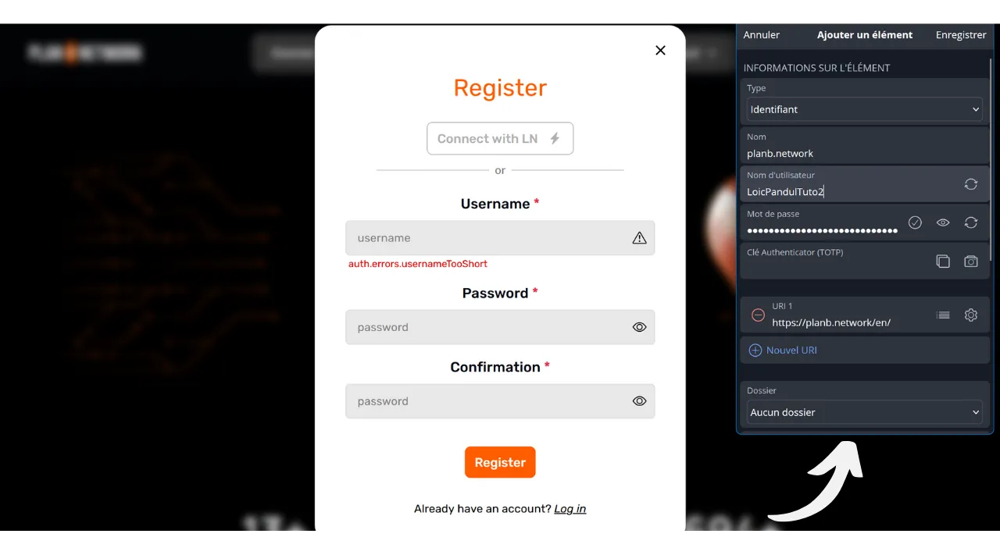

À l'ère numérique, nous devons gérer une multitude de comptes en ligne couvrant divers aspects de notre vie quotidienne, notamment la banque, les plateformes financières, les emails, le stockage de fichiers, la santé, l'administration, les réseaux sociaux, les jeux vidéo, etc.

Pour nous authentifier sur chacun de ces comptes, nous utilisons un identifiant, souvent une adresse email, accompagné d'un mot de passe. Face à l'impossibilité de mémoriser une grande quantité de mots de passe uniques, on peut être tenté de réutiliser le même mot de passe ou d'en modifier légèrement une base commune pour s'en rappeler facilement. Cependant, ces pratiques compromettent gravement la sécurité de vos comptes.

Le premier principe à suivre pour les mots de passe est de ne pas les réutiliser. Chaque compte en ligne devrait être protégé par un mot de passe unique et complètement distinct des autres. C'est important, car, si un attaquant parvient à compromettre un de vos mots de passe, vous ne voulez pas qu'il ait accès à l'ensemble de vos comptes. Avoir un mot de passe unique pour chaque compte isole les attaques potentielles et en limite la portée. Par exemple, si vous utilisez le même mot de passe pour une plateforme de jeux vidéos et pour votre boîte mail, et que ce mot de passe est compromis via un site de phishing lié à la plateforme de jeux, l'attaquant pourrait alors accéder facilement à votre messagerie et prendre le contrôle de tous vos autres comptes en ligne.

Le second principe essentiel est la force du mot de passe. Un mot de passe est considéré comme fort s'il est difficile à brute forcer, c'est-à-dire à trouver par tâtonnement. Cela signifie que vos mots de passe doivent être le plus aléatoires possible, longs, et inclure une diversité de caractères (minuscules, majuscules, chiffres et symboles).

Appliquer ces deux principes de sécurité des mots de passe (unicité et robustesse) peut s'avérer difficile au quotidien, car il est quasiment impossible de mémoriser un mot de passe unique, aléatoire et robuste pour tous nos comptes. C'est ici qu'intervient le gestionnaire de mots de passe.

Un gestionnaire de mots de passe génère et stocke de manière sécurisée des mots de passe forts, ce qui vous permet d'accéder à tous vos comptes en ligne sans nécessité de les mémoriser individuellement. Vous n'avez à retenir qu'un seul mot de passe, le mot de passe maître, qui vous donne accès à l'ensemble de vos mots de passe sauvegardés dans le gestionnaire. L'utilisation d'un gestionnaire de mots de passe renforce votre sécurité en ligne, car il évite la réutilisation de mots de passe et génère systématiquement des mots de passe aléatoires. Mais il va également simplifier votre utilisation quotidienne de vos comptes en centralisant l'accès à vos informations sensibles.

Dans ce tutoriel, nous allons découvrir comment configurer et utiliser un gestionnaire de mots de passe pour améliorer votre sécurité en ligne. Je vous propose ici d'étudier Bitwarden, et dans un autre tutoriel, nous découvrirons une autre solution appelée KeePass.

https://planb.network/tutorials/others/keepass

Attention : Un gestionnaire de mots de passe, c'est très bien pour enregistrer les mots de passe, mais **il ne faut surtout pas y enregistrer la phrase mnémonique de votre portefeuille Bitcoin !** Pour rappel, une phrase mnémonique doit être sauvegardée exclusivement sous un format physique, comme un bout de papier ou de métal.

## Présentation de Bitwarden

Bitwarden est un gestionnaire de mots de passe adapté aussi bien aux débutants qu'aux utilisateurs avancés. Il offre de nombreux avantages. Tout d'abord, Bitwarden est une solution multiplateforme, c'est-à-dire que vous pouvez l'utiliser sous forme d'application mobile, d'application web, d'extension de navigateur, et de logiciel pour ordinateur.

Bitwarden vous permet de sauvegarder vos mots de passe en ligne et de les synchroniser entre tous vos appareils, tout en garantissant un chiffrement de bout-en-bout avec votre mot de passe maître. Cela vous permet, par exemple, d'accéder à vos mots de passe aussi bien sur votre ordinateur que sur votre smartphone, avec une synchronisation entre les deux. Vos mots de passe étant chiffrés, ils restent inaccessibles à quiconque, y compris à Bitwarden, sans la clé de déchiffrement que constitue votre mot de passe maître.

De plus, Bitwarden est open-source, ce qui signifie que les logiciels peuvent être audités par des experts indépendants. Pour ce qui est des forfaits, Bitwarden propose trois tarifications :
- Une version gratuite que nous allons découvrir dans ce tutoriel. Bien qu'elle soit gratuite, elle offre un niveau de sécurisation équivalent à celui des versions payantes. Vous pouvez y enregistrer un nombre illimité de mots de passe et synchroniser autant d'appareils que vous le souhaitez ;
- Une version premium pour 10 $ par an qui inclut des fonctionnalités supplémentaires telles que le stockage de fichiers, la sauvegarde de cartes bancaires, la possibilité de configurer le 2FA avec une clé de sécurité physique, et l'accès à l'authentification 2FA TOTP directement avec Bitwarden ;
- Et un forfait famille à 40 $ par an qui étend les avantages de la version premium à six utilisateurs différents.

Selon moi, ces tarifs sont honnêtes. La version gratuite est une excellente option pour débuter, et la version premium offre un très bon rapport qualité-prix comparé à d'autres gestionnaires de mots de passe sur le marché, tout en proposant davantage de fonctionnalités. De plus, le fait que Bitwarden soit open-source constitue un atout majeur. C'est donc un compromis intéressant, notamment pour les débutants.

Une autre caractéristique de Bitwarden est la possibilité d'autohéberger votre gestionnaire de mots de passe si vous possédez, par exemple, un NAS chez vous. En mettant en place cette configuration, vos mots de passe ne sont pas stockés sur les serveurs de Bitwarden, mais sur vos propres serveurs. Cela vous offre un contrôle total sur la disponibilité de vos mots de passe. Toutefois, cette option exige une gestion rigoureuse des sauvegardes pour éviter toute perte d'accès. L'autohébergèrent de Bitwarden s'adresse donc davantage aux utilisateurs avancés, et nous en parlerons donc dans un autre tutoriel.

## Comment créer un compte Bitwarden ?

Rendez-vous sur [le site de Bitwarden](https://bitwarden.com/) et cliquez sur "Get Started".

Commencez par renseigner votre adresse email ainsi que votre nom ou pseudo.

Ensuite, vous allez devoir définir votre mot de passe maître. Comme nous l'avons vu dans l'introduction, ce mot de passe est très important, car il vous donne accès à tous vos autres mots de passe sauvegardés sur le gestionnaire. Il présente alors deux principaux risques : la perte et la compromission. Si vous perdez l'accès à ce mot de passe, vous ne pourrez plus accéder à l'intégralité de vos identifiants. Si vous vous faites voler ce mot de passe, l'attaquant pourra accéder à l'intégralité de vos comptes. 

Pour minimiser le risque de perte, je recommande de faire une sauvegarde physique de votre mot de passe maître sur du papier et de la stocker en lieu sûr. Si possible, scellez cette sauvegarde dans une enveloppe sécurisée pour vous assurer régulièrement que personne d'autre n'y a accédé.

Pour prévenir la compromission de votre mot de passe maître, celui-ci doit être extrêmement robuste. Il doit être le plus long possible, utiliser une grande diversité de caractères, et être choisi de manière aléatoire. En 2024, les recommandations minimales pour un mot de passe sécurisé sont de 13 caractères en incluant des chiffres, des lettres minuscules et majuscules, ainsi que des symboles, à condition que le mot de passe soit réellement aléatoire. Toutefois, je vous recommande d'opter pour un mot de passe d'au moins 20 caractères, comprenant tous types de caractères possibles, pour garantir sa sécurité plus longtemps.

Entrez votre mot de passe maître dans la case dédiée et confirmez-le dans la case suivante.

Si vous le souhaitez, vous pouvez ajouter un indice pour votre mot de passe maître. Toutefois, je vous déconseille de le faire, car l'indice n'offre pas une méthode fiable de récupération en cas de perte du mot de passe et pourrait même se révéler utile à des attaquants cherchant à deviner ou à brute forcer votre mot de passe. En règle générale, évitez de créer des indices publics qui pourraient compromettre la sécurité de votre mot de passe maître.

Cliquez ensuite sur le bouton "Créez un compte".

Vous pouvez maintenant vous connecter à votre nouveau compte Bitwarden. Entrez votre adresse email.

Puis tapez votre mot de passe maître.

Vous êtes dorénavant sur l'interface web de votre gestionnaire de mot de passe.

## Comment configurer Bitwarden ?

Pour commencer, nous allons confirmer notre adresse email. Cliquez sur "Envoyer le courriel".

Puis cliquez sur le bouton reçu par email.

Enfin, connectez-vous de nouveau.

Avant toute chose, je vous conseille fortement de mettre en place l'authentification à deux facteurs (2FA) pour sécuriser votre gestionnaire de mot de passe. Vous avez le choix entre utiliser une application de TOTP ou une clé de sécurité physique. En activant le 2FA, à chaque fois que vous vous connecterez à votre compte Bitwarden, il vous sera demandé non seulement votre mot de passe maître, mais aussi une preuve de votre second facteur d'authentification. C'est donc une couche de sécurité supplémentaire, particulièrement utile dans l'éventualité où votre sauvegarde papier du mot de passe maître serait compromise.

Si vous ne savez pas comment mettre en place et utiliser ces dispositifs de 2FA, je vous conseille de suivre ces 2 autres tutoriels :

https://planb.network/tutorials/others/authy

https://planb.network/tutorials/others/security-key

Pour ce faire, allez dans l'onglet "Security" dans le menu "Settings".

Puis cliquet sur l'onglet "Two-step login".

Ici, vous pouvez choisir la méthode de 2FA que vous préférez. Pour l'exemple, je vais choisir le 2FA avec une application TOTP en cliquant sur le bouton "Manage".

Confirmez votre mot de passe maître.

Puis scannez le QR code avec votre application de 2FA.

Entrez le code à 6 chiffres noté sur votre application de 2FA, puis cliquez sur le bouton "Turn on".

La double authentification a bien été mise en place sur votre compte.

Maintenant, si vous tentez de vous reconnecter à votre gestionnaire, vous devrez d'abord saisir votre mot de passe maître, puis le code dynamique à 6 chiffres généré par votre application de 2FA. Assurez-vous de toujours avoir accès à ce code dynamique ; sans lui, il vous sera impossible de récupérer vos mots de passe.

Dans les paramètres, vous avez également la possibilité de personnaliser votre gestionnaire dans l'onglet "Preferences". Vous pouvez y modifier la durée avant que votre gestionnaire ne se verrouille automatiquement, ainsi que la langue et le thème de l'interface.

Je vous recommande fortement d'ajuster la longueur des mots de passe générés par Bitwarden. Par défaut, la longueur est fixée à 14 caractères, ce qui peut être insuffisant pour une sécurité optimale. Maintenant que vous avez un gestionnaire pour retenir tous vos mots de passe, autant en profiter pour utiliser des mots de passe très forts.

Pour cela, rendez-vous dans le menu "Generator".

Ici, vous pouvez passer la valeur de la longueur de vos mots de passe à 40, et cocher la case pour y inclure des symboles.

## Comment sécuriser ses comptes avec Bitwarden ?

Maintenant que votre gestionnaire de mots de passe est configuré, vous pouvez commencer à y stocker les identifiants de vos comptes en ligne. Pour ajouter un nouvel élément, cliquez directement sur le bouton "New item" ou sur le bouton "New" situé en haut à droite de l'écran, puis sur "item".

Dans le formulaire qui s'ouvre, commencez par déterminer la nature de l'élément à enregistrer. Pour stocker des identifiants de connexion, choisissez l'option "Login" dans le menu déroulant.

Dans le champ "Name", saisissez un nom descriptif pour vos identifiants. Cela facilitera la recherche et l'organisation de vos mots de passe, surtout si vous en avez un grand nombre. Par exemple, si vous voulez enregistrer vos identifiants pour le site de PlanB Network, vous pouvez nommer cet élément de façon à ce qu'il soit immédiatement reconnaissable lors de vos futures recherches.

La case "Folder" vous permet de classer vos identifiants dans des dossiers. Pour le moment, nous n'en avons pas encore créé, mais je vous montrerai par la suite comment le faire.

Dans le champ "Username", saisissez votre nom d'utilisateur, qui est généralement votre adresse email.

Ensuite, dans la case "Password", vous pouvez saisir votre mot de passe. Toutefois, je vous recommande fortement de laisser Bitwarden générer un mot de passe long, aléatoire et unique à votre place. Cela vous garantit de disposer d'un mot de passe fort. Pour utiliser cette fonctionnalité, cliquez sur l'icône de double flèche au-dessus de la case à remplir.

Vous pouvez voir que votre mot de passe a été généré.

Dans la case "URI 1", vous pouvez entrer le nom de domaine du site web.

Et enfin, dans la case "Notes", vous pouvez ajouter des détails supplémentaires si nécessaire.

Lorsque vous avez terminé de remplir tous ces champs, cliquez sur le bouton "Save".

Votre identifiant apparait désormais dans votre gestionnaire Bitwarden.

En cliquant dessus, vous pouvez accéder à ses détails et les modifier.

En cliquant sur les trois petits points à droite, vous avez un accès rapide pour copier le mot de passe ou l'identifiant.

Félicitations, vous avez réussi à enregistrer votre premier mot de passe dans votre gestionnaire ! Si vous souhaitez mieux organiser vos identifiants, vous pouvez créer des dossiers spécifiques. Pour cela, cliquez sur le bouton "New" situé en haut à droite de l'écran, puis sélectionnez "Folder".

Entrez un nom pour votre dossier.

Puis cliquez sur "Save".

Votre dossier apparait désormais sur votre gestionnaire.

Vous pouvez attribuer un dossier à un identifiant lors de sa création, comme nous l'avons fait précédemment, ou en modifiant un identifiant existant. Par exemple, en cliquant sur mon identifiant pour PlanB Network, je peux ensuite choisir de le classer dans le dossier "Bitcoin".

Vous pouvez ainsi structurer votre gestionnaire de mots de passe pour faciliter la recherche de vos identifiants. Vous pouvez les organiser avec des dossiers tels que personnel, professionnel, banques, emails, réseaux sociaux, abonnements, shopping, administration, streaming, stockage, voyages, santé, etc.

Si vous préférez utiliser uniquement la version web de Bitwarden, il est tout à fait possible de s'en tenir là. Je vous recommande alors d'ajouter votre gestionnaire de mots de passe à vos favoris dans votre navigateur pour y accéder facilement et éviter les risques de phishing.

Néanmoins, Bitwarden offre également une gamme complète de clients vous permettant d'utiliser votre gestionnaire sur divers appareils et d'en simplifier l'utilisation quotidienne. Ils proposent notamment une application mobile, une extension de navigateur et un logiciel desktop. Voyons ensemble comment les configurer.

## Comment utiliser l'extension de navigateur Bitwarden ?

Tout d'abord, vous pouvez configurer l'extension de navigateur si vous le souhaitez. Cette extension fonctionne comme une version réduite de votre gestionnaire et vous offre la possibilité d'enregistrer automatiquement de nouveaux mots de passe, de générer des suggestions de mots de passe sécurisés, et de remplir automatiquement vos identifiants sur les pages de connexion des sites web.

L'utilisation quotidienne de cette extension est extrêmement pratique, mais elle peut également ouvrir de nouveaux vecteurs d'attaque. Certains experts en cybersécurité conseillent donc d'éviter les extensions de navigateur pour les gestionnaires de mots de passe. Toutefois, si vous choisissez d'utiliser l'extension Bitwarden, voici comment procéder :

Commencez par vous rendre sur [la page officielle de téléchargement de Bitwarden](https://bitwarden.com/download/#downloads-web-browser).

Choisissez votre navigateur dans la liste proposée. Pour cet exemple, j'utilise Firefox, donc je suis redirigé vers l'extension officielle Bitwarden sur le Firefox Add-ons Store. La procédure est assez similaire pour les autres navigateurs.

Cliquez sur le bouton "Add to Firefox".

Vous pouvez ensuite attacher Bitwarden à votre barre d'extensions pour y accéder facilement. Cliquez sur l'extension pour vous connecter.

Entrez votre adresse email.

Puis votre mot de passe maître.

Et enfin, renseignez le code à 6 chiffre de votre application d'authentification.

Vous êtes dorénavant connecté à votre gestionnaire Bitwarden depuis l'extension de navigateur.

Par exemple, si je retourne sur le site de PlanB Network et que je tente de me connecter à mon compte, on peut voir que l'extension Bitwarden intégrée au navigateur reconnaît les champs de connexion et me propose automatiquement de sélectionner l'identifiant que j'ai préalablement enregistré.

Si je sélectionne cet identifiant, Bitwarden remplit pour moi les champs de connexion. Cette fonctionnalité de l'extension permet de se connecter rapidement aux sites web, sans avoir besoin de copier-coller les identifiants depuis l'application web ou le logiciel Bitwarden.

L'extension est également conçue pour détecter les créations de nouveaux comptes. Par exemple, lors de la création d'un nouveau compte sur PlanB Network, Bitwarden me suggère automatiquement d'enregistrer le nouvel identifiant. 

En cliquant sur cette suggestion qui apparait, l'extension s'ouvre. Elle me permet de renseigner les détails du nouvel identifiant et de générer un mot de passe fort et unique.

Après avoir complété les informations et cliqué sur "Save", l'extension sauvegarde les identifiants.

Puis l'extension ajoute automatiquement nos identifiants dans les champs adaptés sur le site web.

## Comment utiliser le logiciel Bitwarden ?

Pour installer le logiciel desktop de Bitwarden, commencez par vous rendre sur [la page de téléchargement](https://bitwarden.com/download/#downloads-desktop). Sélectionnez et téléchargez la version correspondant à votre système d'exploitation.

Une fois le téléchargement terminé, procédez à l'installation du logiciel sur votre ordinateur. Au premier lancement du logiciel Bitwarden, vous devrez entrer vos identifiants pour déverrouiller votre gestionnaire de mots de passe.

Puis, vous arriverez sur la page d'accueil de votre gestionnaire. L'interface est presque la même que sur l'application web.

## Comment utiliser l'application Bitwarden ?

Pour accéder à vos mots de passe depuis votre téléphone, vous pouvez installer l'application mobile de Bitwarden. Commencez par vous rendre sur [la page de téléchargement](https://bitwarden.com/download/#downloads-mobile) et utilisez votre smartphone pour scanner le QR code correspondant à votre système d'exploitation.

Téléchargez et installez l'application mobile officielle de Bitwarden. À la première ouverture de l'application, entrez vos identifiants pour déverrouiller l'accès à votre gestionnaire de mots de passe.

Une fois connecté, vous pourrez consulter et gérer tous vos mots de passe directement depuis l'application.

Pour renforcer la sécurité de votre application, je vous conseille d'aller dans les paramètres et d'activer la protection par code PIN. Cela ajoutera une couche de sécurité supplémentaire en cas de perte ou de vol de votre téléphone.

## Comment faire une sauvegarde de Bitwarden ?

Pour être sûr de ne jamais perdre l'accès à vos mots de passe, même en cas de perte de votre mot de passe maître ou d'une catastrophe affectant les serveurs de Bitwarden, je vous conseille de réaliser régulièrement une sauvegarde chiffrée de votre gestionnaire sur un support externe.

L'idée est de venir chiffrer l'ensemble de vos identifiants Bitwarden avec un mot de passe différent de votre mot de passe maître et d'enregistrer cette sauvegarde chiffrée sur une clé USB ou un disque dur que vous conservez à votre domicile, par exemple. Vous pouvez ensuite conserver une copie physique du mot de passe de déchiffrement dans un endroit distinct de celui où se trouve le support de sauvegarde. Vous pourriez, par exemple, garder la clé USB chez vous et confier la copie physique du mot de passe de chiffrement à un ami de confiance.

Cette méthode assure que même si votre support de sauvegarde est volé, vos données resteront inaccessibles sans le mot de passe de déchiffrement. De même, votre ami ne pourra pas accéder à vos données sans posséder le support physique.

Cependant, en cas de problème, vous pouvez utiliser le mot de passe et le support externe pour récupérer l'accès à vos identifiants, indépendamment de Bitwarden. Ainsi, même si les serveurs de Bitwarden venaient à être détruits, vous auriez toujours la possibilité de retrouver vos mots de passe.

Je vous conseille donc d'effectuer ces sauvegardes régulièrement pour qu'elles incluent toujours vos identifiants les plus récents. Pour ne pas déranger votre ami, qui détient une copie du mot de passe de chiffrement, à chaque nouvelle sauvegarde, vous pouvez enregistrer ce mot de passe dans votre gestionnaire de mots de passe. Cela ne vise pas à en faire une sauvegarde, puisque votre ami détient déjà une copie physique, mais plutôt à simplifier vos futures procédures d'exportation.

Pour procéder à l'exportation, c'est assez simple : rendez-vous dans la section "Tools" de votre gestionnaire Bitwarden, puis sélectionnez "Export vault".

Pour le format, choisissez ".json (Encrypted)".

Sélectionnez ensuite l'option "Password protected".

Ici, il est important de choisir un mot de passe robuste, unique et généré de manière aléatoire pour chiffrer la sauvegarde. Cela garantit que, même en cas de vol de votre sauvegarde chiffrée, il sera impossible pour un attaquant de la déchiffrer par brute force.

Cliquez sur "Confirm format" et entrez votre mot de passe maître pour procéder à l'exportation.

Une fois l'exportation terminée, vous trouverez votre fichier de sauvegarde chiffrée dans vos téléchargements. Transférez-le sur un support externe sécurisé, tel qu'une clé USB ou un disque dur. Répétez cette opération de manière périodique en fonction de votre utilisation. Par exemple, vous pouvez renouveler la sauvegarde chaque semaine ou chaque mois, selon vos besoins.
