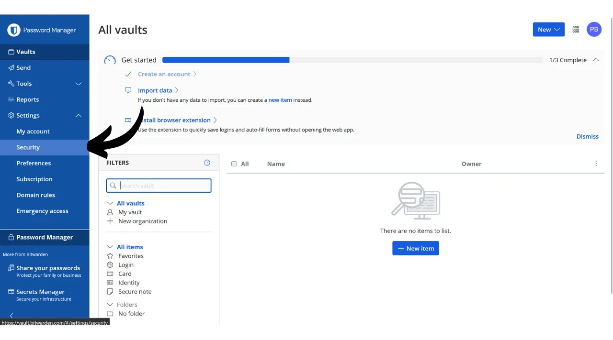
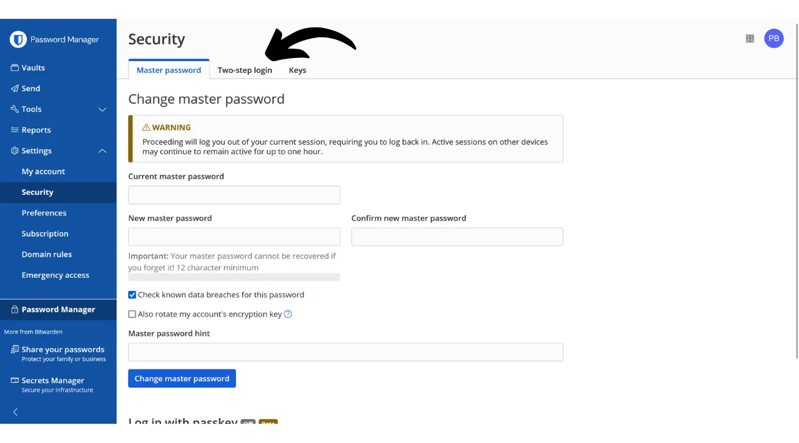
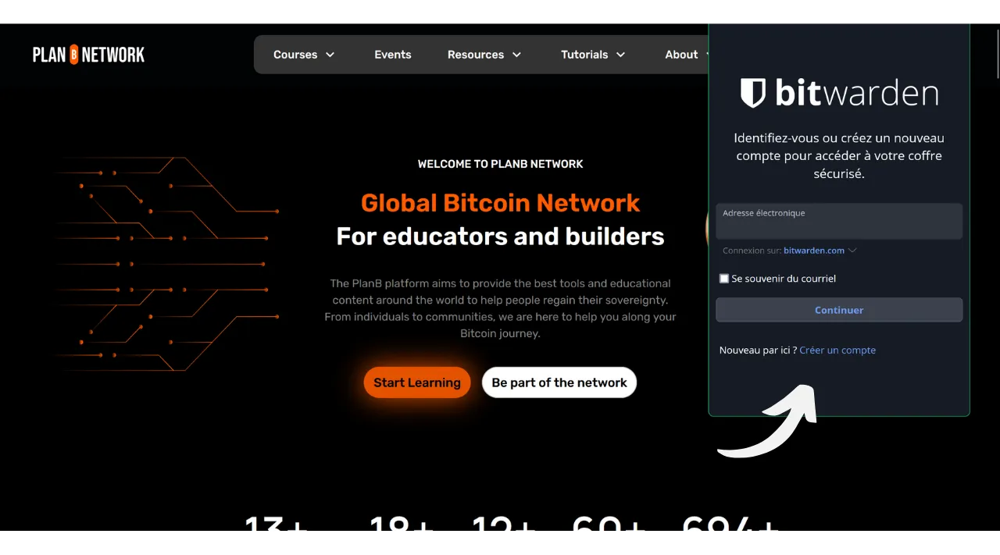

Di era digital, kita perlu mengelola berbagai akun online yang mencakup berbagai aspek kehidupan sehari-hari, termasuk perbankan, platform keuangan, email, penyimpanan file, kesehatan, administrasi, jejaring sosial, video game, dll.

Untuk mengautentikasi diri kita pada masing-masing akun ini, kita menggunakan pengenal, seringkali alamat email, yang disertai dengan kata sandi. Menghadapi ketidakmungkinan untuk mengingat sejumlah besar kata sandi unik, seseorang mungkin tergoda untuk menggunakan kata sandi yang sama atau sedikit memodifikasi basis umum untuk mengingatnya dengan mudah. Namun, praktik ini serius mengkompromikan keamanan akun Anda.

Prinsip pertama yang harus diikuti untuk kata sandi adalah tidak menggunakannya kembali. Setiap akun online harus dilindungi oleh kata sandi unik yang sepenuhnya berbeda dari yang lain. Ini penting karena, jika seorang penyerang berhasil mengkompromikan salah satu kata sandi Anda, Anda tidak ingin mereka memiliki akses ke semua akun Anda. Memiliki kata sandi unik untuk setiap akun mengisolasi serangan potensial dan membatasi lingkupnya. Misalnya, jika Anda menggunakan kata sandi yang sama untuk platform video game dan untuk email Anda, dan kata sandi tersebut dikompromikan melalui situs phishing yang terkait dengan platform game, penyerang kemudian dapat dengan mudah mengakses email Anda dan mengambil kendali atas semua akun online Anda yang lain.

Prinsip penting kedua adalah kekuatan kata sandi. Kata sandi dianggap kuat jika sulit untuk ditebak melalui coba-coba. Ini berarti kata sandi Anda harus seacak mungkin, panjang, dan mencakup berbagai karakter (huruf kecil, huruf besar, angka, dan simbol).

Menerapkan dua prinsip keamanan kata sandi ini (keunikan dan kekuatan) dapat terbukti sulit dalam kehidupan sehari-hari, karena hampir mustahil untuk mengingat kata sandi unik, acak, dan kuat untuk semua akun kita. Di sinilah manajer kata sandi berperan.

Manajer kata sandi menghasilkan dan menyimpan kata sandi yang kuat secara aman, memungkinkan Anda untuk mengakses semua akun online Anda tanpa perlu mengingatnya secara individu. Anda hanya perlu mengingat satu kata sandi, kata sandi utama, yang memberi Anda akses ke semua kata sandi yang disimpan dalam manajer. Menggunakan manajer kata sandi meningkatkan keamanan online Anda karena mencegah penggunaan kembali kata sandi dan secara sistematis menghasilkan kata sandi acak. Tetapi ini juga mempermudah penggunaan harian akun Anda dengan memusatkan akses ke informasi sensitif Anda.
Dalam tutorial ini, kita akan menjelajahi cara mengatur dan menggunakan manajer kata sandi untuk meningkatkan keamanan online Anda. Saya akan memperkenalkan Anda kepada Bitwarden, dan dalam tutorial lain, kita akan melihat solusi lain yang disebut KeePass.
https://planb.network/tutorials/others/keepass

Peringatan: Manajer kata sandi sangat baik untuk menyimpan kata sandi, tetapi **Anda seharusnya tidak pernah menyimpan frasa mnemonik dompet Bitcoin Anda di dalamnya!** Ingat, frasa mnemonik harus disimpan secara eksklusif dalam format fisik, seperti selembar kertas atau logam.

## Pengenalan ke Bitwarden

Bitwarden adalah manajer kata sandi yang cocok untuk pengguna pemula maupun lanjutan. Ini menawarkan banyak keuntungan. Pertama dan terutama, Bitwarden adalah solusi multi-platform, yang berarti Anda dapat menggunakannya sebagai aplikasi seluler, aplikasi web, ekstensi browser, dan perangkat lunak desktop.

Bitwarden memungkinkan Anda untuk menyimpan kata sandi Anda secara online dan menyinkronkannya di semua perangkat Anda, sambil memastikan enkripsi ujung-ke-ujung dengan kata sandi utama Anda. Ini memungkinkan Anda, misalnya, untuk mengakses kata sandi Anda baik di komputer maupun smartphone, dengan sinkronisasi antara keduanya. Karena kata sandi Anda dienkripsi, mereka tetap tidak dapat diakses oleh siapa pun, termasuk Bitwarden, tanpa kunci dekripsi yang adalah kata sandi utama Anda.
Selain itu, Bitwarden bersifat open-source, yang berarti perangkat lunak ini dapat diaudit oleh para ahli independen. Mengenai harga, Bitwarden menawarkan tiga rencana:
- Versi gratis yang akan kita jelajahi dalam tutorial ini. Meskipun gratis, versi ini menyediakan tingkat keamanan yang setara dengan versi berbayar. Anda dapat menyimpan jumlah kata sandi tak terbatas dan menyinkronkan sebanyak mungkin perangkat yang Anda inginkan;
- Versi premium seharga $10 per tahun yang mencakup fitur tambahan seperti penyimpanan file, cadangan kartu bank, kemampuan untuk mengatur 2FA dengan kunci keamanan fisik, dan akses ke otentikasi 2FA TOTP langsung dengan Bitwarden;
- Dan rencana keluarga seharga $40 per tahun yang memperluas manfaat dari versi premium ke enam pengguna berbeda.

Menurut saya, harga-harga ini adil. Versi gratis merupakan pilihan yang sangat baik untuk pemula, dan versi premium menawarkan nilai yang sangat baik untuk uang dibandingkan dengan manajer kata sandi lain di pasar, sambil menawarkan lebih banyak fitur. Selain itu, fakta bahwa Bitwarden bersifat open-source merupakan keuntungan besar. Oleh karena itu, ini merupakan kompromi yang menarik, terutama untuk pemula.
Fitur lain dari Bitwarden adalah kemampuan untuk meng-host sendiri manajer kata sandi Anda jika Anda memiliki, misalnya, NAS di rumah. Dengan mengatur konfigurasi ini, kata sandi Anda tidak disimpan di server Bitwarden, tetapi di server Anda sendiri. Ini memberi Anda kontrol penuh atas ketersediaan kata sandi Anda. Namun, opsi ini memerlukan manajemen cadangan yang ketat untuk menghindari kehilangan akses. Oleh karena itu, self-hosting Bitwarden lebih cocok untuk pengguna lanjutan, dan kami akan membahasnya dalam tutorial lain.
## Bagaimana cara membuat akun Bitwarden?

Kunjungi [situs web Bitwarden](https://bitwarden.com/) dan klik pada "*Get Started*".

Mulailah dengan memasukkan alamat email Anda serta nama atau nama panggilan Anda.

Selanjutnya, Anda perlu menetapkan kata sandi utama Anda. Seperti yang kita lihat di pengantar, kata sandi ini sangat penting karena memberi Anda akses ke semua kata sandi lain yang disimpan dalam manajer. Ini kemudian menyajikan dua risiko utama: kehilangan dan kompromi. Jika Anda kehilangan akses ke kata sandi ini, Anda tidak akan lagi dapat mengakses semua kredensial Anda. Jika kata sandi Anda dicuri, penyerang akan dapat mengakses semua akun Anda.

Untuk meminimalkan risiko kehilangan, saya merekomendasikan membuat cadangan fisik kata sandi utama Anda di atas kertas dan menyimpannya di tempat yang aman. Jika mungkin, segel cadangan ini dalam amplop yang aman untuk secara teratur memastikan bahwa tidak ada orang lain yang mengaksesnya.

Untuk mencegah kompromi kata sandi utama Anda, kata sandi tersebut harus sangat kuat. Kata sandi harus sepanjang mungkin, menggunakan berbagai karakter yang luas, dan dipilih secara acak. Pada tahun 2024, rekomendasi minimum untuk kata sandi yang aman adalah 13 karakter termasuk angka, huruf kecil dan huruf besar, serta simbol, asalkan kata sandi tersebut benar-benar acak. Namun, saya merekomendasikan untuk memilih kata sandi setidaknya 20 karakter, termasuk semua jenis karakter yang mungkin, untuk memastikan keamanannya lebih lama.

Masukkan kata sandi utama Anda di kotak yang disediakan dan konfirmasikan di kotak berikutnya.

Jika Anda mau, Anda dapat menambahkan petunjuk untuk kata sandi utama Anda. Namun, saya menyarankan agar tidak melakukan hal tersebut, karena petunjuk tersebut tidak menyediakan metode pemulihan yang dapat diandalkan jika Anda kehilangan kata sandi Anda dan bahkan bisa berguna bagi penyerang yang mencoba menebak atau melakukan brute force pada kata sandi Anda. Sebagai aturan umum, hindari membuat petunjuk publik yang dapat mengompromikan keamanan kata sandi utama Anda.

Kemudian klik tombol "*Buat akun*".

Anda sekarang dapat masuk ke akun Bitwarden baru Anda. Masukkan alamat email Anda.

Kemudian ketik kata sandi utama Anda.

Anda sekarang berada di antarmuka web dari manajer kata sandi Anda.

## Bagaimana cara mengatur Bitwarden?

Untuk memulai, kita akan mengonfirmasi alamat email kita. Klik pada "*Kirim Email*".

Kemudian klik pada tombol yang diterima melalui email.

Akhirnya, masuk lagi.

Pertama dan terutama, saya sangat menyarankan Anda untuk mengatur otentikasi dua faktor (2FA) untuk mengamankan manajer kata sandi Anda. Anda memiliki pilihan antara menggunakan aplikasi TOTP atau kunci keamanan fisik. Dengan mengaktifkan 2FA, setiap kali Anda masuk ke akun Bitwarden Anda, Anda akan diminta tidak hanya kata sandi utama Anda tetapi juga bukti faktor kedua otentikasi Anda. Ini adalah lapisan keamanan tambahan, terutama berguna dalam kejadian cadangan kertas kata sandi utama Anda dikompromikan.

Jika Anda tidak yakin bagaimana cara mengatur dan menggunakan perangkat 2FA ini, saya menyarankan mengikuti 2 tutorial lain ini:

https://planb.network/tutorials/others/authy

https://planb.network/tutorials/others/security-key

Untuk melakukan ini, pergi ke tab "*Keamanan*" dalam menu "*Pengaturan*".

Kemudian klik pada tab "*Login dua langkah*".

Di sini, Anda dapat memilih metode 2FA yang Anda sukai. Sebagai contoh, saya akan memilih 2FA dengan aplikasi TOTP dengan mengklik tombol "*Kelola*".

Konfirmasi kata sandi utama Anda.

Kemudian pindai kode QR dengan aplikasi 2FA Anda.

Masukkan kode 6 digit yang tercatat pada aplikasi 2FA Anda, kemudian klik tombol "*Aktifkan*". 
Otentikasi dua faktor telah berhasil diatur pada akun Anda.

Sekarang, jika Anda mencoba untuk masuk kembali ke manajer Anda, Anda pertama-tama perlu memasukkan kata sandi utama Anda, kemudian kode 6 digit dinamis yang dihasilkan oleh aplikasi 2FA Anda. Pastikan Anda selalu memiliki akses ke kode dinamis ini; tanpanya, Anda tidak akan dapat memulihkan kata sandi Anda.

Di pengaturan, Anda juga memiliki opsi untuk menyesuaikan manajer Anda di tab "*Preferensi*". Di sini, Anda dapat mengubah durasi sebelum manajer Anda secara otomatis terkunci, serta bahasa dan tema antarmuka.
Saya sangat merekomendasikan untuk menyesuaikan panjang kata sandi yang dihasilkan oleh Bitwarden. Secara default, panjangnya diatur menjadi 14 karakter, yang mungkin tidak cukup untuk keamanan optimal. Sekarang Anda memiliki manajer untuk mengingat semua kata sandi Anda, Anda sebaiknya memanfaatkannya untuk menggunakan kata sandi yang sangat kuat.

Untuk ini, pergilah ke menu "*Generator*".

Di sini, Anda dapat meningkatkan panjang kata sandi Anda menjadi 40, dan centang kotak untuk menyertakan simbol.

## Bagaimana cara mengamankan akun Anda dengan Bitwarden?

Sekarang manajer kata sandi Anda telah dikonfigurasi, Anda dapat mulai menyimpan kredensial untuk akun online Anda. Untuk menambahkan item baru, klik langsung pada tombol "*New item*" atau pada tombol "*New*" yang terletak di pojok kanan atas layar, kemudian pada "*item*".

Dalam formulir yang terbuka, mulailah dengan menentukan sifat dari item yang akan disimpan. Untuk menyimpan kredensial login, pilih opsi "*Login*" dari menu dropdown.

Di bidang "*Name*", masukkan nama deskriptif untuk kredensial Anda. Ini akan memudahkan Anda untuk mencari dan mengorganisir kata sandi Anda, terutama jika Anda memiliki jumlah yang besar. Misalnya, jika Anda ingin menyimpan kredensial Anda untuk situs Jaringan PlanB, Anda dapat menamai item ini dengan cara yang membuatnya langsung dikenali selama pencarian Anda di masa depan.

Opsi "*Folder*" memungkinkan Anda untuk mengklasifikasikan kredensial Anda ke dalam folder. Untuk saat ini, kami belum membuatnya, tetapi saya akan menunjukkan kepada Anda cara melakukannya nanti.

Di bidang "*Username*", masukkan nama pengguna Anda, yang biasanya adalah alamat email Anda. 
Selanjutnya, di bidang "*Password*", Anda dapat memasukkan kata sandi Anda. Namun, saya sangat merekomendasikan membiarkan Bitwarden menghasilkan kata sandi yang panjang, acak, dan unik untuk Anda. Ini memastikan Anda memiliki kata sandi yang kuat. Untuk menggunakan fitur ini, klik pada ikon panah ganda di atas bidang yang akan diisi.

Anda dapat melihat bahwa kata sandi Anda telah dihasilkan.

Di bidang "*URI 1*", Anda dapat memasukkan nama domain dari situs web.

Dan akhirnya, di bidang "*Notes*", Anda dapat menambahkan detail tambahan jika diperlukan.

Ketika Anda telah selesai mengisi semua bidang ini, klik pada tombol "*Save*".

Pengenal Anda sekarang muncul di manajer Bitwarden Anda.

Dengan mengkliknya, Anda dapat mengakses detailnya dan memodifikasinya.

Dengan mengklik tiga titik kecil di sebelah kanan, Anda memiliki akses cepat untuk menyalin kata sandi atau pengenal.

Selamat, Anda telah berhasil menyimpan kata sandi pertama Anda di manajer Anda! Jika Anda ingin mengorganisir pengenal Anda dengan lebih baik, Anda dapat membuat folder khusus. Untuk melakukan ini, klik tombol "*New*" yang terletak di pojok kanan atas layar, kemudian pilih "*Folder*". 
Masukkan nama untuk folder Anda.

Kemudian klik pada "*Save*".

Folder Anda sekarang muncul di manajer Anda.

Anda dapat menetapkan folder ke pengenal saat membuatnya, seperti yang kami lakukan sebelumnya, atau dengan memodifikasi pengenal yang sudah ada. Misalnya, dengan mengklik pengenal saya untuk PlanB Network, saya kemudian dapat memilih untuk mengklasifikasikannya dalam folder "*Bitcoin*".

Dengan cara ini, Anda dapat menyusun manajer kata sandi Anda untuk memudahkan menemukan pengenal Anda. Anda dapat mengorganisirnya dengan folder seperti pribadi, profesional, bank, email, jejaring sosial, langganan, belanja, administrasi, streaming, penyimpanan, perjalanan, kesehatan, dll.
Jika Anda lebih suka menggunakan hanya versi web dari Bitwarden, itu sepenuhnya mungkin untuk tetap menggunakan itu. Saya kemudian merekomendasikan menambahkan manajer kata sandi Anda ke favorit browser Anda untuk akses mudah dan untuk menghindari risiko phishing. Namun, Bitwarden juga menawarkan berbagai klien yang memungkinkan Anda menggunakan manajer Anda di berbagai perangkat dan untuk menyederhanakan penggunaannya sehari-hari. Mereka terutama menawarkan aplikasi seluler, ekstensi browser, dan perangkat lunak desktop. Mari kita lihat bagaimana cara mengaturnya bersama-sama.

## Bagaimana cara menggunakan ekstensi browser Bitwarden?

Pertama, Anda dapat mengatur ekstensi browser jika Anda mau. Ekstensi ini berfungsi sebagai versi reduksi dari manajer Anda dan menawarkan Anda kemungkinan untuk secara otomatis menyimpan kata sandi baru, menghasilkan saran untuk kata sandi yang aman, dan secara otomatis mengisi kredensial Anda di halaman login situs web.

Penggunaan sehari-hari ekstensi ini sangat nyaman, tetapi juga dapat membuka vektor serangan baru. Beberapa ahli keamanan siber, oleh karena itu, menyarankan untuk tidak menggunakan ekstensi browser untuk manajer kata sandi. Namun, jika Anda memilih untuk menggunakan ekstensi Bitwarden, berikut cara melakukannya:

Mulailah dengan pergi ke [halaman unduhan Bitwarden resmi](https://bitwarden.com/download/#downloads-web-browser).

Pilih browser Anda dari daftar yang disediakan. Untuk contoh ini, saya menggunakan Firefox, jadi saya diarahkan ke ekstensi Bitwarden resmi di Firefox Add-ons Store. Prosedurnya cukup serupa untuk browser lain.

Klik pada tombol "*Add to Firefox*".

Anda kemudian dapat melampirkan Bitwarden ke bilah ekstensi Anda untuk akses mudah. Klik pada ekstensi untuk masuk.

Masukkan alamat email Anda.

Kemudian kata sandi utama Anda.

Dan akhirnya, masukkan kode 6-digit dari aplikasi autentikasi Anda.

Anda sekarang terhubung ke manajer Bitwarden Anda melalui ekstensi browser.

Misalnya, jika saya kembali ke situs PlanB Network dan mencoba untuk masuk ke akun saya, Anda dapat melihat bahwa ekstensi Bitwarden yang terintegrasi ke dalam browser mengenali bidang login dan secara otomatis menawarkan saya untuk memilih pengenal yang sebelumnya saya simpan.

Jika saya memilih pengenal ini, Bitwarden mengisi bidang login untuk saya. Fitur ekstensi ini memungkinkan koneksi cepat ke situs web, tanpa perlu menyalin-tempel kredensial dari aplikasi web atau perangkat lunak Bitwarden.

Ekstensi ini juga dirancang untuk mendeteksi pembuatan akun baru. Misalnya, saat membuat akun baru di PlanB Network, Bitwarden secara otomatis menyarankan menyimpan pengenal baru.

Dengan mengklik saran yang muncul ini, ekstensi terbuka. Ini memungkinkan saya untuk memasukkan detail pengenal baru dan menghasilkan kata sandi yang kuat dan unik.

Setelah menyelesaikan informasi dan mengklik pada "*Simpan*", ekstensi menyimpan kredensial.

Kemudian, ekstensi secara otomatis mengisi kredensial kami di bidang yang sesuai di situs web.

## Bagaimana cara menggunakan perangkat lunak Bitwarden?

Untuk menginstal perangkat lunak desktop Bitwarden, mulailah dengan pergi ke [halaman unduhan](https://bitwarden.com/download/#downloads-desktop). Pilih dan unduh versi yang sesuai dengan sistem operasi Anda.

Setelah unduhan selesai, lanjutkan dengan instalasi perangkat lunak di komputer Anda. Pada peluncuran pertama perangkat lunak Bitwarden, Anda akan perlu memasukkan kredensial Anda untuk membuka kunci manajer kata sandi Anda.

Kemudian, Anda akan tiba di halaman utama manajer Anda. Antarmukanya hampir sama seperti pada aplikasi web.

## Bagaimana cara menggunakan aplikasi Bitwarden?

Untuk mengakses kata sandi Anda dari ponsel, Anda dapat menginstal aplikasi mobile Bitwarden. Mulailah dengan pergi ke [halaman unduhan](https://bitwarden.com/download/#downloads-mobile) dan gunakan smartphone Anda untuk memindai kode QR yang sesuai dengan sistem operasi Anda.

Unduh dan instal aplikasi mobile Bitwarden resmi. Pada pembukaan aplikasi pertama, masukkan kredensial Anda untuk membuka akses ke manajer kata sandi Anda.

Setelah terhubung, Anda akan dapat mengonsultasikan dan mengelola semua kata sandi Anda langsung dari aplikasi.

Untuk meningkatkan keamanan aplikasi Anda, saya menyarankan Anda untuk masuk ke pengaturan dan mengaktifkan perlindungan PIN. Ini akan menambahkan lapisan keamanan tambahan dalam kasus kehilangan atau pencurian ponsel Anda.

## Bagaimana cara membackup Bitwarden?
Untuk memastikan Anda tidak pernah kehilangan akses ke kata sandi Anda, bahkan dalam kejadian kehilangan kata sandi utama Anda atau bencana yang mempengaruhi server Bitwarden, saya menyarankan Anda untuk secara rutin melakukan backup terenkripsi dari manajer Anda pada media eksternal.
Ide ini bertujuan untuk mengenkripsi semua kredensial Bitwarden Anda dengan kata sandi yang berbeda dari kata sandi utama Anda dan menyimpan cadangan terenkripsi ini pada sebuah USB stick atau hard drive yang Anda simpan di rumah, sebagai contoh. Anda kemudian dapat menyimpan salinan fisik dari kata sandi dekripsi di lokasi terpisah dari tempat penyimpanan media cadangan. Sebagai contoh, Anda bisa menyimpan USB stick di rumah dan menyerahkan salinan fisik dari kata sandi enkripsi kepada teman yang Anda percaya.

Metode ini memastikan bahwa bahkan jika media cadangan Anda dicuri, data Anda akan tetap tidak dapat diakses tanpa kata sandi dekripsi. Demikian pula, teman Anda tidak akan dapat mengakses data Anda tanpa memiliki media fisik.

Namun, dalam kasus terjadi masalah, Anda dapat menggunakan kata sandi dan media eksternal untuk mendapatkan kembali akses ke kredensial Anda, secara independen dari Bitwarden. Dengan demikian, bahkan jika server Bitwarden hancur, Anda masih memiliki kemungkinan untuk mengambil kembali kata sandi Anda.

Oleh karena itu, saya menyarankan Anda untuk melakukan cadangan ini secara rutin agar selalu mencakup kredensial terbaru Anda. Untuk menghindari merepotkan teman Anda, yang memiliki salinan dari kata sandi enkripsi, dengan setiap cadangan baru, Anda dapat menyimpan kata sandi ini di pengelola kata sandi Anda. Ini bukan dimaksudkan sebagai cadangan, karena teman Anda sudah memiliki salinan fisik, tetapi lebih untuk menyederhanakan prosedur ekspor Anda di masa depan.

Untuk melanjutkan dengan ekspor, caranya cukup sederhana: pergi ke bagian "*Tools*" dari pengelola Bitwarden Anda, kemudian pilih "*Export vault*".

Untuk formatnya, pilih "*.json (Encrypted)*".

Kemudian pilih opsi "*Password protected*".

Di sini, penting untuk memilih kata sandi yang kuat, unik, dan dihasilkan secara acak untuk mengenkripsi cadangan. Ini memastikan bahwa, bahkan dalam kasus pencurian cadangan terenkripsi Anda, akan mustahil bagi penyerang untuk mendekripsinya dengan brute force.

Klik pada "*Confirm format*" dan masukkan kata sandi utama Anda untuk melanjutkan dengan ekspor.

Setelah ekspor selesai, Anda akan menemukan file cadangan terenkripsi Anda di unduhan Anda. Transfer file ini ke perangkat penyimpanan eksternal yang aman, seperti USB stick atau hard drive. Ulangi operasi ini secara periodik tergantung pada penggunaan Anda. Sebagai contoh, Anda dapat memperbarui cadangan setiap minggu atau setiap bulan, sesuai dengan kebutuhan Anda.