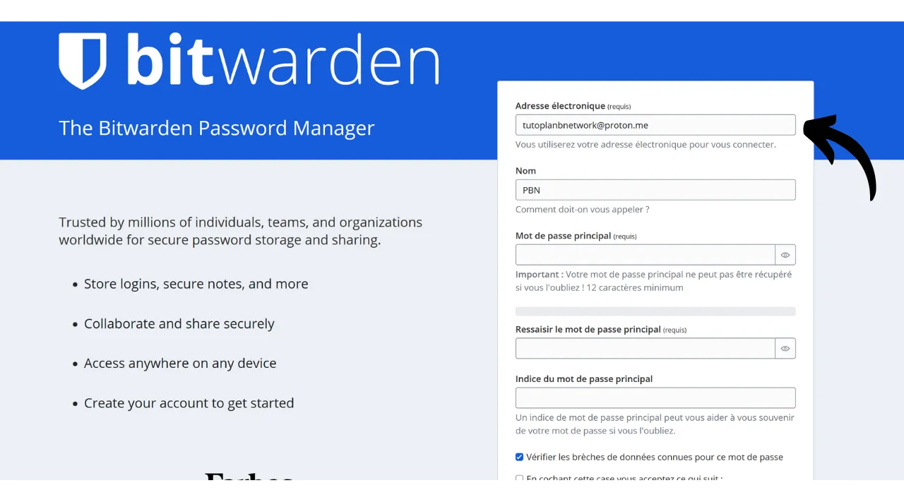
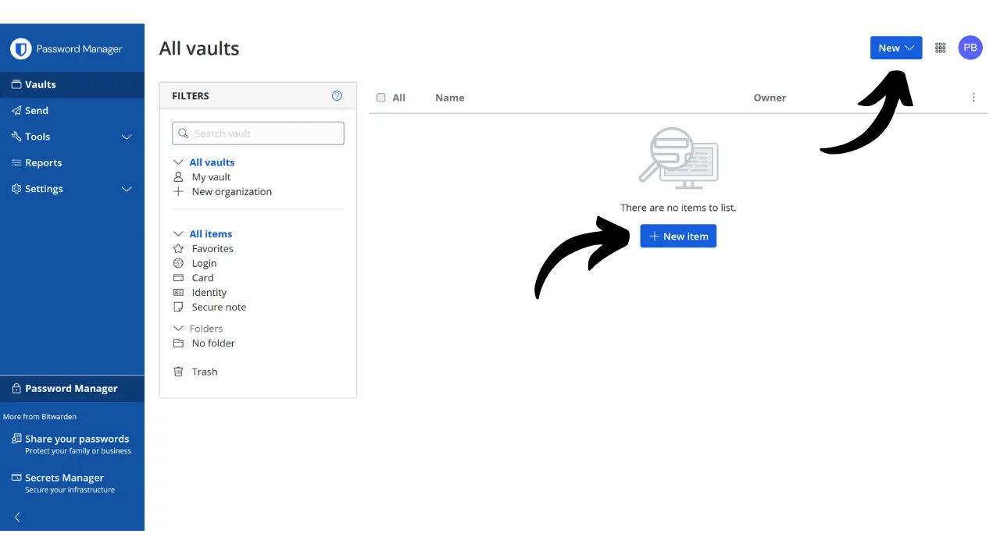
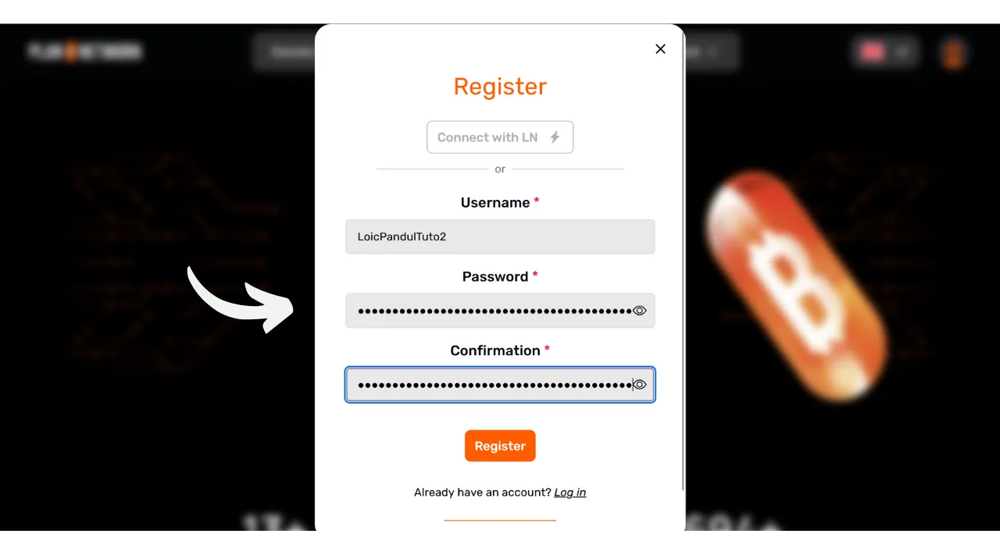
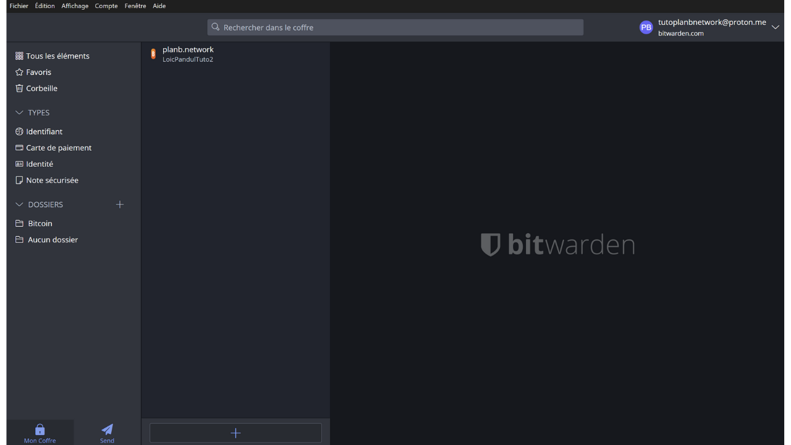

Nell'era digitale, dobbiamo gestire una moltitudine di account online che coprono vari aspetti della nostra vita quotidiana, inclusi servizi bancari, piattaforme finanziarie, email, archiviazione di file, salute, amministrazione, reti sociali, videogiochi, ecc.

Per autenticarci su ciascuno di questi account, utilizziamo un identificatore, spesso un indirizzo email, accompagnato da una password. Di fronte all'impossibilità di memorizzare un gran numero di password uniche, si potrebbe essere tentati di riutilizzare la stessa password o di modificarne leggermente una base comune per ricordarla facilmente. Tuttavia, queste pratiche compromettono seriamente la sicurezza dei vostri account.

Il primo principio da seguire per le password è di non riutilizzarle. Ogni account online dovrebbe essere protetto da una password unica e completamente distinta. Questo è importante perché, se un attaccante riesce a compromettere una delle vostre password, non vorrete che abbiano accesso a tutti i vostri account. Avere una password unica per ogni account isola gli attacchi potenziali e limita il loro ambito. Ad esempio, se usate la stessa password per una piattaforma di videogiochi e per la vostra email, e quella password viene compromessa tramite un sito di phishing collegato alla piattaforma di giochi, l'attaccante potrebbe poi facilmente accedere alla vostra email e prendere il controllo di tutti i vostri altri account online.

Il secondo principio essenziale è la forza della password. Una password è considerata forte se è difficile da forzare brutalmente, cioè da indovinare attraverso tentativi ed errori. Ciò significa che le vostre password devono essere il più casuali possibile, lunghe e includere una diversità di caratteri (minuscole, maiuscole, numeri e simboli).

Applicare questi due principi di sicurezza delle password (unicità e robustezza) può essere difficile nella vita quotidiana, poiché è quasi impossibile memorizzare una password unica, casuale e forte per tutti i nostri account. Qui entra in gioco il gestore di password.

Un gestore di password genera e memorizza in modo sicuro password forti, permettendovi di accedere a tutti i vostri account online senza la necessità di memorizzarle individualmente. È necessario ricordare solo una password, la password principale, che vi dà accesso a tutte le vostre password salvate nel gestore. Utilizzare un gestore di password migliora la vostra sicurezza online perché impedisce il riutilizzo delle password e genera sistematicamente password casuali. Ma semplifica anche l'uso quotidiano dei vostri account centralizzando l'accesso alle vostre informazioni sensibili.
In questo tutorial, esploreremo come configurare e utilizzare un gestore di password per migliorare la vostra sicurezza online. Vi presenterò Bitwarden, e in un altro tutorial, esamineremo un'altra soluzione chiamata KeePass.
https://planb.network/tutorials/others/keepass

Attenzione: Un gestore di password è ottimo per memorizzare le password, ma **non dovreste mai memorizzare la frase mnemonica del vostro portafoglio Bitcoin in esso!** Ricordate, una frase mnemonica dovrebbe essere salvata esclusivamente in un formato fisico, come un pezzo di carta o metallo.

## Introduzione a Bitwarden

Bitwarden è un gestore di password adatto sia per principianti che per utenti avanzati. Offre numerosi vantaggi. Prima di tutto, Bitwarden è una soluzione multi-piattaforma, il che significa che potete usarlo come app mobile, applicazione web, estensione per browser e software desktop.

Bitwarden vi permette di salvare le vostre password online e sincronizzarle su tutti i vostri dispositivi, garantendo al contempo la crittografia end-to-end con la vostra password principale. Ciò vi consente, ad esempio, di accedere alle vostre password sia sul computer che sullo smartphone, con sincronizzazione tra i due. Poiché le vostre password sono crittografate, rimangono inaccessibili a chiunque, incluso Bitwarden, senza la chiave di decrittazione che è la vostra password principale.
Inoltre, Bitwarden è open-source, il che significa che il software può essere sottoposto a verifica da parte di esperti indipendenti. Per quanto riguarda i prezzi, Bitwarden offre tre piani: - Una versione gratuita che esploreremo in questo tutorial. Sebbene sia gratuita, offre un livello di sicurezza equivalente a quello delle versioni a pagamento. È possibile memorizzare un numero illimitato di password e sincronizzare quanti dispositivi si desidera;
- Una versione premium per $10 all'anno che include funzionalità aggiuntive come lo spazio di archiviazione per file, il backup della carta di credito, la possibilità di configurare il 2FA con una chiave di sicurezza fisica e l'accesso all'autenticazione 2FA TOTP direttamente con Bitwarden;
- E un piano famiglia per $40 all'anno che estende i benefici della versione premium a sei utenti diversi.

A mio parere, questi prezzi sono equi. La versione gratuita è un'ottima opzione per i principianti, e la versione premium offre un ottimo rapporto qualità-prezzo rispetto ad altri gestori di password sul mercato, offrendo inoltre più funzionalità. Inoltre, il fatto che Bitwarden sia open-source rappresenta un grande vantaggio. Pertanto, è un compromesso interessante, specialmente per i principianti.
Un'altra caratteristica di Bitwarden è la possibilità di auto-ospitare il proprio gestore di password se si possiede, ad esempio, un NAS in casa. Configurando questa opzione, le tue password non sono memorizzate sui server di Bitwarden, ma sui tuoi server personali. Questo ti dà il controllo completo sulla disponibilità delle tue password. Tuttavia, questa opzione richiede una gestione rigorosa dei backup per evitare qualsiasi perdita di accesso. Pertanto, l'auto-ospitamento di Bitwarden è più adatto agli utenti avanzati, e ne parleremo in un altro tutorial.
## Come creare un account Bitwarden?

Visita [il sito web di Bitwarden](https://bitwarden.com/) e clicca su "*Inizia*".

Inizia inserendo il tuo indirizzo email e il tuo nome o nickname.

Successivamente, dovrai impostare la tua password principale. Come abbiamo visto nell'introduzione, questa password è molto importante perché ti dà accesso a tutte le altre password salvate nel gestore. Presenta due principali rischi: la perdita e il compromesso. Se perdi l'accesso a questa password, non sarai più in grado di accedere a tutte le tue credenziali. Se la tua password viene rubata, l'attaccante potrà accedere a tutti i tuoi account.

Per minimizzare il rischio di perdita, ti consiglio di fare un backup fisico della tua password principale su carta e di conservarlo in un luogo sicuro. Se possibile, sigilla questo backup in una busta sicura per assicurarti regolarmente che nessun altro ci abbia avuto accesso.

Per prevenire il compromesso della tua password principale, essa deve essere estremamente robusta. Dovrebbe essere il più lunga possibile, utilizzare una vasta varietà di caratteri e essere scelta in modo casuale. Nel 2024, le raccomandazioni minime per una password sicura sono 13 caratteri includendo numeri, lettere minuscole e maiuscole, così come simboli, a patto che la password sia veramente casuale. Tuttavia, ti consiglio di optare per una password di almeno 20 caratteri, includendo tutti i tipi possibili di caratteri, per garantirne la sicurezza più a lungo.

Inserisci la tua password principale nell'apposito riquadro e confermala nel riquadro seguente.

Se lo desideri, puoi aggiungere un suggerimento per la tua password principale. Tuttavia, ti sconsiglio di farlo, poiché il suggerimento non fornisce un metodo affidabile di recupero in caso di perdita della tua password e potrebbe addirittura essere utile agli aggressori che tentano di indovinare o forzare la tua password. Come regola generale, evita di creare suggerimenti pubblici che potrebbero compromettere la sicurezza della tua password principale.
 Quindi clicca sul pulsante "*Crea un account*".

Ora puoi accedere al tuo nuovo account Bitwarden. Inserisci il tuo indirizzo email.

Poi digita la tua password principale.

Ora sei nell'interfaccia web del tuo gestore di password.

## Come configurare Bitwarden?

Per iniziare, confermeremo il nostro indirizzo email. Clicca su "*Invia Email*".

Poi clicca sul pulsante ricevuto via email.

Infine, accedi di nuovo.

Prima di tutto, ti consiglio vivamente di impostare l'autenticazione a due fattori (2FA) per proteggere il tuo gestore di password. Hai la scelta tra l'uso di un'applicazione TOTP o di una chiave di sicurezza fisica. Attivando la 2FA, ogni volta che accedi al tuo account Bitwarden, ti sarà chiesto non solo la tua password principale ma anche una prova del tuo secondo fattore di autenticazione. Questo rappresenta un ulteriore strato di sicurezza, particolarmente utile nel caso in cui il tuo backup cartaceo della password principale venga compromesso.

Se non sei sicuro di come configurare e usare questi dispositivi 2FA, ti consiglio di seguire questi altri 2 tutorial:

https://planb.network/tutorials/others/authy

https://planb.network/tutorials/others/security-key

Per fare ciò, vai alla scheda "*Sicurezza*" nel menu "*Impostazioni*".

Poi clicca sulla scheda "*Accesso a due passaggi*".

Qui, puoi scegliere il metodo 2FA che preferisci. Ad esempio, sceglierò la 2FA con un'applicazione TOTP cliccando sul pulsante "*Gestisci*".

Conferma la tua password principale.

Poi scansiona il codice QR con la tua applicazione 2FA.

Inserisci il codice a 6 cifre annotato sulla tua applicazione 2FA, poi clicca sul pulsante "*Attiva*". 
L'autenticazione a due fattori è stata impostata con successo sul tuo account.

Ora, se provi ad accedere di nuovo al tuo gestore, dovrai prima inserire la tua password principale, poi il codice dinamico a 6 cifre generato dalla tua applicazione 2FA. Assicurati di avere sempre accesso a questo codice dinamico; senza di esso, non sarai in grado di recuperare le tue password.

Nelle impostazioni, hai anche l'opzione di personalizzare il tuo gestore nella scheda "*Preferenze*". Qui, puoi cambiare la durata prima che il tuo gestore si blocchi automaticamente, così come la lingua e il tema dell'interfaccia.

Ti consiglio vivamente di regolare la lunghezza delle password generate da Bitwarden. Per impostazione predefinita, la lunghezza è fissata a 14 caratteri, il che potrebbe essere insufficiente per una sicurezza ottimale. Ora che hai un gestore per ricordare tutte le tue password, potresti anche approfittarne per usare password molto forti.
Per fare ciò, vai al menu "*Generator*". 
Qui, puoi aumentare il valore della lunghezza delle tue password fino a 40 e selezionare la casella per includere simboli.

## Come proteggere i tuoi account con Bitwarden?

Ora che il tuo gestore di password è configurato, puoi iniziare a memorizzare le credenziali per i tuoi account online. Per aggiungere un nuovo elemento, clicca direttamente sul pulsante "*Nuovo elemento*" o sul pulsante "*Nuovo*" situato in alto a destra dello schermo, poi su "*elemento*".

Nel modulo che si apre, inizia determinando la natura dell'elemento da salvare. Per memorizzare le credenziali di accesso, scegli l'opzione "*Login*" dal menu a tendina.

Nel campo "*Nome*", inserisci un nome descrittivo per le tue credenziali. Questo renderà più facile cercare e organizzare le tue password, specialmente se ne hai un gran numero. Ad esempio, se vuoi salvare le tue credenziali per il sito della Rete PlanB, puoi nominare questo elemento in modo che sia immediatamente riconoscibile durante le tue future ricerche.

Il campo "*Cartella*" ti permette di classificare le tue credenziali in cartelle. Al momento, non ne abbiamo ancora create, ma ti mostrerò come fare più avanti.

Nel campo "*Nome utente*", inserisci il tuo nome utente, che di solito è il tuo indirizzo email. 
Successivamente, nel campo "*Password*", puoi inserire la tua password. Tuttavia, ti consiglio vivamente di lasciare che Bitwarden generi per te una password lunga, casuale e unica. Questo ti assicura di avere una password forte. Per utilizzare questa funzione, clicca sull'icona a doppia freccia sopra il campo da compilare.

Puoi vedere che la tua password è stata generata.

Nel campo "*URI 1*", puoi inserire il nome di dominio del sito web.

E infine, nel campo "*Note*", puoi aggiungere dettagli aggiuntivi se necessario.

Quando hai finito di compilare tutti questi campi, clicca sul pulsante "*Salva*".

La tua credenziale ora appare nel tuo gestore Bitwarden.

Cliccandoci sopra, puoi accedere ai suoi dettagli e modificarli.

Cliccando sui tre piccoli punti sulla destra, hai un accesso rapido per copiare la password o il nome utente.

Congratulazioni, hai salvato con successo la tua prima password nel tuo gestore! Se vuoi organizzare meglio le tue credenziali, puoi creare cartelle specifiche. Per fare ciò, clicca sul pulsante "*Nuovo*" situato in alto a destra dello schermo, poi seleziona "*Cartella*".

Inserisci un nome per la tua cartella.

Poi clicca su "*Salva*".

La tua cartella ora appare nel tuo gestore.
Puoi assegnare una cartella a una credenziale al momento della sua creazione, come abbiamo fatto in precedenza, o modificando una credenziale esistente. Ad esempio, cliccando sulla mia credenziale per PlanB Network, posso poi scegliere di classificarla nella cartella "*Bitcoin*".
In questo modo, puoi strutturare il tuo gestore di password per rendere più facile trovare le tue credenziali. Puoi organizzarle con cartelle come personale, professionale, banche, email, social network, abbonamenti, shopping, amministrazione, streaming, archiviazione, viaggi, salute, ecc.
Se preferisci utilizzare solo la versione web di Bitwarden, è assolutamente possibile attenersi a quella. Consiglio quindi di aggiungere il tuo gestore di password ai preferiti del tuo browser per un facile accesso e per evitare rischi di phishing. Tuttavia, Bitwarden offre anche una gamma completa di client che ti permettono di utilizzare il tuo gestore su vari dispositivi e di semplificarne l'uso quotidiano. Offrono in particolare un'app mobile, un'estensione per browser e un software per desktop. Vediamo insieme come configurarli.

## Come usare l'estensione per browser di Bitwarden?

Prima di tutto, puoi configurare l'estensione per browser se lo desideri. Questa estensione funziona come una versione ridotta del tuo gestore e ti offre la possibilità di salvare automaticamente nuove password, generare suggerimenti di password sicure e compilare automaticamente le tue credenziali nei moduli di login delle pagine web.

Usare questa estensione quotidianamente è estremamente conveniente, ma può anche aprire nuovi vettori di attacco. Pertanto, alcuni esperti di cybersecurity sconsigliano l'uso di estensioni per browser per i gestori di password. Tuttavia, se scegli di utilizzare l'estensione Bitwarden, ecco come procedere:

Inizia andando sulla [pagina ufficiale di download di Bitwarden](https://bitwarden.com/download/#downloads-web-browser).
Scegli il tuo browser dall'elenco fornito. Per questo esempio, sto usando Firefox, quindi vengo reindirizzato all'estensione ufficiale di Bitwarden sul Firefox Add-ons Store. La procedura è abbastanza simile per altri browser.
Clicca sul pulsante "*Aggiungi a Firefox*".
Puoi poi agganciare Bitwarden alla tua barra delle estensioni per un facile accesso. Clicca sull'estensione per accedere.
Inserisci il tuo indirizzo email.
Poi la tua password principale.
E infine, inserisci il codice a 6 cifre dalla tua app di autenticazione.
Ora sei connesso al tuo gestore Bitwarden tramite l'estensione del browser.
Ad esempio, se torno al sito di PlanB Network e provo ad accedere al mio account, puoi vedere che l'estensione Bitwarden integrata nel browser riconosce i campi di login e mi offre automaticamente di selezionare l'identificativo che avevo precedentemente salvato.
Se seleziono questo identificativo, Bitwarden compila automaticamente i campi di login per me. Questa funzionalità dell'estensione permette una rapida connessione ai siti web, senza la necessità di copiare e incollare le credenziali dall'applicazione web o dal software Bitwarden.  L'estensione è inoltre progettata per rilevare la creazione di nuovi account. Ad esempio, quando creo un nuovo account su PlanB Network, Bitwarden suggerisce automaticamente di salvare il nuovo identificativo.  Cliccando su questo suggerimento che appare, si apre l'estensione. Mi permette di inserire i dettagli del nuovo identificativo e generare una password forte e unica.  Dopo aver completato le informazioni e cliccato su "*Salva*", l'estensione salva le credenziali.  Poi, l'estensione aggiunge automaticamente le nostre credenziali nei campi appropriati sul sito web.  ## Come usare il software Bitwarden?
Per installare il software desktop di Bitwarden, inizia andando sulla [pagina di download](https://bitwarden.com/download/#downloads-desktop). Seleziona e scarica la versione corrispondente al tuo sistema operativo.  Una volta completato il download, procedi con l'installazione del software sul tuo computer. Al primo avvio del software Bitwarden, dovrai inserire le tue credenziali per sbloccare il tuo gestore di password.  Poi, arriverai alla homepage del tuo gestore. L'interfaccia è quasi la stessa dell'applicazione web.  ## Come usare l'app Bitwarden?

Per accedere alle tue password dal telefono, puoi installare l'app mobile di Bitwarden. Inizia andando sulla [pagina di download](https://bitwarden.com/download/#downloads-mobile) e usa il tuo smartphone per scansionare il codice QR corrispondente al tuo sistema operativo.  Scarica e installa l'app mobile ufficiale di Bitwarden. Alla prima apertura dell'app, inserisci le tue credenziali per sbloccare l'accesso al tuo gestore di password.  Una volta connesso, potrai consultare e gestire tutte le tue password direttamente dall'app.  Per aumentare la sicurezza della tua app, ti consiglio di andare nelle impostazioni e attivare la protezione PIN. Questo aggiungerà un ulteriore livello di sicurezza in caso di perdita o furto del tuo telefono.  ## Come fare il backup di Bitwarden?
Per assicurarti di non perdere mai l'accesso alle tue password, anche in caso di perdita della tua password principale o di un disastro che colpisca i server di Bitwarden, ti consiglio di eseguire regolarmente un backup crittografato del tuo gestore su un supporto esterno.

L'idea è di crittografare tutte le tue credenziali Bitwarden con una password diversa dalla tua password principale e salvare questo backup crittografato su una chiavetta USB o un disco rigido che conservi a casa tua, ad esempio. Puoi poi tenere una copia fisica della password di decrittazione in un luogo separato da dove è conservato il supporto di backup. Ad esempio, potresti tenere la chiavetta USB a casa e affidare la copia fisica della password di crittografia a un amico di fiducia.

Questo metodo assicura che, anche se il tuo supporto di backup venisse rubato, i tuoi dati rimarrebbero inaccessibili senza la password di decrittazione. Allo stesso modo, il tuo amico non sarà in grado di accedere ai tuoi dati senza avere il supporto fisico.
Tuttavia, in caso di problemi, puoi utilizzare la password e il supporto esterno per recuperare le tue credenziali, indipendentemente da Bitwarden. Quindi, anche se i server di Bitwarden dovessero essere distrutti, avresti comunque la possibilità di recuperare le tue password.
Pertanto, ti consiglio di eseguire regolarmente questi backup in modo che includano sempre le tue credenziali più recenti. Per evitare di disturbare il tuo amico, che detiene una copia della password di crittografia, ad ogni nuovo backup, puoi salvare questa password nel tuo gestore di password. Questo non è inteso come un backup, dato che il tuo amico ha già una copia fisica, ma piuttosto per semplificare le tue future procedure di esportazione.

Per procedere con l'esportazione, è molto semplice: vai alla sezione "*Tools*" del tuo gestore Bitwarden, poi seleziona "*Export vault*".

Per il formato, scegli "*.json (Encrypted)*".

Poi seleziona l'opzione "*Password protected*".

Qui, è importante scegliere una password forte, unica e generata casualmente per crittografare il backup. Questo assicura che, anche in caso di furto del tuo backup crittografato, sarà impossibile per un attaccante decifrarlo mediante forza bruta.

Clicca su "*Confirm format*" e inserisci la tua password principale per procedere con l'esportazione.

Una volta completata l'esportazione, troverai il tuo file di backup crittografato nei tuoi download. Trasferiscilo su un dispositivo di archiviazione esterno sicuro, come una chiavetta USB o un disco rigido. Ripeti questa operazione periodicamente a seconda del tuo utilizzo. Ad esempio, puoi rinnovare il backup ogni settimana o ogni mese, secondo le tue necessità.