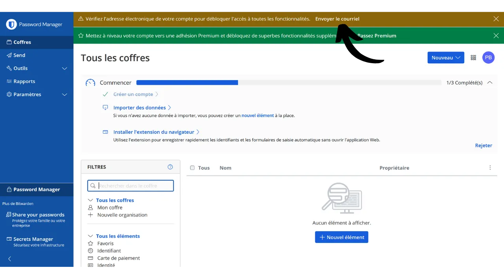
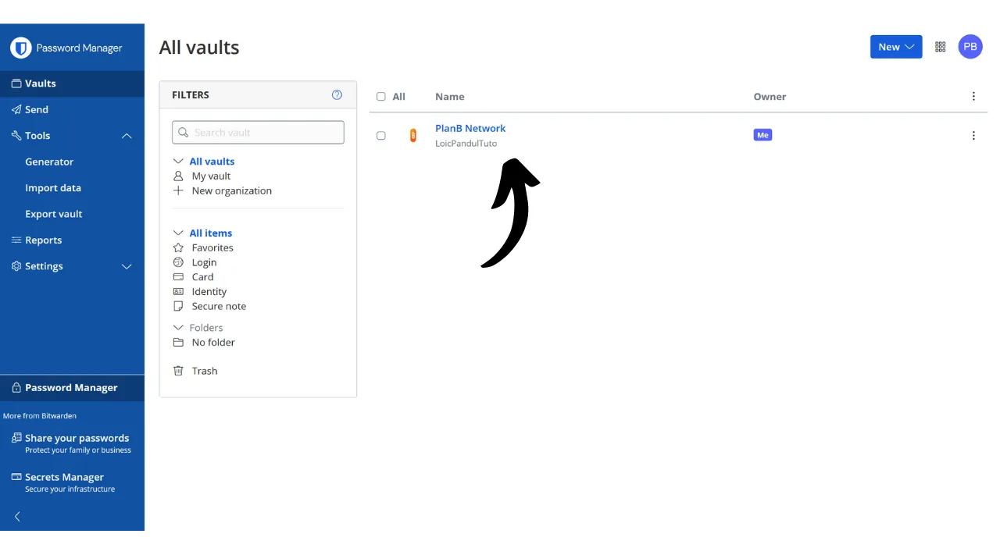
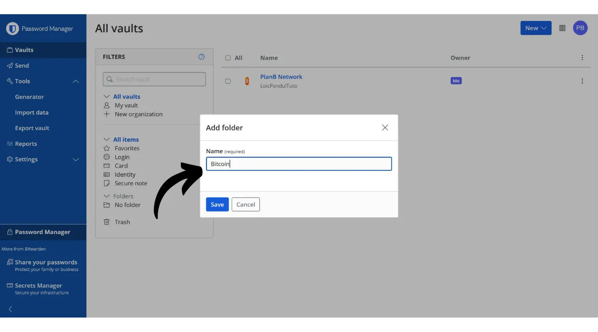
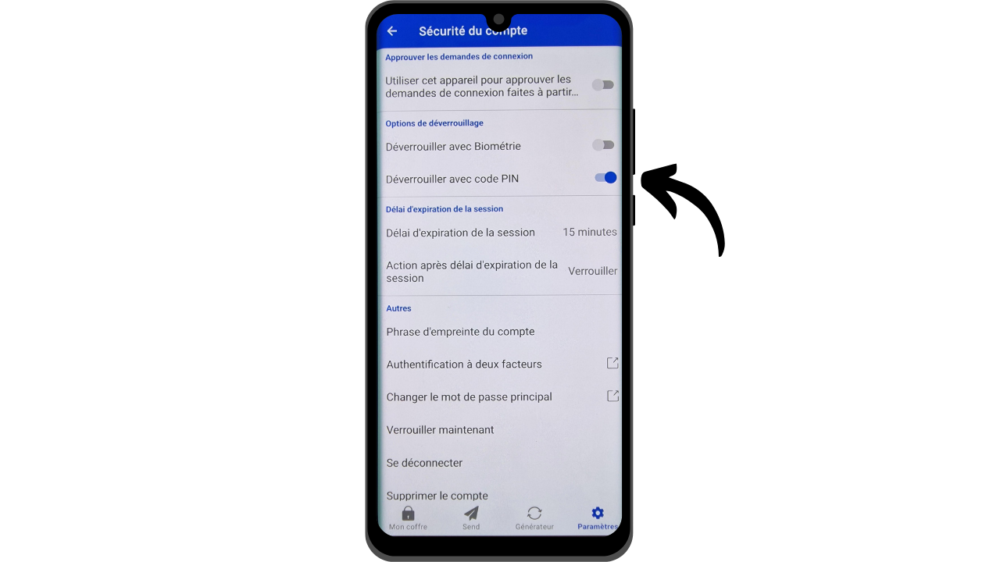

Na era digital, precisamos gerenciar uma infinidade de contas online que abrangem vários aspectos de nossas vidas diárias, incluindo bancos, plataformas financeiras, emails, armazenamento de arquivos, saúde, administração, redes sociais, jogos de vídeo, etc.

Para nos autenticarmos em cada uma dessas contas, usamos um identificador, muitas vezes um endereço de email, acompanhado por uma senha. Diante da impossibilidade de memorizar um grande número de senhas únicas, pode-se ser tentado a reutilizar a mesma senha ou modificar ligeiramente uma base comum para lembrá-la facilmente. No entanto, essas práticas comprometem seriamente a segurança de suas contas.

O primeiro princípio a seguir para as senhas é não reutilizá-las. Cada conta online deve ser protegida por uma senha única que seja completamente distinta das outras. Isso é importante porque, se um atacante conseguir comprometer uma de suas senhas, você não quer que ele tenha acesso a todas as suas contas. Ter uma senha única para cada conta isola ataques potenciais e limita seu escopo. Por exemplo, se você usar a mesma senha para uma plataforma de jogos de vídeo e para o seu email, e essa senha for comprometida via um site de phishing relacionado à plataforma de jogos, o atacante poderia então acessar facilmente o seu email e assumir o controle de todas as suas outras contas online.

O segundo princípio essencial é a força da senha. Uma senha é considerada forte se for difícil de ser descoberta por tentativa e erro, ou seja, por força bruta. Isso significa que suas senhas devem ser o mais aleatórias possível, longas e incluir uma variedade de caracteres (letras minúsculas, maiúsculas, números e símbolos).

Aplicar esses dois princípios de segurança de senhas (unicidade e robustez) pode provar ser difícil no dia a dia, já que é quase impossível memorizar uma senha única, aleatória e forte para todas as nossas contas. É aqui que o gerenciador de senhas entra em jogo.

Um gerenciador de senhas gera e armazena de forma segura senhas fortes, permitindo que você acesse todas as suas contas online sem a necessidade de memorizá-las individualmente. Você só precisa lembrar de uma senha, a senha mestre, que lhe dá acesso a todas as suas senhas salvas no gerenciador. Usar um gerenciador de senhas melhora sua segurança online porque impede a reutilização de senhas e gera sistematicamente senhas aleatórias. Mas também simplifica o uso diário de suas contas centralizando o acesso às suas informações sensíveis.
Neste tutorial, exploraremos como configurar e usar um gerenciador de senhas para melhorar sua segurança online. Vou apresentá-lo ao Bitwarden, e em outro tutorial, examinaremos outra solução chamada KeePass.
https://planb.network/tutorials/others/keepass

Aviso: Um gerenciador de senhas é ótimo para armazenar senhas, mas **você nunca deve armazenar a frase mnemônica da sua carteira Bitcoin nele!** Lembre-se, uma frase mnemônica deve ser exclusivamente salva em um formato físico, como um pedaço de papel ou metal.

## Introdução ao Bitwarden

Bitwarden é um gerenciador de senhas adequado tanto para iniciantes quanto para usuários avançados. Oferece inúmeras vantagens. Primeiramente, Bitwarden é uma solução multiplataforma, o que significa que você pode usá-lo como um aplicativo móvel, aplicação web, extensão de navegador e software de desktop.

Bitwarden permite que você salve suas senhas online e as sincronize em todos os seus dispositivos, garantindo criptografia de ponta a ponta com sua senha mestre. Isso permite, por exemplo, acessar suas senhas tanto no computador quanto no smartphone, com sincronização entre os dois. Como suas senhas são criptografadas, elas permanecem inacessíveis para qualquer pessoa, incluindo o Bitwarden, sem a chave de descriptografia que é sua senha mestre.
Além disso, o Bitwarden é de código aberto, o que significa que o software pode ser auditado por especialistas independentes. Quanto aos preços, o Bitwarden oferece três planos: - Uma versão gratuita que exploraremos neste tutorial. Embora seja gratuita, ela oferece um nível de segurança equivalente ao das versões pagas. Você pode armazenar um número ilimitado de senhas e sincronizar quantos dispositivos desejar;
- Uma versão premium por $10 por ano que inclui recursos adicionais, como armazenamento de arquivos, backup de cartão bancário, a capacidade de configurar 2FA com uma chave de segurança física e acesso à autenticação 2FA TOTP diretamente com o Bitwarden;
- E um plano familiar por $40 por ano que estende os benefícios da versão premium para seis usuários diferentes.

Na minha opinião, esses preços são justos. A versão gratuita é uma excelente opção para iniciantes, e a versão premium oferece um ótimo custo-benefício em comparação com outros gerenciadores de senhas no mercado, além de oferecer mais recursos. Além disso, o fato de o Bitwarden ser de código aberto é uma grande vantagem. Portanto, é um compromisso interessante, especialmente para iniciantes.
Outra característica do Bitwarden é a capacidade de auto-hospedar seu gerenciador de senhas se você possui, por exemplo, um NAS em casa. Ao configurar essa configuração, suas senhas não são armazenadas nos servidores do Bitwarden, mas nos seus próprios servidores. Isso lhe dá controle total sobre a disponibilidade de suas senhas. No entanto, essa opção requer um gerenciamento rigoroso de backup para evitar qualquer perda de acesso. Portanto, a auto-hospedagem do Bitwarden é mais adequada para usuários avançados, e discutiremos isso em outro tutorial.
## Como criar uma conta no Bitwarden?

Visite [o site do Bitwarden](https://bitwarden.com/) e clique em "*Comece Agora*".

Comece inserindo seu endereço de e-mail, bem como seu nome ou apelido.

Em seguida, você precisará configurar sua senha mestre. Como vimos na introdução, essa senha é muito importante porque lhe dá acesso a todas as suas outras senhas salvas no gerenciador. Ela apresenta então dois principais riscos: perda e comprometimento. Se você perder o acesso a essa senha, não poderá mais acessar todas as suas credenciais. Se sua senha for roubada, o atacante poderá acessar todas as suas contas.

Para minimizar o risco de perda, recomendo fazer um backup físico da sua senha mestre em papel e armazená-lo em um local seguro. Se possível, sele esse backup em um envelope seguro para garantir regularmente que mais ninguém teve acesso a ele.

Para evitar o comprometimento da sua senha mestre, ela deve ser extremamente robusta. Deve ser o mais longa possível, usar uma ampla variedade de caracteres e ser escolhida aleatoriamente. Em 2024, as recomendações mínimas para uma senha segura são 13 caracteres, incluindo números, letras minúsculas e maiúsculas, bem como símbolos, desde que a senha seja verdadeiramente aleatória. No entanto, recomendo optar por uma senha de pelo menos 20 caracteres, incluindo todos os tipos possíveis de caracteres, para garantir sua segurança por mais tempo.

Insira sua senha mestre na caixa dedicada e confirme-a na caixa seguinte.

Se desejar, você pode adicionar uma dica para sua senha mestre. No entanto, eu aconselho contra isso, pois a dica não fornece um método confiável de recuperação caso você perca sua senha e até mesmo pode ser útil para atacantes tentando adivinhar ou forçar bruscamente sua senha. Como regra geral, evite criar dicas públicas que possam comprometer a segurança da sua senha mestre.

Então clique no botão "*Criar uma conta*".

Agora você pode entrar na sua nova conta Bitwarden. Insira seu endereço de email.

Depois digite sua senha mestre.

Você está agora na interface web do seu gerenciador de senhas.

## Como configurar o Bitwarden?

Para começar, vamos confirmar nosso endereço de email. Clique em "*Enviar Email*".

Depois clique no botão recebido por email.

Finalmente, entre novamente.

Antes de mais nada, eu fortemente aconselho você a configurar a autenticação de dois fatores (2FA) para proteger seu gerenciador de senhas. Você tem a escolha entre usar um aplicativo TOTP ou uma chave de segurança física. Ao ativar o 2FA, cada vez que você entrar na sua conta Bitwarden, será solicitado não apenas sua senha mestre, mas também uma prova do seu segundo fator de autenticação. Isso é uma camada adicional de segurança, particularmente útil no caso de seu backup em papel da senha mestre ser comprometido.

Se você não tem certeza de como configurar e usar esses dispositivos 2FA, eu recomendo seguir estes outros 2 tutoriais:

https://planb.network/tutorials/others/authy

https://planb.network/tutorials/others/security-key

Para fazer isso, vá para a aba "*Segurança*" no menu "*Configurações*".

Depois clique na aba "*Login em duas etapas*".

Aqui, você pode escolher o método 2FA que preferir. Por exemplo, eu escolherei 2FA com um aplicativo TOTP clicando no botão "*Gerenciar*".

Confirme sua senha mestre.

Depois escaneie o código QR com seu aplicativo 2FA.

Insira o código de 6 dígitos anotado no seu aplicativo 2FA, depois clique no botão "*Ativar*". 
A autenticação de dois fatores foi configurada com sucesso na sua conta.

Agora, se você tentar entrar novamente no seu gerenciador, primeiro precisará inserir sua senha mestre, depois o código dinâmico de 6 dígitos gerado pelo seu aplicativo 2FA. Certifique-se de sempre ter acesso a este código dinâmico; sem ele, você será incapaz de recuperar suas senhas.

Nas configurações, você também tem a opção de personalizar seu gerenciador na aba "*Preferências*". Aqui, você pode mudar a duração antes do seu gerenciador bloquear automaticamente, assim como o idioma e o tema da interface.
Eu recomendo fortemente ajustar o comprimento das senhas geradas pelo Bitwarden. Por padrão, o comprimento é definido para 14 caracteres, o que pode ser insuficiente para uma segurança ótima. Agora que você tem um gerenciador para lembrar todas as suas senhas, você pode muito bem aproveitar isso para usar senhas muito fortes.

Para isso, vá até o menu "*Generator*".

Aqui, você pode aumentar o comprimento das suas senhas para 40 e marcar a caixa para incluir símbolos.

## Como proteger suas contas com o Bitwarden?

Agora que seu gerenciador de senhas está configurado, você pode começar a armazenar as credenciais para suas contas online. Para adicionar um novo item, clique diretamente no botão "*New item*" ou no botão "*New*" localizado no canto superior direito da tela, e então em "*item*".

No formulário que se abre, comece determinando a natureza do item a ser salvo. Para armazenar credenciais de login, escolha a opção "*Login*" no menu suspenso.

No campo "*Name*", insira um nome descritivo para suas credenciais. Isso facilitará a busca e organização de suas senhas, especialmente se você tiver um grande número delas. Por exemplo, se você quiser salvar suas credenciais para o site da Rede PlanB, você pode nomear este item de uma forma que o torne imediatamente reconhecível durante suas futuras buscas.

A opção "*Folder*" permite classificar suas credenciais em pastas. Por enquanto, ainda não criamos nenhuma, mas mostrarei como fazer isso mais tarde.

No campo "*Username*", insira seu nome de usuário, que geralmente é o seu endereço de email. 
Em seguida, no campo "*Password*", você pode inserir sua senha. No entanto, eu recomendo fortemente deixar o Bitwarden gerar uma senha longa, aleatória e única para você. Isso garante que você tenha uma senha forte. Para usar essa funcionalidade, clique no ícone de seta dupla acima do campo a ser preenchido.

Você pode ver que sua senha foi gerada.

No campo "*URI 1*", você pode inserir o nome de domínio do site.

E finalmente, no campo "*Notes*", você pode adicionar detalhes adicionais, se necessário.

Quando você terminar de preencher todos esses campos, clique no botão "*Save*".

Seu identificador agora aparece no seu gerenciador Bitwarden.

Clicando nele, você pode acessar seus detalhes e modificá-los.

Clicando nos três pequenos pontos à direita, você tem acesso rápido para copiar a senha ou o identificador.

Parabéns, você salvou com sucesso sua primeira senha no seu gerenciador! Se você quiser organizar melhor seus identificadores, pode criar pastas específicas. Para fazer isso, clique no botão "*Novo*" localizado no canto superior direito da tela e, em seguida, selecione "*Pasta*".
Digite um nome para a sua pasta.

Então clique em "*Salvar*".

Sua pasta agora aparece no seu gerenciador.

Você pode atribuir uma pasta a um identificador ao criá-lo, como fizemos anteriormente, ou modificando um identificador existente. Por exemplo, ao clicar no meu identificador para a Rede PlanB, posso então escolher classificá-lo na pasta "*Bitcoin*".

Dessa forma, você pode estruturar seu gerenciador de senhas para facilitar a localização dos seus identificadores. Você pode organizá-los com pastas como pessoal, profissional, bancos, e-mails, redes sociais, assinaturas, compras, administração, streaming, armazenamento, viagens, saúde, etc.
Se você preferir usar apenas a versão web do Bitwarden, é totalmente possível se ater a isso. Recomendo então adicionar seu gerenciador de senhas aos favoritos do seu navegador para fácil acesso e para evitar riscos de phishing. No entanto, o Bitwarden também oferece uma gama completa de clientes permitindo que você use seu gerenciador em vários dispositivos e simplifique seu uso diário. Eles oferecem notavelmente um aplicativo móvel, uma extensão de navegador e um software para desktop. Vamos ver como configurá-los juntos.

## Como usar a extensão do navegador Bitwarden?

Primeiro, você pode configurar a extensão do navegador se desejar. Esta extensão funciona como uma versão reduzida do seu gerenciador e oferece a possibilidade de salvar automaticamente novas senhas, gerar sugestões para senhas seguras e preencher automaticamente suas credenciais nas páginas de login de sites.

O uso diário desta extensão é extremamente conveniente, mas também pode abrir novos vetores de ataque. Alguns especialistas em cibersegurança, portanto, aconselham contra o uso de extensões de navegador para gerenciadores de senhas. No entanto, se você escolher usar a extensão Bitwarden, aqui está como proceder:

Comece indo para [a página oficial de download do Bitwarden](https://bitwarden.com/download/#downloads-web-browser).

Escolha seu navegador na lista fornecida. Para este exemplo, estou usando o Firefox, então sou redirecionado para a extensão oficial do Bitwarden na Loja de Complementos do Firefox. O procedimento é bastante semelhante para outros navegadores.

Clique no botão "*Adicionar ao Firefox*".

Você pode então anexar o Bitwarden à sua barra de extensões para fácil acesso. Clique na extensão para fazer login.

Digite seu endereço de e-mail.

Em seguida, sua senha mestra.

E finalmente, insira o código de 6 dígitos do seu aplicativo de autenticação.

Você está agora conectado ao seu gerenciador Bitwarden através da extensão do navegador.

Por exemplo, se eu voltar ao site da Rede PlanB e tentar fazer login na minha conta, você pode ver que a extensão do Bitwarden integrada ao navegador reconhece os campos de login e automaticamente me oferece para selecionar o identificador que salvei anteriormente.

Se eu selecionar este identificador, o Bitwarden preenche os campos de login para mim. Esta funcionalidade da extensão permite uma conexão rápida aos sites, sem a necessidade de copiar e colar credenciais da aplicação web ou software do Bitwarden.

A extensão também é projetada para detectar a criação de novas contas. Por exemplo, ao criar uma nova conta na Rede PlanB, o Bitwarden automaticamente sugere salvar o novo identificador.

Ao clicar nesta sugestão que aparece, a extensão se abre. Ela me permite inserir os detalhes do novo identificador e gerar uma senha forte e única.

Após completar as informações e clicar em "*Salvar*", a extensão salva as credenciais.

Então, a extensão automaticamente preenche nossas credenciais nos campos apropriados no site.

## Como usar o software Bitwarden?

Para instalar o software de desktop do Bitwarden, comece indo até [a página de download](https://bitwarden.com/download/#downloads-desktop). Selecione e baixe a versão correspondente ao seu sistema operacional.

Uma vez que o download esteja completo, prossiga com a instalação do software no seu computador. Na primeira execução do software Bitwarden, você precisará inserir suas credenciais para desbloquear seu gerenciador de senhas.

Então, você chegará à página inicial do seu gerenciador. A interface é quase a mesma que na aplicação web.

## Como usar a aplicação Bitwarden?

Para acessar suas senhas pelo telefone, você pode instalar a aplicação móvel do Bitwarden. Comece indo até [a página de download](https://bitwarden.com/download/#downloads-mobile) e use seu smartphone para escanear o código QR correspondente ao seu sistema operacional.

Baixe e instale a aplicação móvel oficial do Bitwarden. Na primeira abertura da aplicação, insira suas credenciais para desbloquear o acesso ao seu gerenciador de senhas.

Uma vez conectado, você poderá consultar e gerenciar todas as suas senhas diretamente da aplicação.

Para aumentar a segurança da sua aplicação, aconselho que vá até as configurações e ative a proteção por PIN. Isso adicionará uma camada extra de segurança em caso de perda ou roubo do seu telefone.

## Como fazer backup do Bitwarden?
Para garantir que você nunca perca acesso às suas senhas, mesmo no caso de perder sua senha mestra ou um desastre afetar os servidores do Bitwarden, aconselho que faça regularmente um backup criptografado do seu gerenciador em um meio externo.
A ideia é criptografar todas as suas credenciais do Bitwarden com uma senha diferente da sua senha mestre e salvar esse backup criptografado em um pendrive ou um disco rígido que você mantenha em sua casa, por exemplo. Você pode então manter uma cópia física da senha de descriptografia em um local separado de onde o meio de backup está armazenado. Por exemplo, você poderia manter o pendrive em casa e confiar a cópia física da senha de criptografia a um amigo de confiança.
Este método garante que, mesmo se o seu meio de backup for roubado, seus dados permanecerão inacessíveis sem a senha de descriptografia. Da mesma forma, seu amigo não será capaz de acessar seus dados sem ter o meio físico.

No entanto, em caso de problema, você pode usar a senha e o meio externo para recuperar o acesso às suas credenciais, independentemente do Bitwarden. Assim, mesmo que os servidores do Bitwarden fossem destruídos, você ainda teria a possibilidade de recuperar suas senhas.

Portanto, aconselho que você realize esses backups regularmente para que eles sempre incluam suas credenciais mais recentes. Para evitar incomodar seu amigo, que possui uma cópia da senha de criptografia, a cada novo backup, você pode salvar essa senha no seu gerenciador de senhas. Isso não é intencionado como um backup, já que seu amigo já possui uma cópia física, mas sim para simplificar seus futuros procedimentos de exportação.

Para prosseguir com a exportação, é bastante simples: vá até a seção "*Tools*" do seu gerenciador Bitwarden, e então selecione "*Export vault*".

Para o formato, escolha "*.json (Encrypted)*".

Em seguida, selecione a opção "*Password protected*".

Aqui, é importante escolher uma senha forte, única e gerada aleatoriamente para criptografar o backup. Isso garante que, mesmo no caso de roubo do seu backup criptografado, será impossível para um atacante descriptografá-lo por força bruta.

Clique em "*Confirm format*" e insira sua senha mestre para prosseguir com a exportação.

Uma vez que a exportação esteja completa, você encontrará seu arquivo de backup criptografado em seus downloads. Transfira-o para um dispositivo de armazenamento externo seguro, como um pendrive ou um disco rígido. Repita essa operação periodicamente, dependendo do seu uso. Por exemplo, você pode renovar o backup toda semana ou todo mês, de acordo com suas necessidades.