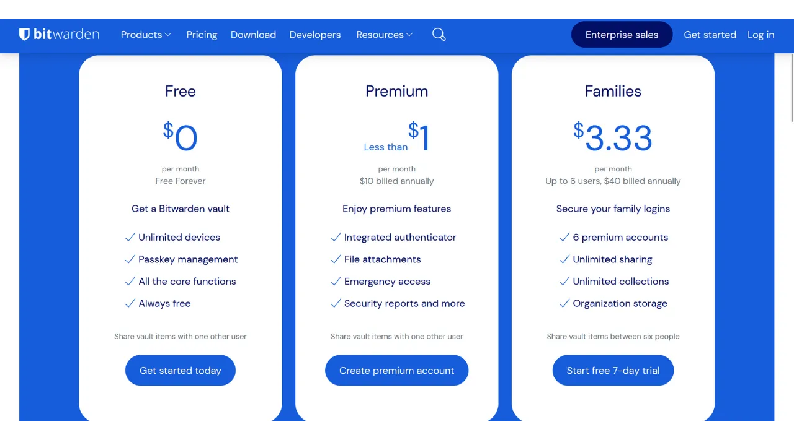

В цифровую эпоху нам необходимо управлять множеством онлайн-аккаунтов, охватывающих различные аспекты нашей повседневной жизни, включая банковские услуги, финансовые платформы, электронную почту, хранение файлов, здоровье, администрирование, социальные сети, видеоигры и т.д.

Для аутентификации в каждом из этих аккаунтов мы используем идентификатор, часто адрес электронной почты, сопровождаемый паролем. Перед лицом невозможности запомнить большое количество уникальных паролей, можно было бы поддаться искушению использовать один и тот же пароль или немного изменить общую базу для легкого запоминания. Однако эти практики серьезно компрометируют безопасность ваших аккаунтов.

Первый принцип, которому следует следовать для паролей, - не использовать их повторно. Каждый онлайн-аккаунт должен быть защищен уникальным паролем, полностью отличным от других. Это важно, потому что, если злоумышленник сможет скомпрометировать один из ваших паролей, вы не хотите, чтобы у него был доступ ко всем вашим аккаунтам. Наличие уникального пароля для каждого аккаунта изолирует потенциальные атаки и ограничивает их масштаб. Например, если вы используете один и тот же пароль для платформы видеоигр и для вашей электронной почты, и этот пароль будет скомпрометирован через фишинговый сайт, связанный с игровой платформой, злоумышленник сможет легко получить доступ к вашей электронной почте и взять под контроль все ваши другие онлайн-аккаунты.

Второй существенный принцип - сила пароля. Пароль считается надежным, если его трудно подобрать методом грубой силы, то есть угадать методом проб и ошибок. Это означает, что ваши пароли должны быть максимально случайными, длинными и включать разнообразие символов (строчные и прописные буквы, цифры и символы).

Применение этих двух принципов безопасности паролей (уникальность и надежность) может оказаться сложным в повседневной жизни, поскольку практически невозможно запомнить уникальный, случайный и надежный пароль для всех наших аккаунтов. Здесь на помощь приходит менеджер паролей.

Менеджер паролей генерирует и безопасно хранит надежные пароли, позволяя вам получать доступ ко всем вашим онлайн-аккаунтам без необходимости запоминать их индивидуально. Вам нужно запомнить только один пароль, главный пароль, который дает вам доступ ко всем вашим сохраненным паролям в менеджере. Использование менеджера паролей повышает вашу онлайн-безопасность, поскольку предотвращает повторное использование паролей и систематически генерирует случайные пароли. Но это также упрощает вашу ежедневную работу с аккаунтами, централизуя доступ к вашей конфиденциальной информации.
В этом руководстве мы рассмотрим, как настроить и использовать менеджер паролей для повышения вашей онлайн-безопасности. Я представлю вам Bitwarden, а в другом руководстве мы рассмотрим другое решение под названием KeePass.
https://planb.network/tutorials/others/keepass

Внимание: Менеджер паролей отлично подходит для хранения паролей, но **никогда не храните в нем мнемоническую фразу вашего биткойн-кошелька!** Помните, мнемоническая фраза должна быть исключительно сохранена в физическом формате, например, на листе бумаги или металле.

## Введение в Bitwarden

Bitwarden подходит как для начинающих, так и для продвинутых пользователей. Он предлагает множество преимуществ. Прежде всего, Bitwarden является мультиплатформенным решением, что означает, что вы можете использовать его как мобильное приложение, веб-приложение, расширение для браузера и настольное программное обеспечение.

Bitwarden позволяет вам сохранять ваши пароли онлайн и синхронизировать их на всех ваших устройствах, обеспечивая при этом шифрование от конца к концу с помощью вашего главного пароля. Это позволяет вам, например, получать доступ к вашим паролям как на компьютере, так и на смартфоне, с синхронизацией между ними. Поскольку ваши пароли зашифрованы, они остаются недоступными для кого бы то ни было, включая Bitwarden, без ключа дешифрования, которым является ваш главный пароль.
К тому же, Bitwarden является открытым исходным кодом, что означает, что программное обеспечение может быть проверено независимыми экспертами. Что касается цен, Bitwarden предлагает три тарифных плана:
- Бесплатная версия, которую мы рассмотрим в этом учебнике. Несмотря на то, что она бесплатная, она обеспечивает уровень безопасности, эквивалентный платным версиям. Вы можете хранить неограниченное количество паролей и синхронизировать столько устройств, сколько желаете;
- Премиум-версия за $10 в год, которая включает дополнительные функции, такие как хранение файлов, резервное копирование банковских карт, возможность настройки 2FA с физическим ключом безопасности и доступ к аутентификации 2FA TOTP непосредственно с Bitwarden;
- И семейный план за $40 в год, который расширяет преимущества премиум-версии на шесть разных пользователей.

На мой взгляд, эти цены справедливы. Бесплатная версия является отличным вариантом для начинающих, а премиум-версия предлагает очень хорошее соотношение цены и качества по сравнению с другими менеджерами паролей на рынке, предлагая при этом больше функций. Кроме того, факт того, что Bitwarden является открытым исходным кодом, является значительным преимуществом. Поэтому это интересный компромисс, особенно для начинающих.
Еще одной особенностью Bitwarden является возможность самостоятельного хостинга вашего менеджера паролей, если у вас, например, есть NAS дома. Настроив эту конфигурацию, ваши пароли не хранятся на серверах Bitwarden, а на ваших собственных серверах. Это дает вам полный контроль над доступностью ваших паролей. Однако, этот вариант требует строгого управления резервным копированием, чтобы избежать любой потери доступа. Поэтому самостоятельный хостинг Bitwarden больше подходит для продвинутых пользователей, и мы обсудим его в другом учебнике.
## Как создать аккаунт Bitwarden?

Посетите [веб-сайт Bitwarden](https://bitwarden.com/) и нажмите на "*Начать работу*".

Начните с ввода вашего адреса электронной почты, а также вашего имени или псевдонима.

Далее вам нужно будет установить ваш основной пароль. Как мы видели во введении, этот пароль очень важен, потому что он дает вам доступ ко всем вашим другим сохраненным паролям в менеджере. Здесь присутствуют два основных риска: потеря и компрометация. Если вы потеряете доступ к этому паролю, вы больше не сможете получить доступ ко всем вашим учетным данным. Если ваш пароль будет украден, злоумышленник сможет получить доступ ко всем вашим аккаунтам.

Чтобы минимизировать риск потери, я рекомендую сделать физическую резервную копию вашего основного пароля на бумаге и хранить ее в безопасном месте. Если возможно, запечатайте эту резервную копию в защищенном конверте, чтобы регулярно убеждаться, что к ней никто другой не имел доступа.

Чтобы предотвратить компрометацию вашего основного пароля, он должен быть чрезвычайно надежным. Он должен быть как можно длиннее, использовать широкий ассортимент символов и быть выбранным случайным образом. В 2024 году минимальные рекомендации для надежного пароля составляют 13 символов, включая цифры, строчные и заглавные буквы, а также символы, при условии, что пароль действительно случаен. Однако я рекомендую выбирать пароль длиной не менее 20 символов, включая все возможные типы символов, чтобы обеспечить его безопасность на более длительный срок.

Введите ваш основной пароль в соответствующее поле и подтвердите его в следующем поле.

Если хотите, вы можете добавить подсказку для вашего мастер-пароля. Однако я не рекомендую это делать, так как подсказка не предоставляет надежного метода восстановления в случае потери пароля и даже может быть полезной для атакующих, пытающихся угадать или подобрать ваш пароль методом грубой силы. Как общее правило, избегайте создания публичных подсказок, которые могут подвергнуть риску безопасность вашего мастер-пароля.

Затем нажмите на кнопку "*Создать аккаунт*".

Теперь вы можете войти в свой новый аккаунт Bitwarden. Введите ваш адрес электронной почты.

Затем введите ваш мастер-пароль.

Теперь вы находитесь в веб-интерфейсе вашего менеджера паролей.

## Как настроить Bitwarden?

Для начала мы подтвердим наш адрес электронной почты. Нажмите на "*Отправить письмо*".

Затем нажмите на кнопку, полученную по электронной почте.

Наконец, войдите снова.

Прежде всего, я настоятельно рекомендую вам настроить двухфакторную аутентификацию (2FA), чтобы обезопасить ваш менеджер паролей. У вас есть выбор между использованием приложения TOTP или физического ключа безопасности. Активируя 2FA, каждый раз при входе в ваш аккаунт Bitwarden, вам будет запрашиваться не только ваш мастер-пароль, но и доказательство вашего второго фактора аутентификации. Это дополнительный уровень безопасности, особенно полезный в случае, если ваша бумажная копия мастер-пароля будет скомпрометирована.

Если вы не уверены, как настроить и использовать эти устройства 2FA, я рекомендую следовать этим 2 другим руководствам:

https://planb.network/tutorials/others/authy

https://planb.network/tutorials/others/security-key

Для этого перейдите на вкладку "*Безопасность*" в меню "*Настройки*".

Затем нажмите на вкладку "*Двухэтапный вход*".

Здесь вы можете выбрать предпочитаемый метод 2FA. Например, я выберу 2FA с приложением TOTP, нажав на кнопку "*Управление*".

Подтвердите ваш мастер-пароль.

Затем отсканируйте QR-код с помощью вашего приложения 2FA.

Введите 6-значный код, отображаемый в вашем приложении 2FA, затем нажмите кнопку "*Включить*". 
Двухфакторная аутентификация была успешно настроена на вашем аккаунте.

Теперь, если вы попытаетесь снова войти в ваш менеджер, сначала вам нужно будет ввести ваш мастер-пароль, а затем динамический 6-значный код, сгенерированный вашим приложением 2FA. Убедитесь, что у вас всегда есть доступ к этому динамическому коду; без него вы не сможете восстановить свои пароли.

В настройках у вас также есть возможность настроить ваш менеджер во вкладке "*Предпочтения*". Здесь вы можете изменить время до автоматической блокировки вашего менеджера, а также язык и тему интерфейса.
Я настоятельно рекомендую увеличить длину паролей, генерируемых Bitwarden. По умолчанию длина установлена в 14 символов, что может быть недостаточно для оптимальной безопасности. Теперь, когда у вас есть менеджер для запоминания всех ваших паролей, стоит воспользоваться этим, чтобы использовать действительно надежные пароли.

Для этого перейдите в меню "*Генератор*".

Здесь вы можете увеличить длину ваших паролей до 40 символов и отметить галочкой включение символов.

## Как обезопасить свои аккаунты с помощью Bitwarden?

Теперь, когда ваш менеджер паролей настроен, вы можете начать сохранять учетные данные для ваших онлайн-аккаунтов. Чтобы добавить новый элемент, нажмите непосредственно на кнопку "*Новый элемент*" или на кнопку "*Новый*", расположенную в верхнем правом углу экрана, затем на "*элемент*".

В открывшейся форме сначала определите характер элемента для сохранения. Чтобы сохранить учетные данные для входа, выберите в выпадающем меню опцию "*Логин*".

В поле "*Имя*" введите описательное имя для ваших учетных данных. Это облегчит поиск и организацию ваших паролей, особенно если у вас их много. Например, если вы хотите сохранить свои учетные данные для сайта PlanB Network, вы можете назвать этот элемент так, чтобы он был сразу узнаваем при будущих поисках.

Опция "*Папка*" позволяет классифицировать ваши учетные данные по папкам. Пока мы еще не создали ни одной, но я покажу вам, как это сделать позже.

В поле "*Имя пользователя*" введите ваше имя пользователя, которое обычно является вашим адресом электронной почты. 
Далее, в поле "*Пароль*", вы можете ввести свой пароль. Однако я настоятельно рекомендую позволить Bitwarden сгенерировать для вас длинный, случайный и уникальный пароль. Это гарантирует, что у вас будет надежный пароль. Чтобы использовать эту функцию, нажмите на иконку с двойной стрелкой над полем для заполнения.

Вы можете видеть, что ваш пароль был сгенерирован.

В поле "*URI 1*" вы можете ввести доменное имя сайта.

И, наконец, в поле "*Заметки*" вы можете добавить дополнительные детали при необходимости.

Когда вы закончите заполнять все эти поля, нажмите на кнопку "*Сохранить*".

Ваш идентификатор теперь появляется в вашем менеджере Bitwarden.

Нажав на него, вы можете получить доступ к его деталям и изменить их.

Нажав на три маленькие точки справа, вы получаете быстрый доступ к копированию пароля или идентификатора.

Поздравляем, вы успешно сохранили свой первый пароль в менеджере! Если вы хотите лучше организовать свои идентификаторы, вы можете создать специальные папки. Для этого нажмите на кнопку "*New*", расположенную в верхнем правом углу экрана, затем выберите "*Folder*".
Введите название для вашей папки.

Затем нажмите на "*Save*".

Теперь ваша папка отображается в вашем менеджере.

Вы можете назначить папку для идентификатора при его создании, как мы делали ранее, или изменяя существующий идентификатор. Например, нажав на мой идентификатор для PlanB Network, я могу затем выбрать его классификацию в папке "*Bitcoin*".

Таким образом, вы можете структурировать ваш менеджер паролей, чтобы облегчить поиск ваших идентификаторов. Вы можете организовать их с помощью папок, таких как личные, профессиональные, банки, электронная почта, социальные сети, подписки, покупки, администрирование, стриминг, хранение, путешествия, здоровье и т.д.
Если вы предпочитаете использовать только веб-версию Bitwarden, это вполне возможно. Тогда я рекомендую добавить ваш менеджер паролей в избранное вашего браузера для удобного доступа и для предотвращения рисков фишинга. Однако Bitwarden также предлагает полный спектр клиентов, позволяющих использовать ваш менеджер на различных устройствах и упрощать его ежедневное использование. В частности, они предлагают мобильное приложение, расширение для браузера и настольное программное обеспечение. Давайте посмотрим, как их настроить вместе.

## Как использовать расширение Bitwarden для браузера?

Для начала вы можете настроить расширение для браузера, если хотите. Это расширение работает как упрощенная версия вашего менеджера и предлагает вам возможность автоматически сохранять новые пароли, генерировать предложения для безопасных паролей и автоматически заполнять ваши учетные данные на страницах входа на сайты.

Ежедневное использование этого расширения чрезвычайно удобно, но оно также может открыть новые векторы атаки. Некоторые эксперты по кибербезопасности поэтому советуют не использовать расширения браузера для менеджеров паролей. Однако, если вы решите использовать расширение Bitwarden, вот как следует поступить:

Сначала перейдите на [официальную страницу загрузки Bitwarden](https://bitwarden.com/download/#downloads-web-browser).

Выберите свой браузер из предложенного списка. Для этого примера я использую Firefox, поэтому я перенаправлен на официальное расширение Bitwarden в магазине дополнений Firefox. Процедура довольно похожа для других браузеров.

Нажмите на кнопку "*Add to Firefox*".

Затем вы можете прикрепить Bitwarden к панели расширений для удобного доступа. Нажмите на расширение, чтобы войти.

Введите свой адрес электронной почты.

Затем ваш мастер-пароль.

И, наконец, введите 6-значный код из вашего приложения аутентификации.

Теперь вы подключены к вашему менеджеру Bitwarden через расширение браузера.

Например, если я вернусь на сайт PlanB Network и попытаюсь войти в свой аккаунт, вы можете видеть, что расширение Bitwarden, интегрированное в браузер, распознает поля для входа и автоматически предлагает мне выбрать идентификатор, который я ранее сохранил.

Если я выберу этот идентификатор, Bitwarden заполнит для меня поля входа. Эта функция расширения позволяет быстро подключаться к сайтам, без необходимости копировать и вставлять учетные данные из веб-приложения или программного обеспечения Bitwarden.

Расширение также предназначено для обнаружения создания новых аккаунтов. Например, при создании нового аккаунта на PlanB Network, Bitwarden автоматически предлагает сохранить новый идентификатор.

Нажав на это предложение, которое появляется, расширение открывается. Оно позволяет мне ввести детали нового идентификатора и сгенерировать сильный, уникальный пароль.

После заполнения информации и нажатия на "*Сохранить*", расширение сохраняет учетные данные.

Затем расширение автоматически заполняет наши учетные данные в соответствующих полях на сайте.

## Как использовать программное обеспечение Bitwarden?

Чтобы установить настольное программное обеспечение Bitwarden, начните с перехода на [страницу загрузки](https://bitwarden.com/download/#downloads-desktop). Выберите и загрузите версию, соответствующую вашей операционной системе.

После завершения загрузки продолжите установку программного обеспечения на ваш компьютер. При первом запуске программного обеспечения Bitwarden вам нужно будет ввести ваши учетные данные, чтобы разблокировать ваш менеджер паролей.

Затем вы попадете на главную страницу вашего менеджера. Интерфейс почти такой же, как в веб-приложении.

## Как использовать приложение Bitwarden?

Чтобы получить доступ к вашим паролям с телефона, вы можете установить мобильное приложение Bitwarden. Начните с перехода на [страницу загрузки](https://bitwarden.com/download/#downloads-mobile) и используйте ваш смартфон для сканирования QR-кода, соответствующего вашей операционной системе.

Загрузите и установите официальное мобильное приложение Bitwarden. При первом открытии приложения введите ваши учетные данные, чтобы разблокировать доступ к вашему менеджеру паролей.

После подключения вы сможете просматривать и управлять всеми вашими паролями непосредственно из приложения.

Чтобы повысить безопасность вашего приложения, я советую вам зайти в настройки и активировать защиту PIN-кодом. Это добавит дополнительный уровень безопасности в случае потери или кражи вашего телефона.

## Как сделать резервную копию Bitwarden?
Чтобы вы никогда не потеряли доступ к вашим паролям, даже в случае потери вашего мастер-пароля или катастрофы, затрагивающей серверы Bitwarden, я советую вам регулярно выполнять зашифрованное резервное копирование вашего менеджера на внешний носитель.
Идея заключается в том, чтобы зашифровать все ваши учетные данные Bitwarden паролем, отличным от вашего основного пароля, и сохранить этот зашифрованный бэкап на USB-флешке или жестком диске, который вы храните дома, например. Затем вы можете хранить физическую копию пароля для расшифровки в месте, отдельном от места хранения носителя бэкапа. Например, вы можете хранить USB-флешку дома и доверить физическую копию пароля для шифрования надежному другу.
Этот метод гарантирует, что даже если ваш носитель бэкапа будет украден, ваши данные останутся недоступными без пароля для расшифровки. Аналогично, ваш друг не сможет получить доступ к вашим данным, не имея физического носителя.

Однако, в случае возникновения проблемы, вы можете использовать пароль и внешний носитель для восстановления доступа к вашим учетным данным, независимо от Bitwarden. Таким образом, даже если серверы Bitwarden будут уничтожены, у вас все равно будет возможность восстановить ваши пароли.

Поэтому я советую вам регулярно выполнять эти бэкапы, чтобы они всегда включали ваши самые актуальные учетные данные. Чтобы не беспокоить вашего друга, который хранит копию пароля для шифрования, при каждом новом бэкапе, вы можете сохранить этот пароль в вашем менеджере паролей. Это не предназначено в качестве бэкапа, поскольку у вашего друга уже есть физическая копия, а скорее для упрощения ваших будущих процедур экспорта.

Чтобы приступить к экспорту, это довольно просто: перейдите в раздел "*Tools*" вашего менеджера Bitwarden, затем выберите "*Export vault*".

Для формата выберите "*.json (Encrypted)*".

Затем выберите опцию "*Password protected*".

Здесь важно выбрать сильный, уникальный и случайным образом сгенерированный пароль для шифрования бэкапа. Это гарантирует, что даже в случае кражи вашего зашифрованного бэкапа, злоумышленнику будет невозможно расшифровать его методом грубой силы.

Нажмите на "*Confirm format*" и введите ваш основной пароль для продолжения экспорта.

После завершения экспорта вы найдете ваш зашифрованный файл бэкапа в ваших загрузках. Перенесите его на безопасный внешний носитель, такой как USB-флешка или жесткий диск. Повторяйте эту операцию периодически в зависимости от вашего использования. Например, вы можете обновлять бэкап каждую неделю или каждый месяц, в зависимости от ваших потребностей.