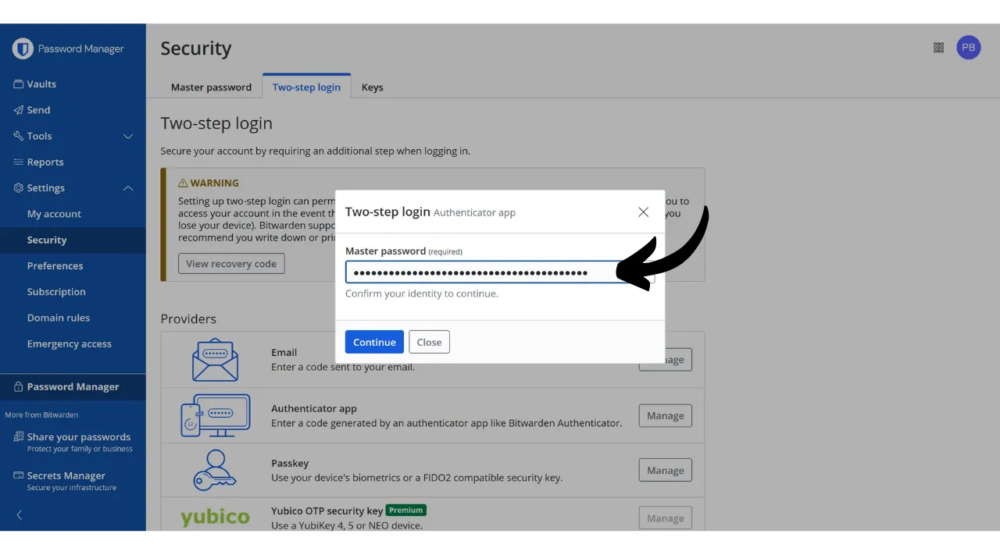
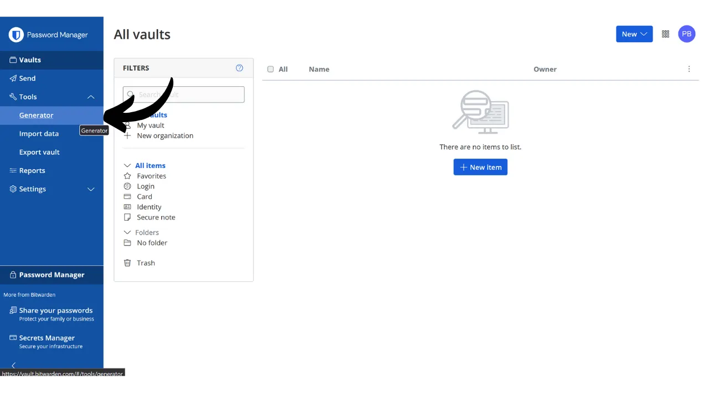
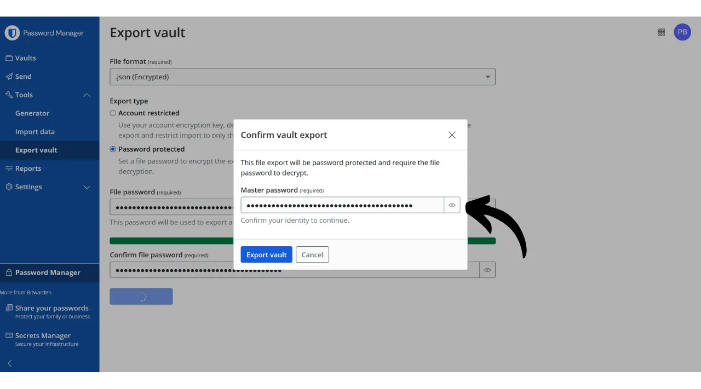

Trong kỷ nguyên số, chúng ta cần quản lý nhiều tài khoản trực tuyến khác nhau bao gồm nhiều khía cạnh trong cuộc sống hàng ngày, bao gồm ngân hàng, nền tảng tài chính, email, lưu trữ tệp, sức khỏe, quản trị, mạng xã hội, trò chơi video, v.v.

Để xác thực bản thân trên mỗi tài khoản này, chúng ta sử dụng một định danh, thường là địa chỉ email, kèm theo một mật khẩu. Đối mặt với việc không thể nhớ một số lượng lớn mật khẩu duy nhất, người ta có thể bị cám dỗ sử dụng lại cùng một mật khẩu hoặc chỉnh sửa nhẹ một cơ sở chung để dễ nhớ. Tuy nhiên, những thực hành này nghiêm trọng làm giảm an toàn của các tài khoản của bạn.

Nguyên tắc đầu tiên cần tuân theo cho mật khẩu là không tái sử dụng chúng. Mỗi tài khoản trực tuyến nên được bảo vệ bởi một mật khẩu duy nhất và hoàn toàn khác biệt. Điều này quan trọng vì, nếu một kẻ tấn công quản lý để xâm phạm một trong những mật khẩu của bạn, bạn không muốn họ có quyền truy cập vào tất cả các tài khoản của bạn. Có một mật khẩu duy nhất cho mỗi tài khoản giúp cô lập các cuộc tấn công tiềm năng và giới hạn phạm vi của chúng. Ví dụ, nếu bạn sử dụng cùng một mật khẩu cho một nền tảng trò chơi video và cho email của bạn, và mật khẩu đó bị xâm phạm qua một trang web lừa đảo liên kết với nền tảng trò chơi, kẻ tấn công có thể dễ dàng truy cập vào email của bạn và kiểm soát tất cả các tài khoản trực tuyến khác của bạn.

Nguyên tắc thiết yếu thứ hai là độ mạnh của mật khẩu. Một mật khẩu được coi là mạnh nếu nó khó bị bẻ khóa, tức là, khó đoán thông qua thử và sai. Điều này có nghĩa là mật khẩu của bạn phải càng ngẫu nhiên càng tốt, dài và bao gồm sự đa dạng của các ký tự (chữ thường, chữ hoa, số và ký hiệu).

Áp dụng hai nguyên tắc bảo mật mật khẩu này (độc nhất và mạnh mẽ) có thể khó khăn trong cuộc sống hàng ngày, vì gần như không thể nhớ một mật khẩu duy nhất, ngẫu nhiên và mạnh mẽ cho tất cả các tài khoản của chúng ta. Đây là nơi trình quản lý mật khẩu xuất hiện.

Một trình quản lý mật khẩu tạo và lưu trữ an toàn các mật khẩu mạnh, cho phép bạn truy cập vào tất cả các tài khoản trực tuyến mà không cần phải nhớ chúng một cách riêng lẻ. Bạn chỉ cần nhớ một mật khẩu, mật khẩu chính, cho phép bạn truy cập vào tất cả các mật khẩu đã lưu trong trình quản lý. Sử dụng trình quản lý mật khẩu tăng cường an ninh trực tuyến của bạn vì nó ngăn chặn việc tái sử dụng mật khẩu và hệ thống tạo mật khẩu ngẫu nhiên. Nhưng nó cũng đơn giản hóa việc sử dụng hàng ngày các tài khoản của bạn bằng cách tập trung truy cập vào thông tin nhạy cảm của bạn.
Trong hướng dẫn này, chúng ta sẽ khám phá cách thiết lập và sử dụng trình quản lý mật khẩu để tăng cường an ninh trực tuyến. Tôi sẽ giới thiệu bạn với Bitwarden, và trong một hướng dẫn khác, chúng ta sẽ tìm hiểu về một giải pháp khác gọi là KeePass.
https://planb.network/tutorials/others/keepass

Cảnh báo: Trình quản lý mật khẩu rất tốt để lưu trữ mật khẩu, nhưng **bạn không bao giờ nên lưu cụm từ gợi nhớ của ví Bitcoin trong đó!** Nhớ rằng, cụm từ gợi nhớ nên được lưu trữ độc quyền trong định dạng vật lý, như một tờ giấy hoặc kim loại.

## Giới thiệu về Bitwarden

Bitwarden là một trình quản lý mật khẩu phù hợp cho cả người mới bắt đầu và người dùng nâng cao. Nó mang lại nhiều lợi ích. Trước hết và quan trọng nhất, Bitwarden là một giải pháp đa nền tảng, có nghĩa là bạn có thể sử dụng nó như một ứng dụng di động, ứng dụng web, tiện ích mở rộng trình duyệt và phần mềm máy tính.

Bitwarden cho phép bạn lưu trữ mật khẩu trực tuyến và đồng bộ hóa chúng trên tất cả các thiết bị của bạn, đồng thời đảm bảo mã hóa đầu cuối với mật khẩu chính của bạn. Điều này cho phép bạn, ví dụ, truy cập vào mật khẩu của mình trên cả máy tính và điện thoại thông minh, với sự đồng bộ hóa giữa hai thiết bị. Vì mật khẩu của bạn được mã hóa, chúng vẫn không thể truy cập được bởi bất kỳ ai, bao gồm cả Bitwarden, mà không có khóa giải mã là mật khẩu chính của bạn.
Hơn nữa, Bitwarden là mã nguồn mở, điều này có nghĩa là phần mềm có thể được kiểm định bởi các chuyên gia độc lập. Về giá cả, Bitwarden cung cấp ba gói:
- Một phiên bản miễn phí mà chúng ta sẽ khám phá trong hướng dẫn này. Mặc dù là miễn phí, nó cung cấp một mức độ bảo mật tương đương với các phiên bản trả phí. Bạn có thể lưu trữ số lượng mật khẩu không giới hạn và đồng bộ hóa nhiều thiết bị tùy ý;
- Một phiên bản cao cấp với giá 10 đô la mỗi năm bao gồm các tính năng bổ sung như lưu trữ tệp, sao lưu thẻ tín dụng, khả năng cấu hình 2FA với một khóa bảo mật vật lý, và truy cập xác thực 2FA TOTP trực tiếp với Bitwarden;
- Và một gói gia đình với giá 40 đô la mỗi năm mở rộng lợi ích của phiên bản cao cấp cho sáu người dùng khác nhau.

Theo ý kiến của tôi, mức giá này là hợp lý. Phiên bản miễn phí là một lựa chọn tuyệt vời cho người mới bắt đầu, và phiên bản cao cấp cung cấp giá trị rất tốt so với các trình quản lý mật khẩu khác trên thị trường, đồng thời cung cấp nhiều tính năng hơn. Hơn nữa, việc Bitwarden là mã nguồn mở là một lợi thế lớn. Do đó, đây là một sự thỏa hiệp thú vị, đặc biệt là cho người mới bắt đầu.
Một tính năng khác của Bitwarden là khả năng tự lưu trữ trình quản lý mật khẩu của bạn nếu bạn sở hữu, ví dụ, một NAS tại nhà. Bằng cách thiết lập cấu hình này, mật khẩu của bạn không được lưu trữ trên máy chủ của Bitwarden, mà là trên máy chủ của riêng bạn. Điều này cho bạn quyền kiểm soát hoàn toàn về việc có sẵn mật khẩu của mình. Tuy nhiên, lựa chọn này đòi hỏi quản lý sao lưu một cách nghiêm ngặt để tránh mất quyền truy cập. Do đó, việc tự lưu trữ Bitwarden phù hợp hơn với người dùng nâng cao, và chúng ta sẽ thảo luận về nó trong một hướng dẫn khác.
## Làm thế nào để tạo một tài khoản Bitwarden?

Truy cập [trang web Bitwarden](https://bitwarden.com/) và nhấp vào "*Bắt đầu*".

Bắt đầu bằng cách nhập địa chỉ email và tên hoặc biệt danh của bạn.

Tiếp theo, bạn sẽ cần thiết lập mật khẩu chính của mình. Như chúng ta đã thấy trong phần giới thiệu, mật khẩu này rất quan trọng vì nó cho phép bạn truy cập vào tất cả các mật khẩu khác đã lưu trong trình quản lý. Nó đặt ra hai rủi ro chính: mất và bị xâm phạm. Nếu bạn mất quyền truy cập vào mật khẩu này, bạn sẽ không thể truy cập vào tất cả các thông tin đăng nhập của mình. Nếu mật khẩu của bạn bị đánh cắp, kẻ tấn công sẽ có thể truy cập vào tất cả các tài khoản của bạn.

Để giảm thiểu rủi ro mất mát, tôi khuyên bạn nên sao lưu mật khẩu chính của mình trên giấy và lưu trữ nó ở một nơi an toàn. Nếu có thể, hãy niêm phong sao lưu này trong một phong bì an toàn để định kỳ đảm bảo rằng không ai khác có quyền truy cập vào nó.

Để ngăn chặn việc mật khẩu chính của bạn bị xâm phạm, nó phải cực kỳ mạnh mẽ. Nó nên dài nhất có thể, sử dụng đa dạng các ký tự, và được chọn một cách ngẫu nhiên. Trong năm 2024, các khuyến nghị tối thiểu cho một mật khẩu an toàn là 13 ký tự bao gồm số, chữ cái viết thường và viết hoa, cũng như các biểu tượng, miễn là mật khẩu thực sự ngẫu nhiên. Tuy nhiên, tôi khuyên bạn nên chọn một mật khẩu ít nhất 20 ký tự, bao gồm tất cả các loại ký tự có thể, để đảm bảo an toàn cho nó lâu hơn.

Nhập mật khẩu chính của bạn vào ô dành riêng và xác nhận nó trong ô tiếp theo.

Nếu bạn muốn, bạn có thể thêm một gợi ý cho mật khẩu chính của mình. Tuy nhiên, tôi khuyên bạn không nên làm vậy, vì gợi ý không cung cấp một phương pháp khôi phục đáng tin cậy trong trường hợp bạn mất mật khẩu và thậm chí có thể hữu ích cho những kẻ tấn công cố gắng đoán hoặc dùng lực để phá mật khẩu của bạn. Như một quy tắc chung, tránh tạo ra các gợi ý công khai có thể làm mất an toàn mật khẩu chính của bạn.
Sau đó, nhấp vào nút "*Tạo một tài khoản*".

Bây giờ bạn có thể đăng nhập vào tài khoản Bitwarden mới của mình. Nhập địa chỉ email của bạn.

Sau đó nhập mật khẩu chính của bạn.

Bây giờ bạn đang ở trên giao diện web của trình quản lý mật khẩu của mình.

## Làm thế nào để thiết lập Bitwarden?

Đầu tiên, chúng ta sẽ xác nhận địa chỉ email của mình. Nhấp vào "*Gửi Email*".

Sau đó nhấp vào nút nhận được qua email.

Cuối cùng, đăng nhập lại.

Đầu tiên và quan trọng nhất, tôi khuyên bạn nên thiết lập xác thực hai yếu tố (2FA) để bảo mật trình quản lý mật khẩu của bạn. Bạn có thể chọn sử dụng ứng dụng TOTP hoặc một khóa bảo mật vật lý. Bằng cách kích hoạt 2FA, mỗi khi bạn đăng nhập vào tài khoản Bitwarden của mình, bạn sẽ không chỉ được yêu cầu mật khẩu chính mà còn cần chứng minh yếu tố thứ hai của xác thực. Đây là một lớp bảo mật bổ sung, đặc biệt hữu ích trong trường hợp bản sao lưu giấy của mật khẩu chính bị xâm phạm.

Nếu bạn không chắc cách thiết lập và sử dụng các thiết bị 2FA này, tôi khuyên bạn nên theo dõi 2 hướng dẫn khác này:

https://planb.network/tutorials/others/authy

https://planb.network/tutorials/others/security-key

Để làm điều này, đi đến tab "*Security*" trong menu "*Settings*".

Sau đó nhấp vào tab "*Two-step login*".

Ở đây, bạn có thể chọn phương thức 2FA mà bạn ưa thích. Ví dụ, tôi sẽ chọn 2FA với ứng dụng TOTP bằng cách nhấp vào nút "*Manage*".

Xác nhận mật khẩu chính của bạn.

Sau đó quét mã QR với ứng dụng 2FA của bạn.

Nhập mã 6 chữ số được ghi trên ứng dụng 2FA của bạn, sau đó nhấp vào nút "*Turn on*". 
Xác thực hai yếu tố đã được thiết lập thành công trên tài khoản của bạn.

Bây giờ, nếu bạn cố gắng đăng nhập lại vào trình quản lý của mình, bạn sẽ cần phải nhập mật khẩu chính trước, sau đó là mã động 6 chữ số được tạo bởi ứng dụng 2FA của bạn. Hãy chắc chắn rằng bạn luôn có quyền truy cập vào mã động này; nếu không, bạn sẽ không thể khôi phục mật khẩu của mình.

Trong cài đặt, bạn cũng có tùy chọn để tùy chỉnh trình quản lý của mình trong tab "*Preferences*". Ở đây, bạn có thể thay đổi thời gian trước khi trình quản lý của bạn tự động khóa, cũng như ngôn ngữ và chủ đề của giao diện.

Tôi rất khuyên bạn nên điều chỉnh độ dài của các mật khẩu được tạo bởi Bitwarden. Theo mặc định, độ dài được thiết lập là 14 ký tự, có thể không đủ cho bảo mật tối ưu. Bây giờ bạn đã có một trình quản lý để nhớ tất cả mật khẩu của mình, bạn cũng nên tận dụng nó để sử dụng các mật khẩu rất mạnh.
Để thực hiện điều này, hãy truy cập vào menu "*Generator*". 
Tại đây, bạn có thể tăng giá trị độ dài của mật khẩu lên đến 40 và đánh dấu vào ô để bao gồm các ký tự đặc biệt.

## Làm thế nào để bảo mật tài khoản của bạn với Bitwarden?

Bây giờ khi bạn đã thiết lập xong trình quản lý mật khẩu, bạn có thể bắt đầu lưu trữ thông tin đăng nhập cho các tài khoản trực tuyến của mình. Để thêm một mục mới, hãy nhấp trực tiếp vào nút "*New item*" hoặc nút "*New*" nằm ở góc trên bên phải của màn hình, sau đó chọn "*item*".

Trong biểu mẫu mở ra, bắt đầu bằng cách xác định bản chất của mục cần lưu. Để lưu thông tin đăng nhập, chọn tùy chọn "*Login*" từ menu thả xuống.

Trong trường "*Name*", hãy nhập một tên mô tả cho thông tin đăng nhập của bạn. Điều này sẽ giúp bạn dễ dàng tìm kiếm và tổ chức mật khẩu của mình, đặc biệt nếu bạn có số lượng lớn. Ví dụ, nếu bạn muốn lưu thông tin đăng nhập cho trang mạng PlanB Network, bạn có thể đặt tên cho mục này theo cách giúp bạn dễ dàng nhận biết trong các lần tìm kiếm sau này.

Trường "*Folder*" cho phép bạn phân loại thông tin đăng nhập vào các thư mục. Hiện tại, chúng tôi chưa tạo thư mục nào, nhưng tôi sẽ hướng dẫn bạn cách làm sau.

Trong trường "*Username*", hãy nhập tên người dùng của bạn, thường là địa chỉ email. 
Tiếp theo, trong trường "*Password*", bạn có thể nhập mật khẩu của mình. Tuy nhiên, tôi khuyến nghị mạnh mẽ bạn nên để Bitwarden tạo ra một mật khẩu dài, ngẫu nhiên và duy nhất cho bạn. Điều này đảm bảo bạn có một mật khẩu mạnh. Để sử dụng tính năng này, nhấp vào biểu tượng mũi tên kép phía trên trường cần điền.

Bạn có thể thấy mật khẩu của mình đã được tạo.

Trong trường "*URI 1*", bạn có thể nhập tên miền của trang web.

Và cuối cùng, trong trường "*Notes*", bạn có thể thêm chi tiết bổ sung nếu cần.

Khi bạn đã hoàn thành việc điền tất cả các trường này, nhấp vào nút "*Save*".

Thông tin đăng nhập của bạn giờ đây xuất hiện trong trình quản lý Bitwarden của bạn.

Bằng cách nhấp vào nó, bạn có thể truy cập vào chi tiết của nó và chỉnh sửa.

Bằng cách nhấp vào ba chấm nhỏ ở bên phải, bạn có quyền truy cập nhanh để sao chép mật khẩu hoặc tên người dùng.

Xin chúc mừng, bạn đã thành công lưu mật khẩu đầu tiên của mình trong trình quản lý! Nếu bạn muốn tổ chức thông tin đăng nhập của mình một cách tốt hơn, bạn có thể tạo các thư mục cụ thể. Để làm điều này, nhấp vào nút "*New*" nằm ở góc trên bên phải của màn hình, sau đó chọn "*Folder*".

Nhập tên cho thư mục của bạn.

Sau đó nhấp vào "*Save*".

Thư mục của bạn giờ đây xuất hiện trong trình quản lý của bạn.
Bạn có thể gán một thư mục cho thông tin đăng nhập khi tạo mới, như chúng ta đã làm trước đó, hoặc bằng cách chỉnh sửa thông tin đăng nhập hiện có. Ví dụ, bằng cách nhấp vào thông tin đăng nhập của tôi cho Mạng PlanB, tôi có thể chọn phân loại nó vào thư mục "*Bitcoin*".

Như vậy, bạn có thể cấu trúc trình quản lý mật khẩu của mình để dễ dàng tìm kiếm thông tin đăng nhập. Bạn có thể tổ chức chúng với các thư mục như cá nhân, chuyên nghiệp, ngân hàng, email, mạng xã hội, đăng ký, mua sắm, quản trị, phát trực tuyến, lưu trữ, du lịch, sức khỏe, v.v.
Nếu bạn muốn sử dụng chỉ phiên bản web của Bitwarden, hoàn toàn có thể làm như vậy. Sau đó, tôi khuyên bạn nên thêm trình quản lý mật khẩu vào mục yêu thích của trình duyệt để dễ dàng truy cập và tránh rủi ro phishing. Tuy nhiên, Bitwarden cũng cung cấp một loạt các ứng dụng khách cho phép bạn sử dụng trình quản lý trên các thiết bị khác nhau và đơn giản hóa việc sử dụng hàng ngày. Họ đặc biệt cung cấp ứng dụng di động, tiện ích mở rộng trình duyệt và phần mềm máy tính. Hãy xem cách thiết lập chúng cùng nhau.

## Làm thế nào để sử dụng tiện ích mở rộng trình duyệt Bitwarden?

Đầu tiên, bạn có thể thiết lập tiện ích mở rộng trình duyệt nếu bạn muốn. Tiện ích này hoạt động như một phiên bản rút gọn của trình quản lý và cung cấp cho bạn khả năng tự động lưu mật khẩu mới, tạo gợi ý mật khẩu an toàn và tự động điền thông tin đăng nhập trên các biểu mẫu đăng nhập trang web.

Sử dụng tiện ích mở rộng này hàng ngày rất tiện lợi, nhưng cũng có thể mở ra các véc-tơ tấn công mới. Do đó, một số chuyên gia an ninh mạng khuyên không nên sử dụng tiện ích mở rộng trình duyệt cho trình quản lý mật khẩu. Tuy nhiên, nếu bạn chọn sử dụng tiện ích mở rộng Bitwarden, đây là cách thực hiện:

Bắt đầu bằng cách truy cập [trang tải xuống chính thức của Bitwarden](https://bitwarden.com/download/#downloads-web-browser).

Chọn trình duyệt của bạn từ danh sách được cung cấp. Ví dụ này, tôi sử dụng Firefox, vì vậy tôi được chuyển hướng đến tiện ích mở rộng Bitwarden chính thức trên Cửa hàng Add-ons của Firefox. Quy trình tương tự khá giống với các trình duyệt khác.

Nhấp vào nút "*Thêm vào Firefox*".

Bạn có thể sau đó gắn Bitwarden vào thanh tiện ích mở rộng để dễ dàng truy cập. Nhấp vào tiện ích để đăng nhập.

Nhập địa chỉ email của bạn.

Sau đó là mật khẩu chính của bạn.

Và cuối cùng, nhập mã 6 chữ số từ ứng dụng xác thực của bạn.

Bây giờ bạn đã kết nối với trình quản lý Bitwarden thông qua tiện ích mở rộng trình duyệt.

Ví dụ, nếu tôi quay lại trang web Mạng PlanB và thử đăng nhập vào tài khoản của mình, bạn có thể thấy rằng tiện ích mở rộng Bitwarden tích hợp vào trình duyệt nhận biết các trường đăng nhập và tự động đề xuất cho tôi chọn thông tin đăng nhập mà tôi đã lưu trước đó.

Nếu tôi chọn định danh này, Bitwarden sẽ tự động điền thông tin đăng nhập cho tôi. Tính năng này của tiện ích mở rộng cho phép kết nối nhanh chóng đến các trang web, mà không cần phải sao chép-dán thông tin xác thực từ ứng dụng web hoặc phần mềm Bitwarden.  Tiện ích mở rộng cũng được thiết kế để phát hiện việc tạo tài khoản mới. Ví dụ, khi tạo một tài khoản mới trên Mạng PlanB, Bitwarden tự động đề xuất lưu định danh mới.  Bằng cách nhấp vào đề xuất này xuất hiện, tiện ích mở rộng mở ra. Nó cho phép tôi nhập chi tiết của định danh mới và tạo một mật khẩu mạnh, độc đáo.  Sau khi hoàn thành thông tin và nhấp vào "*Lưu*", tiện ích mở rộng sẽ lưu thông tin xác thực.  Sau đó, tiện ích mở rộng tự động thêm thông tin xác thực của chúng tôi vào các trường thích hợp trên trang web.  ## Làm thế nào để sử dụng phần mềm Bitwarden?
Để cài đặt phần mềm Bitwarden cho máy tính, bắt đầu bằng cách truy cập [trang tải xuống](https://bitwarden.com/download/#downloads-desktop). Chọn và tải xuống phiên bản tương ứng với hệ điều hành của bạn.  Sau khi tải xuống hoàn tất, tiến hành cài đặt phần mềm trên máy tính của bạn. Khi khởi chạy Bitwarden lần đầu tiên, bạn sẽ cần nhập thông tin xác thực để mở khóa trình quản lý mật khẩu của mình.  Sau đó, bạn sẽ đến trang chủ của trình quản lý. Giao diện gần như giống hệt với ứng dụng web.  ## Làm thế nào để sử dụng ứng dụng Bitwarden?

Để truy cập mật khẩu từ điện thoại của bạn, bạn có thể cài đặt ứng dụng di động Bitwarden. Bắt đầu bằng cách truy cập [trang tải xuống](https://bitwarden.com/download/#downloads-mobile) và sử dụng điện thoại thông minh của bạn để quét mã QR tương ứng với hệ điều hành của bạn.  Tải xuống và cài đặt ứng dụng di động chính thức của Bitwarden. Khi mở ứng dụng lần đầu, nhập thông tin xác thực của bạn để mở khóa truy cập vào trình quản lý mật khẩu của bạn.  Một khi đã kết nối, bạn sẽ có thể xem và quản lý tất cả mật khẩu của mình trực tiếp từ ứng dụng.  Để tăng cường bảo mật cho ứng dụng của bạn, tôi khuyên bạn nên vào cài đặt và kích hoạt bảo vệ bằng PIN. Điều này sẽ thêm một lớp bảo mật bổ sung trong trường hợp mất hoặc bị đánh cắp điện thoại.  ## Làm thế nào để sao lưu Bitwarden?
Để đảm bảo bạn không bao giờ mất quyền truy cập vào mật khẩu của mình, ngay cả trong trường hợp mất mật khẩu chính hoặc một sự cố ảnh hưởng đến máy chủ của Bitwarden, tôi khuyên bạn nên thường xuyên thực hiện sao lưu mã hóa của trình quản lý trên một phương tiện bên ngoài.

Ý tưởng là mã hóa tất cả thông tin xác thực Bitwarden của bạn với một mật khẩu khác với mật khẩu chính của bạn và lưu bản sao lưu này đã được mã hóa trên một ổ USB hoặc ổ cứng mà bạn giữ tại nhà, chẳng hạn. Sau đó, bạn có thể giữ một bản sao vật lý của mật khẩu giải mã ở một nơi riêng biệt từ nơi lưu trữ phương tiện sao lưu. Ví dụ, bạn có thể giữ ổ USB tại nhà và giao bản sao vật lý của mật khẩu mã hóa cho một người bạn đáng tin cậy.

Phương pháp này đảm bảo rằng ngay cả khi phương tiện sao lưu của bạn bị đánh cắp, dữ liệu của bạn vẫn sẽ không thể truy cập được mà không có mật khẩu giải mã. Tương tự, người bạn của bạn sẽ không thể truy cập vào dữ liệu của bạn nếu không có phương tiện vật lý.
Tuy nhiên, trong trường hợp có vấn đề, bạn có thể sử dụng mật khẩu và phương tiện bên ngoài để lấy lại quyền truy cập vào thông tin đăng nhập của mình, độc lập với Bitwarden. Do đó, ngay cả khi máy chủ của Bitwarden bị hủy hoại, bạn vẫn có khả năng lấy lại mật khẩu của mình.

Vì vậy, tôi khuyên bạn nên thực hiện việc sao lưu này một cách định kỳ để luôn bao gồm thông tin đăng nhập mới nhất của bạn. Để tránh làm phiền bạn bè của bạn, người giữ bản sao của mật khẩu mã hóa, với mỗi lần sao lưu mới, bạn có thể lưu mật khẩu này trong trình quản lý mật khẩu của mình. Điều này không được coi là một bản sao lưu, vì bạn bè của bạn đã có một bản sao vật lý, mà là để đơn giản hóa các thủ tục xuất khẩu trong tương lai.

Để tiến hành việc xuất khẩu, quá trình này khá đơn giản: đi đến mục "*Công cụ*" của trình quản lý Bitwarden của bạn, sau đó chọn "*Xuất kho lưu trữ*".

Đối với định dạng, chọn "*.json (Đã mã hóa)*".

Sau đó chọn tùy chọn "*Được bảo vệ bằng mật khẩu*".

Ở đây, điều quan trọng là chọn một mật khẩu mạnh, duy nhất và được tạo ngẫu nhiên để mã hóa bản sao lưu. Điều này đảm bảo rằng, ngay cả trong trường hợp bản sao lưu mã hóa của bạn bị đánh cắp, sẽ không thể cho kẻ tấn công giải mã bằng cách sử dụng lực lượng brút-fôs.

Nhấp vào "*Xác nhận định dạng*" và nhập mật khẩu chính của bạn để tiến hành việc xuất khẩu.

Khi việc xuất khẩu hoàn tất, bạn sẽ tìm thấy tệp sao lưu mã hóa của mình trong thư mục tải xuống. Chuyển nó sang một thiết bị lưu trữ bên ngoài an toàn, như một ổ USB hoặc ổ cứng. Lặp lại thao tác này định kỳ tùy thuộc vào việc sử dụng của bạn. Ví dụ, bạn có thể làm mới bản sao lưu hàng tuần hoặc hàng tháng, tùy theo nhu cầu của bạn.