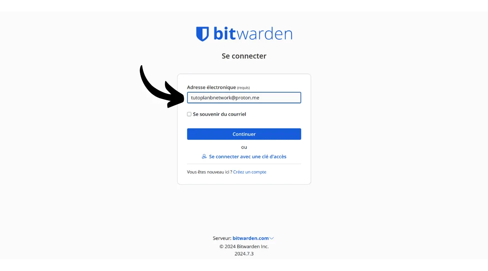
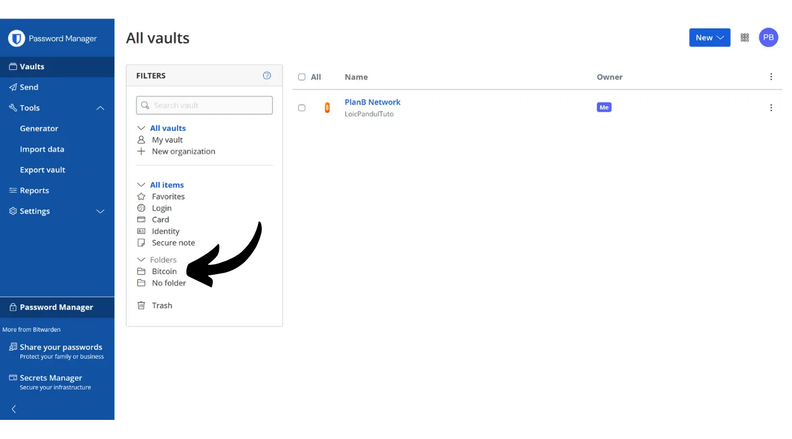
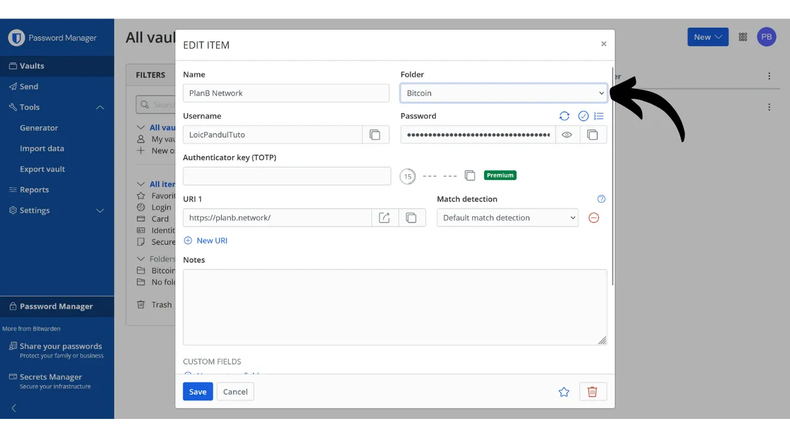

在数字时代，我们需要管理众多在线账户，这些账户涵盖了我们日常生活的各个方面，包括银行、金融平台、电子邮件、文件存储、健康、行政管理、社交网络、视频游戏等。

为了在这些账户上认证自己，我们通常使用一个标识符，通常是电子邮件地址，配以密码。面对无法记住大量独特密码的困境，人们可能会被诱惑去重复使用相同的密码，或者稍微修改一个共同的基础密码以便于记忆。然而，这些做法严重威胁到您账户的安全。

密码的第一个原则是不重复使用它们。每个在线账户都应该受到一个独一无二且完全不同的密码的保护。这一点很重要，因为如果攻击者设法破解了您的一个密码，您不希望他们能够访问您的所有账户。为每个账户设置独特的密码可以隔离潜在的攻击并限制其范围。例如，如果您对视频游戏平台和您的电子邮件使用相同的密码，而该密码通过与游戏平台相关的钓鱼网站被破解，攻击者随后可以轻松访问您的电子邮件并控制您的所有其他在线账户。

第二个基本原则是密码的强度。如果密码很难通过暴力破解（即通过尝试和错误猜测）来猜出，那么这个密码就被认为是强密码。这意味着您的密码必须尽可能随机，长度足够长，并包含多样的字符（小写字母、大写字母、数字和符号）。

在日常生活中应用这两个密码安全原则（唯一性和强度）可能很困难，因为几乎不可能记住所有账户的一个独特、随机且强大的密码。这就是密码管理器发挥作用的地方。

密码管理器可以生成并安全存储强密码，使您能够访问所有在线账户而无需单独记住它们。您只需要记住一个密码，即主密码，它使您能够访问管理器中保存的所有密码。使用密码管理器可以增强您的在线安全性，因为它防止了密码的重复使用，并系统地生成随机密码。但它也通过集中访问您的敏感信息简化了您的账户日常使用。
在本教程中，我们将探索如何设置和使用密码管理器以增强您的在线安全性。我将向您介绍Bitwarden，在另一个教程中，我们将研究另一种叫做KeePass的解决方案。
https://planb.network/tutorials/others/keepass

警告：密码管理器非常适合存储密码，但**您绝不应该在其中存储您的比特币钱包的助记词！**记住，助记词应该专门保存在物理格式中，如纸张或金属。

## Bitwarden简介

Bitwarden适用于初学者和高级用户。它提供了许多好处。首先，Bitwarden是一个多平台解决方案，这意味着您可以将其作为移动应用、网络应用、浏览器扩展和桌面软件使用。

Bitwarden允许您在线保存密码并在所有设备之间同步，同时确保使用您的主密码进行端到端加密。这使您能够例如在计算机和智能手机上访问您的密码，并在两者之间进行同步。由于您的密码是加密的，它们对任何人（包括Bitwarden）都是不可访问的，除非有您的主密码这个解密密钥。
此外，Bitwarden是开源的，这意味着该软件可以由独立专家进行审计。关于定价，Bitwarden提供三种计划：
- 一个免费版本，我们将在本教程中探讨。尽管它是免费的，但它提供的安全级别等同于付费版本。您可以存储无限数量的密码，并同步尽可能多的设备；
- 每年10美元的高级版本，包括额外功能，如文件存储、信用卡备份、配置带物理安全密钥的2FA的能力，以及直接使用Bitwarden访问TOTP 2FA认证；
- 以及每年40美元的家庭计划，将高级版本的好处扩展到六个不同的用户。

在我看来，这些价格是公平的。免费版本是初学者的绝佳选择，而高级版本与市场上其他密码管理器相比，提供了非常好的价值，同时提供了更多的功能。此外，Bitwarden是开源的这一事实是一个主要优势。因此，它是一个特别适合初学者的有趣折衷方案。

Bitwarden的另一个特点是，如果您拥有，例如，家里的NAS，您可以自托管您的密码管理器。通过设置这种配置，您的密码不是存储在Bitwarden的服务器上，而是存储在您自己的服务器上。这让您完全控制密码的可用性。然而，这个选项需要严格的备份管理，以避免任何访问权限的丢失。因此，Bitwarden自托管更适合高级用户，我们将在另一个教程中讨论。

## 如何创建Bitwarden账户？

访问[Bitwarden网站](https://bitwarden.com/)并点击“*开始使用*”。

首先输入您的电子邮件地址和您的姓名或昵称。

接下来，您需要设置您的主密码。正如我们在介绍中看到的，这个密码非常重要，因为它让您访问管理器中保存的所有其他密码。它呈现两个主要风险：丢失和泄露。如果您失去了这个密码的访问权限，您将无法再访问所有的凭证。如果您的密码被盗，攻击者将能够访问您的所有账户。

为了最小化丢失的风险，我建议在纸上物理备份您的主密码，并将其存放在一个安全的地方。如果可能，将此备份密封在一个安全的信封中，定期确保没有其他人访问过它。

为了防止您的主密码被泄露，它必须非常强大。它应该尽可能长，使用各种字符，并且是随机选择的。在2024年，一个安全密码的最低推荐是13个字符，包括数字、小写和大写字母，以及符号，前提是密码是真正随机的。然而，我建议选择至少20个字符的密码，包括所有可能的字符类型，以确保其安全性更长久。

在专用框中输入您的主密码并在下一个框中确认它。

如果您愿意，您可以为您的主密码添加一个提示。然而，我建议不要这样做，因为提示并不提供一个可靠的恢复方法，以防您丢失密码，甚至可能对试图猜测或暴力破解您密码的攻击者有用。作为一般规则，避免创建可能危及您主密码安全的公开提示。
然后点击“*创建账户*”按钮。

现在您可以登录到您的新Bitwarden账户了。输入您的电子邮件地址。

然后输入您的主密码。

现在您已经进入了密码管理器的网页界面。

## 如何设置Bitwarden？

首先，我们将确认我们的电子邮件地址。点击“*发送邮件*”。

然后点击通过电子邮件收到的按钮。

最后，再次登录。

首先，我强烈建议您设置双因素认证（2FA）来保护您的密码管理器。您可以选择使用TOTP应用程序或物理安全密钥。通过激活2FA，每次您登录到您的Bitwarden账户时，不仅需要您的主密码，还需要您的第二因素认证证明。这是一个额外的安全层，特别是在您的主密码纸质备份被泄露的情况下非常有用。

如果您不确定如何设置和使用这些2FA设备，我推荐您跟随这两个其他教程：

https://planb.network/tutorials/others/authy

https://planb.network/tutorials/others/security-key

为此，请进入“*设置*”菜单中的“*安全性*”标签页。

然后点击“*两步登录*”标签页。

在这里，您可以选择您偏好的2FA方法。例如，我将通过点击“*管理*”按钮选择使用TOTP应用程序的2FA。

确认您的主密码。

然后用您的2FA应用程序扫描QR码。

输入您在2FA应用程序上记下的6位数代码，然后点击“*开启*”按钮。
双因素认证已经成功地在您的账户上设置。

现在，如果您尝试重新登录到您的管理器，您首先需要输入您的主密码，然后输入您的2FA应用程序生成的6位动态代码。确保您始终可以访问这个动态代码；没有它，您将无法恢复您的密码。

在设置中，您还可以在“*偏好设置*”标签页中自定义您的管理器。在这里，您可以更改管理器自动锁定前的时间长度，以及界面的语言和主题。

我强烈推荐调整Bitwarden生成的密码长度。默认情况下，长度设置为14个字符，这可能对于最佳安全性来说不够。现在您有了一个管理器来记住所有的密码，您不妨利用它来使用非常强大的密码。
要做到这一点，请转到“*生成器*”菜单。
在这里，您可以将密码长度增加到40，并勾选包含符号的选项。

## 如何使用Bitwarden保护您的账户？

现在您的密码管理器已经设置好了，您可以开始存储在线账户的凭据。要添加新项目，请直接点击屏幕右上角的“*新建项目*”按钮或“*新建*”按钮，然后点击“*项目*”。

在打开的表单中，首先确定要保存的项目的性质。要存储登录凭据，请从下拉菜单中选择“*登录*”选项。

在“*名称*”字段中，为您的凭据输入一个描述性名称。这将使您更容易搜索和组织密码，特别是如果您有大量密码时。例如，如果您想保存PlanB网络站点的凭据，您可以以一种在未来搜索时能立即识别的方式命名此项目。

“*文件夹*”字段允许您将凭据分类到文件夹中。目前，我们还没有创建任何文件夹，但我稍后会向您展示如何做。

在“*用户名*”字段中，输入您的用户名，通常是您的电子邮件地址。
接下来，在“*密码*”字段中，您可以输入您的密码。然而，我强烈推荐让Bitwarden为您生成一个长的、随机的、唯一的密码。这确保了您拥有一个强密码。要使用此功能，请点击要填写的字段上方的双箭头图标。

您可以看到您的密码已经生成。

在“*URI 1*”字段中，您可以输入网站的域名。

最后，在“*备注*”字段中，您可以根据需要添加额外的细节。

当您填写完所有这些字段后，点击“*保存*”按钮。

您的凭据现在出现在您的Bitwarden管理器中。

点击它，您可以访问其详细信息并进行修改。

通过点击右侧的三个小点，您可以快速访问复制密码或用户名。

恭喜您，您已经成功在您的管理器中保存了第一个密码！如果您想更好地组织您的凭据，您可以创建特定的文件夹。要做到这一点，请点击屏幕右上角的“*新建*”按钮，然后选择“*文件夹*”。

为您的文件夹输入一个名称。

然后点击“*保存*”。

您的文件夹现在出现在您的管理器中。
在创建凭证时，您可以为其分配一个文件夹，就像我们之前做的那样，或者通过修改现有的凭证。例如，通过点击我为PlanB Network设置的凭证，我可以选择将其分类到“*比特币*”文件夹中。

这样，您可以结构化您的密码管理器，使找到您的凭证变得更加容易。您可以使用文件夹来组织它们，例如个人、专业、银行、电子邮件、社交网络、订阅、购物、行政管理、流媒体、存储、旅行、健康等。
如果您更喜欢只使用Bitwarden的网页版本，完全可以坚持使用。然后我建议将您的密码管理器添加到浏览器的收藏夹中，以便轻松访问并避免钓鱼风险。然而，Bitwarden还提供了一整套客户端，允许您在各种设备上使用您的管理器，并简化其日常使用。它们特别提供了移动应用、浏览器扩展和桌面软件。让我们一起看看如何设置它们。

## 如何使用Bitwarden浏览器扩展？

首先，如果您愿意，可以设置浏览器扩展。这个扩展作为您的管理器的简化版本，为您提供自动保存新密码、生成安全密码建议以及在网页登录表单上自动填充您的凭证的可能性。

日常使用这个扩展非常方便，但它也可能打开新的攻击途径。因此，一些网络安全专家建议不使用密码管理器的浏览器扩展。然而，如果您选择使用Bitwarden扩展，以下是操作方法：

首先，前往[官方Bitwarden下载页面](https://bitwarden.com/download/#downloads-web-browser)。

从提供的列表中选择您的浏览器。以这个例子来说，我使用的是Firefox，所以我被重定向到Firefox Add-ons Store上的官方Bitwarden扩展。其他浏览器的程序相当类似。

点击“*添加到Firefox*”按钮。

然后，您可以将Bitwarden附加到您的扩展栏中，以便轻松访问。点击扩展以登录。

输入您的电子邮件地址。

然后输入您的主密码。

最后，输入您的认证应用中的6位数代码。

您现在通过浏览器扩展连接到您的Bitwarden管理器了。

例如，如果我回到PlanB Network网站并尝试登录我的账户，您可以看到浏览器中集成的Bitwarden扩展识别登录字段，并自动为我提供之前保存的标识符进行选择。

如果我选择这个标识符，Bitwarden会为我填充登录字段。这个扩展功能允许快速连接到网站，无需从Bitwarden网页应用或软件复制粘贴凭据。 这个扩展还设计有检测新账户创建的功能。例如，在PlanB Network上创建新账户时，Bitwarden会自动建议保存新的标识符。 点击出现的这个建议后，扩展会打开。它允许我输入新标识符的详细信息并生成一个强大的、独一无二的密码。 完成信息输入并点击“*保存*”后，扩展会保存凭据。 然后，扩展会自动将我们的凭据添加到网站上的适当字段中。 ## 如何使用Bitwarden软件？
要安装Bitwarden桌面软件，首先前往[下载页面](https://bitwarden.com/download/#downloads-desktop)。选择并下载与您的操作系统相对应的版本。 下载完成后，继续在您的计算机上安装软件。Bitwarden软件首次启动时，您需要输入您的凭据以解锁您的密码管理器。 然后，您将进入管理器的主页。界面几乎与网页应用相同。 ## 如何使用Bitwarden应用程序？

要从手机访问您的密码，您可以安装Bitwarden移动应用。首先前往[下载页面](https://bitwarden.com/download/#downloads-mobile)，使用您的智能手机扫描与您的操作系统相对应的二维码。 下载并安装官方Bitwarden移动应用。应用首次打开时，输入您的凭据以解锁对密码管理器的访问。 一旦连接，您将能够直接从应用中查看和管理所有密码。 为了增强应用的安全性，我建议进入设置并激活PIN保护。这将在丢失或手机被盗的情况下增加一层额外的安全保障。 ## 如何备份Bitwarden？
为了确保您即使在丢失主密码或Bitwarden服务器受到灾害影响的情况下也永远不会失去对密码的访问，我建议您定期在外部介质上执行加密备份。

这个想法是用与您的主密码不同的密码加密您的所有Bitwarden凭据，并将这个加密备份保存在USB闪存盘或硬盘上，例如，您可以将其保存在家中。然后，您可以将解密密码的物理副本保存在与备份介质存储位置不同的地方。例如，您可以将USB闪存盘保存在家中，并将加密密码的物理副本托付给一位可信赖的朋友。

这种方法确保即使您的备份介质被盗，没有解密密码，您的数据也将保持无法访问。同样，如果没有物理介质，您的朋友也将无法访问您的数据。
然而，如果遇到问题，您可以使用密码和外部介质来重新获取您的凭证，这不依赖于Bitwarden。因此，即使Bitwarden的服务器被摧毁，您仍然有可能找回您的密码。
因此，我建议您定期进行这些备份，以便它们始终包含您最新的凭证。为了避免每次新备份时都麻烦持有加密密码副本的朋友，您可以将这个密码保存在您的密码管理器中。这并不是作为备份的意图，因为您的朋友已经有了一个物理副本，而是为了简化您未来的导出程序。

要进行导出，操作非常简单：转到您的Bitwarden管理器的“*工具*”部分，然后选择“*导出保险库*”。

对于格式，选择“*.json (加密)*”。

然后选择“*密码保护*”选项。

在这里，选择一个强大、独特且随机生成的密码来加密备份非常重要。这确保了，即使您的加密备份被盗，攻击者也无法通过暴力破解来解密它。

点击“*确认格式*”，并输入您的主密码以继续导出。

一旦导出完成，您将在您的下载中找到您的加密备份文件。将其转移到一个安全的外部存储设备，如USB棒或硬盘。根据您的使用情况定期重复此操作。例如，您可以根据您的需要，每周或每月更新备份。