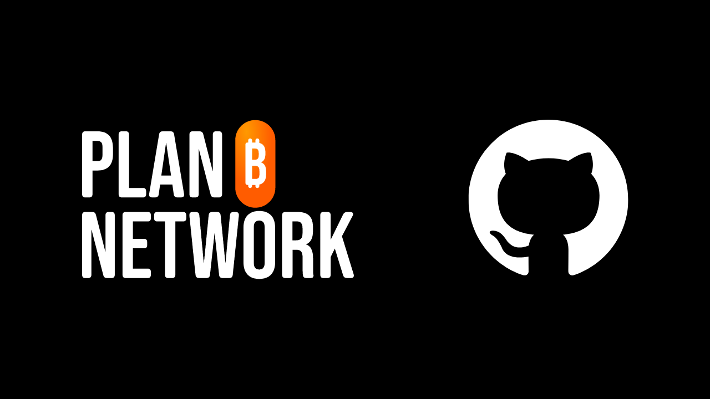
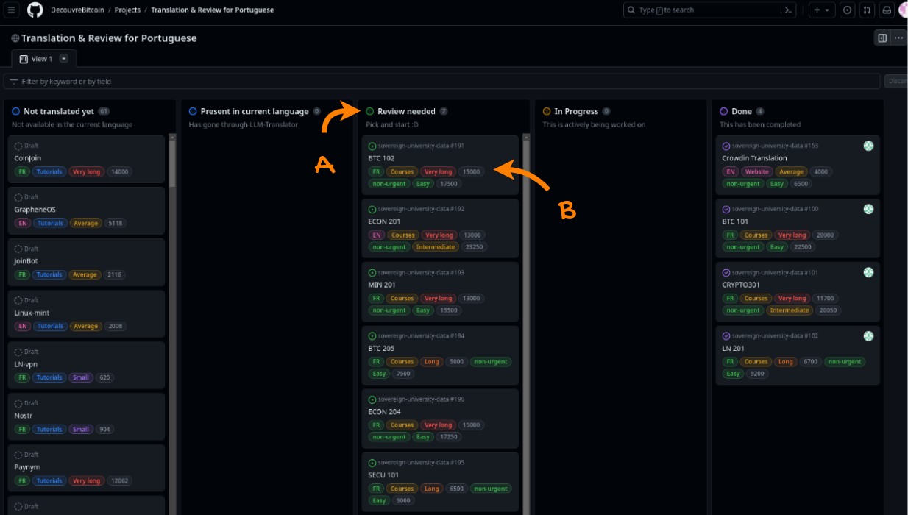
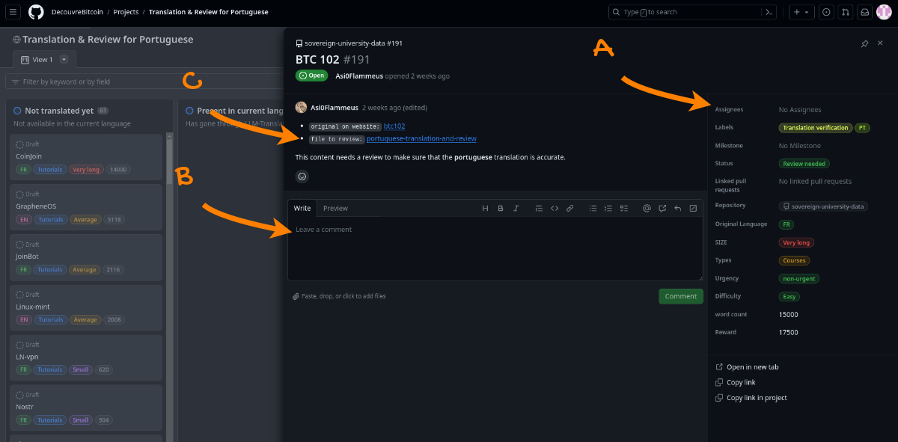
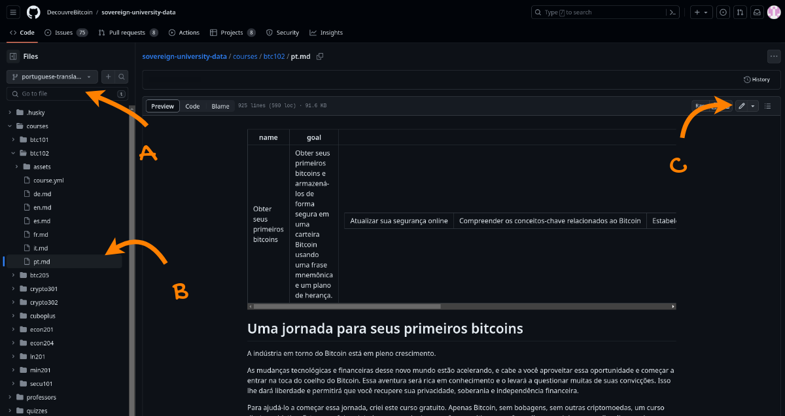
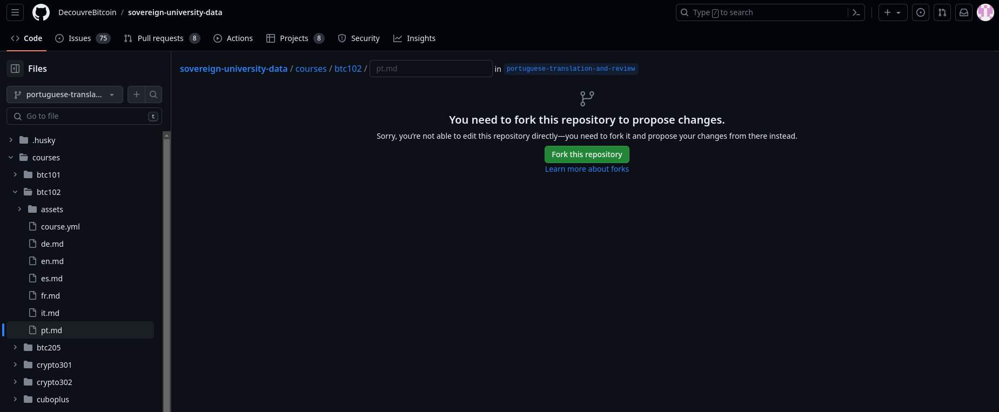
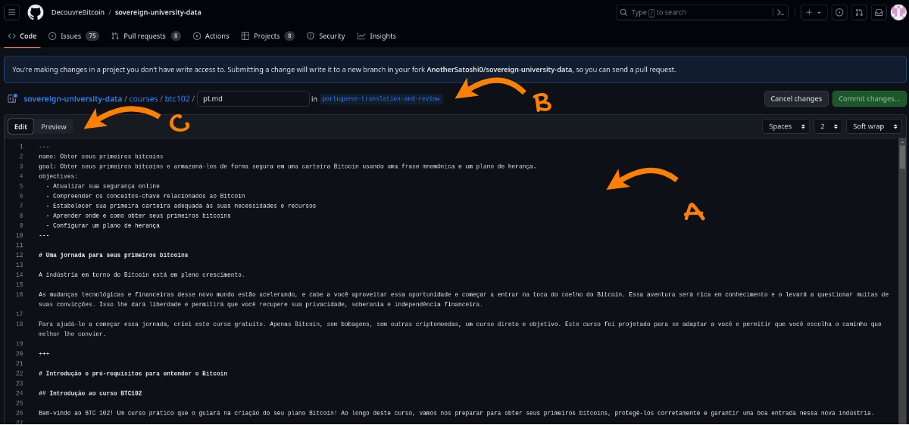
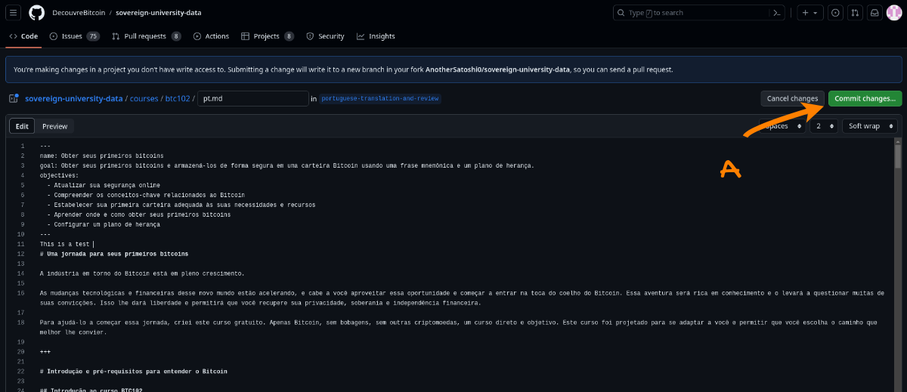
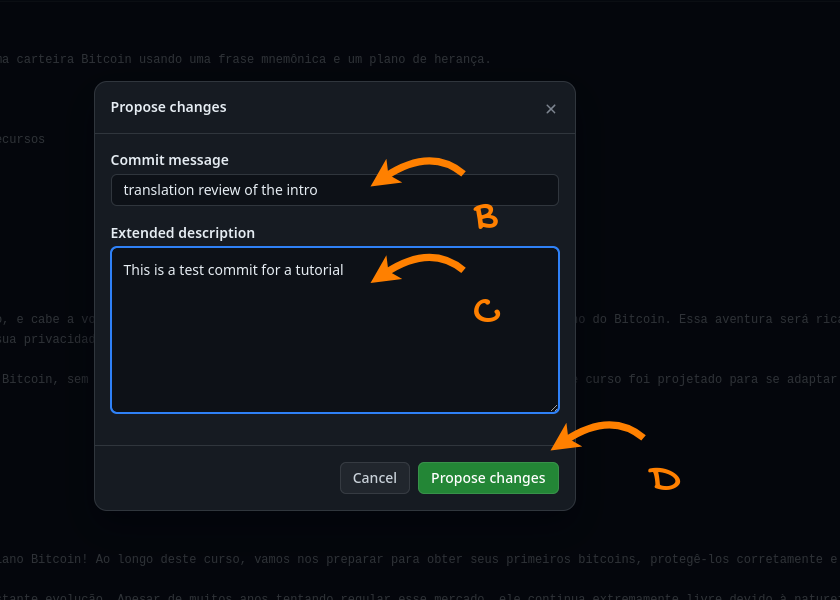
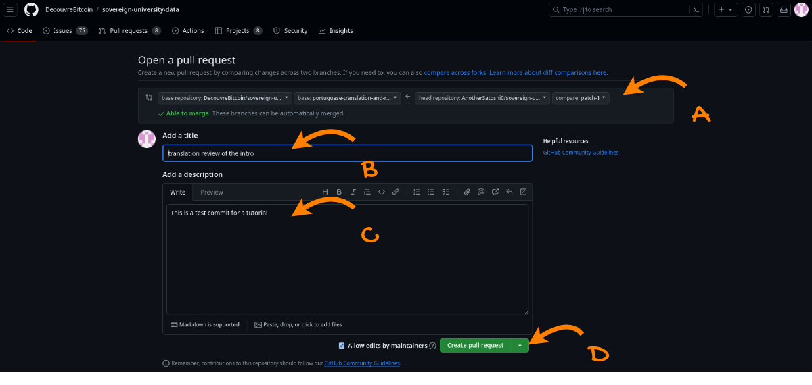

## TL;DR
Pokud chcete recenzovat obsah pro síť PlanB, přejděte na [stránku přidruženého projektu](https://github.com/PlanB-Network/bitcoin-educational-content/projects?query=is%3Aopen) pro váš jazyk. Vyberte obsah, který chcete recenzovat, okomentujte, abyste nám dali vědět, že se úkolu ujímáte, a po dokončení odevzdejte PR na větvi přidružené k vašemu jazyku.

Pokud jste nerozuměli části výše, nebojte se, tento tutoriál je pro vás!

---

## Co je PlanB Network?

Planb.network je zcela nová platforma pro učení se o Bitcoinu prostřednictvím mnoha kurzů a tutoriálů pro každého. Aktuálně je veškerý náš obsah open-source, hostovaný na GitHub repozitáři a otevřený příspěvkům pro recenzi a tvorbu obsahu.

PlanB.network si klade za cíl stát se veřejným prostorem kyberprostoru Bitcoinu, spojovat a podporovat Bitcoinové komunity po celém světě.

## Proč přispívat?

PlanB.network je zásadně vícejazyčný, jelikož naším cílem je učinit zdroje o Bitcoinu přístupné každému po celém světě. Věříme, že jazyk by neměl být překážkou suverénní měny.

Proto používáme přístup Human x AI k dosažení tohoto cíle. Díky našemu [jednoduchému programu](https://github.com/Asi0Flammeus/LLM-Translator) můžeme automaticky přeložit náš obsah do mnoha jazyků. Před jeho publikováním však potřebujeme osobu, která je plynulá v daném jazyce, aby obsah zkontrolovala a zajistila, že je srozumitelný a neobsahuje nevhodné termíny.

Pokud se chcete přidat k nám a budovat tento vzdělávací projekt na podporu vzdělávání o Bitcoinu ve vaší komunitě, můžete začít recenzí kurzu nebo tutoriálu.

Navíc, jelikož Découvre Bitcoin (DB) má na starosti hodnocení příspěvků a my (DB) si ceníme modelu *Value4Value*, odměníme příspěvky k recenzi. Odměna bude záviset na délce obsahu, jazykové přesnosti naší automatické překladu a obtížnosti obsahu.

## Musím umět pracovat s GitHubem?

Nemusíte být expertem na GitHub, abyste mohli recenzovat obsah.
Ačkoli je vždy lepší rozumět tomu, co děláte (a proč), můžete jednoduše následovat níže uvedené pokyny k přispívání.

Pokud však nejste s prací s Git a GitHubem vůbec obeznámeni a chtěli byste se dozvědět více, můžete objevit [náš úvodní článek o těchto nástrojích](https://planb.network/tutorials/others/basics-of-github).

## 1. Vytvořte účet
* Vytvořte si účet na GitHubu, abyste mohli začít přispívat. Pokud potřebujete návod, jak si vytvořit účet na GitHubu, máme také [podrobný tutoriál](https://planb.network/tutorials/others/create-github-account).
## **2. Přejděte na stránku projektu ve vašem jazyce**
* [Stránka projektu](https://github.com/PlanB-Network/bitcoin-educational-content/projects?query=is%3Aopen) obsahuje obsah ve vašem jazyce zobrazený na Kanbanové tabuli.
* Hledejte karty ve sloupci "Review Needed" (viz **A**). To jsou problémy, které můžete recenzovat.
* Každá karta detailně popisuje (viz **B**):
	- **Typ obsahu**: Kurz, tutoriál nebo webová stránka
	- **Obtížnost obsahu**
	- **Naléhavost**
	- **Počet slov**
	- **Přidružená odměna**: Založeno na vlastnostech obsahu a přesnosti překladu (viz [sekce Odměn](https://github.com/PlanB-Network/bitcoin-educational-content?tab=readme-ov-file#sat-reward))

## **3. Najít obsah k recenzi**
* Ve sloupci "Potřebná recenze" klikněte na kartu.
* Karta obsahuje popis s odkazy na původní obsah a soubor k recenzi (viz **A**).
* Pokud si přejete provést recenzi, zanechte komentář, abychom věděli, že na tom budete pracovat (viz **B**).
* Klikněte na odkaz vedle `Soubor k recenzi` (viz **C**)

## **4. Recenzovat a upravovat obsah prostřednictvím rozhraní GitHub**
* Nyní můžete vidět rozhraní GitHub souboru k recenzi.
* Levý panel umožňuje navigovat vaší větví (viz **A**) a soubory (viz **B**).
* Klikněte na ikonu pera, abyste začali recenzi (viz **C**).

* Pokud to děláte poprvé, GitHub vás požádá o vytvoření forku repozitáře.

* Dále se dostanete na rozhraní editoru (viz **A**), kde můžete vidět cestu k souboru a odpovídající větev (viz **B**), a můžete přepínat mezi režimem úprav a režimem náhledu (viz **C**).

NB. Recenze se nejlépe provádí v okně kódu s původním obsahem v samostatném okně vedle něj.

## **5. Potvrdit změny**

* Když chcete ukončit recenzi, můžete změny potvrdit, i když recenze není dokončena – je to trochu jako "uložení změn na GitHubu".
* Klikněte na tlačítko "Potvrdit změny" (viz **A**).

* Přidejte popisnou zprávu o vaší změně (viz **B**).* Přidejte více kontextu do popisu, pokud je to nutné (viz **C**).
* Klikněte na tlačítko "Navrhnout změny" (viz **D**).

* Tím se otevře stránka návrhu PR (Pull Request).

## **6. Vytvořit PR s věnovanou větví**

* Můžete ověřit, že tento PR požaduje sloučení vaší větve s věnovanou větví odpovídajícího jazyka (viz **A**).
* Dejte PR popisný název (viz **B**).
* Přidejte kontext do popisu (viz **C**).
* Pokud není dokončeno, klikněte na šipku vedle "Vytvořit Pull Request" a vyberte "Draft PR" (viz **D**).
* Klikněte na "Draft Pull Request."
* Gratulujeme k vašemu prvnímu PR!

## **7. Pokračovat v recenzi později**
* Pokud jste recenzi nedokončili a přejete si pokračovat ve své práci, přejděte na váš fork repozitáře sovereign-university prostřednictvím vašeho profilu na GitHubu.
* Vyberte odpovídající větev.
* Přejmenujte větev, pokud je to nutné.
* Najděte svůj soubor s obsahem a klikněte na tlačítko tužky, abyste pokračovali v recenzi.

## **8. Potvrďte přímo na vaší vlastní větvi**
* Provádějte potvrzení, aby jste ověřili změny přímo na vaší větvi, jak postupujete.

## **9. Dokončete a nastavte PR jako připravené k recenzi**
* Přejděte na kartu "Pull Requests".
* Vyberte svůj PR.
* Klikněte na "Připraveno k recenzi".

## 10. Čekání na recenzi
* Po schválení vás Découvre Bitcoin kontaktuje, aby vám poslal vaši odměnu přes LN.
* Pokud si přejete začít znovu, vraťte se ke kroku 2 a pokračujte ve přispívání k dalším obsahům.
* Pokud máte připomínky, otázky nebo komentáře k tomuto projektu, můžete poslat DM na Telegramu na @asi0_flammeus.