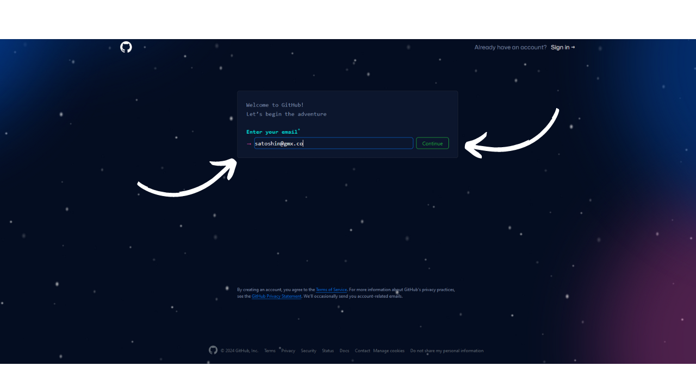
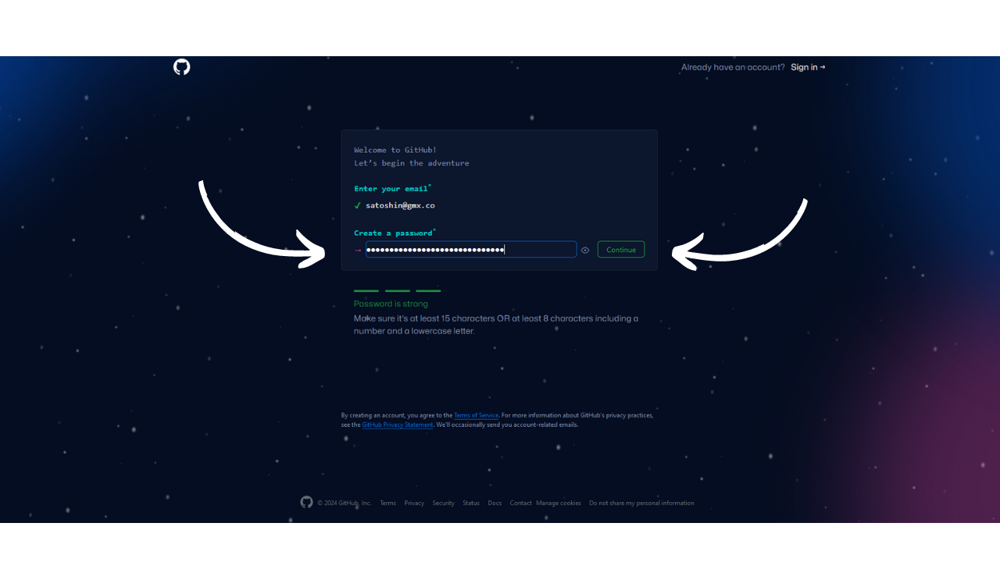
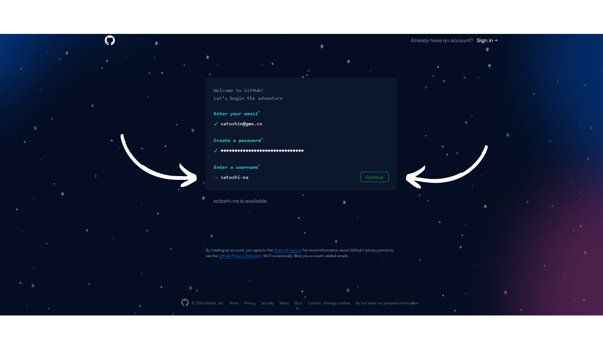
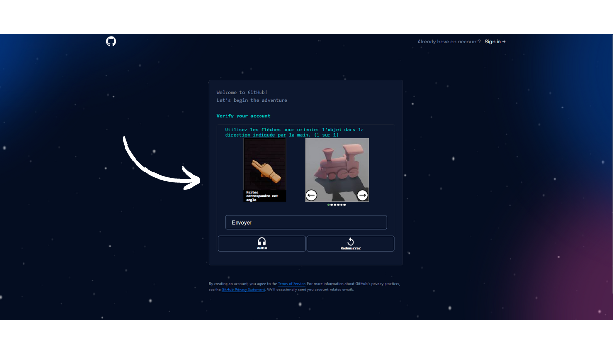
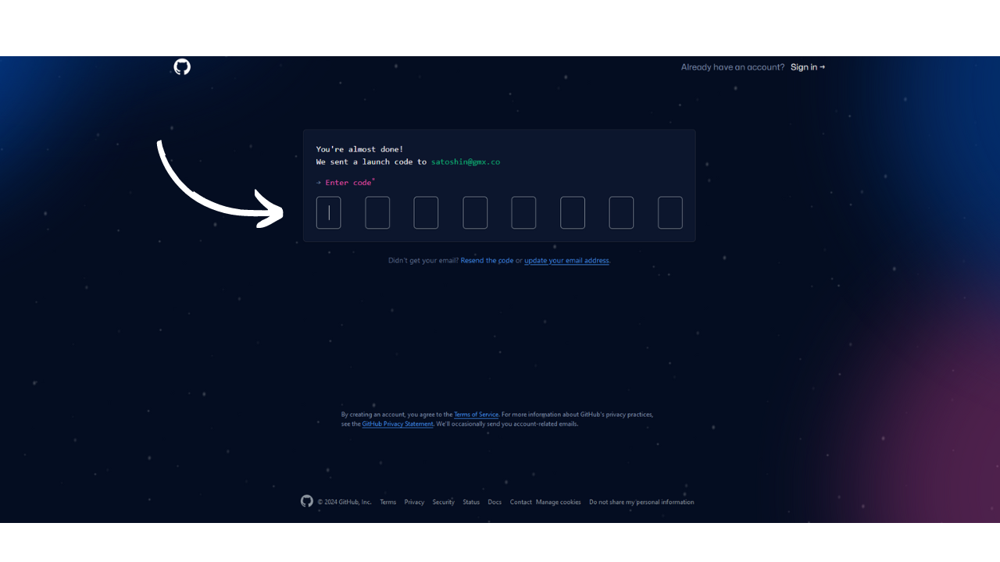
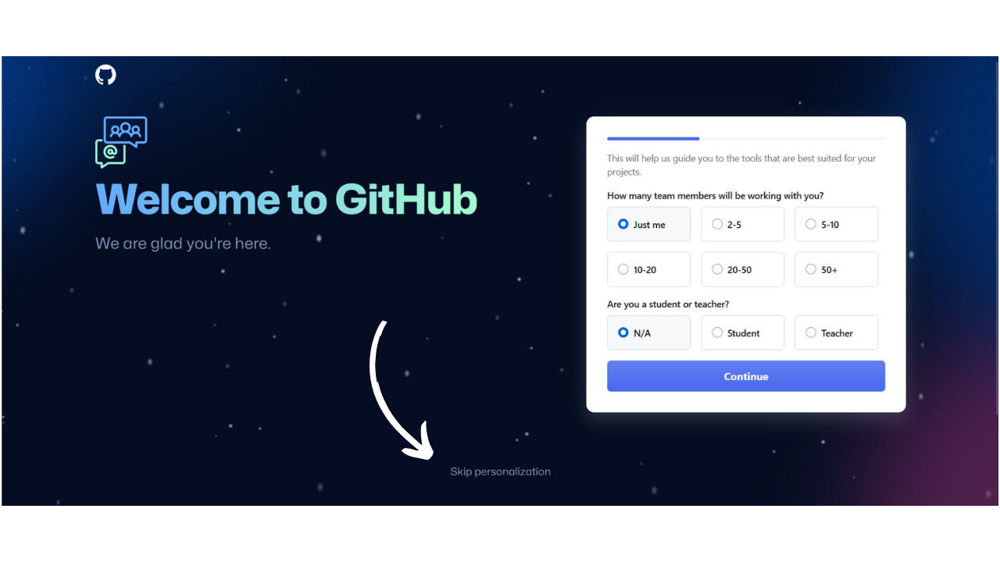
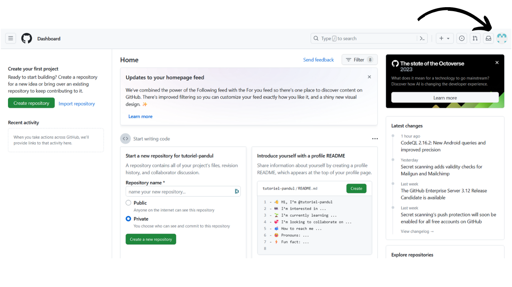
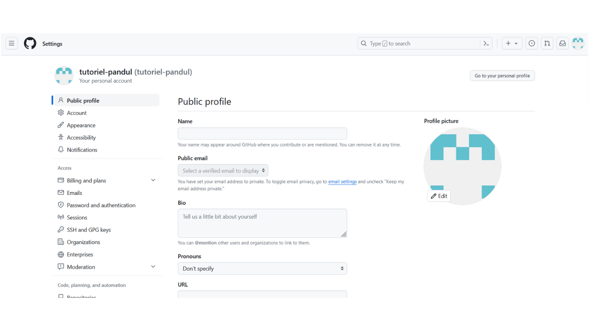
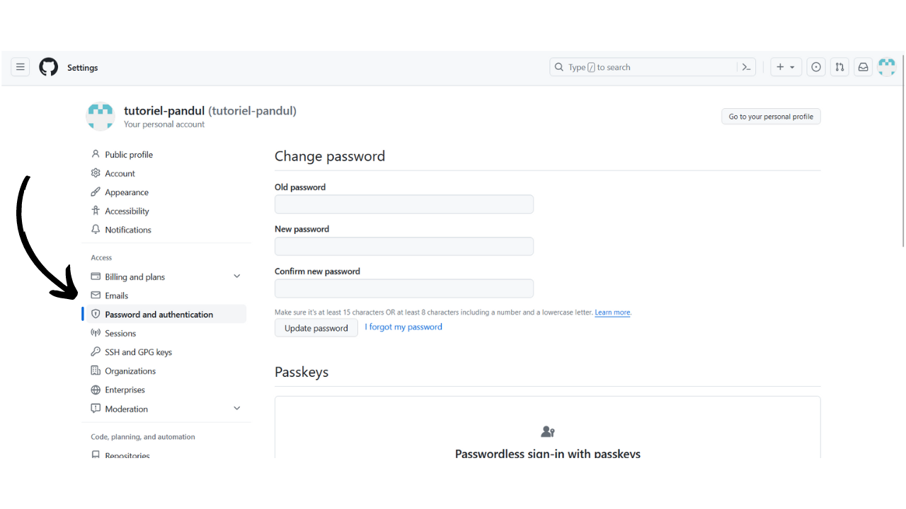

La misión de PlanB es proporcionar recursos educativos de primer nivel sobre Bitcoin, disponibles en tantos idiomas como sea posible. Todo el contenido publicado en el sitio es de código abierto y alojado en GitHub, lo que permite a cualquier persona participar en enriquecer la plataforma. Las contribuciones pueden tomar varias formas: corregir y revisar textos existentes, traducir a otros idiomas, actualizar información o crear nuevos tutoriales aún no disponibles en nuestro sitio.

Si deseas contribuir a la Red PlanB, necesitarás una cuenta de GitHub. En este tutorial, te guiaremos paso a paso sobre cómo crear tu propia cuenta, configurarla y asegurarla adecuadamente.

- Ve a [https://github.com/signup](https://github.com/signup). 
- Ingresa tu dirección de correo electrónico, luego haz clic en el botón verde `Continue`:

- Elige una contraseña fuerte, luego haz clic en el botón verde `Continue`:

- A continuación, elige tu nombre de usuario. Puedes revelar tu identidad real o usar un pseudónimo. Luego, haz clic en el botón verde `Continue`:

- Completa el Captcha:

- Se te enviará un correo electrónico que contiene un código de confirmación; necesitarás ingresarlo para finalizar la creación de tu cuenta:

- Rellena las preguntas si quieres que GitHub te guíe hacia ciertas herramientas, o haz clic en `skip personalization` para saltar:

- Elige el plan gratuito haciendo clic en el botón `Continue for free`:

- Luego serás redirigido a tu panel de control. 
- Si lo deseas, puedes personalizar tu cuenta haciendo clic en tu foto de perfil ubicada en la parte superior derecha de la pantalla, luego accediendo al menú `Settings`:

- En esta sección, tienes la opción de agregar una nueva foto de perfil, seleccionar un nombre, personalizar tu biografía o agregar un enlace a tu sitio web personal:

- También recomiendo visitar el menú `Password and authentication` para configurar al menos la autenticación de dos factores:
