La mission de PlanB est de mettre à disposition des ressources éducatives de premier plan sur Bitcoin, et ce, dans un maximum de langues. L'intégralité des contenus publiés sur le site est open-source et est hébergée sur GitHub, offrant ainsi la possibilité à quiconque de participer à l'enrichissement de la plateforme. Les contributions peuvent prendre diverses formes : correction et relecture des textes existants, production de formations, traduction dans d'autres langues, mise à jour des informations ou encore création de nouveaux tutoriels encore absents de notre site.

Si vous souhaitez ajouter un nouveau tutoriel complet ou une formation sur PlanB Network, vous allez devoir créer votre profil de professeur. Cela vous permettra d'être correctement crédité pour le contenu que vous produisez sur le site web. 
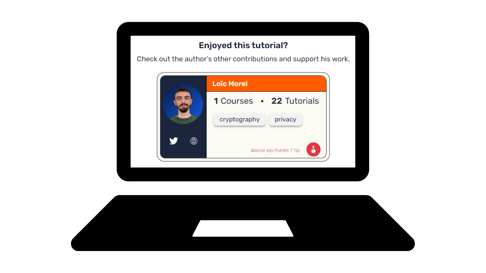
Si vous avez précédemment contribué à PlanB Network, vous possédez déjà un identifiant de contributeur. Vous pouvez le retrouver dans votre dossier de professeur accessible [via cette page](https://github.com/DecouvreBitcoin/sovereign-university-data/tree/dev/professors). Si c'est votre cas, vous pouvez passer ce tutoriel et commencer directement à contribuer.


Découvrons ensemble comment ajouter un nouveau professeur dans ce tutoriel !

## Prérequis

**Logiciels requis pour suivre mon tutoriel :**
- [GitHub Desktop](https://desktop.github.com/)
- Un éditeur de code ([VSC](https://code.visualstudio.com/) ou [Sublime Text](https://www.sublimetext.com/))

**Prérequis avant de commencer le tutoriel :**
- Avoir un [compte GitHub](https://github.com/signup).
- Avoir un fork du [dépôt source de PlanB Network](https://github.com/DecouvreBitcoin/sovereign-university-data).

**Si vous avez besoin d'aide pour obtenir ces prérequis, mes autres tutoriels vous guideront :**
- **[Comprendre Git et GitHub](https://planb.network/fr/tutorials/others/basics-of-github)**
- **[Créer un compte GitHub](https://planb.network/fr/tutorials/others/create-github-account)**
- **[Configurer votre environnement de travail](https://planb.network/fr/tutorials/others/github-desktop-work-environment)**

## Comment créer un nouveau profil de professeur ?

- Ouvrez votre navigateur et dirigez-vous vers la page de votre fork du dépôt de PlanB. L'URL de votre fork devrait ressembler à : `https://github.com/[username]/sovereign-university-data`
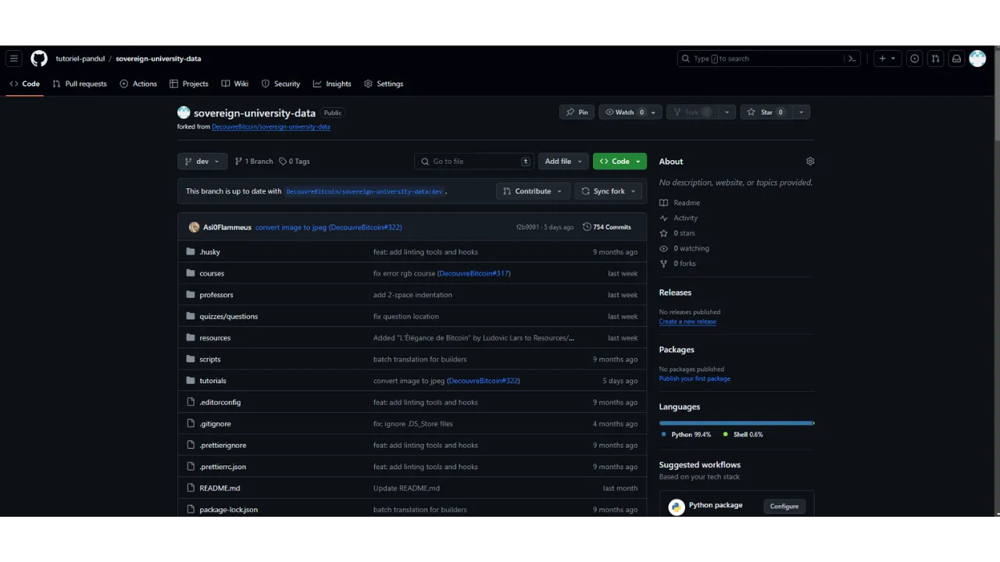
- Assurez-vous d'être sur la branche principale `dev` puis cliquez sur le bouton `Sync fork`. Si votre fork n'est pas à jour, GitHub vous proposera de mettre à jour votre branche. Procédez à cette synchronisation.

- Si, au contraire, votre branche est déjà à jour, GitHub vous en informera :

- Ouvrez le logiciel GitHub Desktop et assurez-vous que votre fork est correctement sélectionné dans le coin supérieur gauche de la fenêtre :

- Cliquez sur le bouton `Fetch origin`.

- Si votre dépôt local est déjà à jour, GitHub Desktop ne suggérera aucune action supplémentaire. Dans le cas contraire, l'option `Pull origin` apparaîtra. Cliquez sur ce bouton afin de mettre à jour votre dépôt local :
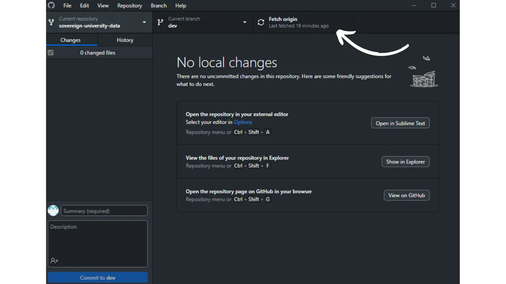
- Vérifiez que vous êtes bien sur la branche principale `dev` :

- Cliquez sur cette branche, puis cliquez sur le bouton `New Branch` :

- Assurez-vous que la nouvelle branche soit basée sur le dépôt source, à savoir `DecouvreBitcoin/sovereign-university-data`.

- Nommez votre branche de manière à ce que le titre soit clair quant à son objectif, en utilisant des tirets pour séparer chaque mot. Puisque cette branche est destinée à l'ajout d'un profil de professeur, un exemple de nom pourrait être : `add-professor-[your-name]`. Après avoir saisi le nom, cliquez sur `Create branch` pour confirmer sa création :
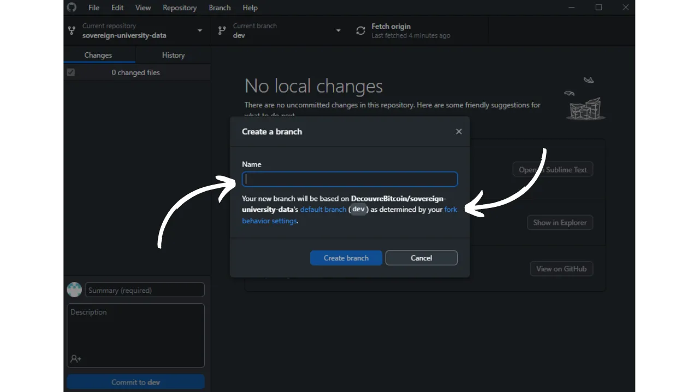
- Cliquez maintenant sur le bouton `Publish branch` afin d'enregistrer votre nouvelle branche de travail sur votre fork en ligne sur GitHub :

- À présent, sur GitHub Desktop, vous devriez vous trouver sur votre nouvelle branche. Cela signifie que toutes les modifications apportées localement sur votre ordinateur seront exclusivement enregistrées sur cette branche spécifique. Aussi, tant que cette branche reste sélectionnée sur GitHub Desktop, les fichiers visibles localement sur votre machine correspondent à ceux de cette branche (`add-professor-your-name`), et non à ceux de la branche principale (`dev`) :

- Pour ajouter votre profil de professeur, ouvrez votre explorateur de fichiers et dirigez-vous vers votre dépôt local, dans le dossier `professors`. Vous le trouverez sous le chemin :`\GitHub\sovereign-university-data\professors`.

- Au sein de ce dossier, créez un nouveau dossier nommé avec votre nom ou votre pseudonyme. Veillez à ce qu'il n'y ait aucun espace dans le nom du dossier. Ainsi, si votre nom est « Loic Pandul » et qu'aucun autre professeur ne porte ce nom, le dossier à créer sera nommé `loic-pandul` :
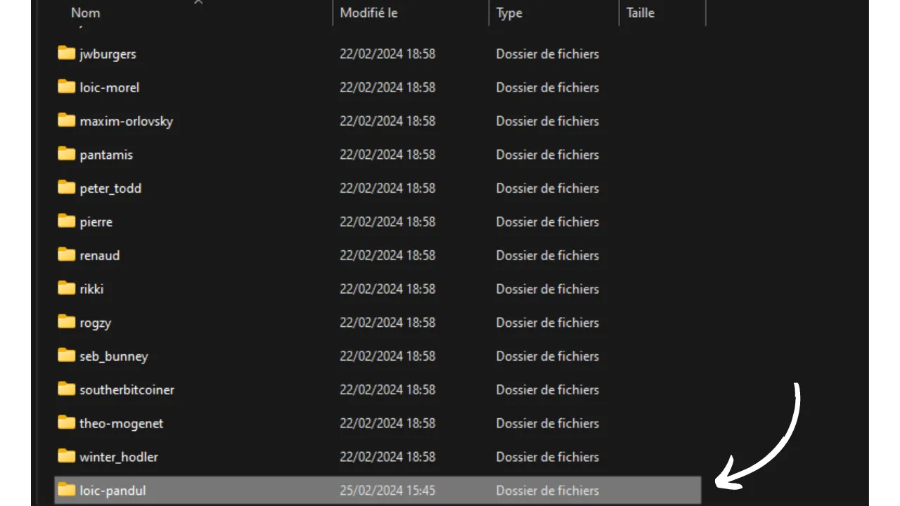
- Pour vous faciliter la tâche, vous pouvez déjà copier et coller tous les documents d'un autre professeur dans votre propre dossier. Nous procéderons ensuite à la modification de ces documents afin de les personnaliser selon votre profil :
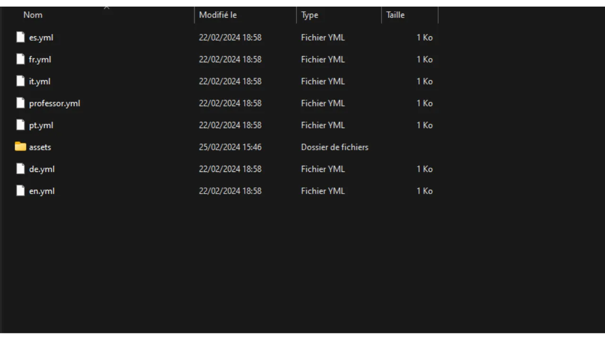
- Commencez par vous diriger vers le dossier `assets`. Supprimez l'image de profil du professeur que vous avez précédemment copié, et remplacez-la par votre propre image de profil. Il est impératif que cette image soit au format `.webp` et qu'elle porte le nom `profile`, donnant ainsi le nom de fichier complet `profile.webp`. Attention, cette image sera publiée sur Internet et accessible à tous :

- Ensuite, ouvrez le fichier `professor.yml` avec votre éditeur de code (VSC ou Sublime Text par exemple). Vous arriverez sur le fichier copié depuis un professeur déjà existant :

- Vous devez ensuite actualiser les informations existantes avec les vôtres :
	- **name :** inscrivez votre nom ou votre pseudonyme ;
	- **links :** indiquez vos comptes sur les réseaux sociaux tels que Twitter et Nostr, ainsi que l'URL de votre site web personnel (facultatif) ;
	- **affiliation :** mentionnez le nom de l'entreprise qui vous emploie (facultatif) ;
	- **tags :** spécifiez vos domaines de spécialisation parmi la liste suivante, en sachant que vous pouvez ajouter vos propres thématiques. Veillez toutefois à limiter le nombre de tags à 4 au maximum pour garantir une bonne UI :
	    - privacy,
	    - cryptography,
	    - bitcoin,
	    - mining,
	    - lightning-network,
	    - economy,
	    - history,
	    - merchants,
	    - security,
	    - ...
	- **tips :** fournissez votre adresse Lightning pour les donations afin de permettre aux lecteurs de vos futurs tutoriels de vous envoyer quelques sats (facultatif) ;
	- **company :** si vous en possédez une, indiquez le nom de votre entreprise (facultatif).Vous devez ensuite actualiser les informations existantes avec les vôtres :
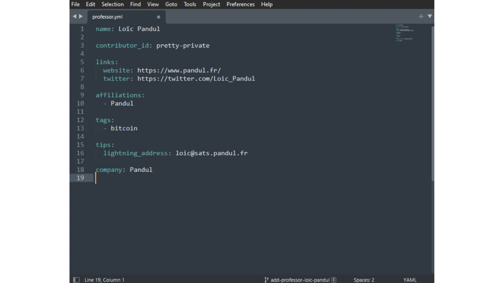
- Vous devez également modifier le `contributor-id`. Cet identifiant sert à vous reconnaître sur le site web, mais n'est pas rendu public en dehors de GitHub. Vous êtes libre de choisir n'importe quelle combinaison de deux mots, en vous référant à [la liste anglaise de 2048 mots du BIP39](https://github.com/bitcoin/bips/blob/master/bip-0039/english.txt). N'oubliez pas d'insérer un tiret entre les deux mots choisis. Par exemple, ici, j'ai choisi `crazy-cactus` :

- Une fois que vous avez terminé la modification du document `professor.yml`, cliquez sur `File > Save` pour enregistrer votre fichier. Vous pouvez ensuite quitter votre éditeur de code :

- Au sein de votre dossier de professeur, vous pouvez supprimer les documents rédigés dans les langues qui ne vous concernent pas, qui étaient initialement copiés d'un autre professeur. Gardez exclusivement le fichier correspondant à votre langue natale. Par exemple, dans mon cas, je n'ai conservé que le fichier `fr.yml`, étant donné que ma langue est le français :
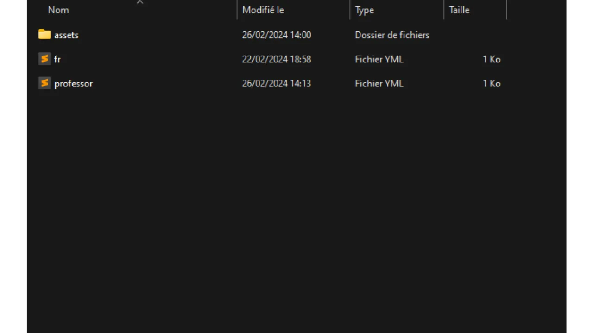
- Double-cliquez sur ce fichier pour l'ouvrir avec votre éditeur de code.

- Dans ce fichier, vous avez la possibilité d'inscrire votre biographie complète sous la rubrique `bio` et un résumé ou un titre succinct sous `short_bio` :

- Après avoir sauvegardé votre document `fr.yml`, il est nécessaire de créer une copie de ce fichier pour chacune des six langues suivantes :
	- Allemand (DE) ;
	- Anglais (EN) ;
	- Français (FR) ;
	- Espagnol (ES) ;
	- Italien (IT) ;
	- Portugais (PT).

- Procédez au copier-coller de votre fichier original, puis traduisez chaque document dans la langue correspondante. Si vous maîtrisez la langue, vous pouvez effectuer la traduction manuellement. Autrement, n'hésitez pas à utiliser un outil de traduction automatique ou un chat bot :
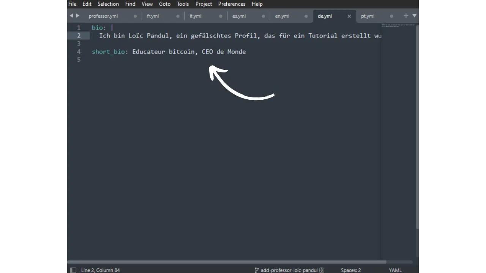
- Si vous préférez, il est également possible de ne conserver la biographie qu'en votre langue natale ; nous nous chargerons alors de la traduire après la soumission de votre Pull Request.

- Votre dossier de professeur devrait donc ressembler à cela :
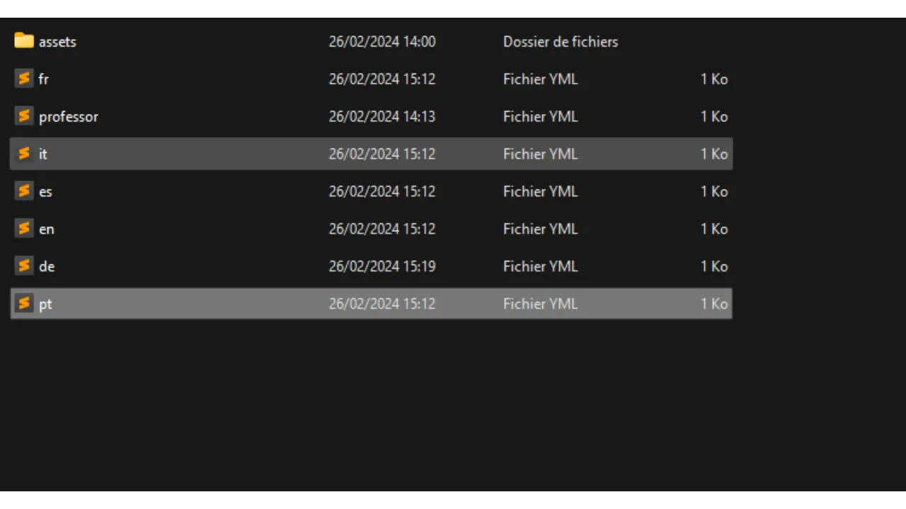
```bash
first-name-last-name/
├── fr.yml
├── it.yml
├── es.yml
├── en.yml
├── de.yml
├── pt.yml
├── professor.yml
└── assets/
    └── profile.webp
```
- Retournez à présent sur GitHub Desktop.
- Sur la gauche de votre fenêtre, vous devriez observer l'ensemble des modifications apportées aux documents, spécifiques à votre branche. Assurez-vous que ces modifications sont bien justes :
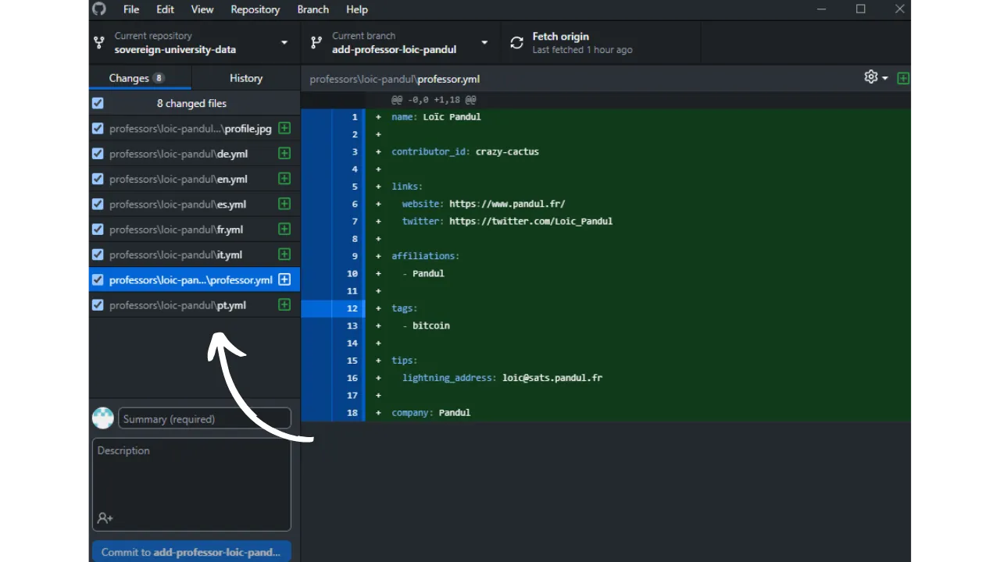
- Si les modifications vous semblent correctes, ajoutez un titre pour votre commit. Un commit est une sauvegarde des modifications apportées à la branche, accompagnée d'un message descriptif, permettant de suivre l'évolution d'un projet dans le temps. 
- Une fois le titre saisi, appuyez sur le bouton bleu `Commit to [your branch]` pour valider ces modifications :
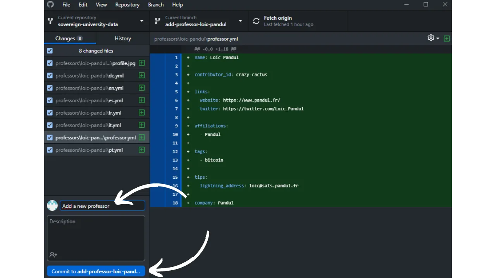
- Cliquez ensuite sur le bouton `Push origin`. Cela va envoyer votre commit sur votre fork :

- Si vous avez terminé vos modifications pour cette branche, cliquez maintenant sur le bouton `Preview Pull Request` :


- Vous pouvez vérifier une dernière fois que vos modifications sont bien justes, puis cliquez sur le bouton `Create pull request` :

- Vous allez être automatiquement renvoyé sur votre navigateur sur GitHub dans la page de préparation de votre Pull Request. Une Pull Request est une demande faite pour intégrer les modifications de votre branche vers la branche de principale du dépôt de PlanB Network, qui permet la revue et la discussion des changements avant leur fusion :

- Sur cette page de préparation, indiquez un titre qui résume brièvement les modifications que vous souhaitez fusionner avec le dépôt source. 
- Ajoutez un bref commentaire décrivant ces changements. 
- Après avoir complété ces étapes, cliquez sur le bouton vert `Create pull request` pour confirmer la demande de fusion :

- Votre PR sera alors visible dans l'onglet `Pull Request` du dépôt principal de PlanB Network. Il ne vous reste plus qu'à patienter jusqu'à ce qu'un administrateur vous contacte pour confirmer la fusion de votre contribution ou pour solliciter d'éventuelles modifications complémentaires :
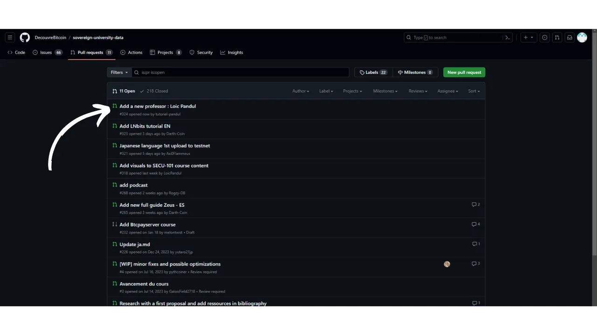
- Après la fusion de votre PR avec la branche principale, il est recommandé de supprimer votre branche de travail (`add-professor-your-name`) pour maintenir un historique propre sur votre fork. GitHub vous proposera cette option automatiquement sur la page de votre PR :
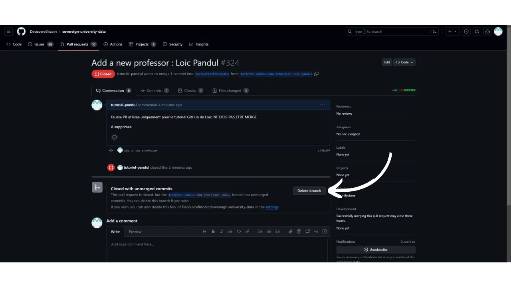
- Sur le logiciel GitHub Desktop, vous pouvez vous replacer sur la branche principale de votre fork (`dev`) :

- Si vous désirez apporter des modifications à votre profil après avoir déjà soumis votre PR, la démarche à suivre dépend de l'état actuel de votre PR :
	- Si votre PR est toujours ouverte et n'a pas encore été fusionnée, effectuez les modifications localement en restant sur la même branche. Une fois les modifications finalisées, utilisez le bouton `Push origin` pour ajouter un nouveau commit à votre PR encore ouverte ;
	- Dans le cas où votre PR a déjà été fusionnée avec la branche principale, vous devrez refaire le processus depuis le début en créant une nouvelle branche, puis en soumettant une nouvelle PR. Assurez-vous que votre dépôt local soit synchronisé avec le dépôt source de PlanB Network avant de procéder.


