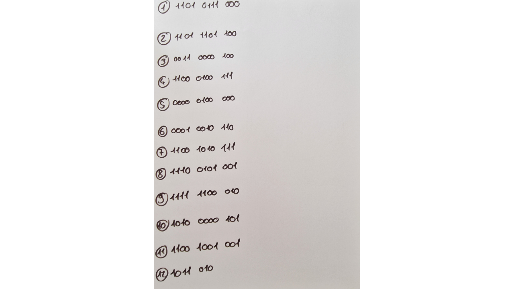
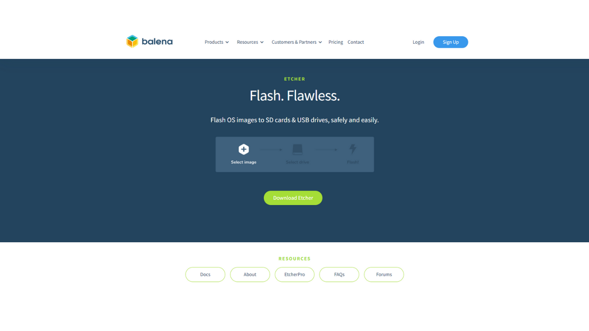
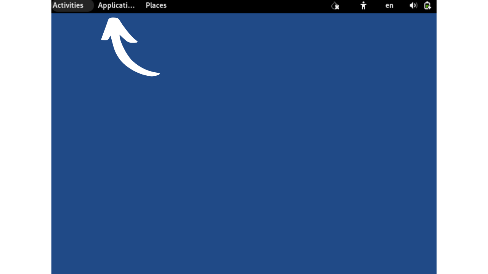
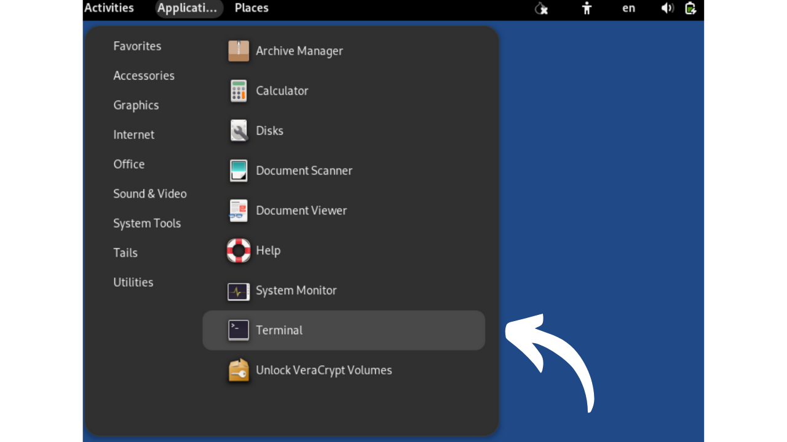
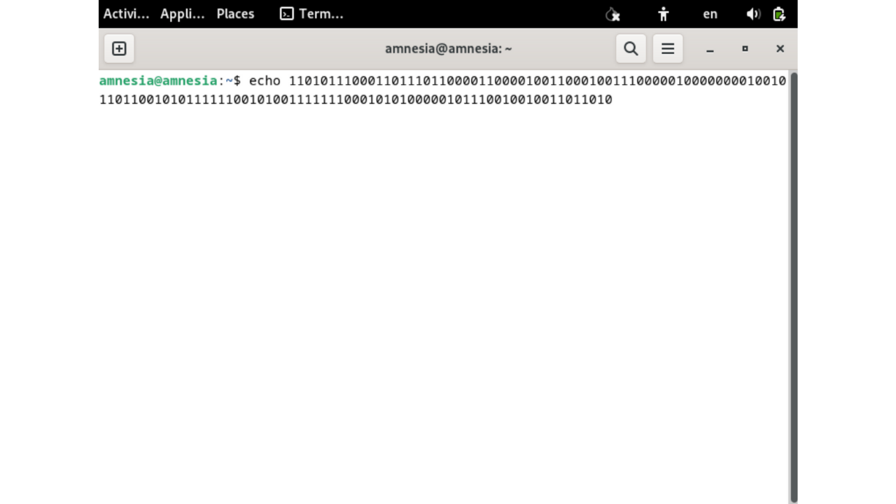
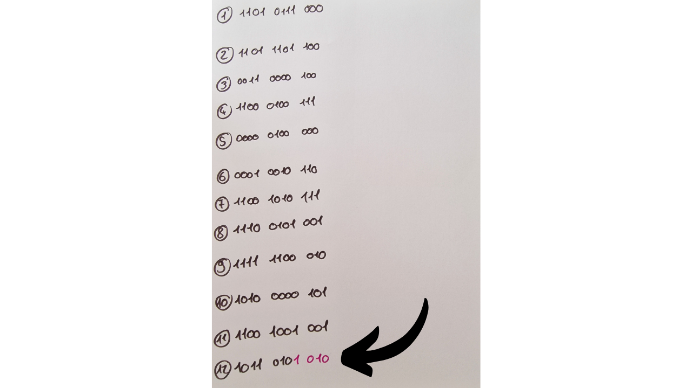
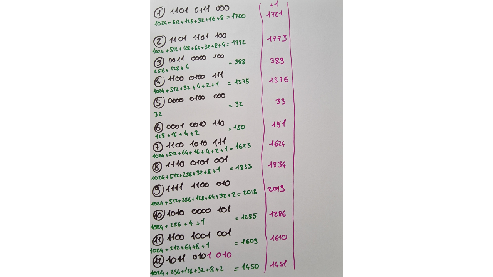
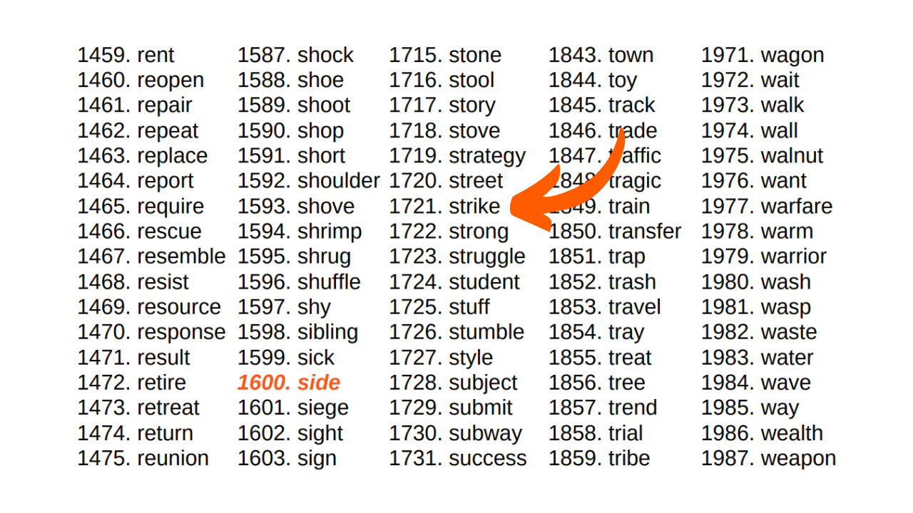
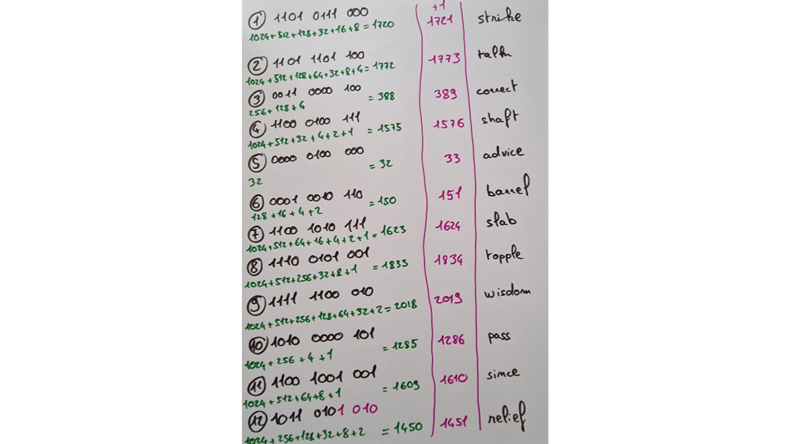

Tässä oppaassa opit, kuinka voit manuaalisesti luoda palautuslauseen Bitcoin-lompakolle käyttäen nopanheittoa.

**VAROITUS:** Mnemonisen lauseen turvallisessa luomisessa on tärkeää, ettei sen luomisen aikana jätetä digitaalista jälkeä, mikä on lähes mahdotonta. Muussa tapauksessa lompakko tarjoaisi liian suuren hyökkäyspinnan, mikä merkittävästi lisäisi riskiä bitcoinejesi varastamisesta. **Siksi on erittäin suositeltavaa olla siirtämättä varoja lompakkoon, joka riippuu itse luomastasi palautuslauseesta.** Vaikka seuraisit tätä opasta kirjaimellisesti, on olemassa riski, että palautuslause voisi joutua vaaraan. **Tästä syystä tätä opasta ei tulisi soveltaa oikean lompakon luomiseen.** Hardware-lompakon käyttäminen tähän tehtävään on paljon vähäriskisempää, sillä se luo lauseen offline-tilassa, ja todelliset kryptografit ovat harkinneet laadukkaiden entropialähteiden käyttöä.

Tätä opasta voi seurata vain kokeellisiin tarkoituksiin fiktiivisen lompakon luomiseksi, ilman aikomusta käyttää sitä oikeiden bitcoinien kanssa. Kokemus tarjoaa kuitenkin kaksi etua:
- Ensinnäkin se mahdollistaa paremman ymmärryksen Bitcoin-lompakkosi perusmekanismeista;
- Toiseksi, se opettaa sinulle, kuinka se tehdään. En sano, että se olisi hyödyllistä jonain päivänä, mutta saattaa olla!

## Mikä on mnemoninen lause?
Palautuslause, jota kutsutaan joskus myös "mnemoniseksi", "siemenlauseeksi" tai "salaisuuslauseeksi", on yleensä 12 tai 24 sanasta koostuva järjestys, joka on luotu pseudo-satunnaisesti entropian lähteestä. Pseudo-satunnainen järjestys täydennetään aina tarkistussummalla.

Mnemoninen lause yhdessä mahdollisen salasanafraasin kanssa käytetään deterministisesti johdettujen kaikkien HD (Hierarkkinen Deterministinen) lompakon avainten luomiseen. Tämä tarkoittaa, että tästä lauseesta on mahdollista deterministisesti luoda ja uudelleen luoda kaikki Bitcoin-lompakon yksityiset ja julkiset avaimet ja siten päästä käsiksi niihin liittyviin varoihin.

Tämän lauseen tarkoitus on tarjota helppokäyttöinen keino bitcoinien varmuuskopiointiin ja palauttamiseen. On ehdottoman tärkeää säilyttää mnemoninen lause turvallisessa ja suojatussa paikassa, sillä kuka tahansa tämän lauseen hallussa oleva henkilö pääsisi käsiksi vastaavan lompakon varoihin. Jos sitä käytetään perinteisen lompakon yhteydessä ilman valinnaista salasanafraasia, se muodostaa usein SPOF:n (Single Point Of Failure).
Yleensä tämä lause annetaan sinulle suoraan lompakkoa luodessasi, ohjelmiston tai hardware-lompakon toimesta. On kuitenkin myös mahdollista luoda tämä lause itse ja syöttää se sitten valitulle alustalle lompakon avainten johtamiseksi. Tämä on se, mitä opimme tekemään tässä oppaassa.

## Tarvittavien materiaalien valmistelu
Oman palautuslauseesi luomiseksi käsin tarvitset:
- Paperiarkin;
- Kynän tai lyijykynän, mieluiten eri väreissä järjestelyn helpottamiseksi;
- Useita noppia, jotta voidaan minimoida epätasapainoisen nopan aiheuttamat vinoumat;
- [2048 BIP39-sanan lista](https://github.com/PlanB-Network/bitcoin-educational-content/tree/dev/tutorials/others/generate-mnemonic-phrase/assets/BIP39-WORDLIST.pdf) tulostettuna.

Myöhemmin tulee tarpeelliseksi käyttää tietokonetta terminaalin kanssa tarkistussumman laskemiseksi. Juuri tästä syystä neuvon vastaan manuaalista mnemonisen lauseen luomista. Mielestäni tietokoneen käyttö, vaikka tässä oppaassa mainittujen varotoimien alaisena, lisää merkittävästi lompakon haavoittuvuutta.
Kokeellisessa lähestymistavassa "kuvitteellisen lompakon" osalta on mahdollista käyttää tavallista tietokonetta ja sen terminaalia. Kuitenkin, jos halutaan noudattaa tarkempaa lähestymistapaa, jolla pyritään minimoimaan fraasisi vaarantumisen riskit, ihanteellista olisi käyttää internetistä irrotettua tietokonetta (mieluiten ilman wifi-komponenttia tai RJ45-kaapeliliitäntää), joka on varustettu vähimmäismäärällä oheislaitteita (kaikki niistä tulisi liittää kaapelilla, välttäen Bluetoothia), ja ennen kaikkea, käyttöjärjestelmänä tulisi olla amneesinen Linux-jakelu, kuten [Tails](https://tails.boum.org/index.fr.html), joka on käynnistetty irrotettavasta mediasta.


Todellisessa kontekstissa olisi ratkaisevan tärkeää varmistaa työtilasi luottamuksellisuus valitsemalla sijainti, joka on suojassa uteliailta katseilta, ilman ihmisten liikennettä ja vapaa kameroista (web-kamerat, puhelimet...).
On suositeltavaa käyttää suurta määrää noppia lieventämään mahdollisesti epätasapainoisen nopan vaikutusta entropiaan. Ennen niiden käyttöä on suositeltavaa tarkistaa nopat: tämä voidaan saavuttaa testaamalla niitä suolalla kyllästetyssä vedessä, joka mahdollistaa noppien kellumisen. Sen jälkeen heitä jokaista noppaa noin kaksikymmentä kertaa suolavedessä, tarkkaillen tuloksia. Jos yksi tai kaksi tahkoa ilmestyvät suhteettoman usein verrattuna muihin, jatka testiä useammilla heitoilla. Tasaisesti jakautuneet tulokset osoittavat, että noppa on luotettava. Kuitenkin, jos yksi tai kaksi tahkoa säännöllisesti dominoivat, nämä nopat tulisi jättää syrjään, sillä ne voivat vaarantaa muistisanojesi entropian ja siten lompakkosi turvallisuuden.
Todellisissa olosuhteissa näiden tarkistusten suorittamisen jälkeen olisit valmis generoimaan tarvittavan entropian. Kokeellisen kuvitteellisen lompakon luomiseen osana tätä opasta voit luonnollisesti jättää nämä valmistelut väliin.

## Muutamia muistutuksia palautusfraasista
Aloitetaan kertaamalla perusteet muistisanojen luomisesta BIP39:n mukaisesti. Kuten aiemmin selitettiin, fraasi johdetaan pseudo-satunnaisesta tiedosta tietyn kokoisena, johon lisätään tarkistussumma sen eheyden varmistamiseksi.

Tämän alkuperäisen tiedon koko, jota usein kutsutaan "entropiaksi", määräytyy haluamiesi sanojen määrän mukaan palautusfraasissa. Yleisimmät formaatit ovat 12 ja 24 sanan fraasit, jotka johtuvat vastaavasti 128 bitin ja 256 bitin entropiasta. Tässä on taulukko, joka näyttää eri entropiakoot BIP39:n mukaan:

| Fraasi (sanat) | Entropia (bitit) | Tarkistussumma (bitit) | Entropia + Tarkistussumma (bitit) |
| --------------- | --------------- | --------------- | -------------------------- |
| 12              | 128             | 4               | 132                        |
| 15              | 160             | 5               | 165                        |
| 18              | 192             | 6               | 198                        |
| 21              | 224             | 7               | 231                        |
| 24              | 256             | 8               | 264                        |

Entropia on siis satunnaisluku välillä 128 ja 256 bitiä. Tässä oppaassa otamme esimerkiksi 12 sanan fraasin, jossa entropia on 128 bitiä, mikä tarkoittaa, että generoimme satunnaisen sekvenssin 128 `0`:sta tai `1`:stä. Tämä edustaa 128 numeron mittaista lukua kaksikantajärjestelmässä (binääri).
Tämän entropian perusteella generoidaan tarkistussumma. Tarkistussumma on arvo, joka lasketaan joukosta tietoja, ja sitä käytetään varmistamaan kyseisten tietojen eheys ja pätevyys niiden siirron tai tallennuksen aikana. Tarkistussumma-algoritmit on suunniteltu havaitsemaan satunnaiset virheet tai muutokset tiedoissa.
Mnemonisen lauseen tapauksessa tarkistussumman tehtävä on havaita mahdolliset syöttövirheet, kun lausetta syötetään lompakko-ohjelmistoon. Virheellinen tarkistussumma ilmaisee virheen lauseessa. Päinvastoin, kelvollinen tarkistussumma osoittaa, että lause on todennäköisesti oikein.

Tämän tarkistussumman saamiseksi entropia lähetetään SHA256-hajautusfunktion läpi. Tämä toimenpide tuottaa 256-bittisen sekvenssin tulosteena, josta vain ensimmäiset `N` bittiä säilytetään, `N` riippuen palautuslauseen halutusta pituudesta (katso yllä oleva taulukko). Näin ollen 12 sanan lauseessa säilytetään hajautuksen ensimmäiset 4 bittiä.

Nämä ensimmäiset 4 bittiä, jotka muodostavat tarkistussumman, lisätään sitten alkuperäiseen entropiaan. Tässä vaiheessa palautuslause on käytännössä muodostettu, mutta se on edelleen binäärimuodossa. Muuntaaksemme tämän binäärisen sekvenssin sanoiksi BIP39-standardin mukaisesti, jaamme ensin sekvenssin 11-bittisiin segmentteihin.

Jokainen näistä paketeista edustaa binäärilukua, joka muunnetaan sitten desimaaliluvuksi (kantaluku 10). Lisäämme `1` jokaiseen numeroon, koska tietotekniikassa laskenta alkaa `0`:sta, mutta BIP39-lista on numeroitu alkaen `1`.


Lopulta desimaaliluku kertoo meille vastaavan sanan sijainnin [2048 BIP39-sanaluettelossa](https://github.com/PlanB-Network/bitcoin-educational-content/tree/dev/tutorials/others/generate-mnemonic-phrase/assets/BIP39-WORDLIST.pdf). Jäljellä on vain valita nämä sanat muodostamaan lompakkomme palautuslause.


Siirrytään nyt käytäntöön! Generoimme 12 sanan palautuslauseen. Tämä toimenpide pysyy kuitenkin samana 24 sanan lauseen tapauksessa, paitsi että se vaatisi 256 bittin entropian ja 8-bittisen tarkistussumman, kuten alun perin esitetyn vastaavuustaulukon alussa mainittiin.

## Vaihe 1: Entropian generointi
Valmistele paperiarkkisi, kynäsi ja nopat. Aloittaaksemme meidän on generoitava satunnaisesti 128 bittiä, eli peräkkäinen sekvenssi 128 `0`:aa ja `1`:stä. Tähän käytämme noppia.


Nopassa on 6 sivua, joilla kaikilla on yhtäläinen todennäköisyys tulla heitetyksi. Tavoitteenamme on kuitenkin tuottaa binääritulos, eli kaksi mahdollista lopputulosta. Siksi merkitsemme jokaisen parillisen numeron heiton arvoksi `0` ja jokaisen parittoman numeron heiton arvoksi `1`. Tuloksena suoritamme 128 heittoa luodaksemme 128-bittisen entropiamme. Jos noppa näyttää `2`, `4`, tai `6`, kirjoitamme `0`; `1`, `3`, tai `5` tapauksessa se on `1`. Jokainen tulos merkitään peräkkäin, vasemmalta oikealle ja ylhäältä alas.

Helpottaaksemme seuraavia vaiheita ryhmittelemme bitit neljän ja kolmen paketteihin, kuten alla olevassa kuvassa näytetään. Jokaisella rivillä tulee olla 11 bittiä: 2 neljän bitin pakettia ja yksi kolmen bitin paketti.


Kuten esimerkissäni näet, kahdestoista sana koostuu tällä hetkellä vain 7 bitistä. Nämä täydennetään seuraavassa vaiheessa tarkistussumman 4 bitillä muodostaen 11 bitin kokonaisuuden.


## Vaihe 2: Tarkistussumman laskeminen
Tämä vaihe on kriittisin manuaalisessa mnemonisen lauseen luomisessa, sillä se vaatii tietokoneen käyttöä. Kuten aiemmin mainittiin, tarkistussumma vastaa SHA256-hassin alkuosaa, joka on generoitu entropiasta. Vaikka teoriassa on mahdollista laskea SHA256 käsin 128 tai 256 bitin syötteelle, tämä tehtävä voisi viedä kokonaisen viikon. Lisäksi, mahdolliset virheet manuaalisissa laskelmissa havaittaisiin vasta prosessin lopussa, pakottaen aloittamaan alusta. Siksi on kuviteltavissa, että tämä vaihe on tehtävä muuten kuin vain paperilla ja kynällä. Tietokone on lähes välttämätön. Jos haluat silti oppia tekemään SHA256:n käsin, selitämme, miten se tehdään [CRYPTO301-kurssilla](https://planb.network/en/courses/crypto301).

Tästä syystä neuvon vahvasti vastaan manuaalisen lauseen luomista todelliselle lompakolle. Mielestäni tietokoneen käyttö tässä vaiheessa, vaikka kaikki tarvittavat varotoimet otettaisiin, lisää kohtuuttomasti lompakon hyökkäyspintaa.
Tarkistussumman laskemiseksi jättäen mahdollisimman vähän jälkiä käytämme amneesista Linux-jakelua irrotettavalta asemalta nimeltä **Tails**. Tämä käyttöjärjestelmä käynnistyy USB-tikulta ja toimii kokonaan tietokoneen RAM-muistissa, olematta vuorovaikutuksessa kiintolevyn kanssa. Näin teoriassa se ei jätä jälkeä tietokoneeseen sen sammuttamisen jälkeen. Huomaa, että Tails on yhteensopiva vain x86_64-tyyppisten prosessorien kanssa, ei ARM-tyyppisten prosessorien kanssa.
Aloita lataamalla Tails-kuvatiedosto sen viralliselta verkkosivustolta [lataa Tailsin kuva sen viralliselta verkkosivustolta](https://tails.net/install/index.fr.html). Varmista latauksesi aitouden käyttämällä kehittäjän allekirjoitusta tai sivuston tarjoamaa varmennustyökalua.

Ensin, muotoile USB-tikkusi, sitten asenna Tails käyttäen työkalua, kuten [Balena Etcher](https://etcher.balena.io/).

Vahvistettuasi onnistuneen vilkkumisen, sammuta tietokoneesi. Sen jälkeen jatka katkaisemalla virtalähde ja irrottamalla kiintolevy tietokoneesi emolevyltä. Jos WiFi-kortti on läsnä, se tulisi irrottaa. Samoin, irrota mahdollinen RJ45 Ethernet-kaapeli. Tietovuotojen riskin minimoimiseksi on suositeltavaa irrottaa internet-boksi ja sammuttaa matkapuhelin. Lisäksi, varmista, että kaikki tarpeettomat oheislaitteet, kuten mikrofoni, web-kamera, kaiuttimet tai kuulokkeet, on irrotettu tietokoneesta, ja tarkista, että muut oheislaitteet on yhdistetty vain johdon kautta. Kaikki nämä tietokoneen valmisteluvaiheet eivät ole välttämättömiä, mutta ne auttavat mahdollisimman paljon vähentämään hyökkäyspintaa todellisessa kontekstissa.

Tarkista, onko BIOS asetettu sallimaan käynnistyminen ulkoisesta laitteesta. Jos ei, muuta tätä asetusta, sitten käynnistä koneesi uudelleen. Kun olet varmistanut tietokoneympäristön turvallisuuden, käynnistä tietokone USB-tikulta Tails OS:llä.

Tailsin tervetulonäytössä valitse haluamasi kieli, sitten käynnistä järjestelmä napsauttamalla `Start Tails`.


Työpöydältä, napsauta `Applications`-välilehteä.



Siirry `Utilities`-valikkoon.
Ja lopuksi, klikkaa `Terminal`-sovellusta.



Saat eteesi uuden tyhjän komentoterminalin.


Kirjoita `echo`-komento, jonka jälkeen kirjoitat aiemmin luomasi entropian varmistaen, että lisäät välilyönnin `echo`-komennon ja binaarilukujonosi välille.


Lisää vielä yksi välilyönti, ja kirjoita seuraava komento käyttäen *putkea* (`|`):
```bash
| shasum -a 256 -0
```


Esimerkissäni entropialla kokonaiskomento on seuraava:
```bash
echo 11010111000110111011000011000010011000100111000001000000001001011011001010111111001010011111110001010100000101110010010011011010 | shasum -a 256 -0
```

Tässä komennossa:
- `echo` käytetään bittijonon lähettämiseen;
- `|`, eli *putki*, ohjaa `echo`-komennon tulosteen seuraavan komennon syötteeksi;
- `shasum` käynnistää SHA (*Secure Hash Algorithm*)-perheeseen kuuluvan hajautusfunktion;
- `-a` määrittää tietyn hajautusalgoritmin valinnan;
- `256` ilmaisee, että käytössä on SHA256-algoritmi;
- `-0` mahdollistaa syötteen tulkinnan binaarilukuna.

Tarkista huolellisesti, ettei binaarilukujonossasi ole kirjoitusvirheitä, ja paina `Enter`-näppäintä suorittaaksesi komennon. Terminaali näyttää sitten entropiasi SHA256-hajautuksen.


Toistaiseksi hajautus ilmaistaan heksadesimaalimuodossa (kantaluku 16). Esimerkiksi minun hajautukseni on:
```bash
a27abf1aff70311917a59a43ce86fa45a62723a00dd2f9d3d059aeac9b4b13d8
```

Muistisanojamme viimeistelemiseksi tarvitsemme vain hajautuksen ensimmäiset 4 bittiä, jotka muodostavat tarkistussumman. Heksadesimaalimuodossa jokainen merkki edustaa 4 bittiä. Näin ollen säilytämme vain hajautuksen ensimmäisen merkin. 24 sanan fraasia varten olisi otettava huomioon kaksi ensimmäistä merkkiä. Esimerkissäni tämä vastaa kirjainta: `a`. Kirjaa tämä merkki huolellisesti jonnekin muistiin ja sammuta tietokoneesi.

Seuraava askel on muuntaa tämä heksadesimaalimerkki (kantaluku 16) binaariarvoksi (kantaluku 2), koska fraasimme on rakennettu tässä muodossa. Voit tehdä tämän käyttämällä seuraavaa muunnostaulukkoa:


| Desimaali (kantaluku 10) | Heksadesimaali (kantaluku 16) | Binaari (kantaluku 2) |
| ----------------- | --------------------- | --------------- |
| 0                 | 0                     | 0000            |
| 1                 | 1                     | 0001            |
| 2                 | 2                     | 0010            |
| 3                 | 3                     | 0011            |
| 4                 | 4                     | 0100            |
| 5                 | 5                     | 0101            |
| 6                 | 6                     | 0110            |
| 7                 | 7                     | 0111            |
| 8                 | 8                     | 1000            |
| 9                 | 9                     | 1001            |
| 10                | a                     | 1010            |
| 11                | b                     | 1011            |
| 12                | c                     | 1100            |
| 13                | d                     | 1101            |
| 14                | e                     | 1110            |
| 15                | f                     | 1111            |

Esimerkissäni kirjain `a` vastaa binäärilukua `1010`. Nämä 4 bittiä muodostavat palautusfraasimme tarkistussumman. Voit nyt lisätä ne jo paperillesi merkittyyn entropiaan, sijoittaen ne viimeisen sanan loppuun.



Mnemoninen fraasisi on nyt valmis, mutta se on binäärimuodossa. Seuraava vaihe on muuntaa se desimaalijärjestelmään, jotta voit sen jälkeen yhdistää jokaisen numeron vastaavaan sanaan BIP39-listalla.

## Vaihe 3: Sanojen muuntaminen desimaaliluvuiksi
Muuntaaksemme jokaisen binääririvin desimaaliluvuksi käytämme menetelmää, joka helpottaa manuaalista laskentaa. Tällä hetkellä sinulla on paperillasi kaksitoista riviä, joista jokainen koostuu 11 binäärinumerosta `0` tai `1`. Suorittaaksesi muunnoksen desimaaliksi, anna jokaiselle ensimmäiselle numerolle arvo `1024`, jos se on `1`, muussa tapauksessa `0`. Toiselle numerolle annetaan arvo `512`, jos se on `1`, muussa tapauksessa `0`, ja niin edelleen yhdestoistaan numeroon asti. Vastaavuudet ovat seuraavat:
- 1. bitti: `1024`;
- 2. bitti: `512`;
- 3. bitti: `256`;
- 4. bitti: `128`;
- 5. bitti: `64`;
- 6. bitti: `32`;
- 7. bitti: `16`;
- 8. bitti: `8`;
- 9. bitti: `4`;
- 10. bitti: `2`;
- 11. bitti: `1`.

Jokaiselle riville lisäämme yhteen arvot, jotka vastaavat numeroita `1` saadaksemme binääriluvun desimaalilukua vastaavan numeron. Otetaan esimerkiksi binääririvi, joka on yhtä kuin:
```bash
1010 1101 101
```

Muunnos olisi seuraavanlainen:

Tulos olisi sitten:
```bash
1389
```

Jokaisesta `1`-bitistä merkitse alla oleva numero. Jokaisesta `0`-bitistä älä merkitse mitään.


Lisää sitten yksinkertaisesti kaikki `1`:llä vahvistetut numerot saadaksesi desimaalinumeron, joka edustaa kutakin binääririviä. Esimerkiksi, tässä miltä se näyttää omalla lomakkeellani:


## Vaihe 4: Mnemonisen fraasin sanojen etsiminen
Saatuamme desimaalinumerot, voimme nyt paikantaa vastaavat sanat listalta muodostaaksemme mnemonisen fraasin. Kuitenkin, 2048 sanan numerointi BIP39-listalla vaihtelee `1`stä `2048`aan. Mutta, laskemamme binääritulokset vaihtelevat `0`sta `2047`aan. Siksi tarvitaan yhden yksikön siirtymän korjaus. Korjataksesi tämän siirtymän, lisää yksinkertaisesti `1` kahteentoista aiemmin laskettuun desimaalinumeroon.


Tämän säädön jälkeen sinulla on jokaisen sanan sijoitus listalla. Kaikki mikä jää tehtäväksi, on tunnistaa jokainen sana sen numeron perusteella. Ilmiselvästi, kuten kaikissa muissakin vaiheissa, et saa käyttää tietokonettasi tämän muunnoksen suorittamiseen. Varmista siis, että olet tulostanut listan etukäteen.
[**-> Tulosta BIP39-lista A4-formaatissa.**](https://github.com/PlanB-Network/bitcoin-educational-content/tree/dev/tutorials/others/generate-mnemonic-phrase/assets/BIP39-WORDLIST.pdf)

Esimerkiksi, jos ensimmäiseltä riviltä johdettu numero on 1721, vastaava sana listalla on 1721. sijalla:
```bash
1721. strike
```

Tällä tavoin jatkamme peräkkäin 12 sanan kanssa muodostaaksemme muistisääntömme.



## Vaihe 5: Bitcoin-lompakon luominen
Tässä vaiheessa kaikki mikä jää tehtäväksi, on tuoda muistisääntömme Bitcoin-lompakko-ohjelmistoon. Riippuen mieltymyksistämme, tämä voidaan tehdä työpöytäohjelmistolla saadaksemme hot walletin, tai laitteistolompakolla saadaksemme cold walletin.


Vain tuonnin yhteydessä voit varmistaa tarkistussummasi pätevyyden. Jos ohjelmisto näyttää viestin, kuten `Invalid Checksum`, se tarkoittaa, että luomisprosessiisi on lipsahtanut virhe. Yleensä tämä virhe johtuu joko manuaalisissa muunnoksissa ja lisäyksissä tapahtuneesta laskuvirheestä, tai kirjoitusvirheestä syöttäessäsi entropiaasi Tailsin terminaaliin. Prosessi on tarpeen aloittaa alusta virheiden korjaamiseksi.


Lompakon luomisen jälkeen, älä unohda varmuuskopioida palautusfraasiasi fyysiselle välineelle, kuten paperille tai metallille, ja tuhota käytettyä taulukkolaskentaa sen luomisen aikana, jotta tietovuotoja ei pääse tapahtumaan.

## Erityistapaus: Nopanheitto-ominaisuus Coldcard-laitteistossa
Coldcard-perheen laitteistolompakot tarjoavat [ominaisuuden nimeltä *Dice Roll*](https://youtu.be/Rc29d9m92xg?si=OeFW2iCGRvxexhK7), jolla voit luoda lompakkosi palautusfraasin nopilla. Tämä menetelmä on erinomainen, koska se antaa sinulle suoran kontrollin entropian luomiseen, ilman ulkoisen laitteen käyttöä tarkistussumman laskemiseen, kuten oppaassamme.

Viime aikoina on kuitenkin raportoitu bitcoinien varkauksista tämän ominaisuuden väärinkäytön seurauksena. Liian vähäinen nopanheittojen määrä voi johtaa riittämättömään entropiaan, teoriassa mahdollistaen muistisäännön brute force -hyökkäyksen ja siihen liittyvien bitcoinien varastamisen. Tämän riskin välttämiseksi on suositeltavaa suorittaa vähintään 99 nopanheittoa Coldcardilla, mikä varmistaa riittävän entropian.

Coldcardin tulosten tulkintamenetelmä eroaa tässä oppaassa esitetystä. Vaikka suosittelemme 128 heittoa saavuttaaksemme 128 bitin turvallisuuden oppaassamme, Coldcard ehdottaa 99 heittoa saavuttaakseen 256 bitin turvallisuuden. Todellakin, lähestymistavassamme jokaisella nopanheitolla on vain kaksi mahdollista tulosta: parillinen (`0`) tai pariton (`1`). Siksi jokaisen heiton tuottama entropia on yhtä suuri kuin `log2(2)`. Coldcardin tapauksessa, joka ottaa huomioon nopan kuusi mahdollista sivua (`1` - `6`), heiton entropia per heitto on yhtä suuri kuin `log2(6)`. Tämän vuoksi oppaassamme tarvitaan enemmän heittoja saavuttamaan sama entropiataso.
Entropia = heittojen määrä * log2(nopan mahdollisten tulosten määrä)
Coldcard:

Entropia = 99 * log2(6)
Entropia = 255.91

Meidän opas:

Entropia = 128 * log2(2)
Entropia = 128