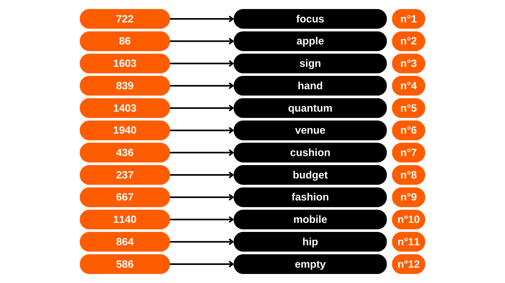
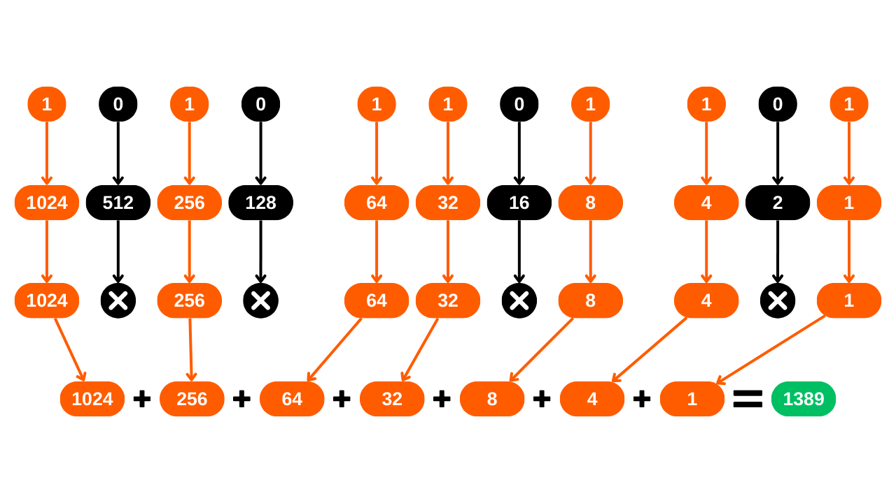

In questo tutorial, imparerai come costruire manualmente una frase di recupero per un portafoglio Bitcoin utilizzando i lanci dei dadi.

**ATTENZIONE:** Generare una frase mnemonica in modo sicuro richiede di non lasciare tracce digitali durante la sua creazione, il che è quasi impossibile. Altrimenti, il portafoglio presenterebbe una superficie di attacco troppo ampia, aumentando significativamente il rischio che i tuoi bitcoin vengano rubati. **È quindi fortemente sconsigliato trasferire fondi in un portafoglio che dipende da una frase di recupero generata personalmente.** Anche seguendo questo tutorial alla lettera, esiste il rischio che la frase di recupero possa essere compromessa. **Pertanto, questo tutorial non dovrebbe essere applicato alla creazione di un vero portafoglio.** Utilizzare un portafoglio hardware per questo compito è molto meno rischioso, in quanto genera la frase offline, e veri crittografi hanno considerato l'uso di fonti di entropia qualitative.

Questo tutorial può essere seguito solo a scopo sperimentale per la creazione di un portafoglio fittizio, senza l'intenzione di utilizzarlo con veri bitcoin. Tuttavia, l'esperienza offre due vantaggi:
- Primo, ti permette di comprendere meglio i meccanismi alla base del tuo portafoglio Bitcoin;
- Secondo, ti consente di sapere come farlo. Non sto dicendo che sarà utile un giorno, ma potrebbe!

## Cos'è una frase mnemonica?
Una frase di recupero, chiamata anche a volte "mnemonica", "frase seme" o "frase segreta", è una sequenza solitamente composta da 12 o 24 parole, che viene generata in modo pseudo-casuale da una fonte di entropia. La sequenza pseudo-casuale è sempre completata con un checksum.

La frase mnemonica, insieme a una passphrase opzionale, è utilizzata per derivare deterministicamente tutte le chiavi associate a un portafoglio HD (Hierarchical Deterministic). Questo significa che da questa frase, è possibile generare e ricreare deterministicamente tutte le chiavi private e pubbliche del portafoglio Bitcoin, e di conseguenza, accedere ai fondi ad esso associati.

Lo scopo di questa frase è fornire un mezzo facile da usare per il backup e il recupero dei bitcoin. È imperativo mantenere la frase mnemonica in un luogo sicuro e protetto, poiché chiunque in possesso di questa frase avrebbe accesso ai fondi del portafoglio corrispondente. Se utilizzata nel contesto di un portafoglio tradizionale, e senza una passphrase opzionale, costituisce spesso un SPOF (Single Point Of Failure). 
Solitamente, questa frase ti viene data direttamente alla creazione del tuo portafoglio, dal software o dal portafoglio hardware utilizzato. Tuttavia, è anche possibile generare questa frase da soli, e poi inserirla sul supporto scelto per derivare le chiavi del portafoglio. Questo è ciò che impareremo a fare in questo tutorial.

## Preparazione dei materiali necessari
Per la creazione della tua frase di recupero a mano, avrai bisogno di:
- Un foglio di carta;
- Una penna o matita, idealmente di colori diversi per facilitare l'organizzazione;
- Diversi dadi, per minimizzare i rischi di bias legati a un dado non bilanciato;
- [La lista delle 2048 parole BIP39](https://github.com/DecouvreBitcoin/sovereign-university-data/tree/dev/tutorials/others/generate-mnemonic-phrase/assets/BIP39-WORDLIST.pdf) stampata.

Successivamente, l'uso di un computer con un terminale diventerà necessario per il calcolo del checksum. È proprio per questo motivo che sconsiglio la generazione manuale della frase mnemonica. A mio avviso, l'intervento di un computer, anche sotto le precauzioni menzionate in questo tutorial, aumenta significativamente la vulnerabilità di un portafoglio.
Per un approccio sperimentale riguardante un "portafoglio fittizio", è possibile utilizzare il proprio computer abituale e il suo terminale. Tuttavia, per un approccio più rigoroso volto a limitare i rischi di compromissione della propria frase, l'ideale sarebbe utilizzare un PC disconnesso da internet (preferibilmente senza componente wifi o connessione cablata RJ45), dotato del minimo dei periferici (tutti collegati tramite cavo, per evitare il Bluetooth), e soprattutto, funzionante su una distribuzione Linux amnesica come [Tails](https://tails.boum.org/index.fr.html), avviata da un supporto rimovibile.


In un contesto reale, sarebbe cruciale assicurare la confidenzialità del proprio spazio di lavoro scegliendo una posizione lontana da occhi indiscreti, senza traffico di persone e priva di telecamere (webcam, telefoni...).
Si raccomanda di utilizzare un alto numero di dadi per mitigare l'impatto di un dado potenzialmente non bilanciato sull'entropia. Prima del loro utilizzo, si consiglia di controllare i dadi: ciò può essere realizzato testandoli in una ciotola di acqua satura di sale, permettendo ai dadi di galleggiare. Quindi procedere a lanciare ogni dado circa venti volte nell'acqua salata, osservando i risultati. Se una o due facce appaiono sproporzionatamente rispetto alle altre, estendere il test con più lanci. Risultati distribuiti uniformemente indicano che il dado è affidabile. Tuttavia, se una o due facce dominano regolarmente, questi dadi dovrebbero essere messi da parte, poiché potrebbero compromettere l'entropia della propria frase mnemonica e, di conseguenza, la sicurezza del proprio portafoglio.
In condizioni reali, dopo aver eseguito questi controlli, si sarebbe pronti a generare l'entropia necessaria. Per un portafoglio fittizio sperimentale creato come parte di questo tutorial, si potrebbero naturalmente saltare queste preparazioni.

## Alcuni Promemoria sulla Frase di Recupero
Per iniziare, rivedremo i fondamenti della creazione di una frase mnemonica secondo BIP39. Come precedentemente spiegato, la frase deriva da informazioni pseudo-casuali di una certa dimensione, a cui viene aggiunto un checksum per garantirne l'integrità.

La dimensione di queste informazioni iniziali, spesso definite "entropia", è determinata dal numero di parole che si desidera ottenere nella frase di recupero. I formati più comuni sono frasi di 12 e 24 parole, che derivano rispettivamente da un'entropia di 128 bit e 256 bit. Ecco una tabella che mostra le diverse dimensioni di entropia secondo BIP39:

| Frase (parole) | Entropia (bit) | Checksum (bit) | Entropia + Checksum (bit) |
| --------------- | --------------- | --------------- | -------------------------- |
| 12              | 128             | 4               | 132                        |
| 15              | 160             | 5               | 165                        |
| 18              | 192             | 6               | 198                        |
| 21              | 224             | 7               | 231                        |
| 24              | 256             | 8               | 264                        |

L'entropia è quindi un numero casuale tra 128 e 256 bit. In questo tutorial, prenderemo l'esempio di una frase di 12 parole, in cui l'entropia è di 128 bit, il che significa che genereremo una sequenza casuale di 128 `0` o `1`. Questo rappresenta un numero composto da 128 cifre in base 2 (binario).
Basandosi su questa entropia, verrà generato un checksum. Un checksum è un valore calcolato da un insieme di dati, utilizzato per verificare l'integrità e la validità di tali dati durante la loro trasmissione o memorizzazione. Gli algoritmi di checksum sono progettati per rilevare errori accidentali o alterazioni nei dati.
Nel caso della nostra frase mnemonica, la funzione del checksum è quella di rilevare eventuali errori di input quando si inserisce la frase nel software del portafoglio. Un checksum non valido segnala la presenza di un errore nella frase. Al contrario, un checksum valido indica che la frase è molto probabilmente corretta.
Per ottenere questo checksum, l'entropia viene passata attraverso la funzione hash SHA256. Questa operazione produce in output una sequenza di 256 bit, di cui verranno trattenuti solo i primi `N` bit, dove `N` dipende dalla lunghezza desiderata della frase di recupero (vedi la tabella sopra). Quindi, per una frase di 12 parole, verranno mantenuti i primi 4 bit dell'hash.

Questi primi 4 bit, che formano il checksum, verranno poi aggiunti all'entropia originale. A questo punto, la frase di recupero è praticamente costituita, ma è ancora in forma binaria. Per convertire questa sequenza binaria in parole in conformità con lo standard BIP39, divideremo prima la sequenza in segmenti di 11 bit.

Ciascuno di questi pacchetti rappresenta un numero in binario che verrà poi convertito in un numero decimale (base 10). Aggiungeremo `1` a ciascun numero, perché in informatica, il conteggio inizia da `0`, ma la lista BIP39 è numerata a partire da `1`.


Infine, il numero in decimale ci indica la posizione della parola corrispondente nella [lista delle 2048 parole BIP39](https://github.com/DecouvreBitcoin/sovereign-university-data/tree/dev/tutorials/others/generate-mnemonic-phrase/assets/BIP39-WORDLIST.pdf). Non resta che selezionare queste parole per comporre la frase di recupero per il nostro portafoglio.



Ora, passiamo alla pratica! Genereremo una frase di recupero di 12 parole. Tuttavia, questa operazione rimane identica nel caso di una frase di 24 parole, eccetto che richiederebbe 256 bit di entropia e un checksum di 8 bit, come indicato nella tabella di equivalenza situata all'inizio di questa sezione.

## Passo 1: Generazione dell'Entropia
Prepara il tuo foglio di carta, la tua penna e i tuoi dadi. Per iniziare, dovremo generare casualmente 128 bit, ovvero una sequenza di 128 `0` e `1` di fila. Per fare ciò, useremo i dadi.


I dadi hanno 6 facce, tutte con una probabilità identica di essere lanciate. Tuttavia, il nostro obiettivo è produrre un risultato binario, ovvero due possibili esiti. Pertanto, assegneremo il valore `0` a ogni lancio che atterra su un numero pari, e `1` per ogni numero dispari. Di conseguenza, eseguiremo 128 lanci per creare la nostra entropia di 128 bit. Se il dado mostra `2`, `4`, o `6`, scriveremo `0`; per `1`, `3`, o `5`, sarà `1`. Ogni risultato sarà annotato sequenzialmente, da sinistra a destra e dall'alto verso il basso.

Per facilitare i passaggi successivi, raggrupperemo i bit in pacchetti di quattro e tre, come mostrato nell'immagine sottostante. Ogni riga deve avere 11 bit: 2 pacchetti di 4 bit e un pacchetto di 3 bit.


Come potete vedere nel mio esempio, la dodicesima parola è attualmente composta da soli 7 bit. Questi saranno completati dai 4 bit del checksum nel prossimo passo per formare gli 11 bit.

## Passo 2: Calcolo del checksum
Questo passo è il più critico nella generazione manuale di una frase mnemonica, poiché richiede l'uso di un computer. Come accennato in precedenza, il checksum corrisponde all'inizio dell'hash SHA256 generato dall'entropia. Sebbene sia teoricamente possibile calcolare uno SHA256 a mano per un input di 128 o 256 bit, questo compito potrebbe richiedere un'intera settimana. Inoltre, qualsiasi errore nei calcoli manuali sarebbe identificato solo alla fine del processo, costringendovi a ricominciare da capo. Pertanto, è impensabile eseguire questo passo solo con un foglio di carta e una penna. L'uso di un computer è quasi obbligatorio. Se desiderate comunque imparare come fare uno SHA256 a mano, spieghiamo come farlo nel [corso CRYPTO301](https://planb.network/en/courses/crypto301).

Per questo motivo, sconsiglio vivamente di creare una frase mnemonica manuale per un portafoglio reale. A mio avviso, l'uso di un computer in questa fase, anche con tutte le precauzioni necessarie, aumenta in modo irragionevole la superficie di attacco del portafoglio.
Per calcolare il checksum lasciando il minor numero di tracce possibile, utilizzeremo una distribuzione Linux amnesica da un'unità rimovibile chiamata **Tails**. Questo sistema operativo si avvia da una chiavetta USB e opera interamente sulla RAM del computer, senza interagire con l'hard disk. Così, in teoria, non lascia tracce sul computer dopo che viene spento. Si prega di notare che Tails è compatibile solo con processori di tipo x86_64, e non con processori di tipo ARM.
Per iniziare, dal vostro computer abituale, [scaricate l'immagine di Tails dal suo sito ufficiale](https://tails.net/install/index.fr.html). Assicuratevi dell'autenticità del vostro download utilizzando la firma dello sviluppatore o lo strumento di verifica offerto dal sito.

Prima di tutto, procedete a formattare la vostra chiavetta USB, poi installate Tails utilizzando uno strumento come [Balena Etcher](https://etcher.balena.io/).

Dopo aver confermato che il flashing è stato eseguito con successo, spegnete il computer. Procedete quindi a scollegare l'alimentazione e rimuovere l'hard disk dalla scheda madre del vostro PC. Nel caso in cui sia presente una scheda WiFi, questa dovrebbe essere scollegata. Allo stesso modo, rimuovere qualsiasi cavo Ethernet RJ45. Per minimizzare il rischio di perdita di dati, si consiglia di scollegare il vostro modem internet e spegnere il telefono cellulare. Inoltre, assicuratevi di scollegare qualsiasi periferica superflua dal computer, come il microfono, la webcam, gli altoparlanti o le cuffie, e controllate che altre periferiche siano collegate solo tramite cavo. Tutti questi passaggi di preparazione del PC non sono essenziali, ma aiutano semplicemente a ridurre la superficie di attacco il più possibile in un contesto reale.

Controllate se il vostro BIOS è configurato per consentire l'avvio da un dispositivo esterno. In caso contrario, cambiate questa impostazione, poi riavviate la macchina. Una volta assicurato l'ambiente informatico, riavviate il computer dalla chiavetta USB con Tails OS.

Nella schermata di benvenuto di Tails, selezionate la lingua di vostra scelta, poi avviate il sistema cliccando su `Start Tails`.

Dal desktop, cliccate sulla scheda `Applications`.

Navigate al menu `Utilities`.
E infine, clicca sull'applicazione `Terminal`.


Arriverai a un nuovo terminale di comando vuoto.


Digita il comando `echo`, seguito dalla tua entropia generata in precedenza, assicurandoti di inserire uno spazio tra `echo` e la tua sequenza di cifre binarie.


Aggiungi uno spazio aggiuntivo, poi inserisci il seguente comando, utilizzando un *pipe* (`|`):
```bash
| shasum -a 256 -0
```


Nell'esempio con la mia entropia, il comando completo è il seguente:
```bash
echo 11010111000110111011000011000010011000100111000001000000001001011011001010111111001010011111110001010100000101110010010011011010 | shasum -a 256 -0
```

In questo comando:
- `echo` è usato per inviare la sequenza di bit;
- `|`, il *pipe*, è usato per dirigere l'output del comando `echo` all'input del comando successivo;
- `shasum` avvia una funzione di hashing appartenente alla famiglia SHA (*Secure Hash Algorithm*);
- `-a` specifica la scelta di un algoritmo di hashing specifico;
- `256` indica che viene utilizzato l'algoritmo SHA256;
- `-0` permette all'input di essere interpretato come un numero binario.

Dopo aver attentamente controllato che la tua sequenza binaria non contenga errori di battitura, premi il tasto `Enter` per eseguire il comando. Il terminale mostrerà quindi l'hash SHA256 della tua entropia.


Per ora, l'hash è espresso in formato esadecimale (base 16). Ad esempio, il mio è:
```bash
a27abf1aff70311917a59a43ce86fa45a62723a00dd2f9d3d059aeac9b4b13d8
```

Per finalizzare la nostra frase mnemonica, abbiamo bisogno solo dei primi 4 bit dell'hash, che costituiscono il checksum. In formato esadecimale, ogni carattere rappresenta 4 bit. Quindi, conserveremo solo il primo carattere dell'hash. Per una frase di 24 parole, sarebbe necessario prendere in considerazione i primi due caratteri. Nel mio esempio, questo corrisponde alla lettera: `a`. Annota attentamente questo carattere da qualche parte sul tuo foglio, poi spegni il computer.

Il prossimo passo è convertire questo carattere esadecimale (base 16) in un valore binario (base 2), poiché la nostra frase è costruita in questo formato. Per fare ciò, puoi utilizzare la seguente tabella di conversione:

| Decimale (base 10) | Esadecimale (base 16) | Binario (base 2) |
| ------------------ | --------------------- | ---------------- |
| 0                  | 0                     | 0000             |
| 1                  | 1                     | 0001             |
| 2                  | 2                     | 0010             |
| 3                  | 3                     | 0011             |
| 4                  | 4                     | 0100             |
| 5                  | 5                     | 0101             |
| 6                  | 6                     | 0110             |
| 7                  | 7                     | 0111             |
| 8                  | 8                     | 1000             |
| 9                  | 9                     | 1001             |
| 10                | a                     | 1010             |
| 11                | b                     | 1011             |
| 12                | c                     | 1100             |
| 13                | d                     | 1101             |
| 14                | e                     | 1110             |
| 15                | f                     | 1111             |

Nel mio esempio, la lettera `a` corrisponde al numero binario `1010`. Questi 4 bit formano il checksum della nostra frase di recupero. Ora puoi aggiungerli all'entropia già annotata sul tuo foglio di carta, posizionandoli alla fine dell'ultima parola.


La tua frase mnemonica è ora completa, ma è in formato binario. Il passo successivo sarà convertirla nel sistema decimale in modo che tu possa poi associare ogni numero con una corrispondente parola nella lista BIP39.

## Passo 3: Convertire le Parole in Decimale
Per convertire ogni linea binaria in un numero decimale, useremo un metodo che facilita il calcolo manuale. Attualmente, hai dodici linee sul tuo foglio, ciascuna composta da 11 cifre binarie `0` o `1`. Per procedere con una conversione in decimale, assegna a ciascuna prima cifra il valore `1024` se è `1`, altrimenti `0`. Per la seconda cifra, il valore `512` sarà assegnato se è `1`, altrimenti `0`, e così via fino all'undicesima cifra. Le corrispondenze sono le seguenti:
- 1° bit: `1024`;
- 2° bit: `512`;
- 3° bit: `256`;
- 4° bit: `128`;
- 5° bit: `64`;
- 6° bit: `32`;
- 7° bit: `16`;
- 8° bit: `8`;
- 9° bit: `4`;
- 10° bit: `2`;
- 11° bit: `1`.

Per ogni linea, sommeremo i valori corrispondenti alle cifre `1` per ottenere il numero decimale equivalente del numero binario. Prendiamo l'esempio di una linea binaria uguale a:
```bash
1010 1101 101
```

La conversione sarebbe la seguente:

Il risultato sarebbe quindi:
```bash
1389
```

Per ogni bit uguale a `1`, riporta il numero associato sotto. Per ogni bit uguale a `0`, non riportare nulla.


Poi, semplicemente somma tutti i numeri validati dai `1` per ottenere il numero decimale che rappresenta ogni linea binaria. Ecco come appare per il mio foglio:


## Passo 4: Ricerca delle Parole della Frase Mnemonica
Con i numeri decimali ottenuti, possiamo ora localizzare le parole corrispondenti nella lista per comporre la frase mnemonica. Tuttavia, la numerazione delle 2048 parole nella lista BIP39 varia da `1` a `2048`. Ma, i nostri risultati binari calcolati variano da `0` a `2047`. Pertanto, c'è uno spostamento di una unità che deve essere corretto. Per correggere questo spostamento, basta aggiungere `1` ai dodici numeri decimali precedentemente calcolati.


Dopo questo aggiustamento, hai il rango di ogni parola all'interno della lista. Tutto ciò che rimane è identificare ogni parola con il suo numero. Ovviamente, come per tutti gli altri passaggi, non devi usare il computer per eseguire questa conversione. Pertanto, assicurati di aver stampato la lista in anticipo.
[**-> Stampa la lista BIP39 in formato A4.**](https://github.com/DecouvreBitcoin/sovereign-university-data/tree/dev/tutorials/others/generate-mnemonic-phrase/assets/BIP39-WORDLIST.pdf)

Per esempio, se il numero derivato dalla prima linea è 1721, la parola corrispondente sarà la 1721esima sulla lista:
```bash
1721. strike
```

In questo modo, procediamo successivamente con le 12 parole per costruire la nostra frase mnemonica.


## Passo 5: Creazione del Portafoglio Bitcoin
A questo punto, tutto ciò che rimane è importare la nostra frase mnemonica in un software di portafoglio Bitcoin. A seconda delle nostre preferenze, ciò può essere fatto su un software desktop per ottenere un hot wallet, o su un portafoglio hardware per un cold wallet.


È solo durante l'importazione che puoi verificare la validità del tuo checksum. Se il software mostra un messaggio come `Invalid Checksum`, significa che un errore si è insinuato nel tuo processo di creazione. Generalmente, questo errore deriva o da un errore di calcolo durante le conversioni manuali e le aggiunte, o da un errore di battitura quando inserisci la tua entropia nel terminale su Tails. Sarà necessario ricominciare il processo dall'inizio per correggere questi errori.


Dopo aver creato il tuo portafoglio, non dimenticare di fare il backup della tua frase di recupero su un supporto fisico, come carta o metallo, e distruggere il foglio di calcolo utilizzato durante la sua generazione per prevenire qualsiasi fuga di informazioni.

## Caso Specifico dell'Opzione di Lancio dei Dadi sui Coldcards
I portafogli hardware della famiglia Coldcard offrono [una funzionalità chiamata *Dice Roll*](https://youtu.be/Rc29d9m92xg?si=OeFW2iCGRvxexhK7), per generare la frase di recupero del tuo portafoglio con i dadi. Questo metodo è eccellente perché ti dà il controllo diretto sulla creazione dell'entropia, senza richiedere l'uso di un dispositivo esterno per calcolare il checksum come nel nostro tutorial.

Tuttavia, sono stati segnalati recentemente incidenti di furto di bitcoin a causa dell'uso improprio di questa funzionalità. Infatti, un numero troppo limitato di lanci di dadi può portare a un'entropia insufficiente, rendendo teoricamente possibile forzare la frase mnemonica e rubare i bitcoin associati. Per evitare questo rischio, si consiglia di eseguire almeno 99 lanci di dadi sul Coldcard, il che garantisce un'entropia sufficiente.

Il metodo di interpretazione dei risultati proposto da Coldcard differisce da quello presentato in questo tutorial. Mentre nel nostro tutorial raccomandiamo 128 lanci per raggiungere 128 bit di sicurezza, Coldcard suggerisce 99 lanci per raggiungere 256 bit di sicurezza. Infatti, nel nostro approccio, sono possibili solo due esiti per ogni lancio di dadi: pari (`0`) o dispari (`1`). Pertanto, l'entropia generata da ogni lancio è uguale a `log2(2)`. Nel caso di Coldcard, che prende in considerazione le sei possibili facce del dado (da `1` a `6`), l'entropia per lancio è uguale a `log2(6)`. Questo è il motivo per cui nel nostro tutorial, dobbiamo eseguire più lanci per raggiungere lo stesso livello di entropia.
Entropia = numero di lanci * log2(numero di possibili risultati del dado)
Coldcard:

Entropia = 99 * log2(6)
Entropia = 255.91

Il nostro tutorial:

Entropia = 128 * log2(2)
Entropia = 128