La mission de PlanB est de mettre à disposition des ressources éducatives de premier plan sur Bitcoin, et ce, dans un maximum de langues. L'intégralité des contenus publiés sur le site est open-source et est hébergée sur GitHub, ce qui offre la possibilité à quiconque de participer à l'enrichissement de la plateforme. Les contributions peuvent prendre diverses formes : correction et relecture des textes existants, traduction dans d'autres langues, mise à jour des informations ou encore création de nouveaux tutoriels encore absents de notre site.

Si vous désirez apporter votre pierre à l'édifice PlanB Network, vous allez avoir besoin d'utiliser GitHub afin de proposer des modifications. Pour ce faire, vous avez deux choix :
- **Contribuer directement via l'interface web de GitHub** : C'est la méthode la plus simple. Si vous êtes débutant ou si vous prévoyez de faire seulement quelques contributions mineures, cette option est sûrement la meilleure pour vous ;
- **Contribuer en local en utilisant Git** : Cette méthode est plus adaptée si vous envisagez de faire des contributions régulières ou importantes pour PlanB Network. Bien que l'installation de votre environnement Git en local sur votre ordinateur puisse sembler complexe au début, cette approche est plus efficace sur le long terme. Elle permet une gestion plus flexible des modifications. Si vous êtes novice en la matière, ne vous inquiétez pas, **nous vous expliquons tout le processus de mise en place de votre environnement dans ce tutoriel** (promis, vous n'aurez pas besoin de taper des lignes de commande ^^).

Si vous ne savez pas du tout ce qu'est GitHub, ou si vous souhaitez en apprendre davantage sur les termes techniques liés à Git et GitHub, je vous recommande de consulter notre article d'introduction pour vous familiariser avec ces concepts.

https://planb.network/tutorials/others/basics-of-github

- Pour commencer, vous allez évidemment avoir besoin d'un compte GitHub. Si vous en avez déjà un, vous pouvez vous y connecter, sinon, vous pouvez vous aider de notre tutoriel pour en créer un nouveau.

https://planb.network/tutorials/others/create-github-account

## Étape 1 : Installer GitHub Desktop

- Rendez-vous sur https://desktop.github.com/ pour télécharger le logiciel GitHub Desktop. Ce logiciel vous permet d'interagir facilement avec GitHub, sans avoir à utiliser un terminal :

- Lors du premier lancement du logiciel, il vous sera demandé de connecter votre compte GitHub. Pour ce faire, cliquez sur `Sign in to GitHub.com` :
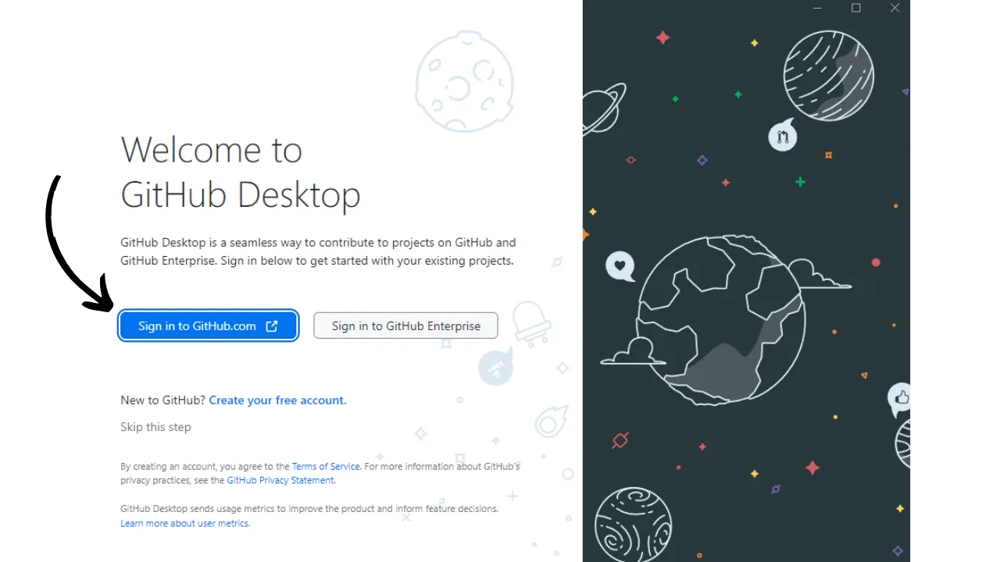
- Une page d'authentification s'ouvre sur votre navigateur. Entrez votre adresse email et votre mot de passe choisis lors de la création de votre compte, puis cliquez sur le bouton `Sign in` :
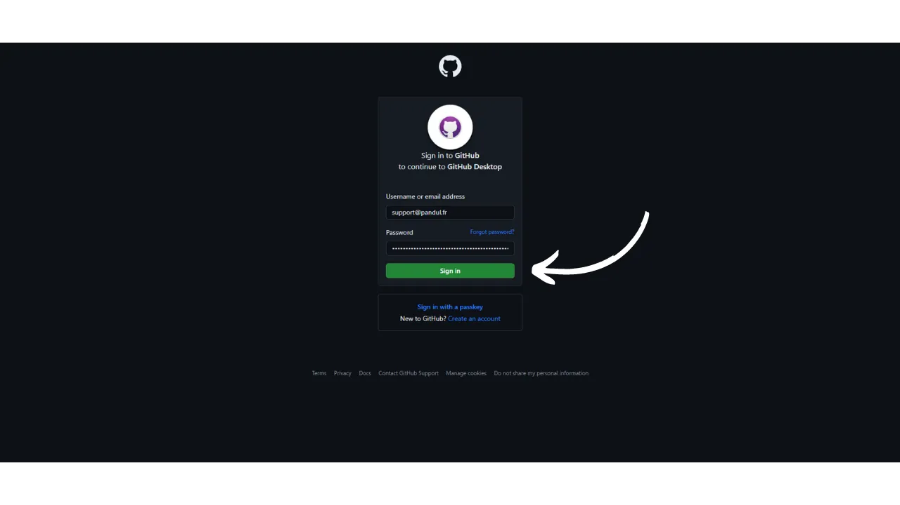
- Cliquez sur `Authorize desktop` pour confirmer la connexion entre votre compte et le logiciel :
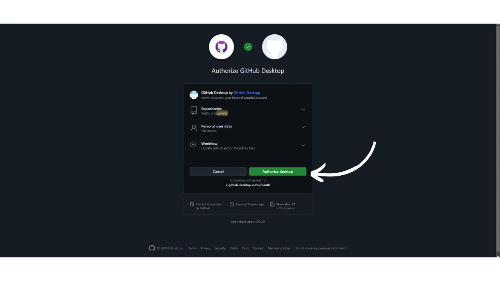
- Vous serez automatiquement redirigé sur le logiciel GitHub Desktop. Cliquez sur `Finish` :
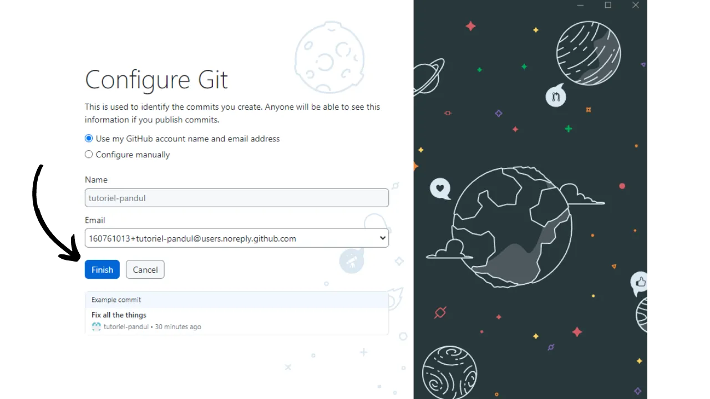
- Si vous venez de créer votre compte GitHub, vous serez redirigé vers une page indiquant que vous n'avez encore créé aucun dépôt. À ce stade, mettez de côté le logiciel GitHub Desktop ; nous y reviendrons ultérieurement :

## Étape 2 : Installer Obsidian 

Passons à l'installation du logiciel de rédaction. Ici, vous disposez de plusieurs options. Vous allez avoir besoin d'un logiciel qui prenne en charge la modification de fichiers Markdown, car PlanB Network utilise ce format pour les fichiers textes sur son dépôt. 

Il existe une multitude de logiciels spécialisés dans l'édition de fichiers Markdown, tels que Typora, conçus spécifiquement pour la rédaction. Bien que cela ne soit pas idéal, il est aussi possible de choisir un éditeur de code, comme Visual Studio Code (VSC) ou Sublime Text. Cependant, en tant que rédacteur, je préfère utiliser le logiciel Obsidian. Voyons ensemble comment l'installer et le prendre en main.

- Rendez-vous sur https://obsidian.md/download et téléchargez le logiciel :
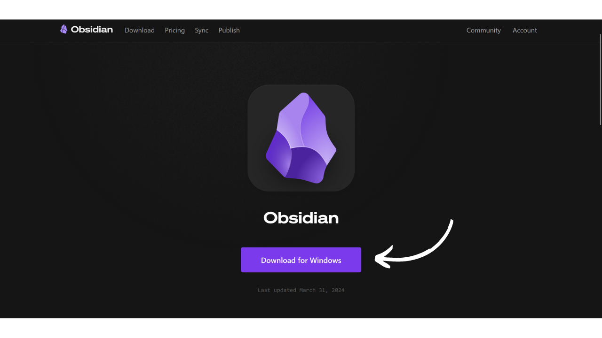
- Installez Obsidian, lancez le logiciel, choisissez votre langue, puis cliquez sur `Quick Start` :

- Vous arriverez sur le logiciel Obsidian. Pour le moment, vous n'avez aucun fichier ouvert :
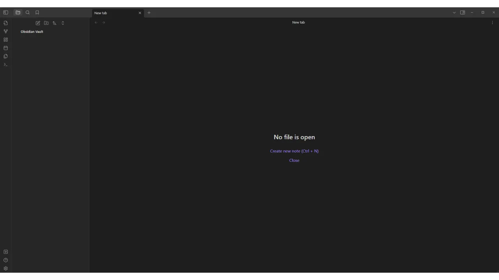

## Étape 3 : Fork le dépôt de PlanB Network

- Rendez-vous sur le dépôt des données de PlanB Network à l'adresse suivante : [https://github.com/PlanB-Network/bitcoin-educational-content](https://github.com/PlanB-Network/bitcoin-educational-content) :

- Depuis cette page, cliquez sur le bouton `Fork` en haut à droite de la fenêtre :

- Dans le menu de création, vous pouvez laisser les paramètres par défaut. Vérifiez que la case `Copy the dev branch only` soit bien cochée, puis cliquez sur le bouton `Create fork` :
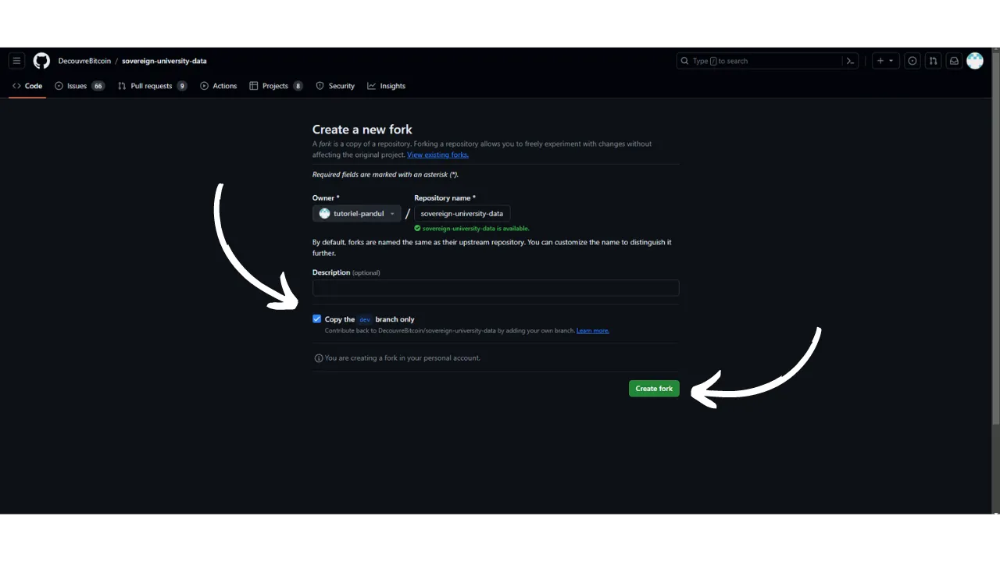
- Vous arriverez ensuite sur votre propre fork du dépôt de PlanB Network :

Ce fork constitue un dépôt distinct de l'original, bien qu'il contienne pour le moment les mêmes données. C'est sur ce nouveau dépôt que vous allez désormais travailler.

On vient donc en quelque sorte de faire une copie du dépôt source de PlanB Network. Votre fork (la copie) et le dépôt original vont désormais évoluer indépendamment l'un de l'autre. Sur le dépôt original, d'autres contributeurs pourront ajouter de nouvelles données, tandis que vous, sur votre fork, procéderez à vos propres modifications.

Pour maintenir une cohérence entre ces deux dépôts, il sera nécessaire de les synchroniser périodiquement afin qu'ils récupèrent les mêmes informations. Pour envoyer vos modifications au dépôt source, vous utiliserez ce qu'on appelle une **Pull Request**. Et pour intégrer les modifications du dépôt source à votre fork, vous utiliserez la commande **Sync fork** disponible sur l'interface web de GitHub.

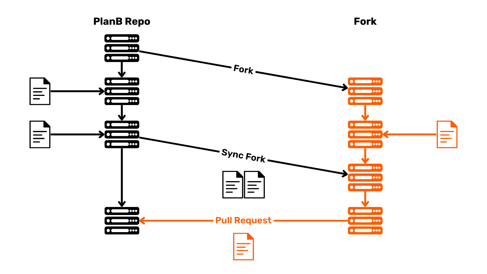

## Étape 4 : Cloner le fork 

- Revenez sur le logiciel GitHub Desktop. À présent, votre fork devrait figurer dans la section `Your repositories`. Si vous ne le voyez pas immédiatement, utilisez le bouton des doubles flèches pour rafraîchir la liste. Lorsque votre fork apparaît, cliquez dessus pour le sélectionner :

- Cliquez ensuite sur le bouton bleu : `Clone [username]/sovereign-university-data` :

- Conservez le chemin par défaut. Pour confirmer, cliquez sur le bouton bleu `Clone` :
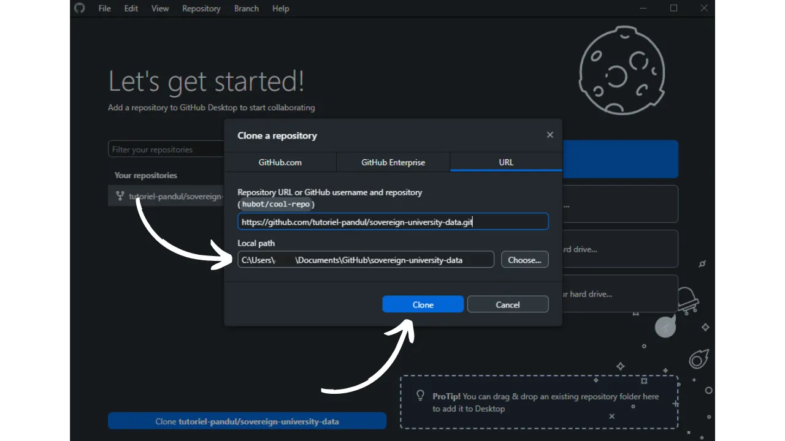
- Patientez le temps que GitHub Desktop clone votre fork en local :
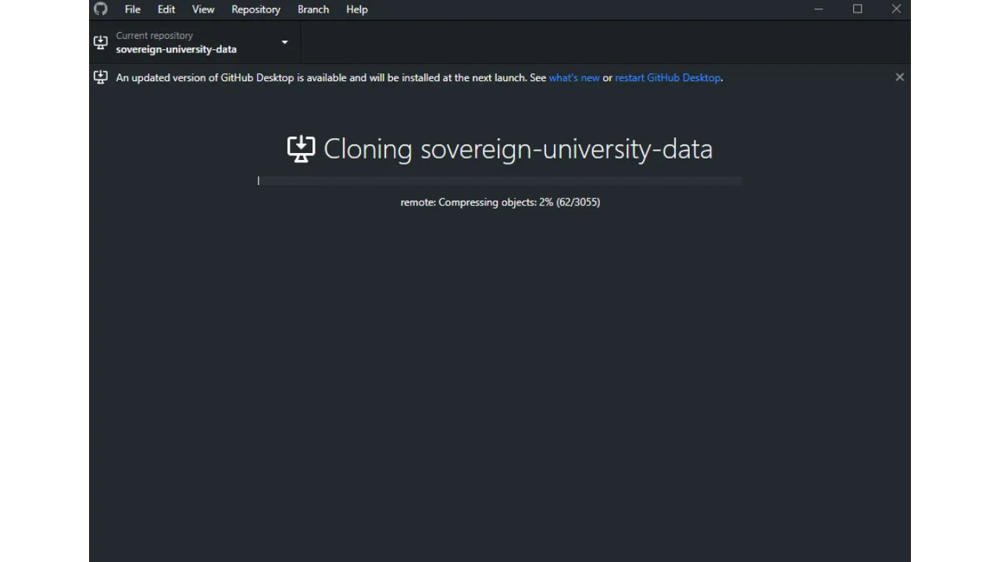
- Après le clonage du dépôt, le logiciel vous propose deux options. Vous devez sélectionner la première : `To contribute to the parent project`. Ce choix vous permettra de présenter votre futur travail comme une contribution au projet parent (`DecouvreBitcoin/sovereign-university-data`), et non exclusivement comme une modification de votre fork personnel (`[username]/sovereign-university-data`). Une fois l'option choisie, cliquez sur `Continue` :

- Votre GitHub Desktop est désormais correctement configuré. À présent, vous pouvez laisser le logiciel ouvert en arrière-plan pour suivre les modifications que nous effectuerons.

Ce que nous avons réalisé à cette étape, c'est la création d'une copie locale de votre dépôt, qui est hébergé sur GitHub. Pour rappel, ce dépôt est un fork du dépôt source de PlanB Network. Vous allez pouvoir apporter des modifications à cette copie locale, telles que l'ajout de tutoriels, de traductions ou de corrections. Une fois ces modifications effectuées, vous utiliserez la commande **Push origin** pour envoyer vos modifications locales vers votre fork hébergé sur GitHub.

Vous pouvez aussi récupérer des modifications depuis le fork, par exemple lors d'une synchronisation avec le dépôt de PlanB Network. Pour cela, vous utiliserez la commande **Fetch origin** pour télécharger les modifications sur votre copie locale (votre clone), puis la commande **Pull origin** pour les fusionner avec votre travail. Cela vous permet de rester à jour avec les dernières évolutions du projet tout en contribuant efficacement.

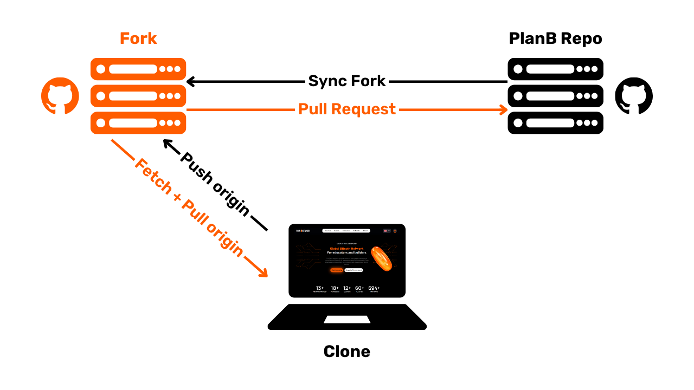
## Étape 5 : Créer un nouveau coffre Obsidian

- Ouvrez le logiciel Obsidian et cliquez sur la petite icône de coffre-fort en bas à gauche de la fenêtre :

- Cliquez sur le bouton `Open` afin d'ouvrir un dossier existant comme un coffre :
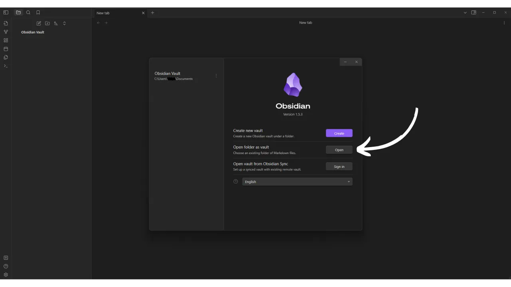
- Votre explorateur de fichier va s'ouvrir. Vous devez localiser et sélectionner le dossier intitulé `GitHub`, qui devrait se situer dans votre répertoire `Documents` parmi vos fichiers. Ce chemin correspond à celui que vous avez établi durant l'étape 4. Après avoir choisi le dossier, confirmez sa sélection. La création de votre coffre sur Obsidian se lancera alors sur une nouvelle page du logiciel :

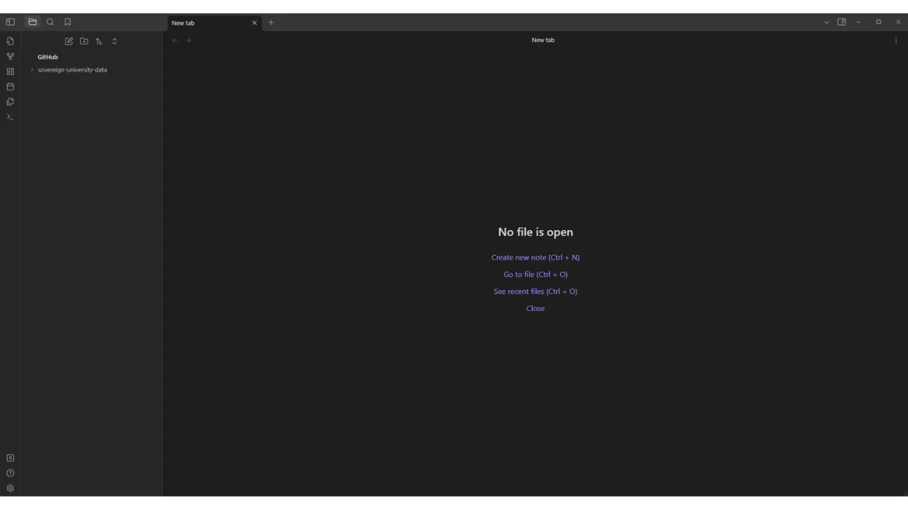
-> **Attention**, il est important de ne pas choisir le dossier `sovereign-university-data` lors de la création d'un nouveau coffre dans Obsidian. Sélectionnez plutôt le dossier parent, `GitHub`. Si vous sélectionnez le dossier `sovereign-university-data`, le dossier de configuration `.obsidian`, contenant vos paramètres locaux Obsidian, sera automatiquement intégré au sein du dépôt. Nous souhaitons éviter cela, car il n'est pas nécessaire de transférer vos configurations Obsidian sur le dépôt de PlanB Network. Une alternative consiste à ajouter le dossier `.obsidian` au fichier `.gitignore`, mais cette méthode entraînerait également une modification du fichier `.gitignore` du dépôt source, ce qui n'est pas désirable.

- Sur la gauche de la fenêtre, vous pouvez voir l'arborescence des fichiers avec vos différents dépôts GitHub qui ont été clonés en local.
- En cliquant sur les flèches situées à côté des noms de dossier, vous pouvez les dérouler pour accéder aux sous-dossiers des dépôts et à leurs documents :
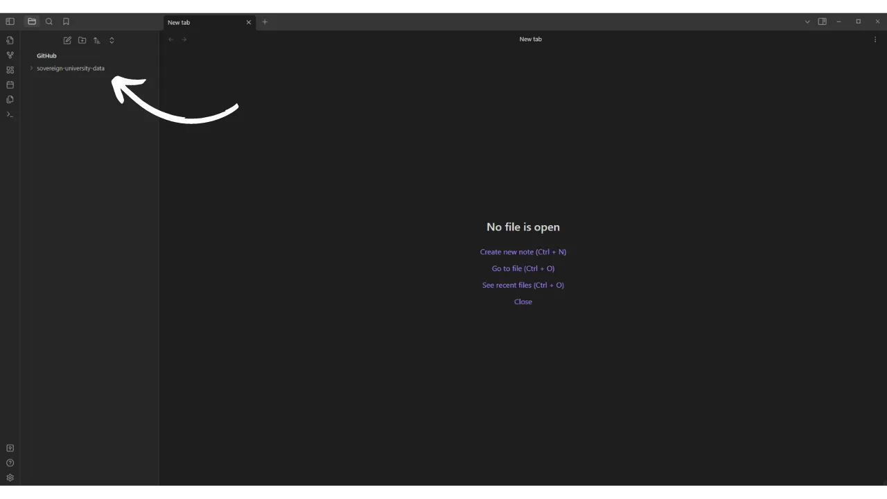
- N'oubliez pas de paramétrer Obsidian en dark mode : « _Light attracts bugs_ » ;)

## Étape 6 : Installer un éditeur de code

La majorité de vos modifications porteront sur des fichiers au format Markdown (`.md`). Pour éditer ces documents, vous pouvez utiliser Obsidian, le logiciel dont nous avons discuté auparavant. Néanmoins, PlanB Network fait appel à d'autres formats de fichiers, et il vous faudra procéder à la modification de certains d'entre eux.

Par exemple, lors de la création d'un nouveau tutoriel, vous devrez créer un fichier YAML (`.yml`) pour y inscrire les tags de votre tutoriel, son titre, ainsi que votre identifiant de professeur. Obsidian n'offre pas la possibilité de modifier ce type de fichiers, vous aurez donc besoin d'un éditeur de code.

Pour cela, plusieurs options s'offrent à vous. Bien que le bloc-notes standard de votre ordinateur puisse être utilisé pour effectuer ces modifications, cette solution n'est pas idéale pour un travail soigné. Je vous recommande plutôt de choisir un logiciel spécifiquement conçu à cet effet, tel que [VS Code](https://code.visualstudio.com/download) ou [Sublime Text](https://www.sublimetext.com/download). Sublime Text étant particulièrement léger, il sera amplement suffisant pour nos besoins.

- Installez un de ces logiciels, et gardez-le de côté pour vos futures modifications.

Félicitations ! Votre environnement de travail est maintenant configuré pour contribuer à PlanB Network. Vous pouvez maintenant découvrir nos autres tutoriels spécifiques pour chaque type de contribution (traduction, correction, rédaction.

https://planb.network/tutorials/others

..).