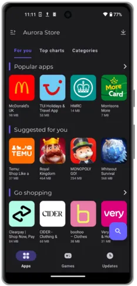
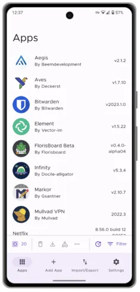
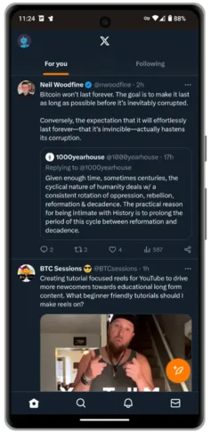
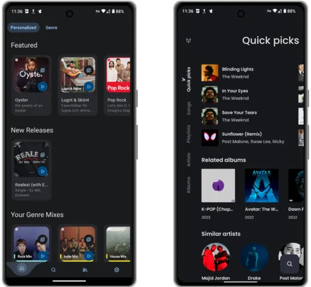
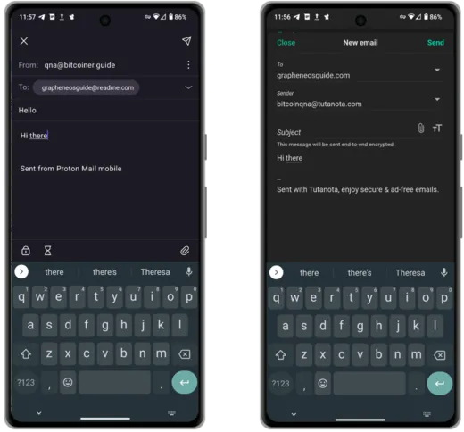
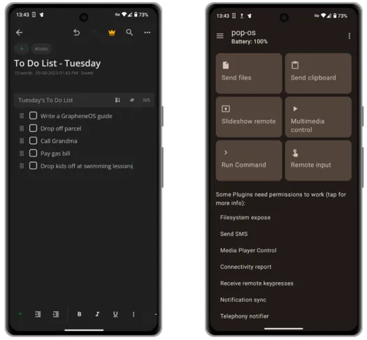
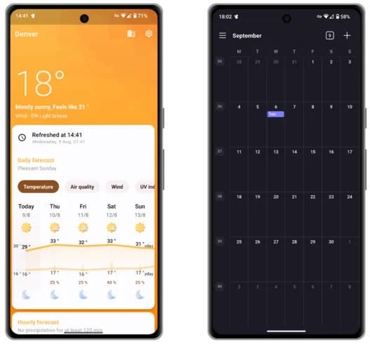
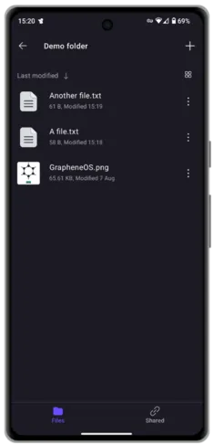
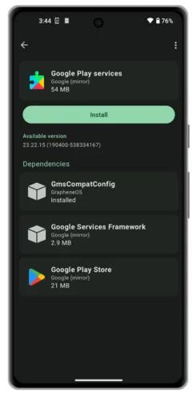

> "[GrapheneOS](https://grapheneos.org/)は、非営利のオープンソースプロジェクトとして開発された、Androidアプリの互換性を持つプライバシーとセキュリティに焦点を当てたモバイルOSです。"

GrapheneOSは元々2014年に'CopperheadOS'として設立され、従来のAndroidコード（AOSP）をベースにしていますが、ユーザーのプライバシーとセキュリティを向上させるための多くの変更と改善が施されています。GrapheneOSは、大手テクノロジー企業ではなく、ユーザーが自分の電話をコントロールできるようにします。

### 目次:

- イントロ
- 準備
- インストール
- アプリの代替
- デメリット
- 役立つ情報

ガイド by https://github.com/BitcoinQnA/Bitcoiner.Guide/blob/main/grapheneos.md

## なぜGrapheneOSを使うのか？

現代の携帯電話は500ドルから1000ドルのトラッキングとデータ収集デバイスです。私たちの生活のあらゆる側面がそれらを通じて行われ、残念ながら多くのデータが何らかの形で第三者と共有されています。
GrapheneOSは、このデータ共有を減らし、潜在的な攻撃ベクトルからデバイスのセキュリティを向上させるために特別に構築されました。GrapheneOSアカウントというものは存在しません。アプリをダウンロードしたり、OSとやり取りするためにアカウントは必要ありません。簡単に言うと、あなたは製品ではありません。

GrapheneOSは、いくつかのシンプルなコア原則を通じて、あなたのAndroid体験に追加のセキュリティを提供します。

1. **攻撃面の削減** - 不必要なコード（またはブロートウェア）を削除します。
2. **脆弱性の露出防止** - ユーザーが快適に感じる妥協点を選択できる十分な細かさを許可します。
3. **サンドボックスの封じ込め** - GrapheneOSは既存のAndroidサンドボックスを強化し、各アプリがあなたの電話の残りの部分と通信する能力をさらに制限します。

GrapheneOSの機能セットの技術的詳細については[こちら](https://grapheneos.org/features)をご覧ください。

### 移行を容易にする

何年もGoogleやAppleのエコシステムに深く根ざしていると、一晩でその便利さを失うことへの恐怖は理解できるものです。しかし、後ほど説明するいくつかの慎重に検討されたアプリのインストール決定（後述）により、この予想される困難の多くは軽減または解消されます。

代替品がどれだけ良くなっているとしても、そのような変更を考えることは依然として心配の種です。この状況にある場合、私の最良のアドバイスは、新しいGrapheneOSデバイスを既存の電話と並行してしばらく使用することです。そこから、週に2-3アプリを徐々に減らしていき、GrapheneOSデバイスのみを手に取るようになるまで続けます。

このアプローチを取る場合は、自分自身に厳しく、できるだけ早く監視された代替品への依存を断ち切ってください。私たち人間は怠惰で、しばしば最も抵抗の少ない道を選びます。最初に切り替えた理由を思い出してください。

**個人データで支払う代わりに、あなたは時間、そして時には（インストールする代替アプリによっては）稼いだお金で支払うことを選びました。**

## 始め方

GrapheneOSは現在、（皮肉なことに）[Google Pixel](https://grapheneos.org/faq#supported-devices)シリーズの電話でのみ生産されています。これには十分な理由があります。Pixelは、OSを強化するために行われた作業を補完する最高のハードウェアベースのセキュリティを提供します。これには、特定のコンポーネントの分離や検証済みブートなどが含まれます。

### デバイスの選択

GrapheneOSをインストールするPixelを選択する際は、デバイスがデフォルトで[セキュリティアップデート](https://support.google.com/pixelphone/answer/4457705?hl=ja#zippy=%2Cpixel-xl-a-a-g-a-g)を受け続ける期間を確認してください。
執筆時点で、Pixel 6aは最も安価なモデルであり、2027年7月まで保証された長期サポートが提供されています。このモデルを選択する場合、工場出荷時のストックOSのバージョンではOEMロック解除が機能しません。2022年6月のリリース以降にアップデートする必要があります。これはオーバーザエアアップデートを通じて行います。アップデート後は、OEMロック解除を修正するためにデバイスを工場出荷時設定にリセットする必要があります。キャリアアンロックされた他のモデルは、箱から出してすぐにGrapheneOSの準備が整っています。
デバイスを選択する際には、アンロックされたバージョンを購入することを確認してください。Verizonのような特定のキャリアは、ブートローダーがロックされたユニットを出荷し、これにより以下のプロセスが完全に阻止されます。

### GrapheneOSのインストール

GrapheneOS [ウェブインストーラー](https://grapheneos.org/install/web)は、全プロセスを簡単にし、誰でも10分未満で完了できます。
以下の指示は、上記のリンクから抜粋した簡略版です。

必要なものは以下の通りです：

- Pixel
- 電話からコンピューターへのUSBケーブル
- ウェブブラウザーを実行するコンピューター（任意のChromiumベースのブラウザー：Chrome、Edge、Braveなど）

1. 最初のステップは、**設定** > **電話情報**に移動し、ビルド番号を繰り返しタップして**「開発者モード」**がアクティブになっていることを確認することです。
2. 次に、**設定** > **システム** > **開発者オプション**に移動し、**「OEMロック解除」**を有効にします。
3. その後、デバイスを再起動し、電話が再起動している間に音量ダウンボタンを押し続けます。
4. 電話をラップトップに接続し、接続の認証を求められた場合は許可します。
5. ウェブインストーラーページで「ブートローダーのロック解除」をクリックします。
6. その後、電話のオプションが変更されるのを見るでしょう。音量ボタンを使用して選択肢を`unlock`に変更し、電源ボタンを使用して受け入れます。
7. 次に、ウェブインストーラーページでリリースをダウンロードをクリックします。
8. 完全にダウンロードされたら、次のステップに進み、「リリースをフラッシュ」をクリックします。これには1〜2分かかりますが、電話に触れる必要はありません。
9. 最後に、ウェブインストーラーの次のステップに進み、**ブートローダーをロック**します。以前のプロセスで行ったのと同じ方法で選択を変更し、電源ボタンで確認します。
10. `Start`という言葉が表示されたら、電源ボタンでこれを確認し、デバイスは新しいGoogleフリーのオペレーティングシステムにブートします。

GrapheneOSスタート画面

_初期ブートとセットアップ後、設定 > システム > 開発者オプションからOEMロック解除を無効にすることをお勧めします。_

_また、Auditorアプリを介してインストールを検証するという、追加のオプションですが推奨されるステップを踏むこともできます。このステップを完了するには、アプリがインストールされた別のAndroid電話が必要です。これに関する指示は[こちら](https://attestation.app/tutorial)で見つけることができます。_

上記で概説された簡単なステップを詳しく説明するビデオ

これらの簡単なステップが一歩進んでいるように思われる場合、GrapheneOSソフトウェアが[プリインストール](https://ronindojo.io/en/roninmobile)されたPixelを購入することを検討できます。ただし、提供者に少量の信頼を置くことになることを認識してください。

### プリインストールされたアプリ

セットアップが完了すると、GrapheneOSが最初のインストール時にどれほどシンプルに見えるかに気づくかもしれません。デフォルトでは、これらのアプリがインストールされています：

デフォルトアプリ
以下は、技術コンテンツを日本語に翻訳したものです。

あなたがまだ馴染みがないかもしれない2つの用語は、「Auditor」と「Vanadium」です。
- 「[Auditorアプリ](https://play.google.com/store/apps/details?id=app.attestation.auditor)は、ハードウェアベースのセキュリティ機能を使用して、デバイスの身元とオペレーティングシステムの真正性および完全性を検証します。デバイスがロックされたブートローダーを持つ標準のオペレーティングシステムを実行しており、オペレーティングシステムが改ざんされていないことを確認します。」
- [Vanadium](https://github.com/GrapheneOS/Vanadium)は、Chromiumウェブブラウザのプライバシーとセキュリティを強化したバリアントです。

## カスタマイズ

電話の設定は個人的なものですが、GrapheneOSをインストールしたときに最初に変更するいくつかの項目を紹介します。

### 壁紙の設定とテーマの更新

設定 > 壁紙とスタイルに進みます。ここから私は以下の操作を行います：

- ウェブからダウンロードした画像でホーム画面とロック画面の背景を更新します。
- UI全体で使用されるアクセントカラーを選択します。
- ダークテーマを有効にします。

### バッテリー残量の表示

**設定** > **バッテリー**に進み、ステータスバーに**バッテリー残量を表示**を有効にします。

### 連絡先のインポート

**他のAndroid電話から** - 連絡先アプリに進み、VCF形式でエクスポートするオプションを探します。

**iOSから** - Export Contactのようなアプリを使用し、'vCard'エクスポートオプションでVCFファイルをエクスポートします。
VCFファイルを手に入れたら、microSDカードやUSBドライブなどの外部ストレージオプションを使用してGrapheneOSデバイスに転送できます。手元にそれらがない場合は、以下にリストされている多くのアプリを介して共有することを選択できます。

パーソナライズされたホーム画面

## 代替アプリ

電話を便利に使うためには、いくつかのアプリケーションをインストールすることが望まれます！以下に挙げるオプションは、私が個人的に使用したことがあるか、またはプライバシーコミュニティから強く推奨されているために含まれています。言及されていない他の素晴らしい代替品も多くあり、[Awesome Privacy](https://awesome-privacy.xyz)は、あらゆるタイプのデバイスに対してプライバシーを保護するアプリケーションの非常に広範なリストを提供しています。

アプリがフリーかつオープンソースソフトウェア（FOSS）であるという事実は、プライバシーリークの可能性がないことを意味しません。[Exodus](https://reports.exodus-privacy.eu.org/en/)を使用して、好みのアプリがプライバシー監査にどのように対応しているかを確認してください。

### F-Droid

[F-Droid](https://f-droid.org/)は、Android用のFOSSアプリケーションのインストール可能なカタログです。このクライアントを使用すると、デバイス上でアプリケーションを簡単に閲覧、インストール、更新できます。F-Droid経由の更新が他のアプリストアよりも遅いことがありますが、これは主にアプリがメインのF-Droidリポジトリかカスタムのものかによって異なります。

F-Droidをインストールするには、GrapheneOS電話のブラウザー経由で彼らのウェブサイトにアクセスし、ダウンロードをタップします。これにより、`.apk`ファイルがダウンロードされます。その後、アプリをインストールするかどうかを尋ねられます。

F-Droidのデフォルトリポジトリ内で見つかったアプリケーションだけでなく、多くのオープンソースプロジェクトも自身のリポジトリをホストし、F-Droidアプリ設定で追加できます。この場合、該当するプロジェクトは、そのウェブサイト上でこれを実現するために必要な非常に簡単な手順を説明します。

F-Droidホーム画面

### Aurora Store
[Aurora Store](https://auroraoss.com/)は、Google PlayストアのFOSSバージョンです。Auroraは従来のPlayストアと非常に似た外観を持ち、Googleのオプションを通じて通常見つけることができるアプリのダウンロードや更新を可能にします。
Auroraのキラー機能は匿名ログインです。これは、F-Droidや直接のAPK経由で利用できないお気に入りのアプリを、Googleアカウントにログインすることなくダウンロードできることを意味します。

このオプションをデフォルトのインストール方法として急ぐ前に、私たちが離れようとしている多くのアプリケーションがPlayストアからインストールされたことを覚えておいてください。それらがAuroraからアクセス可能であるとしても、一部にはトラッキング機能が組み込まれている可能性があるという事実は変わりません。常に可能というわけではありませんが、Aurora経由でダウンロードする前に、可能な限りF-Droidの代替品を探してください。

Auroraをインストールするには、F-Droidで「Aurora Store」と検索するだけです。

Auroraには、"匿名アカウント"が実際にはAuroraによって作成され管理されているため、いくつかの潜在的な攻撃ベクトルもあります。理論上、悪意のある更新を提供したり、アプリを電話にプッシュすることができますが、デバイス上でインストールプロンプトを受け入れる必要があります。また、Auroraは地域やデバイスの誤読によりアプリが表示されない問題を時々抱えています。これは通常、以下の手順で回避できます。

**トップのヒント** - 時々、Aurora Storeはレート制限を経験し、アプリの検索やインストールの能力を制限します。これを回避するには、**設定** > **アプリ** > **Aurora** > **デフォルトで開く**に移動し、ドメイン`play.google.com`を追加します。これで、'Play Store経由でダウンロード'リンクがある製品やサービスのウェブサイトに移動すると、そのアプリがAurora内で開かれ、ダウンロードできるようになります。

Aurora Storeホーム画面

### APKダウンロード

Androidのアプリは、`.apk`ファイル経由でもダウンロードしてインストールすることができます。これは、サードパーティのアプリストアを一切必要としない素晴らしい代替手段で、プロジェクトやサービスのウェブサイトやGitHubリポジトリから直接ファイルをダウンロードします。

このアプローチの欠点は、自動更新が得られないため、新しいリリースについて学ぶためにそのサービスのコミュニケーションチャネルを監視する必要があることです。しかし、これを解決するための素晴らしいプロジェクトがあります。[Obtainium](https://github.com/ImranR98/Obtainium)は、リリースページから直接オープンソースアプリをインストールして更新し、新しいリリースが利用可能になったときに通知を受け取ることができます。

Obtaniumプレビュー

### Webアプリ

たまにしか使用しないサービスに対してネイティブアプリケーションをダウンロードしたくない場合は、Webバージョンに簡単にアクセスできます。現在では多くのウェブサイトがProgressive Web App（PWA）サポートも提供しています。これは、特定のウェブサイト（例：Twitter.com）を電話のホーム画面にブックマークし、アイコンをタップすると、通常のブラウザ体験に伴う通常の気晴らしなしでフルスクリーンアプリケーションとして開くことができます。以下にこの方法がどのように見えるかの例を示します。

これをGrapheneOSのネイティブブラウザであるVanadiumで実現するには、選択したウェブサイトに移動し、画面の右上隅にある縦の三点リーダーをタップしてから**「ホーム画面に追加」**をタップします。

このアプローチの唯一の欠点は、これが単なるブックマークされたウェブページであるため、通知の形式を一切受け取れないことです。ただし、それをプラスと見る人もいるかもしれません！

Twitter PWA

### Webブラウザ
プリパッケージオプションのVanadiumに間違いはありません。このアプリは、私が試した他のどのモバイルブラウザとも同じように動作し、互換性の問題に一度も遭遇したことがありません。
Torネイティブの`.onion`サイトにアクセスする必要がある場合は、[Tor BrowserのAPK](https://www.torproject.org/download/#android)を直接ダウンロードするか、F-Droid経由で入手できます。

### VPN

インターネットサービスプロバイダー（ISP）によるオンライン活動の監視から保護するために、Virtual Private Network（VPN）アプリは良い選択肢です。VPNは、インターネットトラフィックを暗号化トンネルを通じてVPNサービスプロバイダーが管理する共有IPアドレスに送信し、デバイスの活動があなたにリンクされないようにします。

以下は、Bitcoinでサービスの支払いを行い、個人情報を提供せずに利用できる3つの評判の良いオプションです。すべてのオプションはF-Droid経由で利用可能です。

- [Mullvad](https://f-droid.org/packages/net.mullvad.mullvadvpn/)
- [Proton](https://f-droid.org/en/packages/ch.protonvpn.android/)
- [iVPN](https://f-droid.org/en/packages/net.ivpn.client/)

### メッセージング

近年、暗号化されたメッセージングソリューションが豊富になっています。しかし、問題は、最高で最もプライベートなオプションを電話にインストールしても、それを使用している連絡先がいなければ、何の意味もないということです。

プライバシーに関心がない人々の多くは、WhatsAppやiMessageを使用している可能性が高いです。前者はAurora Store経由でダウンロードできますが、後者はGrapheneOSでは（明らかに！）機能しません。

- [Signal](https://signal.org/)は、強力な実績と豊富な機能セットを持つ、より人気のあるエンドツーエンド暗号化（E2EE）メッセンジャーの一つです。Signalはサインアップに電話番号が必要ですので、電話番号を知られたくない人とチャットする予定がある場合は、他の代替品を検討してみてください。SignalはAurora Store経由でダウンロードする必要があります。
- [Simplex](https://f-droid.org/en/packages/chat.simplex.app/)は、比較的新しいE2EEメッセンジャーです。ユーザーIDがなく、電話番号や個人情報を必要としません。人々はあなたの個人的なQRコードをスキャンするか、あなたのユニークなリンクを訪れることであなたを見つけます。Simplexは、中央集権的なエンティティへの依存をさらに減らすために、上級ユーザーが自分のサーバーを運用することも可能にします。Simplexにはデスクトップクライアントがないため、マルチデバイスが優先事項にある場合には適していないかもしれません。Simplex for AndroidはF-Droid経由で利用可能です。
- [Threema](https://threema.ch/en/faq/libre_installation)はSimplexと似た体験を提供しますが、より長く存在しており、その結果、少し洗練されているように感じます。Threemaは無料ではありません。終身ライセンスの費用は$4.99で、Bitcoinで購入できます。Threemaはウェブクライアントとネイティブデスクトップアプリケーションを提供します。AndroidアプリケーションはF-Droid経由で利用可能です。
- [Telegram FOSS](https://f-droid.org/en/packages/org.telegram.messenger/)は、公式のTelegramアプリの非公式FOSSフォークです。TelegramにはE2EEの「シークレットチャット」がありますが、デフォルトのオプションはプライベートではありません。Telegram FOSSはF-Droidからダウンロードできます。

左：Threema
右：Simplex

### メディア
- [Spotube](https://f-droid.org/packages/oss.krtirtho.spotube/) は、プレミアムアカウントを必要としないクロスプラットフォームのSpotifyクライアントです。SpotubeはF-Droidを通じて入手可能です。
- [ViMusic](https://f-droid.org/en/packages/it.vfsfitvnm.vimusic/) は、YouTube Musicから無料でどんな音楽でもストリーミングできる素晴らしいアプリケーションです。ViMusicはF-Droidから入手できます。
- [Newpipe](https://f-droid.org/packages/org.schabi.newpipe/) は、うるさい広告や疑問のある許可なしにYouTubeの体験を提供します。NewPipeを使用すると、チャンネルを購読したり、バックグラウンドで聴いたり、オフライン視聴のためにダウンロードすることもできます。NewPipeはF-Droidを通じてアクセスできます。
- [AntennaPod](https://f-droid.org/packages/de.danoeh.antennapod/) は、お気に入りの番組を購読して管理できるポッドキャストプレイヤーです。AntennaPodはF-Droidを通じて入手可能です。

左：Spotube
右：ViMusic

### 地図

GrapheneOSで地図アプリを使用して運転中に音声アシスタンスが必要な場合、[RHVoice](https://rhvoice.org/installation/)をインストールして[設定](https://discuss.grapheneos.org/d/2488-organic-maps-app-voice-instructions-are-not-available)する必要があります。

- [Magic Earth](https://www.magicearth.com/) は、ターンバイターンナビゲーション、3Dおよびオフライン地図をサポートする地図の代替品です。Magic EarthはAurora Storeからダウンロードできます。
- [Organic Maps](https://f-droid.org/en/packages/app.organicmaps/) は、旅行者、観光客、ハイカー、サイクリスト向けの地図の代替品で、クラウドソースのOpenStreetMapデータの上に構築されています。これは、プライバシーに焦点を当てた、オープンソースのMaps.meアプリ（以前はMapsWithMeとして知られていました）のフォークです。インターネット接続なしで100％の機能をサポートし、F-Droidからダウンロードできます。
- [OsmAnd](https://f-droid.org/en/packages/net.osmand.plus/) は、上記のすべての機能をサポートする別の素晴らしい地図の代替品です。

左：Magic Earth
右：Organic Maps

### メール

- [Proton Mail](https://proton.me/mail) は、監査済みのE2EEをサポートする無料のプライベートメールサービスを提供します。Protonは、カスタムドメインと[エイリアシング](https://proton.me/support/creating-aliases)をサポートする有料バージョンも提供しています。Proton Mailは、直接APKまたはAuroraを通じてダウンロードできます。
- [Tutanota](https://tutanota.com/) は、Proton Mailと同じ機能を提供し、オプションの有料サービスも含まれており、直接APKまたはF-Droidを通じてダウンロードできます。
- [K-9 Mail](https://f-droid.org/en/packages/com.fsck.k9/) は、ほぼすべてのメールプロバイダーで機能するオープンソースのメールクライアントです。複数のアカウント、統合受信トレイ、OpenPGP暗号化標準をサポートしています。

左：Proton Mail
右：Tutanota

### 生産性

- [Syncthing](https://f-droid.org/packages/com.nutomic.syncthingandroid/) は、ファイル同期プログラムです。リアルタイムで2台以上のデバイス間でファイルを同期し、好奇心旺盛な目から安全に保護されます。あなたのデータはあなたのものであり、それがどこに保存されるか、第三者と共有されるかどうか、インターネット上でどのように伝送されるかを選択する権利があります。SyncthingはF-Droidを通じて入手可能です。
- [KDE Connect](https://f-droid.org/packages/org.kde.kdeconnect_tp/) は、自宅のネットワークに接続されているときに、あなたのデバイス同士が簡単に通信できるようにします。ファイル、写真、クリップボードデータをあなたのデバイス全体で簡単に送信できます（iOSでも！）。KDE ConnectはF-Droidからダウンロードできます。
- [Notesnook](https://f-droid.org/en/packages/com.streetwriters.notesnook/) は、あなたの考えやToDoリストをあなたのデバイス全体で同期できるE2EEノートアプリです。彼らの無料プランは、ほとんどの個人的な使用シナリオをカバーするはずです。NotesnookはF-Droidで利用可能です。
- [Standard Notes](https://f-droid.org/en/packages/com.standardnotes/) はNotesnookに非常に似ていますが、同等の機能セットを得るためには有料プランが必要です。Standard NotesはF-Droidを通じて利用可能です。
- [Anysoft Keyboard](https://f-droid.org/packages/com.menny.android.anysoftkeyboard/) は、電話のタイピング体験に関して考えられるほぼすべてをカスタマイズできるキーボードアプリです。F-Droid経由でダウンロードできます。
- [GBoard](https://play.google.com/store/apps/details?id=com.google.android.inputmethod.latin&hl=en&gl=US) はデフォルトのGoogleキーボードアプリです。私の経験では、これまでで最も優れたタイプとスワイプの体験を提供します。このアプリをダウンロードする場合は、すべてのネットワーク関連の許可を完全に無効にしてください。Aurora経由でダウンロードできます。

左：Notesnook
右：KDE Connect

### ライフスタイル

- [Geometric Weather](https://f-droid.org/en/packages/wangdaye.com.geometricweather/) は、F-Droid経由で利用可能な美しくデザインされたオープンソースの天気アプリです。また、選択した場所の天気をホーム画面から直接確認できるように、さまざまなサイズのウィジェットもサポートしています。
- [Translate You](https://f-droid.org/packages/com.bnyro.translate/) は、200以上の言語をサポートするオープンソースでプライバシーを保護する翻訳アプリです。Translate YouはF-Droid経由で利用可能です。
- [Proton Calendar](https://proton.me/calendar/download) は、Protonメールアカウントとシームレスに連携する、使いやすいE2EEです。Proton CalendarはAPKまたはAuroraストア経由でダウンロードできます。
- [PassAndroid](https://f-droid.org/en/packages/org.ligi.passandroid/) は、搭乗券、クーポン、映画チケット、会員カードなどを表示して保存するためのアプリです。関連する`pkpass`または`espass`ファイルをダウンロードしてアプリで開くだけです。PassAndroidはF-Droid経由で利用可能です。

左：Geometric Weather
右：Proton Calendar

### セキュリティ/プライバシー

- [Bitwarden](https://mobileapp.bitwarden.com/fdroid/) は、あなたのデバイス全体で無料かつE2EEのクロスプラットフォームパスワードマネージャーソリューションを提供します。彼らの有料サービスでは、アプリに2FAコードを統合できます。Bitwardenのサーバーサイドは自己ホスティングが可能で、AndroidアプリはF-Droid経由で利用可能です。
- [Proton Pass](https://proton.me/pass/download) はBitwardenに似た無料サービスを提供しますが、[Proton Unlimited](https://proton.me/pricing)の顧客は追加の高度な機能にアクセスできます。Proton PassはAPKまたはAurora経由で利用可能です。
- [FreeOTP](https://f-droid.org/packages/org.fedorahosted.freeotp/) は、ワンタイムパスワードプロトコルを利用するシステム用の二要素認証アプリケーションです。トークンはQRコードをスキャンすることで簡単に追加できます。FreeOTPはF-Droid経由で入手可能です。
- [Aegis](https://f-droid.org/en/packages/com.beemdevelopment.aegis/) は、オンラインサービスの2段階認証トークンを管理するための無料で安全なオープンソースアプリです。AegisはF-Droid経由で入手可能です。
- [Cryptomator](https://f-droid.org/en/packages/org.cryptomator.lite/) は、データをローカルで暗号化し、お気に入りのクラウドサービスに安全にアップロードできるようにする有料のクロスプラットフォームサービスです。CryptomatorはF-Droid経由でダウンロードできます。

左：Proton Pass
右：Bitwarden

### クラウドソリューション

- [Proton Drive](https://proton.me/drive/download) は、すべてのファイルをバックアップおよび保存するための有料のE2EEクラウドソリューションです。執筆時点では、Windowsデスクトップクライアントを発表したばかりですが、MacおよびLinuxユーザーは、コンピューターから同期するために引き続きWebバージョンを使用する必要があります（現時点では）。AndroidクライアントはAPKまたはAurora経由で入手可能です。
- [Skiff](https://skiff.com/download) は、有料のE2EEクラウドストレージおよびファイル共同作業ツールを提供しています。MacおよびWindowsデスクトップクライアント（およびWebアプリ）を提供し、AndroidクライアントはAuroraからダウンロードする必要があります。
- [Nextcloud](https://f-droid.org/en/packages/com.nextcloud.client/) は、コラボレーション、デバイス間同期、ファイルストレージのためのフル機能を備えたクラウドベースのソリューションを提供します。より上級のユーザーは、好きなハードウェア上で無料かつオープンソースのソフトウェアを自己ホストすることを選択できます。AndroidクライアントはF-Droid経由でダウンロードできます。
- [Cryptpad](https://cryptpad.fr/) は、Google Docsに代わる無料のWebベースのE2EEソリューションを提供します。

Proton Drive

## デメリット

オープンソースでプライバシーを保護する代替技術は豊富にあり、閉じられたソースやスパイウェアに満ちた代替品よりもしばしば優れています。

しかし、GrapheneOSに移行する際には、代替品がないために諦めなければならないいくつかの快適さがあります。これには以下が含まれます：

- **Apple CarPlay/Android Auto** - 古典的なBluetooth、USB、またはAuxに頼る必要があります。
- **Apple/Google Pay** - ほとんどの人はとにかく財布を持ち歩いています！
- **銀行アプリ** - これらが全く機能しないわけではありません。一部は完璧に機能します。他のものはGoogle Playサービスが有効になっている場合にのみ機能し、また他のものは全く機能しません。[こちら](https://privsec.dev/posts/android/banking-applications-compatibility-with-grapheneos/)で銀行の現状を確認してください。リストに載っていない場合でも、ホーム画面にWebアプリとしてURLを保存することを忘れないでください。
- **プッシュ通知** - 特定のアプリを使用していないときに更新を送信するほとんどのアプリケーションは、Google Playサービスを介して行われます。これらはGrapheneOSにデフォルトでインストールされていないため、友人からメールが送信されたときにすぐに通知されない場合があります。良いニュースは、上記のアプリのいくつかが独自のバックグラウンド接続を実装して定期的に更新をチェックし、必要に応じて通知を提供していることです。

### サンドボックス化されたGoogle Play
GrapheneOSには、公式のGoogle Playリリースを標準アプリサンドボックス内でインストールして使用するオプションを提供する互換性レイヤーがあります。Google Playは、アプリサンドボックスをバイパスして大量の高権限アクセスを受け取るのとは対照的に、GrapheneOS上で特別なアクセスや権限を一切受けません。

お気に入りのアプリのプッシュ通知なしでは生きていけない、またはPlayサービスなしでは役に立たない「必須」アプリがある場合、GrapheneOSではこれらのサービスを完全にサンドボックス化された環境で[インストール](https://grapheneos.org/usage#sandboxed-google-play-installation)することができます。一度インストールすると、これらのサービスはGoogleアカウントを必要とせずに動作し、各サービスの権限は厳密に制御できます。

初日にこれらをインストールすることに急ぐ前に、それらなしでどれだけ遠くまで行けるかを確認してみてください。多くのアプリが完全に正常に機能することに驚くかもしれません。

それらをインストールしたい場合は、プリインストールされた「Apps」アプリケーションをタップし、「Google Play Services」に進んでください。プライバシーが少ないアプリと一緒に、電話の残りの部分から完全に分離された別のユーザープロファイル内にそれらをインストールすることを検討してください。これにより、追加の隔離層が提供されます。

Playサービスのインストール画面

### プロファイル

GrapheneOSでは、電話内で別の電話体験を持つことができます。追加のプロファイルは、独自のアプリとサービスをインストールでき、オーナーアカウントからのファイルやデータにはアクセスできません。
Playサービスが必要ながらも非常に稀にしか使用しない1つまたは2つの「必須」アプリがある場合、それらを別のプロファイル内のPlayサービスと一緒にインストールすることは、オーナープロファイルで実行されていることによって残されたわずかなプライバシーの影響をさらに強化するための素晴らしいアイデアかもしれません。

この使用例については[こちら](https://discuss.grapheneos.org/d/168-ideas-for-user-profiles/2)で詳しく読むことができます。

使用例に合わせて別のプロファイルを追加することにした場合、アプリ[Insular](https://f-droid.org/en/packages/com.oasisfeng.island.fdroid/)が役立つかもしれません。Insularを使用すると、既存のアプリを新しいプロファイルに簡単にクローンでき、このガイドの前半で説明された従来のインストールルートを経由する必要がありません。Insularはまた、それらのアプリのバックグラウンドサービスを完全に無効にするために、迅速に「フリーズ」させることもできます。

ユーザープロファイル管理画面

### e-SIM

もし、あなたが電話のプライバシーを次のレベルに引き上げ、実世界の身元から切り離された携帯電話サービスを持ちたい場合、eSIMが適しているかもしれません。eSIMはオンラインで購入し、QRコードを介して電話に追加できる仮想SIMです。Bitcoinで匿名で支払うことができるそのようなサービスを提供する会社には、[Silent.Link](https://silent.link/)や[Bitrefill](https://www.bitrefill.com/gb/en/esims/)があります。

eSIMを電話のプライバシーに関する完全な万能薬として見るべきではありません。それらは適切な手に渡った場合に有用なツールになり得ますが、完全に「オフグリッド」に行く意図がある場合は、任意のタイプの携帯電話サービスを使用する際の[トレードオフ](https://grapheneos.org/faq#cellular-tracking)について研究してください。

eSIMのプロビジョニングには、GrapheneOSでサンドボックス化されたPlayサービスをインストールする必要があります。

## バックアップ
新しいデグーグル化されたPixel電話のセットアップが完了した後、バックアップを作成することをお勧めします。このバックアップにより、電話を紛失したり、盗まれたりした場合に、同じ状態に復元することができます。

バックアップファイルは、任意の外部ストレージメディアや、Nextcloudのような自己ホスト型クラウドソリューションに保存することができますが、後者のオプションについては、ユーザーによって成功の度合いが異なるとの報告があります。

最初のバックアップを作成するには：

1. **設定** > **システム** > **バックアップ**に移動し、12語の復旧コードをメモしてください。このコードは、後日バックアップファイルを復号化するために必要です。コードを失うと、電話のバックアップへのアクセスも失われます。
2. 次に、ストレージの場所を選択します。外部USBドライブや産業用グレードのmicroSDカードをお勧めします。
3. バックアップするデータを選択します。指定したストレージメディアにスペースがある場合は、すべてを選択することをお勧めします。
4. 右上の三つの点をタップし、**今すぐバックアップ**を選択します。

バックアップ画面

外部ストレージメディアにオフラインバックアップを作成する場合は、最悪の事態が発生した場合に電話の最近の重要な更新が失われないように、このステップを定期的に完了することが理にかなっています。

バックアッププロセスを詳しく説明するビデオ

## 結論

近年、GrapheneOSソフトウェアは大きく成熟しました。これまで以上に安定しており、互換性もあります。これに加えて、オープンソースおよびプライバシーを保護するアプリのエコシステムが盛んになっているため、GrapheneOSは、あなたのような「普通の」人々にとっても、標準のAndroidやiOSに代わる真の代替手段となっています！

今日の世界では、データ侵害や大規模な監視が非常に一般的で、ほとんど見出しにならなくなりました。自分自身を守るのはあなた次第です。途中で調整や犠牲が必要になるかもしれませんが、そのような侵害から自分を守ることは、あなたが思っているほど難しくありません。

このガイドがあなたの旅の助けになることを願っています。このガイドが役立つと感じたら、私の仕事をサポートするために[寄付](/tips)を検討してください。

既にGrapheneOSユーザーである場合、またはこのガイドの結果としてGrapheneOSユーザーになる場合は、重要な仕事をサポートするために[寄付](https://grapheneos.org/donate)を検討してください。

### もっと学ぶ

GrapheneOSは、誰もが簡単に数週間を費やすことができる奥深い世界です。自分の要件や脅威モデルに合わせて体験をカスタマイズするために学び、いじることができることがたくさんあります。以下は、あなたの旅を続けるためのリンクです：

- [GrapheneOS公式使用ガイド](https://grapheneos.org/usage) - 公式ウェブサイト
- [GrapheneOSフォーラム](https://discuss.grapheneos.org/) - 公式ウェブサイト
- [GrapheneOS設定マスタークラス](https://www.youtube.com/watch?app=desktop&v=GLJyD9MJgIQ) - 'The Privacy Wayfinder'によるビデオ
- [GrapheneOS一般ポッドキャスト](https://www.youtube.com/watch?app=desktop&v=UCPX0mFFRNA) - 'Watchman Privacy'によるポッドキャスト

全クレジット：https://github.com/BitcoinQnA/Bitcoiner.Guide/blob/main/grapheneos.md