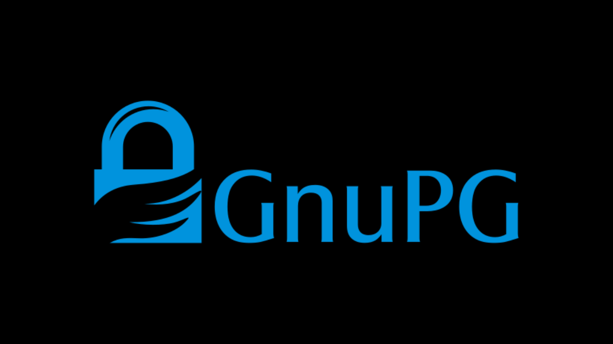

Při stahování softwaru je velmi důležité zajistit, aby nebyl upraven a že skutečně pochází z oficiálního zdroje. To platí zejména pro software související s Bitcoinem, jako je například peněženkový software, který vám umožňuje zabezpečit klíče k přístupu k vašim finančním prostředkům. V tomto tutoriálu si ukážeme, jak ověřit integritu a autentičnost softwaru před jeho instalací. Jako příklad použijeme Sparrow Wallet, oblíbený peněženkový software mezi bitcoinisty, ale postup bude stejný pro jakýkoli jiný software.

Ověření integrity zahrnuje zajištění, že stažený soubor nebyl upraven porovnáním jeho digitálního otisku (tj. jeho hash) s tím, který poskytl oficiální vývojář. Pokud se oba shodují, znamená to, že soubor je identický s originálem a nebyl poškozen nebo upraven útočníkem.

Ověření autentičnosti na druhou stranu zajišťuje, že soubor skutečně pochází od oficiálního vývojáře a ne od podvodníka. To se provádí ověřením digitálního podpisu. Tento podpis dokazuje, že software byl podepsán soukromým klíčem legitimního vývojáře.

Pokud tyto kontroly nejsou provedeny, existuje riziko instalace malwaru, který by mohl obsahovat upravený kód. Tento kód by mohl buď ukrást informace, jako jsou vaše soukromé klíče, nebo zablokovat přístup k vašim souborům. Tento typ útoku je poměrně běžný, zejména v kontextu open-source softwaru, kde mohou být distribuovány padělané verze.

Pro provedení této verifikace použijeme dva nástroje: hashovací funkce pro ověření integrity a GnuPG, open-source nástroj, který implementuje protokol PGP, pro ověření autentičnosti.

## Předpoklady

Pokud používáte **Linux**, GPG je předinstalován na většině distribucí. Pokud ne, můžete jej nainstalovat následujícím příkazem:

```bash
sudo apt install gnupg
```

Pro **macOS**, pokud jste ještě nenainstalovali správce balíčků Homebrew, proveďte to následujícími příkazy:

```bash
/bin/bash -c "$(curl -fsSL https://raw.githubusercontent.com/Homebrew/install/HEAD/install.sh)"
```

```bash
echo 'eval "$(/opt/homebrew/bin/brew shellenv)"' >> ~/.zprofile
```

```bash
eval "$(/opt/homebrew/bin/brew shellenv)"
```

Poté nainstalujte GPG tímto příkazem:

```bash
brew install gnupg
```
Pro **Windows**, pokud nemáte GPG, můžete nainstalovat software [Gpg4win](https://www.gpg4win.org/).
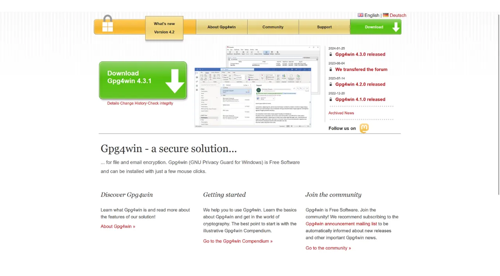

## Stahování dokumentů

Na začátku budeme potřebovat různé dokumenty. Navštivte oficiální stránku [Sparrow Wallet v sekci "*Download*"](https://sparrowwallet.com/download/). Pokud chcete ověřit jiný software, přejděte na webovou stránku tohoto softwaru.


Můžete také jít [do GitHub repozitáře projektu](https://github.com/sparrowwallet/sparrow/releases).

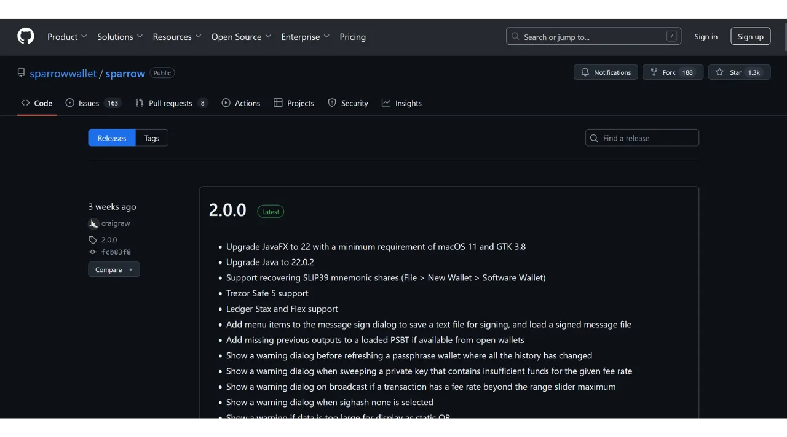

Stáhněte si instalační program pro software odpovídající vašemu operačnímu systému.

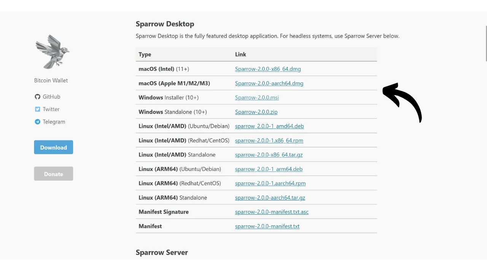

Budete také potřebovat hash souboru, často nazývaný "*SHA256SUMS*" nebo "*MANIFEST*".

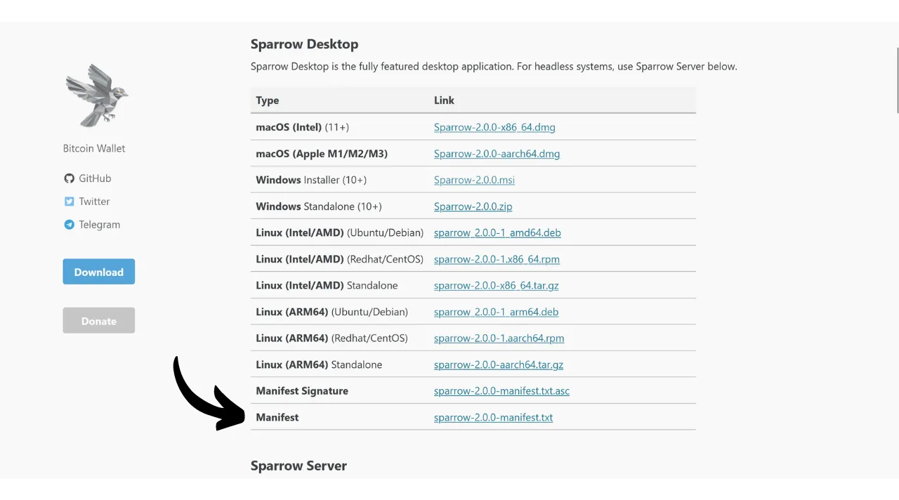

Stáhněte si také PGP podpis souboru. To je dokument ve formátu `.asc`.

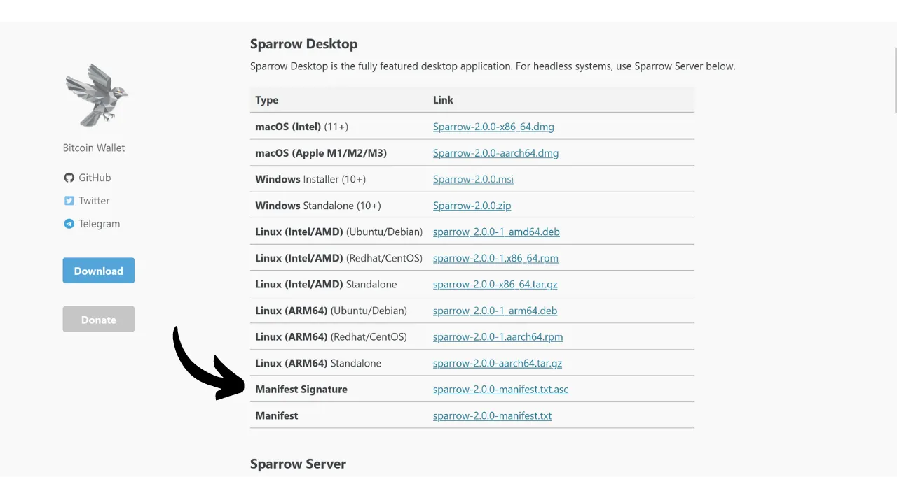
Ujistěte se, že všechny tyto soubory umístíte do stejné složky pro následující kroky.
Nakonec budete potřebovat veřejný klíč vývojáře, který použijeme k ověření PGP podpisu. Tento klíč je často dostupný buď na webových stránkách softwaru, na GitHub repozitáři projektu, někdy na sociálních médiích vývojáře, nebo na specializovaných stránkách jako je Keybase. V případě Sparrow Wallet můžete najít veřejný klíč vývojáře Craiga Rawa [na Keybase](https://keybase.io/craigraw). Pro jeho přímé stažení z terminálu spusťte příkaz:

```bash
curl https://keybase.io/craigraw/pgp_keys.asc | gpg --import
```

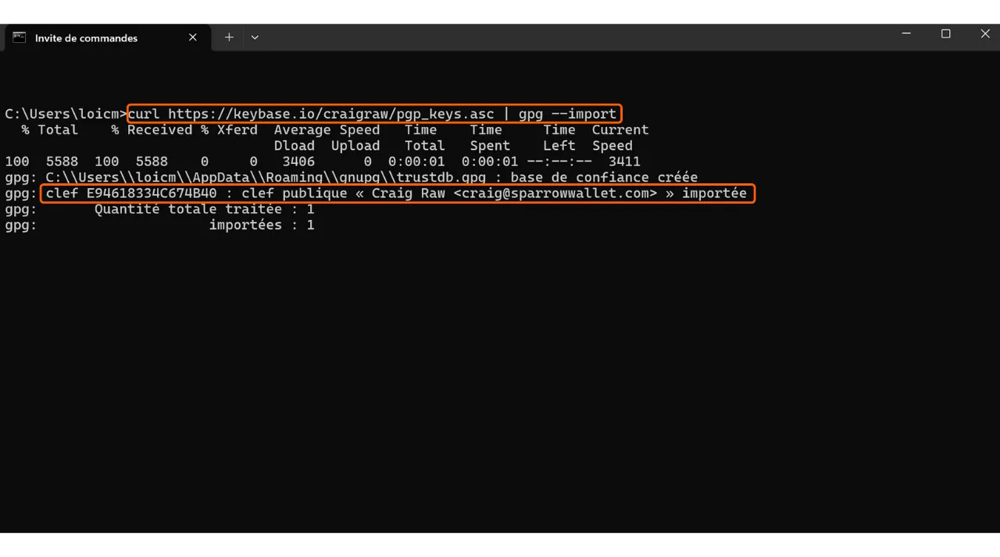

## Ověření podpisu

Proces ověření podpisu je stejný na **Windows**, **macOS** a **Linuxu**. Obvykle jste veřejný klíč již importovali v předchozím kroku, pokud ne, proveďte to s příkazem:

```bash
gpg --import [cesta k klíči]
```

Nahraďte `[cesta k klíči]` umístěním souboru s veřejným klíčem vývojáře.

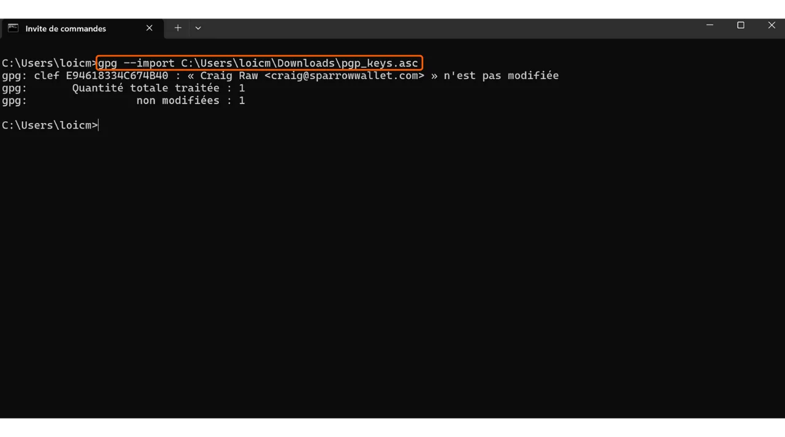

Podpis ověřte následujícím příkazem:

```bash
gpg --verify [soubor.asc]
```

Nahraďte `[soubor.asc]` cestou k souboru s podpisem. V případě Sparrow je tento soubor pojmenován "*sparrow-2.0.0-manifest.txt.asc*" pro verzi 2.0.0.

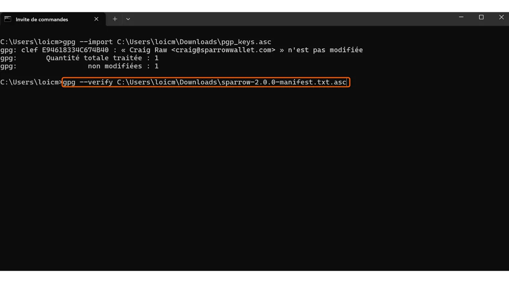

Pokud je podpis platný, GPG vám to oznámí. Poté můžete přejít k dalšímu kroku, protože to potvrzuje autentičnost souboru.

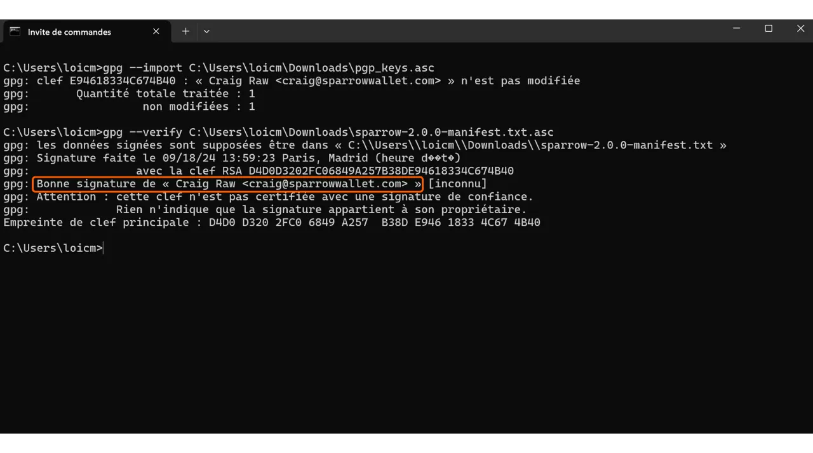

## Ověření hash

Nyní, když byla potvrzena autentičnost softwaru, je také nutné ověřit jeho integritu. Porovnáme hash softwaru s hashem poskytnutým vývojářem. Pokud se oba shodují, zaručuje to, že kód softwaru nebyl změněn.

Na **Windows** otevřete terminál a spusťte následující příkaz:

```bash
CertUtil -hashfile [cesta k souboru] SHA256 | findstr /v "hash"
```

Nahraďte `[cesta k souboru]` umístěním instalačního souboru.

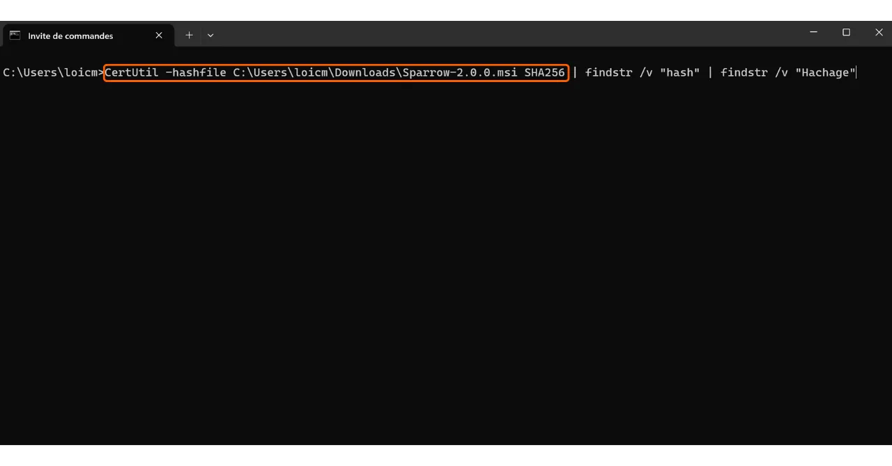

Terminál vrátí hash staženého softwaru.

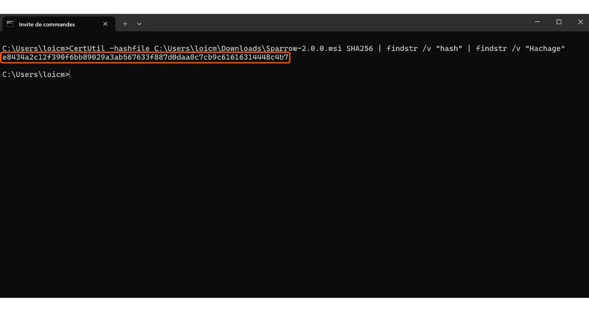

Buďte si vědomi, že pro některý software může být nutné použít jinou hash funkci než SHA256. V tomto případě jednoduše nahraďte název hash funkce v příkazu.

Poté porovnejte výsledek s odpovídající hodnotou v souboru "*sparrow-2.0.0-manifest.txt*".

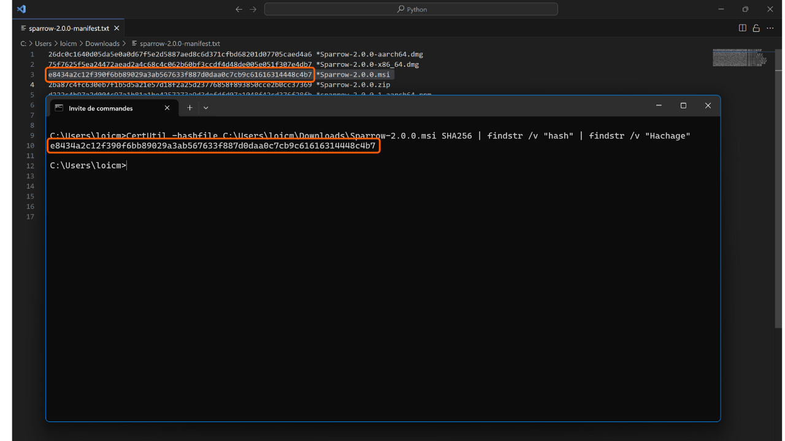

V mém případě vidíme, že se oba hashe dokonale shodují.

Na **macOS** a **Linuxu** je proces ověření hash automatizovaný. Není nutné ručně kontrolovat shodu mezi oběma hashi jako na Windows.

Jednoduše spusťte tento příkaz na **macOS**:

```bash
shasum --check [název souboru] --ignore-missing
```

Nahraďte `[název souboru]` názvem instalačního souboru. Například pro Sparrow Wallet:

```bash
shasum --check sparrow-2.0.0-manifest.txt --ignore-missing
```

Pokud se hashe shodují, měli byste vidět následující výstup:

```bash
Sparrow-2.0.0.dmg: OK
```
Na **Linuxu** je příkaz podobný:
```bash
sha256sum --check [název souboru] --ignore-missing
```

A pokud se hashe shodují, měli byste vidět následující výstup:

```bash
sparrow_2.0.0-1_amd64.deb: OK
```

Nyní máte jistotu, že software, který jste stáhli, je autentický a neporušený. Můžete pokračovat v jeho instalaci na vašem počítači.

Pokud se vám tento návod líbil, ocenil bych palec nahoru níže. Neváhejte tento článek sdílet na vašich sociálních sítích. Velmi vám děkuji!

Doporučuji také prohlédnout si tento další návod na VeraCrypt, software, který umožňuje šifrovat a dešifrovat úložná zařízení.

https://planb.network/tutorials/others/veracrypt